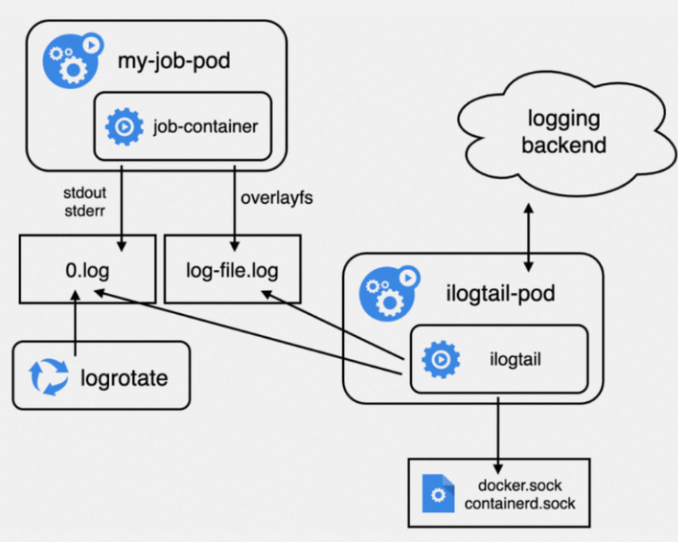
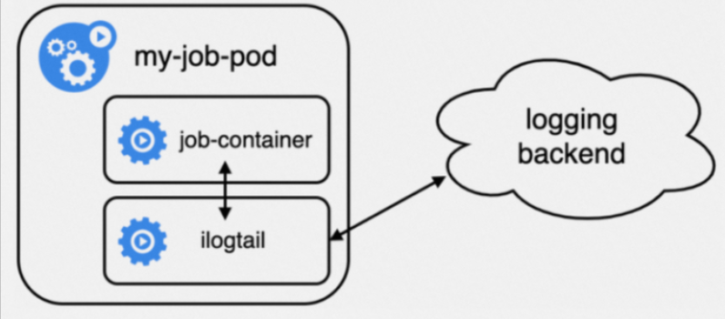

## Job容器的特点

1. 增删频率高：执行完毕就结束
2. 生命周期短： Job容器的预期就是执行完任务后退出，并非常驻服务，因此生命周期相对较短。有些Job仅仅用于简单地删除历史数据等，生命周期仅秒级。
3.  突发并发大：Job容器常在编排批处理任务或者测试场景使用，此类场景往往会瞬时触发大量Job容器实例的生成，并伴随生成大量日志。

## DaemonSet采集方式

 利用K8s的DaemonSet控制器在每一个节点上部署一个iLogtail容器用于该节点上所有容器的日志采集。  DaemonSet 相对资源占用要小很多，但扩展性、租户隔离性受限，比较适用于功能单一或业务不是很多的集群 

## Sidecar采集方式

 利用K8s同一个Pod内的容器可以共享存储卷的特性，在一个业务Pod内同时部署业务和采集容器以达到业务数据的目的。这种采集方式要求业务容器将需要采集的目录挂载出来与采集容器共享，采集容器则使用采集本地文件的方式采集业务容器日志。 

