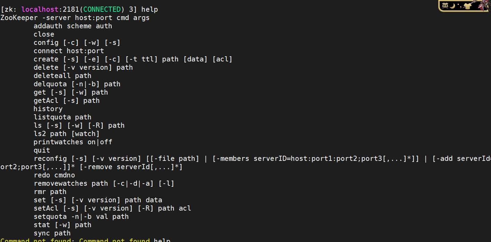
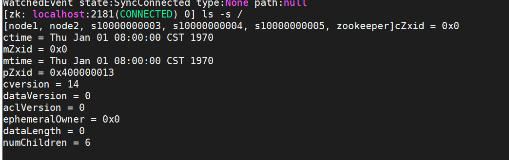
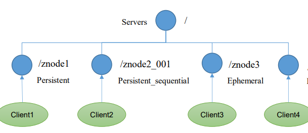
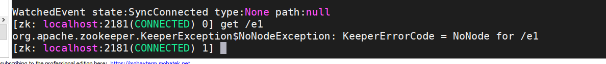
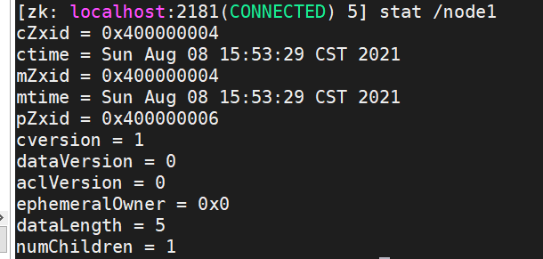
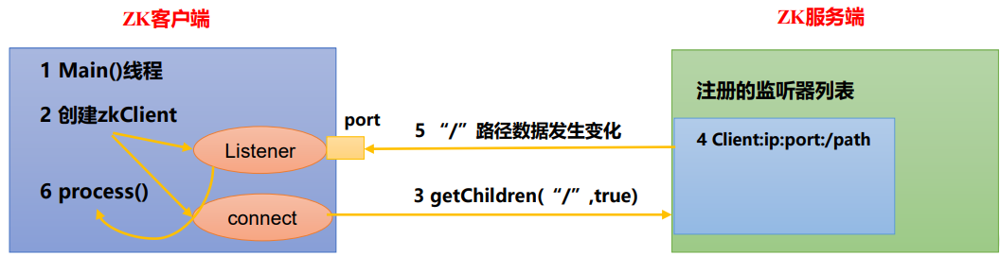

# 命令行

## 1. help显示所有操作的命令

```shell
[zk: localhost:2181(CONNECTED) 3] help
ZooKeeper -server host:port cmd args
        addauth scheme auth
        close
        config [-c] [-w] [-s]
        connect host:port
        create [-s] [-e] [-c] [-t ttl] path [data] [acl]
        delete [-v version] path
        deleteall path
        delquota [-n|-b] path
        get [-s] [-w] path
        getAcl [-s] path
        history
        listquota path
        ls [-s] [-w] [-R] path
        ls2 path [watch]
        printwatches on|off
        quit
        reconfig [-s] [-v version] [[-file path] | [-members serverID=host:port1:port2;port3[,...]*]] | [-add serverId=host:port1:port2;port3[,...]]* [-remove serverId[,...]*]
        redo cmdno
        removewatches path [-c|-d|-a] [-l]
        rmr path
        set [-s] [-v version] path data
        setAcl [-s] [-v version] [-R] path acl
        setquota -n|-b val path
        stat [-w] path
        sync path

```




## 2. ls path 查看节点

 使用 ls 命令来查看当前 znode 的子节点 [可监听]

>  -w 监听子节点变化
>
>  -s 附加次级信息  

```shell
[zk: localhost:2181(CONNECTED) 4] ls /
[zookeeper]
```

查看节点的详细信息：

```shell
ls -s /

[zk: localhost:2181(CONNECTED) 0] ls -s /
[node1, node2, s10000000003, s10000000004, s10000000005, zookeeper]
cZxid = 0x0
ctime = Thu Jan 01 08:00:00 CST 1970
mZxid = 0x0
mtime = Thu Jan 01 08:00:00 CST 1970
pZxid = 0x400000013
cversion = 14
dataVersion = 0
aclVersion = 0
ephemeralOwner = 0x0
dataLength = 0
numChildren = 6

```



1. **czxid：创建节点的事务 zxid** :  每次修改 ZooKeeper 状态都会产生一个 ZooKeeper 事务 ID。事务 ID 是 ZooKeeper 中所有修改总的次序。每次修改都有唯一的 zxid，如果 zxid1 小于 zxid2，那么 zxid1 在 zxid2 之 前发生。 
2.  ctime：znode 被创建的毫秒数（从 1970 年开始） 
3.  mzxid：znode 最后更新的事务 zxid 
4.  mtime：znode 最后修改的毫秒数（从 1970 年开始） 
5.  pZxid：znode 最后更新的子节点 zxid  
6.  cversion：znode 子节点变化号，znode 子节点修改次数 
7.  **dataversion：znode 数据变化号** 
8.  aclVersion：znode 访问控制列表的变化号  
9.  ephemeralOwner：如果是临时节点，这个是 znode 拥有者的 session id。如果不是 临时节点则是 0。 
10.  **dataLength：znode 的数据长度** 
11.  **numChildren：znode 子节点数量** 

## 3. create创建节点

create 普通创建 

> -s 含有序列 
>
> -e 临时（重启或者超时消失） 

### 节点类型



#### 持久节点Persistent(默认)

客户端与服务端断开连接后创建的节点不会删除。

```shell
[zk: localhost:2181(CONNECTED) 5] create /node1 "hello" 
Created /node1
[zk: localhost:2181(CONNECTED) 6] ls /
[node1, zookeeper]
[zk: localhost:2181(CONNECTED) 11] create /node1/p1 "world"
Created /node1/p1

```

#### 临时节点 Ephemeral 

客户端与zookeeper服务器断开后，该节点就会被删除。

```shell
create -e /e1 "haha"
```



#### 持久顺序节点

首先，因为是持久节点，所以断连后并不会删除，然后，这是一个顺序节点，会在创建的时候给该节点进行顺序编号。

说明：创建znode时设置顺序标识，znode名称 后会附加一个值，顺序号是一个单调递增的计数器，由父节点维护。

**注意：在分布式系统中，顺序号可以被用于为所有的事件进行全局排序，这样客户端可以通过顺序号推断事件的顺序**.

```shell
[zk: localhost:2181(CONNECTED) 2] create -s /s1 "sss"
Created /s10000000003
[zk: localhost:2181(CONNECTED) 3] create -s /s1 "sss"
Created /s10000000004
[zk: localhost:2181(CONNECTED) 4] create -s /s1 "sss"
Created /s10000000005
[zk: localhost:2181(CONNECTED) 5]

[zk: localhost:2181(CONNECTED) 6] ls /
[node1, node2, s10000000003, s10000000004, s10000000005, zookeeper]

```

#### 临时顺序节点

与服务端断开后删除，但是同样在创建的时候有顺序编号。

```shell
[zk: localhost:2181(CONNECTED) 9] create -s -e /es1 "eses"
Created /es10000000006
[zk: localhost:2181(CONNECTED) 10] create -s -e /es1 "eses"
Created /es10000000007
[zk: localhost:2181(CONNECTED) 11] create -s -e /es1 "eses"
Created /es10000000008
[zk: localhost:2181(CONNECTED) 12] create -s -e /es1 "eses"
Created /es10000000009

[zk: localhost:2181(CONNECTED) 13] ls /
[es10000000006, es10000000007, es10000000008, es10000000009, node1, node2, s10000000003, s10000000004, s10000000005, zookeeper]
[zk: localhost:2181(CONNECTED) 14]

```

当客户端与服务器断连后，临时节点将被删除：

```shell
[zk: localhost:2181(CONNECTED) 15] quit

WATCHER::

WatchedEvent state:Closed type:None path:null
2021-08-08 16:03:17,975 [myid:] - INFO  [main:ZooKeeper@1422] - Session: 0x200080d446e0002 closed
2021-08-08 16:03:17,975 [myid:] - INFO  [main-EventThread:ClientCnxn$EventThread@524] - EventThread shut down for session: 0x200080d446e0002

```

重新连接后 ls /

```shell
WatchedEvent state:SyncConnected type:None path:null
[zk: localhost:2181(CONNECTED) 0] ls /
[node1, node2, s10000000003, s10000000004, s10000000005, zookeeper]
[zk: localhost:2181(CONNECTED) 1]

```

可以看到临时节点已经没有了。

## 4. get path 获取节点znode的值

获得节点的值 [可监听]

>  -w 监听节点内容变化 
>
> -s 附加次级信息 

见zookeeper的监听机制

## 5. set 设置节点的具体值 

```shell
[zk: localhost:2181(CONNECTED) 6] get /node
node1   node2
[zk: localhost:2181(CONNECTED) 6] get /node1
hello
[zk: localhost:2181(CONNECTED) 7] set /node1 "setName"
[zk: localhost:2181(CONNECTED) 8] get /node1
setName

```

## 6. stat 查看节点状态

```shell
stat /node1
```



## 7. delete 删除节点 

```shell
delete /node1/node
```

## 8. deleteall 递归删除节点 

```shell
deleteall /node1/node
```

# zookeeper的监听器原理 

客户端注册监听它关心的目录节点，当目录节点发生变化（数据改变、节点删除、子目录节点增加删除）时，ZooKeeper 会通知客户端。监听机制保证ZooKeeper 保存的任何的数据的任何改变都能快速的响应到监听了该节点的应用程序。 

监听类型有两种： 一种是对路径的监听，一种是对数据的监听。

## 原理

1 ）首先要有一个main()线程。

2）在main线程中创建Zookeeper客户端，这时就会创建两个线 程，一个负责网络连接通信（connet），一个负责监听（listener）。

3）通过connect线程将注册的监听事件发送给Zookeeper。 

4）在Zookeeper的注册监听器列表中将注册的监听事件添加到列表中。 

5）Zookeeper监听到有数据或路径变化，就会将这个消息发送给listener线程。 

6）listener线程内部调用了process()方法。  




## 节点数据监听

对数据的监听我们使用`get` -w 命令。注册一次，只能监听一次。想要再次监听，需要注册多次。

```shell
get -w /node1
```


## 节点路径的监听

```shell
ls -w /node1
# 创建子节点
create /node1/newnode "newnode"

# 在监听客户端上可以接收到变化的通知
WATCHER::
WatchedEvent state:SyncConnected type:NodeChildrenChanged 
path:/node1

```

注意：节点的路径变化，也是注册一次，生效一次。想多次生效，就需要多次注册。 


#  客户端 API 操作  

1. 创建工程zookeeper

2. 导入pom文件

   ```shell
   <dependency>
               <groupId>junit</groupId>
               <artifactId>junit</artifactId>
               <version>4.13</version>
           </dependency>
           <dependency>
               <groupId>log4j</groupId>
               <artifactId>log4j</artifactId>
               <version>1.2.17</version>
           </dependency>
   
           <dependency>
               <groupId>org.apache.zookeeper</groupId>
               <artifactId>zookeeper</artifactId>
               <version>3.5.7</version>
           </dependency>
   ```


3. 创建客户端

   ```java
   package com.hongliang;
   
   import org.apache.zookeeper.WatchedEvent;
   import org.apache.zookeeper.Watcher;
   import org.apache.zookeeper.ZooKeeper;
   import org.junit.Before;
   import org.junit.Test;
   
   import java.io.File;
   import java.io.IOException;
   
   /**
    * @author Hongliang Zhu
    * @create 2021-08-08 18:59
    */
   public class ZkClient {
   
       private final String connectString = "192.168.160.200:2181,192.168.160.201:2181,192.168.203:2181";
       private int sessionTimeOut = 2000;
       ZooKeeper zkClient = null;
   
   
       @Test
       public void init() throws IOException {
            zkClient = new ZooKeeper(connectString, sessionTimeOut, new Watcher() {
               public void process(WatchedEvent watchedEvent) {
               }
           });
   
       }
   
   }
   
   ```

   