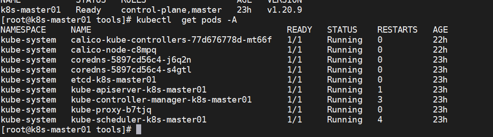
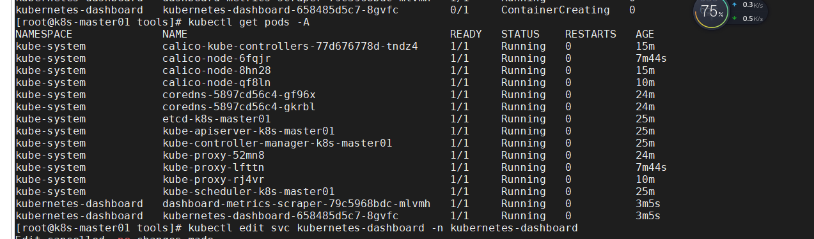
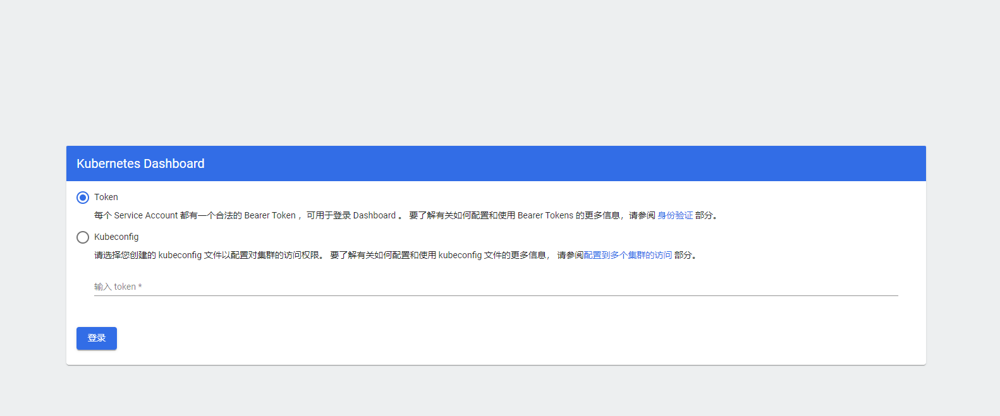
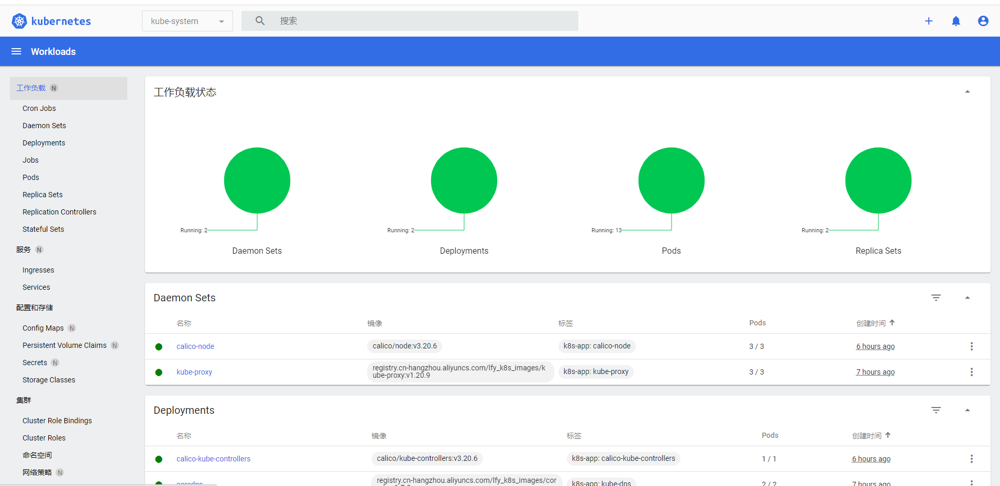
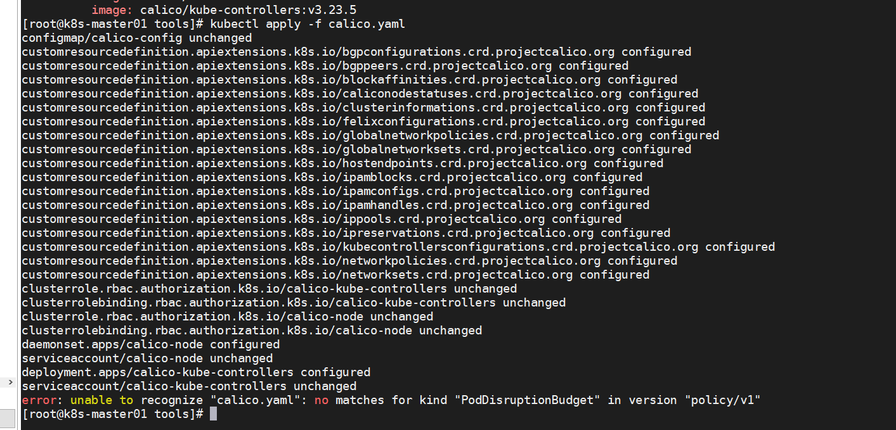
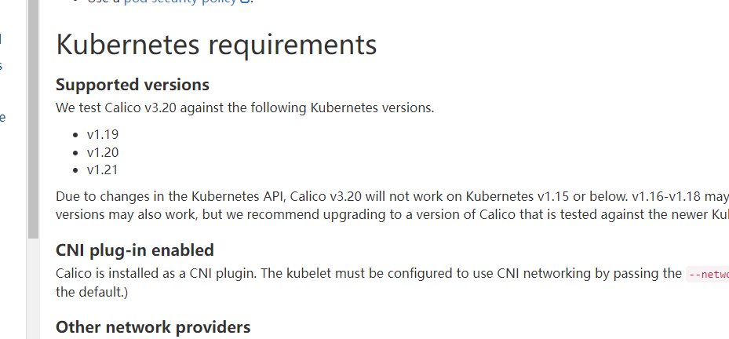
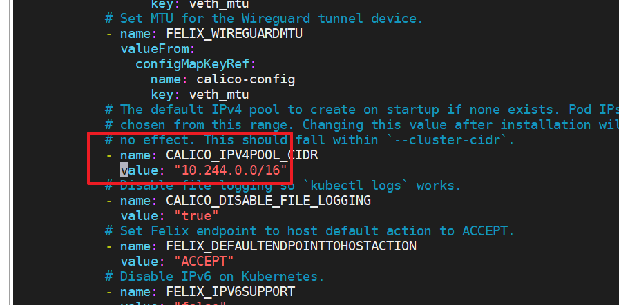

## 1. 主节点初始化

```shell
#主节点初始化
kubeadm init \
--apiserver-advertise-address=192.168.160.140 \
--control-plane-endpoint=cluster-endpoint \
--image-repository registry.cn-hangzhou.aliyuncs.com/lfy_k8s_images \
--kubernetes-version v1.20.9 \
--service-cidr=10.96.0.0/16 \
--pod-network-cidr=10.244.0.0/16
```


## 2. 重装k8s

首先需要删除k8s所有的节点。 kubectl drain 安全驱逐节点上面所有的 pod，--ignore-daemonsets往往需要指定的，这是因为deamonset会忽略SchedulingDisabled标签（使用kubectl drain时会自动给节点打上不可调度SchedulingDisabled标签），因此deamonset控制器控制的pod被删除后，可能马上又在此节点上启动起来,这样就会成为死循环。因此这里忽略daemonset。

```shell
kubectl drain k8s-node01 --ignore-daemonsets  --delete-emptydir-data
 kubectl delete node k8s-node01
 
 node/k8s-node02 cordoned
WARNING: ignoring DaemonSet-managed Pods: kube-system/calico-node-l4tmd
evicting pod kubernetes-dashboard/kubernetes-dashboard-658485d5c7-fl6qm
evicting pod kubernetes-dashboard/dashboard-metrics-scraper-79c5968bdc-dpzfq
evicting pod kube-system/calico-kube-controllers-77d676778d-lbqsq
pod/calico-kube-controllers-77d676778d-lbqsq evicted
pod/kubernetes-dashboard-658485d5c7-fl6qm evicted
pod/dashboard-metrics-scraper-79c5968bdc-dpzfq evicted
node/k8s-node02 evicted
[root@k8s-master01 ~]# kubectl delete node k8s-node02
node "k8s-node02" deleted
[root@k8s-master01 ~]# kubectl get nodes
NAME           STATUS   ROLES    AGE     VERSION
k8s-master01   Ready    <none>   2d13h   v1.20.9
[root@k8s-master01 ~]#

```

 重新初始化k8s集群的时候，需要清空原先的设置 

```shell
[root@k8s-master01 ~]# kubeadm reset
[reset] Reading configuration from the cluster...
[reset] FYI: You can look at this config file with 'kubectl -n kube-system get cm kubeadm-config -o yaml'
W0405 20:24:12.072500   14669 reset.go:99] [reset] Unable to fetch the kubeadm-config ConfigMap from cluster: failed to get config map: configmaps "kubeadm-config" not found
[reset] WARNING: Changes made to this host by 'kubeadm init' or 'kubeadm join' will be reverted.
[reset] Are you sure you want to proceed? [y/N]: y
[preflight] Running pre-flight checks
W0405 20:24:14.356097   14669 removeetcdmember.go:79] [reset] No kubeadm config, using etcd pod spec to get data directory
[reset] Stopping the kubelet service
[reset] Unmounting mounted directories in "/var/lib/kubelet"
[reset] Deleting contents of config directories: [/etc/kubernetes/manifests /etc/kubernetes/pki]
[reset] Deleting files: [/etc/kubernetes/admin.conf /etc/kubernetes/kubelet.conf /etc/kubernetes/bootstrap-kubelet.conf /etc/kubernetes/controller-manager.conf /etc/kubernetes/scheduler.conf]
[reset] Deleting contents of stateful directories: [/var/lib/etcd /var/lib/kubelet /var/lib/dockershim /var/run/kubernetes /var/lib/cni]

The reset process does not clean CNI configuration. To do so, you must remove /etc/cni/net.d

The reset process does not reset or clean up iptables rules or IPVS tables.
If you wish to reset iptables, you must do so manually by using the "iptables" command.

If your cluster was setup to utilize IPVS, run ipvsadm --clear (or similar)
to reset your system's IPVS tables.

The reset process does not clean your kubeconfig files and you must remove them manually.
Please, check the contents of the $HOME/.kube/config file.

```

然后执行主节点初始化即可。


## 3. 搭建成功

```shell

[bootstrap-token] Creating the "cluster-info" ConfigMap in the "kube-public" namespace
[kubelet-finalize] Updating "/etc/kubernetes/kubelet.conf" to point to a rotatable kubelet client certificate and key
[addons] Applied essential addon: CoreDNS
[addons] Applied essential addon: kube-proxy

Your Kubernetes control-plane has initialized successfully!

To start using your cluster, you need to run the following as a regular user:

  mkdir -p $HOME/.kube
  sudo cp -i /etc/kubernetes/admin.conf $HOME/.kube/config
  sudo chown $(id -u):$(id -g) $HOME/.kube/config

Alternatively, if you are the root user, you can run:

  export KUBECONFIG=/etc/kubernetes/admin.conf

You should now deploy a pod network to the cluster.
Run "kubectl apply -f [podnetwork].yaml" with one of the options listed at:
  https://kubernetes.io/docs/concepts/cluster-administration/addons/

You can now join any number of control-plane nodes by copying certificate authorities
and service account keys on each node and then running the following as root:

  kubeadm join cluster-endpoint:6443 --token vsajzc.vkb6ehema20n5cf3 \
    --discovery-token-ca-cert-hash sha256:b88e44df9ab988f756ea2682bcba7ddfdef60209786c3c9ec619a86431e28f00 \
    --control-plane

Then you can join any number of worker nodes by running the following on each as root:

kubeadm join cluster-endpoint:6443 --token vsajzc.vkb6ehema20n5cf3 \
    --discovery-token-ca-cert-hash sha256:b88e44df9ab988f756ea2682bcba7ddfdef60209786c3c9ec619a86431e28f00
[root@k8s-master01 tools]#


Your Kubernetes control-plane has initialized successfully!

To start using your cluster, you need to run the following as a regular user:

  mkdir -p $HOME/.kube
  sudo cp -i /etc/kubernetes/admin.conf $HOME/.kube/config
  sudo chown $(id -u):$(id -g) $HOME/.kube/config

Alternatively, if you are the root user, you can run:

  export KUBECONFIG=/etc/kubernetes/admin.conf

You should now deploy a pod network to the cluster.
Run "kubectl apply -f [podnetwork].yaml" with one of the options listed at:
  https://kubernetes.io/docs/concepts/cluster-administration/addons/

You can now join any number of control-plane nodes by copying certificate authorities
and service account keys on each node and then running the following as root:

  kubeadm join cluster-endpoint:6443 --token 7os6h6.1adxkajypcv5v5ol \
    --discovery-token-ca-cert-hash sha256:ca11b68af6609124b6be9a53358cc54e0ea97afaebe4cf38fb075a8102a0dd5f \
    --control-plane

Then you can join any number of worker nodes by running the following on each as root:

kubeadm join cluster-endpoint:6443 --token 7os6h6.1adxkajypcv5v5ol \
    --discovery-token-ca-cert-hash sha256:ca11b68af6609124b6be9a53358cc54e0ea97afaebe4cf38fb075a8102a0dd5f


```

验证下：

```shell

[root@k8s-master01 .kube]# kubectl get nodes
NAME           STATUS     ROLES                  AGE     VERSION
k8s-master01   NotReady   control-plane,master   6m31s   v1.20.9

```

calico pod也正常了：（经过一夜的等待...）




## 4. 安装dashboard

kubernetes官方提供的可视化界面

https://github.com/kubernetes/dashboard

```shell
kubectl apply -f https://raw.githubusercontent.com/kubernetes/dashboard/v2.3.1/aio/deploy/recommended.yaml
```

```yaml
# Copyright 2017 The Kubernetes Authors.
#
# Licensed under the Apache License, Version 2.0 (the "License");
# you may not use this file except in compliance with the License.
# You may obtain a copy of the License at
#
#     http://www.apache.org/licenses/LICENSE-2.0
#
# Unless required by applicable law or agreed to in writing, software
# distributed under the License is distributed on an "AS IS" BASIS,
# WITHOUT WARRANTIES OR CONDITIONS OF ANY KIND, either express or implied.
# See the License for the specific language governing permissions and
# limitations under the License.

apiVersion: v1
kind: Namespace
metadata:
  name: kubernetes-dashboard

---

apiVersion: v1
kind: ServiceAccount
metadata:
  labels:
    k8s-app: kubernetes-dashboard
  name: kubernetes-dashboard
  namespace: kubernetes-dashboard

---

kind: Service
apiVersion: v1
metadata:
  labels:
    k8s-app: kubernetes-dashboard
  name: kubernetes-dashboard
  namespace: kubernetes-dashboard
spec:
  ports:
    - port: 443
      targetPort: 8443
  selector:
    k8s-app: kubernetes-dashboard

---

apiVersion: v1
kind: Secret
metadata:
  labels:
    k8s-app: kubernetes-dashboard
  name: kubernetes-dashboard-certs
  namespace: kubernetes-dashboard
type: Opaque

---

apiVersion: v1
kind: Secret
metadata:
  labels:
    k8s-app: kubernetes-dashboard
  name: kubernetes-dashboard-csrf
  namespace: kubernetes-dashboard
type: Opaque
data:
  csrf: ""

---

apiVersion: v1
kind: Secret
metadata:
  labels:
    k8s-app: kubernetes-dashboard
  name: kubernetes-dashboard-key-holder
  namespace: kubernetes-dashboard
type: Opaque

---

kind: ConfigMap
apiVersion: v1
metadata:
  labels:
    k8s-app: kubernetes-dashboard
  name: kubernetes-dashboard-settings
  namespace: kubernetes-dashboard

---

kind: Role
apiVersion: rbac.authorization.k8s.io/v1
metadata:
  labels:
    k8s-app: kubernetes-dashboard
  name: kubernetes-dashboard
  namespace: kubernetes-dashboard
rules:
  # Allow Dashboard to get, update and delete Dashboard exclusive secrets.
  - apiGroups: [""]
    resources: ["secrets"]
    resourceNames: ["kubernetes-dashboard-key-holder", "kubernetes-dashboard-certs", "kubernetes-dashboard-csrf"]
    verbs: ["get", "update", "delete"]
    # Allow Dashboard to get and update 'kubernetes-dashboard-settings' config map.
  - apiGroups: [""]
    resources: ["configmaps"]
    resourceNames: ["kubernetes-dashboard-settings"]
    verbs: ["get", "update"]
    # Allow Dashboard to get metrics.
  - apiGroups: [""]
    resources: ["services"]
    resourceNames: ["heapster", "dashboard-metrics-scraper"]
    verbs: ["proxy"]
  - apiGroups: [""]
    resources: ["services/proxy"]
    resourceNames: ["heapster", "http:heapster:", "https:heapster:", "dashboard-metrics-scraper", "http:dashboard-metrics-scraper"]
    verbs: ["get"]

---

kind: ClusterRole
apiVersion: rbac.authorization.k8s.io/v1
metadata:
  labels:
    k8s-app: kubernetes-dashboard
  name: kubernetes-dashboard
rules:
  # Allow Metrics Scraper to get metrics from the Metrics server
  - apiGroups: ["metrics.k8s.io"]
    resources: ["pods", "nodes"]
    verbs: ["get", "list", "watch"]

---

apiVersion: rbac.authorization.k8s.io/v1
kind: RoleBinding
metadata:
  labels:
    k8s-app: kubernetes-dashboard
  name: kubernetes-dashboard
  namespace: kubernetes-dashboard
roleRef:
  apiGroup: rbac.authorization.k8s.io
  kind: Role
  name: kubernetes-dashboard
subjects:
  - kind: ServiceAccount
    name: kubernetes-dashboard
    namespace: kubernetes-dashboard

---

apiVersion: rbac.authorization.k8s.io/v1
kind: ClusterRoleBinding
metadata:
  name: kubernetes-dashboard
roleRef:
  apiGroup: rbac.authorization.k8s.io
  kind: ClusterRole
  name: kubernetes-dashboard
subjects:
  - kind: ServiceAccount
    name: kubernetes-dashboard
    namespace: kubernetes-dashboard

---

kind: Deployment
apiVersion: apps/v1
metadata:
  labels:
    k8s-app: kubernetes-dashboard
  name: kubernetes-dashboard
  namespace: kubernetes-dashboard
spec:
  replicas: 1
  revisionHistoryLimit: 10
  selector:
    matchLabels:
      k8s-app: kubernetes-dashboard
  template:
    metadata:
      labels:
        k8s-app: kubernetes-dashboard
    spec:
      containers:
        - name: kubernetes-dashboard
          image: kubernetesui/dashboard:v2.3.1
          imagePullPolicy: Always
          ports:
            - containerPort: 8443
              protocol: TCP
          args:
            - --auto-generate-certificates
            - --namespace=kubernetes-dashboard
            # Uncomment the following line to manually specify Kubernetes API server Host
            # If not specified, Dashboard will attempt to auto discover the API server and connect
            # to it. Uncomment only if the default does not work.
            # - --apiserver-host=http://my-address:port
          volumeMounts:
            - name: kubernetes-dashboard-certs
              mountPath: /certs
              # Create on-disk volume to store exec logs
            - mountPath: /tmp
              name: tmp-volume
          livenessProbe:
            httpGet:
              scheme: HTTPS
              path: /
              port: 8443
            initialDelaySeconds: 30
            timeoutSeconds: 30
          securityContext:
            allowPrivilegeEscalation: false
            readOnlyRootFilesystem: true
            runAsUser: 1001
            runAsGroup: 2001
      volumes:
        - name: kubernetes-dashboard-certs
          secret:
            secretName: kubernetes-dashboard-certs
        - name: tmp-volume
          emptyDir: {}
      serviceAccountName: kubernetes-dashboard
      nodeSelector:
        "kubernetes.io/os": linux
      # Comment the following tolerations if Dashboard must not be deployed on master
      tolerations:
        - key: node-role.kubernetes.io/master
          effect: NoSchedule

---

kind: Service
apiVersion: v1
metadata:
  labels:
    k8s-app: dashboard-metrics-scraper
  name: dashboard-metrics-scraper
  namespace: kubernetes-dashboard
spec:
  ports:
    - port: 8000
      targetPort: 8000
  selector:
    k8s-app: dashboard-metrics-scraper

---

kind: Deployment
apiVersion: apps/v1
metadata:
  labels:
    k8s-app: dashboard-metrics-scraper
  name: dashboard-metrics-scraper
  namespace: kubernetes-dashboard
spec:
  replicas: 1
  revisionHistoryLimit: 10
  selector:
    matchLabels:
      k8s-app: dashboard-metrics-scraper
  template:
    metadata:
      labels:
        k8s-app: dashboard-metrics-scraper
      annotations:
        seccomp.security.alpha.kubernetes.io/pod: 'runtime/default'
    spec:
      containers:
        - name: dashboard-metrics-scraper
          image: kubernetesui/metrics-scraper:v1.0.6
          ports:
            - containerPort: 8000
              protocol: TCP
          livenessProbe:
            httpGet:
              scheme: HTTP
              path: /
              port: 8000
            initialDelaySeconds: 30
            timeoutSeconds: 30
          volumeMounts:
          - mountPath: /tmp
            name: tmp-volume
          securityContext:
            allowPrivilegeEscalation: false
            readOnlyRootFilesystem: true
            runAsUser: 1001
            runAsGroup: 2001
      serviceAccountName: kubernetes-dashboard
      nodeSelector:
        "kubernetes.io/os": linux
      # Comment the following tolerations if Dashboard must not be deployed on master
      tolerations:
        - key: node-role.kubernetes.io/master
          effect: NoSchedule
      volumes:
        - name: tmp-volume
          emptyDir: {}
```


网络问题，可以直接下载这个yanl文件下来，执行以下命令

```shell
 kubectl apply -f kube-dash.yaml
```

配置访问端口：

```shell
kubectl edit svc kubernetes-dashboard -n kubernetes-dashboard
```

type: ClusterIP 改为 type: NodePort




```shell

[root@k8s-master01 tools]# kubectl get pods -A
NAMESPACE              NAME                                         READY   STATUS    RESTARTS   AGE
kube-system            calico-kube-controllers-77d676778d-tndz4     1/1     Running   0          15m
kube-system            calico-node-6fqjr                            1/1     Running   0          7m44s
kube-system            calico-node-8hn28                            1/1     Running   0          15m
kube-system            calico-node-qf8ln                            1/1     Running   0          10m
kube-system            coredns-5897cd56c4-gf96x                     1/1     Running   0          24m
kube-system            coredns-5897cd56c4-gkrbl                     1/1     Running   0          24m
kube-system            etcd-k8s-master01                            1/1     Running   0          25m
kube-system            kube-apiserver-k8s-master01                  1/1     Running   0          25m
kube-system            kube-controller-manager-k8s-master01         1/1     Running   0          25m
kube-system            kube-proxy-52mn8                             1/1     Running   0          24m
kube-system            kube-proxy-lfttn                             1/1     Running   0          7m44s
kube-system            kube-proxy-rj4vr                             1/1     Running   0          10m
kube-system            kube-scheduler-k8s-master01                  1/1     Running   0          25m
kubernetes-dashboard   dashboard-metrics-scraper-79c5968bdc-mlvmh   1/1     Running   0          3m5s
kubernetes-dashboard   kubernetes-dashboard-658485d5c7-8gvfc        1/1     Running   0          3m5s

```





## 5、创建访问账号

```yaml
#创建访问账号，准备一个yaml文件； vi dash.yaml
apiVersion: v1
kind: ServiceAccount
metadata:
  name: admin-user
  namespace: kubernetes-dashboard
---
apiVersion: rbac.authorization.k8s.io/v1
kind: ClusterRoleBinding
metadata:
  name: admin-user
roleRef:
  apiGroup: rbac.authorization.k8s.io
  kind: ClusterRole
  name: cluster-admin
subjects:
- kind: ServiceAccount
  name: admin-user
  namespace: kubernetes-dashboard
```

## 6. 获取访问令牌token

```shell
#获取访问令牌
kubectl -n kubernetes-dashboard get secret $(kubectl -n kubernetes-dashboard get sa/admin-user -o jsonpath="{.secrets[0].name}") -o go-template="{{.data.token | base64decode}}"


eyJhbGciOiJSUzI1NiIsImtpZCI6Ik15V1VPYlNFbVRhN3RNanJqUTlRUU1pclZGVUxfc20ySUstVlhMMl9QZTgifQ.eyJpc3MiOiJrdWJlcm5ldGVzL3NlcnZpY2VhY2NvdW50Iiwia3ViZXJuZXRlcy5pby9zZXJ2aWNlYWNjb3VudC9uYW1lc3BhY2UiOiJrdWJlcm5ldGVzLWRhc2hib2FyZCIsImt1YmVybmV0ZXMuaW8vc2VydmljZWFjY291bnQvc2VjcmV0Lm5hbWUiOiJhZG1pbi11c2VyLXRva2VuLXRranRoIiwia3ViZXJuZXRlcy5pby9zZXJ2aWNlYWNjb3VudC9zZXJ2aWNlLWFjY291bnQubmFtZSI6ImFkbWluLXVzZXIiLCJrdWJlcm5ldGVzLmlvL3NlcnZpY2VhY2NvdW50L3NlcnZpY2UtYWNjb3VudC51aWQiOiIxZGY1NDBlYS04NGRiLTRlYjMtODRkYi0yODFiNjRhOWFmMmEiLCJzdWIiOiJzeXN0ZW06c2VydmljZWFjY291bnQ6a3ViZXJuZXRlcy1kYXNoYm9hcmQ6YWRtaW4tdXNlciJ9.b5QvU9N6VVYRnUYcY0H409IXBmmUxgYBBwAX0gWkyKZ_SAXPjpOocCZCrQrqTTRonKHRAv1iWvrlcZwGMperkXDu-jkq6poTyxnxDjVDSc5rhuzkZKOkJNqrnqVhORNPj9MPFsFoKhviszQTi2ujCpGLkXf46OqDcY4393p3fMfrLJlsIENkf0i31bJvmP_oFaG8OA2sSPH3qBwSABHUiw50A0600fbVYjiDb3909F-8GMSkzHRnj4W1AkFfONGE5Werz6DoNOqlryoD3lQ76QSVYU1FMeNLwAop2qMpihDE6EMR4s-LzGuGt5efT0XFfOSAkEiQSgoGI3P-4ZCd7A
```

至此，可以看到k8s的界面了：



## 7. 踩坑

### 1、 安装网络插件

error: unable to recognize "calico.yaml": no matches for kind "PodDisruptionBudget" in version "policy/v1"



原因： 与k8s版本不匹配：https://docs.tigera.io/archive/v3.20/getting-started/kubernetes/requirements

```shell

[root@k8s-master01 tools]# kubectl version
Client Version: version.Info{Major:"1", Minor:"20", GitVersion:"v1.20.9", GitCommit:"7a576bc3935a6b555e33346fd73ad77c925e9e4a", GitTreeState:"clean", BuildDate:"2021-07-15T21:01:38Z", GoVersion:"go1.15.14", Compiler:"gc", Platform:"linux/amd64"}
Server Version: version.Info{Major:"1", Minor:"20", GitVersion:"v1.20.9", GitCommit:"7a576bc3935a6b555e33346fd73ad77c925e9e4a", GitTreeState:"clean", BuildDate:"2021-07-15T20:56:38Z", GoVersion:"go1.15.14", Compiler:"gc", Platform:"linux/amd64"}
[root@k8s-master01 tools]#

```



下载正确的版本：

```shell

curl https://docs.projectcalico.org/v3.20/manifests/calico.yaml -O

```

注意：需要更改两个地方



 由于默认的Calico清单文件中所使用的镜像来源于docker.io国外镜像源，上面我们配置了Docker镜像加速，应删除docker.io前缀以使镜像从国内镜像加速站点下载。 

```shell
[root@k8s-master01 ~]# cat calico.yaml |grep 'image:'
          image: docker.io/calico/cni:v3.23.0
          image: docker.io/calico/cni:v3.23.0
          image: docker.io/calico/node:v3.23.0
          image: docker.io/calico/kube-controllers:v3.23.0
[root@k8s-master01 ~]# sed -i 's#docker.io/##g' calico.yaml
[root@k8s-master01 ~]# cat calico.yaml |grep 'image:'
          image: calico/cni:v3.23.0
          image: calico/cni:v3.23.0
          image: calico/node:v3.23.0
          image: calico/kube-controllers:v3.23.0
```


## 8. 参考资料

1、 kubadm部署k8s时service-cidr网络和pod-network-cidr的地址如何定义： https://blog.csdn.net/weixin_36755535/article/details/127393197

2、https://www.cnblogs.com/renshengdezheli/p/16686997.html#32-%E5%88%A0%E9%99%A4k8s%E6%89%80%E6%9C%89%E8%8A%82%E7%82%B9node