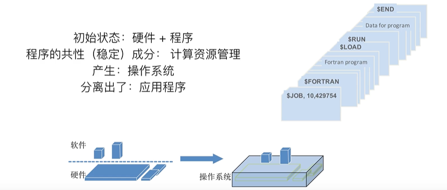
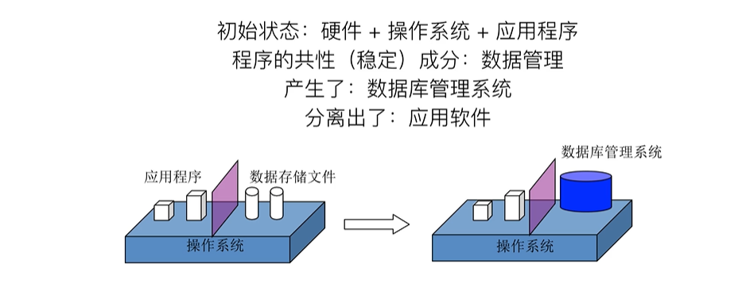
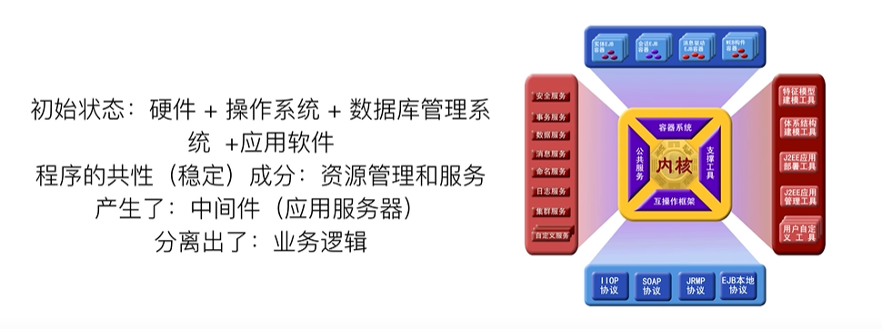
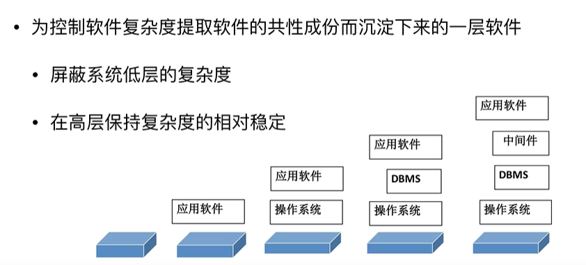

# 软件体系结构-分层架构

## 发展

软件系统之间产生了许多共性：资源管理，硬盘、文件、接口等管理在不同软件下都是一样的，所以把这些共性的部分提取出来，形成了操作系统。而操作系统本身也是软件，在操作系统的基础上，各个软件来实现其不同的功能，而资源管理全部交给了操作系统。

除了资源上的共性，在应用软件之间还有其他的共性：数据管理。产生了数据库管理系统。各种对数据的管理，操作等全部交给数据库管理系统去操作。分离出了应用软件。

## 历程

 