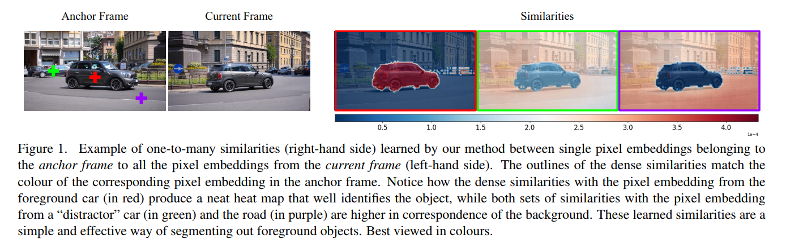
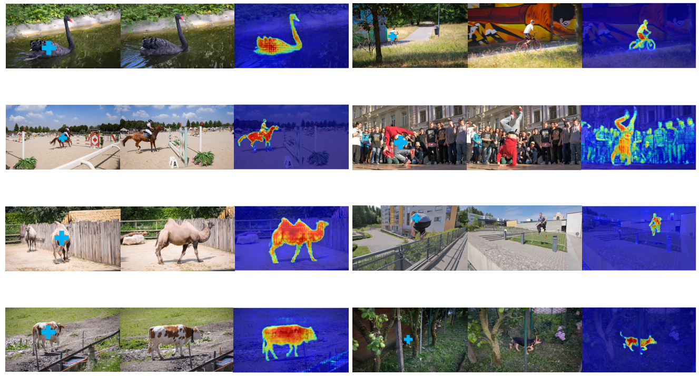
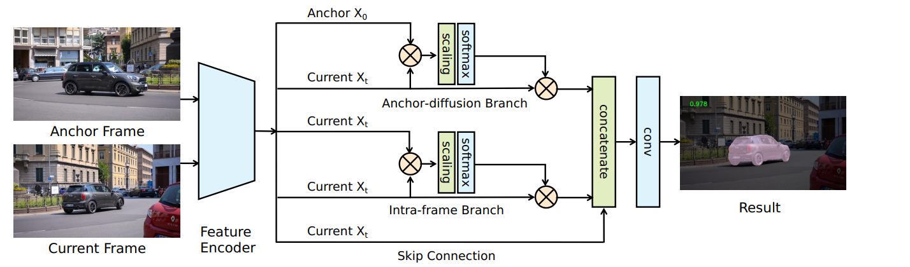
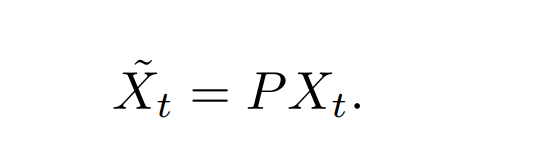
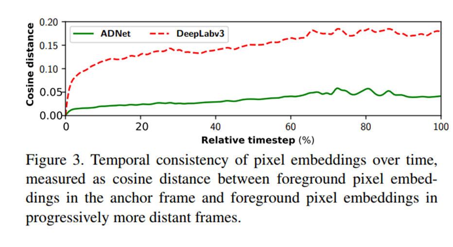
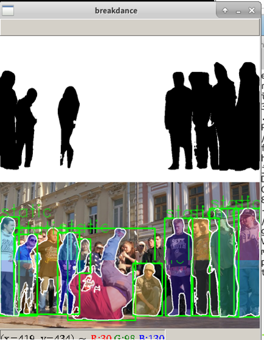
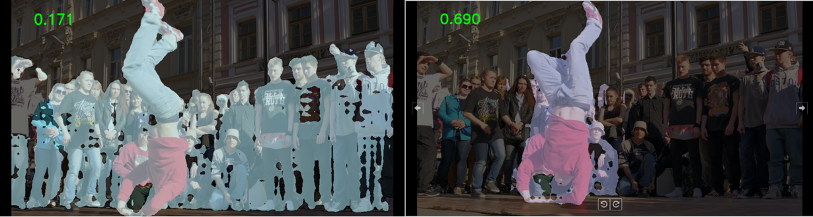
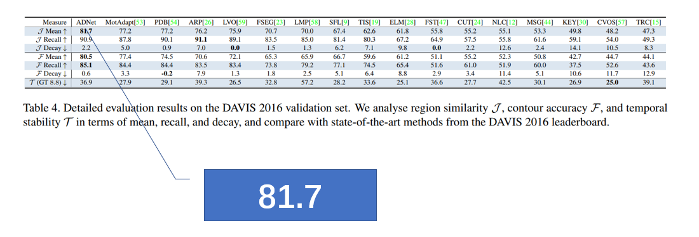

---

title: Anchor Diffusion for Unsupervised Video Object Segmentation
date: 2020-02-21 21:42:03
tags:
	- papers
	- UVOS
categories: 
	- 论文阅读
cover: /img/cover/anchor.png
toc: true
---

# Anchor Diffusion for Unsupervised Video Object Segmentation

# 基于“锚扩散”的无监督视频目标分割

### github：  https://github.com/yz93/anchor-diff-VOS  

# 概述

​		论文指出了目前的视频目标分割方法存在的缺点。提出更简单的方法，基它基于学习属于帧的像素之间的相似性，这些帧在时间上可以任意地相隔很远。这种方法能够处理long-term的依赖关系。

​		这篇论文受**Non-local operators**的启发提出了一个简单而有效的模型无监督视频目标分割模型，可以捕获**长期依赖**。通过将“锚帧”的嵌入像素与当前的帧建立联系，可以学习到任意长距离的成对依赖关系。在Davis2016数据集上取得了第一名的成绩。

​		追踪基于时间变化的的目标，现在流行的方法是通过在视频序列中的**光流**或者使用RNN对运动信息进行建模。这些方法持续将前面的特征传到当前帧，让当前帧的预测依赖于整个历史的帧。但是RNNs常常依赖于训练技术，如通过时间的截断反向传播来降低参数更新的成本，这限制了它们的长期建模能力。虽然LSTM的门控机制缓解了梯度消失的问题。但在训练中，梯度爆炸的现象往往需要对梯度的范数进行裁剪或重新调整。

​		光流向量只能预测视频中每一帧的**单步运动**线索，这样会累积误差。而且计算成本很高。使用这些方法会产生不准确的结果，**特别是当前景物体几乎是静态的时候**。

​		基于双流的模型有三个缺点：

​		第一：流估计网络通常是在合成数据集上训练的，因此在现实世界中部署时可能会导致较差的性能。
​		第二：虽然建模长期的时间依赖关系对于适应重大的在线变化是至关重要的，但是向量场只能建模短期的一					步依赖关系。
​		第三： 当前景和背景以同步方式移动时，向量场无法区分它们，即前景与背景相同的运动。

---

# 方法

我们的方法从属于锚帧的单个像素嵌入到当前帧(左侧)的所有像素嵌入之间学习**一对多相似性**的例子(右侧)。稠密相似点的轮廓与锚框中相应像素嵌入的颜色相匹配。注意的相似之处与前景的像素嵌入汽车(红色)产生一个整洁的热图,识别对象,而两组相似的像素嵌入“错误选择”车(绿色)和道路(紫色)更高的通信背景。这些学习到的相似性是一种简单而有效的分割前景对象的方法。彩色效果最佳。

最终的热图是所有输出热图的平均值。0.5的阈值产生最终的二进制标签。

---

# 网络结构

**输入：** 图片对，锚帧和目标帧 $I_t$，锚帧 $ I_0 $  是视频序列的第一个帧，随机采样视频中的一帧作为第二张图片

**特征编码：**DeepLabv3将锚帧和当前要分割的帧编码成相关的嵌入向量 
$$
X_0 ∈ R^{hw × c}
$$

$$
X_t ∈ R^{hw ×c }
$$

​		将每个位置的c维特征向量称为像素嵌入。

三个分支：锚扩散分支、帧内分支、跳层连接分支

> a skip connection with an identity mapping
>
> the intraframe branch
>
> the anchor-diffusion branch
>
> 在帧内分支的情况下，每个输出像素嵌入可以被认为是所有输入像素嵌入的全局集合，通过两两外观相似度加权。已有研究表明，这种**非局部操作可以利用长程空间信息，有利于语义分割**

第一阶段的输出会喂入三个平行的分支 ， $X_t$ 会送到所有的分支中， $X_0$ 只会送入到Anchor-Diffusion中。

最后三个分支的特征沿着通道维度Concatenate  。

## **Anchor diffusion**  

为了增强前景信号，了解目标帧中的哪个像素嵌入对应于整个视频中引入的背景是很重要的。

$$
Z = \sqrt{c}
$$
​		过渡矩阵 P 建立了 $X_0 $ 和 $X_t$ 像 素对之间的密集对应关系。转换矩阵P学习了一个相似度度量，可以很好地识别两帧内的共同object，因此，在式中，P可以增强锚帧中具有较强对应关系的像素点的信号，减弱不具有较强对应关系的像素点的信号。由于前景目标对象几乎总是出现在两帧中，而背景变化相对较快，我们的扩散过程通常是增强前景，压制背景。

​		`Softmax`函数将里面的式子的每一行进行归一化，可以保持像素嵌入的尺度不变性。如果不进行归一化，上式子可能会完全改变像素嵌入的比例。

​     像素嵌入随时间的时间一致性，测量为锚帧中的前景像素嵌入与逐渐变远的帧中的前景像素嵌入之间的余弦距离，得到以下结果：

这表明，AD-Net能够在较长时间内保存视频中第一帧的前景信息。

#      **后处理Instance Pruning**   

​		因为AD-net主要区分前景和背景，将前景分割，但是对于有一些视频序列有很多类似前景的像素，使用**Instance Pruning** **可以细化分割效果。**

​		首先，（这个实例裁剪算法）SmallStatic返回一组包围框和对应的实例掩码，它们表示小的和几乎静态的实例。输入，并为每一帧生成一个修剪掩码，该掩码合并所有比当前帧中的最大实例小得多的小型和静态实例。最后，每个输入掩码与相应的修剪掩码相乘然后，将这些实例和原始掩码作为 输出最终的预测。

----

# 结果

