# 【CVPR2019】CosNet：See More, Know More: Unsupervised Video Object Segmentation with Co-Attention Siamese Networks

## 	基于协同注意孪生网络的无监督视频目标分割

**代码： https://github.com/Castile/COSNet** 

# 概述

​         以往的无监督视频目标分割基于深度学习的方法仅仅考虑短期时域信息，没有考虑整个视频的全局信息，而且并没有有效利用视频内容的内在相关信息 ，**Co-attention Siamese Network(CosNet)**提出了一个统一的端到端的无监督视频目标分割网络。  

​		CosNet将UVOS作为co-attention的过程。一个co-attention模块学习去显示编码帧与帧之间的关系，使CosNet可以获取频繁相关的区域，进而可以帮助发现前景目标来进行分割。具体的，在训练阶段，co-attention过程能够分解为同一视频中任意帧对之间的相关性学习，在测试的时候，CosNet使用全局视角推断前景目标，也就是说利用测试帧与多个相关的帧的co-attention信息来判断主要的前景目标。CosNet的网络结构如下图所示。这是无监督视频目标分割最好的模型，在Davis2016数据集上的J-means达到了80.5的分数。

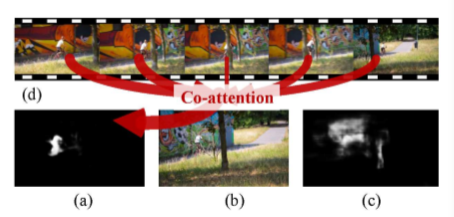

​		CosNet认为无监督视频目标分割下的主要目标拥有以下特点：

> 1)单帧可区分(本地显著性)；
>
> 2)在整个视频序列中频繁出现的目标(全局一致性)。

​		这两个特点对于区分视频序列中的主要目标的非常重要的。通过考虑视频的全局信息，可以锁定主要目标，进而进行分割。

# 网络结构

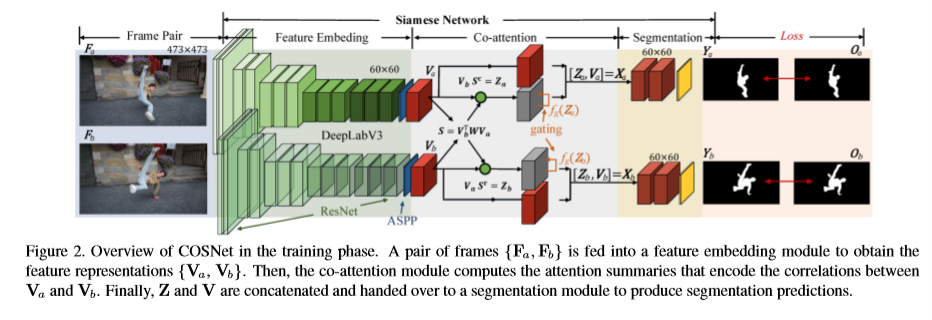

​		输入是图片对，图片对可以从视频中随机取得。两帧图片经过基网络（DeeplabV3），也称编码网络（Encoder）， 将两帧编码成嵌入特征，然后协同注意力模块会计算两帧的相似性，即两帧之间的相关注意力特征。最后输入到分割模块得到最后的分割结果。

# 算法

## 	Co-attention Mechanisms in COSNet

作者提出了三种协同注意力机制，分别为Vanilla co-attention， Symmetric co-attention，Channel-wise co-attention。一个注意力模块这显式地编码两帧之间的相关性，这样可以使得COsNet学习到频繁相关的区域。

### Vanilla co-attention

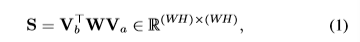

S 是两帧之间的affinity matrix（相似矩阵），Va和Vb的shape是
$$
W * H  * C
$$
Va的每一列表示特征向量，W是一个方阵

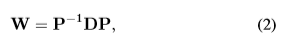

所以S又可以写成：

 

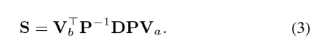

通过上面公式，首先对每一帧的特征表示进行线性变换，然后计算它们之间的距离 。

###  Symmetric co-attention

如果对权重矩阵进行约束，令权重矩阵为一个对称矩阵。则投影矩阵P就变成一个正交矩阵

I是一个C * C的单位阵。则Symmetric co-attention的计算公式为：

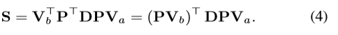

 上述公式表明将嵌入向量Va和Vb的特征投影到正交公共空间中，并保持它们的范数。这一特性可以消除不同通道之间的相关性和提高网络的泛化能力。

## Channel-wise co-attention

将投影矩阵P简单地表示成单位矩阵 I （也就是没有进行空间的转换），然后权重矩阵W变成对角矩阵，在这种情况下，W（也就是D）可以分为两个对角矩阵Da和Db， 因此，公式3可以重新写成一下形式，也就是Channel-wise co-attention：

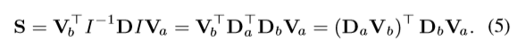

 这个操作相当于在计算相似度之前对Va和Vb应用一个信道权值, 这有助于缓解通道冗余 .

# 协同注意力操作

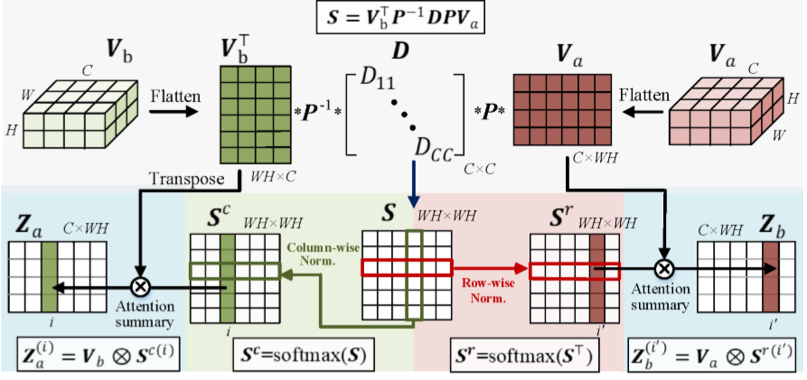

协同注意力操作如上图所示，在获取了相似度矩阵S之后，对S的行向量和列向量进行SoftMax操作：

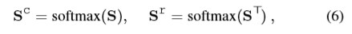

结合上图：

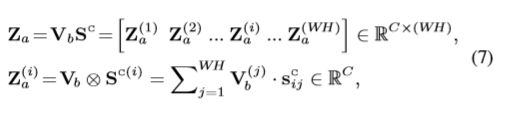

在网络中的协同注意力模块还有一个Gated co-attention操作， 考虑到输入对、遮挡和背景噪声之间潜在的外观变化，最好对来自不同输入帧的信息进行加权，而不是平均处理所有的共同注意信息。

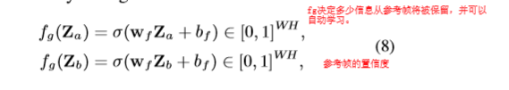 
$$
\sigma是一个sigmoid激活函数，
w_f和b_f表示卷积核和偏置参数。
$$

计算完gate的置信度之后，注意力Z表示为：
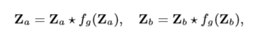

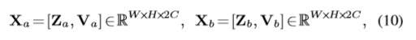

------

# CosNet 整体架构

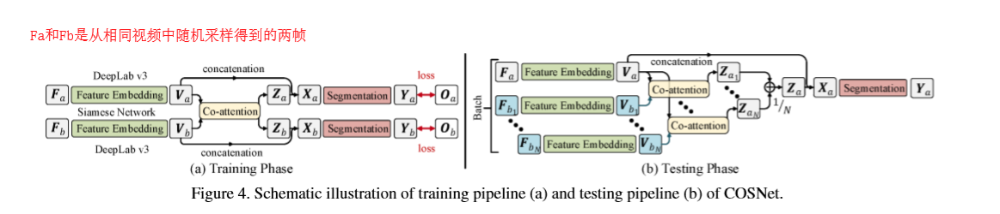

CosNet是一个孪生网络，由三个级联的部分，一个基于DeepLabV3的特征嵌入模块，一个协同注意力模块以及分割模块。

## 训练阶段

​		上文说到，视频中的主要对象（即要分割的对象）有两个基本属性:(i)帧内可分辨性，(ii)帧间一致性。为了区分前景目标和背景(属性(i))，我们利用现有的显著性目标分割数据集DUTS和MSRA 10K来训练我们的backbone特征嵌入模块。同时，为了确保COSNet能够捕获主要视频对象的全局帧间相干性(property (ii))，我们使用视频分割数据训练整个COSNet，其中co-attention模块在捕获视频帧之间的相关性方面起着关键作用。具体来说，我们在一个视频序列中随机选取两帧来建立训练对。值得一提的是，与以往的基于循环神经网络的UVOS模型只需要连续帧相比，这种操作自然有效地扩充了训练数据, 即数据增强。

​		通过这种方式，COSNet可以交替使用静态图像数据和动态视频数据进行训练。在使用图像数据时，我们只训练了特征嵌入模块，其中增加了1×1的sigmoid激活卷积层，生成中间分割的sideoutput。视频数据用于训练整个COSNet，包括特征嵌入模块、协同注意模块和分割模块。利用加权二叉熵损失训练网络: 

 		

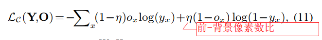

 其实训练阶段是**完全监督**的，因为使用到了groundtruth。

## 测试阶段

​		训练完成之后，使用模型在其他没有见过的视频序列中进行测试。给定一个测试视频序列，我们可以将每个要分割的帧，以及从同一视频中采样的一个参考帧，依次输入到COSNet中，通过逐帧的操作，我们可以得到所有的分割结果。

​		然而，在这样一个简单的策略下，分割结果仍然含有相当大的噪声，因为视频中丰富的全局相关信息并没有得到充分的挖掘。因此，在测试阶段包含更多的是推导帧常重要的：

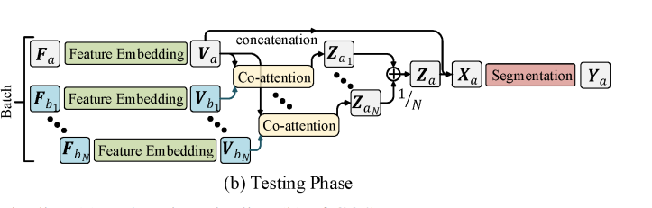

 将一组N个不同的参考帧(从同一视频中均匀采样)输入推理分支，并对所有预测进行平均。 

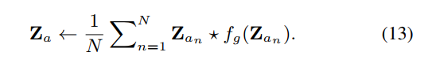

# 结果

DAVIS-2016数据集：

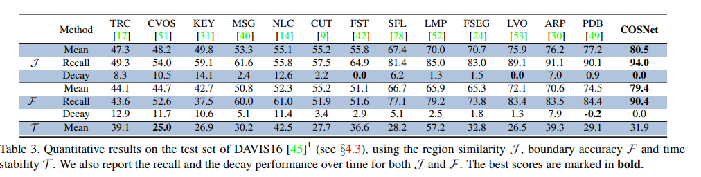

FBMS数据集：
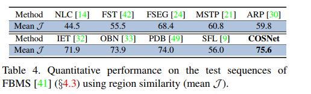

  YoutubeObjects  数据集：

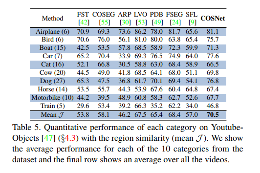

# 结论

1. 协同注意力机制基于全局的视角进行推断前景和背景的分割，效果显著。

2. 在测试时，平均多个帧的的注意力更有效

3.  为了研究最终预测在测试阶段的帧选择策略，我们进一步使用不同的采样方法进行了一系列的实验。具体采用全局随机抽样、全局均匀抽样和局部连续抽样。从表1中可以看出，两种全局水平的采样策略都能获得近似的性能，但都优于局部采样方法。同时，基于局部采样的结果仍然优于从骨干网获得的结果。整体比较进一步证明了合并的重要性 。

4. 关于参考帧数的选择，如表：

   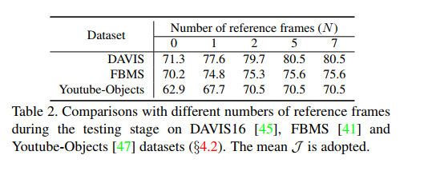

    当N = 0时，这意味着没有共同注意分割。当N从0变为1时，可以看到一个很大的性能改进 。N从2变化到5，定量结果显示性能有所提高。当我们进一步增加N时，最终的性能没有明显的变化。实验中使用的N=5。