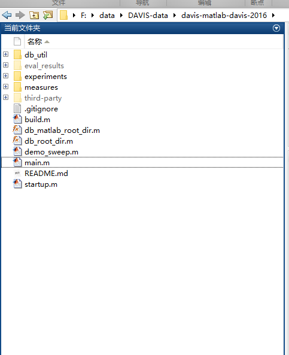
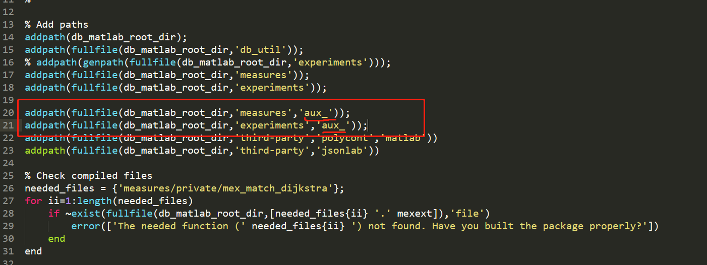
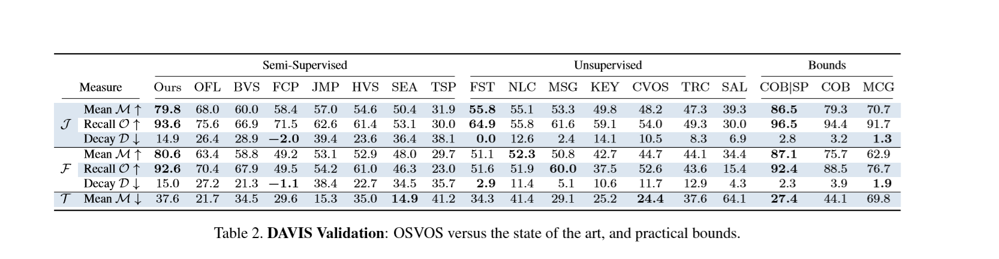
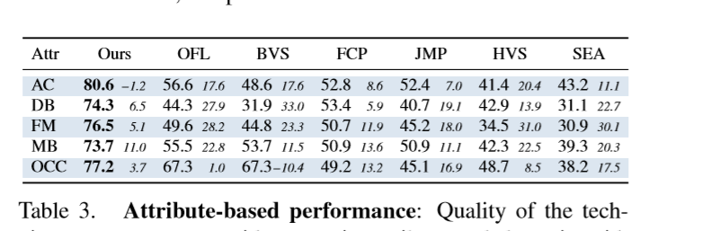
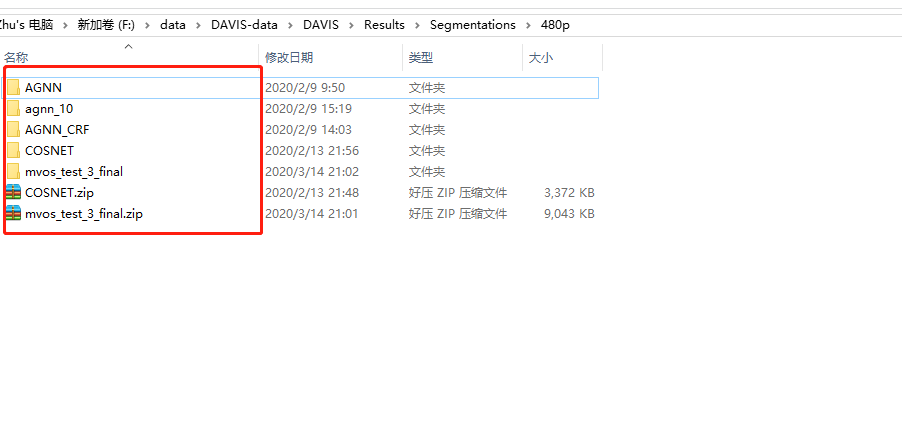

# 介绍

因为很久不做实验很容易忘记怎么使用，所以还是做个记录吧。

在Davis官网上下载matlab版本的代码: https://github.com/davisvideochallenge/davis-matlab/tree/davis-2016 



在window操作系统下会有点问题，解压时会遇到aux文件夹内容解压失败，这是因为aux是windows保留的名称，因此不能创建名称为aux的文件夹或文件。 所以解决方法是 

创建文件夹aux_ :  ..\DAVIS2016\davis-matlab-davis-2016\measures\aux_  

 然后把aux中对应内容解压到aux_中。还要修改的相应的文件：

 修改 ..\DAVIS2016\davis-matlab-davis-2016\startup.m ：




# 开始使用

## 安装

- 修改`db_root_dir.m`，使得地址指向`DAVIS`数据库在你系统中解压的位置（包含文件夹Annotations和JPEGImages）。

  ```matlab
  function root_dir = db_root_dir()
      root_dir = 'F:\data\DAVIS-data\DAVIS';  %% 设置数据集的路径
  end
  
  ```

- 运行`startup.m`，添加必要的路径和执行一些检查操作。

- 如果上一步出问题了，就执行build.m，进行重编译。

## 使用

1. 创建main.m文件，调用评估代码：

   ```matlab
   % main.m
   addpath(fullfile(db_matlab_root_dir,'db_util'));
   addpath(fullfile(db_matlab_root_dir,'measures'));
    
   [eval, raw_eval] = eval_result('mvos_test_3_final', {'J','F','T'},'val');
   %function [eval, raw_eval] = eval_result(result_id, measures, gt_set)
   ```

   上面eval_result('mvos_test_3_final', {'J','F','T'},'val'); 中填入你要评估的方法名称，这个是你的Reslut结果文件夹的名称，也就是分割的结果。

   measures/`eval_result.m`并非demo，而是一个`function`，需要自己写个`demo`调用它，也就是创建的main.m

   看看这个`eval_result.m`文件：

   > function [eval, raw_eval] = eval_result(result_id, measures, gt_set)

   输入：

   1. `result_id`：要评估的方法的ID，比如'COSNET'、'ARP'、'AGNN'等等
   2. `measures`：要评估的指标，三种{ $J 、F、T$} 。
   3. `gt_set`：用哪个集合作为gt集合，有三种：`'all'、'train'、'val'`

   运行main.m就可以生成三个评价指标的mat

2. 使用experiments\experiments_params.m可以将表格画出来。

   ```matlab
   % List of techniques compared
   % techniques = {'mcg','sf-lab','sf-mot',...
   %               'nlc','cvos','trc','msg',...
   %               'key','sal','fst',...
   %               'tsp','sea','hvs','jmp','fcp','bvs','ofl','msk','osvos','epo+',  'AGNN'};
   %           
   techniques = {'AGNN',  'AGNN_CRF', 'agnn_10', 'COSNET'};
   % Names to be shown on the tables
   % techniques_paper = {'MCG','SF-LAB','SF-MOT',...
   %                     'NLC','CVOS','TRC','MSG',...
   %                     'KEY','SAL','FST',...
   %                     'TSP','SEA','HVS','JMP','FCP','BVS','OFL','MSK','OSVOS','epo+', 'AGNN'};
   % 
   techniques_paper = {'AGNN',  'AGNN_CRF', 'agnn_10', 'COSNET'};
   % Output folder to save files
   paper_data = '~/tmp';       
   
   ```

   上面填你要比较的方法名称。

3. experiments\global_table.m 生成结果

    直接运行即可得到下面表格的数据。各个方法的评价指标值，比较表格。 

   

4. experiments\attribute_table.m

    直接运行即可得到下面的表格数据。在不同的挑战下各算法性能比较。 

   

   

----

# 结果文件夹的位置

一般你要有如下的文件层级：....../DAVIS-data/DAVIS/Results/Segmentations/480p/

480p文件夹放入你分割的结果：



---------

# 参考

1. https://blog.csdn.net/qq_25379821/article/details/83035945 