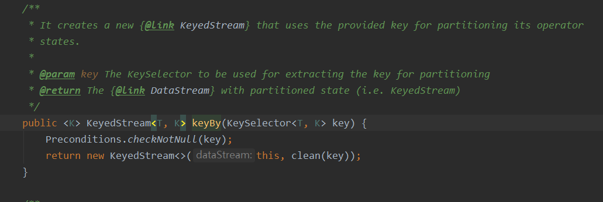
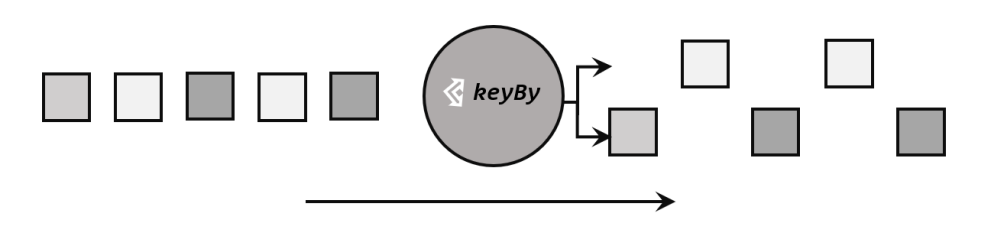
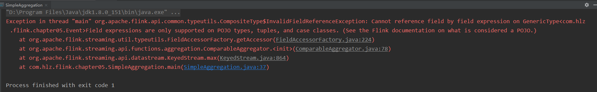

## 聚合算子

 我们往往需要对大量的数据进行统计或整合，从而提炼出更有用的 信息。比如要对每个词出现的频次进行叠加统计。这种操作，计算的结果不仅依赖当前数据，还跟之前的数据有关，相当于要把所有数据聚在一起进行汇总合并 ——这就是所谓的“聚合”（Aggregation），也对应着 MapReduce 中的 reduce 操作。  

## KeyBy

 DataStream 是没有直接进行聚合的 API 的。因为我们对海量数据做聚合 肯定要进行分区并行处理，这样才能提高效率。所以在 Flink 中，要做聚合，需要先进行分区； 这个操作就是通过 keyBy 来完成的。



 基于不同的 key，流中的数据将被分配到不同的分区中去，这样一来，所 有具有相同的 key 的数据，都将被发往同一个分区，那么下一步算子操作就将会在同一个 slot 中进行处理了。




## 简单聚合

 有了按键分区的数据流 KeyedStream，我们就可以基于它进行聚合操作了。Flink 为我们 内置实现了一些最基本、最简单的聚合 API，主要有以下几种： 

⚫ sum()：在输入流上，对指定的字段做叠加求和的操作。 

⚫ min()：在输入流上，对指定的字段求最小值。 

⚫ max()：在输入流上，对指定的字段求最大值。 

⚫ minBy()：与 min()类似，在输入流上针对指定字段求最小值。不同的是，min()只计 算指定字段的最小值，其他字段会保留最初第一个数据的值；而 minBy()则会返回包 含字段最小值的整条数据。 

⚫ maxBy()：与 max()类似，在输入流上针对指定字段求最大值。两者区别与 min()/minBy()完全一致。 


```java
package com.hlz.flink.chapter05;

import org.apache.flink.api.java.functions.KeySelector;
import org.apache.flink.streaming.api.datastream.DataStreamSource;
import org.apache.flink.streaming.api.environment.StreamExecutionEnvironment;

/**
 * 简单聚合操作2
 *
 * @author Hongliang Zhu
 * @create 2023-05-04 23:33
 */
public class SimpleAggregation {

    public static void main(String[] args) throws Exception {

        StreamExecutionEnvironment env = StreamExecutionEnvironment.getExecutionEnvironment();
        env.setParallelism(4);

        DataStreamSource<Event> streamSource = env.fromElements(
                new Event("Mary", "./home", 1000L),
                new Event("Bob", "./cart", 2000L),
                new Event("Alice", "./prod?id=100", 3000L),
                new Event("Bob", "./home", 4000L),
                new Event("Bob", "./prod?id=9", 5000L),
                new Event("Bob", "./prod?id=2", 6000L),
                new Event("Mary", "./prod?id=3", 7000L)
                );

        // 按键分组后聚合,提取当

        streamSource.keyBy(new KeySelector<Event, String>() {
            @Override
            public String getKey(Event value) throws Exception {
                return value.user;
            }
        }).max("timeStamp")
                .print("max: ");


        env.execute();

    }
}

```

输出：

max: > Event{user='Mary', url='./home', timeStamp=1970-01-01 08:00:01.0}
max: > Event{user='Bob', url='./cart', timeStamp=1970-01-01 08:00:02.0}
max: > Event{user='Alice', url='./prod?id=100', timeStamp=1970-01-01 08:00:03.0}
<font color=red>max: > Event{user='Bob', url='./cart', timeStamp=1970-01-01 08:00:04.0}</font>
max: > Event{user='Bob', url='./cart', timeStamp=1970-01-01 08:00:05.0}
max: > Event{user='Bob', url='./cart', timeStamp=1970-01-01 08:00:06.0}
max: > Event{user='Mary', url='./home', timeStamp=1970-01-01 08:00:07.0}

看红色这一条数据，第四条数据中的路径应该是/home，但是这里却是原来的/cart，说明max()只计 算指定字段的最小值，其他字段会保留最初第一个数据的。

把max()换成maxBy(), 结果输出如下：

maxBy: > Event{user='Mary', url='./home', timeStamp=1970-01-01 08:00:01.0}
maxBy: > Event{user='Bob', url='./cart', timeStamp=1970-01-01 08:00:02.0}
maxBy: > Event{user='Alice', url='./prod?id=100', timeStamp=1970-01-01 08:00:03.0}
<font color=red>maxBy: > Event{user='Bob', url='./home', timeStamp=1970-01-01 08:00:04.0}</font>
maxBy: > Event{user='Bob', url='./prod?id=9', timeStamp=1970-01-01 08:00:05.0}
maxBy: > Event{user='Bob', url='./prod?id=2', timeStamp=1970-01-01 08:00:06.0}
maxBy: > Event{user='Mary', url='./prod?id=3', timeStamp=1970-01-01 08:00:07.0}

第四条数据已经中url变成了本身的数据了。


## 规约聚合

 与简单聚合类似，reduce 操作也会将 KeyedStream 转换为 DataStream。它不会改变流的元 素数据类型，所以输出类型和输入类型是一样的。  

 调用 KeyedStream 的 reduce 方法时，需要传入一个参数，实现 ReduceFunction 接口， ReduceFunction 接口里需要实现 reduce()方法，这个方法接收两个输入事件，经过转换处 理之后输出一个相同类型的事件；所以，对于一组数据，我们可以先取两个进行合并，然后再 将合并的结果看作一个数据、再跟后面的数据合并，最终会将它“简化”成唯一的一个数据， 这也就是 reduce“归约”的含义。

 我们将数据流按照用户 id 进行分区，然后用一个 reduce 算子实现 sum 的功能，统计每个 用户访问的频次；进而将所有统计结果分到一组，用另一个 reduce 算子实现 maxBy 的功能， 记录所有用户中访问频次最高的那个，也就是当前访问量最大的用户是谁。 

```java
package com.hlz.flink.chapter05;

import org.apache.flink.api.common.functions.ReduceFunction;
import org.apache.flink.api.common.typeinfo.TypeHint;
import org.apache.flink.api.java.tuple.Tuple3;
import org.apache.flink.streaming.api.datastream.DataStreamSource;
import org.apache.flink.streaming.api.datastream.SingleOutputStreamOperator;
import org.apache.flink.streaming.api.environment.StreamExecutionEnvironment;

/**
 * reduce操作
 *
 * @author Hongliang Zhu
 * @create 2023-02-16 23:29
 */
public class TransReduceTest {

    public static void main(String[] args) throws Exception {
        StreamExecutionEnvironment env = StreamExecutionEnvironment.getExecutionEnvironment();

        env.setParallelism(1);

//        DataStreamSource<Event> source = env.addSource(new ClickSource());

        DataStreamSource<Event> source = env.fromElements(
                new Event("Mary", "./mary", 1000L),
                new Event("Bob", "./hello", 2000L),
                new Event("Alice", "./prod", 3000L),
                new Event("Alice", "./prod2", 4000L),
                new Event("Bob", "./prod", 5000L),
                new Event("Bob", "./prod1", 6000L),
                new Event("Bob", "./prod2", 7000L),
                new Event("Bob", "./prod3", 8000L),
                new Event("Alice", "./prod2", 4000L),
                new Event("Alice", "./prod2", 4000L),
                new Event("Alice", "./prod2", 4000L),
        new Event("Alice", "./prod2", 4000L),
                new Event("Alice", "./prod2", 4000L));


        // 将Event类型转换成Tuple元组类型
//        SingleOutputStreamOperator<Tuple3<String, String, Long>> tupleStream = source.map(e -> Tuple3.of(e.getUser(), e.getUrl(), 1L)).returns(new TypeHint<Tuple3<String, String, Long>>() {
//        });

        SingleOutputStreamOperator<Tuple3<String, String, Long>> reduceStream = source
                .map(e -> Tuple3.of(e.getUser(), e.getUrl(), 1L))
                .returns(new TypeHint<Tuple3<String, String, Long>>() {
                })
                .keyBy(t -> t.f0)
                .reduce(new ReduceFunction<Tuple3<String, String, Long>>() {
                    @Override
                    public Tuple3<String, String, Long> reduce(Tuple3<String, String, Long> value1, Tuple3<String, String, Long> value2) throws Exception {

                        // 每到一条数据，pv加1
                        return Tuple3.of(value1.f0, value2.f1, value1.f2 + value2.f2);
                    }
                }).keyBy(r -> "hello").reduce(new ReduceFunction<Tuple3<String, String, Long>>() {

                    // 找最大值
                    @Override
                    public Tuple3<String, String, Long> reduce(Tuple3<String, String, Long> value1, Tuple3<String, String, Long> value2) throws Exception {
                        return value1.f2 > value2.f2 ? value1 : value2;
                    }
                });

        reduceStream.print("reduceStream");

        env.execute();
    }
}

```

输出:

reduceStream> (Mary,./mary,1)
reduceStream> (Bob,./hello,1)
reduceStream> (Alice,./prod,1)
reduceStream> (Alice,./prod2,2)
reduceStream> (Bob,./prod,2)
reduceStream> (Bob,./prod1,3)
reduceStream> (Bob,./prod2,4)
reduceStream> (Bob,./prod3,5)
reduceStream> (Bob,./prod3,5)
reduceStream> (Bob,./prod3,5)
reduceStream> (Alice,./prod2,5)
reduceStream> (Alice,./prod2,6)
reduceStream> (Alice,./prod2,7)


## FAQ 

在使用max操作的时候，报错Cannot reference field by field expression on GenericType<com.hlz.flink.chapter05.Event>Field expressions are only supported on POJO types, tuples, and case classes. (See the Flink documentation on what is considered a POJO.)



这是因为我们定义的Event对象不是标准的POJO对象，

#### 标准的POJO类的要求：

1. 所有成员变量都是私有的，用private修饰

2. 每个成员变量都有对应的getter和setter

3. 有一个无参的构造方法

我们Event没有无参构造，因此需要加上