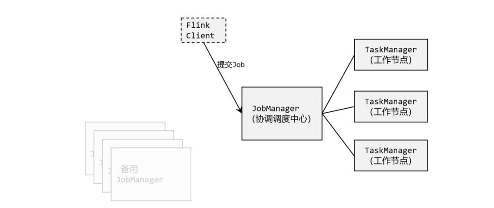
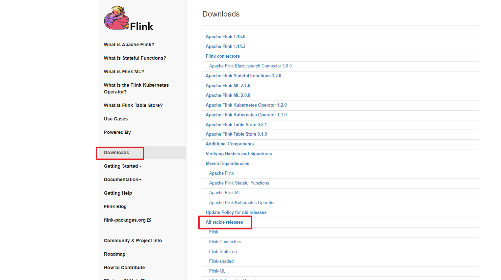
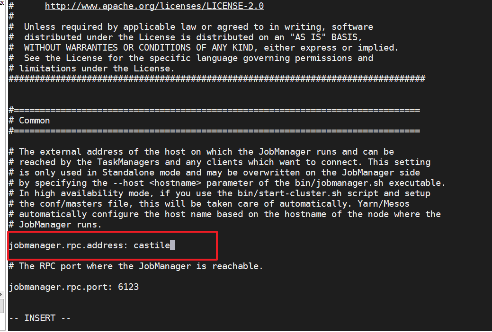
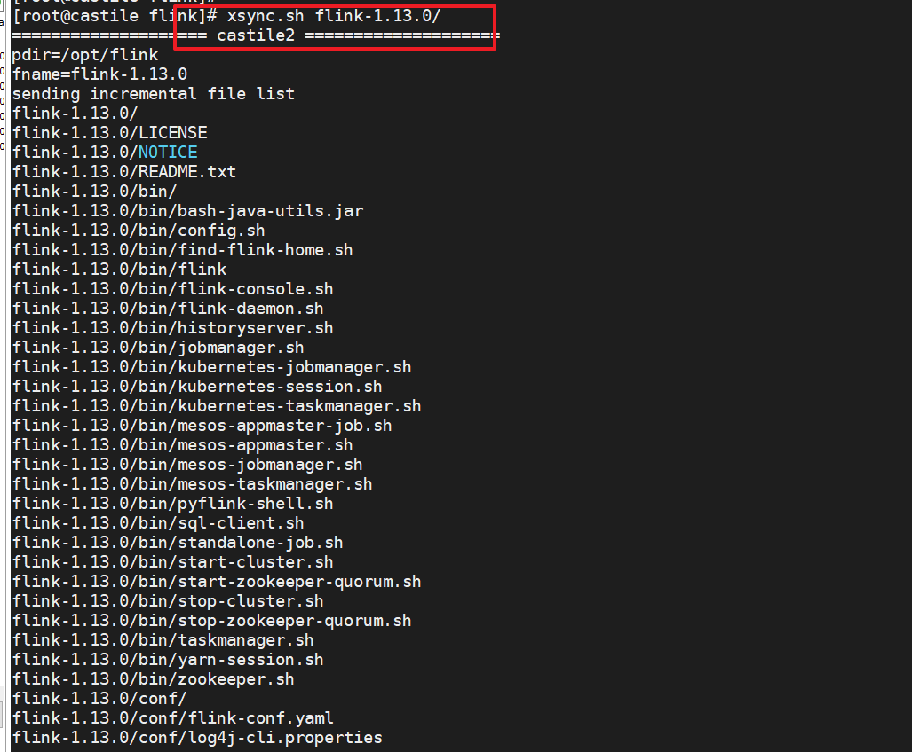
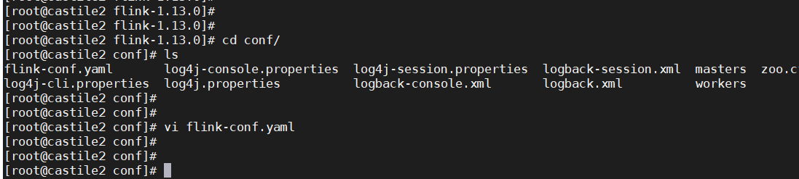
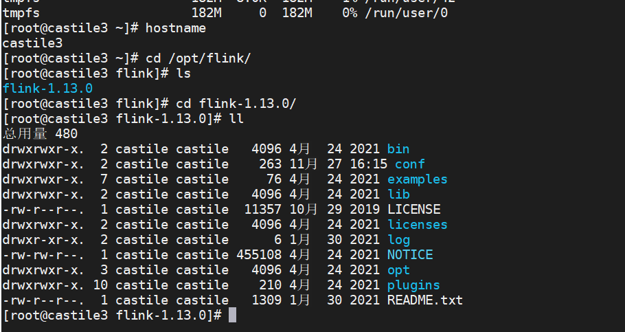
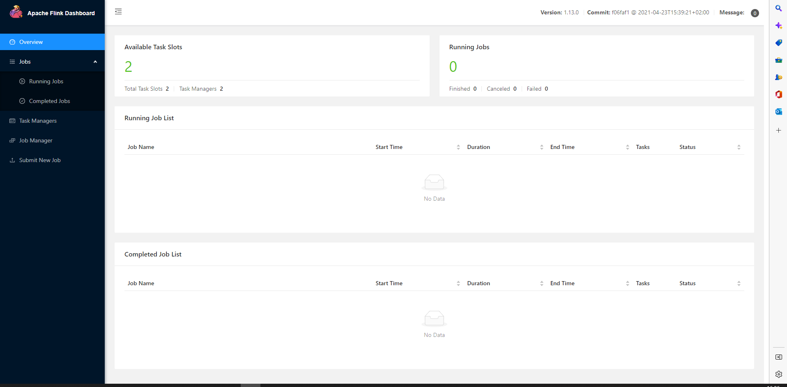
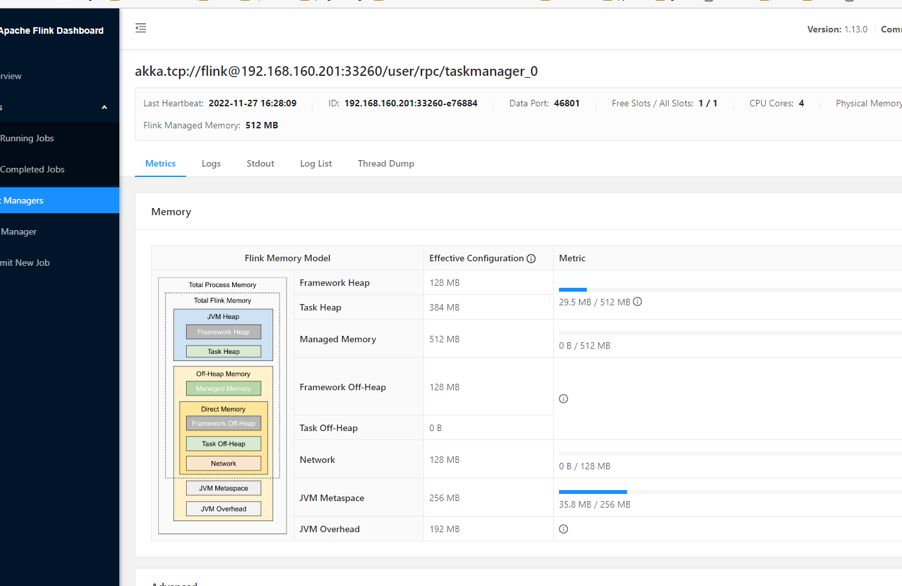

# Flink集群部署

Flink几个关键主件： 客户端（Client）、作业管理器（JobManager）和 任务管理器（TaskManager）。我们的代码，实际上是由客户端获取并做转换，之后提交给 JobManger 的。所以 JobManager 就是 Flink 集群里的“管事人”，对作业进行中央调度管理； 而它获取到要执行的作业后，会进一步处理转换，然后分发任务给众多的 TaskManager。这里 的 TaskManager，就是真正“干活的人”，数据的处理操作都是它们来做的。




## 1. 环境配置

 Flink 是一个分布式的流处理框架，所以实际应用一般都需要搭建集群环境。我们在进行 Flink 安装部署的学习时，需要准备 3 台 Linux 机器 。

 进入 Flink 官网，下载 1.13.0 版本安装包 flink-1.13.0-bin-scala_2.12.tgz，注意此处选用对 应 scala 版本为 scala 2.12 的安装包 

https://archive.apache.org/dist/flink/flink-1.13.0/




解压：

```shell
cd /opt/
mkdir flink
tar -zxvf flink-1.13.0-bin-scala_2.12.tgz -C /opt/flink/
flink-1.13.0/
flink-1.13.0/log/
flink-1.13.0/LICENSE
flink-1.13.0/lib/
……
```


 Flink 是典型的 Master-Slave 架构的分布式数据处理框架，其中 Master 角色对应着 JobManager，Slave 角色则对应 TaskManager。我们对三台节点服务器的角色分配如

| 节点服务器 | castile    | castile2    | castile3    |
| ---------- | ---------- | ----------- | ----------- |
| 角色       | JobManager | TaskManager | TaskManager |

## 2. 集群配置

1.  进入 conf 目录下，修改 flink-conf.yaml 文件，修改 jobmanager.rpc.address 参数为 castile，如下所示 



 这就指定了 castile(192.168.160.200)节点服务器为 JobManager 节点。 


2. 修改workers文件，  将另外两台节点服务器添加为本 Flink 集群的 TaskManager 节点 

   ```shell
   vim workers 
   castile2
   castile3
   
   ```

    这样就指定了 castile2和 castile3为 TaskManager 节点。 

3.  另外，在 flink-conf.yaml 文件中还可以对集群中的 JobManager 和 TaskManager 组件 进行优化配置，主要配置项如下 :

   - jobmanager.memory.process.size：对 JobManager 进程可使用到的全部内存进行配置， 包括 JVM 元空间和其他开销，默认为 1600M，可以根据集群规模进行适当调整。 
   - taskmanager.memory.process.size：对 TaskManager 进程可使用到的全部内存进行配置， 包括 JVM 元空间和其他开销，默认为 1600M，可以根据集群规模进行适当调整。 
   -  taskmanager.numberOfTaskSlots：对每个 TaskManager 能够分配的 Slot 数量进行配置， 默认为 1，可根据 TaskManager 所在的机器能够提供给 Flink 的 CPU 数量决定。所谓 Slot 就是 TaskManager 中具体运行一个任务所分配的计算资源。
   - parallelism.default：Flink 任务执行的默认并行度，优先级低于代码中进行的并行度配 置和任务提交时使用参数指定的并行度数量 

## 3. 集群内容分发脚本

配置修改完毕后，将Flink安装目录分发给另外两个节点服务器

```shell
#! /bin/bash
#1 获取输入参数个数，如果没有参数，直接退出
pcount=$#
if [ $pcount -lt 1 ]
then
    echo No Enough Arguement!
    exit;
fi

#2. 遍历集群所有机器
for host in castile2 castile3
do
    echo ====================    $host    ====================
    #3. 递归遍历所有目录
    for file in $@
    do
        #4 判断文件是否存在
        if [ -e $file ]
        then
            #5. 获取全路径
            pdir=$(cd -P $(dirname $file); pwd)
            echo pdir=$pdir

            #6. 获取当前文件的名称
            fname=$(basename $file)
            echo fname=$fname

            #7. 通过ssh执行命令：在$host主机上递归创建文件夹（如果存在该文件夹）
            ssh $host "source /etc/profile;mkdir -p $pdir"

            #8. 远程同步文件至$host主机的$USER用户的$pdir文件夹下
            rsync -av $pdir/$fname $USER@$host:$pdir
        else
            echo $file Does Not Exists!
        fi
    done
done
```

分发：



可以看到其他两个节点服务器已经收到：





## 4. 启动集群

 （1）在 castile节点服务器上执行 start-cluster.sh 启动 Flink 集群： 

```shell
[root@castile bin]# ./start-cluster.sh
Starting cluster.
Starting standalonesession daemon on host castile.
Starting taskexecutor daemon on host castile2.
Starting taskexecutor daemon on host castile3.
```

2. 查看进程情况

   ```md
   
   [root@castile bin]# jps
   82890 StandaloneSessionClusterEntrypoint
   83038 Jps
   
   
   [root@castile2 conf]# jps
   3426 TaskManagerRunner
   3478 Jps
   
   
   [root@castile3 flink-1.13.0]# jps
   3459 TaskManagerRunner
   3530 Jps
   
   ```

   

## 5. 访问WebUI

 启动成功后，同样可以访问  [Apache Flink Web Dashboard](http://192.168.160.200:8081/#/overview)  对 flink 集群和任务进行监控管理，如图 所示。 



 这里可以明显看到，当前集群的 TaskManager 数量为 2；由于默认每个 TaskManager 的 Slot 数量为 1，所以总 Slot 数和可用 Slot 数都为 2。 还可以查看TaskManager节点的资源情况：



至此，我们Flink的一个集群就搭建起来了，我们可以使用web界面进行作业的提交。