# 概述

## GCNet: Non-local Networks Meet Squeeze-Excitation Networks and Beyond【CVPR2019】

传送地址：https://arxiv.org/pdf/1904.11492.pdf 

GitHub：https://github.com/xvjiarui/GCNet.

`Non-Local Network (NLNet)`  在捕获长距离依赖关系（ `long-range dependency` ）方面是一项开创性的工作，它通过在一个位置的计算响应是输入特性图中所有位置的特征的加权总和来获得全局上下文的信息。但是作者发现，对于一副图片，不同的`query positions` 通过 `non-local`结构获得的全局上下文信息几乎一样，这让作者对`Non-local`产生了质疑，`Non-Local`的参数量和计算量相对来说都比较大，这么费力气去计算响应图，发现每个位置的`attention`都几乎一致。所以作者提出了一种简化的网络，在准确率差不多的情况下，计算量却降低了，然后作者发现经过他改造后的网络结构和  `Squeeze-Excitation Network (SENet)` 的结构很相似。把它称作为`GCNet(global conntext block)`。`SENet` 的 `three steps`：1、全局上下文建模；2、`channel-wise` 依赖关系转换；3、特征融合。 这种`GC block`是轻量级的，这就可以被运用到`backbone`网络中，并且可以多层，从而构成一个 `GCNet`，它通常在各种识别任务的主要基准上都优于简化的`NLNet`和`SENet` 。

`SENet`、`Non-local`以及本文的`GCNet`都是想办法获取视频或者`image`中的`long-range dependency` ，它们的目的都是尽可能从**全局的角度**（`global context`）来理解视频和图像。在卷积神经网络中，单靠传统的卷积层是无法自己做到这一点的（或者说做的不够好），卷积层是在**局部邻域**（  `local neighborhood`  ）内建立**像素关系**，其长期依赖关系主要通过深度叠加卷积层来建模 。虽然可以通过不断的加深网络，来达到网络后半部分的神经元的感受野变大，这样计算量大，优化也很困难，达到一种不那么“local”的效果。但这种粗暴的加深网络的做，有如下三个缺点：

1. 不够精巧，参数量、计算量粗暴拼凑出来的。
2. 网络越深，优化难度越大。
3. 不那么"local"并不代表全局，有最大距离的限制。 比如在网络的后半部分，`feature map`右下角的cell，感受野可能扩大了，但可能还是始终无法获得原图片上左上角的信息(因为卷积操作最大距离的限制)。 

# non-local 和 SENet

 不同查询位置的注意力图几乎是相同的   but surprisingly observe that the attention maps for different query positions are almost the same, indicating only query-independent dependency is learnt. 如下图所示。

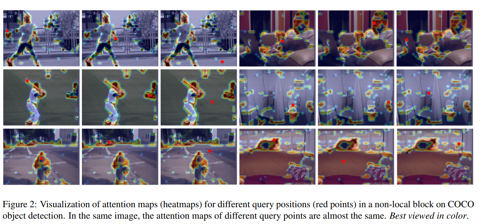

二者都是通过从各个位置聚集的相同特征来强化原有特征，但在聚集策略、转换和强化功能上的选择又相互区别。

 通过对这些函数的抽象，得到了一个统一简化的`NL`块和`SE`块的三步通用框架:

- (a)**上下文建模模块**，它将所有位置的特征集合在一起，形成全局上下文特征;
- (b)**特征转换模块**，以捕捉**各通道**之间的相互依存关系;
- (c)**融合模块**，将*全局上下文*特征合并到*所有位置的特征*中 

#  Long-range dependency modeling  

 最近的**远程依赖关系**（`Long-range dependency`）建模方法可以分为两类。第一种是采用自我注意机制（`self-attention`）来建立两两关系的模型。第二种方法是对查询无关（  `query-independent` ）的全局上下文建模 。

------------

#  Analysis on Non-local Networks  

既然attention map与具体点的位置无关，一个最直观的反应是，那就不要每一个点单独算一个attention map了。用另外一种同样能够获得全局信息，但一个feature map上的点共用的特征吧。基于此，本文作者提出了简化版的NL(snl)。从网络结构上可以看是如图2的变化：

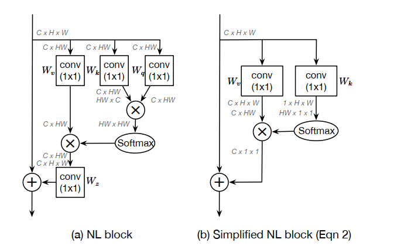

 两个标准任务的两个距离测量结果如表1所示。首先，“`input`”列中的余弦距离值较大，表明`Non-local block`的输入特征可以在不同位置上进行识别。但是“`output`”中的余弦距离值非常小，这表明由`Non-local block`建模的**全局上下文特征**对于不同的查询位置几乎是相同的。对于所有实例化，“`att`”上的两个距离度量值都非常小，这再次验证了来自可视化的观察结果。换句话说，虽然一个`Non-local block`打算计算特定于每个查询位置的全局上下文，但是训练后的全局上下文实际上是独立于查询位置的。因此，不需要为每个查询位置计算查询特定的全局上下文，从而允许我们简化非本地块 。

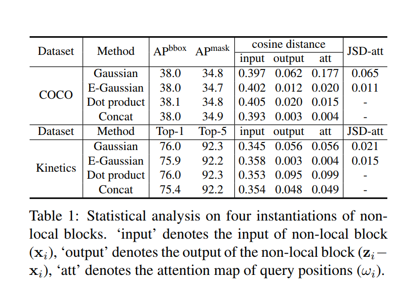

# GCNet

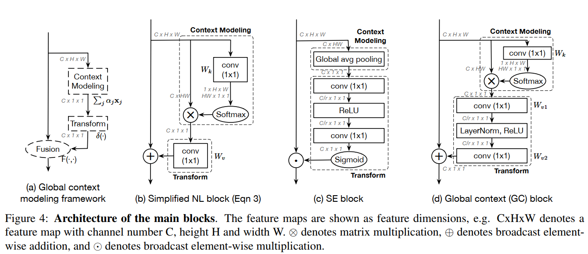

 通过计算一个**全局**(  `query-independent` )的`attention map`并**共享**所有查询位置的global attention map来简化Non-local.

如下图(b),这是简化后的`Non-local`，一个直观的感觉是block结构确实简化了。

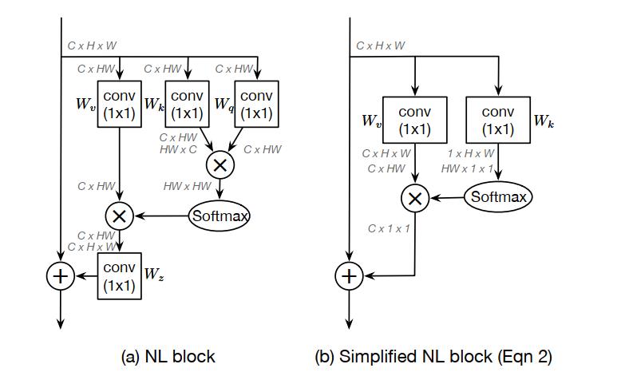

简化后的Non-local公式：

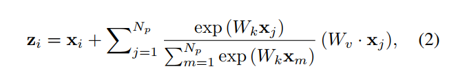

 为了进一步降低这个简化块的计算成本，我们应用分配律将$W_v$移出  `attention pooling` ，即 

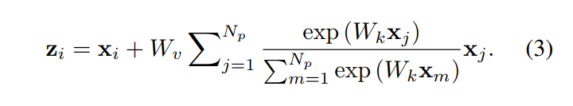

关键部分在于**+**号后面的变化。`Non-local` **+**号后面的内容与$x_i$有关，因此每一个点 i，需要计算一次。而`SNL`的表达公式**+**号后面的内容已与$x_i$无关，也即计算一次，然后所有位置上共享，也映证了上文所讲的`query-independent`。

看上图（b），简化后的NL block可以抽象成三个过程：

1. 首先采用1x1的卷积，$W_k$为权值矩阵以及一个`softmax`函数去获得`attention weight`，然后将注意力权重汇集到原始图中以获得全局上下文特征。
2. 通过1x1卷积，$W_v$为权重，进行特征转换。
3. 特征融合。 它使用加法将全局上下文特性聚合到每个位置的特征上。 

到目前为止，该网络结构还只能称之为`SNL`。作者对`SNL`做了一些结构的优化，就变成了最终的`GC block`。主要有两点：

1. 对于`SNL`模块中右下角的1x1卷积，它的参数量是CxC 。例如，输入通道是2048，输出通道是2048。则参数量就是4000000。这样会导致该模块不够轻量级，无法插入网络的任意位置。作者是通过一个`bottleneck`结构来替换。这样参数量可以从CxC 到 2xCxC/r（r通常设置为16）。 参数数量可以减少到原来的`SNL`块的1/8。 
2. `two-level bottleneck` 的引入增加了网络优化的难度，因此作者引入了`layer norm`（作者论文中实验讲，这一加入还是蛮有效的，0.x个点吧）。

GC 公式：

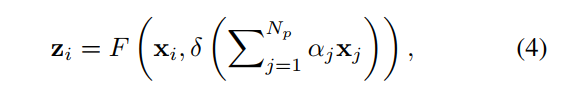

具体地：

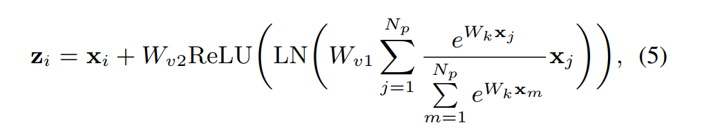

这个结构和SENet的结构很像：

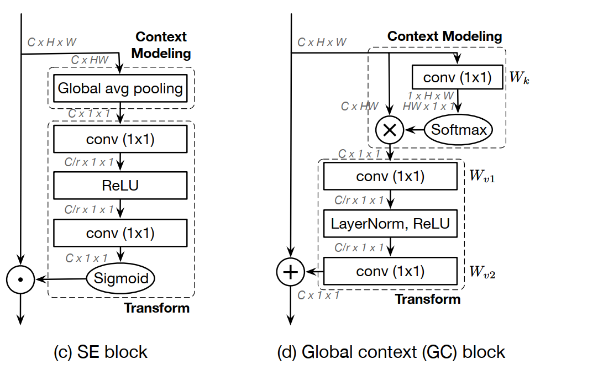

  这时，作者提出了一个“`Global context modeling framework`”来抽象这一类结构:就是上面说的三个过程:Context modeling、Transform、Fusion

> Specifically, our GC block consists of: 
>
> (a) global attention pooling for context modeling;
>
>  (b)bottleneck transform to capture channel-wise dependencies; 
>
> and (c) broadcast element-wise addition for feature fusion.  

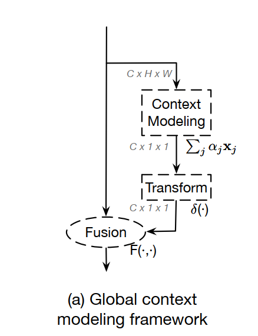

作者在论文中总结了自己提出的`GCNet`与`SENet`网络之间的差异：

1、`SENet`在融合的时候使用的是`rescale`，而`GCNet`使用的是`sum`。因此`"SE recalibrate the importance of channels but inadequately models long-range dependency"`。

2、`Layer-norm`的使用。

3、`SE`中用于提取全局信息的`global pooling` 是`GCNet` `global attention pooling`的一种特例

4、性能上，优于`SENet`。

# 参考

1.  https://blog.csdn.net/u011345885/article/details/96566339 
2.  [non-local论文地址](https://arxiv.org/abs/1711.07971)
   [non-local代码地址](https://github.com/facebookresearch/video-nonlocal-net)
   [gcnet论文地址](https://arxiv.org/abs/1904.11492?context=cs.LG)
   [gcnet代码地址](https://github.com/xvjiarui/GCNet)
   [senet论文地址](https://arxiv.org/abs/1709.01507)
   [senet代码地址](https://github.com/hujie-frank/SENet) 