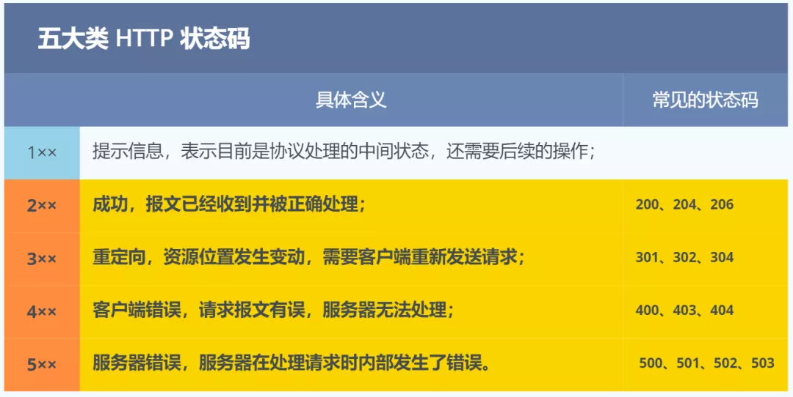
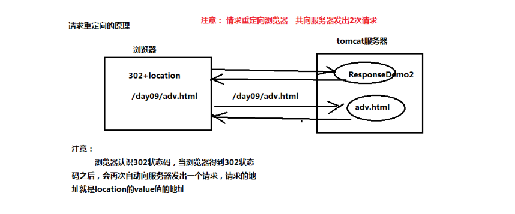

# Http协议

HTTP 是超文本传输协议，也就是**H**yperText **T**ransfer **P**rotocol。 

三个部分：

- 超文本
- 传输
- 协议

## 协议

生活中的协议，本质上与计算机中的协议是相同的，协议的特点:

- 「**协**」字，代表的意思是必须有**两个以上的参与者**。例如三方协议里的参与者有三个：你、公司、学校三个；租房协议里的参与者有两个：你和房东。
- 「**仪**」字，代表的意思是对参与者的一种**行为约定和规范**。例如三方协议里规定试用期期限、毁约金等；租房协议里规定租期期限、每月租金金额、违约如何处理等

针对 HTTP **协议**，我们可以这么理解。

HTTP 是一个用在计算机世界里的**协议**。它使用计算机能够理解的语言确立了一种计算机之间交流通信的规范（**两个以上的参与者**），以及相关的各种控制和错误处理方式（**行为约定和规范**）。

## 传输

HTTP 协议是一个**双向协议**。

我们在上网冲浪时，浏览器是请求方 A ，百度网站就是应答方 B。双方约定用 HTTP 协议来通信，于是浏览器把请求数据发送给网站，网站再把一些数据返回给浏览器，最后由浏览器渲染在屏幕，就可以看到图片、视频了。


针对**传输**，我们可以进一步理解了 HTTP。

HTTP 是一个在计算机世界里专门用来在**两点之间传输数据**的约定和规范。

## 超文本

HTTP 传输的内容是「超文本」。

我们先来理解「文本」，在互联网早期的时候只是简单的字符文字，但现在「文本」。的涵义已经可以扩展为图片、视频、压缩包等，在 HTTP 眼里这些都算做「文本」。

再来理解「超文本」，它就是**超越了普通文本的文本**，它是文字、图片、视频等的混合体最关键有超链接，能从一个超文本跳转到另外一个超文本。

HTML 就是最常见的超文本了，它本身只是纯文字文件，但内部用很多标签定义了图片、视频等的链接，在经过浏览器的解释，呈现给我们的就是一个文字、有画面的网页了。

## 什么是Http协议？

 HTTP 是一个在计算机世界里专门在**「两点」**之间**「传输」**文字、图片、音频、视频等**「超文本」**数据的**「约定和规范」**。 

--------


#          Http协议的状态码 



## 1xx

`1xx` 类状态码属于**提示信息**，是协议处理中的一种中间状态，实际用到的比较少。

## 2xx

`2xx` 类状态码表示服务器**成功**处理了客户端的请求，也是我们最愿意看到的状态。

「**200 OK**」是最常见的成功状态码，表示一切正常。如果是非 `HEAD` 请求，服务器返回的响应头都会有 body 数据。

「**204 No Content**」也是常见的成功状态码，与 200 OK 基本相同，但响应头没有 body 数据。

「**206 Partial Content**」是应用于 HTTP 分块下载或断电续传，表示响应返回的 body 数据并不是资源的全部，而是其中的一部分，也是服务器处理成功的状态。

## 3xx

`3xx` 类状态码表示客户端请求的资源发送了变动，需要客户端用新的 URL 重新发送请求获取资源，也就是**重定向**。

「**301 Moved Permanently**」表示永久重定向，说明请求的资源已经不存在了，需改用新的 URL 再次访问。

「**302 Found**」表示临时重定向，说明请求的资源还在，但暂时需要用另一个 URL 来访问。

301 和 302 都会在响应头里使用字段 `Location`，指明后续要跳转的 URL，浏览器会自动重定向新的 URL。

「**304 Not Modified**」不具有跳转的含义，表示资源未修改，重定向已存在的缓冲文件，也称缓存重定向，用于缓存控制。

## 4xx

`4xx` 类状态码表示客户端发送的**报文有误**，服务器无法处理，也就是错误码的含义。

「**400 Bad Request**」表示客户端请求的报文有错误，但只是个笼统的错误。

「**403 Forbidden**」表示服务器禁止访问资源，并不是客户端的请求出错。

「**404 Not Found**」表示请求的资源在服务器上不存在或未找到，所以无法提供给客户端。

##  5xx

`5xx` 类状态码表示客户端请求报文正确，但是**服务器处理时内部发生了错误**，属于服务器端的错误码。

「**500 Internal Server Error**」与 400 类型，是个笼统通用的错误码，服务器发生了什么错误，我们并不知道。

「**501 Not Implemented**」表示客户端请求的功能还不支持，类似“即将开业，敬请期待”的意思。

「**502 Bad Gateway**」通常是服务器作为网关或代理时返回的错误码，表示服务器自身工作正常，访问后端服务器发生了错误。

「**503 Service Unavailable**」表示服务器当前很忙，暂时无法响应服务器，类似“网络服务正忙，请稍后重试”的意思。

------------


# Http协议的内容

## Http请求

浏览器 -----> 服务器：

```txt
GET /myweb/hello HTTP/1.1               -请求行
Host: localhost:8080                    --请求头（多个key-value对象）
User-Agent: Mozilla/5.0 (Windows NT 6.1; WOW64; rv:35.0) Gecko/20100101 Firefox/35.0
Accept: text/html,application/xhtml+xml,application/xml;q=0.9,*/*;q=0.8
Accept-Language: zh-cn,en-us;q=0.8,zh;q=0.5,en;q=0.3
Accept-Encoding: gzip, deflate
Connection: keep-alive
                                    --一个空行
name=eric&password=123456             --（可选）实体内容

```

**请求行：GET /myweb/hello HTTP/1.1**

> 包含请求方式、协议版本和请求资源
>
> 请求方式： GET
>
> http1.0：当前浏览器客户端与服务器端建立连接之后，只能发送一次请求，一次请求之后连接关闭。
>
> http1.1：当前浏览器客户端与服务器端建立连接之后，可以在一次连接中发送多次请求。（基本都使用1.1）
>
> 请求资源：  /myweb/hello
>
> URL: 统一资源定位符。http://localhost:8080/myweb/testImg.html。只能定位互联网资源。				是URI的子集。
>
> URI：统一资源标记符：用于标记任何资源。可以是本地文件系统，局域网的资源

 **请求头**:

```txt
Accept: text/html,image/*      -- 浏览器接受的数据类型
Accept-Charset: ISO-8859-1     -- 浏览器接受的编码格式
Accept-Encoding: gzip,compress  --浏览器接受的数据压缩格式
Accept-Language: en-us,zh-       --浏览器接受的语言
Host: www.it315.org:80          --（必须的）当前请求访问的目标地址（主机:端口）
If-Modified-Since: Tue, 11 Jul 2000 18:23:51 GMT  --浏览器最后的缓存时间
Referer: http://www.it315.org/index.jsp      -- 当前请求来自于哪里
User-Agent: Mozilla/4.0 (compatible; MSIE 5.5; Windows NT 5.0)  --浏览器类型
Cookie:name=eric                     -- 浏览器保存的cookie信息
Connection: close/Keep-Alive            -- 浏览器跟服务器连接状态。close: 连接关闭  keep-alive：保存连接。
Date: Tue, 11 Jul 2000 18:23:51 GMT      -- 请求发出的时间

```

**实体内容**：只有`POST`提交的参数会放到实体内容中。


## Http响应

服务器-----> 浏览器

```txt
HTTP/1.1 200 OK                --响应行
Server: Apache-Coyote/1.1         --响应头（key-vaule）
Content-Length: 24 
Date: Fri, 30 Jan 2015 01:54:57 GMT
                                   --一个空行
this is hello servlet!!!                  --实体内容

```

响应行：HTTP/1.1 200 OK  协议版本、状态码、状态描述

常见的响应头：

```txt
Location: http://www.zhuhdha.org/index.jsp   -表示重定向的地址，该头和302的状态码一起使用。
Server:apache tomcat                 ---表示服务器的类型
Content-Encoding: gzip                 -- 表示服务器发送给浏览器的数据压缩类型
Content-Length: 80                    --表示服务器发送给浏览器的数据长度
Content-Language: zh-cn               --表示服务器支持的语言
Content-Type: text/html; charset=GB2312   --表示服务器发送给浏览器的数据类型及内容编码
Last-Modified: Tue, 11 Jul 2000 18:23:51 GMT  --表示服务器资源的最后修改时间
Refresh: 1;url=http://www.it315.org     --表示定时刷新
Content-Disposition: attachment; filename=aaa.zip --表示告诉浏览器以下载方式打开资源（下载文件时用到）
Transfer-Encoding: chunked
Set-Cookie:SS=Q0=5Lb_nQ; path=/search   --表示服务器发送给浏览器的cookie信息（会话管理用到）
Expires: -1                          --表示通知浏览器不进行缓存
Cache-Control: no-cache
Pragma: no-cache
Connection: close/Keep-Alive   --表示服务器和浏览器的连接状态。close：关闭连接 keep-alive:保存连接

```

----


# GET和POST

`Get` 方法的含义是请求**从服务器获取资源**，这个资源可以是静态的文本、页面、图片视频等。

比如，你打开我的文章，浏览器就会发送 GET 请求给服务器，服务器就会返回文章的所有文字及资源。


而`POST` 方法则是相反操作，它向 `URI` 指定的资源提交数据，数据就放在报文的 body 里。 

GET 和 POST 方法都是安全和幂等的吗？ 

> - 在 HTTP 协议里，所谓的「安全」是指请求方法不会「破坏」服务器上的资源。
> - 所谓的「幂等」，意思是多次执行相同的操作，结果都是「相同」的。

那么很明显 **GET 方法就是安全且幂等的**，因为它是「只读」操作，无论操作多少次，服务器上的数据都是安全的，且每次的结果都是相同的。

**POST** 因为是「新增或提交数据」的操作，会修改服务器上的资源，所以是**不安全**的，且多次提交数据就会创建多个资源，所以**不是幂等**的。

GET方式提交：

1.  地址栏（URI）会跟上参数数据。以？开头，多个参数之间以&分割。

2. GET提交参数数据有限制，不超过1KB。

3. GET方式不适合提交敏感密码。

   **注意： 浏览器直接访问的请求，默认提交方式是GET方式**

POST方式提交：

1.  参数不会跟着URI后面。而是跟在请求的实体内容中。没有？开头，多个参数之间以&分割。
2. POST提交的参数数据没有限制。
3. 建议用POST方式提交敏感数据。

-------------------------------------


# 获取请求和响应的信息

## HttpServletRequest  

`HttpServletRequest`对象作用是用于获取请求数据。

**核心的API：**

​                        **请求行：** 

​                            `request.getMethod();`   请求方式

​                            `request.getRequetURI()  /  request.getRequetURL()`  请求资源

​                            `request.getProtocol()`  请求http协议版本

​                        **请求头：**

​                            `request.getHeader("名称")`  根据请求头获取请求值

​                            `request.getHeaderNames()`  获取所有的请求头名称

​                        **实体内容:**

​                            `request.getInputStream()`  获取实体内容数据

当请求服务器资源的时候，tomcat服务器已经做了以下两件事情：

1.  tomcat服务器接收到浏览器发送的请求数据，然后封装到`HttpServetRequest`对象
2.  tomcat服务器调用`doGet`方法，然后把`request`对象传入到`servlet`中。


### 获取请求行

```java
 // 方式
 System.out.println("请求方式："+ req.getMethod());
 // 请求资源
 System.out.println("请求资源 URL："+ req.getRequestURL());
 System.out.println("请求资源 URI："+ req.getRequestURI());
 // 协议
 System.out.println("协议："+ req.getProtocol());
```

> 请求方式：GET* 
>
> 请求资源 URL：http://localhost:8080/web/req
>
> 请求资源 URI：/web/req
>
> 协议：HTTP/1.1

### 获取请求头

```java
 /**
         * 请求头
         */
System.out.println("Host:"+ req.getHeader("Host"));
    // 获取所有的请求头名称列表
    Enumeration<String> headerNames = req.getHeaderNames();
    while (headerNames.hasMoreElements()){
        String s = headerNames.nextElement();
        String header = req.getHeader(s);
        System.out.println(s+":"+header);
}
```

> Host:localhost:8080
> 		host:localhost:8080
> connection:keep-alive
> cache-control:max-age=0
> upgrade-insecure-requests:1
> user-agent:Mozilla/5.0 (Windows NT 10.0; Win64; x64) AppleWebKit/537.36 (KHTML, like Gecko) Chrome/80.0.3987.122 Safari/537.36
> sec-fetch-dest:document
> accept:text/html,application/xhtml+xml,application/xml;q=0.9,image/webp,image/apng,*/*;q=0.8,application/signed-exchange;v=b3;q=0.9
> sec-fetch-site:none
> sec-fetch-mode:navigate
> sec-fetch-user:?1
> accept-encoding:gzip, deflate, br
> accept-language:zh-CN,zh;q=0.9,en-US;q=0.8,en;q=0.7
> cookie:JSESSIONID=EE84B02DC152BC48A5AB12844C5D936F; username-localhost-8888="2|1:0|10:1583063846|23:username-localhost-8888|44:YTBhNTIyNDJiYzM0NDFjY2FmNDQyNTc2ODM0Zjk2OGU=|eb0fd9674f9abfa8a106b4d0668f717f2e2bf5ebe8efbd907aa0fef7c72e3471"; _xsrf=2|694857a0|0a1d86b5ae8842cd51764b901e8b28b5|1583063846; Idea-e408487e=5418b1fa-da5b-44f8-b6f4-41845ecef50b; Hm_lvt_1c47812cb33835eb048ad943e868a359=1583987228


### 获取实体内容

只有POST提交的参数会放到实体内容中

```java
@Override
    protected void doPost(HttpServletRequest req, HttpServletResponse resp) throws ServletException, IOException {
        /**
         *
         * 实体内容
         *
         */
        ServletInputStream inputStream = req.getInputStream();
        byte[] buff = new byte[1024];
        int len = 0;
        while ((len = inputStream.read(buff) ) != -1) {
            String str = new String(buff, 0, len);
            System.out.println(str);
        }
    }

```

```html
  <h3>POST方式提交</h3>
    <form action="/web/requestDemo" method="POST">
    	用户名：<input type="text" name="name"/><br/>
    	密码：<input type="password" name="password"/><br/>
    	<input type="submit" value="提交"/>
    </form>
```


###          传递的请求参数如何获取     

GET方式： 参数放在URI后面

POST方式： 参数放在实体内容中 

获取GET方式参数：`request.getQueryString();`

获取POST方式参数：`request.getInputStream();`

问题：但是以上两种不通用，而且获取到的参数还需要进一步地解析。所以可以使用统一方便的获取参数的方式：

> 核心的API：
>
> `request.getParameter("参数名");`  根据参数名获取参数值（注意，只能获取一个值的参数）
>
>  `request.getParameterValue("参数名“);`根据参数名获取参数值（可以获取多个值的参数）
>
>  `request.getParameterNames();`  获取所有参数名称列表  

```java
  String value = req.getQueryString();
        System.out.println(va nlue);
        String name = req.getParameter("name");
        System.out.println("name:"+name);
        String pass = req.getParameter("password");
        System.out.println("password："+pass);

        Enumeration<String> parameterNames = req.getParameterNames();
        while (parameterNames.hasMoreElements()){
            String s = parameterNames.nextElement();
            String parameter = req.getParameter(s);
            System.out.println(s+"："+parameter);
        }


```

### 请求方式的编码问题【中文乱码】

修改`POST`方式参数编码：`request.setCharacterEncoding("utf-8");`

修改`GET`方式参数编码：

​			手动解码：`String name = new String(name.getBytes("iso-8859-1"),"utf-8");`

`request.setCharacterEncoding("utf-8");` 只对POST方式有效，GET方式无效。

在idea中，使用GET方式提交数据，使用`req.getQueryString()` 得到的结果为中文乱码。手动解码也无效。。。。可以使用**java.net.URLDecoder.decode(value, "UTF-8");** 的方式编码。可以消除中文乱码。

> name=数字图像处理&password=ll


## HttpServletResponse

同样，tomcat已经做了两件事

1.  tomcat服务器接收到浏览器发送的请求数据，然后封装到`HttpServetRequest`对象
2.  tomcat服务器调用`doGet`方法，然后把`request`和`response`对象传入到`servlet`中。

我们可以使用`HttpServletResponse`设置响应信息。

1. 响应行：   response.setStatus() 设置状态码

2. 响应头：  response.setHeader("name","value") 设置响应头

​                                 response.setHeader("name","value") 设置响应头

3. 实体内容：  response.getWriter().writer();  发送字符实体内容

​                            response.getOutputStream().writer() 发送字节实体内容 

----------------------------


###  举例：请求重定向【location】

```java
  protected void doGet(HttpServletRequest req, HttpServletResponse resp) throws ServletException, IOException {
        resp.setStatus(302);
        resp.setHeader("location","/web/testMethod.html");
    }
```


重定向 = location+302代码， 与resp.**sendRedirect**("/web/testMethod.html");  一样的效果。



### 举例： 定时刷新【refresh】

```java
/**
         * 定时刷新
         */
        resp.setHeader("refresh","1");// 每隔1秒刷新一次

        // 5秒后跳转到指定页面
        resp.setHeader("refresh","5;url=/web/testMethod.html");

```

### 举例： content-Type作用

```java
  /**
         * 图片下载
         *
         */
        File file = new File("F:/get.jpg");
        System.out.println(file);
//        resp.setHeader("Content-Type","image/jpg");   // 设置传输内容的类型
        resp.setContentType("image/jpg");
        resp.setHeader("Content-Disposition"," attachment; filename="+file.getName());  // 以下载的方式打开

        FileInputStream in = new FileInputStream(file);

        byte[] buff = new byte[1024];
        int len = 0;
        while ((len = in.read(buff)) != -1){
            resp.getOutputStream().write(buff,0, len);
        }

```


# 参考

1. [面试官，别问我 HTTP 了！看这 30 张图就行！](https://mp.weixin.qq.com/s?__biz=MzUyNjQxNjYyMg==&mid=2247487758&idx=1&sn=ac5139f94daf085d7eece81c09cca5a6&chksm=fa0e7e8fcd79f799f2fa8a67561fb331618df547e01295c6050e45dac93e8b1d9545be6c042f&scene=126&sessionid=1584072960&key=94bece7b32125346cc4a34ac99439443d08ac302d7aa2821f753c4f28f9447b749ac8e92e2e72a73a7d1fb80de93b5cda36a04d8a4c1529e087bcc6df889f80cf9870823a47b2bc693659193329283f4&ascene=1&uin=MjY3ODQ2NDEwMA%3D%3D&devicetype=Windows+10&version=62080079&lang=zh_CN&exportkey=AcY09txF7kkr9UY2iEOQARg%3D&pass_ticket=UnXa5ZPO5RG6hqrMNzKdyHHdqvlu5AUHuvP3OWSFmB%2FzZ46JQYNTSHpR6SzHNdhZ )

