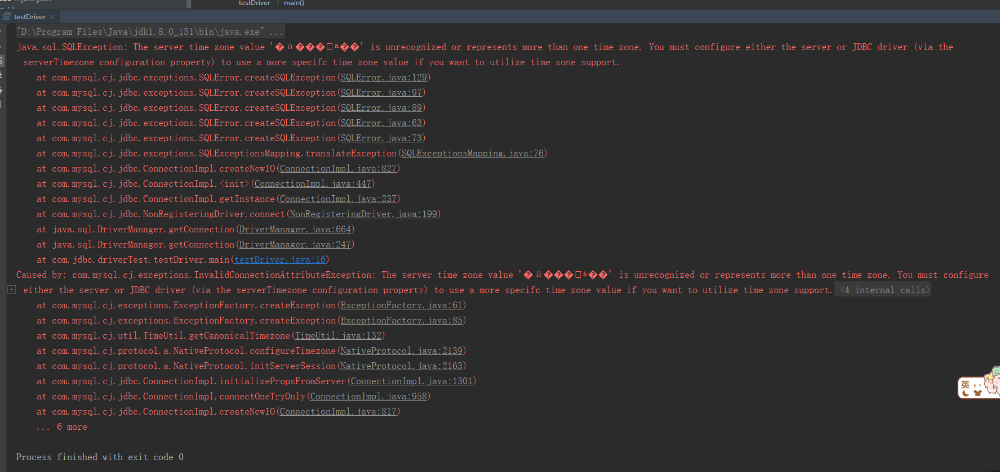

# JDBC连接问题

环境：win10、mysql-8.17、jdbc8.17

```java
 String url = "jdbc:mysql://localhost:3306/books";
        try {
            Class.forName("com.mysql.jdbc.Driver");
            Connection connection = DriverManager.getConnection(url,"root","123456");
            System.out.println(connection);
        } catch (Exception e) {
            e.printStackTrace();
        }
```

报出一下警告错误：

==*<u>Loading class `com.mysql.jdbc.Driver'. This is deprecated. The new driver class is `com.mysql.cj.jdbc.Driver'. The driver is automatically registered via the SPI and manual loading of the driver class is generally unnecessary.*</u>==

这是因为我的mysql版本为8以上，连接方式有点变化，5.0以上是`Class.forName("com.mysql.jdbc.Driver");`， 而现在不推荐这样了，应该改为`com.mysql.cj.jdbc.Driver`

然后继续运行：又来一堆错误。。。。。。。。。。。。。。。



还是因为的的mysql版本过高。。。时区有问题。改成下面方式即可解决：

```
 String url = "jdbc:mysql://localhost:3306/books?serverTimezone=UTC";
```

