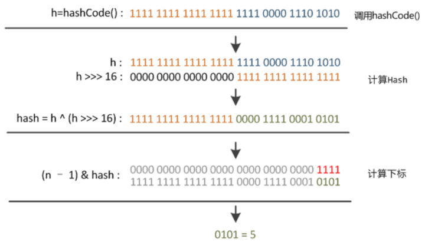

# 一、 概述

## Collection

​		集合是存储对象的容器，集合中可以存储任意类型的对象，而且长度可变。在程序中有可能无法预先知道需要多少个对象，那么用数组来装对象的话，长度不好定义，而集合解决了这样的问题。

​		 容器主要包括 Collection 和 Map 两种，Collection 存储着对象的集合，而 Map 存储着键值对（两个对象）的映射表。 


`																		注： 带对号的是线程安全类。`

### 集合和数组的区别

数组和集合类都是容器

- 数组长度是**固定的**，集合长度是**可变的**。数组中可以存储基本数据类型，**集合只能存储对象**

- 数组中存储数据类型是单一的，集合中可以存储任意类型的对象。
- 集合类的特点：`用于存储对象，长度是可变的，可以存储不同类型的对象。`


- 从上图可以看到，Set、List、Queue都是继承Collection接口。（Map是接口，下面会详细描述）
- Set下面有HashSet、LinkedHashSet以及一个SortedSet接口，TreeSet继承SortedSet接口，说明TreeSet里面的元素一定是有序的。
- List下面有ArrayList、Vector、 LinkedList
- Queue下面有LinkedList和PriorityQueue类(堆结构：优先级队列)，说明LinkedLIst可以当做队列来使用。

### 1. Set：唯一性

#### TreeSet

基于**红黑树**实现，支持**有序性**操作，例如根据一个范围查找元素的操作。但是查找效率不如 HashSet，HashSet 查找的时间复杂度为 O(1)，TreeSet 则为 O(logN)。红黑树的算法规则是**左小右大**。

1. 红黑树是一种特定类型的二叉树， 是一种含有红黑结点并能自平衡的二叉查找树。它必须满足下面性质： 

   ​	性质1：每个节点要么是黑色，要么是红色。

   ​	性质2：根节点是黑色。

   ​	性质3：每个叶子节点（NIL）是黑色。

   ​	性质4：每个红色结点的两个子结点一定都是黑色。

   ​	**性质5：任意一结点到每个叶子结点的路径都包含数量相同的黑结点。**

   

    

   红黑树以后会补上，详解见： [30张图带你彻底理解红黑树]( https://www.jianshu.com/p/e136ec79235c )

2. TreeSet可以自然排序，那么TreeSet必定具有排序规则的

   ​	① 元素自身具有比较性，需要实现Comparable接口，重写compareTo方法。这种方式叫做元素的自然排序

   ​	② 容器具备比较性，当元素不具备比较性，或者自身具备的比较性不是所需要的，那么此时也可以让容器自身具备。需要定义一个类实现Comparator接口， 重写compare方法，并将该接口的子类实例对象作为参数传递给TreeSet集合的构造方法。（`注： 当Comparable比较方式和Comparator比较方式同时存在，以Comparator为主`）

   ​	③ 基本数据类型具备自身比较性，比如String， int等，String内部已经继承了Comparable接口，所以具备比较性，我们自己定义的元素，想要存入TreeSet中，就必须自己实现该接口，也就是说要让对象具备就比较性，如果存入相同的元素则只会存入一个到TreeSet中。

   ​	④ TreeSet中如何保证元素的唯一性： 通过compareTo或者compare方法来保证元素的唯一性。

   Person类中有name和age属性，下面是重写的compareTo方法以及hashCode和equals方法。这是使元素自身具备比较性：

   ```java
     @Override
       public int hashCode() {
           return nama.hashCode() + age*33;
       }
   
       @Override
       public boolean equals(Object obj) {
           if(!(obj  instanceof  Person)){
               return false;
           }
   
           Person p = (Person)obj;
           return this.nama.equals(p.nama) && this.age == p.age;
       }
      
   	@Override
       public int compareTo(Object o) {
           Person p = (Person)o;
           if(this.age > p.age){
               return 1;
           }
           if(this.age <  p.age){
               return -1;
           }
           return this.nama.compareTo(p.nama);
       }
   ```

   下面是是使容器自身具备比较性，要自定义比较器：定义一个类实现Comparator接口， 重写compare方法，并将该接口的子类实例对象作为参数传递给TreeSet集合的构造方法。

   ```java
   class MyComparator implements Comparator{
   
       @Override
       public int compare(Object o1, Object o2) {
           Person p1 = (Person) o1;
           Person p2 = (Person) o2;
           // 首先比较年龄，年龄不一样就是不同元素，因为存在同名的人
           if(p1.getAge() > p2.getAge()){ // 按照年龄升序排列
               return 1;
           }
           if( p1.getAge() < p2.getAge()){
               return -1;
           }
           // 如果年龄相同则比较姓名
           return p1.getNama().compareTo(p2.getNama());
       }
   }
   
    public static void main(String[] args) {
   
           TreeSet<Person> set = new TreeSet<>(new MyComparator()); // 传入比较器
           set.add(new Person("张三", 12));
           set.add(new Person("李四", 5));
           set.add(new Person("李四", 12));
   
           set.add(new Person("tom", 24));
           set.add(new Person("tom" , 24));
   
           for (Person p: set){
               out.println(p.getNama()+"   "+p.getAge());
           }
    }
   输出： 
   李四   5
   张三   12
   李四   12
   tom   24
   
   可以看到重名的tom是相同的元素，智慧添加一个到TreeSet中，并且输出的顺序是按照年龄大小排列的
   
   
   ```

   

#### HashSet

基于**哈希表**实现，支持快速查找，但不支持有序性操作。并且失去了元素的插入顺序信息，也就是说使用 Iterator 遍历 HashSet 得到的结果是不确定的。（无序）

1. HashSet是按照哈希值来存数据的，所以取数据也是按照哈希值取得的。

2. Set具有元素的唯一性，所以HashSet也具有此特性。

3. HashSet如何检查重复呢？

   > ​	HashSet通过hashCode值来确定元素在内存中的位置。一个hashCode位置上可以存放对个元素。元素的哈希值是通过元素的hashCode方法来获取的， HashSet首先判断两个元素的哈希值，如果哈希值一样，接着会比较equals方法；如果hashCode不一样就不会再调用equals方法了。如果equals方法返回true，那么HashSet认为新加入的对象重复了加入失败。如果equals方法为false那么HashSet认为新加入的对象没有重复，新元素可以加入。

#### LinkedHashSet

具有 HashSet 的查找效率，并且内部使用**双向链表**维护元素的插入顺序。（有序）

1. 由链表保证元素有序
2. 由哈希表保证元素唯一 


### 2. List

List特有的方法

> 1： 增加
>
> ​					void add(int index, E elem) 指定位置添加元素
>
> ​					boolean addAll(int index, COllection c)   指定位置添加集合
>
> 2： 删除
>
> ​					E remove(int index)				删除指定位置元素
>
> 3： 查找
>
> ​					E get(int index)			注意 IndexOutOfBoundsException
>
> ​					int indexOf(Object o) 		找不到返回 -1 
>
> ​					lastIndexOf(Object o) 		
>
> 4： 修改
>
> ​					E set(int index, E elem)  			 返回的是需要替换的集合中的元素
>
> 5： 求子集合
>
> ​					List<E> subList(int fromIndex, int toIndex)  //   包含toIndex

#### ArrayList

基于动态数组实现，支持随机访问。 底层采用数组实现， 默认为10. 查询快，增删慢。在实际开发过程中，ArrayList 是使用频率最高的一个集合。

#### Vector

和 ArrayList 类似，但它是线程安全的。描述的是一个线程安全的ArrayList

ArrayList： 单线程效率高

Vector：  多线程安全， 所以效率低

特有的方法

> ​	void addElement(E obj) 	在集合末尾添加元素
>
> ​	E elementAt(int index)		返回指定角标的元素
>
> ​	Enumeration elements()  返回集合中的所有元素， 封装到Enumeration对象中
>
> ​	Enumeration 接口：
>
> ​			boolean hashMoreElements()			 测试此枚举的对象是否包含更多的元素
>
> ​			E  nextElement()			返回下一个元素


#### LinkedList

基于双向链表实现，只能顺序访问，但是可以快速地在链表中间插入和删除元素。不仅如此，**LinkedList 还可以用作栈、队列和双向队列。**

​	1. 特有方法：

> ​	addFirst(E  e)
>
> ​	addLast(E  e)
>
> ​	getFirst( )
>
> ​	getLast( )
>
> ​	removeFirst()
>
> ​	removeLast()

2. 数据结构

   > 1： 栈（1.6）：push()   pop()
   >
   > 2:   队列 ： offer()    poll()

   ```java
     		 // 栈
           LinkedList list  = new LinkedList();
           list.push(2);
           list.push(4);
           list.push(5);
           list.push(6);
           
   
           Iterator it = list.iterator();
           while (it.hasNext()){
               out.println(it.next());
           }
   ```

   输出：

   6
   5
   4
   2

   模拟队列：

   ```java
    	LinkedList q  = new LinkedList();
       q.offer(2);
       q.offer(3);
       q.offer(5);
   
       q.poll();
   
       Iterator it1 = q.iterator();
       while (it1.hasNext()){
           out.println(it1.next());
       }
   
   ```

   3. 返回逆序的迭代器对

      > ​	descendingItrerator()   返回逆序的迭代器对象

### 3. Queue

#### LinkedList

​	可以用它来实现双向队列。

#### PriorityQueue

​	基于堆结构实现，可以用它来实现优先队列。

### 总结

> 看到Array： 想到角标
>
> 看到Link： 想到first、last
>
> 看到Hash： 想到hashCode、equals
>
> 看到Tree： 想到两个接口： Comparable、 Comparator


## Map

Map与Collection在框架中属并两列存在。interface Map<K, V>


Map一次存储一对元素，Collection一次存一个。Map的键不能重复，保证唯一。

### TreeMap

​		基于红黑树实现。可以对键进行排序。排序方法和TreeSet中类似，对于不具备比较性的对象需要自定义比较器传入容器中。

### HashMap

​		基于哈希表实现， 无序，线程不同步，要保证键的唯一性，需要重写hashCode方法和equals方法。

### HashTable

- 和 HashMap 类似，但它是线程安全的，这意味着同一时刻多个线程同时写入 HashTable 不会导致数据不一致。它是遗留类，不应该去使用它，而是使用 ConcurrentHashMap 来支持线程安全，ConcurrentHashMap 的效率会更高，因为 ConcurrentHashMap 引入了分段锁。
-  Hashtable不允许null值，HashMap允许null值（key和value都允许 )
- 效率比HashMap低

### LinkedHashMap

​		继承了HashMap。使用双向链表来维护元素的顺序，顺序为插入顺序或者最近最少使用（LRU）顺序。


## 遍历

### 迭代器

> 迭代器： 为了方便处理集合中的元素，出现了迭代器对象。这个对象比较特殊，不能通过new来创建，它是以**内部类**的形式存在于每个集合的内部。

​		每个容器都能取出元素的功能，定义一样，只不过不同的容器使用的数据结构不同而导致取出元素的具体实现不一样，将共性抽取出来形成Iterator接口。每一个容易在其内部进行了内部类的实现。也就是将取出元素的方式的细节进行封装。

### Iterable

JDK1.5后的新接口。Collection继承了此接口，实现了Iterable的类就是可以进行迭代的，并且支持增强for循环。

### Iterator

Iterable 接口只有一个返回迭代器的方法Iterator().  Iterator是迭代器对象。

> Iteartor<T>   Iterator()   返回该集合的迭代器对象

while循环进行迭代器遍历：

```java
        LinkedList list  = new LinkedList();
        list.push(2);
        list.push(4);
        list.push(5);
        list.push(6);
		// 迭代器遍历
        Iterator it = list.iterator();
        while (it.hasNext()) {
            out.println(it.next());
        }

```

for循环：

```java
for (Iterator it = list.iterator(); it.hasNext();){
            out.println(it.next());
        }
```

推荐使用for循环，因为可以进行内存上的优化。

> 1. 如果迭代器的指针已经指向了集合的末尾， 那么如果再调用next() 会返NoSuchElementException                                  异常。
>
> 2. 如果调用move方法之前没用调用next是不合法的。会抛出IllegaStateException


### 迭代器原理

ArrayList： 看源码

```java
public Iterator<E> iterator() {
        return new Itr();
    }
```

看看Itr()  方法

```java
private class Itr implements Iterator<E> {
        int cursor;       // index of next element to return 下一个元素的下标
        int lastRet = -1; // index of last element returned; -1 if no such
        int expectedModCount = modCount;

    	// 如果当前的下标大小不等于容器个元素个数 就 说明还有下一个元素
        public boolean hasNext() {
            return cursor != size;  
        }

    	// 返回下一个元素
        @SuppressWarnings("unchecked")
        public E next() {
            checkForComodification();
            int i = cursor;
            if (i >= size)  //  没有下一个元素了
                throw new NoSuchElementException();
            Object[] elementData = ArrayList.this.elementData;
            if (i >= elementData.length)
                throw new ConcurrentModificationException();
            cursor = i + 1; // 当前的cursor要指向下一个
            return (E) elementData[lastRet = i];  // 返回元素 
        }

        public void remove() {
            if (lastRet < 0)
                throw new IllegalStateException();
            checkForComodification();

            try {
                ArrayList.this.remove(lastRet);
                cursor = lastRet;
                lastRet = -1;
                expectedModCount = modCount;
            } catch (IndexOutOfBoundsException ex) {
                throw new ConcurrentModificationException();
            }
        }
```

来看看上面代码的`checkForComodification();`

```java
final void checkForComodification() {
            if (modCount != expectedModCount)
                throw new ConcurrentModificationException();
        }
```

​		在对集合进行迭代过程中，不允许出现迭代器以外的对元素的操作， 因为这样会产生安全隐患，java会抛出异常并发修改异常`ConcurrentModificationException`， 普通迭代器只支持在迭代过程中的删除操作。

```java
 public static void main(String[] args) {
        ArrayList list = new ArrayList();
        list.add("aaa");
        list.add("bbb");
        list.add("ccc");
        list.add("ddd");
        list.add("eee");
        System.out.println(list);
        Iterator it =  list.iterator();
        while (it.hasNext()){
            it.next();
            it.remove();
            list.add("aaaaa"); // 出现了迭代器以外的对元素的操作
        }

    }
```

​		报错：


### List 特有的迭代器ListIterator

如果想在迭代元素的过程中操作集合的元素，那么可以使用LIst特有的迭代器对象ListIterator，该迭代器可支持在迭代的过程中添加元素和修改元素。

implements ListIterator<E> 接口

```java
public ListIterator<E> listIterator() {
        return new ListItr(0);
    }
```

```java
 private class ListItr extends Itr implements ListIterator<E> {
        ListItr(int index) {
            super();
            cursor = index;
        }

     	// 是否有前一个元素
        public boolean hasPrevious() {
            return cursor != 0;
        }
		// 返回下一个元素的下标
        public int nextIndex() {
            return cursor;
        }
		// 返回前一个元素的下标
        public int previousIndex() {
            return cursor - 1;
        }
		// 返回前一个元素： 可以逆序访问
        @SuppressWarnings("unchecked")
        public E previous() {
            checkForComodification();
            int i = cursor - 1;
            if (i < 0)
                throw new NoSuchElementException();
            Object[] elementData = ArrayList.this.elementData;
            if (i >= elementData.length)
                throw new ConcurrentModificationException();
            cursor = i;
            return (E) elementData[lastRet = i];
        }
		// 用指定元素替换next或者 previous返回的最后一个元素
        public void set(E e) {
            if (lastRet < 0)
                throw new IllegalStateException();
            checkForComodification();

            try {
                ArrayList.this.set(lastRet, e);
            } catch (IndexOutOfBoundsException ex) {
                throw new ConcurrentModificationException();
            }
        }
		// 将指定的元素加入列表，钙元素直接插入到next元素的后面
        public void add(E e) {
            checkForComodification();

            try {
                int i = cursor;
                ArrayList.this.add(i, e);
                cursor = i + 1;
                lastRet = -1;
                expectedModCount = modCount;
            } catch (IndexOutOfBoundsException ex) {
                throw new ConcurrentModificationException();
            }
        }
    }
```

测试 set方法：

```java
 public static void main(String[] args) {
        ArrayList list = new ArrayList();
        list.add("aaa");
        list.add("bbb");
        list.add("ccc");
        list.add("ddd");
        list.add("eee");
        System.out.println(list);
        ListIterator it = list.listIterator();
       System.out.println(it.next());
       it.set("zhu");
       System.out.println(list);

    }
```

> 输出：
>
> [aaa, bbb, ccc, ddd, eee]
> aaa
> [zhu, bbb, ccc, ddd, eee]

测试 add方法

```java
public static void main(String[] args) {
        ArrayList list = new ArrayList();
        list.add("aaa");
        list.add("bbb");
        list.add("ccc");
        list.add("ddd");
        list.add("eee");
        System.out.println(list);
        ListIterator it = list.listIterator();
       System.out.println(it.next());
       it.add("zhu");  // 在aaa之后添加zhu
       System.out.println(list);
    }
```

> 输出：
>
> [aaa, bbb, ccc, ddd, eee]
> aaa
> [aaa, zhu, bbb, ccc, ddd, eee]


### 遍历Map

有三种方式：

1. keySet() 获取Map中的所有键，转换成Set集合，然后遍历该Set，通过get方法获取键对应的值
2. values() 方法来获取所有值 ：Collection<V> values()  不能获取到key对象
3. **Map.Entry对象：重点！！！！推荐使用**： Interface Map.Entry<K,V>

#### Map.Entry

`public static interface Map.Entry<K,V>`

将map集合中的键值对关系打包成一个Map.Entry对象，将该对象存入Set结合中，使用getKey() 和 getValue()来获取键和值

```java
 public static void main(String[] args) {
        HashMap<String, Integer> map = new HashMap<>();
        map.put("aaa", 123);
        map.put("bbb", 345);
        map.put("ccc", 121);
        map.put("ddd", 675);

        Set<Map.Entry<String, Integer>> s = map.entrySet();
        Iterator<Map.Entry<String, Integer>> iterator = s.iterator();
        while (iterator.hasNext()){
            Map.Entry<String, Integer> en = iterator.next();
            System.out.println("键： "+ en.getKey()+" 值："+ en.getValue());
        }
    }
```

> 键： aaa 值：123
> 键： ccc 值：121
> 键： bbb 值：345
> 键： ddd 值：675

------


## 源码分析

 如果没有特别说明，以下源码分析基于 JDK 1.8。 

------

### 一、 ArrayList

#### 1. 概览

 因为 ArrayList 是基于数组实现的，所以支持快速随机访问。RandomAccess 接口标识着该类支持快速随机访问。 

```java
public class ArrayList<E> extends AbstractList<E>
        implements List<E>, RandomAccess, Cloneable, java.io.Serializable
```

```java
	/**
     * Default initial capacity.  数组的默认大小为10
     */
    private static final int DEFAULT_CAPACITY = 10;
```


#### 2. 扩容

​		添加元素时使用  `ensureCapacityInternal()`  方法来保证容量足够，如果不够时，需要使用 `grow()` 方法进行扩容，新容量的大小为   `oldCapacity + (oldCapacity >> 1)`  ，也就是旧容量的 1.5 倍。

​		 扩容操作需要调用 `Arrays.copyOf()` 把原数组整个复制到新数组中，这个操作代价很高，因此最好在创建 ArrayList 对象时就指定大概的容量大小，减少扩容操作的次数。

```java
public boolean add(E e) {
    ensureCapacityInternal(size + 1);  // Increments modCount!!
    elementData[size++] = e;
    return true;
}
// 
private void ensureCapacityInternal(int minCapacity) {
    if (elementData == DEFAULTCAPACITY_EMPTY_ELEMENTDATA) {
        minCapacity = Math.max(DEFAULT_CAPACITY, minCapacity);
    }
    ensureExplicitCapacity(minCapacity);
}

private void ensureExplicitCapacity(int minCapacity) {
    modCount++;
    // overflow-conscious code
    if (minCapacity - elementData.length > 0)
        grow(minCapacity);
}

private void grow(int minCapacity) {
        // overflow-conscious code
        int oldCapacity = elementData.length;
        int newCapacity = oldCapacity + (oldCapacity >> 1);
        if (newCapacity - minCapacity < 0)
            newCapacity = minCapacity;
        if (newCapacity - MAX_ARRAY_SIZE > 0)
            newCapacity = hugeCapacity(minCapacity);
        // minCapacity is usually close to size, so this is a win:
        elementData = Arrays.copyOf(elementData, newCapacity);
    }

```

 

#### 3. 删除元素

 		需要调用      `System.arraycopy()`     将    `index+1 `      后面的元素都复制到 `index` 位置上，该操作的时间复杂度为 `O(N)`，可以看到 ArrayList 删除元素的代价是非常高的。 

```java
 public E remove(int index) {
        rangeCheck(index);

        modCount++;
        E oldValue = elementData(index);

        int numMoved = size - index - 1;
        if (numMoved > 0)
            System.arraycopy(elementData, index+1, elementData, index,
                             numMoved);
        elementData[--size] = null; // clear to let GC do its work

        return oldValue;
    }
```

#### 4. 序列化

​		ArrayList 基于数组实现，并且具有**动态扩容特性**，因此保存元素的数组不一定都会被使用，那么就没必要全部进行序列化。

​		保存元素的数组 elementData 使用 `transient` 修饰，**该关键字声明数组默认不会被序列化**。

```java
transient Object[] elementData; // non-private to simplify nested class access
```

 	

​	ArrayList 实现了 `writeObject()` 和 `readObject()` 来控制只序列化数组中有元素填充那部分内容。 


```java
/**
     * Reconstitute the <tt>ArrayList</tt> instance from a stream (that is,
     * deserialize it).  反序列化
     */
    private void readObject(java.io.ObjectInputStream s)
        throws java.io.IOException, ClassNotFoundException {
        elementData = EMPTY_ELEMENTDATA;

        // Read in size, and any hidden stuff
        s.defaultReadObject();

        // Read in capacity
        s.readInt(); // ignored

        if (size > 0) {
            // be like clone(), allocate array based upon size not capacity
            int capacity = calculateCapacity(elementData, size);
            SharedSecrets.getJavaOISAccess().checkArray(s, Object[].class, capacity);
            ensureCapacityInternal(size);

            Object[] a = elementData;
            // Read in all elements in the proper order.
            for (int i=0; i<size; i++) {
                a[i] = s.readObject();
            }
        }
    }
```

```java
 /**
     * Save the state of the <tt>ArrayList</tt> instance to a stream (that
     * is, serialize it).  序列化
     *
     * @serialData The length of the array backing the <tt>ArrayList</tt>
     *             instance is emitted (int), followed by all of its elements
     *             (each an <tt>Object</tt>) in the proper order.
     				只序列化数组中有元素填充那部分内容
     */
    private void writeObject(java.io.ObjectOutputStream s)
        throws java.io.IOException{
        // Write out element count, and any hidden stuff
        int expectedModCount = modCount;
        s.defaultWriteObject();

        // Write out size as capacity for behavioural compatibility with clone()
        s.writeInt(size);

        // Write out all elements in the proper order.
        for (int i=0; i<size; i++) {
            s.writeObject(elementData[i]);
        }

        if (modCount != expectedModCount) {
            throw new ConcurrentModificationException();
        }
    }
```

​		 序列化时需要使用 `ObjectOutputStream` 的 `writeObject()` 将对象转换为字节流并输出。而 `writeObject()` 方法在传入的对象存在 `writeObject()` 的时候会去反射调用该对象的 `writeObject()` 来实现序列化。反序列化使用的是 `ObjectInputStream` 的 `readObject()` 方法，原理类似。 

#### 5. Fail-Fast

​		**`modCount` 用来记录 ArrayList 结构发生变化的次数**。

> ​		结构发生变化是指添加或者删除至少一个元素的所有操作，或者是调整内部数组的大小，仅仅只是设置元素的值不算结构发生变化。

​		在进行序列化或者迭代等操作时，需要比较操作前后 `modCount` 是否改变，如果改变了需要抛出 `ConcurrentModificationException`。代码参考上节序列化中的 `writeObject()` 方法。

​		 `fail-fast` 机制是Java集合(Collection)中的一种错误机制。当多个线程对同一个集合的内容进行操作时，就可能会产生`fail-fast`事件。例如：当某一个线程A通过`iterator`去遍历某集合的过程中，若该集合的内容被其他线程所改变了；那么线程A访问集合时，就会抛出`ConcurrentModificationException`异常，产生`fail-fast`事件。

> ​	 `ConcurrentModificationException` 异常 ：  当方法检测到对象的并发修改，但不允许这种修改时就抛出该异常。同时需要注意的是，该异常不会始终指出对象已经由不同线程并发修改，如果单线程违反了规则，同样也有可能会抛出该异常。 

​		诚然，迭代器的**快速失败**行为无法得到保证，它不能保证一定会出现该错误，但是快速失败操作会尽最大努力抛出`ConcurrentModificationException`异常，所以因此，为提高此类操作的正确性而编写一个依赖于此异常的程序是错误的做法，正确做法是：`ConcurrentModificationException` 应该仅用于检测 bug。

​		 线程环境下产生该异常的原因是在迭代器遍历集合时，使用了集合本身的`remove`方法而不是迭代器的； 

```java
        final void checkForComodification() {
            if (modCount != expectedModCount)
                throw new ConcurrentModificationException();
        }
```

​		在ArrayList进行`add`，`remove`，`clear`等涉及到修改集合中的元素个数的操作时，`modCount`就会发生改变`(modCount ++)`,所以当另一个线程(并发修改)或者同一个线程遍历过程中，调用相关方法使集合的个数发生改变，就会使`modCount`发生变化，这样在`checkForComodification`方法中就会抛出`ConcurrentModificationException`异常。

 `fail-fast`会在以下两种情况下抛出`ConcurrentModificationException` ：

> （1）单线程环境
>
> 集合被创建后，在遍历它的过程中修改了结构。
>
> 注意 `remove()`方法会让`expectModcount`和`modcount` 相等，所以是不会抛出这个异常。
>
> （2）多线程环境
>
> 当一个线程在遍历这个集合，而另一个线程对这个集合的结构进行了修改。

**问题**： fail-fast机制是如何检测的？

​		迭代器在遍历过程中是直接访问内部数据的，因此内部的数据在遍历的过程中无法被修改。为了保证不被修改，迭代器内部维护了一个标记 “`modCount`” ，当集合结构改变（添加删除或者修改），标记"`modCount`"会被修改，而迭代器每次的`hasNext()`和`next()`方法都会检查该"`modCount`"是否被改变，当检测到被修改时，抛出`ConcurrentModificationException` 

##### 单线程情况

```java
 public static void main(String[] args) {
       List<String> list = new ArrayList<>();
       for (int i = 0 ; i < 10 ; i++ ) {
            list.add(i + "");
       }
       Iterator<String> iterator = list.iterator();
       int i = 0 ;
       while(iterator.hasNext()) {
            if (i == 3) {
                 list.remove(3);
            }
            System.out.println(iterator.next());
            i ++;
       }
 }
```
上述代码是ArrayList单线程环境下的fail-fast ， 该段代码定义了一个Arraylist集合，并使用迭代器遍历，在遍历过程中，刻意在某一步迭代中remove一个元素，这个时候，就会发生fail-fast。 


如果将以上代码修改成在next之后进行迭代器的remove操作，就不会报错。

```java
public static void main(String[] args) {
        List<String> list = new ArrayList<>();
        for (int i = 0 ; i < 10 ; i++ ) {
            list.add(i + "");
        }
        Iterator<String> iterator = list.iterator();
        int i = 0 ;
        while(iterator.hasNext()) {

            System.out.println(iterator.next());
            if (i == 3) {
                iterator.remove(); //  在next之后进行迭代器的remove操作
            }
            i ++;
        }
        System.out.println(list);
    }
```

输出：

> 0
> 1
> 2
> 3
> 4
> 5
> 6
> 7
> 8
> 9
> [0, 1, 2, 4, 5, 6, 7, 8, 9]

​		所以，在对集合进行迭代过程中，**不允许出现迭代器以外的对元素的操作**， 因为这样会产生安全隐患，java会抛出异常并发修改异常`ConcurrentModificationException`， 普通迭代器只支持在迭代过程中的删除操作。

类似的，hashMap中发生的原理也是一样的。 

 HashMap发生fail-fast ：

```java
 public static void main(String[] args) {
       Map<String, String> map = new HashMap<>();
       for (int i = 0 ; i < 10 ; i ++ ) {
            map.put(i+"", i+"");
       }
       Iterator<Entry<String, String>> it = map.entrySet().iterator();
       int i = 0;
       while (it.hasNext()) {
            if (i == 3) {
                 map.remove(3+"");
            }
            Entry<String, String> entry = it.next();
            System.out.println("key= " + entry.getKey() + " and value= " + entry.getValue());
            i++;
    }
 }
```
 该段代码定义了一个hashmap对象并存放了10个键值对，在迭代遍历过程中，使用map的remove方法移除了一个元素，导致抛出了`ConcurrentModificationException`异常： 

​		

类似，next之后调用迭代器的remove就可以成功删除。

##### 多线程情况

```java
import java.util.ArrayList;
import java.util.Iterator;
import java.util.List;

/**
 * @author Hongliang Zhu
 * @create 2020-02-10 12:53
 */
public class FailFastTest {
    public static List<String> list = new ArrayList<>();

    private static class MyThread1 extends Thread {
        @Override
        public void run() {
            Iterator<String> iterator = list.iterator();
            while(iterator.hasNext()) {
                String s = iterator.next();
                System.out.println(this.getName() + ":" + s);
                try {
                    Thread.sleep(1000);
                } catch (InterruptedException e) {
                    e.printStackTrace();
                }
            }
            super.run();
        }
    }

    private static class MyThread2 extends Thread {
        int i = 0;
        @Override
        public void run() {
            while (i < 10) {
                System.out.println("thread2:" + i);
                if (i == 2) {
                    list.remove(i);
                }
                try {
                    Thread.sleep(1000);
                } catch (InterruptedException e) {
                    e.printStackTrace();
                }
                i ++;
            }
        }
    }

    public static void main(String[] args) {
        for(int i = 0 ; i < 10;i++){
            list.add(i+"");
        }
        MyThread1 thread1 = new MyThread1();
        MyThread2 thread2 = new MyThread2();
        thread1.setName("thread1");
        thread2.setName("thread2");
        thread1.start();
        thread2.start();
    }
}
```

 启动两个线程，分别对其中一个对list进行迭代，另一个在线程1的迭代过程中去remove一个元素，结果也是抛出了`java.util.ConcurrentModificationException` 


#####  **避免fail-fast** 

方法一:

 		在单线程的遍历过程中，如果要进行`remove`操作，可以调用迭代器的`remove`方法而不是集合类的`remove`方法。看看ArrayList中迭代器的remove方法的源码:

```java
public void remove() {
    if (lastRet < 0)
        throw new IllegalStateException();
    checkForComodification();

    try {
        ArrayList.this.remove(lastRet);
        cursor = lastRet;
        lastRet = -1;
        expectedModCount = modCount;  /// 不会修改modCount，而是令其余expectedModCount相等
    } catch (IndexOutOfBoundsException ex) {
        throw new ConcurrentModificationException();
    }
}
```

​		 可以看到，该remove方法并不会修改`modCount`的值，并且不会对后面的遍历造成影响，因为该方法remove不能指定元素，只能remove当前遍历过的那个元素，所以调用该方法并不会发生`fail-fast`现象。该方法有局限性，就是上面说的，只能代用next方法之后再调用迭代器的remove方法。

方法二：安全失败

​		使用java并发包`(java.util.concurrent)`中的类来代替ArrayList 和hashMap。
​		比如使用 `CopyOnWriterArrayList`代替`ArrayList`，`CopyOnWriterArrayList`在是使用上跟`ArrayList`几乎一样，`CopyOnWriter`是写时复制的容器(COW)，在读写时是线程安全的。该容器在对`add`和`remove`等操作时，并不是在原数组上进行修改，而是将原数组拷贝一份，在新数组上进行修改，待完成后，才将指向旧数组的引用指向新数组，所以对于`CopyOnWriterArrayLis`t在迭代过程并不会发生`fail-fast`现象。**但 `CopyOnWrite`容器只能保证数据的最终一致性，不能保证数据的实时一致性。**
​		对于`HashMap`，可以使用`ConcurrentHashMap`，`ConcurrentHashMap`采用了**锁机制**，**是线程安全的**。在迭代方面，`ConcurrentHashMap`使用了一种不同的迭代方式。在这种迭代方式中，当`iterator`被创建后集合再发生改变就不再是抛出`ConcurrentModificationException`，取而代之的是：在改变时`new`新的数据从而不影响原有的数据 ，`iterator`完成后再将头指针替换为新的数据 ，这样`iterator`线程可以使用原来老的数据，而写线程也可以并发的完成改变。即迭代不会发生`fail-fast`，但不保证获取的是最新的数据。


####  6. 安全失败（fail—safe） 

>  		快速失败（Fail-Fast）的场景： `java.util`包下的集合类都是快速失败的，不能在多线程下发生并发修改（迭代过程中被修改）。 
>

​		采用安全失败机制的集合容器，在遍历时不是直接在集合内容上访问的，而是先复制原有集合内容，在拷贝的集合上进行遍历。比如上面说的COW

>   	 **原理：**由于迭代时是对原集合的拷贝进行遍历，所以在遍历过程中对原集合所作的修改并不能被迭代器检测到，所以不会触发Concurrent Modification Exception。
>
>    	**缺点：**基于拷贝内容的优点是避免了Concurrent Modification Exception，但同样地，迭代器并不能访问到修改后的内容，即：迭代器遍历的是开始遍历那一刻拿到的集合拷贝，在遍历期间原集合发生的修改迭代器是不知道的。
>

​     场景：`java.util.concurrent`包下的容器都是安全失败，可以在多线程下并发使用，并发修改。

>  并发修改 ： 当一个或多个线程正在遍历一个集合Collection，此时另一个线程修改了这个集合的内容（添加，删除或者修改）。这就是并发修改 。

fail-safe机制有两个问题

（1）需要复制集合，产生大量的无效对象，开销大。

（2）无法保证读取的数据是目前原始数据结构中的数据。

#### 7.  fail-fast和 fail-safe 的区别 

|                                        |        Fail Fast Iterator        | Fail Safe Iterator                      |
| -------------------------------------- | :------------------------------: | --------------------------------------- |
| Throw ConcurrentModification Exception |               Yes                | No                                      |
| Clone object                           |                No                | Yes                                     |
| Memory Overhead                        |                No                | Yes                                     |
| Examples                               | HashMap,Vector,ArrayList,HashSet | CopyOnWriteArrayList, ConcurrentHashMap |


------

### 二、 Vector

```java
public class Vector<E>
    extends AbstractList<E>
    implements List<E>, RandomAccess, Cloneable, java.io.Serializable
```

也继承了RandomAccess接口， 可以随机访问。

#### 1. 同步


 		**它的实现与 ArrayList 类似，但是使用了 `synchronized` 进行同步。**


```java
public synchronized boolean add(E e) {
    modCount++;
    ensureCapacityHelper(elementCount + 1);
    elementData[elementCount++] = e;
    return true;
}

public synchronized E get(int index) {
    if (index >= elementCount)
        throw new ArrayIndexOutOfBoundsException(index);

    return elementData(index);
}
```

#### 2 . 扩容

​			Vector 的构造函数可以传入 `capacityIncrement` 参数，它的作用是在扩容时使容量 `capacity` 增长 `capacityIncrement`。如果这个参数的值小于等于 0，扩容时每次都令 `capacity` 为原来的两倍。

```java
 /**
     * Constructs an empty vector with the specified initial capacity and
     * capacity increment. 构造函数
     *
     * @param   initialCapacity     数组的初始容量
     * @param   capacityIncrement   扩容时使容量 `capacity` 增长 `capacityIncrement`
     * @throws IllegalArgumentException if the specified initial capacity
     *         is negative
     */
    public Vector(int initialCapacity, int capacityIncrement) {
        super();
        if (initialCapacity < 0)
            throw new IllegalArgumentException("Illegal Capacity: "+
                                               initialCapacity);
        this.elementData = new Object[initialCapacity];
        this.capacityIncrement = capacityIncrement;
    }
```

```java
private void grow(int minCapacity) {
        // overflow-conscious code
        int oldCapacity = elementData.length;
    	// 如果这个参数的值小于等于 0，扩容时每次都令 capacity 为原来的两倍。
        int newCapacity = oldCapacity + ((capacityIncrement > 0) ?
                                         capacityIncrement : oldCapacity);
        if (newCapacity - minCapacity < 0)
            newCapacity = minCapacity;
        if (newCapacity - MAX_ARRAY_SIZE > 0)
            newCapacity = hugeCapacity(minCapacity);
        elementData = Arrays.copyOf(elementData, newCapacity);
    }
```

​		调用没有 `capacityIncrement` 的构造函数时，`capacityIncrement` 值被设置为 0，也就是说默认情况下 Vector 每次扩容时容量都会翻倍。 

```java
public Vector(int initialCapacity) {
    this(initialCapacity, 0);
}

public Vector() {
    this(10);
}
```

#### 3. 与ArrayList的比较

- Vector 是同步的，因此开销就比 ArrayList 要大，访问速度更慢。最好使用 ArrayList 而不是 Vector，因为同步操作完全可以由程序员自己来控制；
- Vector 每次扩容请求其大小的 2 倍（也可以通过构造函数设置增长的容量），而 ArrayList 是 1.5 倍。

#### 4. 替代方案

 可以使用 `Collections.synchronizedList();` 得到一个线程安全的 ArrayList。 

```
List<String> list = new ArrayList<>();
List<String> synList = Collections.synchronizedList(list);
```

```
 public static <T> List<T> synchronizedList(List<T> list) {
        return (list instanceof RandomAccess ?
                new SynchronizedRandomAccessList<>(list) :
                new SynchronizedList<>(list));
    }

    static <T> List<T> synchronizedList(List<T> list, Object mutex) {
        return (list instanceof RandomAccess ?
                new SynchronizedRandomAccessList<>(list, mutex) :
                new SynchronizedList<>(list, mutex));
    }
```

 也可以使用 `concurrent` 并发包下的 `CopyOnWriteArrayList` 类。 

```java
List<String> list = new CopyOnWriteArrayList<>();
```

---


### 三、 CopyOnWriteArrayList

#### 1. 读写分离

写操作在一个复制的数组上进行，读操作还是在原始数组中进行，读写分离，互不影响。

写操作需要加锁，防止并发写入时导致写入数据丢失。

写操作结束之后需要把原始数组指向新的复制数组。

```java
/**
     * Appends the specified element to the end of this list.
     * 添加一个元素： 写操作
     * @param e element to be appended to this list
     * @return {@code true} (as specified by {@link Collection#add})
     */
    public boolean add(E e) {
        final ReentrantLock lock = this.lock;
        lock.lock(); // 加锁
        try {
            Object[] elements = getArray();
            int len = elements.length;
            Object[] newElements = Arrays.copyOf(elements, len + 1);  // 复制数组
            newElements[len] = e;
            setArray(newElements); // 写操作结束之后需要把原始数组指向新的复制数组。
            return true;
        } finally {
            lock.unlock(); // 去锁操作
        }
    }

final void setArray(Object[] a) {
    array = a;
}

@SuppressWarnings("unchecked")
private E get(Object[] a, int index) {
    return (E) a[index];
}

```

#### 2. 适用场景

​		`CopyOnWriteArrayList` 在写操作的同时允许读操作，大大提高了读操作的性能，因此很适合**读多写少**的应用场景。

​	但是 `CopyOnWriteArrayList` 有其缺陷：

- 内存占用：在写操作时需要复制一个新的数组，使得内存占用为原来的两倍左右；
- 数据不一致：读操作不能读取实时性的数据，因为部分写操作的数据还未同步到读数组中。

所以 `CopyOnWriteArrayList` 不适合内存敏感以及对实时性要求很高的场景。


---


### 四、 Collections 与 Arrays 

集合框架中的工具类中的方法都是静态的

**Collection中的常见方法：**

1. 对List进行二分查找： int binarySearch(list, key)

   ​	 int binarySearch(list, key, Comparator)

   ​	二分查找需要列表有序

2. 对list集合进行排序

   sort(list):  其实是使用list容器中对象的CompareTo方法

   sort(list, comparator) //按照指定比较器进行排序

3. 对集合取最大值或者最小值 

   ​	max（collection）   min（collection）

4. 对集合进行反转

   ​	reverse(list)

5. 对比较方式强行逆转

   ​	Comparator reverseOrder();

   ​	Comparator reverseOrder(Comparator);

6. 对list中的元素的位置进行替换

   ​	swap(list, x, y);

7. 对集合中的元素进行替换， 如果被替换的元素不存在， 那么原来的集合不变

   ​		replaceAll(list, old, new);

8. 将集合变成数组

   ​	Collection.toArray()  【collection不是Collections工具类】

Arrays： 用于对数组操作的工具类: Arrays.方法()

1. 二分查找， 需要数组有序

   binarySearch(int [])

2. 数组排序

   sort(int [])

3.  将数组变成字符串

   toString(int [])

4. 复制数组

   ​	copyOf()

5. 复制部分数组

   copyOfRange()

6. 比较两个数组是否相同

   equals(int [], int [])

7. **将数组变成集合**：
   List  asList(T [])

   这样可以通过结合的操作来操作数组中的元素，但是不可以死使用增删方法， add， remove，因为数组的长度固定，会出现UnsupportOperationException.

   
   
   ---
   
   

### 五、 LinkedList

#### 1. 概览

​		 基于双向链表实现，使用 Node 存储链表节点信息。 

```java
public class LinkedList<E>
    extends AbstractSequentialList<E>
    implements List<E>, Deque<E>, Cloneable, java.io.Serializable
{
    transient int size = 0;

    /**
     * Pointer to first node.
     * Invariant: (first == null && last == null) ||
     *            (first.prev == null && first.item != null)
     */
    transient Node<E> first;

    /**
     * Pointer to last node.
     * Invariant: (first == null && last == null) ||
     *            (last.next == null && last.item != null)
     */
    transient Node<E> last;

    /**
     * Constructs an empty list.
     */
    public LinkedList() {
    }
    ...
}
```

每个链表存储了first和last指针，用Node来保存链表节点信息

```java
private static class Node<E> {
        E item;
        Node<E> next;
        Node<E> prev;

        Node(Node<E> prev, E element, Node<E> next) {
            this.item = element;
            this.next = next;
            this.prev = prev;
        }
    }
```


#### 2.与ArrayList的比较

​	`ArrayList` 基于动态数组实现，`LinkedList` 基于双向链表实现。`ArrayList` 和 `LinkedList` 的区别可以归结为数组和链表的区别：

- 数组支持随机访问，但插入删除的代价很高，需要移动大量元素；
- 链表不支持随机访问，但插入删除只需要改变指针。


---


### 六、 HashMap

为了便于理解，以下源码分析以 JDK 1.7 为主。 

#### 1. 存储结构

内部包含了一个 `Entry` 类型的数组 `table`。`Entry` 存储着键值对。它包含了四个字段，从 `next` 字段我们可以看出 `Entry` 是一个链表。即数组中的每个位置被当成一个桶，一个桶存放一个链表。`HashMap` 使用拉链法来解决冲突，同一个链表中存放哈希值和散列桶取模运算结果相同的 `Entry`。 


以下源码基于JDK1.7

```java
transient Entry[] table;
```

```java
static class Entry<K,V> implements Map.Entry<K,V> {
    final K key;
    V value;
    Entry<K,V> next;
    int hash;

    Entry(int h, K k, V v, Entry<K,V> n) {
        value = v;
        next = n;
        key = k;
        hash = h;
    }

    public final K getKey() {
        return key;
    }

    public final V getValue() {
        return value;
    }

    public final V setValue(V newValue) {
        V oldValue = value;
        value = newValue;
        return oldValue;
    }

    public final boolean equals(Object o) {
        if (!(o instanceof Map.Entry))
            return false;
        Map.Entry e = (Map.Entry)o;
        Object k1 = getKey();
        Object k2 = e.getKey();
        if (k1 == k2 || (k1 != null && k1.equals(k2))) {
            Object v1 = getValue();
            Object v2 = e.getValue();
            if (v1 == v2 || (v1 != null && v1.equals(v2)))
                return true;
        }
        return false;
    }

    public final int hashCode() {
        return Objects.hashCode(getKey()) ^ Objects.hashCode(getValue());
    }

    public final String toString() {
        return getKey() + "=" + getValue();
    }
}
```

​		HashMap中两个参数会影响他的性能：初始容量和装载因子。初始容量是指哈希表中桶的个数，即哈希表的大小； 装载因子是表示hash表中元素的填满的程度，装 载因子越大，填满的元素越多，好处是，空间利用率高了，但冲突的机会加大了；反之，加载因子越小，填满的元素越少，好处是冲突的机会减小了，但空间浪费多了。

​		冲突的机会越大，则查找的成本越高。反之，查找的成本越小，查找时间就越小。 因此，必须在 "冲突的机会"与"空间利用率"之间寻找一种平衡与折衷，这种平衡与折衷本质上是数据结构中有名的**"时-空"矛盾**的平衡与折衷。

​		HashMap默认的装载因子是0.75，最大容量是16，因此可以得出HashMap的默认容量是：0.75*16=12。

用户可以自定义最大容量和装载因子。

​	HashMap 包含如下几个构造器：

- HashMap()：构建一个初始容量为 16，负载因子为 0.75 的 HashMap。
- HashMap(int initialCapacity)：构建一个初始容量为 initialCapacity，负载因子为 0.75 的 HashMap。
- HashMap(int initialCapacity, float loadFactor)：以指定初始容量、指定的负载因子创建一个 HashMap。

#### 2. 拉链法工作原理

```java
HashMap<String, String> map = new HashMap<>();
map.put("K1", "V1");
map.put("K2", "V2");
map.put("K3", "V3");
```

- 新建一个 HashMap，默认大小为 16；

- 插入 <K1,V1> 键值对，先计算 K1 的 hashCode 为 115，使用除留余数法得到所在的桶下标 115%16=3。

- 插入 <K2,V2> 键值对，先计算 K2 的 hashCode 为 118，使用除留余数法得到所在的桶下标 118%16=6。

- 插入 <K3,V3> 键值对，先计算 K3 的 hashCode 为 118，使用除留余数法得到所在的桶下标 118%16=6，插在 <K2,V2> 前面。

  ​	应该注意到链表的插入是以**头插法**方式进行的，例如上面的 <K3,V3> 不是插在 <K2,V2> 后面，而是插入在链表头部。查找需要分成两步进行：

-  计算键值对所在的桶；

- 在链表上顺序查找，时间复杂度显然和链表的长度成正比。


​	

#### 3. put操作

```java
public V put(K key, V value) {
    if (table == EMPTY_TABLE) {
        inflateTable(threshold);
    }
    // 键为 null 单独处理
    if (key == null)
        return putForNullKey(value);
    int hash = hash(key);
    // 确定桶下标
    int i = indexFor(hash, table.length);
    // 先找出是否已经存在键为 key 的键值对，如果存在的话就更新这个键值对的值为 value
    for (Entry<K,V> e = table[i]; e != null; e = e.next) {
        Object k;
        if (e.hash == hash && ((k = e.key) == key || key.equals(k))) {
            V oldValue = e.value;
            e.value = value;
            e.recordAccess(this);
            return oldValue;
        }
    }

    modCount++;
    // 插入新键值对
    addEntry(hash, key, value, i);
    return null;
}
```

HashMap 允许插入键为 null 的键值对。但是因为无法调用 null 的 hashCode() 方法，也就无法确定该键值对的桶下标，只能通过强制指定一个桶下标来存放。HashMap 使用第 0 个桶存放键为 null 的键值对。

```java
private V putForNullKey(V value) {
    for (Entry<K,V> e = table[0]; e != null; e = e.next) {
        if (e.key == null) {
            V oldValue = e.value;
            e.value = value;
            e.recordAccess(this);
            return oldValue;
        }
    }
    modCount++;
    addEntry(0, null, value, 0);
    return null;
}

```

​	 使用链表的头插法，也就是新的键值对插在链表的头部，而不是链表的尾部。 

```java
void addEntry(int hash, K key, V value, int bucketIndex) {
    if ((size >= threshold) && (null != table[bucketIndex])) {
        resize(2 * table.length);
        hash = (null != key) ? hash(key) : 0;
        bucketIndex = indexFor(hash, table.length);
    }

    createEntry(hash, key, value, bucketIndex);
}

void createEntry(int hash, K key, V value, int bucketIndex) {
    Entry<K,V> e = table[bucketIndex];
    // 头插法，链表头部指向新的键值对
    table[bucketIndex] = new Entry<>(hash, key, value, e);
    size++;
}
```

```ava
Entry(int h, K k, V v, Entry<K,V> n) {
    value = v;
    next = n;
    key = k;
    hash = h;
}
```

##### **在JDK1.8中的put操作：**

  

 思路如下：

1.table[]是否为空

2.判断table[i]处是否插入过值

3.判断链表长度是否大于8，如果大于就转换为**红黑二叉树**，并插入树中

4.判断key是否和原有key相同，如果相同就覆盖原有key的value，并返回原有value

5.如果key不相同，就插入一个key，记录结构变化一次

```java
	/**
     * Implements Map.put and related methods
     *
     * @param hash hash for key
     * @param key the key
     * @param value the value to put
     * @param onlyIfAbsent if true, don't change existing value
     * @param evict if false, the table is in creation mode.
     * @return previous value, or null if none
     */
    final V putVal(int hash, K key, V value, boolean onlyIfAbsent,
                   boolean evict) {
        Node<K,V>[] tab; Node<K,V> p; int n, i;
        //判断table是否为空，如果是空的就创建一个table，并获取他的长度
        if ((tab = table) == null || (n = tab.length) == 0)
            n = (tab = resize()).length;
        //如果计算出来的索引位置之前没有放过数据，就直接放入
        if ((p = tab[i = (n - 1) & hash]) == null)
            tab[i] = newNode(hash, key, value, null);
        else {  //进入这里说明索引位置已经放入过数据了
            Node<K,V> e; K k;
             //判断put的数据和之前的数据是否重复
              //key的地址或key的equals()只要有一个相等就认为key重复了，就直接覆盖原来key的value
            if (p.hash == hash &&
                ((k = p.key) == key || (key != null && key.equals(k))))
                e = p;
            else if (p instanceof TreeNode) //判断是否是红黑树，如果是红黑树就直接插入树中
                e = ((TreeNode<K,V>)p).putTreeVal(this, tab, hash, key, value);
            else { //如果不是红黑树，就遍历每个节点，判断链表长度是否大于8，如果大于就转换为红黑树
                for (int binCount = 0; ; ++binCount) {
                    if ((e = p.next) == null) {
                        p.next = newNode(hash, key, value, null);
                        if (binCount >= TREEIFY_THRESHOLD - 1) // -1 for 1st
                            treeifyBin(tab, hash); // 转换为红黑树
                        break;
                    }
                     // 判断索引每个元素的key是否可要插入的key相同，如果相同就直接覆盖
                    if (e.hash == hash &&
                        ((k = e.key) == key || (key != null && key.equals(k))))
                        break;
                    p = e;
                }
            }
            //如果e不是null，说明没有迭代到最后就跳出了循环，说明链表中有相同的key，因此只需要将value覆盖，并将oldValue返回即可
            if (e != null) { // existing mapping for key
                V oldValue = e.value;
                if (!onlyIfAbsent || oldValue == null)
                    e.value = value;
                afterNodeAccess(e);
                return oldValue;
            }
        }
        //说明没有key相同，因此要插入一个key-value，并记录内部结构变化次数
        ++modCount;
        if (++size > threshold) // 扩容
            resize();
        afterNodeInsertion(evict); // 这个是给LinkedHashMap用的，HashMap里也是个空实现
        return null; // 添加成功返回null
    }
```

##### get方法

```java
public V get(Object key) {
        Node<K,V> e;
        return (e = getNode(hash(key), key)) == null ? null : e.value;
    }

    /**
     * Implements Map.get and related methods
     *
     * @param hash hash for key
     * @param key the key
     * @return the node, or null if none
     */
    final Node<K,V> getNode(int hash, Object key) {
        Node<K,V>[] tab; Node<K,V> first, e; int n; K k;
        if ((tab = table) != null && (n = tab.length) > 0 &&
            (first = tab[(n - 1) & hash]) != null) {
            if (first.hash == hash && // always check first node
                ((k = first.key) == key || (key != null && key.equals(k))))
                return first;
            if ((e = first.next) != null) {
                if (first instanceof TreeNode)
                    return ((TreeNode<K,V>)first).getTreeNode(hash, key);
                do {
                    if (e.hash == hash &&
                        ((k = e.key) == key || (key != null && key.equals(k))))
                        return e;
                } while ((e = e.next) != null);
            }
        }
        return null;
    }

```

#### 4. 确定桶下标

 很多操作都需要先确定一个键值对所在的桶下标。 

```java
int hash = hash(key);
int i = indexFor(hash, table.length);
```

#####  4.1  计算 hash 值（1.7）

```java
final int hash(Object k) {
    int h = hashSeed;
    if (0 != h && k instanceof String) {
        return sun.misc.Hashing.stringHash32((String) k);
    }

    h ^= k.hashCode();

    // This function ensures that hashCodes that differ only by
    // constant multiples at each bit position have a bounded
    // number of collisions (approximately 8 at default load factor).
    h ^= (h >>> 20) ^ (h >>> 12);
    return h ^ (h >>> 7) ^ (h >>> 4);
}
```

```java
public final int hashCode() {
    return Objects.hashCode(key) ^ Objects.hashCode(value);
}
```

#####  **4.2  取模** 

 令 x = 1<<4，即 x 为 2 的 4 次方，它具有以下性质： 

```c
x   : 00010000
x-1 : 00001111
```

 令一个数 y 与 x-1 做与运算，可以去除 y 位级表示的第 4 位以上数： 

```java
y       : 10110010
x-1     : 00001111
y&(x-1) : 00000010
```

 这个性质和 y 对 x 取模效果是一样的： 

```java
y   : 10110010
x   : 00010000
y%x : 00000010
```

我们知道，位运算的代价比求模运算小的多，因此在进行这种计算时用位运算的话能带来更高的性能。

确定桶下标的最后一步是将 key 的 hash 值对桶个数取模：hash%capacity，如果能保证 capacity 为 2 的 n 次方，那么就可以将这个操作转换为位运算。

```java
static int indexFor(int h, int length) {
    return h & (length-1);
}
```

##### 4.4 在JDK1.8中的hash方法

 `hash()`方法其实顾名思义就是用来获取key的hash的一个hash值的,但是HashMap里的hash()方法似乎与一般的直接key.hashCode()不太一样，我们先看看它到底是什么样的神奇操作。 其源码如下: 

```java
static final int hash(Object key) {
    int h;  
    // key是null就返回0，key不是null就先取hashCode（）然后与这个hashCode（）无符号右移进行亦或运算
    return (key == null) ? 0 : (h = key.hashCode()) ^ (h >>> 16); // 将hashCode的值异或他的高16位获取到hash值
}
```

​	这是因为找key的位置时，`(n - 1) & hash`是table的索引，n的长度不够大时，只和hashCode()的低16位有关，这样发生冲突的概率就变高

​	为减少这种影响，设计者权衡了speed, utility, and quality，将高16位与低16位异或来减少这种影响。设计者考虑到现在的hashCode分布的已经很不错了，而且当发生较大碰撞时也用树形存储降低了冲突。仅仅异或一下，既减少了系统的开销，也不会造成的因为高16位没有参与下标的计算(table长度比较小时)而引起的碰撞。

​		 我们知道hashCode本身是一个32位的int类型，进行这样的操作就等于将hashCode的高16位异或它的低16位得到一个新的hash值。 

   

但是拿到这样一个hash值的作用是什么呢？我们可以先想一下如何利用key的hash值确定每个key的哈希桶索引位置而且还需要尽量均衡。第一个想到的当然是用hash值对哈希桶的长度(length)进行取模的操作。即:  										**index = hash % length** 

这种方式可以用随机的hash值算出随机的索引并且分配也尽量均匀。没错！!HashMap也是这么想的。但是这种取模运算本身是对CPU运算开销比较大的，为了优化速度，HashMap采取了更优雅的方式，在putVal的核心代码可以看到HashMap采用了hash值"与"length-1的方式来确定索引位置。即：

​										**index = hash & length-1**

hash()方法中的高16位异或16位的计算方式，是在JDK1.8之后才加上的，在JDK1.7及之前的版本里是indexFor()方法，直接用hashCode&length-1计算出索引位置。这个是jdk1.7和jdk1.8中的区别。

#### 5. 扩容-基本原理

设 HashMap 的 table 长度为 `M`，需要存储的键值对数量为 `N`，如果哈希函数满足**均匀性**的要求，那么每条链表的长度大约为 `N/M`，因此查找的复杂度为 `O(N/M)`。

为了让查找的成本降低，应该使 N/M 尽可能小，因此需要保证 M 尽可能大，也就是说 table 要尽可能大。HashMap 采用动态扩容来根据当前的 N 值来调整 M 值，使得空间效率和时间效率都能得到保证。

和扩容相关的参数主要有：capacity、size、threshold 和 load_factor。

| 参数       |                             含义                             |
| ---------- | :----------------------------------------------------------: |
| capacity   | table 的容量大小，默认为 16。需要注意的是 capacity 必须保证为 2 的 n 次方。 |
| size       |                         键值对数量。                         |
| threshold  | size 的临界值，当 size 大于等于 threshold 就必须进行扩容操作。 |
| loadFactor | 装载因子，table 能够使用的比例，threshold = (int)(capacity* loadFactor)。 |

```java
static final int DEFAULT_INITIAL_CAPACITY = 16;  // 默认的初始容量

static final int MAXIMUM_CAPACITY = 1 << 30; //  最大容量  2 的 30次方

static final float DEFAULT_LOAD_FACTOR = 0.75f;  // 默认的装载因子为0.75

transient Entry[] table;

transient int size; // size就是HashMap中键值对的总个数。

int threshold;  // size 的临界值

final float loadFactor;

transient int modCount; // 记录是发生内部结构变化的次数， fail-fast需要用
 // 如果put值，但是put的值是覆盖原有的值，这样是不算内部结构变化的。
```

​		 `threshold=装载因子 * capacity`  ，也就是说数组长度固定以后， 如果负载因子越大，所能容纳的元素个数越多，如果超过这个值就会进行扩容(默认是扩容为原来的2倍)，0.75这个值是权衡过空间和时间得出的，建议大家不要随意修改，如果在一些特殊情况下，比如空间比较多，但要求速度比较快，这时候就可以把扩容因子调小以较少hash冲突的概率。相反就增大扩容因子(这个值可以大于1)。 

​	 因为HashMap扩容每次都是扩容为原来的2倍，所以`capacity` 总是2的次方，这是非常规的设置，**常规设置是把桶的大小设置为素数，因为素数发生hash冲突的概率要小于合数**，比如HashTable的默认值设置为11，就是桶的大小为素数的应用(HashTable扩容后不能保证是素数)。HashMap采用这种设置是为了在取模和扩容的时候做出优化。 

 从下面的添加元素代码中可以看出，当需要扩容时，令 capacity 为原来的两倍。 

```java
void addEntry(int hash, K key, V value, int bucketIndex) {
    Entry<K,V> e = table[bucketIndex];
    table[bucketIndex] = new Entry<>(hash, key, value, e);
    if (size++ >= threshold)
        resize(2 * table.length);  // 两倍扩容
}
```

 扩容使用 `resize()` 实现，需要注意的是，扩容操作同样需要把 `oldTable` 的所有键值对重新插入 `newTable` 中，因此这一步是很费时的。 

```java
void resize(int newCapacity) {// 传入新的容量
    Entry[] oldTable = table;  // 引用扩容前的Entry数组
    int oldCapacity = oldTable.length;
    if (oldCapacity == MAXIMUM_CAPACITY) { //扩容前的数组大小如果已经达到最大(2^30)了
        threshold = Integer.MAX_VALUE; //修改阈值为int的最大值(2^31-1)，这样以后就不会扩容了
        return;
    }
    Entry[] newTable = new Entry[newCapacity]; //初始化一个新的Entry数组
    transfer(newTable);  //！！将数据转移到新的Entry数组里
    table = newTable; //HashMap的table属性引用新的Entry数组
    threshold = (int)(newCapacity * loadFactor); //修改阈值
}
/*
 这里就是使用一个容量更大的数组来代替已有的容量小的数组，transfer()方法将原有Entry数组的元素拷贝到新的Entry数组里。 
*/
void transfer(Entry[] newTable) {
    Entry[] src = table; //src引用了旧的Entry数组
    int newCapacity = newTable.length;
    for (int j = 0; j < src.length; j++) { //遍历旧的Entry数组
        Entry<K,V> e = src[j]; //取得旧Entry数组的每个元素
        if (e != null) {
            src[j] = null; //释放旧Entry数组的对象引用（for循环后，旧的Entry数组不再引用任何对象）
            do {
                Entry<K,V> next = e.next;
                int i = indexFor(e.hash, newCapacity); //！！重新计算每个元素在数组中的位置
                e.next = newTable[i]; //标记[1]
                newTable[i] = e; //将元素放在数组上
                e = next; //访问下一个Entry链上的元素
            } while (e != null);
        }
    }
}
```

​		newTable[i]的引用赋给了e.next，也就是使用了单链表的头插入方式，同一位置上新元素总会被放在链表的头部位置；这样先放在一个索引上的元素终会被放到Entry链的尾部(如果发生了hash冲突的话），这一点和Jdk1.8有区别，下文详解。在旧数组中同一条Entry链上的元素，通过重新计算索引位置后，有可能被放到了新数组的不同位置上。 

​		下面举个例子说明下扩容过程。假设了我们的hash算法就是简单的用key mod 一下表的大小（也就是数组的长度）。其中的哈希桶数组table的size=2， 所以key = 3、7、5，put顺序依次为 5、7、3。在mod 2以后都冲突在table[1]这里了。这里假设负载因子 loadFactor=1，即当键值对的实际大小size 大于 table的实际大小时进行扩容。接下来的三个步骤是哈希桶数组 resize成4，然后所有的Node重新rehash的过程。 

  

​		下面我们讲解下JDK1.8做了哪些优化。经过观测可以发现，我们使用的是2次幂的扩展(指长度扩为原来2倍)，所以，元素的位置要么是在原位置，要么是在原位置再移动2次幂的位置。看下图可以明白这句话的意思，n为table的长度，图（a）表示扩容前的key1和key2两种key确定索引位置的示例，图（b）表示扩容后key1和key2两种key确定索引位置的示例，其中hash1是key1对应的哈希与高位运算结果。

   

​		元素在重新计算hash之后，因为n变为2倍，那么n-1的mask范围在高位多1bit(红色)，因此新的index就会发生这样的变化： 

  

​		因此，我们在扩充HashMap的时候，不需要像JDK1.7的实现那样重新计算hash，只需要看看原来的hash值新增的那个bit是1还是0就好了，是0的话索引没变，是1的话索引变成“原索引+oldCap”，可以看看下图为16扩充为32的resize示意图：

  

​		这个设计确实非常的巧妙，既省去了重新计算hash值的时间，而且同时，由于新增的1bit是0还是1可以认为是随机的，因此resize的过程，均匀的把之前的冲突的节点分散到新的bucket了。这一块就是JDK1.8新增的优化点。有一点注意区别，JDK1.7中rehash的时候，旧链表迁移新链表的时候，如果在新表的数组索引位置相同，则链表元素会倒置，但是从上图可以看出，JDK1.8不会倒置。有兴趣的同学可以研究下JDK1.8的resize源码，写的很赞，如下: 

```java
final Node<K,V>[] resize() {
        Node<K,V>[] oldTab = table;
        int oldCap = (oldTab == null) ? 0 : oldTab.length;
        int oldThr = threshold;
        int newCap, newThr = 0;
        if (oldCap > 0) {
            if (oldCap >= MAXIMUM_CAPACITY) {
                threshold = Integer.MAX_VALUE;
                return oldTab;
            }
            else if ((newCap = oldCap << 1) < MAXIMUM_CAPACITY &&
                     oldCap >= DEFAULT_INITIAL_CAPACITY)
                newThr = oldThr << 1; // double threshold
        }
        else if (oldThr > 0) // initial capacity was placed in threshold
            newCap = oldThr;
        else {               // zero initial threshold signifies using defaults
            newCap = DEFAULT_INITIAL_CAPACITY;
            newThr = (int)(DEFAULT_LOAD_FACTOR * DEFAULT_INITIAL_CAPACITY);
        }
        if (newThr == 0) {
            float ft = (float)newCap * loadFactor;
            newThr = (newCap < MAXIMUM_CAPACITY && ft < (float)MAXIMUM_CAPACITY ?
                      (int)ft : Integer.MAX_VALUE);
        }
        threshold = newThr;
        @SuppressWarnings({"rawtypes","unchecked"})
            Node<K,V>[] newTab = (Node<K,V>[])new Node[newCap];
        table = newTab;
        if (oldTab != null) {
            for (int j = 0; j < oldCap; ++j) {
                Node<K,V> e;
                if ((e = oldTab[j]) != null) {
                    oldTab[j] = null;
                    if (e.next == null)
                        newTab[e.hash & (newCap - 1)] = e;
                    else if (e instanceof TreeNode)
                        ((TreeNode<K,V>)e).split(this, newTab, j, oldCap);
                    else { // preserve order
                        Node<K,V> loHead = null, loTail = null;
                        Node<K,V> hiHead = null, hiTail = null;
                        Node<K,V> next;
                        do {
                            next = e.next;
                            if ((e.hash & oldCap) == 0) {
                                if (loTail == null)
                                    loHead = e;
                                else
                                    loTail.next = e;
                                loTail = e;
                            }
                            else {
                                if (hiTail == null)
                                    hiHead = e;
                                else
                                    hiTail.next = e;
                                hiTail = e;
                            }
                        } while ((e = next) != null);
                        if (loTail != null) {
                            loTail.next = null;
                            newTab[j] = loHead;
                        }
                        if (hiTail != null) {
                            hiTail.next = null;
                            newTab[j + oldCap] = hiHead;
                        }
                    }
                }
            }
        }
        return newTab;
    }
```


#### 6. 扩容-重新计算桶下标

​		在进行扩容时，需要把键值对重新计算桶下标，从而放到对应的桶上。在前面提到，HashMap 使用 hash%capacity 来确定桶下标。HashMap `capacity` 为 2 的 n 次方这一特点能够极大降低重新计算桶下标操作的复杂度。

​		假设原数组长度 `capacity` 为 16，扩容之后 `new capacity` 为 32：

```c++
capacity     : 00010000
new capacity : 00100000
```

 对于一个 Key，它的哈希值 hash 在第 5 位： 

- 为 0，那么 `hash%00010000 = hash%00100000`，桶位置和原来一致；
- 为 1，`hash%00010000 = hash%00100000 + 16`，桶位置是原位置 + 16。

#### 7. 计算数组容量

​	这里先了解一下基本的位运算

|    运算符     |                           计算方式                           |
| :-----------: | :----------------------------------------------------------: |
|     与 &      |                只有两个数同一位都是1才会返回1                |
|     或 l      |                两个数同一位只要存在一个1就是1                |
|    异或 ^     |                  两个数同一位不能相同才为1                   |
|    左移 <<    |                    所有位置左移，低位补0                     |
|    右移 >>    | 正数：所有位置右移，高位补0 负数：写出补码（符号位不变，其余位置取反，然后加1），所有位置右移高位补1，然后再获取原码（符号位不变，其余位置取反，然后加1） |
| 无符号右移 >> |                       无论正负高位补0                        |

​		HashMap 构造函数允许用户传入的容量不是 2 的 n 次方，因为它可以自动地将传入的容量转换为 2 的 n 次方。先考虑如何求一个数的掩码，对于 10010000，它的掩码为 11111111，可以使用以下方法得到： 用num与num左移的数字做或运算赋给num 。

```c
mask |= mask >> 1    11011000
mask |= mask >> 2    11111110
mask |= mask >> 4    11111111
```

mask+1 是大于原始数字的最小的 2 的 n 次方。

```c
num     10010000
mask+1 100000000
```

 以下是 HashMap 中计算数组容量的代码： 

```java
static final int tableSizeFor(int cap) {
    int n = cap - 1;
    n |= n >>> 1;
    n |= n >>> 2;
    n |= n >>> 4;
    n |= n >>> 8;
    n |= n >>> 16;
    return (n < 0) ? 1 : (n >= MAXIMUM_CAPACITY) ? MAXIMUM_CAPACITY : n + 1;
}
```

#### 8. 链表转红黑树

从 JDK 1.8 开始，一个桶存储的链表长度大于等于 8 时会将链表转换为红黑树。

    


---

# 参考

1. https://cyc2018.github.io/CS-Notes 

2. [超详细的HashMap解析(jdk1.8)](https://www.cnblogs.com/cdream-zs/p/9997861.html)

3. [HashMap JDK1.8实现原理](https://www.cnblogs.com/duodushuduokanbao/p/9492952.html)
4. [java中的fail-fast(快速失败)机制]( https://blog.csdn.net/zymx14/article/details/78394464 )
5. [面试题思考：java中快速失败(fail-fast)和安全失败(fail-safe)的区别是什么？](https://www.cnblogs.com/songanwei/p/9387745.html)
6. [Java 8系列之重新认识HashMap]( https://zhuanlan.zhihu.com/p/21673805 )