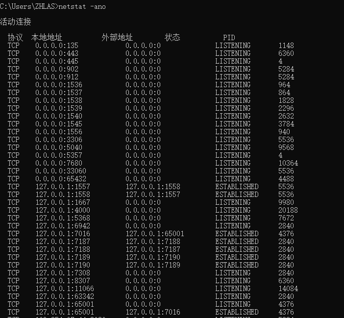
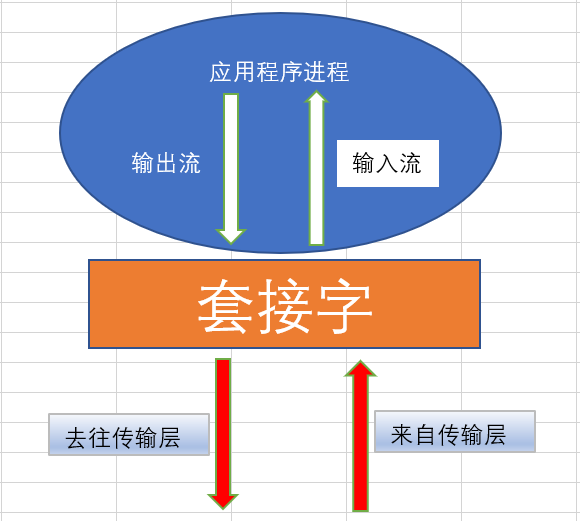
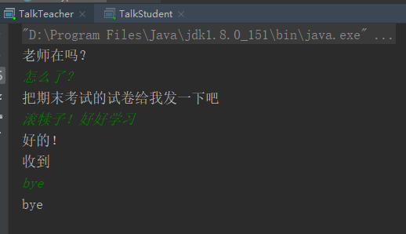
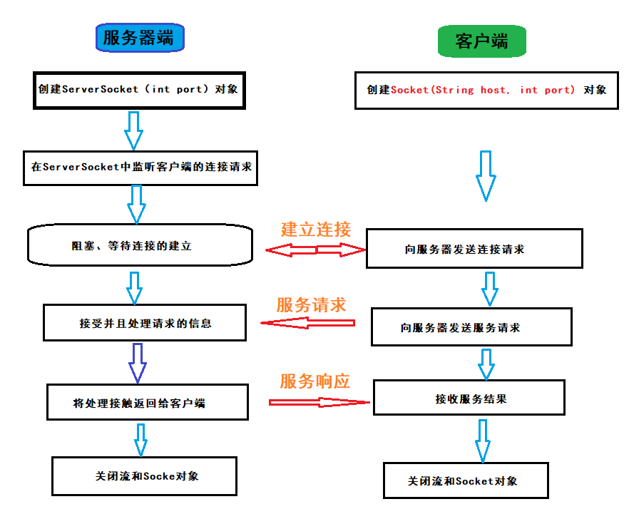
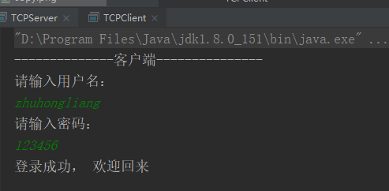
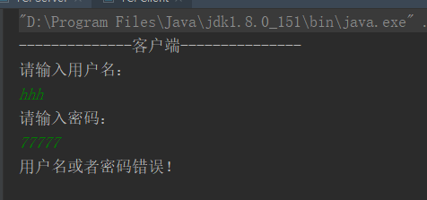
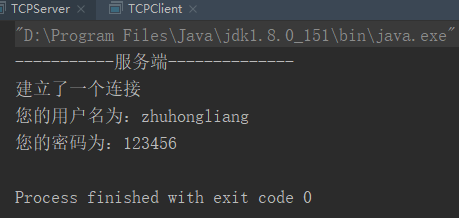
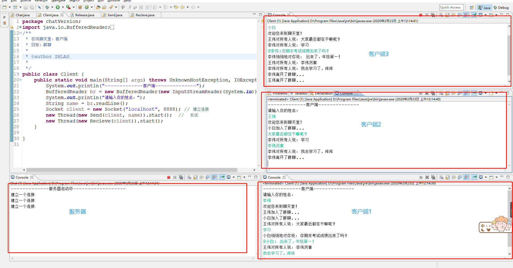

# 一、 概述

Java 中的网络支持：

- `InetAddress`：用于表示网络上的硬件资源，即 IP 地址；
- `URL`：统一资源定位符；
- `Sockets`：使用 TCP 协议实现网络通信；
- `Datagram`：使用 UDP 协议实现网络通信。

---


# 二、 InetAddress

 没有公有的构造函数，只能通过静态方法来创建实例。 

```java
import java.net.InetAddress;
import java.net.UnknownHostException;

/**
 * IP  InetAddress
 * @author Hongliang Zhu
 * @create 2020-02-19 21:50
 */
public class IPTest {
    public static void main(String[] args) throws UnknownHostException {
        InetAddress address = InetAddress.getLocalHost(); // 192.168.145.1
        System.out.println(address.getHostAddress());
        System.out.println(address.getHostName()); // zhuhongliang
        // 根据域名得到InetAddress
        //根据域名得到InetAddress对象
        address = InetAddress.getByName("www.163.com");
        System.out.println(address.getHostAddress());//返回 163服务器的ip:183.216.182.9
        System.out.println(address.getHostName());  //输出：www.163.com

        //根据ip得到InetAddress对象
        address = InetAddress.getByName("183.216.182.7");
        System.out.println(address.getHostAddress());  //返回 163服务器的ip:61.135.253.15
        System.out.println(address.getHostName());//输出ip而不是域名。如果这个IP地 址不存在或DNS 服务器不允许进行IP地址和域名的映射，getHostName方法就直接返回这个IP地址。
    }
}

```

## 端口

ip地址用来标识一台计算机，端口用来区分不同的程序。

> 常用的命令：
>
> 查看所有端口： netstat -ano
>
> 查看指定端口： netstat -ano | findstr "5023"
>
> 查看指定进程： tasklist | findstr “5032”
>
> 查看具体程序： 使用任务管理器查看pid



```java
//包含端口
InetSocketAddress socketAddress = new InetSocketAddress("127.0.0.1",8080); //指定了端口
InetSocketAddress socketAddress2 = new InetSocketAddress("localhost",9000);
System.out.println(socketAddress.getHostName()); // 127.0.0.1
System.out.println(socketAddress2.getAddress()); //  localhost/127.0.0.1
System.out.println(socketAddress.getPort()); // 8080
```

---


# 三、 URL

URL（Uniform Resource Locator）：  统一资源定位符 ， 由4部分组成：协议 、存放资源的主机域名、端口号和资源文件名。 如： http://www.www.baidu.com:9090/index.html

URL是指向互联网“资源”的指针。资源可以是简单的文件或目录，也可以是对更为复杂的对象的引用，例如对数据库或搜索引 擎的查询。

> 互联网的三大基石： html， http， url

URI（Universal Resource Identifier）： 统一资源标志符，用来标识抽象或者物理资源的一个紧凑字符串。

URN（Universal Resource Name）：统一资源名称， 通过特定命名空间中的唯一名称或ID来标识资源。


```java
import java.net.MalformedURLException;
import java.net.URL;

/**
 * URL: 统一资源定位符  区分资源
 *
 *
 * @author Hongliang Zhu
 * @create 2020-02-19 22:52
 */
public class URLTest {
    public static void main(String[] args) throws MalformedURLException {
        URL url = new URL("http://www.baidu.com:9090/index.html?uname=zhu&age=18#a");
        // 获取四个值
        System.out.println("协议："+ url.getProtocol());
        System.out.println("域名|ip： "+ url.getHost());
        System.out.println("请求的资源1："+ url.getFile());
        System.out.println("请求的资源2： "+ url.getPath());
        //参数
        System.out.println("参数："+ url.getQuery());
        // 锚点
        System.out.println("锚点： "+ url.getRef());
    }
}

```

> 协议：http
> 域名|ip： www.baidu.com
> 请求的资源1：/index.html?uname=zhu&age=18
> 请求的资源2： /index.html
> 参数：uname=zhu&age=18
> 锚点： a

## 爬虫原理

使用url来下载资源

```java
import java.io.BufferedReader;
import java.io.IOException;
import java.io.InputStream;
import java.io.InputStreamReader;
import java.net.URL;

/**
 * URL下载资源  爬虫原理
 * @author Hongliang Zhu
 * @create 2020-02-20 10:35
 */
public class SpyderTest {
    public static void main(String[] args) throws IOException {
        URL url = new URL("https://www.jd.com");
//        URL url = new URL("https://www.dianping.com"); //不是所有的网站都可以爬
        InputStream is  = url.openStream(); //
        BufferedReader br = new BufferedReader(new InputStreamReader(is, "utf8"));
        String msg = null;
        while(null != (msg=br.readLine())){
            System.out.println(msg);
        }
        br.close();
    }
}

```

对于不能直接通过URL来获取资源的，可以通过浏览器请求方式来获取：

```java
import java.io.BufferedReader;
import java.io.IOException;
import java.io.InputStreamReader;
import java.net.HttpURLConnection;
import java.net.URL;
/**
 *爬虫原理  : 模拟浏览器访问
 * @author Hongliang Zhu
 * @create 2020-02-20 10:35
 */
public class SpyderTest2 {
    public static void main(String[] args) throws IOException {
        URL url = new URL("https://www.dianping.com");
        HttpURLConnection conn = (HttpURLConnection)url.openConnection();
        conn.setRequestMethod("GET");
        conn.setRequestProperty("User-Agent", "Mozilla/5.0 (Windows NT 10.0; Win64; x64) AppleWebKit/537.36 (KHTML, like Gecko) Chrome/80.0.3987.106 Safari/537.36");
        BufferedReader br = new BufferedReader(new InputStreamReader(conn.getInputStream(), "utf8"));
        String msg = null;
        while (null != (msg = br.readLine())){
            System.out.println(msg);
        }
    }
}
```

---

# 四、 传输协议TCP&UDP

## TCP

传输控制协议 TCP（Transmission Control Protocol）是面向连接的，提供可靠交付，有流量控制，拥塞控制，提供全双工通信，面向字节流（把应用层传下来的报文看成字节流，把字节流组织成大小不等的数据块），每一条 TCP 连接只能是点对点的（一对一）。 

## UDP

用户数据报协议 UDP（User Datagram Protocol）是无连接的，尽最大可能交付，没有拥塞控制，面向报文（对于应用程序传下来的报文不合并也不拆分，只是添加 UDP 首部），支持一对一、一对多、多对一和多对多的交互通信。 

## 套接字Socket

​		我们开发的网络应用程序位于**应用层**，TCP和UDP属于传输层协议，在应用层如何使用传输层 的服务呢？在应用层和传输层之间，则是使用套接字来进行分离。 

​		套接字就像是传输层为应用层开的一个小口，应用程序通过这个小口向远程发送数据，或者 接收远程发来的数据；而这个小口以内，也就是数据进入这个口之后，或者数据从这个口出来之前，是不知道也不需要知道的，也不会关心它如何传输，这属于网络其它层次的工作。



​		Socket实际是网络传输层供给应用层的编程接口。传输层则在网络层的基础上提供进 程到进程问的逻辑通道，而应用层的进程则利用传输层向另一台主机的某一进程通 信。Socket就是应用层与传输层之间的桥梁 。

​		使用Socket编程可以开发客户机和服务器应用程序，可以在本地网络上进行通信，也 可通过Internet在全球范围内通信。

> 生活案例1：
>
> ​		如果你想写封邮件发给远方的朋友，如何写信、将信 打包，属于应用层。信怎么写，怎么打包完全由我们做主；
> ​		而当我们将信投入邮筒时，邮筒的那个口就是套接字， 在进入套接字之后，就是传输层、网络层等（邮局、公路交管或者航线等）其它层次的工作了。我们从来不会去关心信是如何从西安发往北京的，我们只知道 写好了投入邮筒就OK了。


> 生活案例2:
>
> 如果你想发货给国外，你只要把 货物放入集装箱，然后交给码头就可以了。发送什么货物，货物如何打包, 完全有你做主。 码头就是套接字，剩下的事情就 交给港口和货运公司处理就行了，具体细节我们无需了解。

​									  

---


# 五、 UDP编程

## Datagram

- DatagramSocket：通信类 :  用于发送或者接受数据包的套接字
- DatagramPacket：数据包类

使用基于UDP协议的Socket网络编程实现 ：

​		不需要利用IO流实现数据的传输。 每个数据发送单元被统一封装成数据包的方式，发送方将数据包发送到网络中，数据包在网络中去寻找他的目的地。

UDP编程 ： 一切转换成字节数组

接收端：

> 1.使用DatagramSocket 指定端口 创建接收端
>
> 2.指定容器， 封装DatagramPacket包
>
> 3.阻塞式接受包裹receive（DatagramPacket p）
>
> 4.分析数据  byte[]    getData()     getLength()
>
> 5.释放资源

发送端

> 1.使用DatagramSocket 指定端口 创建发送端
>
> 2.准备数据  ==》  一定要转成字节数组
>
> 3.封装 DatagramPacket包，需要指定目的地 + 端口
>
> 4.发送包裹  send( DatagramPacket p）
>
> 5.释放资源

```java
import java.net.DatagramPacket;
import java.net.DatagramSocket;


/**
 * 接受端：
 * 1. 使用DatagramSocket 指定端口 创建接收端
 * 2. 指定容器， 封装DatagramPacket包
 * 3. 阻塞式接受包裹receive（DatagramPacket p）
 * 4. 分析数据
 *  byte[] getData()
 *          getLength()
 *  5.  释放资源
 * @author Hongliang Zhu
* @create 2020-02-20 11:51
*/
public class UDPServer {

    public static void main(String[] args) throws Exception {
        System.out.println("接收端启动中...");
        // 1. 使用DatagramSocket 指定端口 创建接收端
        DatagramSocket server = new DatagramSocket(8888);
        // 2. 指定容器， 封装DatagramPacket包
        byte[] contiainer = new byte[1024*60];
        DatagramPacket packet = new DatagramPacket(contiainer, 0, contiainer.length);
        // 3. 阻塞式接受包裹receive（DatagramPacket p）
        server.receive(packet);
        // 4. 分析数据
        byte[] datas = packet.getData();
        int len = packet.getLength();
        System.out.println(new String(datas, 0, len));
        // 5.  释放资源
        server.close();
    }
}

```

```java
import java.net.DatagramPacket;
import java.net.DatagramSocket;
import java.net.InetSocketAddress;
/**
 * 发送端：
 * 1. 使用DatagramSocket 指定端口 创建发送端
 * 2. 准备数据 一定转成字节数组
 * 3. 封装DatagramPacket包，需要指定目的地
 * 4. 发送包裹send( DatagramPacket p）
 * 5.  释放资源
 * @author Hongliang Zhu
 * @create 2020-02-20 17:10
 */
public class UPDCilent {
    public static void main(String[] args) throws Exception {
        System.out.println("发送方启动中...");
        // 1. 使用DatagramSocket 指定端口 创建发送端
        DatagramSocket client = new DatagramSocket(9999);
        //2. 准备数据 一定转成字节数组
        String data = "Hello world";
        byte[] datas = data.getBytes();
        //3. 封装DatagramPacket包，需要指定目的地
        DatagramPacket packet = new DatagramPacket(datas, 0, datas.length,
                new InetSocketAddress("localhost", 8888));
        // 4. 发送包裹send( DatagramPacket p）
        client.send(packet);
        // 5.  释放资源
        client.close();
//
    }
}

```

## UDP编程： 传输基本数据类型和引用

服务端（接收端）： 

```java
import java.io.BufferedInputStream;
import java.io.ByteArrayInputStream;
import java.io.ObjectInputStream;
import java.net.DatagramPacket;
import java.net.DatagramSocket;

/**
 * 接受端： 基本数据类型和引用  
 * 1. 使用DatagramSocket 指定端口 创建接收端
 * 2. 指定容器， 封装DatagramPacket包
 * 3. 阻塞式接受包裹receive（DatagramPacket p）
 * 4. 分析数据
 *  5.  释放资源
 * @author Hongliang Zhu
 * @create 2020-02-20 19:13
 */
public class UDPTypeServer {
    public static void main(String[] args) throws Exception {
        System.out.println("传输基本数据类型==>接收端启动中。。。。");
        DatagramSocket server = new DatagramSocket(9898);
        byte[] datas = new byte[1024*90];
        DatagramPacket packet = new DatagramPacket(datas, 0, datas.length);
        server.receive(packet);
        byte[] data = packet.getData();
        int len = packet.getLength();
        ObjectInputStream dis = new ObjectInputStream(new BufferedInputStream(new ByteArrayInputStream(data)));
        // 按照顺序读取
        String msg = dis.readUTF(); //  读取
        boolean flag = dis.readBoolean();
        int a = dis.readInt();
        Object o = dis.readObject();
        System.out.println(len);
        System.out.println(a+"=>"+msg+"-->"+flag);
//        o.toString();
        if(o instanceof Employee){
            Employee e = (Employee)o;
            e.toString();
            System.out.println("的确是马云");
            System.out.println(e.getName() +":"+  e.getMoney());
        }
        server.close();
    }
}

```

客户端（发送端）：

```java
import java.io.BufferedOutputStream;
import java.io.ByteArrayOutputStream;
import java.io.ObjectOutputStream;
import java.net.DatagramPacket;
import java.net.DatagramSocket;
import java.net.InetSocketAddress;

/**
 * 发送端： 基本数据类型和引用
 * 1. 使用DatagramSocket 指定端口 创建发送端
 * 2. 准备数据 一定转成字节数组
 * 3. 封装DatagramPacket包，需要指定目的地
 * 4. 发送包裹send( DatagramPacket p）
 * 5.  释放资源
 * @author Hongliang Zhu
 * @create 2020-02-20 17:10
 */
public class UPDTypeCilent {
    public static void main(String[] args) throws Exception {
        System.out.println("传输基本数据类型==>发送方启动中...");
        // 1. 使用DatagramSocket 指定端口 创建发送端
        DatagramSocket client = new DatagramSocket(9999);
        //2. 准备数据 一定转成字节数组
        ByteArrayOutputStream  bao = new ByteArrayOutputStream();
        ObjectOutputStream dos = new ObjectOutputStream(new BufferedOutputStream(bao));
        dos.writeUTF("Hello world!");
        dos.writeBoolean(true);
        dos.writeInt(99);
        // 对象
        Employee e = new Employee("马云", 900000);
        dos.writeObject(e);
        dos.flush();
        byte[] datas = bao.toByteArray();
        //3. 封装DatagramPacket包，需要指定目的地
        DatagramPacket packet = new DatagramPacket(datas, 0, datas.length,
                new InetSocketAddress("localhost", 9898));
        // 4. 发送包裹send( DatagramPacket p）
        client.send(packet);
        // 5.  释放资源
        client.close();
    }
}

```

> 传输基本数据类型==>发送方启动中...
>
> 66
> 99=>Hello world!-->true
> 的确是马云
> null:900000.0

## UDP编程： 传输文件

```java
import java.io.*;
import java.net.DatagramPacket;
import java.net.DatagramSocket;
import java.net.InetSocketAddress;

/**
 * 发送端： 发送文件
 * 1. 使用DatagramSocket 指定端口 创建发送端
 * 2. 准备数据 一定转成字节数组
 * 3. 封装DatagramPacket包，需要指定目的地
 * 4. 发送包裹send( DatagramPacket p）
 * 5.  释放资源
 * @author Hongliang Zhu
 * @create 2020-02-20 17:10
 */
public class UPDFileCilent {
    public static void main(String[] args) throws Exception {
        System.out.println("文件 ==> 发送方启动中...");
        // 1. 使用DatagramSocket 指定端口 创建发送端
        DatagramSocket client = new DatagramSocket(9999);
        //2. 准备数据 一定转成字节数组
        InputStream is = new FileInputStream("./socket/socket.png");  // 注意图片不能太大，否则会报异常
        BufferedInputStream bi = new BufferedInputStream(is);
        ByteArrayOutputStream os = new ByteArrayOutputStream();
        byte[] data  = new byte[1024*60];
        int len;
        while ( -1 !=  (len = is.read(data,0, data.length))){
            os.write(data, 0, len);
            os.flush();
        }
        byte[] datas = os.toByteArray();

        //3. 封装DatagramPacket包，需要指定目的地
        DatagramPacket packet = new DatagramPacket(datas, 0, datas.length,
                new InetSocketAddress("localhost", 8888));
        // 4. 发送包裹send( DatagramPacket p）
        client.send(packet);
        // 5.  释放资源
        client.close();
    }
}

```

```java
import java.io.BufferedOutputStream;
import java.io.FileOutputStream;
import java.io.InputStream;
import java.io.OutputStream;
import java.net.DatagramPacket;
import java.net.DatagramSocket;
/**
 * 接受端：
 * 1. 使用DatagramSocket 指定端口 创建接收端
 * 2. 指定容器， 封装DatagramPacket包
 * 3. 阻塞式接受包裹receive（DatagramPacket p）
 * 4. 分析数据
 *  byte[] getData()
 *          getLength()
 *  5.  释放资源
 * @author Hongliang Zhu
* @create 2020-02-20 11:51
*/
public class UDPFileServer {

    public static void main(String[] args) throws Exception {
        System.out.println("接收端启动中...");
        // 1. 使用DatagramSocket 指定端口 创建接收端
        DatagramSocket server = new DatagramSocket(8888);
        // 2. 指定容器， 封装DatagramPacket包
        byte[] contiainer = new byte[1024*60];
        DatagramPacket packet = new DatagramPacket(contiainer, 0, contiainer.length);
        // 3. 阻塞式接受包裹receive（DatagramPacket p）
        server.receive(packet);
        // 4. 分析数据
        byte[] datas = packet.getData();
        int len = packet.getLength();
//        System.out.println(new String(datas, 0, len));
        BufferedOutputStream os =new BufferedOutputStream(new FileOutputStream("./socket/copy.png")); //接受数据
        os.write(datas, 0, datas.length);
        os.flush();
        // 5.  释放资源
        server.close();
    }


}

```

## UDP案例： 多线程实现在线咨询

### 发送端

```java
import java.io.BufferedReader;
import java.io.IOException;
import java.io.InputStreamReader;
import java.net.DatagramPacket;
import java.net.DatagramSocket;
import java.net.InetSocketAddress;
import java.net.SocketException;

/**
 * 发送端： 使用面向对象封装
 * @author Hongliang Zhu
 * @create 2020-02-21 10:53
 */
public class talkSend implements Runnable {
    private DatagramSocket client ; // 发送端套接字
    private BufferedReader reader; // 读取数据
    private String toIP; // 发送到服务端的IP
    private int toPort; // 服务端的端口

    public talkSend(int port, String toIP, int toPort) {
        this.toIP = toIP;
        this.toPort = toPort;
        try {
            this.client = new DatagramSocket(port);
            reader = new BufferedReader(new InputStreamReader(System.in));
        } catch (SocketException e) {
            e.printStackTrace();
        } catch (IOException e) {
            e.printStackTrace();
        }
    }
    @Override
    public void run() {
        while (true){
            String msg = null;
            try {
                msg = reader.readLine();
                byte[] datas = msg.getBytes();
                DatagramPacket packet = new DatagramPacket(datas, 0, datas.length, new InetSocketAddress(this.toIP, this.toPort));
                client.send(packet); // 发送
                if("bye".equals(msg)){
                    break;
                }
            } catch (IOException e) {
                e.printStackTrace();
            }

        }
        client.close();
    }
}

```

### 接收端

```java
import java.io.IOException;
import java.net.DatagramPacket;
import java.net.DatagramSocket;
import java.net.SocketException;

/**
 * 接收端
 * @author Hongliang Zhu
 * @create 2020-02-21 11:08
 */
public class talkRecieve implements Runnable{
    private DatagramSocket server;

    public talkRecieve(int port) {
        try {
            this.server = new DatagramSocket(port);
        } catch (SocketException e) {
            e.printStackTrace();
        }
    }

    @Override
    public void run() {
        while (true){
            byte[] data = new byte[1024*60];
            DatagramPacket packet = new DatagramPacket(data,0, data.length);
            try {
                server.receive(packet);
                byte[] datas = packet.getData();
                String msg = new String(datas);
                System.out.println(msg);
                if ("bye".equals(msg)){
                    break;
                }
            } catch (IOException e) {
                e.printStackTrace();
            }
        }
        server.close();
    }
}
```

创建学生端：

```java
/**
 * 学生端： 加入多线程，实现在线交流
 * @author Hongliang Zhu
 * @create 2020-02-21 11:25
 */
public class TalkStudent {
    public static void main(String[] args) {
        new Thread(new talkSend(8989, "localhost", 9999)).start();
        new Thread(new talkRecieve(10024)).start();
    }
}
```

创建教师端：

```java
/**
 * 教室端： 加入多线程，实现在线交流
 * @author Hongliang Zhu
 * @create 2020-02-21 11:25
 */
public class TalkTeacher {
    public static void main(String[] args) {
        new Thread(new talkRecieve(9999)).start(); // 接受信息
        new Thread(new talkSend(10025, "localhost", 10024)).start();
    }
}
```



---


# 六、 TCP 编程

TCP协议基于请求-响应模式，  在网络通讯中，第一次主动发起通讯的程序被称作客户端(Client)程序，第一次通讯中等待连接的程序被称作服务器端 (Server)程序。利用IO流实现数据的传输。


## TCP通信原理

 服务器创建`ServerSocket`，在指定端口监听并并处理请求。

客户端创建`Socket`，向服务器发送请求。



## 完成网络登录功能

使用基于TCP协议的Socket网络编程实现。

> 单向：客户端向服务器端发送字符串，服务器获取字符串并输出
> 双向：服务器端给出客户端反馈，客户端得到反馈并输出
> 对象：客户端向服务器端发送User对象，服务器端获取对象并输出
> 多线程：服务器接收多个客户端的请求，并给出反馈每个客户请求开启一个线程

服务端：

```
import java.io.*;
import java.net.ServerSocket;
import java.net.Socket;
/**
 * TCP单向： 服务端
 * @author Hongliang Zhu
 * @create 2020-02-21 13:28
 */
public class TCPServer {
    public static void main(String[] args) throws IOException {
        System.out.println("-----------服务端--------------");
        ServerSocket server = new ServerSocket(9696);
        Socket cilent = server.accept(); //  监听连接请求， 返回对应的客户端
        System.out.println("建立了一个连接");
        InputStream is = cilent.getInputStream();
        DataInputStream dis = new DataInputStream(is);
        // 读取
        String uname = null;
        String upwd = null;
        String msg = dis.readUTF();
        String []datas = msg.split("&");
        for(String s: datas){
            String[] info = s.split("=");
            if("uname".equals(info[0])){
                System.out.println("您的用户名为："+ info[1]);
                uname = info[1];
            }
            if("upwd".equals(info[0])){
                System.out.println("您的密码为："+ info[1]);
                upwd = info[1];
            }
        }
        //判断：返回给客户端的信息
        String back = null;
        DataOutputStream dos = new DataOutputStream(cilent.getOutputStream());
        if("zhuhongliang".equals(uname) && "123456".equals(upwd)){
            back = "登录成功， 欢迎回来";
        }else{
            back = "用户名或者密码错误！";
        }
        dos.writeUTF(back);
        dos.flush();

        // 关闭资源
        dos.close();
        dis.close();
        cilent.close();

    }
}

```

客户端

```java
import java.io.*;
import java.net.Socket;

/**
 * TCp 客户端
 * @author Hongliang Zhu
 * @create 2020-02-21 13:34
 */
public class TCPClient {
    public static void main(String[] args) throws IOException {
        System.out.println("--------------客户端---------------");
        Socket client = new Socket("localhost", 9696); //服务器的ip和端口
        // 操作： 输入输出流
        String uname;
        String upwd;
        BufferedReader br = new BufferedReader(new InputStreamReader(System.in));
        System.out.println("请输入用户名：");
        uname = br.readLine();
        System.out.println("请输入密码：");
        upwd = br.readLine();
        String msg = "uname="+ uname +"&"+"upwd="+upwd;
        // 写出
        DataOutputStream dos = new DataOutputStream(client.getOutputStream());
        dos.writeUTF(msg);
        dos.flush();

        //接收服务端返回的结果
        DataInputStream dis = new DataInputStream(client.getInputStream());
        String res = dis.readUTF();
        System.out.println(res);
        dos.close();
        br.close();
        client.close();
    }
}

```







## 文件上传

```java
import java.io.*;
import java.net.Socket;
/**
 * TCp 客户端  文件上传
 * @author Hongliang Zhu
 * @create 2020-02-21 13:34
 */
public class FileClient {
    public static void main(String[] args) throws IOException {
        System.out.println("--------------客户端---------------");
        Socket client = new Socket("localhost", 9696); //服务器的ip和端口
        // 操作： 输入输出流
        // 文件拷贝
        InputStream is = new BufferedInputStream(new FileInputStream("./io/io.png"));
        OutputStream os = new BufferedOutputStream(client.getOutputStream());
        byte[] buff = new byte[1024];
        int len = -1;
        while (-1 != (len = is.read(buff))){
            os.write(buff,0, len);
        }
        os.flush();
        os.close();
        is.close();
        client.close();
    }
}
```

```java
import java.io.*;
import java.net.ServerSocket;
import java.net.Socket;
/**
 * TCP:服务端  保存文件
 * @author Hongliang Zhu
 * @create 2020-02-21 13:28
 */
public class FileServer {
    public static void main(String[] args) throws IOException {
        System.out.println("-----------服务端--------------");
        ServerSocket server = new ServerSocket(9696);
        Socket cilent = server.accept(); //  监听连接请求， 返回对应的客户端
        System.out.println("建立了一个连接");
        // 接受数据
        InputStream is = new BufferedInputStream(cilent.getInputStream());
        OutputStream os = new BufferedOutputStream(new FileOutputStream(new File("./socket/tcp.png")));
        byte[] buff = new byte[1024];
        int len = -1;
        while (-1 != (len = is.read(buff))){
            os.write(buff,0, len);
        }
        os.flush();
        is.close();
        os.close();
        cilent.close();
    }
}
```

## 多用户登录

服务端： 使用了**多线程**实现多个用户同时处理，将对接管道封装

```java
import java.io.DataInputStream;
import java.io.DataOutputStream;
import java.io.IOException;
import java.net.ServerSocket;
import java.net.Socket;

/**
 * TCP多用户登录： 服务端  多线程处理  面向对象高度封装！
 * @author Hongliang Zhu
 * @create 2020-02-21 13:28
 */
public class TCPMutiServer {
    // main方法
    public static void main(String[] args) throws IOException {
        System.out.println("-----------服务端--------------");
        ServerSocket server = new ServerSocket(9696);
        boolean isRuning = true;
        while (isRuning){
            Socket cilent = server.accept(); //  监听连接请求， 返回对应的客户端
            System.out.println("建立了一个连接");
            new Thread(new Channel(cilent)).start();
        }
    }
    // 封装管道 里面有输入流和输出流 ，使用多线程可以服务多个客户端
    static class Channel implements  Runnable{
        private Socket client; // 客户端
        private DataInputStream dis; // 输入流  ==> 用于客户端请求服务端的信息
        private DataOutputStream dos; //  输出流 ==> 服务端给客户端的响应信息
        public Channel(Socket client){
            this.client = client;
            try {
                dis = new DataInputStream(this.client.getInputStream()); // 获取客户端输入
                dos = new DataOutputStream(this.client.getOutputStream()); // 给客户端的响应
            } catch (IOException e) {
                e.printStackTrace();
            }
        }
        // 接收数据
        public String recieve(){
            String msg = "";
            try {
                msg = dis.readUTF();
            } catch (IOException e) {
                e.printStackTrace();
            }
            return msg;
        }
        //发送给客户端数据
        private  void send(String msg){
            try {
                dos.writeUTF(msg);
            } catch (IOException e) {
                e.printStackTrace();
            }
        }
        // 关闭资源
        private void release(){

            try {
                if (null != dos)
                    dos.close();
            } catch (IOException e) {
                e.printStackTrace();
            }
            try {
                if (null != dis)
                    dis.close();
            } catch (IOException e) {
                e.printStackTrace();
            }
            try {
                if (null != client)
                    client.close();
            } catch (IOException e) {
                e.printStackTrace();
            }
        }

        @Override
        public void run() {
            // 读取读取
            String msg = recieve();
            String uname = null;
            String upwd = null;
            String []datas = msg.split("&");
            for(String s: datas){
                String[] info = s.split("=");
                if("uname".equals(info[0])){
                    System.out.println("您的用户名为："+ info[1]);
                    uname = info[1];
                }
                if("upwd".equals(info[0])){
                    System.out.println("您的密码为："+ info[1]);
                    upwd = info[1];
                }
            }
            //判断：返回给客户端的信息
            String back = null;
            if("zhuhongliang".equals(uname) && "123456".equals(upwd)){
                back = "登录成功， 欢迎回来";
            }else{
                back = "用户名或者密码错误！";
            }
            send(back); // 发送给客户端
            release(); // 释放资源

        }
    }
}

```

客户端： 对发送和接受高度封装：

```java
import java.io.*;
import java.net.Socket;
/**
 * 多用户登录： 面向对象思维高度封装！
 * @author Hongliang Zhu
 * @create 2020年2月21日23:57:11
 */
public class TCPMultiClient {
    public static void main(String[] args) throws IOException {
        System.out.println("--------------客户端---------------");
        Socket client = new Socket("localhost", 9696); //服务器的ip和端口
        // 操作： 输入输出流
        new Send(client).send();
        //接收
        new Recieve(client).recieve();
    }

    // 发送给服务器
    static class Send{
        private Socket client;
        private BufferedReader br;
        private DataOutputStream dos;
        String msg = "";
        public Send(Socket client){
            this.client = client;
            try {
                br = new BufferedReader(new InputStreamReader(System.in));
                dos = new DataOutputStream(client.getOutputStream());
                msg = init();
            } catch (IOException e) {
                e.printStackTrace();
            }
        }
        private String init(){
            String uname = "";
            String upwd = "";
            try {
                System.out.println("请输入用户名：");
                uname = br.readLine();
                System.out.println("请输入密码：");
                upwd = br.readLine();
                return "uname="+ uname +"&"+"upwd="+upwd;
            } catch (IOException e) {
                e.printStackTrace();
            }
            return "";
        }

        private void send(){
            // 写出
            try {
                dos.writeUTF(msg);
                dos.flush();
            } catch (IOException e) {
                e.printStackTrace();
            }
        }

    }

    // 接收服务器的返回消息
    static class Recieve{
        private Socket client;
        private DataInputStream dis;

        public Recieve(Socket client) {
            this.client = client;
            try {
                dis = new DataInputStream(client.getInputStream());
            } catch (IOException e) {
                e.printStackTrace();
            }
        }

        private void recieve(){
            try {
                String res = dis.readUTF();
                System.out.println(res);
            } catch (IOException e) {
                e.printStackTrace();
            }
        }
    }
}

```

# 七、 实例： 手写在线聊天室

##  1.  服务器

功能：相当于消息的中转站（转发器）

> 1.可以同时处理多个客户端的请求。
>
> 2.当一个用户进入群聊的时候，会给群聊中所有的用户群发一条系统消息，提示所有用户有人进来了群聊当中。
>
> 3.当一个用户成功进入群聊的时候， 服务器会发送一条问候语给当前客户。
>
> 4.当一个用户离开群聊的时候，会给群聊中所有的用户群发一条系统消息，提示所有用户xxx离开了群聊。
>
> 5.一个用户发送的消息可以给群聊中的所有用户发送。
>
> 6.可以对指定的用户私聊，消息只对指定的用户看见。格式： @xxx：message

```java
package chatVersion;
import java.io.DataInputStream;
import java.io.DataOutputStream;
import java.io.IOException;
import java.net.ServerSocket;
import java.net.Socket;
import java.util.concurrent.CopyOnWriteArrayList;

import javax.management.relation.Relation;
import javax.print.attribute.standard.MediaSize.Other;

/**
 * 在线聊天室： 群聊版本
 * @author ZHLAS
 *
 */
public class Chat {
	static CopyOnWriteArrayList<Channel> all = new CopyOnWriteArrayList<>();
	public static void main(String[] args) throws IOException {
		System.out.println("-------------服务器启动中------------------");
		ServerSocket server = new ServerSocket(8888);
		// 等待连接
		while(true){
			Socket client = server.accept();
			System.out.println("建立一个连接");
			Channel c = new Channel(client);
			all.add(c); // 加入一个客户端
			new Thread(c).start();	// 开始服务		
		}	
	}
	
	
	//一个Channel代表一个客户端
	static class Channel implements Runnable{
		private Socket client;
		private DataInputStream dis = null;
		private DataOutputStream dos = null;
		private boolean isRuning = true;
		private String name; //当前客户端的名字
		//
		public Channel(Socket client) {
			this.client = client;
			try{
				dis = new DataInputStream(client.getInputStream());
				dos= new DataOutputStream(client.getOutputStream());
				//欢迎您的到来
				this.name = recieve(); ///接收到客户端的名字		
				this.send("欢迎您来到聊天室！"); // 发送给对应客户端的欢迎词
				sendOthers(this.name+ "加入了群聊...", true); //告诉大家谁加入了群聊
			}catch(Exception e){
				relese();
			}
		}
		// 服务器接收到客户端发送的数据
		private String recieve() {
			String msg = "";
			try {
				msg = dis.readUTF();
			} catch (IOException e) {
				relese();
			}
			return msg;
		}
		
		// 服务器给客户点发送数据
		private void send(String msg) {
			try {
				dos.writeUTF(msg);
			} catch (IOException e) {
				relese();
			}
			
		}
		/**
		 * 群发 ： 获取自己的消息， 发送给别人
		 * 私聊： 约定数据格式 ： @xxx:msg
		 * @param msg
		 */
		private void sendOthers(String msg, boolean isSys) {
			boolean isPrivate = msg.startsWith("@"); //私聊
			if(isPrivate){ //私聊
				int idx = msg.indexOf(":"); //冒号的位置
				// 获取目标和数据
				String targetName = msg.substring(1, idx);
				msg = msg.substring(idx+1);
				// 遍历客户，找到指定目标
				for(Channel target : all){
					if(target.name.equals(targetName)){
						target.send(this.name +"悄悄地对你说： "+msg);
					}
				}
			}else{
				// 遍历容器
				for(Channel c: all){
					if(this == c){ //自己
						continue; 
					}else{
						if(!isSys)
							c.send(this.name+"对所有人说： "+msg);
						else
							c.send(msg);
					}
				}
			}
			
		}
		
		//释放资源
		private void relese(){
			this.isRuning = false;
			Release.reslese(dos, dis, client);
			// 移除容器的客户端
			all.remove(this);
			sendOthers(this.name+"离开了群聊...", true);
		}
		
		
		public void run() {
			String msg ="";
			while(isRuning){
				// 接收数据
				msg  = recieve();
				// 发送数据
				if(!"".equals(msg)){
//					send(msg);
					sendOthers(msg, false); // 群聊
				}
				
			}
			
		}
	}
}
```

## 2. 客户端

功能：

> 1.发送消息给服务器
>
> 2.从服务器那边接收消息

```java
package chatVersion;
import java.io.BufferedReader;
import java.io.DataInputStream;
import java.io.DataOutputStream;
import java.io.IOException;
import java.io.InputStreamReader;
import java.net.Socket;
import java.net.UnknownHostException;
import java.nio.Buffer;

import org.omg.CosNaming.NamingContextExtPackage.StringNameHelper;
/**
 * 在线聊天室：客户端  
 * 目标：群聊 
 *  
 * @author ZHLAS
 *
 */
public class Client {
	public static void main(String[] args) throws UnknownHostException, IOException {
		System.out.println("-------------客户端--------------");
		BufferedReader br = new BufferedReader(new InputStreamReader(System.in));
		System.out.println("请输入你的姓名：");
		String name = br.readLine();
		Socket client = new Socket("localhost", 8888); // 建立连接
		new Thread(new Send(client, name)).start();  //  发送
		new Thread(new Recieve(client)).start();	
	}

}

```

```java
package chatVersion;
import java.io.BufferedReader;
import java.io.DataOutputStream;
import java.io.IOException;
import java.io.InputStreamReader;
import java.net.Socket;
/**
 * 
 * 发送端
 * @author ZHLAS
 *
 */
public class Send implements Runnable{
	private Socket client;
	// 准备数据
	private BufferedReader br; 
	private DataOutputStream dos;
	private boolean isRuning = true;
	private String name; 
	public Send(Socket client, String name) {
		this.client = client;
		br = new BufferedReader(new InputStreamReader(System.in));
		this.name = name;
		try {
			dos = new DataOutputStream(client.getOutputStream());
			send(name); // 把客户端的名称发送给服务器
		} catch (IOException e) {
			this.isRuning = false;
			Release.reslese(dos, br, client);
		}
	}
	
	private void send(String msg) {
		try {
			// 写出
			dos.writeUTF(msg);	
			dos.flush();
		} catch (IOException e) {
			this.isRuning = false;
			Release.reslese(dos, br);
		}
	}
	
	@Override
	public void run() {
		while(isRuning){	
			String msg = "";
			try {
				msg = br.readLine();
			} catch (IOException e) {
				this.isRuning = false;
				Release.reslese(br);
			}
			send(msg);
		}
		
	}

}

```

```java
package chatVersion;
import java.io.DataInputStream;
import java.io.IOException;
import java.net.Socket;

/**
 * 接收端
 * @author ZHLAS
 *
 */
public class Recieve implements Runnable{
	private Socket client;
	private DataInputStream dis;
	private boolean isRuning = true;

	public Recieve(Socket client) {
		this.client = client;
		try {
			dis = new DataInputStream(client.getInputStream());
		} catch (IOException e) {
			this.isRuning = false;
			Release.reslese(dis, client);
		}
	}
	
	private String recieve() {
		String msg ="";
		try {
			msg = dis.readUTF();
		} catch (IOException e) {
			Release.reslese(dis);
		}
		return msg;	
		
	}
	
	@Override
	public void run() {
		while(isRuning){
			String msg = recieve();
			if(!"".equals(msg))
				System.out.println(msg);
		}
		
	}

}

```

## 3. 释放资源

```java
package chatVersion;

import java.io.Closeable;
import java.io.IOException;

public class Release {
	
	public static void reslese(Closeable... targets){
		for(Closeable target: targets){
			if(target != null){
				try {
					target.close();
				} catch (IOException e) {
					e.printStackTrace();
				}
			}
		}
			
	}

}

```

## 4. 运行效果

