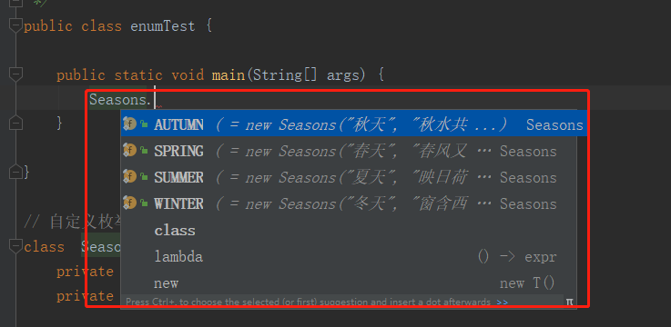
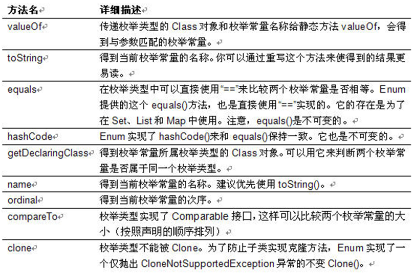

# 概述

JDK1.5之前需要自定义枚举类

JDK 1.5 新增的 `enum` 关键字用于定义枚举类

当需要定义一组常量时，强烈建议使用枚举类。故里面的属性应该为`final`修饰。

> 理解：类的对象只有有限个，确定的。称之为枚举类。

若枚举只有一个成员, 则可以作为一种单例模式的实现方式。

---


# 自定义枚举类

- 枚举类对象的属性不应允许被改动，所以应该使用 `private final` 修饰。
- 枚举类的使用 `private final` 修饰的属性应该在构造器中为其赋值。
- 若枚举类显式的定义了带参数的构造器, 则在列出枚举值时也必须对应的传入参数。
- 只能获取对象的属性，不能修改，即只能提供`get`方法，不能提供`set`方法。

```java
// 自定义枚举类对象
class  Seasons{
    private final String  seasonName;
    private final String SeasonDesc;

    // 私有化构造函数
    private Seasons(String seasonName, String seasonDesc){
        this.seasonName = seasonName;
        this.SeasonDesc = seasonDesc;
    }
    // 提供当前枚举类的多个对象  public static final
    public static final Seasons SPRING = new Seasons("春天", "春风又绿江南岸");
    public static final Seasons SUMMER = new Seasons("夏天", "映日荷花别样红");
    public static final Seasons AUTUMN = new Seasons("秋天", "秋水共长天一色");
    public static final Seasons WINTER = new Seasons("冬天", "窗含西岭千秋雪");

    // 获取枚举类的对象的属性

    public String getSeasonName() {
        return seasonName;
    }

    public String getSeasonDesc() {
        return SeasonDesc;
    }

    @Override
    public String toString() {
        return "Seasons{" +
                "seasonName='" + seasonName + '\'' +
                ", SeasonDesc='" + SeasonDesc + '\'' +
                '}';
    }
}
```



---


# 使用enum定义枚举类

必须在枚举类的第一行声明枚举类对象。多个对象之间用逗号隔开，最后一个对象用；结束。

枚举类和普通类的区别：

> 使用 `enum` 定义的枚举类默认继承了 `java.lang.Enum` 类。
>
> 枚举类的构造器只能使用 `private` 访问控制符。
>
> 枚举类的所有实例必须在枚举类中显式列出 (,分隔  **;** 结尾). 列出的实例系统会自动添加 `public static final`修饰。

```
enum  Season {

    // 必须在枚举类的第一行声明枚举类对象。
    SPRING("春天", "春风又绿江南岸"),
    SUMMER("夏天", "映日荷花别样红"),
    AUTUMN("秋天", "秋水共长天一色"),
    WINTER("冬天", "窗含西岭千秋雪");

    private final String seasonName;
    private final String SeasonDesc;

    // 私有化构造函数
    private Season(String seasonName, String seasonDesc) {
        this.seasonName = seasonName;
        this.SeasonDesc = seasonDesc;
    }


    // 获取枚举类的对象的属性

    public String getSeasonName() {
        return seasonName;
    }

    public String getSeasonDesc() {
        return SeasonDesc;
    }

}
```

# 枚举类的常用方法

枚举类的主要方法：

> values()方法：返回枚举类型的对象数组。该方法可以很方便地遍历所有的枚举值。
>
> valueOf(String str)：可以把一个字符串转为对应的枚举类对象。要求字符串必须是枚举类对象的“名字”。如不是，会有运行时异常。

线程的状态就是一个枚举类。

```java
 Thread.State[] values = Thread.State.values();
 for (Thread.State v: values){
 System.out.println(v);
 }
```

> NEW
> RUNNABLE
> BLOCKED
> WAITING
> TIMED_WAITING
> TERMINATED




----

# 实现接口的枚举类

和普通 Java 类一样，枚举类可以实现一个或多个接口

若需要每个枚举值在调用实现的接口方法呈现出不同的行为方式，则可以让每个枚举值分别来实现该方法。

```java
// 定义接口
interface info{
    void show();
}
enum  Season implements info{

    // 必须在枚举类的第一行声明枚举类对象。
    SPRING("春天", "春风又绿江南岸"){
        @Override
        public void show() {
            System.out.println("我是春天");
        }
    },
    SUMMER("夏天", "映日荷花别样红"){
        @Override
        public void show() {
            System.out.println("我是夏天");
        }
    },
    AUTUMN("秋天", "秋水共长天一色"){
        @Override
        public void show() {
            System.out.println("我是秋天");
        }
    },
    WINTER("冬天", "窗含西岭千秋雪"){
        @Override
        public void show() {
            System.out.println("我是冬天");
        }
    };

    private final String seasonName;
    private final String SeasonDesc;

    // 私有化构造函数
    private Season(String seasonName, String seasonDesc) {
        this.seasonName = seasonName;
        this.SeasonDesc = seasonDesc;
    }


    // 获取枚举类的对象的属性

    public String getSeasonName() {
        return seasonName;
    }

    public String getSeasonDesc() {
        return SeasonDesc;
    }

}

```

```java
public static void main(String[] args) {
        Season[] s = Season.values();
        for (Season a: s){
            System.out.println(a);
            a.show();
        }

    }
```

> SPRING
> 我是春天
> SUMMER
> 我是夏天
> AUTUMN
> 我是秋天
> WINTER
> 我是冬天