# 一、 概览

 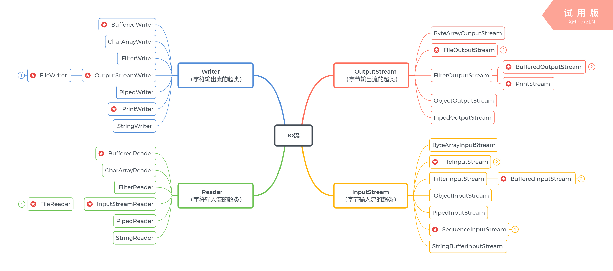

 

Java 的 I/O 大概可以分成以下几类：

- 磁盘操作：`File`
- 字节操作：`InputStream` 和 `OutputStream`
- 字符操作：`Reader` 和 `Writer`
- 对象操作：`Serializable`
- 网络操作：`Socket`
- 新的输入/输出：`NIO`

## 流分类

按照方向：**一切以程序为中心**

- 输入流： 数据源到程序（InputStream、Reader 读进来）

- 输出流：  程序到目的地（OutputStream、 Writer 写出去）

  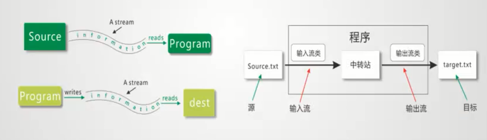


按照功能划分：

- **节点流**： 可以直接从数据源或者目的地读写数据===> 直接操作数据源

  

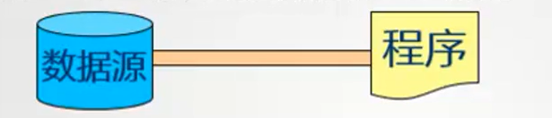

- 处理流(包装流)： 不是直接连接到数据源火目的地，是其他流进行封装。目的主要是简化操作和提高性能。

  装饰者设计模式。

  

**关系**：节点流是在IO的第一线，所有操作必须同节点流。处理流是对节点流的性能进行提升。

通常很少使用单个流对象，而是将一系列的流以包装的形式链接起来处理数据。

包装可以在不改变被包装流的前提下，获得更强的流处理功能 。


按照数据分类：

- 字节流： 按照字节读取数据（`InputStream` 、 `OutputStream`)

- 字符流： 按照字符读取数据（`Reader`、 `Writer`）

  编码的不同，从而有了对字符进行高效操作的字符流对象。

  原理： 底层还是基于字节流，自动搜索了指定的码表（UTF-8、GBK、Unicode等）

  

  典型的字符输入流/输出流的链接如下：

  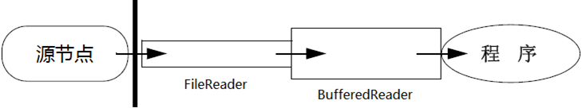

  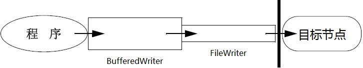

  ---

  

# 二、 磁盘操作File

File 类可以用于表示文件和目录的信息，但是它不表示文件的内容。 File代表的是一个抽象的表示形式，用于连接java程序与磁盘的桥梁，java只能跟OS交流。

## File类的构造方法

- - | `File(File parent, String child)`  从父抽象路径名和子路径名字符串创建新的 `File`实例。 |
    | ------------------------------------------------------------ |
    | `File(String pathname)`  通过将给定的路径名字符串转换为抽象路径名来创建新的 `File`实例。 |
    | `File(String parent,  String child)`  从父路径名字符串和子路径名字符串创建新的 `File`实例。 |
    | `File(URI uri)`  通过将给定的 `file:` URI转换为抽象路径名来创建新的 `File`实例。 |

    ```java
    import java.io.File;
    
    /**
     * @author Hongliang Zhu
     * @create 2020-02-17 11:51
     */
    public class Demo1 {
        public static void main(String[] args) {
            String path = "F:/java/base/io/io.png";
            File file = new File(path);
            System.out.println(file.length());
    
            File file1 = new File("F:/java/base/io", "io.png");
            System.out.println(file1.length());
    
            File file2 = new File(new File("F:/java/base"), "/io/io.png");
            System.out.println(file1.length());
    
            System.out.println(file.getAbsoluteFile()); // 绝对路径
            // 相对路径
            System.out.println(System.getProperty("user.dir"));  // F:\java\base
            // 构建不存在的文件
            File src = new File("kkk/ooo.png");
            System.out.println(src); // kkk\ooo.png
    
        }
    }
    
    ```

    > 416160
    > 416160
    > 416160
    > F:\java\base\io\io.png
    > F:\java\base
    > kkk\ooo.png

从 Java7 开始，可以使用 Paths 和 Files 代替 File。 

```java
Path p = Paths.get("F:/java/base","io/io.png");
System.out.println(p); // F:\java\base\io\io.png
```

## 查看文件的基本信息

```java
import java.io.File;
/**
 * @author Hongliang Zhu
 * @create 2020-02-17 12:13
 */
public class FileDemo01 {
    public static void main(String[] args) {
        String path = "F:/java/base/io/io.png";
        File file = new File(path);
        System.out.println("名称：" + file.getName());
        System.out.println("路径: "+ file.getPath());
        System.out.println("绝对路径: "+ file.getAbsolutePath());
        System.out.println("父路径：" + file.getParent());
        System.out.println(file.getParentFile().getName()); // 父对象
    }
}
```

> 名称：io.png
> 路径: F:\java\base\io\io.png
> 绝对路径: F:\java\base\io\io.png
> 父路径：F:\java\base\io
> io

## 查看文件的状态

```java
import java.awt.*;
import java.io.File;

/**
 * 文件的状态
 * @author Hongliang Zhu
 * @create 2020-02-17 12:19
 */
public class FileDemo02 {
    public static void main(String[] args) {
        File src  = new File("io/io.png");
        System.out.println(src.length()); // 字节数 文件的长度
        System.out.println(src.getPath());
        System.out.println(src.getAbsoluteFile());
        System.out.println("是否存在： "+ src.exists());
        System.out.println("是否是文件： "+ src.isFile());
        System.out.println("是否是文件夹： "+ src.isDirectory());
        // 文件状态
        src = new File("kkk.jpg");
        if(!src.exists()){
            System.out.println("文件不存在");
        }else {
            if(src.isFile()){
                System.out.println("文件操作");
            }else{
                System.out.println("文件夹操作");
            }
        }


    }
}

```

> 416160
> io\io.png
> F:\java\base\io\io.png
> 是否存在： true
> 是否是文件： true
> 是否是文件夹： false
> 文件不存在

## 操作文件夹

- - | `boolean` | `mkdir()`  创建由此抽象路径名命名的目录。                    |
    | --------- | ------------------------------------------------------------ |
    | `boolean` | `mkdirs()`  创建由此抽象路径名命名的目录，包括任何必需但不存在的父目录。 |

```java
import java.io.File;
/**
 * 文件夹
 * @author Hongliang Zhu
 * @create 2020-02-17 12:32
 */
public class DirDemo1 {

    public static void main(String[] args) {
        // 创建目录 mkdir() : 确保上级目录存在，不然创建失败
        File file =  new File("./io/dir/test");
        boolean flag = file.mkdir();
        System.out.println(flag);
        flag = file.mkdirs();  // 推荐
        System.out.println(flag);
    }
}

```

> false
> true

list文件：

```java
import java.io.File;
/**
 * 文件夹
 * @author Hongliang Zhu
 * @create 2020-02-17 12:32
 */
public class DirDemo1 {

    public static void main(String[] args) {
        File dir = new File("./io");
        // 下级名称
        String[] subNames = dir.list(); // 下面一层的文件名
        for(String name: subNames){
            System.out.println(name);
        }
        System.out.println("-----------------------------------");
        // 下级对象
        File[] subFiles = dir.listFiles();
        for(File s: subFiles){
            System.out.println(s.getName());
        }

        System.out.println("-----------------------------------");

        //  所有盘符：
        File[] roots = dir.listRoots();
        for(File f : roots){
            System.out.println(f.getAbsolutePath());
        }

    }
}

```

> dir
> io.iml
> io.png
>
> src
>
> dir
> io.iml
> io.png
>
> src
>
> C:\
> D:\
> F:\
> H:\

递归列出一个目录下的所有文件

```java
public static void listAllFiles(File dir) {
    if (dir == null || !dir.exists()) {
        return;
    }
    if (dir.isFile()) {
        System.out.println(dir.getName());
        return;
    }
    for (File file : dir.listFiles()) {
        listAllFiles(file);
    }
}
```

计算文件夹的大小：

```java
import java.io.File;

/**
 *
 * 计算一个文件夹的大小
 * @author Hongliang Zhu
 * @create 2020-02-17 13:05
 */
public class countFiles {

    private static long length = 0;

    public static void main(String[] args) {
        File file = new File("./io");
        count(file);
        System.out.println(length);
    }

    public static void count(File src){
        if(src == null || !src.exists()){ //文件不存在
            return;
        }
        if(src.isFile()){
            // 是一个文件，计算大小
            length += src.length();
        }else{ // 不是文件
            for(File f : src.listFiles()){
                count(f);
            }
        }
    }

}

```

> 421864


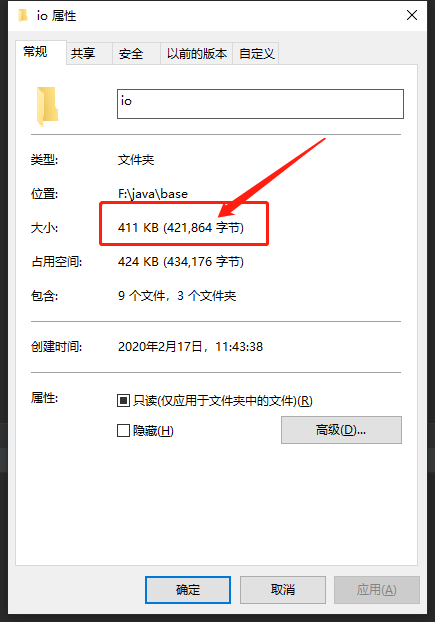

进阶一下：使用面向对象的思维对文件夹进行统计大小。

```java
import java.io.File;

/**
 * 使用面向对象的思维对文件夹进行统计大小。  封装
 * @author Hongliang Zhu
 * @create 2020-02-17 13:13
 */
public class DirCount {
    private long length; // 文件的长度
    // 源文件
    private File src;
    private String path; // 文件路径
    public DirCount(String path) {
        this.path = path;
        src = new File(path);
        this.count(src);
    }
    public long getLength() {
        return length;
    }
    private void count(File src){
        if(src == null || !src.exists()){ //文件不存在
            return;
        }
        if(src.isFile()){
            // 是一个文件，计算大小
            length += src.length();
        }else{ // 不是文件
            for(File f : src.listFiles()){
                count(f);
            }
        }
    }

    public static void main(String[] args) {
        DirCount dir = new DirCount("./io");
        System.out.println(dir.getLength());
    }
}

```

> 422905

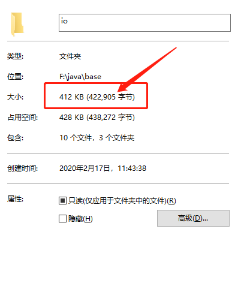

---


# 三、 字符编码

> 计算机只能识别二进制数据，早期由来是电信号。为了方便应用计算机，让它可以识别各个国家的文字。就将各个国家的文字用数字来表示，并一一对应，形成一张表。这就是编码表。

**编码就是把字符转换为字节，而解码是把字节重新组合成字符。** 

如果编码和解码过程使用不同的编码方式那么就出现了乱码。 

- GBK 编码中，中文字符占 2 个字节，英文字符占 1 个字节；
- UTF-8 编码中，中文字符占 3 个字节，英文字符占 1 个字节；
- UTF-16be 编码中，中文字符和英文字符都占 2 个字节。

UTF-16be 中的 be 指的是 `Big Endian`，也就是大端。相应地也有 UTF-16le，le 指的是 `Little Endian`，也就是小端。

Java 的内存编码使用双字节编码 `UTF-16be`，这不是指 Java 只支持这一种编码方式，而是说 `char` 这种类型使用 `UTF-16be` 进行编码。`char` 类型占 16 位，也就是两个字节，Java 使用这种双字节编码是为了让一个中文或者一个英文都能使用一个 `char` 来存储。

```java
import java.io.UnsupportedEncodingException;

/**
 * 编码： 字符串 ---> 字节
 * @author Hongliang Zhu
 * @create 2020-02-17 15:09
 */
public class ContentEncode {
    public static void main(String[] args) throws UnsupportedEncodingException {
        String msg = "性命生命使命";  // 这里使用的是UTF-8编码，中文占3个字节
        // 编码： 字节数组
        byte[] datas = msg.getBytes(); // 使用工程默认的字符集
        System.out.println(datas.length); // 18

//         编码其他字符集
        try {
            datas = msg.getBytes("UTF-16LE"); // 每个用2个字节
        } catch (UnsupportedEncodingException e) {
            e.printStackTrace();
        }
        System.out.println(datas.length);

        // 解码
        msg = new String(datas, 0, datas.length, "UTF-16LE");
        System.out.println(msg);


        /// 乱码问题
        // 1. 字节数不够
        msg = new String(datas,0, datas.length - 1, "UTF-16LE");
        System.out.println(msg);

        // 2. 字符集不统一
        msg = new String(datas,0, datas.length , "gbk");
        System.out.println(msg);

    }
}

```

> 18
> 12
> 性命生命使命
> 性命生命使�
> '`}Tu}TO}T

---

## String的编码方式

String 可以看成一个字符序列，可以指定一个编码方式将它编码为字节序列，也可以指定一个编码方式将一个字节序列解码为 String。 

```java
String str1 = "中文";
byte[] bytes = str1.getBytes("UTF-8");
String str2 = new String(bytes, "UTF-8");
System.out.println(str2);

```

在调用无参数 `getBytes()` 方法时，默认的编码方式不是 UTF-16be。双字节编码的好处是可以使用一个 `char` 存储中文和英文，而将 String 转为 bytes[] 字节数组就不再需要这个好处，因此也就不再需要双字节编码。`getBytes()` 的默认编码方式与平台有关，一般为 UTF-8。 

```java
byte[] bytes = str1.getBytes();
```

---

# 四、 四大抽象类

| 抽象基类   | **字节流**                    | **字符流**             | 常用方法                                       |
| ---------- | ----------------------------- | ---------------------- | ---------------------------------------------- |
| **输入流** | **InputStream**   字节输入流  | **Reader**  字符输入流 | int read()、void close()                       |
| **输出流** | **OutputStream**   字节输出流 | **Writer**  字符输出流 | void write(int)、void flush()、 void close（） |

1. Java的IO流共涉及40多个类，实际上非常规则，都是从如下4个抽象基类派生的。

2. 由这四个类派生出来的子类名称都是以其父类名作为子类名后缀。

## 标准步骤

想象成搬家的程序：

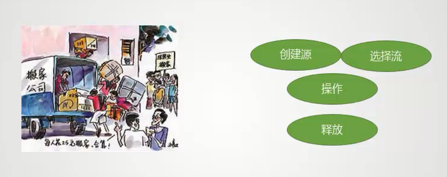

①. 创建源	②. 选择流	③. 操作(读、写)	④. 释放资源

```java
import java.io.*;
/**
 *标准步骤：
 * ①. 创建源
 * ②. 选择流
 * ③. 操作(读、写)
 * ④. 释放资源
 * @author Hongliang Zhu
 * @create 2020-02-17 16:01
 */
public class IOTest01 {
    public static void main(String[] args){
         //①. 创建源
        File file = new File("F:\\java\\base\\io\\a.txt");
         //②. 选择流
        InputStream in = null; // 作用域提前
        try {
            in = new FileInputStream(file);
            //③. 操作(读、写)
            int temp;
            while ((temp = in.read()) != -1){
                System.out.println((char)temp);
            }

            // 文件末尾返回-1
            // ④. 释放资源
        } catch (IOException e) {
            e.printStackTrace();
        }finally {
            try {
                if(null != in)  // 避免空指针异常，需要加上判断
                    in.close();
            } catch (IOException e) {
                e.printStackTrace();
            }
        }
    }
}

```

> H
> e
> l
> l
> o
>
> W
> o
> r
> l
> d
> !

## 文件字节输入流FileInputStream

选择流就相当于选择搬家公司，read()方法就是一个字节一个字节地读取，就相当于一件物品的去搬， 而read(bytr[] a) 相当于用卡车来搬！更加快速。

```java
import java.io.*;

/**
 *标准步骤：
 * ①. 创建源
 * ②. 选择流
 * ③. 操作(读、写)
 * ④. 释放资源
 * @author Hongliang Zhu
 * @create 2020-02-17 16:01
 */
public class IOTest01 {
    public static void main(String[] args){
         //①. 创建源
        File file = new File("F:\\java\\base\\io\\a.txt");
         //②. 选择流
        InputStream in = null; // 作用域提前
        try {
            in = new FileInputStream(file);
            //③. 操作(读、写)
            byte[] flush = new byte[1024]; // 缓冲容器
            int len = -1; // 接受长度
            while ((len = in.read(flush)) != -1){
                //字节数组 --> 字符串 （解码）
                String str = new String(car, 0, len);
                System.out.println(str);
            }
            // 文件末尾返回-1
            // ④. 释放资源

        } catch (IOException e) {
            e.printStackTrace();
        }finally {
            try {
                if(null != in)  // 避免空指针异常，需要加上判断
                    in.close();
            } catch (IOException e) {
                e.printStackTrace();
            }
        }

    }
}

```

> Hello World! zhu hong liang

## 文件字节流输出流FileOutputStream

```java
import java.io.File;
import java.io.FileNotFoundException;
import java.io.FileOutputStream;
import java.io.IOException;
/**
 *
 * 文件字节输出流
 * @author Hongliang Zhu
 * @create 2020-02-17 16:36
 */
public class IOTes02 {
    public static void main(String[] args) {
        // create resource
        File file = new File("./io/dext.txt");
        //choose Stream
        FileOutputStream os = null;
        try {
            os = new FileOutputStream(file, true); // 追加标志
            String msg = "Hello , welcome to BeiJing !";
            // buffer array
            byte[] buff = msg.getBytes();
            // write
            os.write(buff,0, buff.length);
            // flush
            os.flush();
        } catch (FileNotFoundException e) {
            e.printStackTrace();
        } catch (IOException e) {
            e.printStackTrace();
        }
    }
}

```


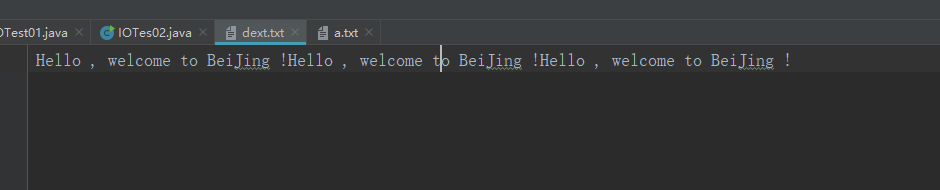

## 实现文件拷贝

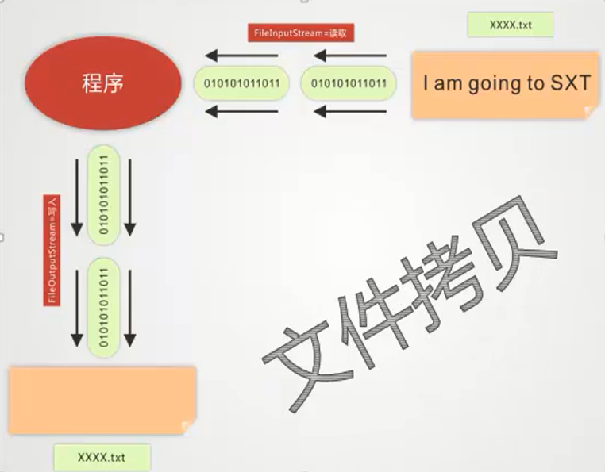

```java
import java.io.*;
/**
 *
 * 实现文件拷贝
 * @author Hongliang Zhu
 * @create 2020-02-17 16:51
 */
public class CopyFile {
    public static void main(String[] args) {
        File src = new File("./io/io.png");
        FileInputStream in = null;
        FileOutputStream os = null;
        try {
            in = new FileInputStream(src);
            os = new FileOutputStream("./io/io_cpoy.png"); // 写出的文件
            byte[] buff = new byte[1024 * 20];
            int cnt;
            while ((cnt = in.read(buff, 0, buff.length)) != -1) {
                os.write(buff, 0, cnt);
            }
        } catch (FileNotFoundException e) {
            e.printStackTrace();
        } catch (IOException e) {
            e.printStackTrace();
        }finally { // 关闭资源  先打开的后关闭
            try{
                if(os != null){
                    os.close();
                }
                if(in != null){
                    in.close();
                }
            }catch (IOException e){
                e.printStackTrace();
            }

        }

    }
}

```

## 思考：进阶--> 实现文件夹的拷贝


## Reader 与 Writer

不管是磁盘还是网络传输，最小的存储单元都是**字节**，而不是字符。但是在程序中操作的通常是字符形式的数据，因此需要提供对字符进行操作的方法。

- InputStreamReader 实现从字节流解码成字符流；
- OutputStreamWriter 实现字符流编码成为字节流。

实现逐行输出文本文件的内容：

```java
public static void readFileContent(String filePath) throws IOException {

    FileReader fileReader = new FileReader(filePath);
    BufferedReader bufferedReader = new BufferedReader(fileReader);

    String line;
    while ((line = bufferedReader.readLine()) != null) {
        System.out.println(line);
    }

    // 装饰者模式使得 BufferedReader 组合了一个 Reader 对象
    // 在调用 BufferedReader 的 close() 方法时会去调用 Reader 的 close() 方法
    // 因此只要一个 close() 调用即可
    bufferedReader.close();
}
```

## ByteArrayInputStream &  ByteArrayOuputStream

上面的FileInputStream中源都是一个文件，文件是存储在磁盘中的，Java程序无法直接访问到，需要通过OS来连接，这里的字节数组流ByteArrayInputStream 的源是内存中的一个字节数组，JVM是可以直接访问的，与操作系统无关了，并且字节数组流不需要close资源，因为JVM有GC来管理，会由JVM来释放，不需要自己手动关闭。

字符串、一切数据，所有的都可以转换成字节数组，方便网络的传输，在底层使用的较多。

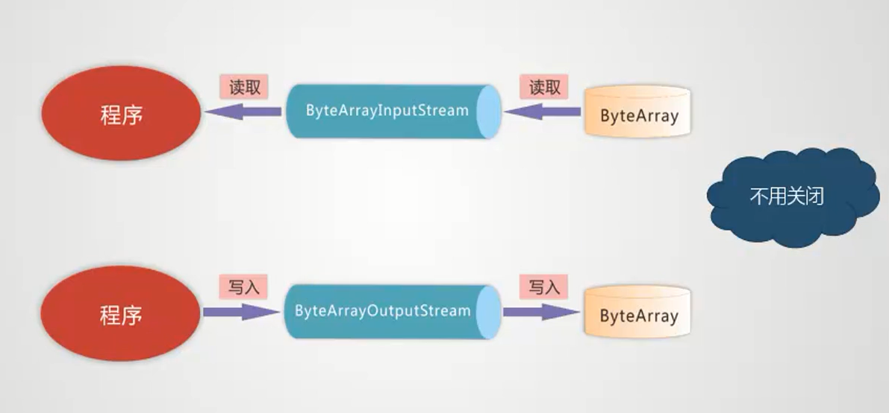

ByteArrayInputStream中的构造函数:

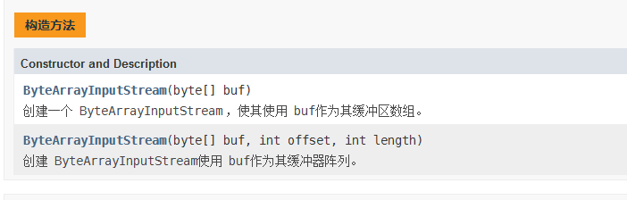

```java
import java.io.*;

/**
 * 字节数组输入流
 * @author Hongliang Zhu
 * @create 2020年2月17日19:12:50
 */
public class IOTest03 {
    public static void main(String[] args){
         //①. 创建源
        byte[] src = "talk is cheap show me the code".getBytes();
         //②. 选择流
        InputStream in = null; // 作用域提前
        try {
            in = new ByteArrayInputStream(src);
            //③. 操作(读、写)
            byte[] flush = new byte[5]; // 缓冲容器 每三个字符读一次
            int len = -1; // 接受长度
            while ((len = in.read(flush)) != -1){
                //字节数组 --> 字符串 （解码）
                String str = new String(flush, 0, len);
                System.out.println(str);
            }

            // 文件末尾返回-1
            // ④. 释放资源

        } catch (IOException e) {
            e.printStackTrace();
        }finally {
            try {
                if(null != in)  // 可以不用关闭
                    in.close();
            } catch (IOException e) {
                e.printStackTrace();
            }
        }

    }
}

```

`ByteArrayOutputStream`该类实现了将数据写入字节数组的输出流。当数据写入缓冲区时，缓冲区会自动增长。数据可以使用`toByteArray()`和`toString()` 。不需要在构造方法中传入目的数组。

关闭`ByteArrayOutputStream`没有任何效果。  该流中的方法可以在流关闭后调用，而不生成`IOException` 。 

```java
import java.io.*;

/**
 *
 * 字节数组输出流`ByteArrayOutputStream`
 * @author Hongliang Zhu
 * @create 2020-02-17 16:36
 */
public class IOTes04 {
    public static void main(String[] args) {
        // create resource
        byte[] dest = null;
        //choose Stream 要使用新增方法，不能使用多态
        ByteArrayOutputStream os = null;
        try {
            os = new ByteArrayOutputStream(); // 不需要传入目的地
            String msg = "Hello , welcome to BeiJing !";
            // buffer array
            byte[] buff = msg.getBytes();
            // write
            os.write(buff,0, buff.length);
            // flush
            os.flush();
            dest = os.toByteArray(); // 获取数据
            System.out.println(dest.length+"===>"+new String(dest,0, os.size()));
        } catch (FileNotFoundException e) {
            e.printStackTrace();
        } catch (IOException e) {
            e.printStackTrace();
        }
    }
}

```

## 综合-对接流

例：将一张图片读取到一个字节数组中，先使用文件输入流，通过程序做一个中转，程序再写出到字节数组中。然后字节数组通过字节数组输入流到程序中，再使用文件输出流将字节数组写回到文件中（图片）。

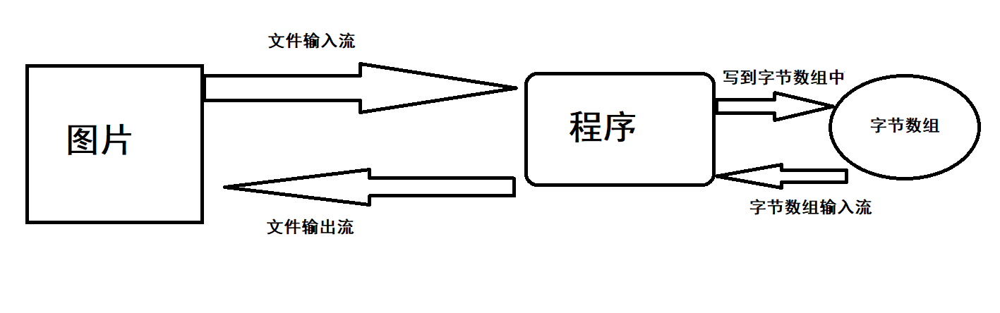

```java
import java.io.*;
/**
 *
 * 字节数组输出流`ByteArrayOutputStream`
 * @author Hongliang Zhu
 * @create 2020-02-17 16:36
 */
public class picTest {
    public static void main(String[] args) {
        // 图片转换成字节数组
        byte[] datas = FileToByteArray("./io/io.png");
        System.out.println(datas.length);
        ByteArrayToFile(datas, "./io/ppp_img.png");
    }
    /**
     *  图片到字节数组中
     *  1. 图片到程序： FileInputStream
     *  2. 程序到数组： ByteArrayOutputStream
     */
    public static byte[] FileToByteArray(String filepath){
        //①. 创建源  目的地
        File file = new File(filepath);
        byte[] dext = null;

        //②. 选择流
        InputStream in = null; // 作用域提前
        ByteArrayOutputStream bos = new ByteArrayOutputStream();
        try {
            in = new FileInputStream(file);
            //③. 操作
            byte[] flush = new byte[1024]; // 缓冲容器
            int len = -1; // 接受长度
            while ((len = in.read(flush)) != -1){
              bos.write(flush, 0, len); //写出到字节数组
            }
            bos.flush();
            return bos.toByteArray();

        } catch (IOException e) {
            e.printStackTrace();
        }finally {
            try {
                if(null != in)  // 避免空指针异常，需要加上判断
                    in.close();
            } catch (IOException e) {
                e.printStackTrace();
            }
        }
        return null;
    }

    /**
     *字节数组写出到图片
     * 1. 字节数组读取到程序中 : ByteArrayOutputStream
     * 2. 程序写出到文件: FileOutputStream
     *
     */
    public static void ByteArrayToFile(byte[] datas, String filePath){
        //①. 创建源
        File dest = new File(filePath);
        //②. 选择流(增加方法) 不能使用多态
        InputStream in = null; // 作用域提前
        OutputStream os = null;
        try {
            in = new ByteArrayInputStream(datas);
            os = new FileOutputStream(dest);
            //③. 操作(读、写)
            byte[] flush = new byte[1024 * 10]; // 缓冲容器
            int len = -1; // 接受长度
            while ((len = in.read(flush)) != -1) {
                //字节数组 --> 文件
                os.write(flush, 0, len);
            }
            os.flush(); //刷新

        }catch (IOException e){
            e.printStackTrace();
        }finally {
            if(null != os){
                try {
                    os.close();
                } catch (IOException e) {
                    e.printStackTrace();
                }
            }
        }
    }

}

```

## 封装成工具类

```java
import java.io.*;

/**
 * 封装拷贝
 * @author Hongliang Zhu
 * @create 2020-02-17 21:40
 */
public class FileUtils {
    public static void main(String[] args) {
        // 文件 到文件
        try {
            InputStream is = new FileInputStream("./io/a.txt");
            OutputStream os = new FileOutputStream("./io/a_copy.txt");
            copy(is, os);
        } catch (FileNotFoundException e) {
            e.printStackTrace();
        }

        // 文件到字节数组
        byte[] datas = null;
        try {
            InputStream is = new FileInputStream("./io/io.png");
            ByteArrayOutputStream os = new ByteArrayOutputStream();
            copy(is, os);
            datas = os.toByteArray();
            System.out.println(datas.length);
        } catch (FileNotFoundException e) {
            e.printStackTrace();
        }

        // 字节数组到文件
        try {
            InputStream is = new ByteArrayInputStream(datas);
            OutputStream os = new FileOutputStream("./io/io_copyppppp.png");
            copy(is, os);
        } catch (FileNotFoundException e) {
            e.printStackTrace();
        }


    }

    /**
     *
     * 对接输入输出流
     * @param in 输入流
     * @param os 输出流
     */
    public static void copy(InputStream in, OutputStream os){
        try {
            byte[] buff = new byte[10];
            int cnt;
            while ((cnt = in.read(buff, 0, buff.length)) != -1) {
                os.write(buff, 0, cnt);
            }
        } catch (FileNotFoundException e) {
            e.printStackTrace();
        } catch (IOException e) {
            e.printStackTrace();
        }finally {
            close();
        }
    }


    /**
     * 释放资源
     * @param ios
     */
    public static void close(Closeable... ios){
        for(Closeable io: ios){
            try{
                if(io != null){
                    io.close();
                }
            }catch (IOException e){
                e.printStackTrace();
            }
        }
    }

}

```

## 装饰者设计模式

Java I/O 使用了装饰者模式来实现。以 `InputStream` 为例，

- InputStream 是抽象组件；
- FileInputStream 是 InputStream 的子类，属于具体组件，提供了字节流的输入操作；
- FilterInputStream 属于抽象装饰者，装饰者用于装饰组件，为组件提供额外的功能。例如 BufferedInputStream 为 FileInputStream 提供缓存的功能。

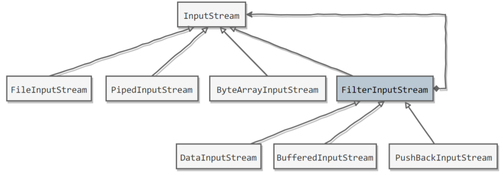

实例化一个具有缓存功能的字节流对象时，只需要在 `FileInputStream` 对象上再套一层 `BufferedInputStream` 对象即可。

```java
FileInputStream fileInputStream = new FileInputStream(filePath);
BufferedInputStream bufferedInputStream = new BufferedInputStream(fileInputStream);
```

`DataInputStream` 装饰者提供了对更多数据类型进行输入的操作，比如 `int`、`double` 等基本类型。 

装饰者模式有四个对象：

> 1、抽象组件： 需要装饰的抽象对象（接口或者抽象父类）
>
> 2、 具体组件： 需要装饰的对象（如上例的Person类）
>
> 3、 抽象装饰类： 包含了对抽象组件的引用以及装饰者共有的方法（写到构造器里面）
>
> 4、 具体装饰类： 被装饰的对象

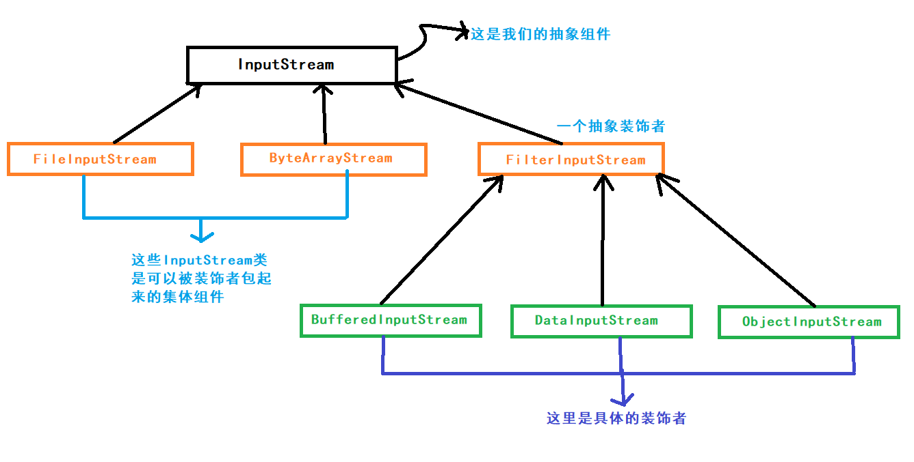

> 装饰者与被装饰者拥有共同的超类，继承的目的是继承类型，而不是行为

### 模拟对人的声音放大

```java
/**
 *
 * 装饰者模式： 实现放大器对声音的放大功能
 * @author Hongliang Zhu
 * @create 2020-02-17 22:31
 */
public class DecorateTest01 {
    public static void main(String[] args) {
        Person p = new Person(10);
        p.say();
        // 装饰
        Amplifier am = new Amplifier(p);
        am.say();
    }
}

interface Say{
    void say();
}
class Person implements Say{
    //属性
    private int vioce = 10; // 10 db

    public Person(int vioce) {
        this.vioce = vioce;
    }
    public int getVioce() {
        return vioce;
    }

    @Override
    public void say() {
        System.out.println("人的声音为："+ this.getVioce());
    }
}

class Amplifier implements Say{
    private Person p;
    Amplifier(Person p){
        this.p = p;
    }
    @Override
    public void say() {
        System.out.println("人的声音为："+ p.getVioce() * 100);
        System.out.println("噪音.........");
    }
}

```

> 人的声音为：10
> 人的声音为：1000
> 噪音.........

### 模拟咖啡

```java
/**
 *
 * 装饰者模式： 模拟咖啡你

 * 1、抽象组件： 需要装饰的抽象对象（接口或者抽象父类）
 * 2、 具体组件： 需要装饰的对象（如上例的Person类）
 * 3、 抽象装饰类： 包含了对抽象组件的引用以及装饰者共有的方法（写到构造器里面）
 * 4、 具体装饰类： 被装饰的对象
 * @author Hongliang Zhu
 * @create 2020-02-17 22:31
 */
public class DecorateTest02 {
    public static void main(String[] args) {
        Drink coffe = new Coffe();
        System.out.println(coffe.info() +" ===>"+ coffe.cost());
        Drink suger = new Sugar(coffe); // 装饰  加糖
        System.out.println(suger.info() +" ===>"+ suger.cost());
        Drink milk = new Milk(coffe); //装饰 ， 加牛奶
        System.out.println(milk.info() +" ===>"+ milk.cost());
        // 还可以混合： 既加糖也加牛奶
        suger = new Sugar(milk);
        System.out.println(suger.info() +" ===>"+ suger.cost()); }
}
// 饮料接口 -===> 抽象组件
interface Drink{
    double cost(); // 费用
    String info(); // 说明
}

// 具体组件
class Coffe implements Drink{
    String name = "原味咖啡";
    public String getName() {
        return name;
    }
    @Override
    public double cost() {
        return 10;
    }

    @Override
    public String info() {
        return this.name;
    }
}

//抽象装饰类
class Decorator implements Drink{
    //包含了对抽象组件的引用（写到构造器里面）
    Drink drink;
    Decorator(Drink drink){
        this.drink = drink;
    }

    // 以及装饰者共有的方法
    @Override
    public double cost() {
        return this.drink.cost();
    }

    @Override
    public String info() {
        return this.drink.info();
    }
}

//具体装饰类： 被装饰的对象
class Milk extends Decorator{
    Milk(Drink drink) {
        super(drink);
    }

    @Override
    public double cost() {
        return this.drink.cost() * 4;
    }

    @Override
    public String info() {
        return this.drink.info() + "加了牛奶" ;
    }

}

//具体装饰类： 被装饰的对象
class Sugar extends Decorator{
    Sugar(Drink drink) {
        super(drink);
    }

    @Override
    public double cost() {
        return this.drink.cost() * 2;
    }

    @Override
    public String info() {
        return this.drink.info() + "加了蔗糖" ;
    }

}


```

> 原味咖啡  = >10.0
> 原味咖啡加了蔗糖 =>20.0
> 原味咖啡加了牛奶 =>40.0
> 原味咖啡加了牛奶加了蔗糖 ===>80.0

---

# 五、 IO-缓冲流

## 缓冲字节流BufferedInputStream 、BufferedOutputStream

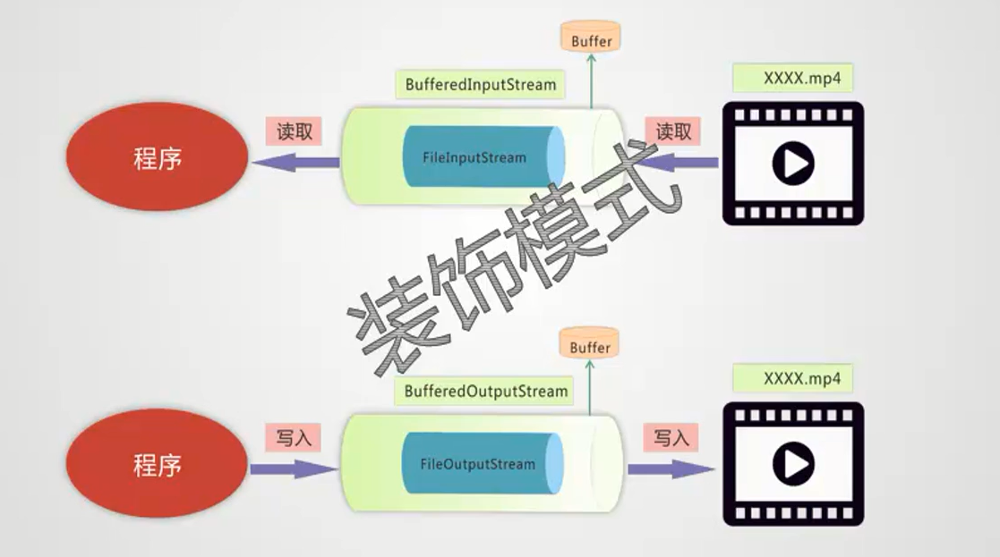

缓冲流可以提高性能，一开始的是字节流的read()方法，可以比喻成蚂蚁搬家，一个字节一个字节地读取，使用read(byte[] buff), 自己维护了一个字节数组，相当于叫了一个搬家公司用卡车搬；而这里的缓冲流是在内部维护了一个缓冲区，默认 8k，将字节流打包，放入缓冲流中，相当于使用了一个更大的卡车。可以提高性能，避免频繁去读写。

这里的缓冲流成为处理流，任何一个处理流，不管怎么嵌套，最底层都是一个节点流，没有节点流就没有处理流。

随着流越来越多，释放资源可以直接释放处理流，处理流内部会自动释放节点流。如果需要手动释放，释放的原则是：从里到外，一依次释放。

```java
public class CopyFile {
    public static void main(String[] args) {
        File src = new File("./io/io.png");
        // try... with...resource
        try(InputStream in = new BufferedInputStream(new FileInputStream(src)); OutputStream os = new BufferedOutputStream(new FileOutputStream("./io/io_copy.png"))) {
            byte[] buff = new byte[10];
            int cnt;
            while ((cnt = in.read(buff, 0, buff.length)) != -1) {
                os.write(buff, 0, cnt);
            }
        } catch (FileNotFoundException e) {
            e.printStackTrace();
        } catch (IOException e) {
            e.printStackTrace();
        }

    }
}
```

## 字符缓冲流BufferedReader、BufferedWriter

这两个流有许多新增方法，注意不要使用多态。

`BufferedReader中的String readLine()`   读一行文字。 

`BufferedWriter中的void`  `newLine()`  写一行行分隔符。

使用缓冲流实现纯文本的拷贝：

```java
import java.io.*;
/**
 *
 * 利用BufferedReader和BufferWriter实现纯文本拷贝
 * @author Hongliang Zhu
 * @create 2020-02-18 13:28
 */
public class CopyTxt {
    public static void main(String[] args) {
        File src = new File("./io/dext.txt");
        File dest = new File("./io/copy_dext.txt");
        try (BufferedReader br = new BufferedReader(new FileReader(src)); BufferedWriter bw = new BufferedWriter(new FileWriter(dest))){
            String line = null; // 逐行读取
            while ((line = br.readLine()) != null){
                bw.write(line);
                bw.newLine();
                bw.flush();
            }
        }catch (IOException e){
            e.printStackTrace();
        }

    }
}

```


## 转换流-InputStreamReader、OutputStreamWriter

1.将字节流转换成字符流。字节流可以处理一切内容，文本、图片、音频、视频。所以在很多框架和系统中底层返回的是一个字节流。但是里面是纯文本的时候，就需要进行转换。

如`System.in` 和 `System.out`都是属于字节流。

2.在底层中，如果是一个纯文本的话，涉及到一个字符集，将字节转换成字符叫做解码，如果工程中的字符集或者系统的字符集与源的字符集不一致的话，就会出现乱码问题。这时候我们需要自己**指定字符集**。

### InputStreamReader解码

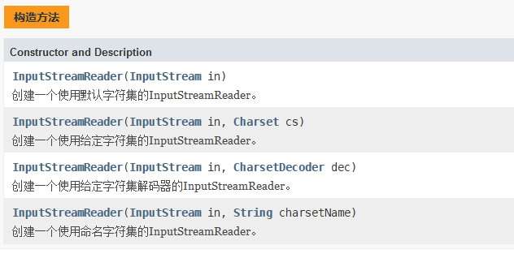

`String  getEncoding()` : 返回此流使用的字符编码的名称。

### OutputStreamWriter编码

`OutputStreamWriter`是字符流到字节流的桥梁：使用指定的字符编码[`charset`](../../java/nio/charset/Charset.html)将指定的字符编码成字节 。  它使用的字符集可以由名称指定，也可以被明确指定，或者可以接受平台的默认字符集。 

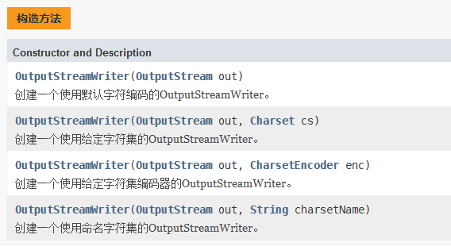

```java
import java.io.*;
/**
 *
 * 转换流：InputStreamReader  OutputStreamWrit
 * 功能： 
 * 1. 以字符流的形式操作字节流 （纯文本） 本例
 * 2. 指定字符集
 *
 * @author Hongliang Zhu
 * @create 2020-02-18 14:20
 */
public class ConvertTest {
    // 操作System.in  System.out
    public static void main(String[] args) {
        // 将字节流转换成字符流 ,字符流一般用缓冲流包起来
        try(BufferedReader reader = new BufferedReader(new InputStreamReader(System.in)) ; // System.in 属于字节流
        BufferedWriter writer = new BufferedWriter(new OutputStreamWriter(System.out))){
            // 循环读取键盘输入， 输出  exit退出
            String msg = "";
            while (!(msg = reader.readLine()).equals("exit")){
                writer.write(msg);
                writer.newLine();
                writer.flush();  //强制刷新，因为缓冲流内部数组比较大，字符会驻留在管道中
            }
        }catch (IOException e){
            System.out.println("操作异常");
        }
    }

}
```


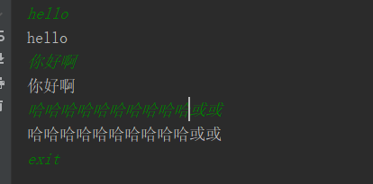

# 六、 其他流（数据流、对象流、打印流）

## 1. 数据流

方便我们处理基本数据类型和字符串，不但保留了数据，还保存了数据类型。

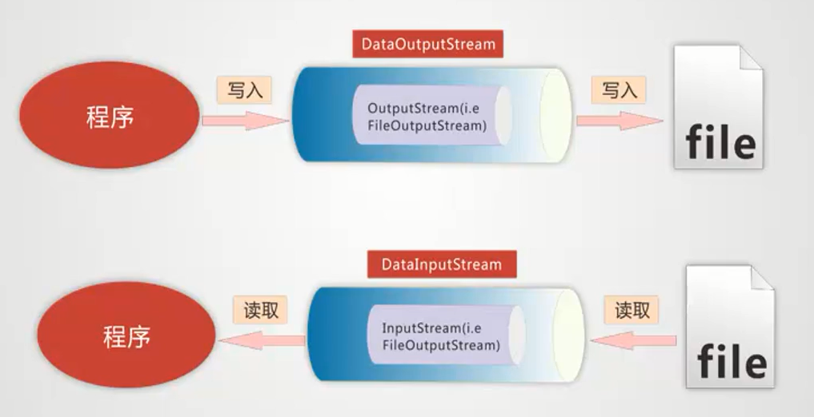

### DataInputStream

构造方法：  DataInputStream(InputStream in）

方法：

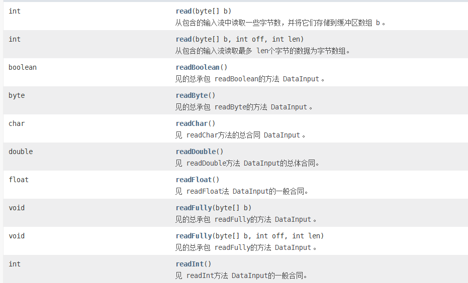


### DataOutputStream

用法与DataInputStream相似

```java
import java.io.*;

/**
 * s数据流
 * 1. 写出后读取
 * 2. 读取顺序与写出顺序要一致
 * @author Hongliang Zhu
 * @create 2020-02-18 14:58
 */
public class DataTest {

    public static void main(String[] args) throws IOException {
        // 写出
        ByteArrayOutputStream baos = new ByteArrayOutputStream();
        DataOutputStream dos = new DataOutputStream(new BufferedOutputStream(baos)); // 加上缓冲流，提升性能
        // 操作数据类型
        dos.writeUTF("良辰美景奈何天");  // 24个字节
        dos.writeInt(19);
        dos.writeChar('a');
        dos.writeBoolean(false);
        dos.flush();
        //  读取
        byte[] datas = baos.toByteArray();
        System.out.println(datas.length); // 30
        // 加上缓冲流，提升性能
        DataInputStream dis = new DataInputStream(new BufferedInputStream(new ByteArrayInputStream(datas)));
        // 读取顺序与写出顺序一致
        String msg = dis.readUTF();
        System.out.println("字符串的大小： "+msg.getBytes().length); // 这里变为21
        int a = dis.readInt();  // 4个字节
        char c = dis.readChar(); // 2个字节
        boolean flag = dis.readBoolean(); // 1个字节
        System.out.println(msg);
        System.out.println(flag);
    }
}

```

> 30
> 字符串的大小： 21
> 良辰美景奈何天
> false


## 

## 2. 打印流

```java
import java.io.*;

/**
 * 打印流  PrintStream
 * @author Hongliang Zhu
 * @create 2020-02-18 19:42
 */
public class PrintTest {
    public static void main(String[] args) throws FileNotFoundException {
        PrintStream ps = System.out;
        ps.println("Hello");
        ps.println(true);
        ps.flush();
        ps = new PrintStream(new BufferedOutputStream(new FileOutputStream("./io/print.txt",true)), true);
        ps.println("这是打印流");
        ps.println(true);
        // 重定向输出端
        System.setOut(ps);
        System.out.println("我已经变了，不是输出到控制台了！");

        // 重回控制台
        System.setOut(new PrintStream(new BufferedOutputStream(new FileOutputStream(FileDescriptor.out)), true));
        System.out.println("我回来啦！！！！");
        ps.close();
    }
}

```

> Hello
> true
> 我回来啦！！！！

还有`PrintWriter`。

---


# 七、 对象操作

## 1. 序列化

#### 对象流 ObjectInputStream & ObjectOutputStream

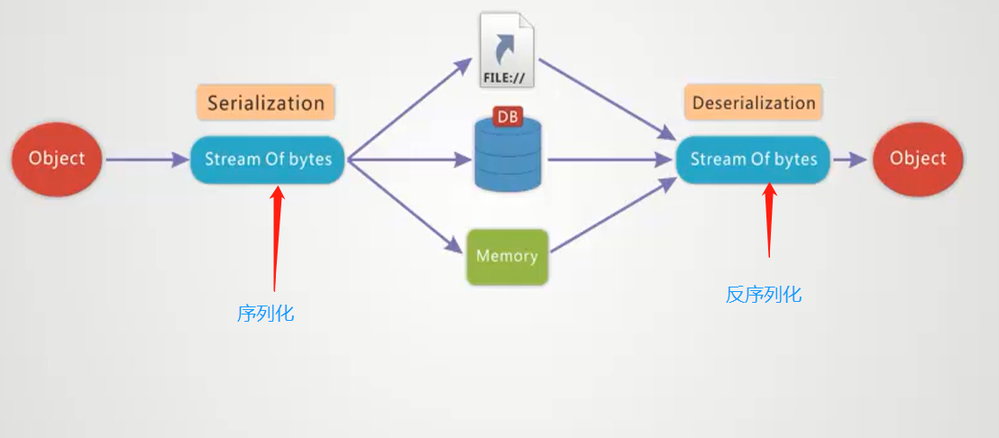

不是所有的对象都是可以序列化。序列化就是将一个对象转换成字节序列，方便存储和传输。 

- 序列化：`ObjectOutputStream.writeObject()`
- 反序列化：`ObjectInputStream.readObject()`

不会对静态变量进行序列化，因为序列化只是保存对象的状态，静态变量属于类的状态。

```java
import java.io.*;

/**
 * 对象流
 * 1. 写出后读取
 * 2. 读取的顺序与写出保持一致
 * 3. 不是所有的对象都可以序列化 Serializable
 * @author Hongliang Zhu
 * @create 2020-02-18 18:47
 */
public class ObjectTest {
    public static void main(String[] args) throws IOException, ClassNotFoundException {
        // 写出
        ByteArrayOutputStream baos = new ByteArrayOutputStream();
        ObjectOutputStream oos = new ObjectOutputStream(new BufferedOutputStream(baos)); // 加上缓冲流，提升性能
        // 操作数据类型
        oos.writeUTF("良辰美景奈何天");  // 24个字节
        oos.writeInt(18);
        oos.writeChar('a');
        oos.writeBoolean(true);
        // 对象
        oos.writeObject("花谢花飞花满天");
        Employee e = new Employee("马云", 5000.0);
        oos.writeObject(e); // 序列化
        oos.flush();
        //  读取
        byte[] datas = baos.toByteArray();
        System.out.println(datas.length); // 30
        // 加上缓冲流，提升性能
        ObjectInputStream dis = new ObjectInputStream(new BufferedInputStream(new ByteArrayInputStream(datas)));
        // 读取顺序与写出顺序一致
        String msg = dis.readUTF();
        System.out.println("字符串的大小： "+msg.getBytes().length); // 这里变为21
        int a = dis.readInt();  // 4个字节
        char c = dis.readChar(); // 2个字节
        boolean flag = dis.readBoolean(); // 1个字节
        System.out.println(msg);
        System.out.println(flag);
        Object str = dis.readObject();
        Object employee = dis.readObject();  //反序列化

        if( str instanceof  String){
            String ss = (String)str;
            System.out.println(ss);
        }
        if(employee instanceof  Employee){
            Employee eee = (Employee)employee;
            System.out.println(eee.toString());
        }
    }
}

class Employee implements java.io.Serializable{
    private String name;
    private double money;

    public void setName(String name) {
        this.name = name;
    }

    public void setMoney(double money) {
        this.money = money;
    }

    public String getName() {
        return name;
    }

    public double getMoney() {
        return money;
    }

    public Employee(String name, double money) {
        this.name = name;
        this.money = money;
    }

    @Override
    public String toString() {
        return this.name +"===>"+ this.money;
    }
}

```


## 2. Serializable

序列化的类需要实现 `Serializable` 接口，它只是一个标准，没有任何方法需要实现，但是如果不去实现它的话而进行序列化，会抛出异常。 


## 3. transient

`transient` 关键字可以使一些属性不会被序列化。

`ArrayList` 中存储数据的数组 `elementData` 是用 `transient` 修饰的，因为这个数组是动态扩展的，并不是所有的空间都被使用，因此就不需要所有的内容都被序列化。通过重写序列化和反序列化方法，使得可以只序列化数组中有内容的那部分数据。

```java
private transient Object[] elementData;
```

---


# 八、 commons-io组件

## 下载

 http://commons.apache.org/proper/commons-io/download_io.cgi 

## 环境搭建

环境准备：
1.在idea中导入以下两个jar包

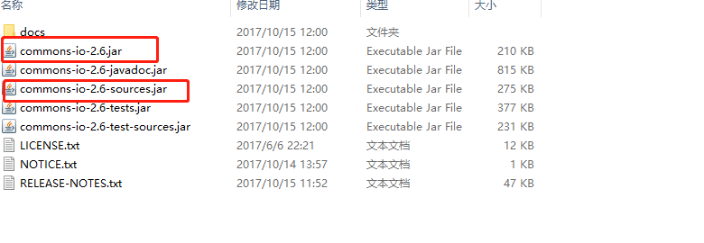

2.打开idea的project struct：

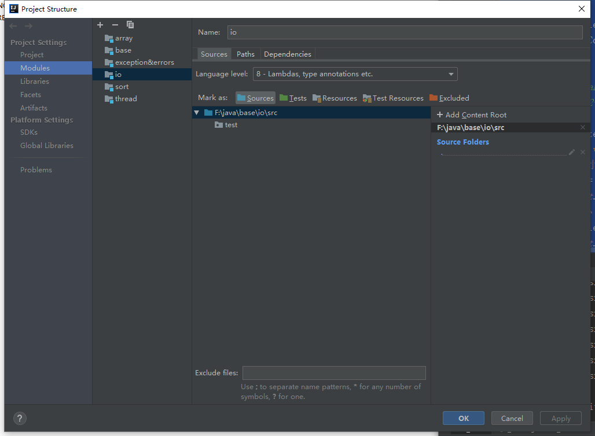

3,进入Dependencies

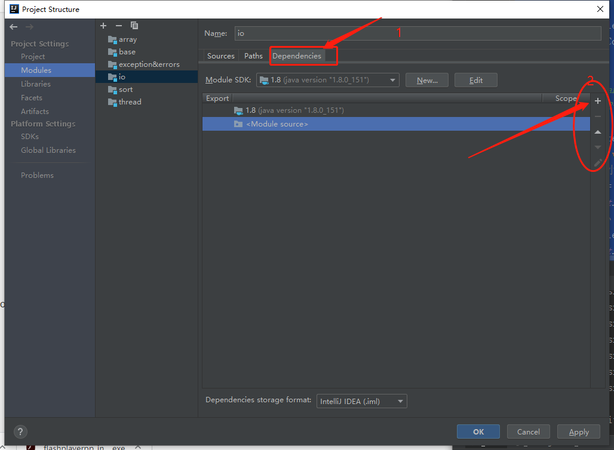

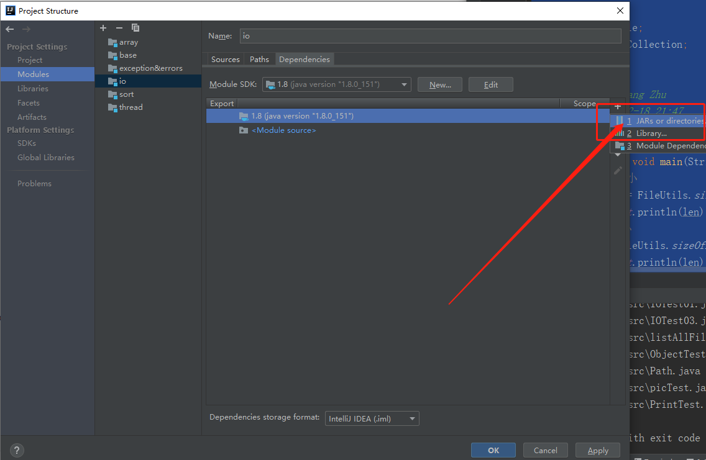


## 操作文件


```java
import org.apache.commons.io.FileUtils;
import org.apache.commons.io.filefilter.DirectoryFileFilter;
import org.apache.commons.io.filefilter.EmptyFileFilter;
import org.apache.commons.io.filefilter.FileFilterUtils;
import org.apache.commons.io.filefilter.SuffixFileFilter;

import java.io.File;
import java.util.Collection;

/**
 * @author Hongliang Zhu
 * @create 2020-02-18 21:47
 */
public class CIO_test {
    public static void main(String[] args) {
        // 文件大小
        long len = FileUtils.sizeOf(new File("./io/io.png"));
        System.out.println(len);
        //目录大小
        len  = FileUtils.sizeOfDirectory(new File("./io"));
        System.out.println(len);

        // 列出当前目录下的文件
        Collection<File> files = FileUtils.listFiles(new File("./io"), EmptyFileFilter.NOT_EMPTY, null);
        for (File file: files){
            System.out.println(file.getName());
        }

        System.out.println("----------------------------------");
        // 列出当前目录下的件文
        files = FileUtils.listFiles(new File("./io"), EmptyFileFilter.NOT_EMPTY, DirectoryFileFilter.INSTANCE);
        for (File file: files){
            System.out.println(file.getAbsolutePath());
        }
        System.out.println("----------------------------------");
        files = FileUtils.listFiles(new File("./io"),
                FileFilterUtils.or(new SuffixFileFilter("java"), new SuffixFileFilter("txt")), DirectoryFileFilter.INSTANCE);  // 文件过滤
        for (File file: files){
            System.out.println(file.getAbsolutePath());
        }


    }

}

```

> 416160
> 1696597
> a.txt
> a_copy.txt
> copy_dext.txt
> dext.txt
> io.iml
> io.png
> io_copy.png
> io_copyppppp.png
> ppp_img.png
>
> print.txt
>
> F:\java\base\.\io\a.txt
> F:\java\base\.\io\a_copy.txt
> F:\java\base\.\io\copy_dext.txt
> F:\java\base\.\io\dext.txt
> F:\java\base\.\io\io.iml
> F:\java\base\.\io\io.png
> F:\java\base\.\io\io_copy.png
> F:\java\base\.\io\io_copyppppp.png
> F:\java\base\.\io\ppp_img.png
> F:\java\base\.\io\print.txt
> F:\java\base\.\io\src\CIOTest.java
> F:\java\base\.\io\src\CIO_test.java
> F:\java\base\.\io\src\ContentEncode.java
> F:\java\base\.\io\src\ConvertTest.java
> F:\java\base\.\io\src\CopyFile.java
> F:\java\base\.\io\src\CopyTxt.java
> F:\java\base\.\io\src\countFiles.java
> F:\java\base\.\io\src\DataTest.java
> F:\java\base\.\io\src\DecorateTest01.java
> F:\java\base\.\io\src\DecorateTest02.java
> F:\java\base\.\io\src\Demo1.java
> F:\java\base\.\io\src\DirCount.java
> F:\java\base\.\io\src\DirDemo1.java
> F:\java\base\.\io\src\FileDemo01.java
> F:\java\base\.\io\src\FileDemo02.java
> F:\java\base\.\io\src\FileUtils.java
> F:\java\base\.\io\src\IOTes02.java
> F:\java\base\.\io\src\IOTes04.java
> F:\java\base\.\io\src\IOTest01.java
> F:\java\base\.\io\src\IOTest03.java
> F:\java\base\.\io\src\listAllFiles.java
> F:\java\base\.\io\src\ObjectTest.java
> F:\java\base\.\io\src\Path.java
> F:\java\base\.\io\src\picTest.java
>
> F:\java\base\.\io\src\PrintTest.java
>
> F:\java\base\.\io\a.txt
> F:\java\base\.\io\a_copy.txt
> F:\java\base\.\io\copy_dext.txt
> F:\java\base\.\io\dext.txt
> F:\java\base\.\io\print.txt
> F:\java\base\.\io\src\CIOTest.java
> F:\java\base\.\io\src\CIO_test.java
> F:\java\base\.\io\src\ContentEncode.java
> F:\java\base\.\io\src\ConvertTest.java
> F:\java\base\.\io\src\CopyFile.java
> F:\java\base\.\io\src\CopyTxt.java
> F:\java\base\.\io\src\countFiles.java
> F:\java\base\.\io\src\DataTest.java
> F:\java\base\.\io\src\DecorateTest01.java
> F:\java\base\.\io\src\DecorateTest02.java
> F:\java\base\.\io\src\Demo1.java
> F:\java\base\.\io\src\DirCount.java
> F:\java\base\.\io\src\DirDemo1.java
> F:\java\base\.\io\src\FileDemo01.java
> F:\java\base\.\io\src\FileDemo02.java
> F:\java\base\.\io\src\FileUtils.java
> F:\java\base\.\io\src\IOTes02.java
> F:\java\base\.\io\src\IOTes04.java
> F:\java\base\.\io\src\IOTest01.java
> F:\java\base\.\io\src\IOTest03.java
> F:\java\base\.\io\src\listAllFiles.java
> F:\java\base\.\io\src\ObjectTest.java
> F:\java\base\.\io\src\Path.java
> F:\java\base\.\io\src\picTest.java
> F:\java\base\.\io\src\PrintTest.java

## 读取内容

```java
import org.apache.commons.io.FileUtils;
import org.apache.commons.io.LineIterator;
import java.io.File;
import java.io.IOException;
import java.util.List;
/**
 * commons-io
 * 读取内容
 * @author Hongliang Zhu
 * @create 2020-02-18 21:47
 */
public class CIOTest {
    public static void main(String[] args) throws IOException {
        // 读取文件
        String msg = FileUtils.readFileToString(new File("./io/dext.txt"), "UTF-8");
        System.out.println(msg);
        byte[] datas = FileUtils.readFileToByteArray(new File("./io/dext.txt"));
        System.out.println(datas.length);
        // 逐行读取
        List<String> msgs = FileUtils.readLines(new File("./io/dext.txt"),"UTF-8");
        for(String m: msgs){
            System.out.println(m);
        }

        LineIterator it = FileUtils.lineIterator(new File("./io/dext.txt"));
        while (it.hasNext()){
            System.out.println(it.nextLine());
        }

    }
}

```

## 写出内容

```java
import org.apache.commons.io.FileUtils;
import java.io.File;
import java.io.IOException;
import java.util.ArrayList;
import java.util.List;
/**
 * 写出内容
 * @author Hongliang Zhu
 * @create 2020-02-19 11:27
 */
public class CIOtestWrite {

    public static void main(String[] args) throws IOException {
        // 写出文件
        FileUtils.write(new File("./io/happy.txt"), "今天天气真好！\r\n", "UTF-8");
        FileUtils.writeStringToFile(new File("./io/happy.txt"), "河山大好，出去走走吧！", "UTF-8",true);
        FileUtils.writeByteArrayToFile(new File("./io/happy.txt"), "河山大好，出去走走吧！".getBytes("UTF-8"),true);

        // 写出列表
        List <String> datas = new ArrayList<>();
        datas.add("马云");
        datas.add("马化腾");
        datas.add("李嘉诚");

        FileUtils.writeLines(new File("./io/happy.txt"), datas, "...", true);
    }
}
```

> ```java
> 今天天气真好！河山大好，出去走走吧！河山大好，出去走走吧！马云...马化腾...李嘉诚...
> ```

## 复制文件

```java
import org.apache.commons.io.FileUtils;
import java.io.File;
import java.io.IOException;
import java.net.URL;

/**
 * 拷贝文件
 * @author Hongliang Zhu
 * @create 2020-02-19 11:37
 */
public class CIOCopy {
    public static void main(String[] args) throws IOException {
        // 复制文件
        FileUtils.copyFile(new File("./io/io.png"), new File("./io/cio.png"));
        // 拷贝文件到目录
        FileUtils.copyFileToDirectory(new File("./io/io.png"), new File("./io/test"));
        // copy URL
        String url = "https://timgsa.baidu.com/timg?image&quality=80&size=b9999_10000&sec=1582094003889&di=8d3bc6164079cb45c6ba073ff143b591&imgtype=0&src=http%3A%2F%2Fwww.bbra.cn%2FUploadFiles%2Fimgs%2F2015%2F11%2F02%2Fmm3%2F005.jpg";
        FileUtils.copyURLToFile(new URL(url), new File("./io/girl.jpg")); // 可以下载一张图片

    }
}

```


# 九、 NIO

新的输入/输出 (NIO) 库是在 JDK 1.4 中引入的，弥补了原来的 I/O 的不足，提供了高速的、面向块的 I/O。 

## 1. 流与块

​		I/O 与 NIO 最重要的区别是数据打包和传输的方式，I/O 以流的方式处理数据，而 NIO 以**块的方式**处理数据。

​		面向流的 I/O 一次处理一个字节数据：一个输入流产生一个字节数据，一个输出流消费一个字节数据。为流式数据创建过滤器非常容易，链接几个过滤器，以便每个过滤器只负责复杂处理机制的一部分。不利的一面是，面向流的 I/O 通常相当慢。

​		面向块的 I/O 一次处理一个数据块，按块处理数据比按流处理数据要快得多。但是面向块的 I/O 缺少一些面向流的 I/O 所具有的优雅性和简单性。

​		I/O 包和 NIO 已经很好地集成了，`java.io.*` 已经以 NIO 为基础重新实现了，所以现在它可以利用 NIO 的一些特性。例如，`java.io.*` 包中的一些类包含以块的形式读写数据的方法，这使得即使在面向流的系统中，处理速度也会更快。

## 2. 通道与缓冲区

### 通道

通道 Channel 是对原 I/O 包中的流的模拟，可以通过它读取和写入数据。

通道与流的不同之处在于，流只能在一个方向上移动(一个流必须是 `InputStream` 或者 `OutputStream` 的子类)，而通道是双向的，可以用于读、写或者同时用于读写。

通道包括以下类型：

- `FileChannel`：从文件中读写数据；
- `DatagramChannel`：通过 UDP 读写网络中数据；
- `SocketChannel`：通过 TCP 读写网络中数据；
- `ServerSocketChannel`：可以监听新进来的 TCP 连接，对每一个新进来的连接都会创建一个 `SocketChannel`。

### 缓冲区

发送给一个通道的所有数据都必须首先放到缓冲区中，同样地，从通道中读取的任何数据都要先读到缓冲区中。也就是说，不会直接对通道进行读写数据，而是要先经过缓冲区。

缓冲区实质上是一个数组，但它不仅仅是一个数组。缓冲区提供了对数据的结构化访问，而且还可以跟踪系统的读/写进程。

缓冲区包括以下类型：

- `ByteBuffer`
- `CharBuffer`
- `ShortBuffer`
- `IntBuffer`
- `LongBuffer`
- `FloatBuffer`
- `DoubleBuffer`

## 2. 缓冲区状态变量

- capacity：最大容量；
- position：当前已经读写的字节数；
- limit：还可以读写的字节数。

状态变量的改变过程举例： 

① 新建一个大小为 8 个字节的缓冲区，此时 position 为 0，而 limit = capacity = 8。capacity 变量不会改变，下面的讨论会忽略它。 

 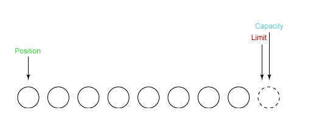

② 从输入通道中读取 5 个字节数据写入缓冲区中，此时 position 为 5，limit 保持不变。 

 

③ 在将缓冲区的数据写到输出通道之前，需要先调用 flip() 方法，这个方法将 limit 设置为当前 position，并将 position 设置为 0。 

 

④ 从缓冲区中取 4 个字节到输出缓冲中，此时 position 设为 4。 

 

⑤ 最后需要调用 clear() 方法来清空缓冲区，此时 position 和 limit 都被设置为最初位置 

 

## 3. 文件NIO实例

```java
public static void fastCopy(String src, String dist) throws IOException {

    /* 获得源文件的输入字节流 */
    FileInputStream fin = new FileInputStream(src);

    /* 获取输入字节流的文件通道 */
    FileChannel fcin = fin.getChannel();

    /* 获取目标文件的输出字节流 */
    FileOutputStream fout = new FileOutputStream(dist);

    /* 获取输出字节流的文件通道 */
    FileChannel fcout = fout.getChannel();

    /* 为缓冲区分配 1024 个字节 */
    ByteBuffer buffer = ByteBuffer.allocateDirect(1024);

    while (true) {

        /* 从输入通道中读取数据到缓冲区中 */
        int r = fcin.read(buffer);

        /* read() 返回 -1 表示 EOF */
        if (r == -1) {
            break;
        }

        /* 切换读写 */
        buffer.flip();

        /* 把缓冲区的内容写入输出文件中 */
        fcout.write(buffer);

        /* 清空缓冲区 */
        buffer.clear();
    }
}
```

## 4. 选择器

​		NIO 常常被叫做非阻塞 IO，主要是因为 NIO 在网络通信中的非阻塞特性被广泛使用。

​		NIO 实现了 IO 多路复用中的 Reactor 模型，一个线程 Thread 使用一个选择器 Selector 通过轮询的方式去监听多个通道 Channel 上的事件，从而让一个线程就可以处理多个事件。

​		通过配置监听的通道 Channel 为非阻塞，那么当 Channel 上的 IO 事件还未到达时，就不会进入阻塞状态一直等待，而是继续轮询其它 Channel，找到 IO 事件已经到达的 Channel 执行。

​		因为创建和切换线程的开销很大，因此使用一个线程来处理多个事件而不是一个线程处理一个事件，对于 IO 密集型的应用具有很好地性能。

​		应该注意的是，只有套接字 Channel 才能配置为非阻塞，而 FileChannel 不能，为 FileChannel 配置非阻塞也没有意义。

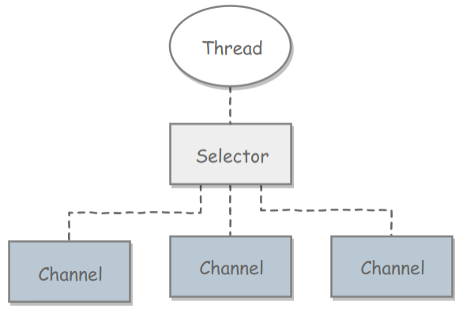

### 创建选择器

```java
Selector selector = Selector.open();
```

### 将通道注册到选择器上

```java
ServerSocketChannel ssChannel = ServerSocketChannel.open();
ssChannel.configureBlocking(false);
ssChannel.register(selector, SelectionKey.OP_ACCEPT);
```

​			通道必须配置为非阻塞模式，否则使用选择器就没有任何意义了，因为如果通道在某个事件上被阻塞，那么服务器就不能响应其它事件，必须等待这个事件处理完毕才能去处理其它事件，显然这和选择器的作用背道而驰。

​			在将通道注册到选择器上时，还需要指定要注册的具体事件，主要有以下几类：

- `SelectionKey.OP_CONNECT`
- `SelectionKey.OP_ACCEPT`
- `SelectionKey.OP_READ`
- `SelectionKey.OP_WRITE`

它们在 `SelectionKey` 的定义如下： 

```java
public static final int OP_READ = 1 << 0;
public static final int OP_WRITE = 1 << 2;
public static final int OP_CONNECT = 1 << 3;
public static final int OP_ACCEPT = 1 << 4;
```

可以看出每个事件可以被当成一个位域，从而组成事件集整数。例如： 

```java
int interestSet = SelectionKey.OP_READ | SelectionKey.OP_WRITE;
```

### 监听事情

```java
int num = selector.select();
```

使用 select() 来监听到达的事件，它会一直阻塞直到有至少一个事件到达。 

### 获取到达的事件

```java
Set<SelectionKey> keys = selector.selectedKeys();
Iterator<SelectionKey> keyIterator = keys.iterator();
while (keyIterator.hasNext()) {
    SelectionKey key = keyIterator.next();
    if (key.isAcceptable()) {
        // ...
    } else if (key.isReadable()) {
        // ...
    }
    keyIterator.remove();
}
```

### 事件循环

​		因为一次 `select()` 调用不能处理完所有的事件，并且服务器端有可能需要一直监听事件，因此服务器端处理事件的代码一般会放在一个死循环内。 

```java
while (true) {
    int num = selector.select();
    Set<SelectionKey> keys = selector.selectedKeys();
    Iterator<SelectionKey> keyIterator = keys.iterator();
    while (keyIterator.hasNext()) {
        SelectionKey key = keyIterator.next();
        if (key.isAcceptable()) {
            // ...
        } else if (key.isReadable()) {
            // ...
        }
        keyIterator.remove();
    }
}
```

## 5. 套接字NIO实例

```java
public class NIOServer {

    public static void main(String[] args) throws IOException {

        Selector selector = Selector.open();

        ServerSocketChannel ssChannel = ServerSocketChannel.open();
        ssChannel.configureBlocking(false);
        ssChannel.register(selector, SelectionKey.OP_ACCEPT);

        ServerSocket serverSocket = ssChannel.socket();
        InetSocketAddress address = new InetSocketAddress("127.0.0.1", 8888);
        serverSocket.bind(address);

        while (true) {

            selector.select();
            Set<SelectionKey> keys = selector.selectedKeys();
            Iterator<SelectionKey> keyIterator = keys.iterator();

            while (keyIterator.hasNext()) {

                SelectionKey key = keyIterator.next();

                if (key.isAcceptable()) {

                    ServerSocketChannel ssChannel1 = (ServerSocketChannel) key.channel();

                    // 服务器会为每个新连接创建一个 SocketChannel
                    SocketChannel sChannel = ssChannel1.accept();
                    sChannel.configureBlocking(false);

                    // 这个新连接主要用于从客户端读取数据
                    sChannel.register(selector, SelectionKey.OP_READ);

                } else if (key.isReadable()) {

                    SocketChannel sChannel = (SocketChannel) key.channel();
                    System.out.println(readDataFromSocketChannel(sChannel));
                    sChannel.close();
                }

                keyIterator.remove();
            }
        }
    }

    private static String readDataFromSocketChannel(SocketChannel sChannel) throws IOException {

        ByteBuffer buffer = ByteBuffer.allocate(1024);
        StringBuilder data = new StringBuilder();

        while (true) {

            buffer.clear();
            int n = sChannel.read(buffer);
            if (n == -1) {
                break;
            }
            buffer.flip();
            int limit = buffer.limit();
            char[] dst = new char[limit];
            for (int i = 0; i < limit; i++) {
                dst[i] = (char) buffer.get(i);
            }
            data.append(dst);
            buffer.clear();
        }
        return data.toString();
    }
}
```

```java
public class NIOClient {

    public static void main(String[] args) throws IOException {
        Socket socket = new Socket("127.0.0.1", 8888);
        OutputStream out = socket.getOutputStream();
        String s = "hello world";
        out.write(s.getBytes());
        out.close();
    }
}
```

## 6. 内存映射文件

​		内存映射文件 I/O 是一种读和写文件数据的方法，它可以比常规的基于流或者基于通道的 I/O 快得多。

​		向内存映射文件写入可能是危险的，只是改变数组的单个元素这样的简单操作，就可能会直接修改磁盘上的文件。修改数据与将数据保存到磁盘是没有分开的。

​		下面代码行将文件的前 1024 个字节映射到内存中，map() 方法返回一个 MappedByteBuffer，它是 ByteBuffer 的子类。因此，可以像使用其他任何 ByteBuffer 一样使用新映射的缓冲区，操作系统会在需要时负责执行映射。

```java
MappedByteBuffer mbb = fc.map(FileChannel.MapMode.READ_WRITE, 0, 1024);
```

## 7. 对比

NIO 与普通 I/O 的区别主要有以下两点：

- NIO 是非阻塞的；
- NIO 面向块，I/O 面向流。


# 参考

1.  https://cyc2018.github.io/CS-Notes 
2.  https://www.runoob.com/design-pattern/design-pattern-tutorial.html 


