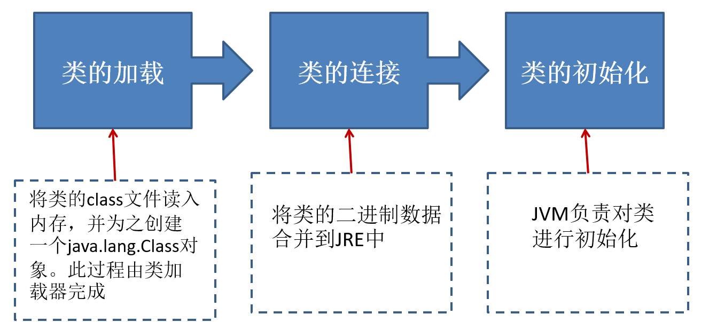
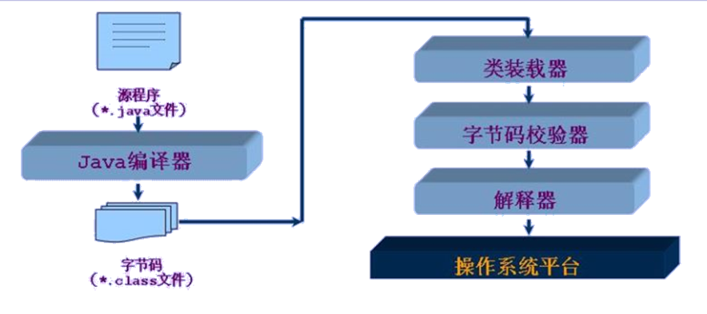
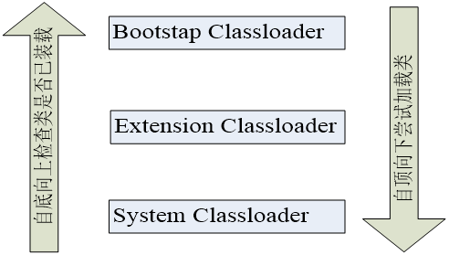
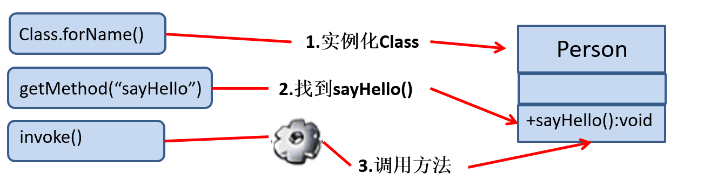

# 动态语言

程序运行时，可以改变程序结构或变量类型。典型的语言：Python、ruby、js等。

 C,  C++,  JAVA不是动态语言，JAVA可以称之为“准动态语言”。但是JAVA有一定的动态性，我们可以利用反射机制、 字节码操作获得类似动态语言的特性。JAVA的动态性让编程的时候更加灵活！

----


#  Java反射机制

`Reflection`（反射）是被视为动态语言的关键，反射机制允许程序在执行期借助于Reflection API取得任何类的内部信息，并能直接操作任意对象的内部属性及方法。

程序在运行状态中，可以动态加载一个只有名称的类，对于任意一个 已加载的类，都能够知道这个类的所有属性和方法；对于任意一个对象，都能够调用它的任意一个方法和属性。

加载完类之后，在堆内存中，就产生了一个 `Class` 类型的对象（一个类只有一个 `Class` 对象），这个对象就包含了完整的类的结构信息。 我们可以通过这个对象看到类的结构。这个对象就像一面镜子，透过这个镜子看到类的结构，所以，我们形象的称之为：**反射**。 

-------


# Java反射机制提供的功能

> 在运行时判断任意一个对象所属的类
>
> 在运行时构造任意一个类的对象
>
> 在运行时判断任意一个类所具有的成员变量和方法
>
> 在运行时调用任意一个对象的成员变量和方法
>
> 生成动态代理

------


# 反射初体验 

一个Peason类，里面包含了：

> 1. 无参数构造方法
> 2. 有参数构造方法（包括private和public的）
> 3. public的属性name、private的属性age
> 4. get和set方法
> 5. 自定义方法（包括private和public的）

```java
/**
 * @author Hongliang Zhu
 * @create 2020-03-02 11:27
 */
public class Peason {
    public String name;  // 私有
    private int age;

    public Peason() {
    }

    public Peason(String name, int age) {
        this.name = name;
        this.age = age;
    }
    private Peason(String name) { // 私有
        this.name = name;
    }

    public String getName() {
        return name;
    }

    public void setName(String name) {
        this.name = name;
    }

    public int getAge() {
        return age;
    }

    public void setAge(int age) {
        this.age = age;
    }

    @Override
    public String toString() {
        return "Peason{" +
                "name='" + name + '\'' +
                ", age=" + age +
                '}';
    }

    private String show(String nation){ // 私有

        System.out.println("国籍为：" + nation);
        return nation;
    }

    public void show(){
        System.out.println("我是一个人");

    }

}

```

反射示例，通过反射创建对象，调用对象的属性和方法以及修改私有的属性和调用使用的方法：

```java
 @Test
    public void test() throws Exception {
        Class clazz = Peason.class;
        // 通过反射，创建对象
        Constructor constructor = clazz.getConstructor(String.class, int.class);
        Object tom = constructor.newInstance("tom", 15);
        System.out.println(tom.toString()); // Peason{name='tom', age=15}

        System.out.println((tom instanceof Peason));
        // 通过反射， 调用对象指定的属性和方法
        Field age = clazz.getDeclaredField("name");
        age.set(tom, "zhu");
        System.out.println(tom.toString());
        Field[] declaredFields = clazz.getDeclaredFields();
        System.out.println(Arrays.toString(declaredFields));

        // 方法
        Method show = clazz.getDeclaredMethod("show");
        show.invoke(tom);

        System.out.println("**********************************************");
        //调用私有方法和属性
        Constructor cons1 = clazz.getDeclaredConstructor(String.class);
        cons1.setAccessible(true);
        Object jack = cons1.newInstance("jack");
        System.out.println(jack.toString());
        Field name = clazz.getDeclaredField("name");
        name.setAccessible(true);
        name.set(jack, "lihang");
        System.out.println(jack.toString());
        // 调用私有的方法
        Method showNation = clazz.getDeclaredMethod("show", String.class);
        showNation.setAccessible(true);
        Object china = showNation.invoke(jack, "China");//  国籍为：China
        System.out.println(china instanceof String);
        System.out.println(china);

    }
```

---------

既然使用反射也可以创建对象，那么在开发中是使用new还是使用反射来创建对象呢？ 答案是通过new关键字来创建对象。如果在编译之前不知道需要创建哪个对象，则需要通过反射来创建对象，体现了反射的动态性。

封装性的目的就是为了不让外面的对象来调用私有的方法，然而反射却可以调用私有的属性和方法，那么反射机制与面向对象的封装性是不是矛盾的呢？其实不矛盾，因为封装的目的中带有提示的成分，建议程序员不要去调用私有的方法，因为以及提供了public的方法，没有必要去调用的私有的方法，这是封装的一种提示。而反射是可不可以的问题。

--------


# Class对象

`java.lang.Class`类十分特殊，用来表示`java`中的类型。

`class / interface / enum / annotation / [] / primitive type / void`

```java
    Class c1 = Object.class;
    System.out.println(c1); // class java.lang.Object
    Class c2 = int[][].class;
    System.out.println(c2); // class [[I
    Class c3 = int[].class;
    System.out.println(c3); // class [I
    int[] a = new int[10];
    int[] b = new int[100];
    Class c4 = a.getClass();
    Class c5 = b.getClass();
    System.out.println(c4 == c5); // true 只要是同一维度，就是相同的Class对象
```

对象照镜子后可以得到的信息：**某个类的属性**、**方法和构造器**、**某个类到底实现了哪些接口**。对于每个类而言，`JRE` 都为其保留一个不变的 `Class` 类型的对象。一个 `Class` 对象包含了特定某个类的有关信息。`Class`类是`Reflection`的根源。针对任何您想动态加载、运行的类，唯有先获得相应的`Class` 对象。

> `Class`本身也是一个类
>
> `Class`对象只能由系统建立对象
>
> 一个类在`JVM` 中只会有一个Class实例 （重要： 不管你用哪种方式获取的Class实例，都是同一个）
>
> 一个`Class`对象对应的是一个加载到`JVM`中的一个`.class`文件
>
> 每个类的实例都会记得自己是由哪个`Class`实例所生成
>
> 通过`Class`可以完整地得到一个类中的完整结构

## 类加载的过程

程序进过`javac.exe` 命令以后，会生成过程一个或者多个字节码文件(.class结尾)，接着我们使用`java.exe` 命令对某个字节码文件进行解释执行。相当于字节码文件加载到内存中。此过程就称为类的加载，我们就称为**运行时类**，此运行时类就作为一个`Class`的一个实例。

加载到内存中的运行时类，会缓存一段时间。在此时间之内，我们可以通过不同的方式来获取次运行时类。

## Class对象的获取

### 第一种方法

若已知具体的类，通过类的`class`属性获取，该方法最为安全可靠，程序性能最高。

```java
 Class<PersonC> clazz = PersonC.class;
 System.out.println(clazz); // class PersonC
```

### 第二种方式

已知某个类的实例，调用该实例的`getClass()`方法获取`Class`对象

```java
 PersonC p = new PersonC();
 Class clazz1 = p.getClass();
 System.out.println(clazz1); // class PersonC
```

### 第三种方式

已知一个类的全类名，且该类在类路径下，可通过`Class`类的静态方法`forName()`获取，可能抛出`ClassNotFoundException`。

```java
public void test1() throws ClassNotFoundException {
        Class clazz2 = Class.forName("PersonC");
        System.out.println(clazz2);
    }
```

```java
System.out.println(clazz == clazz1);  //true
System.out.println(clazz == clazz2);//true
System.out.println(clazz1 == clazz2);//true
```

### 第四种方式：类加载器

```java
ClassLoader loader = this.getClass().getClassLoader();
Class clazz4 = loader.loadClass("PersonC");
System.out.println(clazz4); // class PersonC
```

## 类加载机制

当程序主动使用某个类时，如果该类还未被加载到内存中，则系统会通过如下三个步骤来对该类进行初始化。



### 加载

将 `class`文件字节码内容加载到内存中，并将这些静态数据转换成方法区的运行时数据结构，然后生成一个代表这个类的 `java.lang.Class`对象，作为方法区中类数据的访问入口（即引用地址）。所有需要访问和使用类数据只能通过这个`Class`对象。这个加载的过程需要类加载器参与。

### 链接

将`Java`类的二进制代码合并到 `JVM` 的运行状态之中的过程。

**验证**：确保加载的类信息符合`JVM`规范，例如：以cafe开头，没有安全方面的问题

**准备**：正式为类变量（ `static`）分配内存并设置类变量**默认初始值**的阶段，这些内存都将在方法区中进行分配。比如 `static int n;`  在这个环节n会被赋值为 0 。

**解析**：虛拟机常量池内的符号引用（常量名）替换为直接引用（地址）的过程。

### 初始化

执行类构造器`<cini>()`方法的过程。**类构造器`< clinit>()`方法是由编译期自动收集类中所有类变量的赋值动作和静态代码块中的语句合并产生的**。（类构造器是构造类信息的，不是构造该类对象的构造器）。static int n = 2;  //初始化阶段赋值

当初始化一个类的时候，如果发现其父类还没有进行初始化，则需要先触发其父类的初始化。

虛拟机会保证一个类的`< clinit>()`方法在多线程环境中被正确加锁和同步。

### 举例说明类加载

```java
class A{
    static {  // 静态代码块
        m = 300;
    }
    static int m = 100; // 静态变量
}
 public void testLoadingClass(){
        System.out.println(A.m); // 
  }
```

根据类加载机制，首先第一步类加载，将A加载到内存当中，已经有一个class实例了； 

第二步是类的链接，进行类变量的默认初始值， 将m 赋值为0， 即链接结束后 m = 0; 

第三步是初始化， 由于静态代码块在静态变量定义之前，所以，m 先赋值为300， 然后赋值为100。 m的值由`< clinit>()`方法执行决定的。 这个A的类构造器`< clinit>()`方法由类变量的赋值和静态的代码块中的语句按照顺序合并产生，类似于：

```java
< clinit>(){
	m = 300;
    m = 100;
}
```

故，最终输出的值为100。

### 类的主动引用

此过程一定会发生类的初始化

> 1. new一个类的对象
> 2. 调用类的静态成员(除了final常量)和静态方法
> 3. 使用`java.lang.reflect`包的方法对类进行反射调用
> 4. 当虚拟机启动，java  Hello，则一定会初始化Hello类。说白了就是先启动main方法所在的类
> 5. 当初始化一个类，如果其父类没有被初始化，则先会初始化他的父类。

```java
/**
 * l类加载全过程
 * @author Hongliang Zhu
 * @create 2020-03-06 10:57
 */
public class classLoader {
    static {
        System.out.println("classLoader 类的静态代码块");
    }
    public static void main(String[] args) throws ClassNotFoundException {
        System.out.println("classLoader 中 main方法...");
        /*
        	类的主动引用
        */
        // 调用类的静态成员（除finall）
//        System.out.println(A.k);
        System.out.println(A.b); //finall 常量不会初始化类A ： 属于被动引用
        // new 对象

        A a = new A();
        // 反射
//        Class a = Class.forName("A");

    }

}

class A extends Father{
    public static int k = 100;
    public static final int b = 100;
    static {
        System.out.println("静态初始化类A");
        k = 600;
    }
    public A(){
        System.out.println("类A的构造函数");
    }

}
class Father{
    static {
        System.out.println("父类Father的静态代码块");
    }
    public Father(){
        System.out.println("父类Father的构造函数");
    }
}

```

上述代码执行情况：

> classLoader 类的静态代码块
> 		classLoader 中 main方法...
> 		100
> 		**父类Father的静态代码块**
> 		**静态初始化类A**
> 		父类Father的构造函数
> 		类A的构造函数


###  类的被动引用

不会发生类的初始化

> 1. 当访问一个静态域时，只有真正声明这个域的类才会被初始化
>
>    通过子类引用父类的静态变量，不会导致子类初始化
>
> 2. 通过数组定义类引用，不会触发此类的初始化
>
> 3. 引用常量不会触发此类的初始化（常量在编译阶段就存入调用类的常量池中了）final

```java
class Father{
    static int father = 666;
    static {
        System.out.println("父类Father的静态代码块");
    }
    public Father(){
        System.out.println("父类Father的构造函数");
    }
}

public static void main(String[] args) throws ClassNotFoundException {
        System.out.println("classLoader 中 main方法...");
        /**
         *
         * 被动引用
         */
        //        System.out.println(A.b); //finall 常量不会初始化类A
        A[] arr = new A[10];
        System.out.println(A.father);

    }
```

> classLoader 类的静态代码块
> 		classLoader 中 main方法...
> 		父类Father的静态代码块
> 		666

## 类加载器ClassLoader



类加载器作用：

> 类加载的作用：将`class`文件字节码内容加载到内存中，并将这些静态数据**转换成方法区的运行时数据结构**，然后在堆中生成一个代表这个类的 `java.lang.class`对象，作为方法区中类数据的访问入口。
>
> 类缓存：标准的 `JavaSE` 类加载器可以按要求查找类，但一旦某个类被加载到类加载器中，它将维持加载（缓存）一段时间。不过`JVM`垃圾回收机制可以回收这些`Class`对象。

类加载器是用来把类(`class`)装载进内存的。`JVM` 规范定义了两种类型的类加载器：**启动类加载器**(`bootstrap`)和**用户自定义加载器**(`user-defined class loader`)。 `JVM`在运行时会产生3个类加载器组成的初始化加载器层次结构 ，如下图所示：




**引导类加载器**：用C++编写的，是`JVM`自带的类装载器，负责Java平台**核心库**，用来装载核心类库。该加载器无法直接获取。

**扩展类加载器**：负责`jre/lib/ext`目录下的`jar`包或 `–D java.ext.dirs` 指定目录下的`jar`包装入工作库。

**系统类加载器**：负责`java –classpath` 或 `–D java.class.path`所指的目录下的类与`jar`包装入工作 ，是最常用的加载器。

```java
import org.junit.Test;

/**
 * @author Hongliang Zhu
 * @create 2020-03-02 17:08
 */
public class TestClassLoader {

    @Test
    public void test(){
        ClassLoader classLoader = TestClassLoader.class.getClassLoader();
        // sun.misc.Launcher$AppClassLoader@18b4aac2
        System.out.println(classLoader); 
        // sun.misc.Launcher$AppClassLoader@18b4aac2  系统类加载器
        ClassLoader systemClassLoader = ClassLoader.getSystemClassLoader();
        System.out.println(systemClassLoader);
        
        ClassLoader parent = classLoader.getParent();
        System.out.println(parent); // sun.misc.Launcher$ExtClassLoader@a09ee92
        ClassLoader parent1 = parent.getParent();
        System.out.println(parent1); // null
        
        ClassLoader classloader = Class.forNme("java.lang.Object").getClassLoader();
        System.out.println(classloader); //null  说明是由引导类加载器加载的
              
    }

}

```

对于自定义类， 使用的是系统类加载器进行加载。调用系统类加载器的`getParent()`方法，获取扩展类系统加载器，调用扩展类系统加载器`getParent()` 无法获取引导类加载器，引导类加载器主要负责加载`java`的核心类库，无法加载自定义类。

### 类加载器的代理模式

代理模式 – 交给其他加载器来加载指定的类。

**双亲委托机制** ： 就是某个特定的类加载器在接到加载类的请求时，首先将加载任务委托给父类加载器，依次追溯，直到最高的爷爷辈的，如果父类加载器 可以完成类加载任务，就成功返回；只有父类加载器无法完成此加载 任务时，才自己去加载。

> 双亲委托机制是为了保证 Java 核心库的类型安全 
>
> 这种机制就保证不会出现用户自己能定义java.lang.Object/String类的情况。 

类加载器除了用于加载类，也是安全的最基本的屏障。

双亲委托机制是代理模式的一种。并不是所有的类加载器都采用双亲委托机制。`tomcat`服务器类加载器也使用代理模式，所不同的是它是首先尝试去加载某个类，如果找不到再代理给父类加载器。 这与一般类加载器的顺序是相反的。

### `ClassLoader`的作用举例：读取配置文件

```java
 public static void main(String[] args) throws IOException {
        Properties properties = new Properties();
        FileInputStream fis = new 		    FileInputStream("./reflect/jdbc.properties");

        properties.load(fis);
        String user = properties.getProperty("user");
        String password = properties.getProperty("password");
        System.out.println("user = "+user + ", passeord = "+ password);

    }
```

### 自定义类加载器

#### 流程

继承 `java.lang.ClassLoader`

 1、首先检查请求的类型是否已经被这个类装载器装载到命名空间中了，如果已经装载，直接返回；否则转入步骤2。

2、委派类加载请求给父类加载器（更准确的说应该是双亲类加载器，真个虚拟机中各种类加载器最终会呈现树状结构），如果父类加载器能够完成，则返回父类加载器加载的Class实例；否则转入步骤3。

3、调用本类加载器的findClass（…）方法，试图获取对应的字节码，如果获取的到，则调用defineClass（…）导入类型到方法区；如 果获取不到对应的字节码或者其他原因失败，返回异常给loadClass（…）， loadClass（…）转抛异常，终止加载过程（注意：这里的 异常种类不止一种）。 

####  文件系统类加载器

```java
import java.io.*;

/**
 * 自定义文件系统加载器
 * @author Hongliang Zhu
 * @create 2020-03-06 14:29
 */
public class fileSystemClassLoader extends ClassLoader{
    private String rootDir;

    public fileSystemClassLoader(String rootDir) {
        this.rootDir = rootDir;
    }


    @Override
    protected Class<?> findClass(String name) throws ClassNotFoundException {
        Class<?> loadedClass = findLoadedClass(name);
        // 如果有已经加载的类，则返回
        if( loadedClass != null){
            return loadedClass;
        }else {
            ClassLoader parent = this.getParent();
            try {
                loadedClass = parent.loadClass(name); // 委托给父类去加载
            }catch (Exception e){
//                e.printStackTrace();
            }
            if(loadedClass != null){
                return loadedClass;
            }else{// 父类无法加载
                // 本类加载， 读取文件，转换成字节数组
                byte[] classData = getClassData(name);
                if(classData == null){
                    throw new ClassNotFoundException();
                }else{
                    loadedClass = defineClass(name, classData, 0, classData.length);
                }
            }
        }
        return loadedClass;
    }

    //com.test.java  将直接骂文件转换成字节数组
    private byte[] getClassData(String name)  {
        String path = rootDir + "/"+ name.replace(".", "/")+".class";
        byte[] data = new byte[1024];
        ByteArrayOutputStream baos = new ByteArrayOutputStream();
        FileInputStream is = null;
        try {
            is = new FileInputStream(path);
            int len = 0;
            while ((len = is.read(data)) != -1){
                baos.write(data, 0, len);
            }
            return baos.toByteArray();

        } catch (Exception e) {
            e.printStackTrace();
        }finally {
            if(is != null){
                try {
                    is.close();
                } catch (IOException e) {
                    e.printStackTrace();
                }
            }
            if(baos != null){
                try {
                    baos.close();
                } catch (IOException e) {
                    e.printStackTrace();
                }
            }
        }

        return null;


    }
}

```

```java
/**
 * @author Hongliang Zhu
 * @create 2020-03-06 15:26
 */
public class TestFileSystemClassLoader {
    public static void main(String[] args) throws ClassNotFoundException {
        fileSystemClassLoader loader = new fileSystemClassLoader("F:/java");
        Class<?> aClass = loader.loadClass("com.test.java.hello");
        Class<?> aClass1 = loader.loadClass("com.test.java.hello");
        fileSystemClassLoader loader1 = new fileSystemClassLoader("F:/java");
        Class<?> cc = loader1.loadClass("com.test.java.hello");

        Class<?> c1 = loader.loadClass("java.lang.String");

        System.out.println(aClass.hashCode());
        System.out.println(aClass1.hashCode());
        System.out.println(cc.hashCode()); // 不同的类加载器
        System.out.println(cc.getClassLoader()); // fileSystemClassLoader@677327b6
        System.out.println(c1.getClassLoader());


    }
}

```

> 2133927002
> 		2133927002
> 		1836019240
> 		fileSystemClassLoader@677327b6
> 		null

**注意：被两个类加载器加载的同一个类，JVM不认为是相同的类。**

------------


# 通过反射创建运行时对象

```java
 Class clazz = PersonC.class;
        // 通过反射，创建对象
        Constructor constructor = clazz.getConstructor(String.class, int.class);
        Object tom = constructor.newInstance("tom", 15);
        System.out.println(tom.toString()); // PersonC{name='tom', age=15}
```

# 获取类的属性和内部结构

首先创建一个结构丰富的类，包含继承、实现接口，有参构造和无参构造、以及权限不同的属性和方法、带返回值的和不带返回值的，还有注解信息。

```java
package com;
import annotation.MyAnnotation;
/**
 * 一个结构非常丰富的类
 * @author Hongliang Zhu
 * @create 2020-03-02 21:33
 */
@Myannotation(value = "hi") // 注解
public class Person extends Creature<String> implements Comparable<String>, Myinterface {

    private String name; // 私有权限
    int age; //  默认权限
    public int id; //  公共权限

    public Person() {
    }
    private Person(String name){
        this.name = name;
    }
    Person(String name, int age){
        this.name = name;
        this.age = age;
    }
    private String show(String nation){
        System.out.println("我的国籍为："+ nation);
        return nation;
    }
    public String display(String insterests){
        return insterests;
    }

    @Override
    public void info() {
        System.out.println("这是一个人...");
    }

    @Override
    public int compareTo(String o) {
        return 0;
    }
}

```

父类：

```java
package com;
import java.io.Serializable;
/**
 * @author Hongliang Zhu
 * @create 2020-03-02 21:29
 */
public class Creature<T> implements Serializable {
    private char gender;
    public double weight;

    public void eat(){
        System.out.println("生物在吃东西...");
    }
    public void breath(){
        System.out.println("生物在呼吸...");
    }

}

```

接口：

```java
public interface Myinterface {
    void info();
}
```

注解：

```java
@Target({TYPE, ElementType.CONSTRUCTOR, ElementType.LOCAL_VARIABLE, ElementType.METHOD, ElementType.FIELD, ElementType.TYPE_PARAMETER, ElementType.TYPE_USE})
@Retention(RetentionPolicy.RUNTIME)
public @interface Myannotation {
    String value() default "Hello";
}
```

## 获取属性结构Field【了解】

### getFields()

```java
Class clazz = Person.class;
// 获取属性
Field[] fields = clazz.getFields();
for(Field f: fields){
	System.out.println(f);
}
```

> public int com.Person.id
> 		public double com.Creature.weight

`getFields()`: 获取当前运行时类及其父类中所有声明为`public`访问权限的属性。

### getDeclaredFields()

```JAVA
Field[] declaredFields = clazz.getDeclaredFields();
for (Field f: declaredFields){
    System.out.println(f);
}
```

> private java.lang.String com.Person.name
> 		int com.Person.age
> 		public int com.Person.id

`getDeclaredFields()`: 获取当前运行时类当中声明的所有属性。

### 获取属性的权限、数据类型和变量名

```java
public void test2(){
        Class clazz = Person.class;
        Field[] declaredFields = clazz.getDeclaredFields();
        System.out.println("1.权限修饰符:");
        for (Field f: declaredFields){
            int modifiers = f.getModifiers();
            System.out.println(Modifier.toString(modifiers));
        }
        System.out.println("2. 数据类型");
        for (Field f: declaredFields){
            Class type = f.getType();
            System.out.println(type.getName());
        }
        System.out.println("3. 变量名");
        for (Field f: declaredFields){
            String name = f.getName();
            System.out.println(name);
        }

    }
```

> 1.权限修饰符:
> 			private
>
> ​	public
>
> 2.数据类型
> 		java.lang.String
> 		int
> 		int
>
> 3.变量名
> 		name
> 		age
> 		id

`getModifiers()`： 获取属性的权限修饰符。

`getType()`：  获取属性的数据类型。

`getName()`： 获取属性的名称。

## 获取运行类的方法结构

### getMethods()

```java
Method[] methods = clazz.getMethods();
for(Method m: methods){    
    System.out.println(m);
}
```

> public int com.Person.compareTo(java.lang.String)
> public int com.Person.compareTo(java.lang.Object)
> public void com.Person.info()
> public java.lang.String com.Person.display(java.lang.String)
> public void com.Creature.breath()
> public void com.Creature.eat()
> public final void java.lang.Object.wait() throws java.lang.InterruptedException
> public final void java.lang.Object.wait(long,int) throws java.lang.InterruptedException
> public final native void java.lang.Object.wait(long) throws java.lang.InterruptedException
> public boolean java.lang.Object.equals(java.lang.Object)
> public java.lang.String java.lang.Object.toString()
> public native int java.lang.Object.hashCode()
> public final native java.lang.Class java.lang.Object.getClass()
> public final native void java.lang.Object.notify()
> public final native void java.lang.Object.notifyAll()

`getMethods()`: 获取当前运行时类及其父类中所有声明为`public`访问权限的方法。

### getDeclaredMethods()

同属性结构：`getDeclaredMethods()` ：获取当前运行时类当中声明的所有属性。（不包含父类中的）

> public int com.Person.compareTo(java.lang.String)
> public int com.Person.compareTo(java.lang.Object)
> public void com.Person.info()
> private java.lang.String com.Person.show(java.lang.String)
> public java.lang.String com.Person.display(java.lang.String)

方法也能获取一些自身的结构： 权限修饰符、返回值类型、方法名、形参列表、异常信息、返回值。里面都有对应的方法，可以去查询API。

> public Class<?> getReturnType()取得全部的返回值
>
> public Class<?>[] getParameterTypes()取得全部的参数
>
> public int getModifiers()取得修饰符
>
> public Class<?>[] getExceptionTypes()取得异常信息

---------


## 获取构造器

`public Constructor<T>[] getConstructors()`： 返回此 Class 对象所表示的类的所有public构造方法。

`public Constructor<T>[] getDeclaredConstructors()`：     返回此 Class 对象表示的类声明的所有构造方法 。

​     Constructor类中 ：

> 1. 取得修饰符: `public int getModifiers();`
>
> 2. 取得方法名称: `public String getName();`
>
> 3. 取得参数的类型：`public Class<?>[] getParameterTypes();`


## 获取运行时类的父类

`public Class<? Super T> getSuperclass()`： 返回表示此 Class 所表示的实体（类、接口、基本类型）的父类的 Class。

```java
Class clazz = Person.class;
Class superclass = clazz.getSuperclass();
System.out.println(superclass); // class com.Creature

Type genericSuperclass = clazz.getGenericSuperclass(); // 带泛型的父类
System.out.println(genericSuperclass); // com.Creature<java.lang.String>
```

## 获取运行时带泛型类的父类的泛型

```java
Class clazz = Person.class;
Type genericSuperclass = clazz.getGenericSuperclass();
ParameterizedType parameterizedType = (ParameterizedType) genericSuperclass;
// 获取泛型类型
Type[] actualTypeArguments = parameterizedType.getActualTypeArguments();

System.out.println(actualTypeArguments[0].getTypeName()); // java.lang.String
```

在JDBC中需要使用到。DAO操作。

获取父类泛型类型：**Type getGenericSuperclass()**

泛型类型：**ParameterizedType**

获取实际的泛型类型参数数组：**getActualTypeArguments()**

## 获取运行时类实现的接口

`public Class<?>[] getInterfaces() ；`

```java
Class[] interfaces = clazz.getInterfaces();
        for(Class i: interfaces){
            System.out.println(i);
        }
```

> interface java.lang.Comparable
> 		interface com.Myinterface

```java
Class[] interfaces1 = clazz.getSuperclass().getInterfaces();
        for(Class i: interfaces1){
            System.out.println(i);
        }
```

> interface java.io.Serializable

## 获取运行时类所在的包

`Package getPackage()`

```java
Package aPackage = clazz.getPackage();
System.out.println(aPackage);  // package com
```

## 获取注解

详见《Java注解Annotation》文章反射注解部分。


----------

#      使用反射生成并操作对象  

## 使用反射获取指定的属性

在反射机制中，可以直接通过`Field`类操作类中的属性，通过`Field`类提供的`set()`和`get()`方法就可以完成设置和取得属性内容的操作 。

> `public Field getField(String name)` 返回此Class对象表示的类或接口的指定的`public`的Field。
>
> `public Field getDeclaredField(String name)`返回此Class对象表示的类或接口的指定的Field。（所有声明的，也包括私有属性）

在Field中：

> `public Object get(Object obj)` 取得指定对象`obj`上此`Field`的属性内容
>
> `public void set(Object obj,Object value)` 设置指定对象`obj`上此`Field`的属性内容

注：在类中属性都设置为**非`public`**的前提下，在使用`set()`和`get()`方法时，首先要使用Field类中的`setAccessible(true)`方法将需要操作的属性设置为可以被外部访问。

> `public void setAccessible(true)`访问私有属性时，让这个属性可见。

```java
 public void test4() throws Exception{
     Class clazz = Person.class;
     // 创建实例对象
     Person p = (Person) clazz.getConstructor().newInstance();
     // 获取指定的属性
     Field f = clazz.getField("id");
     // 获取指定的属性值
     String name = f.getName();
     System.out.println(name);
     //设置当前的属性值
     f.set(p, 100);
     System.out.println(p.toString());

    // 获取指定的s属性;私有
    Field name1 = clazz.getDeclaredField("name");
    name1.setAccessible(true);//设定可访问
    name1.set(p,  "zhuhongliang");
    System.out.println(p.toString());
        
    }
```

## 使用反射获取指定的方法

通过反射，调用类中的方法，通过`Method`类完成。步骤：

1.通过Class类的`getMethod(String name, Class … parameterTypes)`方法取得一个`Method`对象，并设置此方法操作时所需要的参数类型。

2.之后使用`Object invoke(Object obj,  Object[] args)`进行调用，并向方法中传递要设置的obj对象的参数信息。



`Object invoke(Object obj,  Object[] args)`:

> 1.`Object` 对应原方法的返回值，若原方法无返回值，此时返回`null`
>
> 2.若原方法若为静态方法，此时形参`Object obj`可为`null` 或者 对于的calss对象。
>
> 3.若原方法形参列表为空，则`Object[] args`为`null`
>
> 4.若原方法声明为`private`,则需要在调用此`invoke()`方法前，显式调用方法对象的`setAccessible(true)`方法，将可访问`private`的方法。

```
   // 在Person类增加入菜静态方法：
   // 静态方法
    private static String showdesc(String name){
        System.out.println("英俊潇洒 ");
        return name;
    }
```

```java
 @Test
 public void test5() throws Exception {
     Class clazz = Person.class;
     // 创建实例对象
     Person p = (Person) clazz.getConstructor().newInstance();

    Method show = clazz.getDeclaredMethod("show", String.class);
    show.setAccessible(true);
    show.invoke(p, "加拿大");
    System.out.println("-------------调用静态方法--------");
    Method showdesc = clazz.getDeclaredMethod("showdesc", String.class);
    showdesc.setAccessible(true);
    Object invoke = showdesc.invoke(null,"应似飞鸿踏雪泥"); // 具有返回值
    System.out.println(invoke);

}
```

> 我的国籍为：加拿大
> 		-------------调用静态方法--------
> 		英俊潇洒 
> 		应似飞鸿踏雪泥

## 调用指定的构造器

```jav
    public void test6() throws Exception {
        Class clazz = Person.class;
        Constructor cons = clazz.getDeclaredConstructor(String.class);
        cons.setAccessible(true);
        Person zhu = (Person) cons.newInstance("zhu");
        System.out.println(zhu.toString());
    }
```

-----------

#  setAccessible 

启用和禁用访问安全检查的开关，值为 `true` 则指示反射的对象在使用时应该取消 Java 语言访问检查。值为 `false` 则指示反射的对象应该实施 Java 语言访问检查。并不是为`true` 就能访问为`false`就不能访问。

 **禁止安全检查，可以提高反射的运行速度。**

```java
import com.Person;

import java.lang.reflect.Method;

/**
 * 反射性能
 * @author Hongliang Zhu
 * @create 2020-03-03 14:26
 */
public class TestAccessiable {

    public static void main(String[] args) throws Exception {
        Class clazz = Person.class;
        Person p = (Person) clazz.getDeclaredConstructor().newInstance();
        Method test = clazz.getDeclaredMethod("test");
        Person p1 = new Person();
        long start = System.currentTimeMillis();
        for(int i =0 ; i < 1000000000L; i++){
            p1.test();
        }
        long end = System.currentTimeMillis();
        System.out.println("普通方法调用10亿次，耗时："+ (end - start));

        start = System.currentTimeMillis();
        for(int i =0 ; i < 1000000000L; i++){
            test.invoke(p);
        }
        end = System.currentTimeMillis();
        System.out.println("反射方法动态调用调用10亿次，耗时："+ (end - start));


        test.setAccessible(true);
        start = System.currentTimeMillis();
        for(int i =0 ; i < 1000000000L; i++){
            test.invoke(p);
        }
        end = System.currentTimeMillis();
        System.out.println("反射方法动态调用调用10亿次，跳过安全检查，耗时："+ (end - start));

    }
}

```

> 普通方法调用10亿次，耗时：396
> 		反射方法动态调用调用10亿次，耗时：1886
> 		反射方法动态调用调用10亿次，跳过安全检查，耗时：1545


# 反射的应用--动态代理 

代理设计模式：

使用一个代理将对象包装起来, 然后用该代理对象取代原始对象。任何对原始对象的调用都要通过代理，代理对象决定是否以及何时将方法调用转到原始对象上。

**静态代理**特征是代理类和目标对象的类都是在**编译期间**确定下来，不利于程序的扩展。同时，每一个代理类只能为一个接口服务，这样一来程序开发中必然产生过多的代理。最好可以通过一个代理类完成全部的代理功能。

**动态代理**是指客户通过代理类来调用其它对象的方法，并且是在程序运行时根据需要动态创建目标类的代理对象。

## 静态代理

```java
package com.zhu.proxy;

import java.security.PublicKey;

/**
 * 静态代理
 * @author Hongliang Zhu
 * @create 2020-03-03 13:03
 */

interface ClothFactory{
    void produceCloth();
}

//代理类
class ProxyClothFactory implements ClothFactory{
    private ClothFactory factory;
    // 构造方法
    public ProxyClothFactory(ClothFactory factory){
        this.factory = factory;
    }

    @Override
    public void produceCloth() {
        System.out.println("代理类做一些准备工作...");

        factory.produceCloth();

        System.out.println("代理类做一些收尾工作...");

    }
}

// 被代理类
class Nike implements ClothFactory{

    @Override
    public void produceCloth() {
        System.out.println("Nike公司生产运动服...");
    }
}

public class StaticProxyTest {

    public static void main(String[] args) {
        // 创建被代理类对象
        Nike nike = new Nike();
        // 创建代理类对象
        ProxyClothFactory proxyClothFactory = new ProxyClothFactory(nike);
        proxyClothFactory.produceCloth();

    }
}

```

> 代理类做一些准备工作...
> 		Nike公司生产运动服...
> 		代理类做一些收尾工作...

## 动态代理

**Proxy**  : 专门完成代理的操作类，是所有动态代理类的父类。通过此类为一个或多个接口动态地生成实现类。  提供用于创建动态代理类和动态代理对象的静态方法:

> static Object newProxyInstance( ClassLoader  loader, Class[] interfaces, 		InvocationHandler h)直接创建一个动态代理对象。
>
> static Class getProxyClass( ClassLoader loader, Class... interfaces)  创建一个动态代理类所对应的Class对象。

创建一个代理对象，将被代理对象的类加载器，Class对象，实现的接口一句执行函数的句柄作为参数传入到代理类对象中。通过调用代理类对象的同名方法就会通过invoke()动态调用代理类中的同名方法。

```java
package com.zhu.proxy;
import java.awt.*;
import java.lang.reflect.InvocationHandler;
import java.lang.reflect.Method;
import java.lang.reflect.Proxy;

/**
 * 动态代理
 * @author Hongliang Zhu
 * @create 2020-03-03 13:14
 */

interface Human{
    String getBelief(); // 信仰
    void eat(String food);
}
// 被代理类
class SuperMan implements Human{

    @Override
    public String getBelief() {
        return "I believe I can fly!";
    }

    @Override
    public void eat(String food) {
        System.out.println("我喜欢吃"+ food);
    }
}

/**
 * 动态代理：
 *  1.  如何根据加载到内存中的被代理类， 动态的创建一个代理类及其对象？
 *  2. 当通过代理类的对象调用方法时， 如何动态地去调用被代理类中的同名方法？
 */
class ProxyFactory{
    // 调用此方法， 返回一个代理类的对象  Object obj是一个被代理类
    public static Object getProxyInstance(Object obj){
        MyInvocationHandler handler = new MyInvocationHandler();
        handler.bind(obj);
        return Proxy.newProxyInstance(obj.getClass().getClassLoader(), obj.getClass().getInterfaces(), handler);
    }
}
class MyInvocationHandler implements InvocationHandler{
    private Object obj; // 需要使用被代理类的对象进行赋值
    public  void bind(Object obj){
        this.obj = obj;
    }

    //当我们通过代理类的对象调用方法a中， 就会自动调用如下的方法：invoke
    // 将被代理类要执行的方法a的功能就声明在invoke()中
    @Override
    public Object invoke(Object proxy, Method method, Object[] args) throws Throwable {

        // method: 即为代理类对象调用的方法，此方法也就作为了被代理类的方法
        Object returnValue = method.invoke(obj, args);

        return returnValue;
    }
}
public class ProxyTest {
    public static void main(String[] args) {
        // 创建一个代理类对象
        Human proxyInstance = (Human) ProxyFactory.getProxyInstance(new SuperMan());
        String belief = proxyInstance.getBelief();
        System.out.println(belief);
        proxyInstance.eat("胖哥俩");
        System.out.println("----------------------------------");
        ClothFactory proxyInstance1 = (ClothFactory) ProxyFactory.getProxyInstance(new Nike());
        proxyInstance1.produceCloth();

    }
}

```

> I believe I can fly!
>
> 我喜欢吃胖哥俩
>
> Nike公司生产运动服...

## 总结 **动态代理步骤**  

1. 创建一个实现接口**InvocationHandler**的类，它必须实现`invoke`方法，以完成代理的具体操作。

```java
public Object invoke(Object theProxy, Method method, Object[] params) throws Throwable{
        try
        {
         Object retval = method.invoke(targetObj, params);
         // Print out the result
           System.out.println(retval);
            return retval;
        }
      catch (Exception exc){}
 }

```

> Object theProxy： 被代理的对象
>
> Method method：  要调用的方法
>
> Object[] params： 方法调用时所需要的参数

2. 创建被代理的类以及接口
3.  通过Proxy的静态方法创建一个代理对象。
4. 通过代理对象调用被代理对象的方法。