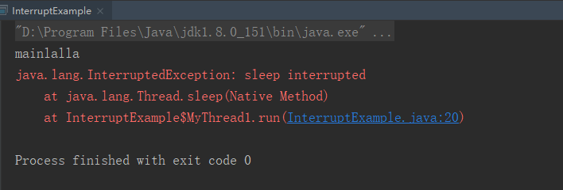
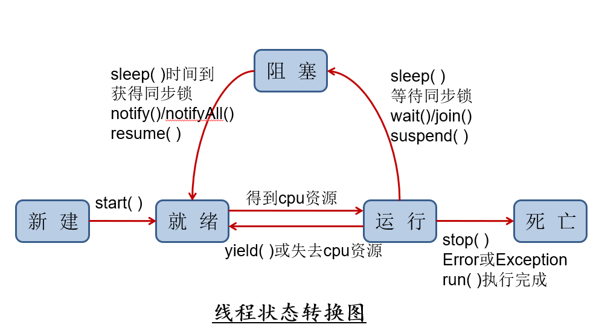

# 一、 进程与线程

## 1.程序、进程、线程

- 程序： 程序是一段静态的代码，它是应用程序执行的蓝本

- 进程：进程是指一种正在运行的程序，有自己的地址空间 

  ​			特点 ：动态性、并发性、独立性

- 线程： 进程内部的一个执行单元，它是程序中一个单一的顺序控制流程。 **如果在一个进程中同时运行了多个线程，用来完成不同的工作，则称之为多线程 **。 线程又被称为轻量级进程(lightweight process)

>  并发和并行的区别 ：
>
> 并行： 多个CPU同时执行多个任务
>
> 并发： 一个CPU（采用时间片）同时执行多个任务


## 2.进程和线程的区别


---


# 二、 使用线程

有三种使用线程的方法：

- 实现 `Runnable` 接口；

- 实现 `Callable` 接口；

- 继承 `Thread` 类。

  ​			实现 `Runnable` 和 `Callable` 接口的类只能当做一个可以在线程中运行的任务，不是真正意义上的线程，因此最后还需要通过 `Thread` 来调用。可以理解为任务是通过线程驱动从而执行的。

## 实现Runnable接口

```java
/**
 * @author Hongliang Zhu
 * @create 2020-02-13 17:02
 */
public class Demo2 implements Runnable {
    @Override
    public void run() {
        for(int i = 0; i < 20; i++){
            System.out.println("学习");
            try {
                Thread.sleep(1000);
            } catch (InterruptedException e) {
                e.printStackTrace();
            }

        }
    }

    public static void main(String[] args) throws InterruptedException {
        
        /*
        使用 Runnable 实例再创建一个 Thread 实例，然后调用 Thread 实例的 start() 方法来启动线程。
        */
        Demo2 d2 = new Demo2();
        Thread th = new Thread(d2);

        th.start(); // 启动线程

        for(int i = 0; i < 20; i++){
            System.out.println("听歌");
            Thread.sleep(1000);
        }

    }
}
```

## 继承Thread类

同样也是需要实现 `run()` 方法，因为 Thread 类也实现了 Runable 接口。当调用 `start()` 方法启动一个线程时，虚拟机会将该线程放入就绪队列中等待被调度，当一个线程被调度时会执行该线程的 `run()` 方法。

```java
public class MyThread extends Thread {
    public void run() {
        // ...
    }
}
```

```java
public static void main(String[] args) {
    MyThread mt = new MyThread();
    mt.start();
}
```

## 实现 Callable 接口

 与 Runnable 相比，Callable 可以有返回值，返回值通过 FutureTask 进行封装。 

```java
public class MyCallable implements Callable<Integer> { // 这里要通过泛型指定返回值Integer
    public Integer call() { // 注意返回值
        return 123;
    }
}
```

```java
public static void main(String[] args) throws ExecutionException, InterruptedException {
    MyCallable mc = new MyCallable();
    FutureTask<Integer> ft = new FutureTask<>(mc);
    Thread thread = new Thread(ft);
    thread.start();
    System.out.println(ft.get());
}
```

- 与实现Runnable相比， Callable功能更强大些 
- 可以有返回值，支持泛型的返回值 
- 可以抛出异常 
- 需要借助FutureTask，比如获取返回结果

## 线程池

背景： 经常创建和销毁，使用量特别大的资源，比如并发情况下的线程，对性能影响很大。

思路： 提前创建好多个线程， 放入线程池当中，使用时直接获取， 用完后放回池中。可以避免频繁创建销毁、实现重复利用。类似生活中的公共交通工具。

优势：

- 提高反应速度（减少了创建新线程的时间）
- 降低资源的消耗（重复利用线程池中的线程，必须要每次都创建）
- 便于线程的管理。
  - `corePoolSize` : 核心池的大小
  - `maximumPoolSize`: 最大线程数
  - `keepAliveTime`: 线程没有任务时最多保持多长时间后会终止。
  - ...

```java
// Java线程池的完整构造函数
public ThreadPoolExecutor(
  int corePoolSize, // 线程池长期维持的线程数，即使线程处于Idle状态，也不会回收。
  int maximumPoolSize, // 线程数的上限
  long keepAliveTime, TimeUnit unit, // 超过corePoolSize的线程的idle时长，
                                     // 超过这个时间，多余的线程会被回收。
  BlockingQueue<Runnable> workQueue, // 任务的排队队列
  ThreadFactory threadFactory, // 新线程的产生方式
  RejectedExecutionHandler handler) // 拒绝策略
```


```java
ExecutorService service = Executors.newFixedThreadPool(10);
System.out.println(service.getClass()); //  class 					            java.util.concurrent.ThreadPoolExecutor
ThreadPoolExecutor service1 = (ThreadPoolExecutor) Executors.newFixedThreadPool(10);
service1.setCorePoolSize(15);
// service1.setKeepAliveTime();
```

详见[基础线程机制](#三、 基础线程机制)

参考：  https://www.cnblogs.com/CarpenterLee/p/9558026.html 

## 实现接口 VS 继承 Thread

实现接口会更好一些，因为：

- Java 不支持多重继承，因此继承了 Thread 类就无法继承其它类，但是可以实现多个接口；
- 类可能只要求可执行就行，继承整个 Thread 类开销过大。

> 实现Runnable接口方式的多线程 
>
> 优势：可以继承其它类，多线程可共享同一个Runnable对象
>
> 劣势：编程方式稍微复杂，如果需要访问当前线程，需要调用`Thread.currentThread()`方 法


## Thread类常用方法

|             方法              |                  功能                  |
| :---------------------------: | :------------------------------------: |
| static Thread currentThread() |              得到当前线程              |
|          getName( )           |             返回线程的名称             |
|     setName (String name)     |   将线程的名称设置为由name指定的名称   |
|       int getPriority()       |          获得线程的优先级数值          |
|      void setPriority()       |          设置线程的优先级数值          |
|         void start( )         | 调用run( )方法启动线程，开始线程的执行 |
|          void run( )          |             存放线程体代码             |
|           isAlive()           |  判断线程是否还“活”着，即线程是未终止  |

---

## 一些多线程的例子

### 1. 模拟龟兔赛跑

```java
/**
 * 模拟龟兔赛跑
 * @author Hongliang Zhu
 * @create 2020-02-13 17:18
 */
public class Racer implements Runnable{
    public static String Winner;

    @Override
    public void run() {
        for(int step = 1; step <= 100; step++){
            // 模拟兔子每10步休息一次
            if(Thread.currentThread().getName().equals("兔子") && step % 10 == 0){
                try {
                    Thread.sleep(1000);
                } catch (InterruptedException e) {
                    e.printStackTrace();
                }
            }
            if(Thread.currentThread().getName().equals("乌龟")){
                try {
                    Thread.sleep(200);
                } catch (InterruptedException e) {
                    e.printStackTrace();
                }
            }
            System.out.println(Thread.currentThread().getName()+"---->"+ step);

            if(isGameOver(step)){

                break;
            }
        }
    }
    // 判断比赛是否结束
    private boolean isGameOver(int step){
        if(Winner != null){
//            System.out.println("Winner is "+ Winner);
            return true;
        }else if(step == 100){
            Winner = Thread.currentThread().getName();
            System.out.println("Winner is "+ Winner);
            return true;
        }else {
            return false;
        }
    }

    public static void main(String[] args) {
        Racer racer = new Racer();
        System.out.println(Thread.currentThread().getName()); // 主线程
        // 创建两个线程
        new Thread(racer, "兔子").start();
        new Thread(racer, "乌龟").start();

    }
}

```

使用Callable接口来创建线程的方式，模拟龟兔赛跑例子

```java
import java.util.concurrent.*;

/**
 * 创建线程的第三种方式
 * @author Hongliang Zhu
 * @create 2020-02-13 17:37
 */
public class Racer_Call implements Callable<Integer> {
    String Winner;  // 胜利者
    @Override
    public Integer call() throws Exception {
        for(int step = 1; step <= 100; step++){
            if(Thread.currentThread().getName().equals("pool-1-thread-1") && step % 10 == 0){
                Thread.sleep(200);
            }
            System.out.println(Thread.currentThread().getName() +"====>"+step);

            if(isGameOver(step)){
                return step;
            }

        }
        return null;
    }

    private boolean isGameOver(int step){
        if(Winner != null){
//            System.out.println("Winner is "+ Winner);
            return true;
        }else if(step == 100){

            Winner = Thread.currentThread().getName();
            System.out.println("Winner is "+ Winner);
            return true;
        }else {
            return false;
        }
    }


    public static void main(String[] args) throws ExecutionException, InterruptedException {
        Racer_Call rc = new Racer_Call();
        //创建执行服务
        ExecutorService ex = Executors.newFixedThreadPool(2); //  线程池中两个线程
        // 提交执行
        Future<Integer> ribbits = ex.submit(rc);
        Future<Integer> turtle = ex.submit(rc);
        // 返回结果
        int riSteps = ribbits.get();
        int tu = turtle.get();

        System.out.println("兔子的步数：" + riSteps);
        System.out.println("乌龟的步数：" + tu);


        ex.shutdownNow();// 关闭服务

    }

}

```

### 2. Web12306

```java

/**
 * @author Hongliang Zhu
 * @create 2020-02-13 17:11
 */
public class Web12306 implements Runnable{
    static  int tickets = 10; // 共享资源
    @Override
    public void run() {
        while(true){
            if(tickets <= 0){
                break;
            }
            System.out.println(Thread.currentThread().getName()+ " ---->" + tickets--);
            try {
                Thread.sleep(500);
            } catch (InterruptedException e) {
                e.printStackTrace();
            }
        }
    }
    public static void main(String[] args) {
        Web12306 w1 = new Web12306();
        Web12306 w2 = new Web12306();

        Web12306 w3 = new Web12306();

        new Thread(w1, "张三").start();
        new Thread(w2, "李四").start();
        new Thread(w3, "王五").start();
        
    }
}

```

---


# 三、 基础线程机制

## Executor

Executor 管理多个异步任务的执行，而无需程序员显式地管理线程的生命周期。这里的异步是指多个任务的执行互不干扰，不需要进行同步操作。 

> 主要有三种 Executor：
>
> - CachedThreadPool：一个任务创建一个线程；
> - FixedThreadPool：所有任务只能使用固定大小的线程；
> - SingleThreadExecutor：相当于大小为 1 的 FixedThreadPool。

```java
import java.util.concurrent.ExecutorService;
import java.util.concurrent.Executors;

/**
 * @author Hongliang Zhu
 * @create 2020-02-16 17:03
 */
public class ExecutorTest {
    public static void main(String[] args) {
        ExecutorService executorService = Executors.newCachedThreadPool(); // 个任务创建一个线程；
        for(int i = 0; i < 5; i++){
            executorService.execute(new MyRunnable());

        }
        executorService.shutdown(); // 关闭服务
    }
}

class MyRunnable implements Runnable {
    @Override
    public void run() {
        System.out.println(Thread.currentThread().getName()+ ":  executor test 。。。");
    }
}

```

> pool-1-thread-1:  executor test 。。。
> pool-1-thread-5:  executor test 。。。
> pool-1-thread-4:  executor test 。。。
> pool-1-thread-3:  executor test 。。。
> pool-1-thread-2:  executor test 。。。

## Daemon 守护进程

​		守护线程是程序运行时在**后台提供服务的线程**，不属于程序中不可或缺的部分。当所有非守护线程结束时，程序也就终止，同时会杀死所有守护线程。`main()` 属于非守护线程。非守护进程也说普通进程或者用户进程。

​		在线程启动之前使用 `setDaemon()` 方法可以将一个线程设置为守护线程。

```java
public static void main(String[] args) {
    Thread thread = new Thread(new MyRunnable());
    thread.setDaemon(true);
}
```

Java中的线程分为两类：一种是**守护线程**，一种是**用户线程**。

它们在几乎每个方面都是相同的，**唯一的区别是判断JVM何时离开。**

- 守护线程是用来服务用户线程的，通过在start()方法前调用`thread.setDaemon(true)`可以把一个用户线程变成一个守护线程。

- Java垃圾回收就是一个典型的守护线程。
- 若JVM中都是守护线程，当前JVM将退出。

## Threa.Sleep()

`Thread.sleep(millisec)` 方法会休眠当前正在执行的线程，`millisec` 单位为毫秒。

`sleep()` 可能会抛出 `InterruptedException`，因为异常不能跨线程传播回 `main()` 中，因此必须在本地进行处理。线程中抛出的其它异常也同样需要在本地进行处理。

```java
public void run() {
    try {
        Thread.sleep(3000);
    } catch (InterruptedException e) {
        e.printStackTrace();
    }
}
```

## yield() 礼让线程

对静态方法 `Thread.yield()` 的调用声明了当前线程已经完成了生命周期中最重要的部分，可以切换给其它线程来执行。该方法只是对线程调度器的一个建议，而且也只是建议具有相同优先级的其它线程可以运行。 

yield让当前正在执行线程暂停，不是阻塞线程，而是将线程转入**就绪状态** 

如果调用了yield方法之后，没有其他等待执行的线程，这个时候当前线程就会马上恢复执行！ 

```java
package ThreadStatus;

/**
 * yield 礼让线程 --> 高风亮节，主动让出CPU，重新回到就绪状态 直接
 * @author Hongliang Zhu
 * @create 2020-02-13 20:31
 */
public class yieldDemo1{

    public static void main(String[] args) {
		// lambda表达式  一个线程
        new Thread(()->{
            for (int i = 0; i < 100; i++){
                System.out.println("lambda"+ i);

            }
        }).start();

        for(int i = 0 ; i < 100; i++){
            if(i % 10 == 0){
                Thread.yield(); //  main 线程礼让
            }
            System.out.println("main:" + i);
        }

    }

}

```

---


# 四、 中断

一个线程执行完毕之后会自动结束，如果在运行过程中发生异常也会提前结束。 

## InterruptedException

​		通过调用一个线程的 `interrupt()` 来中断该线程，如果该线程处于阻塞、限期等待或者无限期等待状态，那么就会抛出 `InterruptedException`，从而提前结束该线程。但是不能中断 I/O 阻塞和 `synchronized` 锁阻塞。

​		对于以下代码，在 main() 中启动一个线程之后再中断它，由于线程中调用了 `Thread.sleep()` 方法，因此会抛出一个 `InterruptedException`，从而提前结束线程，不执行之后的语句。

```java
/**
 * @author Hongliang Zhu
 * @create 2020-02-16 17:18
 */
public class InterruptExample {

    public static void main(String[] args) {
        MyThread1 myThread1 = new MyThread1();
        myThread1.start();
        myThread1.interrupt(); //  线程中断

        System.out.println(Thread.currentThread().getName()+"lalla");
    }


    private static class MyThread1 extends Thread {
        @Override
        public void run() {
            try {
                Thread.sleep(2000);
                System.out.println("Thread run");
            } catch (InterruptedException e) {
                e.printStackTrace();
            }
        }
    }
}

```



## interrupted()

​		如果一个线程的 `run()` 方法执行一个无限循环，并且没有执行 `sleep()` 等会抛出 `InterruptedException` 的操作，那么调用线程的 `interrupt()` 方法就无法使线程提前结束。

​		但是调用 `interrupt()` 方法会设置线程的中断标记，此时调用 `interrupted()` 方法会返回 true。因此可以在循环体中使用 `interrupted()` 方法来判断线程是否处于中断状态，从而提前结束线程。

```java
/**
 * @author Hongliang Zhu
 * @create 2020-02-16 17:25
 */
public class interruptedTest {

    public static void main(String[] args) {
        Thread thread2 = new MyThread2();
        thread2.start();
        thread2.interrupt();

    }
    private static class MyThread2 extends Thread {
        @Override
        public void run() {
            while (!interrupted()) {  // interrupted()方法会设置线程的中断标记 返回true
                // ..
            }
            System.out.println("Thread end");
        }
    }
}

```

## Executor 的中断操作

调用 `Executor` 的 `shutdown()` 方法会等待线程都执行完毕之后再关闭，但是如果调用的是 `shutdownNow()` 方法，则相当于调用每个线程的 `interrupt()` 方法。 

以下使用 Lambda 创建线程，相当于创建了一个匿名内部线程。 

```java
public static void main(String[] args) {
    ExecutorService executorService = Executors.newCachedThreadPool();
    executorService.execute(() -> {
        try {
            Thread.sleep(2000);
            System.out.println("Thread run");
        } catch (InterruptedException e) {
            e.printStackTrace();
        }
    });
    executorService.shutdownNow();
    System.out.println("Main run");
}
```

> Main run
>
> java.lang.InterruptedException: sleep interrupted
> 	at java.lang.Thread.sleep(Native Method)
> 	at MyRunnable.run(ExecutorTest.java:25)
> 	at java.util.concurrent.ThreadPoolExecutor.runWorker(ThreadPoolExecutor.java:1149)
> 	at java.util.concurrent.ThreadPoolExecutor$Worker.run(ThreadPoolExecutor.java:624)
> 	at java.lang.Thread.run(Thread.java:748) 

如果只想中断 Executor 中的一个线程，可以通过使用 `submit()` 方法来提交一个线程，它会返回一个 Future<?> 对象，通过调用该对象的 `cancel(true)` 方法就可以中断线程。

```java
Future<?> future = executorService.submit(() -> {
    // ..
});
future.cancel(true);
```

---


# 五、 互斥同步

Java 提供了两种锁机制来控制多个线程对共享资源的互斥访问，第一个是 JVM 实现的 `synchronized`，而另一个是 JDK 实现的 `ReentrantLock`(可重入锁)。 

> 死锁 ： 当两个线程相互等待对方释放“锁”时就会发生死锁 
>
>  出现死锁后，不会出现异常，不会出现提示，只是所有的线程都处于阻塞状态，无法继续
>
>   多线程编程时应该注意避免死锁的发生

线程同步问题的应用场景： 多个用户同时操作一个银行账户。每次取款100元，取款前先检查余额是否足够。如果不够， 放弃取款。

> 当多个线程访问同一个数据时，容易出现线程安全问题。需要让线程同步，保证数据安全

当两个或两个以上线程访问同一资源时，需要某种方式来确保资源在某一时刻只被一个线程 使用

看一个线程不安全的例子： 去银行取钱 会出现负数

```java
package syn;

/**
 * 线程不安全： 取钱  出现负数
 * @author Hongliang Zhu
 * @create 2020-02-14 11:22
 */
public class UnSafeTest02 {
    public static void main(String[] args) {
        Account account = new Account(100, "结婚礼金");
        DrawMoney d1 = new DrawMoney(account, 70, "我");
        DrawMoney d2 = new DrawMoney(account, 80, "老婆");
        d1.start();
        d2.start();
    }
}
class Account{
    int money; // 金额
    String name; // 名称
    public Account(int money, String name) {
        this.money = money;
        this.name = name;
    }
}
class DrawMoney extends Thread{
    private Account account; // 操作的账户
    String name; // 谁取钱
    int drawingmoney; //取多少钱
    int packet; // 已经取得的钱数
    public DrawMoney(Account account,int m, String name) {
        super(name);
        this.account = account;
        this.drawingmoney = m;
    }

    @Override
    public void run() {
        if(account.money - drawingmoney < 0){
            return;
        }
        try {
            Thread.sleep(1000);
        } catch (InterruptedException e) {
            e.printStackTrace();
        }
        account.money -= drawingmoney;
        packet += drawingmoney;
        System.out.println(getName()+"口袋里有"+packet+", 账户余额为："+account.money);
    }
}

```

> 我口袋里有70, 账户余额为：-50
> 老婆口袋里有80, 账户余额为：-50

同理， 在Web12306例子中，会出现重复票的问题，以及当只剩下一张票的时候，即临界资源时，会出现负数。

线程同步的实现方案 ：

1. 同步方法
2. 同步代码块

## synchronized

1. 同步一个代码块

   ```java
   public void func() {
       synchronized (this) {
           // ...
       }
   }
   ```

它只作用于同一个对象，如果调用两个对象上的同步代码块，就不会进行同步。

对于以下代码，使用 `ExecutorService` 执行了两个线程，由于调用的是同一个对象的同步代码块，因此这两个线程会进行同步，当一个线程进入同步语句块时，另一个线程就必须等待。

```java
public class SynchronizedExample {

    public void func1() {
        synchronized (this) {
            for (int i = 0; i < 10; i++) {
                System.out.print(i + " ");
            }
        }
    }
}
public static void main(String[] args) {
    SynchronizedExample e1 = new SynchronizedExample();
    ExecutorService executorService = Executors.newCachedThreadPool();
    executorService.execute(() -> e1.func1());
    executorService.execute(() -> e1.func1());
}

```

```html
0 1 2 3 4 5 6 7 8 9 0 1 2 3 4 5 6 7 8 9
```

对于以下代码，两个线程调用了不同对象的同步代码块，因此这两个线程就不需要同步。从输出结果可以看出，两个线程交叉执行。 

```java
public static void main(String[] args) {
    // 两个不同的对象
    SynchronizedExample e1 = new SynchronizedExample();
    SynchronizedExample e2 = new SynchronizedExample();
    ExecutorService executorService = Executors.newCachedThreadPool();
    executorService.execute(() -> e1.func1());
    executorService.execute(() -> e2.func1());
}
```

```html
0 0 1 1 2 2 3 3 4 4 5 5 6 6 7 7 8 8 9 9
```

2. 同步一个方法

   ```java
   public synchronized void func () {
       // ...
   }
   ```

3. 同步一个类

   ```java
   public void func() {
       synchronized (SynchronizedExample.class) {
           // ...
       }
   }
   
   ```

   ​	作用于整个类，也就是说两个线程调用同一个类的不同对象上的这种同步语句，也会进行同步。 

   ```java
   package syn;
   
   import java.util.concurrent.ExecutorService;
   import java.util.concurrent.Executors;
   
   /**
    * @author Hongliang Zhu
    * @create 2020-02-16 19:37
    */
   public class SynchronizedExample {
   
   
       public void func2() {
           synchronized (SynchronizedExample.class) {
               for (int i = 0; i < 10; i++) {
                   System.out.print(i + " ");
               }
               System.out.println();
           }
       }
   
       public static void main(String[] args) {
           SynchronizedExample e1 = new SynchronizedExample();
           //SynchronizedExample e2 = new SynchronizedExample();
           ExecutorService executorService = Executors.newCachedThreadPool();
           executorService.execute(() -> e1.func2());
           executorService.execute(() -> e1.func2());
   
           executorService.shutdown();
   
       }
   
   }
   
   ```

> 0 1 2 3 4 5 6 7 8 9 
> 0 1 2 3 4 5 6 7 8 9 


4. 同步一个静态方法

   ```java
   package syn;
   
   import java.util.concurrent.ExecutorService;
   import java.util.concurrent.Executors;
   
   /**
    * @author Hongliang Zhu
    * @create 2020-02-16 19:37
    */
   public class SynchronizedExample {
   
   
       public static synchronized void func2() {
           try {
               Thread.sleep(500);
           } catch (InterruptedException e) {
               e.printStackTrace();
           }
   
           for (int i = 0; i < 10; i++) {
                   System.out.print(i + " ");
               }
               System.out.println();
   
       }
   
       public static void main(String[] args) {
           SynchronizedExample e1 = new SynchronizedExample();
   //        SynchronizedExample e2 = new SynchronizedExample();
           ExecutorService executorService = Executors.newCachedThreadPool();
           executorService.execute(() -> e1.func2());
           executorService.execute(() -> e1.func2());
   
           executorService.shutdown();
   
       }
   
   }
   
   ```

   作用于整个类

   > 0 1 2 3 4 5 6 7 8 9 
   > 0 1 2 3 4 5 6 7 8 9 

## ReentrantLock 可重入锁

`ReentrantLock` 是 `java.util.concurrent（J.U.C）`包中的锁。 

​		锁作为并发共享数据保证一致性的工具，大多数内置锁都是可重入的，也就是说如果某个线程试图获取一个已经由他自己持有的锁，那么，这个请求会立刻成功，并且将这个锁的计数器值加1。而当线程退出同步代码块时，计数器将会递减。当计数值等于零的时候，锁就会释放。如果没有可重入锁的支持，在第二次企图获得锁时将会进入死锁状态，可重入锁随处可见。

​	`synchronized`的就是一个可重入锁：

```java
package other;
/**
 * 可重入锁：锁可以延续使用
 * @author Hongliang Zhu
 * @create 2020-02-16 20:15
 */
public class LockTest {
    public void test(){
        // 第一次获得锁
        synchronized (this){
            while (true){
                // 第二次获得同样的锁
                synchronized (this){
                    System.out.println("可重入锁！！！");
                }
                try {
                    Thread.sleep(1000);
                } catch (InterruptedException e) {
                    e.printStackTrace();
                }
            }
        }
    }
    public static void main(String[] args) {
        new LockTest().test();
    }

}

```

> 可重入锁 ！！！ .
>
> ...

下面举个例子：使用不可重入锁会导致死锁的情况，下面的代码会造成死循环

```java
package other;

import java.security.PublicKey;

/**
 *
 * 不可重入锁： 锁不可以延续使用
 * @author Hongliang Zhu
 * @create 2020-02-16 20:21
 */
public class LockTest2 {
    Lock lock = new Lock();
    public void a(){
        lock.lock(); // 获得锁
        doSomething();
        lock.unlock(); // 锁释放
    }

    // 不可重入
    public void doSomething(){
        lock.lock();
        System.out.println("hello world");
        lock.unlock();
    }

    public static void main(String[] args) {
        LockTest2 test = new LockTest2();
        test.a();
        test.doSomething();

    }
}


class Lock{
    //是否占用
    private boolean isLocked = false;
    // 使用锁
    public synchronized void lock(){
        while (isLocked){ // 锁被占用了之后，一直要等待锁释放之后
            try {
                wait(); // 等待线程释放锁
            } catch (InterruptedException e) {
                e.printStackTrace();
            }
        }
        // 使用锁，占有锁
        isLocked = true;
    }

    // 释放锁
    public synchronized void unlock(){
        isLocked = false; //  释放
        notify(); // 唤醒其他线程使用锁
    }

}

```

改写成可重入锁：

```java
package other;
/**
 *
 * 自己实现可重入锁： 锁可以延续使用
 * @author Hongliang Zhu
 * @create 2020-02-16 20:21
 */
public class LockTest2 {
    Lock lock = new Lock();
    public void a() throws InterruptedException {
        lock.lock(); // 获得锁
        System.out.println(lock.getHoldCount());
        doSomething();
        lock.unlock(); // 锁释放
        System.out.println(lock.getHoldCount());

    }

    // 不可重入
    public void doSomething() throws InterruptedException {
        lock.lock();
        System.out.println(lock.getHoldCount());
        System.out.println("hello world");
        lock.unlock();
        System.out.println(lock.getHoldCount());

    }

    public static void main(String[] args) throws InterruptedException {
        LockTest2 test = new LockTest2();
        test.a();
//        test.doSomething();
        Thread.sleep(1000);
        System.out.println("最终后的锁计数器的值为");
        System.out.println(test.lock.getHoldCount());
    }
}


class Lock{
    //是否占用
    private boolean isLocked = false;
    // 如果是自己的持有锁，则可以立刻获得锁
    private Thread lockedBy = null; // 存储线程

    public int getHoldCount() {
        return holdCount;
    }

    // 锁的计数器
    private int holdCount = 0;

    // 使用锁
    public synchronized void lock() throws InterruptedException {
        Thread t = Thread.currentThread(); //  当前线程
        // 如果被锁了，并且持有锁的线程不等于当前线程
       while (isLocked && lockedBy != t){
            wait();
       }
       // 可以使用锁了
       isLocked = true;
       lockedBy = t;
       holdCount++; // 计数器加1；
    }

    // 释放锁
    public synchronized void unlock(){
        if(Thread.currentThread() == lockedBy){ //当前线程等于lockedBy的时候才会释放
            holdCount--; // 计数器减一
            if(holdCount == 0){
                isLocked = false; //  释放
                lockedBy = null;
                notify(); // 唤醒其他线程使用锁
            }

        }

    }

}
```

> 1
> 2
> hello world
> 1
> 0
> 最终后的锁计数器的值为
> 0

直接用`java.util.concurrent（J.U.C）`包里面的类

```java
ReentrantLock lock = new ReentrantLock();
```

将上面的代码中的 `Lock lock = new Lock();`改成上述代码就行了，方法都是一样的。可以运行

```java
public class LockExample {

    private Lock lock = new ReentrantLock();

    public void func() {
        lock.lock();
        try {
            for (int i = 0; i < 10; i++) {
                System.out.print(i + " ");
            }
        } finally {
            lock.unlock(); // 确保释放锁，从而避免发生死锁。
        }
    }
}
```

```java
public static void main(String[] args) {
    LockExample lockExample = new LockExample();
    ExecutorService executorService = Executors.newCachedThreadPool();
    executorService.execute(() -> lockExample.func());
    executorService.execute(() -> lockExample.func());
}
```

注意：如果同步代码有异常，要将unlock()写入finally语句块 

> Lock和synchronized的区别
>
> 1.Lock是显式锁（手动开启和关闭锁，别忘记关闭锁），synchronized是隐式锁
>
> 2.Lock只有代码块锁，synchronized有代码块锁和方法锁
>
> 3.使用Lock锁，JVM将花费较少的时间来调度线程，性能更好。并且具有更好的扩展性（提供更多的子类）
>
> 优先使用顺序：  Lock----同步代码块（已经进入了方法体，分配了相应资源）----同步方法（在方法体之外）

## 比较 

### 1. 锁的实现

synchronized 是 JVM 实现的，而 ReentrantLock 是 JDK 实现的。

### 2. 性能

新版本 Java 对 synchronized 进行了很多优化，例如自旋锁等，synchronized 与 ReentrantLock 大致相同。 

### 3. 等待可中断

当持有锁的线程长期不释放锁的时候，正在等待的线程可以选择放弃等待，改为处理其他事情。 

### 4. 公平锁

公平锁是指多个线程在等待同一个锁时，必须按照申请锁的时间顺序来依次获得锁。

synchronized 中的锁是非公平的，ReentrantLock 默认情况下也是非公平的，但是也可以是公平的。

### 5. 锁绑定多个条件

一个 ReentrantLock 可以同时绑定多个 `Condition` 对象 。

## 使用选择

除非需要使用 `ReentrantLock` 的高级功能，否则优先使用 `synchronized`。这是因为 `synchronized` 是 JVM 实现的一种锁机制，JVM 原生地支持它，而 `ReentrantLock` 不是所有的 JDK 版本都支持。并且使用 `synchronized` 不用担心没有释放锁而导致死锁问题，因为 JVM 会确保锁的释放。 

## 同步小实例

### 1. 快乐电影院

```java
package syn;

/**
 * 快乐影院： 实现多线程买电影票
 * @author Hongliang Zhu
 * @create 2020-02-14 17:20
 */
public class HappyCinema {
    public static void main(String[] args) {
        Cinema cinema = new Cinema("旺达", 2);
        new Thread(new Custom(cinema, 2), "张三").start();
        new Thread(new Custom(cinema, 1), "李四").start();
    }

}
class Custom implements Runnable{
    Cinema cinema; // 去哪个影院看电影
    int seats; //  要买多少张票

    public Custom(Cinema cinema, int seats) {
        this.cinema = cinema;
        this.seats = seats;
    }

    @Override
    public void run() {
        synchronized (cinema){
            if(cinema.bookTickets(seats)){
                System.out.println("购票成功，"+ Thread.currentThread().getName()+"的位置为：==>"+seats );
            }else{
                System.out.println("票不够， 购票失败");
            }
        }
    }
}

class Cinema{
    String name;
    int totalSeats; // 有多少座位

    public Cinema(String name, int totalSeats) {
        this.name = name;
        this.totalSeats = totalSeats;
    }

    public boolean bookTickets(int nums){
        System.out.println("当前电影院有"+totalSeats+"张票.");
        if(nums >  totalSeats){
            return false;
        }else{
            totalSeats-=nums;
            return true;
        }

    }

}
```

> 当前电影院有2张票.
> 购票成功，张三的位置为：==>2
> 当前电影院有0张票.
> 票不够， 购票失败

### 2.高级功能：快乐电影院-支持在线选座

```java
package syn;
import java.util.ArrayList;
import java.util.List;

/**
 * 快乐影院： 实现多线程买电影票 支持选座
 * @author Hongliang Zhu
 * @create 2020-02-14 17:20
 */
public class HappyMovie {
    public static void main(String[] args) {
        List<Integer> NumsSeats = new ArrayList<>();
        NumsSeats.add(1);
        NumsSeats.add(2);
        NumsSeats.add(3);
        NumsSeats.add(4);
        NumsSeats.add(5);
        NumsSeats.add(6);

        List<Integer> seat1 = new ArrayList<>();
        seat1.add(1);
        seat1.add(4);
        seat1.add(6);

        List<Integer> seat2 = new ArrayList<>();
        seat2.add(3);
        seat2.add(6);


        ZZCinema cinema = new ZZCinema("旺达", NumsSeats);
        new Thread(new HappyCustom(cinema, seat1), "张三").start();
        new Thread(new HappyCustom(cinema, seat2), "李四").start();
    }

}

class HappyCustom implements Runnable{
    ZZCinema cinema; // 去哪个影院看电影
    List<Integer> seats; //  要买多少张票

    public HappyCustom(ZZCinema cinema, List<Integer> seats) {
        this.cinema = cinema;
        this.seats = seats;
    }

    @Override
    public void run() {
        synchronized (cinema){
            if(cinema.bookTickets(seats)){
                System.out.println("购票成功，"+ Thread.currentThread().getName()+"的位置为：==>"+seats );
            }else{
                System.out.println("票不够，"+Thread.currentThread().getName()+" 购票失败");
            }
        }
    }
}

class ZZCinema{
    String name;
    List<Integer> totalSeats; // 有多少座位

    public ZZCinema(String name, List<Integer> totalSeats) {
        this.name = name;
        this.totalSeats = totalSeats;
    }

    public boolean bookTickets(List<Integer> seats){
        System.out.println("欢迎光临"+ this.name +"当前电影院有"+totalSeats+".");
        if(seats.size() > totalSeats.size()){
            return false;
        }
        List<Integer> copy =  new ArrayList<>();
        copy.addAll(totalSeats);
        copy.removeAll(seats);
        if(totalSeats.size() - copy.size() != seats.size()){
            return false; // 出票失败
        }
        // 成功
        totalSeats = copy;
        return true;
    }

}
```

> 欢迎光临旺达当前电影院有[1, 2, 3, 4, 5, 6].
> 购票成功，张三的位置为：==>[1, 4, 6]
> 欢迎光临旺达当前电影院有[2, 3, 5].
> 票不够，李四 购票失败

### 3. 快乐12306

注意和快乐电影院的实现方法，有所不同。

```java
package syn;

import java.util.ArrayList;
import java.util.List;

/**
 *
 * 快乐火车票
 *
 * @author Hongliang Zhu
 * @create 2020-02-14 18:53
 */
public class Happy12306 {
    public static void main(String[] args) {
        List<Integer> NumsSeats = new ArrayList<>();
        NumsSeats.add(1);
        NumsSeats.add(2);
        NumsSeats.add(3);
        NumsSeats.add(4);
        NumsSeats.add(5);
        NumsSeats.add(6);

        List<Integer> seat1 = new ArrayList<>();
        seat1.add(1);
        seat1.add(4);
        seat1.add(6);

        List<Integer> seat2 = new ArrayList<>();
        seat2.add(3);
        seat2.add(5);
        Web12306 w = new Web12306(NumsSeats, "12306赣州站");
        new Passenger(w,seat1, "张三").start();
        new Passenger(w, seat2, "李四").start();


    }

}

class Passenger extends Thread{
    List<Integer> seats; //  要买多少张票
    String name; //  名字
    public Passenger(Runnable target, List<Integer> seats, String name) { // 传入target
        super(target, name);
        this.seats = seats;
    }
}

class Web12306 implements Runnable{
    List<Integer> tickets;
    String name;
    public Web12306(List<Integer> tickets, String name) {
        this.tickets = tickets;
        this.name = name;
    }

    @Override
    public void run() {
        Passenger p =  (Passenger)Thread.currentThread();  //  当前乘客
        if(bookTickets(p.seats)){
            System.out.println("购票成功，"+ Thread.currentThread().getName()+"的位置为：==>"+p.seats );
        }else{
            System.out.println("票不够，"+Thread.currentThread().getName()+" 购票失败");
        }
    }
    public synchronized boolean bookTickets(List<Integer> seats){ // 同步方法
        System.out.println("欢迎光临"+ this.name +"当前有"+tickets+".");
        if(seats.size() > tickets.size()){
            return false;
        }
        List<Integer> copy =  new ArrayList<>();
        copy.addAll(tickets);
        copy.removeAll(seats);
        if(tickets.size() - copy.size() != seats.size()){
            return false; // 出票失败
        }
        // 成功
        tickets = copy;
        return true;
    }


}

```

> 欢迎光临12306赣州站当前有[1, 2, 3, 4, 5, 6].
> 购票成功，张三的位置为：== >[1, 4, 6]
> 欢迎光临12306赣州站当前有[2, 3, 5].
> 购票成功，李四的位置为：== >[3, 5]

## 总结

释放锁的操作：

> 1. 当前线程的同步方法、同步代码块执行结束
>
> 2. 当前线程在同步代码块、同步方法中遇到break、return终止了该代码块、该方法的继续执行。
> 3. 当前线程在同步代码块、同步方法中出现了未处理的Error或Exception，导致异常结束
> 4. 当前线程在同步代码块、同步方法中执行了锁对象的**wait()**方法，当前线程暂停，并释放锁。

不会释放锁的操作：

> 1. 线程执行同步代码块或同步方法时，程序调用Thread.sleep()、Thread.yield()方法暂停当前线程的执行
>
> 2. 线程执行同步代码块时，其他线程调用了该线程的suspend()方法将该线程挂起，该线程不会释放锁（同步监视器）。
>
>    ​			==> 应尽量避免使用suspend()和resume()来控制线程(这两个方法以及过时了!  )

----


# 七、 线程状态

一个线程只能处于一种状态，并且这里的线程状态特指 Java 虚拟机的线程状态，不能反映线程在特定操作系统下的状态 。

## 新建（NEW）

创建后尚未启动。

## 可运行（RUNABLE）

正在 Java 虚拟机中运行。但是在操作系统层面，它可能处于运行状态，也可能等待资源调度（例如处理器资源），资源调度完成就进入运行状态。所以该状态的可运行是指可以被运行，具体有没有运行要看底层操作系统的资源调度。 

## 阻塞（BLOCKED）

请求获取 `monitor lock` （监视器）从而进入 `synchronized` 函数或者代码块，但是其它线程已经占用了该 `monitor lock`，所以处于阻塞状态。要结束该状态进入从而 `RUNABLE` 需要其他线程释放 `monitor lock`。 

## 无限期等待（WAITING）

等待其它线程显式地唤醒。 

阻塞和等待的区别在于，阻塞是被动的，它是在等待获取 `monitor lock`。而等待是主动的，通过调用 `Object.wait()` 等方法进入。 

|                  进入方法                  |               退出方法               |
| :----------------------------------------: | :----------------------------------: |
| 没有设置 Timeout 参数的 Object.wait() 方法 | Object.notify() / Object.notifyAll() |
| 没有设置 Timeout 参数的 Thread.join() 方法 |         被调用的线程执行完毕         |
|          LockSupport.park() 方法           |      LockSupport.unpark(Thread)      |

## 限期等待（TIME_WAITING)

无需等待其它线程显式地唤醒，在一定时间之后会被系统自动唤醒。 

|                 进入方法                 |                    退出方法                     |
| :--------------------------------------: | :---------------------------------------------: |
|           Thread.sleep() 方法            |                    时间结束                     |
| 设置了 Timeout 参数的 Object.wait() 方法 | 时间结束 / Object.notify() / Object.notifyAll() |
| 设置了 Timeout 参数的 Thread.join() 方法 |         时间结束 / 被调用的线程执行完毕         |
|       LockSupport.parkNanos() 方法       |           LockSupport.unpark(Thread)            |
|       LockSupport.parkUntil() 方法       |           LockSupport.unpark(Thread)            |

调用 `Thread.sleep()` 方法使线程进入限期等待状态时，常常用“使一个线程睡眠”进行描述。调用 `Object.wait()` 方法使线程进入限期等待或者无限期等待时，常常用“挂起一个线程”进行描述。睡眠和挂起是用来描述行为，而阻塞和等待用来描述状态。 

## 死亡（TERMINATED）

可以是线程结束任务之后自己结束，或者产生了异常而结束。 

[Java SE 9 Enum Thread.State](https://docs.oracle.com/javase/9/docs/api/java/lang/Thread.State.html) 

-----


# 八、线程的生命周期



----


# 九、线程之间的协作/通信

当多个线程可以一起工作去解决某个问题时，如果某些部分必须在其它部分之前完成，那么就需要对线程进行协调。 

## Join-插队

在线程中调用另一个线程的 join() 方法，会将当前线程挂起，而不是忙等待，直到目标线程结束。

```java
package ThreadStatus;

/**
 * join: 合并线程， 插队线程，注意谁被阻塞了
 * @author Hongliang Zhu
 * @create 2020-02-13 20:55
 */
public class BlockedJoin implements Runnable{

    @Override
    public void run() {
        for(int i = 0; i< 100; i++){
            System.out.println("线程"+i);
        }
    }

    public static void main(String[] args) throws InterruptedException {

        BlockedJoin t = new BlockedJoin();
        Thread th = new Thread(t);
        th.start();
        for(int i = 0; i < 60;  i++){
            if(  i == 40){
                th.join();  // 必须当th线程执行完之后，main线程才会执行  main被阻塞！
            }
            System.out.println("main:"+i);
        }


    }

}

```

## wait() 与 notify() **和** notifyAll()

它们都属于 `Object` 的一部分，而不属于 `Thread`。

`Java.lang.Object`提供的这三个方法只有在`synchronized`方法或`synchronized`代码块中才能使用，否则会报`java.lang.IllegalMonitorStateException`异常。 

### 1. wait() 方法

​		wait()令当前线程挂起并放弃CPU、同步资源，使别的线程可访问并修改共享资源，而当前线程排队等候再次对资源的访问。调用 wait() 使得线程等待某个条件满足，线程在等待时会被挂起，当其他线程的运行使得这个条件满足时，其它线程会调用 `notify()` 或者 `notifyAll()` 来唤醒挂起的线程。 

​		**使用 wait() 挂起期间，线程会释放锁**。这是因为，如果没有释放锁，那么其它线程就无法进入对象的同步方法或者同步控制块中，那么就无法执行 `notify()` 或者 `notifyAll()` 来唤醒挂起的线程，造成死锁。 

```java
public class WaitNotifyExample {

    public synchronized void before() {
        System.out.println("before");
        notifyAll();
    }

    public synchronized void after() {
        try {
            wait();
        } catch (InterruptedException e) {
            e.printStackTrace();
        }
        System.out.println("after");
    }
}
```

```java
public static void main(String[] args) {
    ExecutorService executorService = Executors.newCachedThreadPool();
    WaitNotifyExample example = new WaitNotifyExample();
    executorService.execute(() -> example.after());
    executorService.execute(() -> example.before());
}
```

```html
before
after
```

**wait() 和 sleep() 的区别**

- `wait()` 是 `Object` 的方法，而 `sleep()` 是 `Thread` 的静态方法；
- `wait()` 会释放锁，`sleep()` 不会。

### 2. notify()方法

​		唤醒正在排队等待同步资源的线程中优先级最高者结束等待。

### 3. notifyAll() 方法

​		唤醒正在排队等待资源的所有线程结束等待 。 

## await() signal() signalAll()

​		`java.util.concurrent` 类库中提供了 `Condition` 类来实现线程之间的协调，可以在 `Condition` 上调用 `await()` 方法使线程等待，其它线程调用 `signal()` 或 `signalAll()` 方法唤醒等待的线程。 

​		相比于 `wait()` 这种等待方式，`await()` 可以指定等待的条件，因此更加灵活。

​		使用 `Lock` 来获取一个 `Condition` 对象。

```java
package cooperation;
import java.util.concurrent.ExecutorService;
import java.util.concurrent.Executors;
import java.util.concurrent.locks.Condition;
import java.util.concurrent.locks.Lock;
import java.util.concurrent.locks.ReentrantLock;
/**
 * @author Hongliang Zhu
 * @create 2020-02-16 21:55
 */
public class AwaitSignalExample {

    private Lock lock = new ReentrantLock();
    private Condition condition = lock.newCondition();

    public void before() {
        lock.lock();
        try {
            System.out.println("before");
            condition.signalAll();
        } finally {
            lock.unlock();
        }
    }

    public void after() {
        lock.lock();
        try {
            condition.await();
            System.out.println("after");
        } catch (InterruptedException e) {
            e.printStackTrace();
        } finally {
            lock.unlock();
        }
    }

    public static void main(String[] args) {
        ExecutorService executorService = Executors.newCachedThreadPool();
        AwaitSignalExample example = new AwaitSignalExample();
        executorService.execute(() -> example.after());
        executorService.execute(() -> example.before());
    }
}
```

```html
before
after
```


## 线程通信：生产者消费者模式

​		生产者(Productor)将产品交给店员(Clerk)，而消费者(Customer)从店员处取走产品，店员一次只能持有固定数量的产品(比如:20），如果生产者试图生产更多的产品，店员会叫生产者停一下，如果店中有空位放产品了再通知生产者继续生产；如果店中没有产品了，店员会告诉消费者等一下，如果店中有产品了再通知消费者来取走产品。

这里可能出现两个问题：

> 生产者比消费者快时，消费者会漏掉一些数据没有取到。
>
> 消费者比生产者快时，消费者会取相同的数据。

以一个例子来理解：生产馒头

```java
package cooperation;

/**
 *
 * 生产者和消费者问题： 管程法
 *
 * @author Hongliang Zhu
 * @create 2020-02-15 12:21
 */
public class CoTest {

    public static void main(String[] args) {
        Buffer b = new Buffer();  // 缓存区
        Product p = new Product(b);
        Consumer c = new Consumer(b);
        p.start();
        c.start();
    }

}

// 生产者
class Product  extends Thread{
    Buffer buffer;
    int i = 1;

    public Product(Buffer buffer) {
        this.buffer = buffer;
    }

    @Override
    public void run() {
        for(int i = 0; i < 30 ; i++){
            buffer.push(new ManTou(i));
            System.out.println("生产者生产了"+i+"号馒头， 当前共有馒头"+ buffer.getNum() +" 个");
            try {
                Thread.sleep(200);
            } catch (InterruptedException e) {
                e.printStackTrace();
            }
        }
    }
}

// 缓存区
class Buffer{
    private static int max_szie = 10; // 大小

    public static int getNum() {
        return num;
    }

    private static int  num;
    private ManTou[] man = new ManTou[max_szie];

    // 生产
    public synchronized void push( ManTou manTou){
        if(num >= max_szie){ // 不用生产了
            try {
                this.wait();  // 缓存区满了， 生产者等待消费者消费，当消费者唤醒生产者时继续生产
            } catch (InterruptedException e) {
                e.printStackTrace();
            }

        }else {
            man[num] = manTou;
            num++;
            this.notifyAll(); // 唤醒消费者来消费了
        }
    }

    // 取走馒头
    public synchronized ManTou pop(){
        if(num <= 0){ // 没有馒头
            try {
                this.wait();
            } catch (InterruptedException e) {
                e.printStackTrace();
            }

        }
        num--;
        this.notifyAll(); // 唤醒生产者该生产了
        return man[num];

    }

}

// 消费者
class Consumer extends Thread{

    Buffer buffer;

    public Consumer(Buffer buffer) {
        this.buffer = buffer;
    }

    public void run(){
        while (true){
            if(buffer.getNum() == 0)    break;
            try {
                Thread.sleep(500);
            } catch (InterruptedException e) {
                e.printStackTrace();
            }
            ManTou m = buffer.pop();
            System.out.println("消费者消费了一个"+m.getId()+"馒头， 当前共有馒头"+ buffer.getNum() +" 个");
        }
    }
}
// 馒头
class ManTou{
    public int getId() {
        return id;
    }

    private int id; // 馒头的编号
    public ManTou(int id) {
        this.id = id;
    }
}

```

> 生产者生产了0号馒头， 当前共有馒头1 个
> 生产者生产了1号馒头， 当前共有馒头2 个
> 生产者生产了2号馒头， 当前共有馒头3 个
> 消费者消费了一个2馒头， 当前共有馒头2 个
> 生产者生产了3号馒头， 当前共有馒头3 个
> 生产者生产了4号馒头， 当前共有馒头4 个
> 消费者消费了一个4馒头， 当前共有馒头3 个
> 生产者生产了5号馒头， 当前共有馒头4 个
> 生产者生产了6号馒头， 当前共有馒头5 个
> 生产者生产了7号馒头， 当前共有馒头6 个
> 消费者消费了一个7馒头， 当前共有馒头5 个
> 生产者生产了8号馒头， 当前共有馒头6 个
> 生产者生产了9号馒头， 当前共有馒头7 个
> 消费者消费了一个9馒头， 当前共有馒头6 个
> 生产者生产了10号馒头， 当前共有馒头7 个
> 生产者生产了11号馒头， 当前共有馒头8 个
> 生产者生产了12号馒头， 当前共有馒头9 个
>
> ...

# 参考

1.  https://cyc2018.github.io/CS-Notes 
2.  BruceEckel. Java 编程思想: 第 4 版 [M]. 机械工业出版社, 2007. 
3.  周志明. 深入理解 Java 虚拟机 [M]. 机械工业出版社, 2011. 

