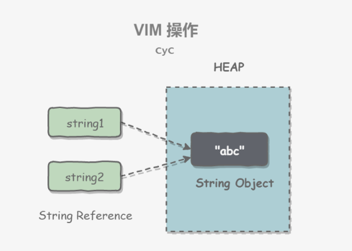

# String类

String 被声明为 final，因此它不可被继承。(Integer 等包装类也不能被继承）

在 Java 8 中，String 内部使用 char 数组存储数据。

```java
public final class String
    implements java.io.Serializable, Comparable<String>, CharSequence {
    /** The value is used for character storage. */
    private final char value[];
}
```

在 Java 9 之后，String 类的实现改用 byte 数组存储字符串，同时使用 `coder` 来标识使用了哪种编码 。

```java
public final class String
    implements java.io.Serializable, Comparable<String>, CharSequence {
    /** The value is used for character storage. */
    private final byte[] value;

    /** The identifier of the encoding used to encode the bytes in {@code value}. */
    private final byte coder;
}
```

value 数组被声明为 `final`，这意味着 value 数组初始化之后就不能再引用其它数组。并且 String 内部没有改变 value 数组的方法，因此可以保证 String 不可变。 

---


# 不可变的好处

## 1. 可以缓存hash值

因为 String 的 hash 值经常被使用，例如 String 用做 HashMap 的 key。不可变的特性可以使得 hash 值也不可变，因此只需要进行一次计算。 

## 2. String Pool 的需要

如果一个 String 对象已经被创建过了，那么就会从 String Pool 中取得引用。只有 String 是不可变的，才可能使用 String Pool。 



## 3. 安全性

String 经常作为参数，String 不可变性可以保证参数不可变。例如在作为网络连接参数的情况下如果 String 是可变的，那么在网络连接过程中，String 被改变，改变 String 的那一方以为现在连接的是其它主机，而实际情况却不一定是。 

## 4. 线程安全

String 不可变性天生具备线程安全，可以在多个线程中安全地使用。 

 [Program Creek : Why String is immutable in Java?](https://www.programcreek.com/2013/04/why-string-is-immutable-in-java/) 

---


#  String, StringBuffer and StringBuilder

## 1. 可变性

- String 不可变  如果您尝试更改其值，则会创建另一个对象 。地址改变
- StringBuffer 和 StringBuilder 可变

## 2. 线程安全

- String 不可变，因此是线程安全的
- StringBuilder 不是线程安全的  1.5之后
- StringBuffer 是线程安全的，内部使用 synchronized 进行同步

[StackOverflow : String, StringBuffer, and StringBuilder](https://stackoverflow.com/questions/2971315/string-stringbuffer-and-stringbuilder)

StringBuffer和StringBuilder的区别在于，StringBuffer是线程安全的。因此，当应用程序需要在单个线程中运行时，最好使用StringBuilder。StringBuilder比StringBuffer更高效。 

## 3. 使用场景

1. 如果你的字符串不会改变，那就使用string类，因为string对象是不可变的。 
2.  如果您的字符串可以更改（例如：字符串构造中的大量逻辑和操作）并且只能从单个线程访问，则使用StringBuilder就足够了。 
3.  如果您的字符串可以更改，并且可以从多个线程访问，请使用StringBuffer，因为StringBuffer是同步的，所以具有线程安全性。 

## 4. java.lang.StringBuffer

代表**可变的字符序列**，可以对字符串内容进行增删。  

很多方法与String相同，但StringBuffer是可变长度的  .

StringBuffer是一个容器。

StringBuffer类有三个构造器:

> 1.StringBuffer() 初始容量为16的字符串缓冲区
>
> 2.StringBuffer(int **size**)构造指定容量的字符串缓冲区
>
> 3.StringBuffer(String  **str**)将内容初始化为指定字符串内容

StringBuffer类的常用方法:

> StringBuffer **append**(String s),  StringBuffer append(int n) , 
>
> StringBuffer append(Object o) , StringBuffer append(char n),
>
> StringBuffer append(long n), StringBuffer append(boolean n),
>
> StringBuffer **insert**(int index, String str) 
>
> public StringBuffer **reverse**() 
>
> StringBuffer **delete**(int startIndex, int endIndex) 
>
> public char **charAt**(int n )
>
> public void **setCharAt**(int n ,char ch)
>
> StringBuffer **replace**( int startIndex ,int endIndex, String str) 
>
> public int **indexOf**(String str)
>
> public String **substring**(int start,int end)
>
> public int **length**()

---


# String Pool

字符串常量池（`String Pool`）保存着所有**字符串字面量**（`literal strings`），这些字面量在编译时期就确定。不仅如此，还可以使用 String 的 `intern()` 方法在运行过程将字符串添加到 String Pool 中。

当一个字符串调用 `intern()` 方法时，如果 `String Pool` 中已经存在一个字符串和该字符串值相等（使用 `equals()` 方法进行确定），那么就会返回 `String Pool` 中字符串的引用；否则，就会在 String Pool 中添加一个新的字符串，并返回这个新字符串的引用。

下面示例中，s1 和 s2 采用 `new String()` 的方式新建了两个不同字符串，而 s3 和 s4 是通过 `s1.intern()` 方法取得同一个字符串引用。`intern()` 首先把 s1 引用的字符串放到 `String Pool` 中，然后返回这个字符串引用。因此 s3 和 s4 引用的是同一个字符串。

```java
String s1 = new String("aaa");
String s2 = new String("aaa");
System.out.println(s1 == s2);           // false
String s3 = s1.intern();
String s4 = s1.intern();
System.out.println(s3 == s4);           // true
```

 如果是采用 "bbb" 这种字面量的形式创建字符串，会自动地将字符串放入 `String Pool` 中。 

```java
String s5 = "bbb";
String s6 = "bbb";
System.out.println(s5 == s6);  // true
```

在 Java 7 之前，`String Pool` 被放在**运行时常量池**中，它属于永久代。而在 Java 7，`String Pool` 被移到堆中。这是因为永久代的空间有限，在大量使用字符串的场景下会导致 `OutOfMemoryError` 错误。

- [StackOverflow : What is String interning?](https://stackoverflow.com/questions/10578984/what-is-string-interning)
- [深入解析 String#intern](https://tech.meituan.com/in_depth_understanding_string_intern.html)

直接使用双引号声明出来的`String`对象会直接存储在常量池中。

如果不是用双引号声明的`String`对象，可以使用`String`提供的`intern`方法。intern 方法会从字符串常量池中查询当前字符串是否存在，若不存在就会将当前字符串放入常量池中。

---


# new String("abc")

使用这种方式一共会创建**两个**字符串对象（前提是 `String Pool` 中还没有 `"abc"` 字符串对象）。

- `"abc"` 属于字符串字面量，因此编译时期会在 `String Pool` 中创建一个字符串对象，指向这个 "abc" 字符串字面量；
- 而使用 new 的方式会在堆中创建一个字符串对象。

创建一个测试类，其 main 方法中使用这种方式来创建字符串对象。

```java
public class NewStringTest {
    public static void main(String[] args) {
        String s = new String("abc");
    }
}
```

使用 `javap -verbose` 进行反编译，得到以下内容：

```java
// ...
Constant pool:
// ...
   #2 = Class              #18            // java/lang/String
   #3 = String             #19            // abc
// ...
  #18 = Utf8               java/lang/String
  #19 = Utf8               abc
// ...

  public static void main(java.lang.String[]);
    descriptor: ([Ljava/lang/String;)V
    flags: ACC_PUBLIC, ACC_STATIC
    Code:
      stack=3, locals=2, args_size=1
         0: new           #2                  // class java/lang/String
         3: dup
         4: ldc           #3                  // String abc
         6: invokespecial #4                  // Method java/lang/String."<init>":(Ljava/lang/String;)V
         9: astore_1
// ...
```

在 `Constant Pool` 中，#19 存储这字符串字面量 "abc"，#3 是 `String Pool` 的字符串对象，它指向 #19 这个字符串字面量。在 `main` 方法中，0: 行使用 new #2 在堆中创建一个字符串对象，并且使用 ldc #3 将 String Pool 中的字符串对象作为 String 构造函数的参数。

以下是 String 构造函数的源码，可以看到，在将一个字符串对象作为另一个字符串对象的构造函数参数时，并不会完全复制 value 数组内容，而是都会指向同一个 value 数组。

```java
public String(String original) {
    this.value = original.value;
    this.hash = original.hash;
}
```

# 面试题

```java
package string;

/**
 * @author Hongliang Zhu
 * @create 2020-02-23 13:12
 */
public class TestString {

    public static void main(String[] args) {
        String s1 = "abc"; // 字面量
        String s2 = "def";
        String s3 = "abc" + "def"; //  字面量
        String s4 = s1 + "def";
        String s5 = "abc" + s2;
        String s6 = s1 + s2;
        String s7 = "abcdef";

        System.out.println(s3 == s7); // true
        System.out.println(s3 == s4); //  fasle
        System.out.println(s3 == s5); //  fasle
        System.out.println(s3 == s6); //  false
        System.out.println(s5 == s6);  //  false
        String s8 = s5.intern();
        System.out.println(s3 == s8); //true
        System.out.println(s3 == s5); // fasle

    }
}
```

**结论：** 

> 1.常量与常量的拼接结果在常量池中， 且常量池中不会存在相同的常量
>
> 2.只要其中有一个是变量， 结果就在堆中， 会重新new一个对象在堆中。 比如上面的s4,s5,s6
>
> 3.如果拼接的结果调用`intern`方法，***返回值***就在常量池中。

下列程序运行的结果：

```java
package string;

/**
 * @author Hongliang Zhu
 * @create 2020-02-23 21:03
 */
public class test1 {
    String str = new String("good");
    char[] ch = { 't', 'e', 's', 't' };

    public void change(String str, char ch[]) {
        str = "test ok";
        ch[0] = 'g';
    }

    public static void main(String[] args) {
        test1 ex = new test1();
        ex.change(ex.str, ex.ch); // good
        System.out.print(ex.str + " and "); //  good and
        System.out.println(ex.ch); // gest
    }
}
// good and gest
```

---

```java
 String s1 = "123";
 String s2 = "123";  // 字面量，在常量池中
 String s3 = new String("123");
 String s4 = new String("123"); //  在堆中创建
 System.out.println(s1.equals(s2));  // true
 System.out.println(s1 == s2); //  true
 System.out.println(s3.equals(s4)); // true
 System.out.println(s3 == s4);  // false
 System.out.println(s1.equals(s3)); // true
 System.out.println(s1 == s3); // false
```

下面的输出是什么：

```java
String str = null;
StringBuffer sb = new StringBuffer();
sb.append(str);

System.out.println(sb.length());// 4

System.out.println(sb);//  “null”   实际上是存储的一个"null"字符串

StringBuffer sb1 = new StringBuffer(str);  // 抛出空指针异常
System.out.println(sb1);//

```

解释：

```java
private AbstractStringBuilder appendNull() {
        ensureCapacityInternal(count + 4);  //  如果添加的是null，那么会加上4个字节
        int count = this.count;
        byte[] val = this.value;
        if (isLatin1()) {
            val[count++] = 'n';
            val[count++] = 'u';
            val[count++] = 'l';
            val[count++] = 'l';
        } else {
            count = StringUTF16.putCharsAt(val, count, 'n', 'u', 'l', 'l');
        }
        this.count = count;
        return this;
    }

//构造函数的形式去构造字符串
public StringBuffer(String str) {
        super(str.length() + 16);  // str.length() 如果str数null，根本没有这个方法，所以会报空指针异常
        append(str);
    }
```


---


# String字符串对象操作

> public int length()  返回字符串的长度
>
> public char charAt(int index)  指定下标的字符
>
> public boolean equals(Object anObject)
>
> public int compareTo(String anotherString)  比较
>
> public int indexOf(String s) 指定字符或者字符串的下标 第一次出现
>
> public int indexOf(String s ,int startpoint)
>
> public int lastIndexOf(String s)  
>
> public int lastIndexOf(String s ,int startpoint)
>
> public boolean startsWith(String prefix)  是否以指定字符串开始的
>
> public boolean endsWith(String suffix) 是否以指定字符串结束的
>
> public boolean regionMatches(int firstStart,String other,int otherStart ,int length)


# String字符串对象修改

public String substring(int startpoint)  

public String substring(int start,int end)  //子字符串  包头不包尾  （左闭右开）

pubic String replace(char oldChar,char newChar)

public String replaceAll(String old,String new)

public String trim()  去掉字符串首部和尾部的空格

public String concat(String str)  等价于 “ + ”

public boolean contains(CharSequence s)  是否 包含指定的字符串

public String[] split(String regex)  根据给定正则表达式的匹配拆分此字符串。

---


# 源码分析

## 构造字符串

对于String来说：内部创建一个字符数组（JDK8），JDK9之后是一个字节数组

```java
 String str1 = new String(); // new char[]{};
String str2 = new Strign("abc"); // new cahr[] {'a', 'b', 'c'}
```

对于StringBuffer来说：

```java
StringBuffer sb1 = new StringBuffer(); 
//char[] value = new char[16], 相当于在底层创建了一个长度为16 的数组。
StringBuffer sb2 = new StringBuffer("123"); // 
```

```java
// jdk1.8源码：
/**
     * Constructs a string buffer with no characters in it 			and an initial capacity of 16 characters.
     */
    @HotSpotIntrinsicCandidate
    public StringBuffer() {
        super(16);
    }

  public StringBuffer(String str) {
        super(str.length() + 16);
        append(str);
    }

```

```java
sb1.append('a'); // value[0] = 'a';
```

## StringBuffer 中的 append + 扩容

```java
    public AbstractStringBuilder append(String str) {
        if (str == null) {
            return appendNull();
        }
        int len = str.length();
        ensureCapacityInternal(count + len); //  扩容
        putStringAt(count, str);
        count += len;
        return this;  // 方法链原理
    }

	// jdk8
    private void ensureCapacityInternal(int minimumCapacity) {
        // overflow-conscious code
        if (minimumCapacity - value.length > 0) {
            //将原来的数组拷贝到一个新数组中，并且扩容
            value = Arrays.copyOf(value,
                    newCapacity(minimumCapacity));
        }
    }
	// jdk8
    private int newCapacity(int minCapacity) {
        // overflow-conscious code
        int newCapacity = (value.length << 1) + 2; //扩容为原来的两倍 + 2。
        //如果新的容量比最小容量都小，那么这个新的容量就为最小容量
        if (newCapacity - minCapacity < 0) {
            newCapacity = minCapacity;
        }
        // 如果新的容量大于最大的容量
        return (newCapacity <= 0 || MAX_ARRAY_SIZE - newCapacity < 0)
            ? hugeCapacity(minCapacity)
            : newCapacity;
    }


```

jdk12：

```java

	// jdk12
    private void ensureCapacityInternal(int minimumCapacity) {
        // overflow-conscious code
        int oldCapacity = value.length >> coder;
        if (minimumCapacity - oldCapacity > 0) {
            value = Arrays.copyOf(value,
                    newCapacity(minimumCapacity) << coder);
        }
    }
// jdk12
 private int newCapacity(int minCapacity) {
        // overflow-conscious code
        int oldCapacity = value.length >> coder;
        int newCapacity = (oldCapacity << 1) + 2;
        if (newCapacity - minCapacity < 0) {
            newCapacity = minCapacity;
        }
        int SAFE_BOUND = MAX_ARRAY_SIZE >> coder;
        return (newCapacity <= 0 || SAFE_BOUND - newCapacity < 0)
            ? hugeCapacity(minCapacity)
            : newCapacity;
    }

```

如果添加的数据在底层数组盛不下了，那就需要扩容数组。默认情况下，扩容为原来的2倍+2， 同时将原有的数组中的元素复制到新数组当中。

**建议：** 在实际开发中应该避免频繁的扩容，推荐使用构造函数：

```java
 public StringBuffer(int capacity) {
        super(capacity);
    }

  // 或者
 public StringBuilder(int capacity) {
        super(capacity);
    }
```

指定容量。

同理，StringBuilder底层的append和扩容也是和StringBuffer一样的。

---


# StringBuffer和StringBuilder的额外方法

以StringBuffer为例：

> StringBuffer append() ;
>
> StringBuffer delete(int start, int end) ; //  删除指定位置的内容
>
> StringBuffer insert(int offset,, xxx) ; // 在指定位置插入字符串
>
> String replace(int start, int end, String str);
>
> StringBuffer reverse();  反转字符串

---


# 效率测试

```java
  @Test
    public void efficientTest(){
        String text = "";
        long startTime = 0L;
        long endTime = 0L;
        StringBuffer buffer = new StringBuffer("");
        StringBuilder builder = new StringBuilder("");
        startTime = System.currentTimeMillis();
        for(int i = 0;i<20000;i++){
            buffer.append(String.valueOf(i));}
        endTime = System.currentTimeMillis();
        System.out.println("StringBuffer的执行时间："+(endTime-startTime));
        startTime = System.currentTimeMillis();
        for(int i = 0;i<20000;i++){
            builder.append(String.valueOf(i));}
        endTime = System.currentTimeMillis();
        System.out.println("StringBuilder的执行时间："+(endTime-startTime));
        startTime = System.currentTimeMillis();
        for(int i = 0;i<20000;i++){
            text = text + i;}
        endTime = System.currentTimeMillis();
        System.out.println("String的执行时间："+(endTime-startTime));
    }
```

在JDK8中测试：（ms）

> StringBuffer的执行时间：11
> StringBuilder的执行时间：4
> String的执行时间：1075

在JDk12:

> StringBuffer的执行时间：6
> StringBuilder的执行时间：2
> String的执行时间：545

# 参考

1.  https://cyc2018.github.io/CS-Notes/ 
2.  https://tech.meituan.com/2014/03/06/in-depth-understanding-string-intern.html 