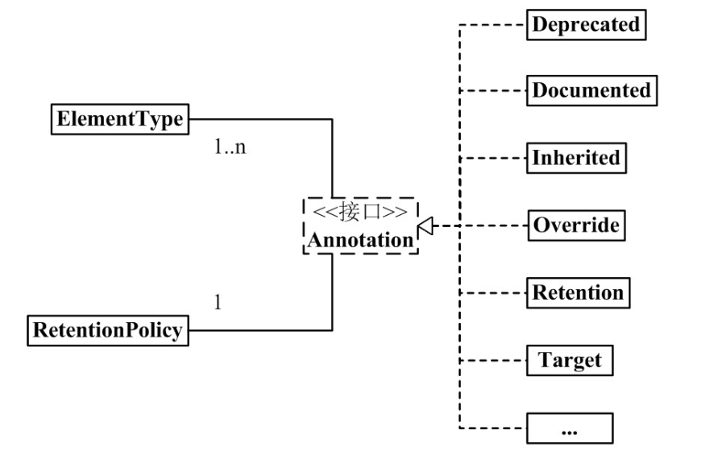
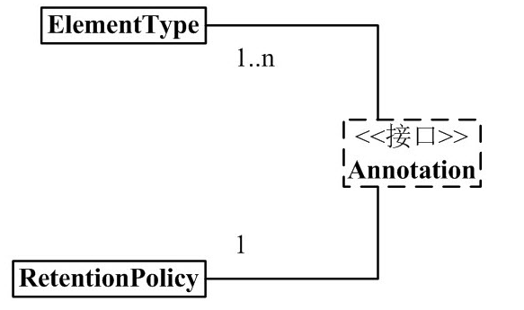

# 注解Annotation

从 JDK 5.0 开始, Java 增加了对元数据(`MetaData`) 的支持, 也就是 `Annotation`(注解)。

`Annotation` 其实就是代码里的**特殊标记**, 这些标记可以在**编译, 类加载, 运行时**被读取, 并执行相应的处理。通过使用 `Annotation`, 程序员可以在不改变原有逻辑的情况下, 在源文件中嵌入一些补充信息。

`Annotation` 可以像修饰符一样被使用, 可用于修饰包,  类,  构造器,  方法,  成员变量,  参数，局部变量的声明 , 这些信息被保存在 `Annotation` 的 `“name=value”` 对中。我们可以通过反射机制编程实现对这些元数据的访问。

`Annotation` 能被用来为程序元素(类, 方法, 成员变量等) 设置元数据。

在`Java SE`中，注解的使用目的比较简单，例如标记过时的方法，忽略警告等。 在`Java EE / Android`中注解占据了更重要的角色，例如用来配置应用程序的任何切面，代替`JavaEE`旧版中所遗留的繁冗代码和XML配置。

未来的开发模式都是基于注解的，JPA是基于注解的，`Spring2.5`以上都是基于注解的，`Hibernate3.x`以后也都是基于注解的，`Struts2`也有一部分是基于注解的了。 注解是一种趋势， 一定程度上可以说：

> ​	 **框架 = 注解  + 反射 + 设计模式。**

---


# Annotation 架构



(1). 1 个 `Annotation` 和 1 个 `RetentionPolicy` 关联。 可以理解为：每1个`Annotation`对象，都会有唯一的`RetentionPolicy`属性。 

(2).  1 个 `Annotation` 和 1~n 个 `ElementType` 关联。 可以理解为：对于每 1 个 `Annotation` 对象，可以有若干个 `ElementType` 属性。 

(3).  `Annotation` 有许多实现类，包括：`Deprecated`, `Documented`, `Inherited`, `Override` 等等。 `Annotation` 的每一个实现类，都 "和 1 个 `RetentionPolicy` 关联" 并且 " 和 1~n 个 `ElementType` 关联"。 

---

## Annotation 组成部分



Java`Annotation` 的组成中有 3 个非常重要的主干类。它们分别是： 

### **Annotation.java：**

```java
package java.lang.annotation;
public interface Annotation {

    boolean equals(Object obj);

    int hashCode();

    String toString();

    Class<? extends Annotation> annotationType();
}
```

**Annotation 就是个接口。** 

> 每 1 个 `Annotation`" 都与 "1 个 `RetentionPolicy`" 关联，并且与 "1～n 个 `ElementType`" 关联。可以通俗的理解为：每 1 个 `Annotation` 对象，都会有唯一的 `RetentionPolicy` 属性；至于 `ElementType` 属性，则有 1~n 个。 

---

### **ElementType.java：**

```java
package java.lang.annotation;

public enum ElementType {
    TYPE,               /* 类、接口（包括注释类型）或枚举声明  */

    FIELD,              /* 字段声明（包括枚举常量）  */

    METHOD,             /* 方法声明  */

    PARAMETER,          /* 参数声明  */

    CONSTRUCTOR,        /* 构造方法声明  */

    LOCAL_VARIABLE,     /* 局部变量声明  */

    ANNOTATION_TYPE,    /* 注释类型声明  */

    PACKAGE             /* 包声明  */
}
```

ElementType 是 `Enum` 枚举类型，它用来指定 `Annotation` 的类型。

每 1 个 `Annotation`" 都与 "1～n 个 `ElementType`" 关联。当 `Annotation` 与某个 `ElementType` 关联时，就意味着：`Annotation`有了某种用途。例如，若一个 `Annotation` 对象是 `METHOD` 类型，则该 `Annotation` 只能用来修饰方法。 

---

### **RetentionPolicy.java：**

```java
package java.lang.annotation;
public enum RetentionPolicy {
    SOURCE,            /* Annotation信息仅存在于编译器处理期间，编译器处理完之后就没有该Annotation信息了  */

    CLASS,             /* 编译器将Annotation存储于类对应的.class文件中。默认行为  */

    RUNTIME            /* 编译器将Annotation存储于class文件中，并且可由JVM读入 */
}
```

**RetentionPolicy 是 `Enum` 枚举类型，它用来指定 `Annotation` 的策略。通俗点说，就是不同 `RetentionPolicy` 类型的 `Annotation` 的作用域不同。** 

每 1 个 `Annotation` 都与 1 个 `RetentionPolicy`关联 ：

>  a)   若 `Annotation` 的类型为 `SOURCE`，则意味着：`Annotation` 仅存在于**编译器处理期间**，编译器处理完之后，该 `Annotation` 就没用了。 例如，" @Override" 标志就是一个 Annotation。当它修饰一个方法的时候，就意味着该方法覆盖父类的方法；并且在编译期间会进行语法检查！编译器处理完后，"@Override" 就没有任何作用了。 
>
> b） 若 `Annotation` 的类型为 `CLASS`，则意味着：编译器将 `Annotation` 存储于类对应的 `.class` 文件中，它是 `Annotation` 的默认行为。 
>
> c)    若 `Annotation` 的类型为 `RUNTIME`，则意味着：编译器将 `Annotation` 存储于 `class` 文件中，并且可由`JVM`读入。 也就是说可以通过反射机制来读取。

# JDk中的内置注解

Java 定义了一套注解，共有 7 个，3 个在 `java.lang` 中，剩下 4 个在 `java.lang.annotation` 中。 

使用 `Annotation` 时要在其前面增加 `@` 符号, 并把该 **Annotation** **当成一个修饰符使用。**用于修饰它支持的程序元素。

## @Override

定义在`java.lang.Override`中，此注解只适用修饰方法，表示一个方法声明重写父类中的另一个方法声明。  如果发现其父类，或者是引用的接口中并没有该方法时，会报编译错误。 

## @Deprecated

定义在`java.lang.Deprecated`中， 用于表示某个程序元素(类, 方法等)**已过时**。此注解可用于修辞方法、属性、类 ，表示不鼓励程序员使用这样的元素，通常是因为它很危险或存在更好的选择。

```java
@Documented
@Retention(RetentionPolicy.RUNTIME)
	public @interface Deprecated {
}
```

## @ SuppressWarnings

定义在`java.lang.SuppressWarnings`中，用来抑制编译时的警告信息。

```java
@Target({TYPE, FIELD, METHOD, PARAMETER, CONSTRUCTOR, LOCAL_VARIABLE})
@Retention(RetentionPolicy.SOURCE)
public @interface SuppressWarnings {
    String[] value();
}
```

(1) `@interface` -- 它的用来修饰 `SuppressWarnings`，意味着 `SuppressWarnings` 实现了`java.lang.annotation.Annotation` 接口；即 `SuppressWarnings` 就是一个注解 。

(2) `@Retention(RetentionPolicy.SOURCE)` -- 它的作用是指定 `SuppressWarnings` 的策略是 `RetentionPolicy.SOURCE`。这就意味着，`SuppressWarnings` 信息仅存在于编译器处理期间，编译器处理完之后 `SuppressWarnings` 就没有作用了。 

(3) `@Target({TYPE, FIELD, METHOD, PARAMETER, CONSTRUCTOR, LOCAL_VARIABLE})` -- 它的作用是指定 `SuppressWarnings` 的类型同时包括`TYPE`, `FIELD`, `METHOD`, `PARAMETER`, `CONSTRUCTOR`, `LOCAL_VARIABLE`。

(04) `String[] value();` 意味着，`SuppressWarnings` 能指定参数 。

与前两个注释有所不同，你需要添加一个参数才能正确使用，这些参数值都是已经定义好了的，我们选择性的使用就好了，参数如下：

```sql
deprecation  -- 使用了不赞成使用的类或方法时的警告
unchecked    -- 执行了未检查的转换时的警告，例如当使用集合时没有用泛型 (Generics) 来指定集合保存的类型。
fallthrough  -- 当 Switch 程序块直接通往下一种情况而没有 Break 时的警告。
path         -- 在类路径、源文件路径等中有不存在的路径时的警告。
serial       -- 当在可序列化的类上缺少 serialVersionUID 定义时的警告。
finally      -- 任何 finally 子句不能正常完成时的警告。
all          -- 关于以上所有情况的警告。
```

(5) `SuppressWarnings` 的作用是，让编译器对"它所标注的内容"的某些警告保持静默。例如，"`@SuppressWarnings(value={"deprecation", "unchecked"})`" 表示对"它所标注的内容"中的 "`SuppressWarnings` 不再建议使用警告"和"未检查的转换时的警告"保持沉默。

----


# 自定义注解

## Annotation 通用定义

```java
@Documented
@Target(ElementType.TYPE)
@Retention(RetentionPolicy.RUNTIME)
public @interface MyAnnotation1 {
}
```

定义新的 Annotation 类型使用 **@interface** 关键字。

自定义注解自动继承了`java.lang.annotation.Annotation` 接口。

Annotation的成员变量在 Annotation 定义中以无参数方法的形式来声明。其方法名和返回值定义了该成员的名字和类型。称之为配置参数。例如： `String[] values();` 

如果只有一个参数成员，一般参数名为`value`

可以在定义 Annotation 的成员变量时为其指定初始值, 指定成员变量的初始值可使用`default`关键字。

```java
public @interface MyAnnotation{
    String  name() default "jack";
}
```

没有成员定义的 `Annotation` 称为标记, 比如 `@Override`;  包含成员变量的 Annotation 称为元数据 Annotation, 再使用该注解的时候要使用成员变量，指定值。

> 注： 自定义注解必须定义注解信息处理流程才有意义。 (注解信息处理流程，是注解和注释的重大区别 。如果没有注解信息处理流程，则注解毫无意义）。使用反射实现。

----


# 元注解

元注解的作用就是负责注解其他注解， 对现有的注解进行解释说明的注解。（注解注解的注解。...晕）

`JDK5.0`提供了专门在注解上的注解类型，分别是：

> @Retention
>
> @Target
>
> @Documented
>
> @Inherited

元数据：  `String name = "zhu";`   其中 String name 就是一个元数据， 用来修饰主要数据（"zhu"）的数据。

## @Retention

只能用于修饰一个 Annotation 定义, 用于指定该 Annotation 可以保留多长时间（生命周期）。

`@Rentention` 包含一个 **RetentionPolicy** 类型的成员变量, 使用 @`Rentention` 时必须为该 `value` 成员变量指定值。

> **RetentionPolicy.SOURCE** ： 编译器直接丢弃这种策略的注释， 编译成class文件中不会保留该注解信息。
>
> **RetentionPolicy.CLASS**:  编译器将把注释记录在 class 文件中。当运行 Java 程序时， `JVM` 不会保留注解。 这是默认值。
>
> **RetentionPolicy.RUNTIME**： 编译器将把注释记录在class文件中。当运行Java程序时,  JVM会保留注解。程序可以通过反射获取该注解。

可以参考上文[@Retention](#Annotation 组成部分).

## @Target

前面我们说过，`ElementType` 是 `Annotation` 的类型属性。而 `@Target` 的作用，就是来指定 `Annotation` 的类型属性。查看[ElementType ](# ElementType.java:)。

用于修饰 `Annotation` 定义, 用于指定被修饰的 `Annotation` 能用于修饰哪些程序元素。`@Target` 也包含一个名为 `value` 的成员变量。

定义 `Annotation` 时，`@Target` 可有可无。若有 `@Target`，则该 `Annotation` 只能用于它所指定的地方；若没有 `@Target`，则该 `Annotation` 可以用于任何地方。 

如：

```java
@Target({TYPE, FIELD, METHOD, PARAMETER, CONSTRUCTOR, LOCAL_VARIABLE})
@Retention(RetentionPolicy.SOURCE)
public @interface SuppressWarnings {

    String[] value();
}

```

 ##  @Inherited  

被它修饰的 `Annotation` 将具有**继承性**.如果某个类使用了被 `@Inherited` 修饰的 `Annotation`, 则其子类将自动具有该注解。 实际开发中应用的较少。

## @Documented  

用于指定被该元 `Annotation` 修饰的 `Annotation` 类将被 `javadoc` 工具提取成文档。

> 定义为`Documented`的注解必须设置`Retention`值为`RUNTIME`。

------


# JDK8中注解的新特性

##  可重复注解

在JDK8之前，如果需要使用重复注解：

```java
package annotation;
import java.lang.annotation.ElementType;
import java.lang.annotation.Retention;
import java.lang.annotation.RetentionPolicy;
import java.lang.annotation.Target;

/**
 * @author Hongliang Zhu
 * @create 2020-02-29 12:45
 */

@Target({ElementType.CONSTRUCTOR, ElementType.LOCAL_VARIABLE, ElementType.METHOD, ElementType.FIELD})
@Retention(RetentionPolicy.RUNTIME)
public @interface MyAnnotation{
    String  name() default "jack";
}

```

需要定义一个注解，里面加入要重复注解类型的数组：

```java
package annotation;
/**
 * @author Hongliang Zhu
 * @create 2020-02-29 16:19
 */
public @interface MyAnnotaionss {
    MyAnnotation[] value(); // 数组
}

```

使用：

```java
@MyAnnotaionss( { @MyAnnotation(name = "tom"), @MyAnnotation(name = "zhu") })
    public void print(){
        System.out.println("注解测试");
    }
    
```

----

在JDk8之后：使用`@Repeatable` 可以实现可重复注解。

①. 在MyAnnotation上声明`@Repeatable`， 成员值为`@Repeatable`.class`。

②. MyAnnotation 的 `Target` 与 `Retention`  等元注解和 MyAnnotations的要相同。

③. 使用可重复注解：

```java
@Repeatable(MyAnnotaionss.class)
@Target({ElementType.CONSTRUCTOR, ElementType.LOCAL_VARIABLE, ElementType.METHOD, ElementType.FIELD})
@Retention(RetentionPolicy.RUNTIME)
public @interface MyAnnotation{
    String  value() default "jack";
}

@Retention(RetentionPolicy.RUNTIME)
@Target({ElementType.CONSTRUCTOR, ElementType.LOCAL_VARIABLE, ElementType.METHOD, ElementType.FIELD})
public @interface MyAnnotaionss {
    MyAnnotation[] value();
}
```

```java
@MyAnnotation(value = "zhu")
@MyAnnotation(value = "jerry")  // 可重复注解
public void print(){
    System.out.println("注解测试");
}
```

-------

## 类型注解

来看看jdk8中的`ElementType`的定义。

```java
public enum ElementType {
    /** Class, interface (including annotation type), or enum declaration */
    TYPE,

    /** Field declaration (includes enum constants) */
    FIELD,

    /** Method declaration */
    METHOD,

    /** Formal parameter declaration */
    PARAMETER,

    /** Constructor declaration */
    CONSTRUCTOR,

    /** Local variable declaration */
    LOCAL_VARIABLE,

    /** Annotation type declaration */
    ANNOTATION_TYPE,

    /** Package declaration */
    PACKAGE,

    /**
     * Type parameter declaration
     *
     * @since 1.8
     */
    TYPE_PARAMETER,

    /**
     * Use of a type
     *
     * @since 1.8
     */
    TYPE_USE
}
```

在Java8之前， 注解只能是在声明的地方所使用的， Jva8之后， 注解可以应用到任何地方。

`TYPE_PARAMETER` ： 表示该注解能写在类型变量的声明语句中（如： 泛型声明）。

`TYPE_USE` ：  表示该注解能卸载使用类型的任何语句中。

定义一个注解：

```java
@Repeatable(MyAnnotaionss.class)
@Target({ElementType.CONSTRUCTOR, ElementType.LOCAL_VARIABLE, ElementType.METHOD, ElementType.FIELD, ElementType.TYPE_PARAMETER, ElementType.TYPE_USE}) // 添加ElementType.TYPE_PARAMETER / ElementType.TYPE_USE
@Retention(RetentionPolicy.RUNTIME)
public @interface MyAnnotation{
    String  value() default "jack";
}
```

```java
class Generic<@MyAnnotation T>{
    public void show(){
        ArrayList<@MyAnnotation String> list = new ArrayList<>();
        int num = (@MyAnnotation int) 10L;  //  这样在任何类型上都可以使用注解。后面可以通过反射机制来获取信息。
    }
}
```

----------------


# 注解的作用

1. **编译检查**：  `@SuppressWarnings,` `@Deprecated` 和 `@Override` 都具有编译检查作用。 若某个方法被 `@Override` 的标注，则意味着该方法会覆盖父类中的同名方法。如果有方法被 `@Override` 标示，但父类中却没有"被 `@Override` 标注"的同名方法，则编译器会报错。
2. **可以在反射中使用Annotation**： 在反射的 `Class`, `Method`, `Field` 等函数中，有许多于 Annotation 相关的接口。这也意味着，我们可以在反射中解析并使用 `Annotation`。
3. **根据 Annotation 生成帮助文档**： 通过给 `Annotation` 注解加上 `@Documented` 标签，能使该 `Annotation` 标签出现在 `javadoc` 中。 
4. **能够帮忙查看代码**： 通过 `@Override`, `@Deprecated` 等，我们能很方便的了解程序的大致结构。另外，我们也可以通过自定义 `Annotation` 来实现一些功能。

----


# 实例： 通过反射模拟注解信息处理流程

模拟ORM： `Object Relation Mapping`

数据库中表对应着Java中的一个类， 字段对应属性，本例通过读取类上的注解来生成一个sql语句来创建一个数据库中表。

## 定义类上的注解

```java
package annotation;
import java.lang.annotation.ElementType;
import java.lang.annotation.Retention;
import java.lang.annotation.RetentionPolicy;
import java.lang.annotation.Target;

/**
 *
 * 用于注解类的注解
 * @author Hongliang Zhu
 * @create 2020-03-01 14:27
 */
@Target(ElementType.TYPE)
@Retention(RetentionPolicy.RUNTIME)
public @interface stTable {
    String value();
}

```

## 定义字段Field的注解

```java
package annotation;
import java.lang.annotation.ElementType;
import java.lang.annotation.Retention;
import java.lang.annotation.RetentionPolicy;
import java.lang.annotation.Target;

/**
 * 注解字段
 * @author Hongliang Zhu
 * @create 2020-03-01 14:28
 */
@Target(ElementType.FIELD)
@Retention(RetentionPolicy.RUNTIME)
public @interface stField {
    String colunName(); //  列名
    String type(); //类型
    int length(); // 长度
}

```

## Person类上使用注解

```java
package annotation;

/**
 * Person类，对应数据库中的一个表
 * @author Hongliang Zhu
 * @create 2020-03-01 14:25
 */
@stTable("st_table")
public class Person {

    @stField(colunName = "st_name", type = "varchar", length = 10)
    private String name;
    @stField(colunName = "id", type = "int", length = 16)
    private int id;

    public void setName(String name) {
        this.name = name;
    }

    public void setId(int id) {
        this.id = id;
    }

    public String getName() {
        return name;
    }

    public int getId() {
        return id;
    }
}

```

## 第三方程序通过反射机制读取注解

```java
package annotation;

import java.lang.annotation.Annotation;
import java.lang.reflect.Field;

/**
 *  通过反射机制获取一个类的注解信息。来进行sql语句的拼接，生成一个数据库中的一个表
 * @author Hongliang Zhu
 * @create 2020-03-01 14:30
 */
public class getTable {

    public static void main(String[] args) {
        try {
            Class clazz = Class.forName("annotation.Person");
            // 获取类的注解信息
            Annotation[] annotations = clazz.getAnnotations();
            for(Annotation a : annotations){
                System.out.println(a); // @annotation.stTable(value=st_table)
            }
            // 通过指定注解来获得注解信息
            stTable a = (stTable) clazz.getAnnotation(stTable.class);
            System.out.println(a); // @annotation.stTable(value=st_table)
            System.out.println(a.value()); // st_table

            //获取属性字段的注解信息
            //现获取属性 name
            Field name = clazz.getDeclaredField("name");
            stField sname = name.getAnnotation(stField.class);
            System.out.println(sname); //  @annotation.stField(colunName=st_name, type=varchar, length=10)
            System.out.println(sname.colunName() + "---" + sname.type() + "---" + sname.length()); //  st_name---varchar---10
            // 获取属性id
            Field id = clazz.getDeclaredField("id");
            stField sid = id.getAnnotation(stField.class);
            // @annotation.stField(colunName=id, type=int, length=16)
            System.out.println(sid); 
            System.out.println(sid.colunName() + "---" + sid.type() + "---" + sid.length()); //   id---int---16

            //可以拼接ddl语句，使用jdbc执行。
            String sql = "CREATE TABLE IF NOT EXISTS\t" +a.value()+"(\n" +
                      sid.colunName()+"\t"+sid.type()+"("+sid.length()+")\tNOT NULL\n" +
                    sname.colunName()+"\t"+sname.type()+"("+sname.length()+")\n"+
                    ");";
            System.out.println(sql);

            /*
            CREATE TABLE IF NOT EXISTS	st_table(
                id	int(16)	NOT NULL
                st_name	varchar(10)
                );

             */

        } catch (Exception e) {
            e.printStackTrace();
        }

    }
}

```


# 总结

`@interface` 用来声明 `Annotation`。

`@Documented` 用来表示该 `Annotation` 是否会出现在 `javadoc` 。

`@Target` 用来指定 `Annotation` 的类型。

`@Retention` 用来指定 `Annotation` 的策略。 