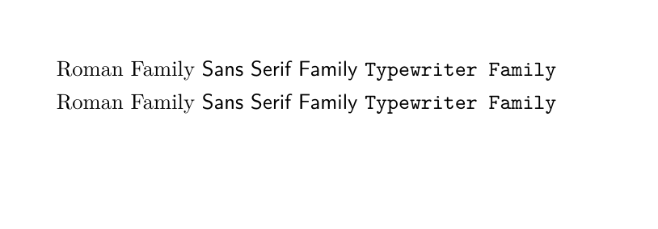

# 安装Latex

参照网上博客安装即可。

# 开始

1. 使用记事本写下如下代码：`test.tex`
   

2. 保存，cmd运行命令：

```bash
latex test.tex
```


3. 编译成pdf文件

   ```shell
   dvipdfmx test.dvi
   ```

   

   

   

   也可以直接使用`xelatex`命令直接生成`pdf`文件，免去了使用中间命令。

   上述的操作比较复杂，流程繁琐，可以直接写一个bat批处理文件：

   

   效果是一样的。

   

   # TexStudio

   软件设置以支持中文：

   

   新建一个文档：F5构建并查看

   

   ------------

一个latex文档包括导言区和正文区：在导言区进行一些全局的设置


并且只能有一个正文区，通过命名来设置一些显示效果，$$符号是在行内嵌入公式，双$符号是另起一行嵌入公式。文档中如果要换行，则在之间插入一个空行即可，或者 \\ \  .


## 中文设置

查看是否是`xelatex`编译器, 编码为UTF-8。然后导入`\usepackage{ctex}`。


LATEX 源代码中，空格键和  Tab 键输入的空白字符视为“空格”。连续的若干个空白字符视为一个空格。一行开头的空格忽略不计。

分段的方法有两种：

（1）行末的回车视为一个空格，但连续两个回车，也就是空行，会将文字分段。多个空行被视为一个空行。

（2）也可以在行末使用 \par 命令分段。


--------------


## 字体设置

字体族设置：罗马字体，无衬线字体，打字机字体

```latex
	% 字体族设置（罗马字体，无衬线字体，打字机字体）
	\textrm{Roman Family} % 罗马字体
	\textsf{Sans Serif Family} % 无衬线字体
	\texttt{Typewriter Family} % 打字机字体
	
	
	\rmfamily Roman Family % 字体声明： 声明后面字体为罗马字体
	{\sffamily Sans Serif Family} {\ttfamily Typewriter Family}
```



大括号对声明分组，指定作用的范围。


完整源码：

```latex
%导言区
\documentclass[12px]{article} %book, report , lettle

\title{\heiti  视频目标分割算法综述}
%\author{\kaishu 卡西迪奥}
\author{小明\thanks{第一作者} 
	\and 小红\thanks{第二作者} 
	\and 隔壁老王\thanks{通讯作者}} 
\usepackage{ctex}

% 自定义命令
\newcommand{\myfont}{\textbf{\textsf{Fancy Text}}}

% 正文区
\begin{document}
	\maketitle

	% 字体族设置（罗马字体，无衬线字体，打字机字体）
	\textrm{Roman Family} % 罗马字体
	\textsf{Sans Serif Family} % 无衬线字体
	\texttt{Typewriter Family} % 打字机字体
	
	
	\rmfamily Roman Family % 字体声明： 声明后面字体为罗马字体
	{\sffamily Sans Serif Family} {\ttfamily Typewriter Family}
	
	{\sffamily Video object segmentation (VOS) is a fundamental task in computer vision, with important applications including video editing, robotics, and selfdriving cars. According to whether the ground-truth mask of the target objects is given for the first frame, VOS task can be seen as semi-supervised VOS and unsupervised VOS. }
	
	{\rmfamily Given the mask of the target objects for the first frame, algorithm for semi-supervised VOS focuses on using it to model the appearance of the objects of interest, such as fine-tuning the model using the first frame or matching the pixel or superpixel of following frames with the first frame. Motion cue or temporal information is considered to be complementary information to enhance performance. While the information for the object of interest is unknown, the method of unsupervised VOS leverages the motion cue and the general appearance model to get dominant feature and segment the salient object .}
	
	
	% 字体形状设置（直立，斜体，伪斜体，小型大写）
	\textup{Upright Shape} \textit{Italic Shape}  \textsl{Slanted Shape} \textsc{ Small Caps Shape}
	
	
	{\upshape Upright Shape } {\itshape Italic Shape }  {\slshape Slanted Shape} {\scshape Small Caps Shape}
	
	
	% 中文字体设置
	\noindent 我是全局字体，我使用的是宋体\\
	{\kaishu 我是ctex已定义好的字体，我使用的楷体}\\
	{\heiti 我是ctex已定义好的字体，我使用的黑体}\\
	{\fangsong 我是ctex已定义好的字体，我使用的仿宋}\\
	
	% 设置字体大小
	{\tiny Hello} \\
	{\scriptsize Hello} \\
	{\footnotesize Hello} \\
	{\small Hello} \\
	{\normalsize Hello} \\
	{\large Hello} \\
	{\Large Hello} \\
	{\LARGE Hello} \\
	{\huge Hello} \\
	{\Huge Hello} \\
	
	% 中文字体字号
	\zihao{4} 你好
	
	\myfont
	
	
\end{document}
```

---------


# Latex的篇章结构


--------

# Latex 插图

通过`\usepackage{graphicx}`来引入。支持EPS，PDF，PNG，JPEG，BMP

```latex
%导言区
\documentclass{ctexart}

% 导言区：\usepackage{graphicx}
% 语法：\includegraphics[keyvals]{imagefile}
\usepackage{graphicx}
\graphicspath{{figures/},{pic/}} % 图片在当前目录下的figures目录

% 正文区
\begin{document}
	\zihao{4}\LaTeX{}中的插图：
	
	\includegraphics[scale=0.5]{camel}
	
	\includegraphics[scale=0.3,height=10cm]{head}
	
	\includegraphics[scale=0.4]{cosnet}
	
	\includegraphics[scale=0.5, angle=45]{camel}
	
	\includegraphics[scale=0.3,height=10cm,,angle=90]{head}
	
	\includegraphics[scale=0.4,clip]{cosnet}
\end{document}


```


----------


# Latex中的表格

```latex
\documentclass{ctexart} % ctexbook, ctexrep

% \usepackage{ctex}

%正文区
\begin{document}
	
	\begin{table*}
		\centering
		\caption{成绩表} 
		
		\begin{tabular}{|l||c|c||c|p{3cm}|} % l 表示左对齐， r表示右对齐， c居中
			\hline
			姓名 & 语文 & 数学 & 英语 & 备注 \\
			\hline \hline
			张三 & 98 & 100 & 99 & 优秀 \\
			\hline
			李四 & 94 & 88 & 56 & 补考另行通知 \\
			\hline
			梨花 & 88 & 99 & 100 & 优秀 \\
			\hline
		
		\end{tabular}
\end{table*}
\end{document}

```


------------

# Latex中的浮动体

```latex
\documentclass{ctexart}

\usepackage{graphicx}
\graphicspath{{figures/}}

\begin{document}
	\LaTeX{}中的插图：
	
	这个是一只骆驼，骆驼见图\ref{fig-camel}
	
	
	\begin{figure}[htbp]
		\centering
		\includegraphics[scale=0.3]{camel}
		\caption{\ 这是一只骆驼}\label{fig-camel}
	\end{figure}

	\LaTeX{}中的表格：
	
	\begin{table}[h]
		\centering
		\caption{考试成绩单}
		\begin{tabular}{|l||c|c||c|p{3cm}|}
			\hline
			姓名 & 语文 & 数学 & 英语 & 备注 \\
			\hline \hline
			张三 & 98 & 100 & 99 & 优秀 \\
			\hline
			李四 & 94 & 88 & 56 & 补考另行通知 \\
			\hline
			梨花 & 88 & 99 & 100 & 优秀 \\
			\hline
			
		\end{tabular}
	\end{table}
	
\end{document}
```

浮动体可以实现灵活分页和排版。，避免无法分割的内容产生的页面空白。还可以使用caption给图表添加标题，以及使用label和ref实现对图表的交叉引用。

可以设置图表的允许位置，默认是tbp：

> h: 此处here  -- 代码所在的上下文位置
>
> t: 页顶top -- 代码所在页面或者之后页面的顶部
>
> b: 页底bottom -- 代码所在页面或者之后页面的底部
>
> p: 独立一页page -- 浮动页面

-----------

# Latex中的数学公式

## 特殊字符

懒得写了。。。可以去各大博客看看。

## 矩阵

```latex
\documentclass{ctexart}

\usepackage{amsmath}

\begin{document}
	\[
	\begin{matrix}
		0 & 1 \\
		1 & 0
	\end{matrix} \qquad	
	% pmatrix环境
	\begin{pmatrix}
	0 & -i \\
	i & 0
	\end{pmatrix} \qquad
		% bmatrix环境
	\begin{bmatrix}
	0 & -1 \\
	1 & 0
	\end{bmatrix} \qquad
		% Bmatrix环境
	\begin{Bmatrix}
	0 & -i \\
	i & 0
	\end{Bmatrix} \qquad
		% vmatrix环境
	\begin{vmatrix}
	a & b \\
	c & d
	\end{vmatrix} \qquad
		% Vmatrix环境
	\begin{Vmatrix}
	0 & -i \\
	i & 0
	\end{Vmatrix} \qquad
	\]
\end{document}
```


```latex
	
	\[
	A = \begin{bmatrix}
	a_{11} & \dots & a_{1n} \\
	& \ddots & \vdots \\
	0 & & a_{nn}
	\end{bmatrix}_{n \times n}
	\]
	
	\[
	A = \begin{pmatrix}
	a_{11}^2 & a_{12}^2 & a_{13}^2 \\
	0 & a_{22} & a_{23} \\
	0 & 0 & a_{33}
	\end{pmatrix}
	\]
```


## 多行公式

```latex
\documentclass{ctexart}

\usepackage{amsmath}
\usepackage{amssymb}

\begin{document}
% 多行公式  带编号
	\begin{gather}
	a + b = b + a \\
	ab ba
	\end{gather}
	
		% 多行公式 	%不带编号
	\begin{gather*}
	a + b = b + a \\
	ab ba
	\end{gather*}
	
\end{document}
```


-----------


# Latex参考文献BibTex

```latex
\documentclass{ctexart}

\bibliographystyle{plain} % plain alpha abbrv

% 正文区
\begin{document}
	我引用了一篇文章\cite{20174704440428}\\
	我引用了一篇文章\cite{20181605023233}\\
	我引用了一篇文章\cite{20183905849930}\\
	我引用了一篇文章\cite{20193207282709}\\
	我引用了一篇文章\cite{20194407608844}
	
	在谷歌学术上引用\cite{logothetis1996visual}
	
	\bibliography{test}
\end{document}
```


可以使用zotero火狐插件导出bibTex， 知网也行。

好了，就这样。Latex学习曲线听陡峭的。。。命令很多，不用就会忘记，所以以后还是多用用的，工具还是挺强大的！