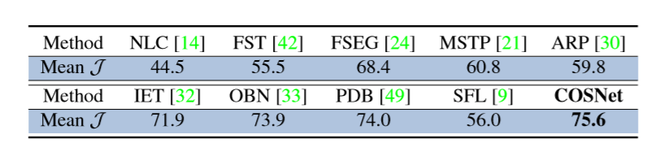

#   Motion-Attentive Transition for Zero-Shot Video Object Segmentation  [2020]

论文地址：https://arxiv.org/abs/2003.04253

github:  https://github.com/tfzhou/MATNet 

这篇文章的结果在Davis2016数据集上达到了82.5，截止到2020年4月16日11:03取得了第一名的成绩:100:

#  Overview

论文提出了一种基于双流编码的用于Zero-Shot视频目标分割任务，称为  `Motion-Attentive Transition Network (MATNet)`   。它和以往的双流网络有区别，以往的双流网络将运动信息和外观信息独立的处理，视为同等重要， 学习直接将光流映射到相应的分割掩码中，并且会导致外观网络的过度拟合。而MAT-Net不但继承了传统双流网络的特性（对多模态的学习），而且还能逐步转移中间的运动注意特征，以促进外观学习。

# NetWork

MAT-Net的网络结构如下图所示：

 网络由三部分组成： 交叉编码网络（`Interleaved encoder`）, 桥接网络（`a bridge network` ），解码网络（`decoder`）。

## Interleaved encoder

 编码器依赖于一个双流结构来合编码对象的外观和运动信息，不像以前的工作一样对待两个流，编码器在每个网络中间层包含一个`MAT block`，它为信息传播提供了一个运动到外观的路径。 

以ResNet-101作为backbone，则编码器的流程为：首先输入image $I_a$ 和它对应的光流图 $I_m$ ，encoder分别提取中间特征$ V_{a,i} \in R^{W * H * C} $  和  $ V_{m,i} \in R^{W * H * C} $,  $ i \in \{2,3,4,5\} $, 表示`residual stage`。MAT-Block会增强这些特征：
$$
U_{a,i}， U_{m,i} =F{_{MAT}(V_{a,i}, V_{m,i})}
$$
$U$ 表示增强之后的特征。

## Bridge Network

桥接网络由SSA模块构成。使用尺度敏感注意(SSA)来自适应地选择和转换编码器的特性，而不是直接通过跳过连接来连接编码器和解码器。具体来说，SSA被添加到每一对编码器和解码器层中，它包含一个两级注意方案， 其中，局部注意采用信道和空间两种注意机制，将输入特征集中在正确的目标区域，同时抑制冗余特征中可能存在的噪声，而全局注意则针对多尺度目标对特征进行重新校准。 

##   Decoder Network  

 解码器网络采用粗到精的方案进行分割，它由四个`BAR`（  `Boundary-Aware Refinement` ）模块组成。

#  Motion-Attentive Transition Module  

MAT-module 由一个soft attention和一个attention transition单元组成。SA 集中注意到输入图像的重要区域，AT则将注意的运动特征转移到外观流中，以促进外观学习 。

##   Soft Attention  

 这个单元在每个空间位置上对输入的特征图$V_m$(或$V_a$)进行加权 。

##   Attention Transition  

 矩阵S可以有效地捕获两个特征空间之间的两两关系。 

然后对S的每一行进行归一化，得到一个基于运动特征的注意图 $S^r$ 并实现增强的外观特征$U_a$ 

下面是MAT-block的计算图：

 #   Scale-Sensitive Attention Module  

基于 [CBAM: Convolutional Block Attention Module](https://arxiv.org/abs/1807.06521)  。 Convolutional Block Attention Module (CBAM) 表示卷积模块的注意力机制模块。是一种结合了空间（spatial）和通道（channel）的注意力机制模块。相比于senet只关注通道（channel）的注意力机制可以取得更好的效果。 

SSA 基于CBAM，加上了全局的注意$F_g$， 给定一个特征图作为输入$U \in R^{W*H*2C}$,  SSA refine it:

## CBAM

------------

#   Boundary-Aware Refinement Module  

对于BAR来说，有两个因素是非常关键的：

1. ASPP模块，可以增大感受野的同时，获得更大的特征图。

2.  引入了一种启发式的方法来自动挖掘  `hard negative pixels`   来支持$F_{bdry}$的训练 :

   使用HED-model来预测边界特征图$E\in[0,1]^{W*H}$,   $E_k$ 表示第k个像素是边界的概率。 那么，如果像素k具有较高的边缘概率（eg ： >0.2）并且落在扩展的ground-truth区域之外 ，则将其视为`hard negative pixels`。 如果像素k是硬像素，则其权值$w_k = 1+ E_k$; 否则$w_k =1$。 然后，使用$w_k$对下面的边界损失进行加权，以便在硬像素分类错误时对其进行重罚 

   

   $M^b$ 和 $G^b$ 分别是边缘预测和`ground-truth`

   

   ----------------------------------------------

   

   

#  Experiments  

## Ablation study

## Result

### Davis16

### Youtube-Object

CosNet :   70.5

AGNN： 81.1 75.9 70.7 78.1 67.9 69.7 77.4 67.3 68.3 47.8 70.8 

### FBMS

CosNet：75.6

