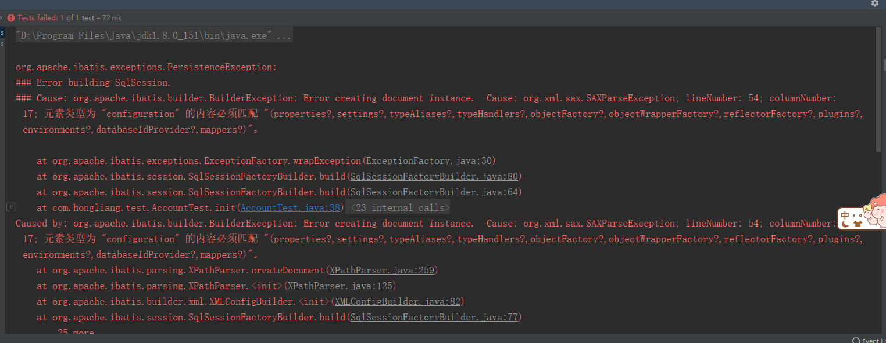

# 错误：

在 Mybatis 的配置文件 SqlMapConfig.xml 文件中添加延迟加载的配置。 配置<settings>标签的时候运行程序出现以下错误：

**org.apache.ibatis.exceptions.PersistenceException:** 

**Error building SqlSession.**

**Cause: org.apache.ibatis.builder.BuilderException: Error creating document instance.  Cause: org.xml.sax.SAXParseException; lineNumber: 54; columnNumber: 17; 元素类型为 "configuration" 的内容必须匹配 "(properties?,settings?,typeAliases?,typeHandlers?,objectFactory?,objectWrapperFactory?,reflectorFactory?,plugins?,environments?,databaseIdProvider?,mappers?)"。**

# 解决

天杀的MyBatis。。。我服了， 原来Mybatis的配置节点必须按顺序来，顺序错了就会报以上的错误。 

> 元素类型为 "configuration" 的内容必须匹配 "  `(properties?,settings?,typeAliases?,typeHandlers?,objectFactory?,objectWrapperFactory?,reflectorFactory?,plugins?,environments?,databaseIdProvider?,mappers?)"`。 应该按照以上顺序来配置configuration里面的设置。

坑。。。