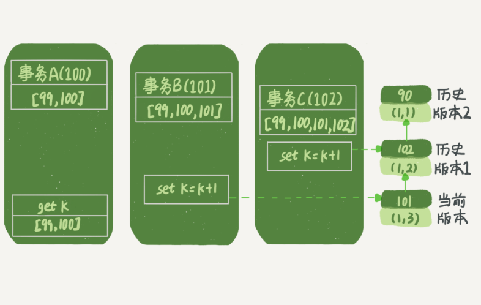

## 01 一条SQL查询语句是如何执行的

见 https://castile.github.io/2021/07/23/mysql%E8%AF%AD%E5%8F%A5%E6%89%A7%E8%A1%8C%E8%BF%87%E7%A8%8B/

## 02 日志系统：一条SQL更新语句是如何执行的

更新语句：`  update T set c=c+1 where ID=2; `


### redo log

redo log使用WAL技术（Write-Ahead Logging），也就是先写日志再写磁盘。 具体来说，当有一条记录需要更新的时候，InnoDB 引擎就会先把记录写到 redo log里面，并更新内存，这个时候更新就算完成了。同时，InnoDB 引擎会在适当的时候，将这个操作记录更新到磁盘里面，而这个更新往往是在系统比较空闲的时候做 


 write pos 是当前记录的位置，一边写一边后移，写到第 3 号文件末尾后就回到 0 号文件开头。checkpoint 是当前要擦除的位置，也是往后推移并且循环的，擦除记录前要把记录更新到数据文件。 

 redo log，InnoDB 就可以保证即使数据库发生异常重启，之前提交的记录都不会丢失，这个能力称为**crash-safe**。 

### binlog

与redo log的区别：

1. redo log 是 InnoDB 引擎特有的；binlog 是 MySQL 的 Server 层实现的，所有引擎都可以使用。
2. redo log 是物理日志，记录的是“在某个数据页上做了什么修改”；binlog 是逻辑日志，记录的是这个语句的原始逻辑，比如“给 ID=2 这一行的 c 字段加 1 ”。
3. redo log 是循环写的，空间固定会用完；binlog 是可以追加写入的。“追加写”是指 binlog 文件写到一定大小后会切换到下一个，并不会覆盖以前的日志。

更新语句执行流程图：


注意，这里使用了两阶段提交。是因为要保证 数据库的状态和用它的日志恢复出来的库的一致。

## 03  事务隔离

### 隔离性与隔离级别

ACID（Atomicity、Consistency、Isolation、Durability，即原子性、一致性、隔离性、持久性）。

 SQL 标准的事务隔离级别包括： 读未提交（read uncommitted）、读提交（read committed）、可重复读（repeatable read）和串行化（serializable ）。

- 读未提交是指，一个事务还没提交时，它做的变更就能被别的事务看到。
- 读提交是指，一个事务提交之后，它做的变更才会被其他事务看到。
- 可重复读是指，一个事务执行过程中看到的数据，总是跟这个事务在启动时看到的数据是一致的。当然在可重复读隔离级别下，未提交变更对其他事务也是不可见的。
- 串行化，顾名思义是对于同一行记录，“写”会加“写锁”，“读”会加“读锁”。当出现读写锁冲突的时候，后访问的事务必须等前一个事务执行完成，才能继续执行。

 

### 事务隔离的实现

在 MySQL 中，实际上每条记录在更新的时候都会同时记录一条回滚操作。记录上的最新值，通过回滚操作，都可以得到前一个状态的值。

假设一个值从 1 被按顺序改成了 2、3、4，在回滚日志里面就会有类似下面的记录。


当前值是 4，但是在查询这条记录的时候，不同时刻启动的事务会有不同的 read-view。 

当没有事务再需要用到这些回滚日志时，回滚日志会被删除，因此尽量不要使用长事务。 **由于这些事务随时可能访问数据库里面的任何数据，所以这个事务提交之前，数据库里面它可能用到的回滚记录都必须保留，这就会导致大量占用存储空间** 

### 查询事务

 可以在 information_schema 库的 innodb_trx 这个表中查询长事务，比如下面这个语句，用于查找持续时间超过 60s 的事务。 

```mysq
select * from information_schema.innodb_trx where TIME_TO_SEC(timediff(now(),trx_started))>60
```

### 如何避免长事务对业务的影响？ 

**首先，从应用开发端来看：**

1. 确认是否使用了 set autocommit=0。这个确认工作可以在测试环境中开展，把 MySQL 的 general_log 开起来，然后随便跑一个业务逻辑，通过 general_log 的日志来确认。一般框架如果会设置这个值，也就会提供参数来控制行为，你的目标就是把它改成 1。
2. 确认是否有不必要的只读事务。有些框架会习惯不管什么语句先用 begin/commit 框起来。我见过有些是业务并没有这个需要，但是也把好几个 select 语句放到了事务中。这种只读事务可以去掉。
3. 业务连接数据库的时候，根据业务本身的预估，通过 SET MAX_EXECUTION_TIME 命令，来控制每个语句执行的最长时间，避免单个语句意外执行太长时间。

**其次，从数据库端来看：**

1. 监控 information_schema.Innodb_trx 表，设置长事务阈值，超过就报警 / 或者 kill；
2. Percona 的 pt-kill 这个工具不错，推荐使用；
3. 在业务功能测试阶段要求输出所有的 general_log，分析日志行为提前发现问题；
4. 如果使用的是 MySQL 5.6 或者更新版本，把 innodb_undo_tablespaces 设置成 2（或更大的值）。如果真的出现大事务导致回滚段过大，这样设置后清理起来更方便。


## 04 深入浅出索引（上）

 **索引的出现其实就是为了提高数据查询的效率，就像书的目录一样** 

### 索引的常见模型

常见的有哈希表、有序数组和搜索树。 

- 哈希索引： 通过hash函数计算key所在的位置从而找到value，冲突后后面挂了一条链表。 **哈希表这种结构适用于只有等值查询的场景** ， 区间查询需要遍历全部，查询很慢。

- 有序数组：  **有序数组在等值查询和范围查询场景中的性能就都非常优秀** ，  但是，在需要更新数据的时候就麻烦了，你往中间插入一个记录就必须得挪动后面所有的记录，成本太高。  所以，**有序数组索引只适用于静态存储引擎**，比如你要保存的是 2017 年某个城市的所有人口信息，这类不会再修改的数据。 

  

-  二叉搜索树 ：  O(log(N)) 的查询复杂度 ， 新的时间复杂度也是 O(log(N))。 

  

### InnoDB 的索引模型

 在 InnoDB 中，表都是根据主键顺序以索引的形式存放的，这种存储方式的表称为**索引组织表** 

 nnoDB 使用了 B+ 树索引模型，所以数据都是存储在 B+ 树中的， 每一个索引在 InnoDB 里面对应一棵 B+ 树。 **B+ 树能够很好地配合磁盘的读写特性，减少单次查询的磁盘访问次数** 

建表语句：

```mysql
create table T(
id int primary key, 
k int not null, 
name varchar(16),
index (k))engine=InnoDB;
```

 表中 R1~R5 的 (ID,k) 值分别为 (100,1)、(200,2)、(300,3)、(500,5) 和 (600,6)， 


 根据叶子节点的内容，索引类型分为主键索引和非主键索引 

- 主键索引的叶子节点存的是整行数据。在 InnoDB 里，主键索引也被称为聚簇索引（clustered index）。

- 非主键索引的叶子节点内容是主键的值。在 InnoDB 里，非主键索引也被称为二级索引（secondary index）

 **基于主键索引和普通索引的查询有什么区别？** 

- 如果语句是 select * from T where ID=500，即主键查询方式，则只需要搜索 ID 这棵 B+ 树；
- 如果语句是 select * from T where k=5，即普通索引查询方式，则需要先搜索 k 索引树，得到 ID 的值为 500，再到 ID 索引树搜索一次。这个过程称为**回表**。

也就是说，基于非主键索引的查询需要多扫描一棵索引树。因此，我们在应用中应该尽量使用主键查询。

### 索引如何维护

插入数据的时候就需要维护索引B+树，可能会涉及到页分裂、合并操作。

***哪些场景下应该使用自增主键，而哪些场景下不应该？**

自增主键：  插入新记录的时候可以不指定 ID 的值，系统会获取当前 ID 最大值加 1 作为下一条记录的 ID 值；  每次插入一条新记录，都是追加操作，都不涉及到挪动其他记录，也不会触发叶子节点的分裂 

有的 业务逻辑的字段做主键，则往往不容易保证有序插入，这样写数据成本相对较高。

除了考虑性能外，我们还可以从存储空间的角度来看， **主键长度越小，普通索引的叶子节点就越小，普通索引占用的空间也就越小** 

> "尽量使用主键查询”原则，直接将这个索引设置为主键，可以避免每次查询需要搜索两棵树。 


## 05 深入浅出索引（下）

语句：

```mysql
create table T (
ID int primary key,
k int NOT NULL DEFAULT 0, 
s varchar(16) NOT NULL DEFAULT '',
index k(k))
engine=InnoDB;
 
insert into T values(100,1, 'aa'),(200,2,'bb'),(300,3,'cc'),(500,5,'ee'),(600,6,'ff'),(700,7,'gg');
```


 执行`select * from T where k between 3 and 5`，需要执行几次树的搜索操作，会扫描多少行？ 


1. 在 k 索引树上找到 k=3 的记录，取得 ID = 300；
2. 再到 ID 索引树查到 ID=300 对应的 R3；
3. 在 k 索引树取下一个值 k=5，取得 ID=500；
4. 再回到 ID 索引树查到 ID=500 对应的 R4；
5. 在 k 索引树取下一个值 k=6，不满足条件，循环结束。

 可以看到，这个查询过程读了 k 索引树的 3 条记录（步骤 1、3 和 5），回表了两次（步骤 2 和 4）。 

### 覆盖索引

 如果执行的语句是 select ID from T where k between 3 and 5，这时只需要查 ID 的值，而 ID 的值已经在 k 索引树上了，因此可以直接提供查询结果，不需要回表。也就是说，在这个查询里面，索引 k 已经“覆盖了”我们的查询需求，我们称为覆盖索引。 

 **由于覆盖索引可以减少树的搜索次数，显著提升查询性能，所以使用覆盖索引是一个常用的性能优化手段。** 

### 最左前缀原则

 **B+ 树这种索引结构，可以利用索引的“最左前缀”，来定位记录。** 

 用（name，age）这个联合索引来分析。  索引项是按照索引定义里面出现的字段顺序排序的。 


 当你的逻辑需求是查到所有名字是“张三”的人时，可以快速定位到 ID4，然后向后遍历得到所有需要的结果.

如果你要查的是所有名字第一个字是“张”的人，你的 SQL 语句的条件是”where name like ‘张 %’”。这时，你也能够用上这个索引，查找到第一个符合条件的记录是 ID3，然后向后遍历，直到不满足条件为止 

这个最左前缀可以是联合索引的最左 N 个字段，也可以是字符串索引的最左 M 个字符。 

 **在建立联合索引的时候，如何安排索引内的字段顺序**?

这里我们的评估标准是，索引的复用能力。因为可以支持最左前缀，所以当已经有了 (a,b) 这个联合索引后，一般就不需要单独在 a 上建立索引了。因此，**第一原则是，如果通过调整顺序，可以少维护一个索引，那么这个顺序往往就是需要优先考虑采用的。** 

### 索引下推

最左前缀可以用于在索引中定位记录，那些不符合最左前缀的部分，会怎么样呢？ 

 市民表的联合索引（name, age）为例。如果现在有一个需求：检索出表中“名字第一个字是张，而且年龄是 10 岁的所有男孩”。那么，SQL 语句是这么写的： 

```mysql
 select * from tuser where name like '张 %' and age=10 and ismale=1;
```

 搜索索引树的时候，只能用 “张”，找到第一个满足条件的记录 ID3， 后面只能从ID3开始回表操作，找出数据行再比较字段值。

在 MySQL 5.6 之前，只能从 ID3 开始一个个回表。到主键索引上找出数据行，再对比字段值。

而 MySQL 5.6 引入的索引下推优化（index condition pushdown)， 可以在索引遍历过程中，对索引中包含的字段先做判断，直接过滤掉不满足条件的记录，减少回表次数。


InnoDB 在 (name,age) 索引内部就判断了 age 是否等于 10，对于不等于 10 的记录，直接判断并跳过。在我们的这个例子中，只需要对 ID4、ID5 这两条记录回表取数据判断，就只需要回表 2 次 


## 06 全局锁和表锁

 **根据加锁的范围，MySQL 里面的锁大致可以分成全局锁、表级锁和行锁三类** 

### 全局锁

全局锁就是对整个数据库实例加锁。MySQL 提供了一个加全局读锁的方法，命令是 Flush tables with read lock (FTWRL)。当你需要让整个库处于只读状态的时候，可以使用这个命令，之后其他线程的以下语句会被阻塞：数据更新语句（数据的增删改）、数据定义语句（包括建表、修改表结构等）和更新类事务的提交语句。 

**全局锁的典型使用场景是，做全库逻辑备份。**也就是把整库每个表都 select 出来存成文本。 

全库备份的方式

1、   Flush tables with read lock (FTWRL)

2、使用可重复读的事务隔离级别。 逻辑备份工具是 mysqldump。  使用参数–single-transaction 的时候，导数据之前就会启动一个事务，来确保拿到一致性视图。而由于 MVCC 的支持，这个过程中数据是可以正常更新的。  **但前提是引擎要支持这个隔离级别。**比如，对于 MyISAM 这种不支持事务的引擎。

3、 **全库只读，为什么不使用 set global readonly=true 的方式呢**？但是建议使用FTWRL，原因如下：

- 一是，在有些系统中，readonly 的值会被用来做其他逻辑，比如用来判断一个库是主库还是备库。因此，修改 global 变量的方式影响面更大，我不建议你使用。
- 二是，在异常处理机制上有差异。如果执行 FTWRL 命令之后由于客户端发生异常断开，那么 MySQL 会自动释放这个全局锁，整个库回到可以正常更新的状态。而将整个库设置为 readonly 之后，如果客户端发生异常，则数据库就会一直保持 readonly 状态，这样会导致整个库长时间处于不可写状态，风险较高。


### 表级锁

MySQL 里面表级别的锁有两种：一种是表锁，一种是元数据锁（meta data lock，MDL)。 

 **表锁的语法是 lock tables … read/write**。 可以用 unlock tables 主动释放锁，也可以在客户端断开的时候自动释放。

**另一类表级的锁是 MDL（metadata lock)。**MDL 不需要显式使用，在访问一个表的时候会被自动加上。MDL 的作用是，保证读写的正确性。 

当要对表做结构变更操作的时候，加 MDL 写锁。

- 读锁之间不互斥，因此你可以有多个线程同时对一张表增删改查。
- 读写锁之间、写锁之间是互斥的，用来保证变更表结构操作的安全性。因此，如果有两个线程要同时给一个表加字段，其中一个要等另一个执行完才能开始执行。

**事务中的 MDL 锁，在语句执行开始时申请，但是语句结束后并不会马上释放，而会等到整个事务提交后再释放。** 

 **如何安全地给小表加字段？** 

1、 我们要解决长事务，事务不提交，就会一直占着 MDL 锁。 如果你要做 DDL 变更的表刚好有长事务在执行，要考虑先暂停 DDL，或者 kill 掉这个长事务。 

 如果你要变更的表是一个热点表，虽然数据量不大，但是上面的请求很频繁，而你不得不加个字段，你该怎么做呢？ 

> 在 alter table 语句里面设定等待时间，如果在这个指定的等待时间里面能够拿到 MDL 写锁最好，拿不到也不要阻塞后面的业务语句，先放弃。之后开发人员或者 DBA 再通过重试命令重复这个过程。 

```mysql
ALTER TABLE tbl_name NOWAIT add column ...
ALTER TABLE tbl_name WAIT N add column ... 
```

## 07 行锁功过：怎么减少行锁对性能的影响？

行锁就是针对数据表中行记录的锁。这很好理解，比如事务 A 更新了一行，而这时候事务 B 也要更新同一行，则必须等事务 A 的操作完成后才能进行更新。 

 **InnoDB 事务中，行锁是在需要的时候才加上的，但并不是不需要了就立刻释放，而是要等到事务结束时才释放。这个就是两阶段锁协议。** 因此， **如果你的事务中需要锁多个行，要把最可能造成锁冲突、最可能影响并发度的锁尽量往后放。** 

### 死锁和死锁检测

当并发系统中不同线程出现循环资源依赖，涉及的线程都在等待别的线程释放资源时，就会导致这几个线程都进入无限等待的状态，称为死锁。 


 事务 A 在等待事务 B 释放 id=2 的行锁，而事务 B 在等待事务 A 释放 id=1 的行锁。 事务 A 和事务 B 在互相等待对方的资源释放，就是进入了死锁状态。当出现死锁以后，有两种策略： 

- 一种策略是，直接进入等待，直到超时。这个超时时间可以通过参数 innodb_lock_wait_timeout 来设置。默认是50s

- 另一种策略是，发起死锁检测，发现死锁后，主动回滚死锁链条中的某一个事务，让其他事务得以继续执行。将参数 innodb_deadlock_detect 设置为 on，表示开启这个逻辑。

那种好用呢？

如果采用第一种，使用默认值的话，出现了死锁要等待50s才能超时退出，对于在线服务来说是无法接受的。但是如果值设置成1s，太短，会出现误伤。

采用第二种的话，如果客户端并发更新1000次，死锁检查就要执行100w次（每个线程都需要循环判断1000次，所以是10的6次方），那么死锁检测就需要大量的cpu， 你就会看到 CPU 利用率很高，但是每秒却执行不了几个事务。 

**解决方法：**

1、 **确保这个业务一定不会出现死锁，可以临时把死锁检测关掉** ： innodb_deadlock_detect = off

2、 **控制并发度** ：  对于相同行的更新，在进入引擎之前排队。这样在 InnoDB 内部就不会有大量的死锁检测工作了。 

3、 冗余行设计： 减少冲突概率，减少锁等待次数，也就减少了死锁检测的CPU消耗。


如果你要删除一个表里面的前 10000 行数据，有以下三种方法可以做到：

- 第一种，直接执行 delete from T limit 10000;
- 第二种，在一个连接中循环执行 20 次 delete from T limit 500;
- 第三种，在 20 个连接中同时执行 delete from T limit 500。

你会选择哪一种方法呢？为什么呢？

第二种好一点。

 第一种方式： 单个语句占用时间长，锁的时间也比较长；而且大事务还会导致主从延迟。 

 第三种方式 ： 会人为造成锁冲突

## 08 事务到底是隔离的还是不隔离的？


### “快照”在 MVCC 里是怎么工作的？

 可重复读隔离级别： 一个事务在启动的时候看到的数据，在整个事务过程中看到的数据是一致的。

在可重复读隔离级别下，事务在启动的时候就“拍了个快照”。注意，**这个快照是基于整库的**。 	   

#### 快照的实现

每个事务有一个唯一的事务 ID，叫作 transaction id，且是严格递增的。

每行数据也都是有多个版本的。每次事务更新数据的时候，都会生成一个新的数据版本，并且把 transaction id 赋值给这个数据版本的事务 ID，记为 row trx_id。也就是说数据表中的一行记录，其实可能有多个版本 (row)，每个版本有自己的 row trx_id。 


>  虚线框里是同一行数据的 4 个版本，当前最新版本是 V4，k 的值是 22，它是被 transaction id 为 25 的事务更新的，因此它的 row trx_id 也是 25。 

三个虚线箭头，就是 undo log(回滚日志)；而 V1、V2、V3 并不是物理上真实存在的，而是每次需要的时候根据当前版本和 undo log 计算出来的。比如，需要 V2 的时候，就是通过 V4 依次执行 U3、U2 算出来。

 InnoDB 为每个事务构造了一个数组，用来保存这个事务启动瞬间，当前正在“活跃”的所有事务 ID。“活跃”指的就是，启动了但还没提交。  

数组里面事务 ID 的最小值记为低水位，当前系统里面已经创建过的事务 ID 的最大值加 1 记为高水位。 这个视图数组和高水位，就组成了当前事务的一致性视图（read-view）。

而数据版本的可见性规则，就是基于数据的 row trx_id 和这个一致性视图的对比结果得到的。


对于当前事务的启动瞬间来说，一个数据版本的 row trx_id，有以下几种可能：

1. 如果落在绿色部分，表示这个版本是已提交的事务或者是当前事务自己生成的，这个数据是可见的；
2. 如果落在红色部分，表示这个版本是由将来启动的事务生成的，是肯定不可见的；
3. 如果落在黄色部分，那就包括两种情况：
   - a. 若 row trx_id 在数组中，表示这个版本是由还没提交的事务生成的，不可见； 
   - b. 若 row trx_id 不在数组中，表示这个版本是已经提交了的事务生成的，可见。

 **InnoDB 利用了“所有数据都有多个版本”的这个特性，实现了“秒级创建快照”的能力。** 


###  **事务的可重复读的能力是怎么实现的** 

可重复读的核心就是一致性读（consistent read）；而事务更新数据的时候，只能用**当前读**。如果当前的记录的行锁被其他事务占用的话，就需要进入锁等待。 

而读提交的逻辑和可重复读的逻辑类似，它们最主要的区别是： 

- 在可重复读隔离级别下，只需要在事务开始的时候创建一致性视图，之后事务里的其他查询都共用这个一致性视图；
- 在读提交隔离级别下，每一个语句执行前都会重新算出一个新的视图。


### 举例说明

```mysql
mysql> CREATE TABLE `t` (
  `id` int(11) NOT NULL,
  `k` int(11) DEFAULT NULL,
  PRIMARY KEY (`id`)
) ENGINE=InnoDB;
insert into t(id, k) values(1,1),(2,2);
```

#### 可重复读隔离级别下


这里，我们不妨做如下假设：

1. 事务 A 开始前，系统里面只有一个活跃事务 ID 是 99；
2. 事务 A、B、C 的版本号分别是 100、101、102，且当前系统里只有这四个事务；
3. 三个事务开始前，(1,1）这一行数据的 row trx_id 是 90。

这样，事务 A 的视图数组就是 [99,100], 事务 B 的视图数组是 [99,100,101], 事务 C 的视图数组是 [99,100,101,102]。



事务 A 查询语句的读数据流程是这样的：

- 找到 (1,3) 的时候，判断出 row trx_id=101，比高水位大，处于红色区域，不可见；
- 接着，找到上一个历史版本，一看 row trx_id=102，比高水位大，处于红色区域，不可见；
- 再往前找，终于找到了（1,1)，它的 row trx_id=90，比低水位小，处于绿色区域，可见。

**总结就是：一个数据版本，对于一个事务视图来说，除了自己的更新总是可见以外，有三种情况：**

1. **版本未提交，不可见；**
2. **版本已提交，但是是在视图创建后提交的，不可见；**
3. **版本已提交，而且是在视图创建前提交的，可见。**

#### 更新逻辑

 用到了这样一条规则：**更新数据都是先读后写的，而这个读，只能读当前的值，称为“当前读”（current read）。** 

因此，在更新的时候，当前读拿到的数据是 (1,2)，更新后生成了新版本的数据 (1,3)，这个新版本的 row trx_id 是 101。

所以，在执行事务 B 查询语句的时候，一看自己的版本号是 101，最新数据的版本号也是 101，是自己的更新，可以直接使用，所以查询得到的 k 的值是 3。

#### 两阶段锁

 事务 C 不是马上提交的，而是变成了下面的事务 C’，会怎么样呢？  更新后并没有马上提交，在它提交前，事务 B 的更新语句先发起了。


事务 C’没提交，也就是说 (1,2) 这个版本上的写锁还没释放。而事务 B 是当前读，必须要读最新版本，而且必须加锁，因此就被锁住了，必须等到事务 C’释放这个锁，才能继续它的当前读。 


本地验证结果也符合预期：


#### 读提交隔离级别下的情况

 在读提交隔离级别下，事务 A 和事务 B 的查询语句查到的 k，分别应该是多少呢？ 

> 在读提交隔离级别下，每一个语句执行前都会重新算出一个新的视图。

 “start transaction with consistent snapshot; ”的意思是从这个语句开始，创建一个持续整个事务的一致性快照。所以，在读提交隔离级别下，这个用法就没意义了，等效于普通的 start transaction。 


事务 A 的查询语句的视图数组是在执行这个语句的时候创建的，时序上 (1,2)、(1,3) 的生成时间都在创建这个视图数组的时刻之前。但是，在这个时刻：

- (1,3) 还没提交，属于情况 1，不可见；
- (1,2) 提交了，属于情况 3，可见。

所以，这时候事务 A 查询语句返回的是 k=2。

显然地，事务 B 查询结果 k=3。


## 09 普通索引和唯一索引，应该怎么选择？

