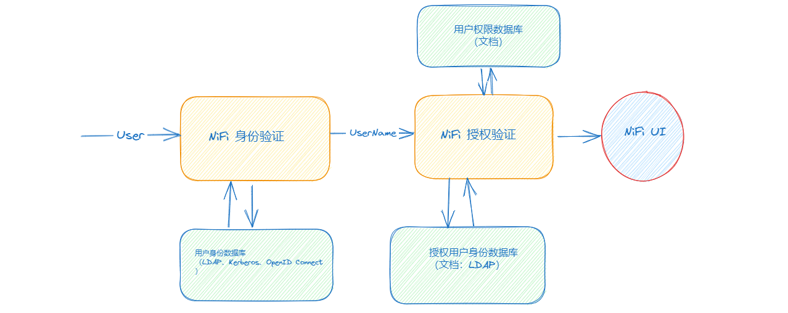
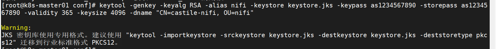
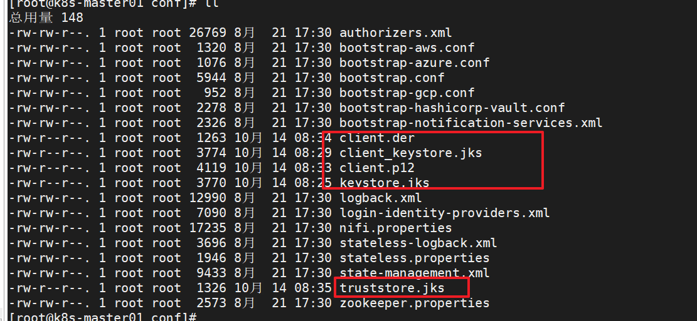
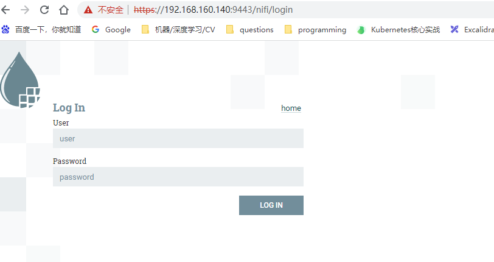
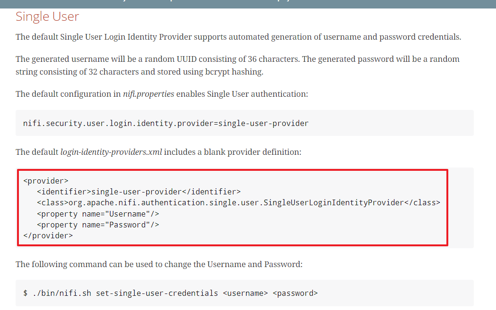
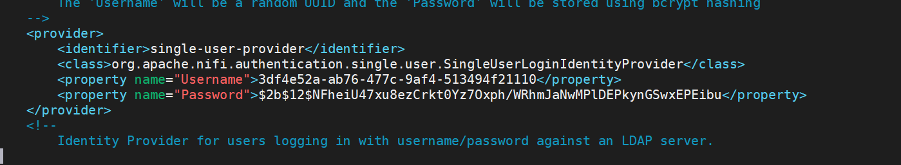
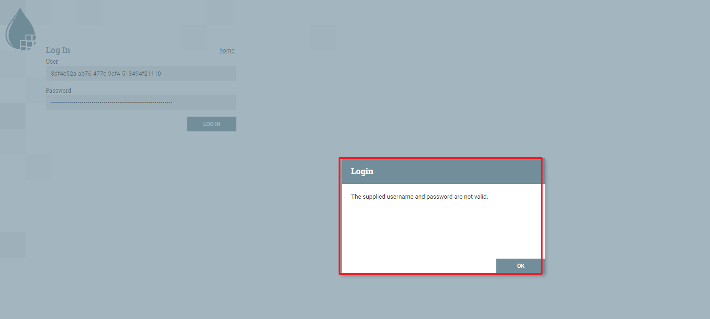
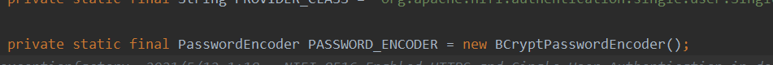
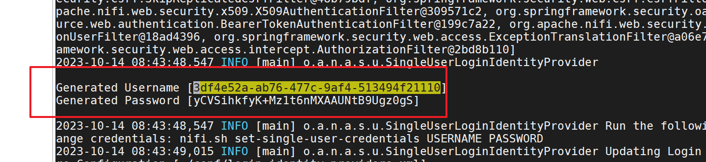
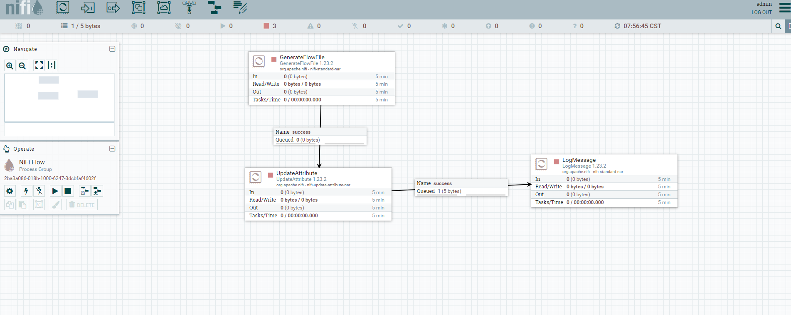

## NiFi身份验证和授权验证介绍

身份验证（Authentication）以及授权验证（Authorization）在Nifi里面是两个相当独立的模块。其中身份验证主要的任务是确认当前操作用户**是否真的是声称的身份**。当用户的身份被证实以后，它的用户名会被传递到授权验证模块，而授权验证模块会在它的数据库里面查找该用户名，并确认该用户**有什么权限**。打个比喻，如果你想进入一个商业写字楼，门口保安可能会拦住你要查看你的身份证（身份验证）。然后他会从一个员工名册上查找你的名字（授权验证）。只有当你的名字出现在名册上时你才会被放行。

下图表明了Nifi中这两个系统间的关系。当用户试图访问Nifi时，他必须首先通过身份验证。身份验证的时候Nifi可能需要参考一个外部的身份数据库（Identity Provider），如LDAP，Kerberos，OpenID Connect等。当确认你的身份后，你的用户名会被送到授权验证模块进一步核对。授权模块在确认你的权限时也需要参考一个身份数据库（可以是一个文档，或者是LDAP服务器）以及一个记录着用户身份与权限对应关系的数据库。

、

身份验证和权限验证是完全可以采用不同的身份数据库的。所以我们说这两个系统相当独立，唯一把他们连接在一起的就是用户名的传递。 


## NiFi 基本配置

Nifi支持好几种用户验证方式：`TLS`, `LDAP`, `Kerberos`, `OpenID Connect`, `Apache Knox`等。我们主要介绍`TLS`以及`LDAP`两种方式。只要弄明白这两种，其余方式的设置都很类似。
 要开启用户验证功能，我们首先必须设置Nifi，使之只接受`https`安全连接。要达到这个目的，我们需要更改位于`./conf` 目录下的`nifi.properties`设置文件里的以下几项属性

`nifi.web.http.port`：去除原来的`8080`，使该行变为`nifi.web.http.port=`，防止用户从非加密的http端口访问

 `nifi.web.https.host`：设为运行Nifi的主机名字，例如`host-01` 

 `nifi.web.https.port`：我们用`8443`作为`https`端口

 `nifi.security.keystore`：keystore的路径，例如`/opt/nifi/secrets/keystore.jks` 

 `nifi.security.keystoreType`：设为`JKS` 

 `nifi.security.keystorePasswd`：keystore的密码。

 `nifi.security.truststore`：truststore的路径，例如`/opt/nifi/secrets/truststore.jks` 

 `nifi.security.truststoreType`：设为`JKS` 

 `nifi.security.truststorePasswd`：truststore的密码。

 `nifi.remote.input.secure`：设为`true`，使得Nifi之间的Site-to-Site通信也用加密的方式。


## 生成keystroe和truststore

当我们要把Nifi设置成加密模式时，我们需要为其提供keystore和truststore。如果我们想通过TLS身份验证访问Nifi的UI时，我们还需要生成一个客户端的PKCS12文件来导入浏览器中。以下简单介绍怎么用Java自带的keytool来生成以上所提及的文件。

### 1、生成KeyStore

 以下命令生成一个包含自签证书（self-signed certificate）的Java keystore： 

```shell
keytool -genkey -keyalg RSA -alias nifi -keystore keystore.jks -keypass [password] -storepass [password] -validity 365 -keysize 4096 -dname "CN=[hostname], OU=nifi"
```

 `[password]`为你想设置的密码，替换`[hostname]`为你运行Nifi的机器的hostname 




### 2、 生成PKCS12文件以及对应的truststore

`PKCS12`文件是一种加密文件，一般用于存放证书以及对应的私钥。由于使用keytool无法直接生成`PKCS12`文件，我们首先生成一个包含自签证书的keystore（与上文生成Keystore的命令很相似）：

```shell
keytool -genkey -keyalg RSA -alias client -keystore client_keystore.jks -keypass password -storepass password -validity 365 -keysize 4096 -dname "CN=castile, OU=nifi"
```

这里，我们只是随便设置了一个密码`password`，因为这个Keystore只是一个过渡的产物，我们最后不会用到，所以随便设置一个就好。

接着我们把这个keystore转化成PKCS12文件：

```shell
keytool -importkeystore -srckeystore client_keystore.jks -destkeystore client.p12 -srcstoretype JKS -deststoretype PKCS12 -srcstorepass password -deststorepass as1234567890 -destkeypass as1234567890 -srcalias client -destalias client
```

 除了生成PKCS12文件外，我们还需要生成一个信任PKCS12密匙文件中的证书的truststore。为此，我们先从之前的keystore中输出密匙的证书： 

```shell
keytool -export -keystore client_keystore.jks -alias client -file client.der -storepass password
```

 当我们得到证书以后，我们把这个证书引入到`truststore.jks`当中： 

```shell
keytool -import -file client.der -alias client -keystore truststore.jks -storepass as1234567890 -noprompt
```

这是执行上述命令生成的文件：



## 访问nifi UI界面

在浏览器输入：https://192.168.160.140:9443/nifi



现在要求你输入用户名和密码，但是这个用户名和密码到底是啥呢？查找官网文档得知，有一个 *login-identity-providers.xml* 默认配置了用户名和密码





```xml
 <provider>
        <identifier>single-user-provider</identifier>
        <class>org.apache.nifi.authentication.single.user.SingleUserLoginIdentityProvider</class>
        <property name="Username">3df4e52a-ab76-477c-9af4-513494f21110</property>
        <property name="Password">$2b$12$NFheiU47xu8ezCrkt0Yz7Oxph/WRhmJaNwMPlDEPkynGSwxEPEibu</property>
    </provider>

```

但是，貌似没啥作用啊




原来，nifi启动的时候会自动生成一个随机用户名和密码，而且在login-single-user=credentials.xml中配置的密码是通过BCryptPasswordEncoder加密后的，





可以通过以下命令设置一个好记忆的密码：

```shell
 nifi.sh set-single-user-credentials USERNAME PASSWORD
```

设置完后可以登录界面了



