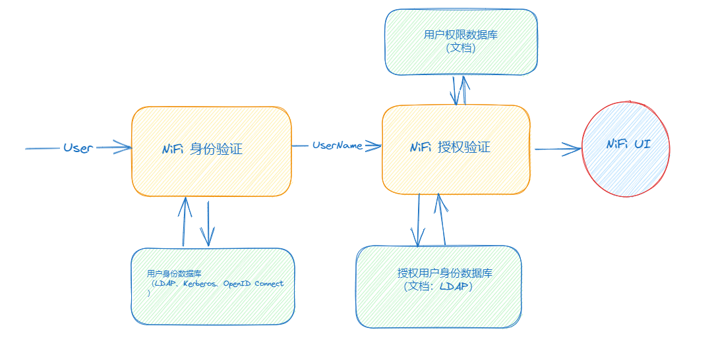
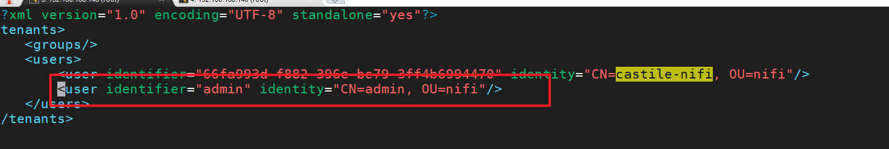
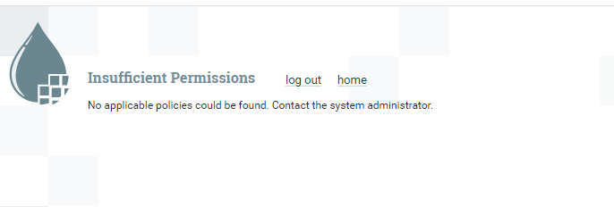
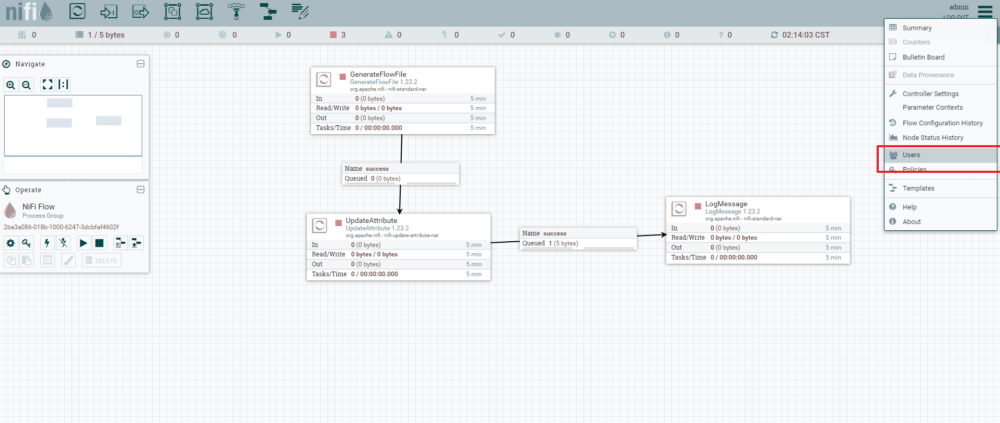
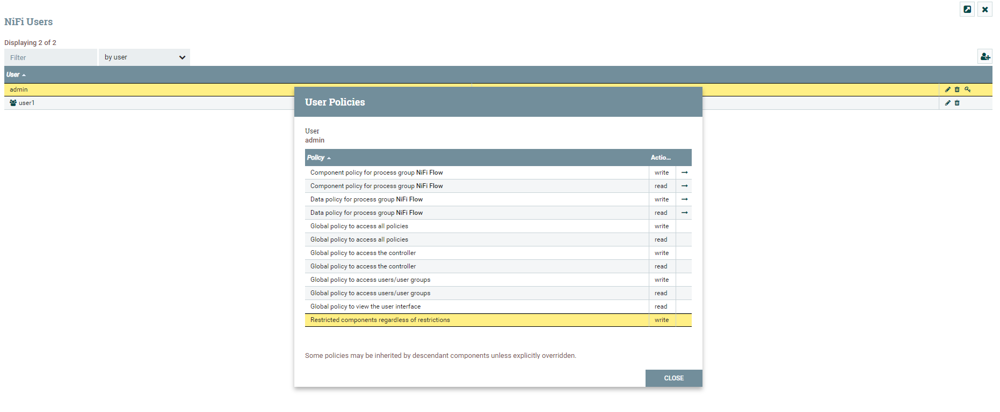
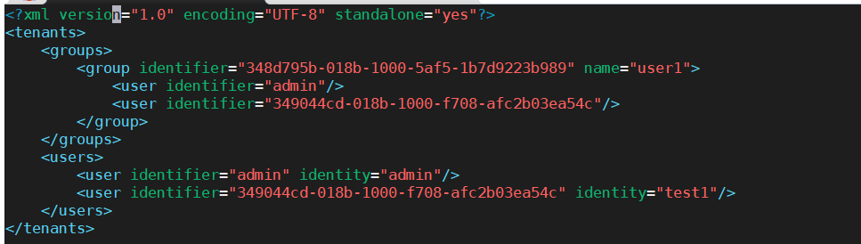
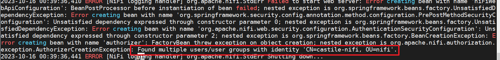
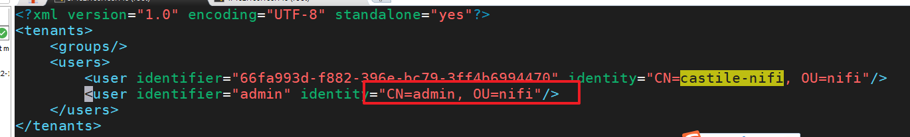
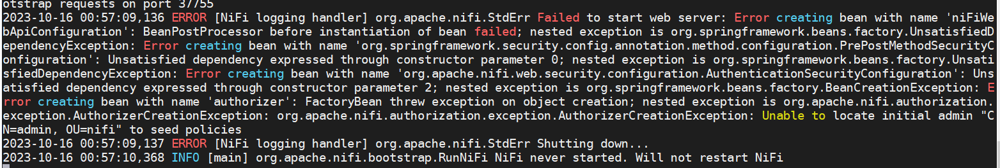

## 授权验证（Authorization）概述

访问Nifi界面相当于你想进入一个商业写字楼，门口保安可能会拦住你要查看你的身份证（身份验证）。现在保安从身份证上知道了我们的名字（身份验证成功），但是他依然需要确定你是在这个写字楼工作才能让你进去。为此他查找大楼员工花名册（授权验证）。只有当你的名字出现在名册上时你才会被放行。




Nifi授权验证模块与两个数据库有关：一个是授权用户身份数据库（`UserGroupProvider`），另一个是用户权限数据库（`AccessPolicyProvider`） 

其中，`UserGroupProvider`里面列出了所有被授权用户的用户名。只有在这个数据库里面的用户名才真正有权限使用Nifi。而`AccessPolicyProvider`里面列出了这些被授权用户以及他们所获得的权限之间的一一对应关系。

因此，Nifi的授权验证模块需要做的，就是先拿从身份验证模块得来的用户名与`UserGroupProvider`里的用户名做核对，看是否能找到对应的条目。如果有，再到`AccessPolicyProvider`里查看该用户有哪些权限。

 接下来，我们就看看，在Nifi当中是怎么对`UserGroupProvider`和`AccessPolicyProvider`进行设置的。 

## 授权验证设置

Nifi 会在`./conf/authorizers.xml`这个文件中寻找`UserGroupProvider`和`AccessPolicyProvider`的设置。 

```xml
<authorizers>
   <userGroupProvider>
        <identifier>file-user-group-provider</identifier>
        <class>org.apache.nifi.authorization.FileUserGroupProvider</class>
        <property name="Users File">./conf/users.xml</property>
        <property name="Legacy Authorized Users File"></property>

        <property name="Initial User Identity 1">CN=castile-nifi, OU=nifi</property>
    </userGroupProvider>


    <accessPolicyProvider>
        <identifier>file-access-policy-provider</identifier>
        <class>org.apache.nifi.authorization.FileAccessPolicyProvider</class>
        <property name="User Group Provider">file-user-group-provider</property>
        <property name="Authorizations File">./conf/authorizations.xml</property>
        <property name="Initial Admin Identity"></property>
        <property name="Legacy Authorized Users File"></property>
        <property name="Node Identity 1"></property>
        <property name="Node Group"></property>
    </accessPolicyProvider>


<authorizer>
        <identifier>managed-authorizer</identifier>
        <class>org.apache.nifi.authorization.StandardManagedAuthorizer</class>
        <property name="Access Policy Provider">file-access-policy-provider</property>
    </authorizer>

</authorizers>

```


### 1、 UserGroupProvider 设置

`FileUserGroupProvider`的使用最为简单，其本质是把所有授权用户名都存在一个文件里面。在`./conf/authorizers.xml`文件中与`FileUserGroupProvider`相关的有以下条目：

 这个文件储存用户名的文件默认是`./conf/users.xml`。它可以有类似以下内容 

```xml
<tenants>
    <groups/>
    <users>
        <user identifier="66fa993d-f882-396e-bc79-3ff4b6994470" identity="CN=castile-nifi, OU=nifi"/>
    </users>
</tenants>

```

里面配置一些用户的信息

### 2、 AccessPolicyProvider 设置

 Nifi自带`AccessPolicyProvider`是`FileAccessPolicyProvider`。在`authorizers.xml`中相关的设置有以下的条目： 

```xml
    <accessPolicyProvider>
        <identifier>file-access-policy-provider</identifier>
        <class>org.apache.nifi.authorization.FileAccessPolicyProvider</class>
        <property name="User Group Provider">file-user-group-provider</property>
        <property name="Authorizations File">./conf/authorizations.xml</property>
        <property name="Initial Admin Identity"></property>
        <property name="Legacy Authorized Users File"></property>
        <property name="Node Identity 1"></property>
        <property name="Node Group"></property>
    </accessPolicyProvider>
```

可以看到，在属性`User Group Provider`中我们指定了使用哪一个`UserGroupProvider`。而`Authorizations File`指定了权限数据都存在哪个文件，默认是`./conf/authorizations.xml`。这个文件中有类似以下的内容：

```xml
<authorizations>
    <policies>
        <policy identifier="f99bccd1-a30e-3e4a-98a2-dbc708edc67f" resource="/flow" action="R">
            <user identifier="3fbc23d1-30d2-3068-ba89-9066202e13d7"/>
        </policy>
        <policy identifier="b8775bd4-704a-34c6-987b-84f2daf7a515" resource="/restricted-components" action="W">
            <user identifier="3fbc23d1-30d2-3068-ba89-9066202e13d7"/>
        </policy>
        <policy identifier="ff96062a-fa99-36dc-9942-0f6442ae7212" resource="/policies" action="R">
            <user identifier="3fbc23d1-30d2-3068-ba89-9066202e13d7"/>
        </policy>
    </policies>
</authorizations>
```

 在这个文件中列出了每一条的权限（Policy），而每条权限都对应一个用户，这样形成了一一对应的关系，而Nifi也能够因此确定每个用户拥有什么权限。 

### 3、 Authorizer设置

```xml
   <authorizer>
        <identifier>managed-authorizer</identifier>
        <class>org.apache.nifi.authorization.StandardManagedAuthorizer</class>
        <property name="Access Policy Provider">file-access-policy-provider</property>
    </authorizer>
```

Nifi自带有managed-authorizer和single-user-authorizer，注意我们要在这里指定`AccessPolicyProvider`。然后，在`nifi.properties`中，我们要在以下属性指定我们需要用的`authorizer`:

```properties
nifi.security.user.authorizer=managed-authorizer 
或者：
nifi.security.user.authorizer=single-user-authorizer
```

这样，我们就告诉了Nifi我们使用的是`managed-authorizer`，然后`managed-authorizer`又指定了使用的`AccessPolicyProvider`，而`AccessPolicyProvider`又指定了所使用的`UserGroupProvider`。整个权限验证模块的设置就是这样子被串了起来。


## 多用户授权

在生产环境中推荐使用`nifi.security.user.authorizer=managed-authorizer `, 这样可以为多个用户登录nifi并设置相应的权限。

在user.xml添加一个用户，并不设置任何权限





我们是要手动添加条目到`./conf/users.xml`和`./conf/authorizations.xml`吗？并不需要，我们可以通过在Nifi的UI界面操作来添加。不过，首先你得有一个管理员账号来登录进Nifi界面才行。无论你采用哪种身份验证方法，对于一个新的加密Nifi，你必须在`authorizers.xml`的`AccessPolicyProvider`中找到这一项：

```xml
<property name="Initial Admin Identity"></property>
```

 把你的用户名添加进去即可：

```xml
<accessPolicyProvider>
        <identifier>file-access-policy-provider</identifier>
        <class>org.apache.nifi.authorization.FileAccessPolicyProvider</class>
        <property name="User Group Provider">file-user-group-provider</property>
        <property name="Authorizations File">./conf/authorizations.xml</property>
        <property name="Initial Admin Identity">admin</property>
        <property name="Legacy Authorized Users File"></property>
        <property name="Node Identity 1"></property>
        <property name="Node Group"></property>
    </accessPolicyProvider>

```

配置Initial User Identity 1： admin

```xml
 <userGroupProvider>
        <identifier>file-user-group-provider</identifier>
        <class>org.apache.nifi.authorization.FileUserGroupProvider</class>
        <property name="Users File">./conf/users.xml</property>
        <property name="Legacy Authorized Users File"></property>

        <property name="Initial User Identity 1">admin</property>
<!-- <property name="Initial User Identity 1">CN=admin, OU=nifi</property> -->
    </userGroupProvider>

```


保存，重启Nifi。当你再次访问UI时就发现，关于权限的错误已经消除，主界面也可以进去了。实际上，当你添加了`Initial Admin Identity`并重启后，Nifi在后台把这名用户添加到了`users.xml`中，并且在`authorizations.xml`中添加了一些基础的权限。

user.xml中：

```xml
<?xml version="1.0" encoding="UTF-8" standalone="yes"?>
<tenants>
    <groups/>
    <users>
        <user identifier="admin" identity="admin"/>
        <!-- <user identifier="6743d555-1f60-343a-9038-0be6fdcbf33b" identity="CN=admin, OU=nifi"/> -->
    </users>
</tenants>

```

 当你使用初始管理员账号进入Nifi以后，你会发现大部分的地方都是灰色的，你基本没法做任何操作（下图） 




authorizations.xml中的配置湖自动生成：

```xml
<authorizations>
    <policies>
        <policy identifier="f99bccd1-a30e-3e4a-98a2-dbc708edc67f" resource="/flow" action="R">
            <user identifier="admin"/>
        </policy>
        <policy identifier="87dce6d5-be9f-3392-a4ef-dd58a553a6a0" resource="/data/process-groups/2ba3a086-018b-1000-6247-3dcbfaf4602f" action="R">
            <user identifier="admin"/>
        </policy>
        <policy identifier="2cb459c4-151d-3671-9d9b-7fa7f1448886" resource="/data/process-groups/2ba3a086-018b-1000-6247-3dcbfaf4602f" action="W">
            <user identifier="admin"/>
        </policy>
        <policy identifier="f5e329a9-16eb-3aaf-a969-3778d17ad1e4" resource="/process-groups/2ba3a086-018b-1000-6247-3dcbfaf4602f" action="R">
            <user identifier="admin"/>
        </policy>
        <policy identifier="3be25fe5-3d07-302c-9bf9-0b03fa9fb77d" resource="/process-groups/2ba3a086-018b-1000-6247-3dcbfaf4602f" action="W">
            <user identifier="admin"/>
        </policy>
        <policy identifier="b8775bd4-704a-34c6-987b-84f2daf7a515" resource="/restricted-components" action="W">
            <user identifier="admin"/>
        </policy>
        <policy identifier="627410be-1717-35b4-a06f-e9362b89e0b7" resource="/tenants" action="R">
            <user identifier="admin"/>
        </policy>
        <policy identifier="15e4e0bd-cb28-34fd-8587-f8d15162cba5" resource="/tenants" action="W">
            <user identifier="admin"/>
        </policy>
        <policy identifier="ff96062a-fa99-36dc-9942-0f6442ae7212" resource="/policies" action="R">
            <user identifier="admin"/>
        </policy>
        <policy identifier="ad99ea98-3af6-3561-ae27-5bf09e1d969d" resource="/policies" action="W">
            <user identifier="admin"/>
        </policy>
        <policy identifier="2e1015cb-0fed-3005-8e0d-722311f21a03" resource="/controller" action="R">
            <user identifier="admin"/>
        </policy>
        <policy identifier="c6322e6c-4cc1-3bcc-91b3-2ed2111674cf" resource="/controller" action="W">
            <user identifier="admin"/>
        </policy>
    </policies>
</authorizations>

```

可以 通过点击右上侧的菜单栏并选择 user创建用户、Policies可以为用户进行权限管理



创建用户后，自动会写入到user.xml中




## TroubleShooting

1、 



更改user.xml文件，user部分的identity不能有相同的



2、



严格匹配，不能有“”，区分大小写

3、 当你在配置的是CN=admin, OU=nifi这种格式，那么会会从中解析出admin 作为用户名