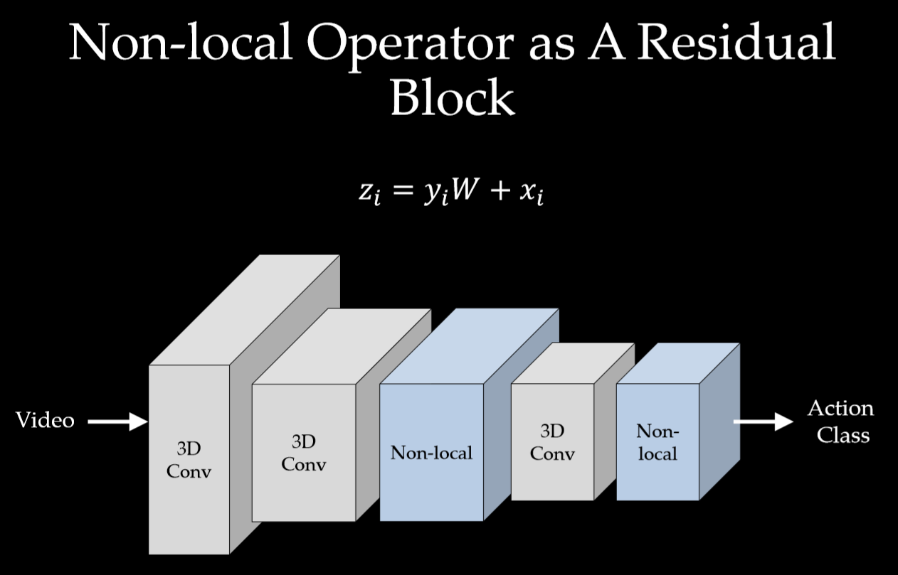

论文：   https://arxiv.org/abs/1711.07971v3 

作者：  [Xiaolong Wang](https://arxiv.org/search/cs?searchtype=author&query=Wang%2C+X), [Ross Girshick](https://arxiv.org/search/cs?searchtype=author&query=Girshick%2C+R), [Abhinav Gupta](https://arxiv.org/search/cs?searchtype=author&query=Gupta%2C+A), [Kaiming He](https://arxiv.org/search/cs?searchtype=author&query=He%2C+K) 

# Non-local Neural Networks

# 概述

文章从BM3D去噪算法中的`non-local means` 和`self-attention`出发，在`neural network`中考虑不同空间和时间位置上的特征之间的关系。`non-local`在一个位置的计算响应是输入特性图中所有位置的特征的加权总和。一组位置可以在空间、时间或时空上，适用于图像、序列和视频问题。

在深度神经网络中捕获`long-range dependencies`是非常重要的。对于序列数据，比如音频，语言文本，通常是使用循环网络来对`long-range dependencies`建模。对于图像数据，是通过不断堆叠卷积层以获得大的感受野来对`long-range dependencies`进行建模。

卷积运算和循环网络运算论是在空间上还是在时间上都是只处理一个局部邻域，因此，`long-range dependencies`只能在重复应用这些操作时捕获，这些操作通过数据逐步传播信号。但是这种重复操作有很多缺点或者限制。

首先，计算效率很低，第二，很依赖于训练技巧，很难优化，随着网络的深读增加，很导致梯度消失和梯度爆炸等问题。 最后，这些挑战使得多跳依赖关系建模（`multihop dependency modeling`）变得困难，例如，当需要在遥远的位置之间来回传递消息时。

使用Non-local有很多优势：

> 1. 与卷积操作和RNN相比， Non-local操作通过计算**任意**两个位置之间的交互来直接捕获`long-range dependencies`，而不管它们的位置距离的有多远。
> 2. Non-local很有效，即使只有很少的层（比如5层）也能取得最佳效果在一些实验中。
> 3.  Non-local操作的输入大小可变，并且可以轻松地与其他操作(例如，卷积)相结合。 

-----------

# Non-local Mean

NL-means去噪与常用的双线性滤波、中值滤波等利用图像局部信息来滤波不同的是，它利用了整幅图像来进行去噪，以图像块为单位在图像中寻找相似区域，再对这些区域求平均，能够比较好地去掉图像中存在的高斯噪声。  

------

#   Graphical models

  `Long-range dependencies`  可以通过图模型来进行建模，比如CRF。在深度神经网络的环境下，CRF可以被用来对语义分割预测结果的后处理操作。 CRF的迭代平均场推理可以转化为递归网络并进行训练 。

#   Self-attention  

论文的工作和机器翻译中的自注意力机制有关。自注意模块在一个 `embedding space`通过关注所有位置并取它们的加权平均值来计算序列(例如，一个句子)中某个位置的响应。 

#   Non-local Neural Networks  

上面的公式中，输入是x，输出是y，i 和 j 分别代表输入的某个空间位置， $x_i$ 是一个向量，维数跟x的`channel`数一样，$f$  是一个计算任意两点**相似关系**的函数，$g $ 是一个映射函数，将一个点映射成一个向量，可以看成是计算一个点的特征。$C(x)$  是一个`normalize`系数。也就是说，为了计算输出层的一个点，需要将输入的每个点都考虑一遍，而且考虑的方式很像`attention`：输出的某个点在原图上的`attention`，而`mask`则是由相似性给出。看下图： Non-local操作可以看成`attention` 

  

与卷积操作比较，卷积运算将一个局部邻域的加权输入相加，比如在一维卷积中，kernel size为3 的卷积核： $i -1 \le j \le i + 1$。 与循环网络比较，一个在时间 $i $ 递归操作的局部一般是基于当前状态和上一次的时间的状态。

Non-local与全连接网络也不一样， 在上述公式是根据不同位置之间的关系计算响应， 而fc是使用学习到的权重来计算的。换句话说， $x_i$ 和 $x_j$  之间的关系也不是在fc中输入数据的函数。而且， Non-local支持可变尺寸，并且输出的尺寸和输入的一样。

以图像为例，为了简化问题，作者简单地设置$g$函数为一个`1*1`的卷积： $g(x_j) = W_gx_j$ 。 相似性度量函数 $f$ 的选择有多种:

## Gaussian

$$
f(x_i,  x_j) = e^{\mathbf{x_i}^\mathsf{T} \mathbf{x_j}}
$$

$$
C(\mathbf{x}) = \sum_{\forall j} f(\mathbf{x_i, \mathbf{x_j}})
$$

$\mathbf{x_i}^\mathsf{T} \mathbf{x_j}$  是点积相似性，也可以用欧氏距离。但是点积在依稀额深度学习框架中实现起来更方便一些。

##   Embedded Gaussian  

是上一中的一个扩展，通过在一个嵌入空间中计算
$$
f(x_i,  x_j) = e^{\theta(\mathbf{x_i})\top \phi(\mathbf{x_j})}
$$

$$
\theta(\mathbf{x_i}) =  W_{\theta}\mathbf{x_i} \space\space, \space \phi(\mathbf{x_j}) = W_{\phi}{\mathbf{x_j}}
$$

$$
设： C(\mathbf{x}) = \sum_{\forall j} f(\mathbf{x_i, \mathbf{x_j}})
$$

 最近提出的用于机器翻译的自我注意模块《Attention is all you need》是Embedded Gaussian 版本中Non-local操作的一个特例。从中可以看出，对于  $i$ ,   $\frac{1}{ C(\mathbf{x})}f(\mathbf{x_i, \mathbf{x_j}})$  相当于对 $j$ 维进行`softmax`操作。所以：
$$
\mathbf{y} = softmax(\mathbf{x^{\top}}W_{\theta}^\top W_{\phi}\mathbf{x})g(\mathbf{x})
$$
这就是`self-attentiond` 的形式。

 ##  Dot product  

$$
f(x_i,  x_j) =\theta(\mathbf{x_i})\top \phi(\mathbf{x_j})
$$

$$
normalization factor： C\mathbf(x) =  N
$$

##   Concatenation  

  Relation Networks中的成对函数将连接用于视觉推理:
$$
f(\mathbf{x_i}, \mathbf{x_j}) = ReLu(\mathbf{w_f^T[\theta(x_i),  \phi(x_j)]}).
$$
 这相当于`embedded`的两个点拼接作为带ReLU激活函数全连接层的输入。它在`visual reasoning`中用的比较多。 

 后两种选择的归一化系数 $C(x)$选择为$\mathbf{x}$的点数，只是为了简化计算，同时，还能保证对任意尺寸的输入，不会产生数值上的尺度伸缩。 

 Embedding的实现方式，以图像为例，在文章中都采用1*1的卷积，也就是$\theta $和$\phi$都是卷积操作。 

## Non-local Block

 为了能让`non-local`操作作为一个组件，可以直接插入任意的神经网络中，作者把`non-local`设计成`residual block`的形式，让`non-local`操作去学习 x的`residual` 。
$$
\mathbf{z_i} = W_z\mathbf{y_i + x_i}
$$
$+\mathbf{x_i}$  表示残差连接。 $W_z$  实际上是一个卷积操作，它的输出`channel`数跟x一致。这样以来，non-local操作就可以作为一个组件，组装到任意卷积神经网络中。

# 实现

看下图：计算相似性

# 总结

1、单一的`non-local block`加在较浅层次效果显著。高层次丢失的信息太多了，找不到细小的远距离的联系，太模糊了。

2、多个`non-local block`加入，也就是加深`non-local`特性，有一定效果提升但不会很明显。

既然容易起作用的是在低层加，那么使劲加深意义不大，加多了这种东西就要考虑梯度消失和引入噪声。毕竟你把背景全都扔进来算。

3、时空同时`non-local`比单一时间维度或单一空间维度效果都要好。

4、`non-local`比`3D-CNN`要好。

# 参考

 https://zhuanlan.zhihu.com/p/33345791 