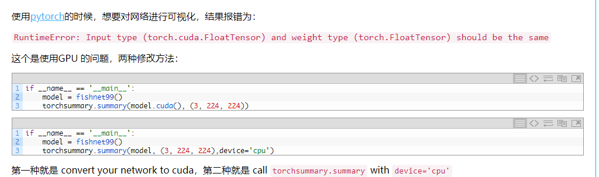

# 1.writer.add_graph(model, model_input)

```python
from torch.utils.tensorboard import SummaryWriter
writer = SummaryWriter('./run/exp')
```

使用TensorBoard对训练可视化，在增加模型的计算图的时候，报了以下错误：

```python
writer.add_graph(model, [dummy_input, dummy_input,dummy_input], verbose=True)
```


**RuntimeError: Input type (torch.cuda.FloatTensor) and weight type (torch.FloatTensor) should be the same**

 **输入的数据类型与网络参数的类型不符**。 

查询网上都说：



但是全都是bullshit！！！！！

正确解决方案：

```python
dummy_input = torch.rand(2, 3, 378,378)
writer.add_graph(model, [dummy_input.cuda(), dummy_input.cuda(), dummy_input.cuda()], verbose=True)
```

注意：`pytorch`模型不会记录其输入输出的大小，更不会记录每层输出的尺寸。

所以，`tensorbaord`需要一个假的数据 `data` （`dummy_input`）来探测网络各层输出大小，并指示输入尺寸。