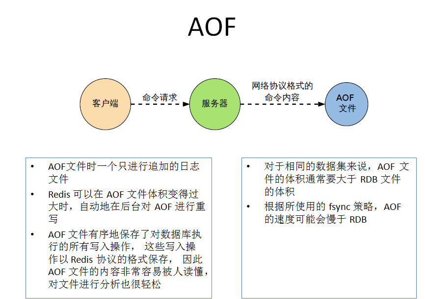

# Redis 的持久化

Redis是一个基于内存的数据库，这就体现了其易失性。内存中的数据当机器断电的时候就会消失，所以，持久化机制对于数据的完整性使至关重要的。

Redis提供了两种持久化机制，分别是分别是`RDB(Redis DataBase)`和`AOF(Append Only File)`。

Redis在以前的版本中是单线程的，而在6.0后对Redis的io模型做了优化，`io Thread`为多线程的，但是`worker Thread`仍然是单线程。

在Redis启动的时候就会去加载持久化的文件，如果没有就直接启动，在启动后的某一时刻继续持久化内存中产生的数据。

# RDB持久化机制

RDB持久化就是将当前进程的数据以生成快照的形式持久化到磁盘中。 它恢复时是将快照文件直接读到内存里。

RDB持久化的时候会单独fork一个与当前进程一摸一样的子进程来进行持久化，因此RDB持久化有如下特点：

1. 开机恢复数据快。
2. 写入持久化文件快。

Redis会单独创建（fork）一个子进程来进行持久化，会先将数据写入到一个临时文件中，待持久化过程都结束了，再用这个临时文件替换上次持久化好的文件。整个过程中，主进程是不进行任何IO操作的，这就确保了极高的性能。如果需要进行大规模数据的恢复，且对于数据恢复的完整性不是非常敏感，那RDB方式要比AOF方式更加的高效。RDB的缺点是最后一次持久化后的数据可能丢失

Fork的作用是复制一个与当前进程一样的进程。新进程的所有数据（变量、环境变量、程序计数器等）数值都和原进程一致，但是是一个全新的进程，并作为原进程的子进程。

RDB的持久化也是Redis默认的持久化机制，它会把内存中的数据以快照的形式写入默认文件名为`dump.rdb`中保存。 文件名可以咋Redis的配置文件redis.conf中进行配置。dafilename就是配置rdb的持久化文件名。

## RDB 的触发

1. save命令

   save命令不会fork子进程，通过阻塞当前Redis服务器，直到RDB完成为止，所以该命令在生产中一般不会使用。

   可以配置redis.conf文件中的dir，表示rdb持久化后生成的rdb二进制文件所在的位置。

2.  bgsave命令

   Redis会在后台**异步**进行快照操作， 命令会在后台fork一个与Redis主线程一摸一样的子线程，由子线程负责内存中的数据持久化。 快照同时还可以响应客户端请求。可以通过lastsave命令获取最后一次成功执行快照的时间。

3. 自动化

   除了上面在命令行使用save和bgsave命令触发持久化，也可以在`redis.conf`配置文件中，完成配置。

   ```bash
   save 900 1
   save 300 10
   save 60 100000
   ```

   在新安装的redis中由默认的以上三个save配置，`save 900 1`表示900秒内如果至少有1个key值变化，则进行持久化保存数据；  `save 300 10`则表示300秒内如果至少有10个key值发生变化，则进行持久化，`save 60 10000`以此类推。 

## save和bgsave的对比

1. save是**同步**持久化数据，而bgsave是**异步**持久化数据。
2. `save`不会fork子进程，通过**主进程**持久化数据，会**阻塞**处理客户端的请求，而`bgsave`会`fork`子进程持久化数据，同时还可以处理客户端请求，高效。
3. save**不会消耗内存**，而bgsave**会消耗内存**。因为会fork新进程。

## RDB优势和劣势

 **缺点：** RDB持久化后的文件是紧凑的二进制文件，适合于备份、**全量复制**、大规模数据恢复的场景，对数据完整性和一致性要求不高，RDB会丢失最后一次快照的数据。也即在一定间隔时间做一次备份，所以如果redis意外down掉的话，就会丢失最后一次快照后的所有修改。而且如果使用的bgsave的话，Fork的时候，内存中的数据被克隆了一份，大致2倍的膨胀性需要考虑。

 **优点：** 开机的恢复数据快，写入持久化文件快。 


---


# AOF持久化机制

AOF持久化机制是以日志的形式记录Redis中的每一次的**增删改**操作，**不会记录查询操作**，以文本的形式记录，打开记录的日志文件就可以查看操作记录。只许追加文件但不可以改写文件，redis启动之初会读取该文件重新构建数据，换言之，redis重启的话就根据日志文件的内容将写指令从前到后执行一次以完成数据的恢复工作。

AOF默认不开启，开启需要配置redis.conf中的 appendonly no 修改为 appendonly yes， 也可以配置文件名，通过appendonly.aof， 当然，也可以配置dir。

## AOF触发机制

AOF带来的持久化更加安全可靠，默认提供**三种**触发机制，如下所示：

1. `no`：表示等操作系统等数据缓存同步到磁盘中（快、持久化没保证）。
2. `always`：同步持久化，每次发生数据变更时，就会立即记录到磁盘中（慢，安全）。
3. `everysec`：表示每秒同步一次（默认值，很快，但是会丢失一秒内的数据）。

AOF中每秒同步也是异步完成的，**效率是非常高**的，由于该机制对日志文件的写入操作是采用`append`的形式。

在redis中配置 appendfsync always。在写入的过程即使宕机，也不会丢失已经存入日志文件的数据，数据的完整性是非常高的。

## AOF的重写机制

AOF采用文件追加方式，文件会越来越大为避免出现此种情况，新增了重写机制，当AOF文件的大小超过所设定的阈值时，Redis就会启动AOF文件的内容压缩，只保留可以恢复数据的最小指令集。

导致aof文件增大的无效的操作有很多， 举个例子，比如某一时刻对一个k++，然后后面的某一时刻k--，这样k的值是保持不变的，那么这两次的操作就是无效的。  如果像这样的无效操作很多，记录的文件臃肿，就浪费了资源空间，所以在Redis中出现了`rewrite`机制。 

redis提供了`bgrewriteaof`命令。将内存中的数据以命令的方式保存到临时文件中，同时会fork出一条新进程来将文件重写。  重写AOF的日志文件不是读取旧的日志文件瘦身，而是将内存中的数据用**命令的方式重写**一个AOF文件，重新保存替换原来旧的日志文件，因此内存中的数据才是最新的。 

重写操作也会`fork`一个子进程来处理重写操作，重写以内存中的数据作为重写的源，避免了操作的冗余性，保证了数据的最新。

执行`set k1 1`的命令，此命令映射到文件中的命令如下：

```bash
*3 //表示该命令有三组 set为一组 k1为一组 1为一组
$3 // 表示 set 有三个字符
set // 表示执行了set命令
$2 // 表示k1有两个字符
k1 // key值
$1 // 便是value值的字符长度为1
1  // value值
```

当AOF的日志文件增长到一定大小的时候Redis就能够`bgrewriteaof`对日志文件进行重写瘦身。当AOF配置文件大于改配置项时自动开启重写（这里指超过原大小的100%）。 

该配置可以通过如下的配置项进行配置： 

```bash
auto-aof-rewrite-percentage 100
auto-aof-rewrite-min-size 64m
```

Redis会记录上次重写时的AOF大小，默认配置是当AOF文件大小是上次rewrite后大小的一倍且文件大于64M时触发。

## AOF的优缺点

每修改同步：appendfsync always   同步持久化 每次发生数据变更会被立即记录到磁盘  性能较差但数据完整性比较好

每秒同步：appendfsync everysec    异步操作，每秒记录   如果一秒内宕机，有数据丢失

不同步：appendfsync no   从不同步

**优点**：  AOF更好保证数据不会被丢失，**最多只丢失一秒内的数据**，通过fork一个子进程处理持久化操作，保证了主进程不会进程**io**操作，能高效的处理客户端的请求。

另外重写操作保证了数据的有效性，即使日志文件过大也会进行重写。

**AOF的日志文件的记录可读性非常的高，即使某一时刻有人执行`flushall`清空了所有数据，只需要拿到`aof`的日志文件，然后把最后一条的`flushall`给删除掉，就可以恢复数据。**

 **缺点：** 对于相同数量的数据集而言，AOF文件通常要大于RDB文件。RDB 在恢复大数据集时的速度比 AOF 的恢复速度要快。AOF在运行效率上往往会慢于RDB。 




# 混合持久化

在redis4.0后混合持久化（`RDB+AOF`）对重写的优化，4.0版本的混合持久化默认是关闭的，可以通过以下的配置开启混合持久化： 

```bash
aof-use-rdb-preamble no
```

混合持久化也是通过`bgrewriteaof`来完成的，不同的是当开启混合持久化时，`fork`出的子进程先将共享内存的数据以`RDB`方式写入`aof`文件中，然后再将重写缓冲区的增量命令以`AOF`方式写入文件中。  写入完成后通知主进程统计信息，并将新的含有RDB格式和AOF格式的AOF文件替换旧的AOF文件。简单的说：新的AOF文件前半段是以RDB格式的全量数据后半段是AOF格式的增量数据。

**优点：** 混合持久化结合**RDB持久化**和**AOF持久化**的优点，由于绝大部分的格式是RDB格式，加载速度快，增量数据以AOF方式保存，数据更少的丢失。 


# 总结

1. RDB持久化方式能够在指定的时间间隔能对你的数据进行快照存储
2. AOF持久化方式记录每次对服务器写的操作，当服务器重启的时候会重新执行这些命令来恢复原始的数据。AOF命令以Redis协议追加保存每次写的操作到文件末尾。Redis还能对AOF文件进行后台重写，使得AOF文件的体积不至于过大。
3. 只做缓存：如果你只希望你的数据在服务器运行的时候存在，你也可以不使用任何持久化方式。
4. 如果同时开启两种持久化方式，在这种情况下，当redis重启的时候会**优先载入AOF文件**来恢复原始的数据，因为在通常情况下AOF文件保存的数据集要比RDB文件保存的数据集要完整。
5. RDB的数据不实时，同时使用两者时服务器重启也只会找AOF文件。那要不要只使用AOF呢？作者建议不要，因为RDB更适合用于备份数据库(AOF在不断变化不好备份)，快速重启，而且不会有AOF可能潜在的bug，留着作为一个万一的手段。


# 性能建议

因为RDB文件只用作后备用途，建议只在Slave上持久化RDB文件，而且只要15分钟备份一次就够了，只保留save 900 1这条规则。

如果Enalbe AOF，好处是在最恶劣情况下也只会丢失不超过两秒数据，启动脚本较简单只load自己的AOF文件就可以了。代价一是带来了持续的IO，二是AOF rewrite的最后将rewrite过程中产生的新数据写到新文件造成的阻塞几乎是不可避免的。只要硬盘许可，应该尽量减少AOF rewrite的频率，AOF重写的基础大小默认值64M太小了，可以设到5G以上。默认超过原大小100%大小时重写可以改到适当的数值。

如果不Enable AOF ，仅靠Master-Slave Replication 实现高可用性也可以。能省掉一大笔IO也减少了rewrite时带来的系统波动。代价是如果Master/Slave同时倒掉，会丢失十几分钟的数据，启动脚本也要比较两个Master/Slave中的RDB文件，载入较新的那个。新浪微博就选用了这种架构。

# Redis是怎么持久化的？服务主从数据怎么交互的？

RDB做镜像全量持久化，AOF做增量持久化。因为RDB会耗费较长时间，不够实时，在停机的时候会导致大量丢失数据，所以需要AOF来配合使用。在redis实例重启时，会使用RDB持久化文件重新构建内存，再使用AOF重放近期的操作指令来实现完整恢复重启之前的状态。 

**不过Redis本身的机制是 AOF持久化开启且存在AOF文件时，优先加载AOF文件；AOF关闭或者AOF文件不存在时，加载RDB文件；加载AOF/RDB文件完成后，Redis启动成功；AOF/RDB文件存在错误时，Redis启动失败并打印错误信息** 

## 如果突然机器掉电会怎样？

取决于AOF日志`sync`属性的配置，如果不要求性能，在每条写指令时都`sync`一下磁盘，就不会丢失数据。但是在高性能的要求下每次都sync是不现实的，一般都使用定时sync，比如1s1次，这个时候最多就会丢失1s的数据。

# 参考

1. [一不小心肝出了4W字的Redis面试教程](https://mp.weixin.qq.com/s?__biz=MzAxNjM2MTk0Ng==&mid=2247492908&idx=2&sn=c267f0a64a0351c04ec90aee67adea53&chksm=9bf75599ac80dc8f4dd0c0c7e26d02687d9b2d09c65e31cbbe93e7538141a31717ddb092d3d0&mpshare=1&scene=24&srcid=0910zUE11c03LEUNb2MMQlcQ&sharer_sharetime=1599710287928&sharer_shareid=aeb401628295afea2c86016b3d2e688a&key=c3402f98b9ff36461430d990546f29bfee944ed635248dc88054dbf8009b06d8618ec57a50704ad9bb8a909c006789d1e5b3746ef9e424bc694da2f72645940c7643236ec0f2c6161f1529cd0b7766464850db79ab9570fb2ad0b0a7f3e3dcb4648db6b2d653b7497ff50dc767275e4a8c36f99b2e92233b4fca409ac156c633&ascene=14&uin=MjY3ODQ2NDEwMA%3D%3D&devicetype=Windows+10+x64&version=62090538&lang=zh_CN&exportkey=AdPC4RHJGpcux7aZXd97k0Y%3D&pass_ticket=i7dXOrdw4RePybTZOo6ZJhWekdu7HluH0I8XZTjYjDnJGqh1XgpinBI8xO777jWR&wx_header=0)

