# Servlet 概述

狭义的 `Servlet` 是指 Java 语言实现的一个接口，广义的 `Servlet` 是指 任何实现了这个 Servlet 接口的类，一般情况下，人们将 `Servlet` 理解为后者。 `Servlet` 运行于支持 Java 的应用服务器中。从原理上讲，Servlet 可以响应任何类型的请求，但绝大多数情况下 Servlet 只用来扩展基于 HTTP 协议的 Web 服 务器。

Servlet的特点是：运行在支持java的应用服务器上， 并且`Servlet`的实现遵循了服务器能够识别的规则，也就是服务器会自动 的根据请求调用对应的`servlet`进行请求处理。

# 在idea中创建一个Web应用

1.  new-->project-->web Application

   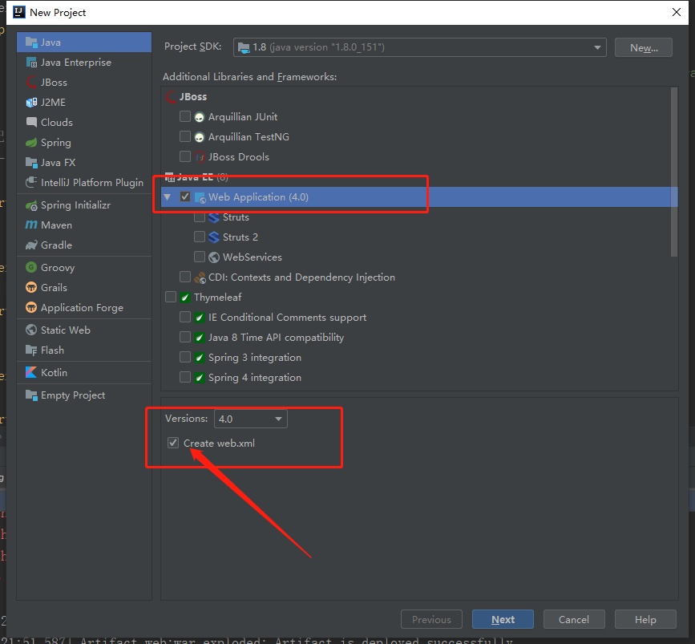

2. 填上项目名称

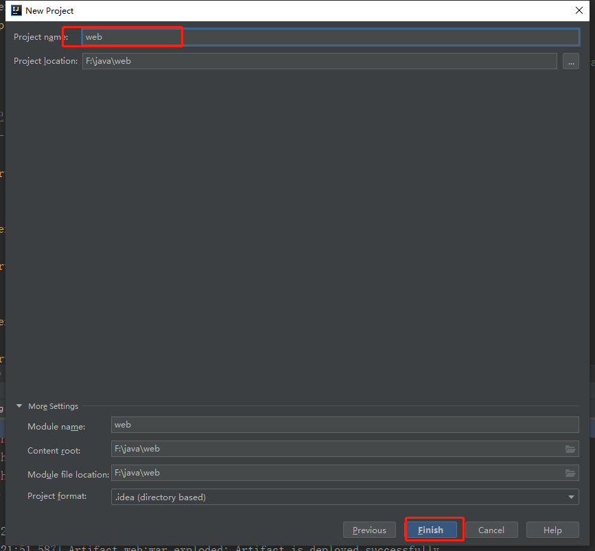

3. 可以看到idea的文件目录， 注意和Myeclipse区分

   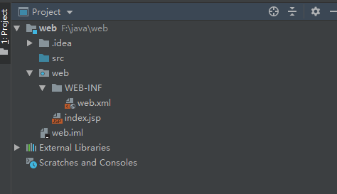

4. 创建classes和lib文件

   

   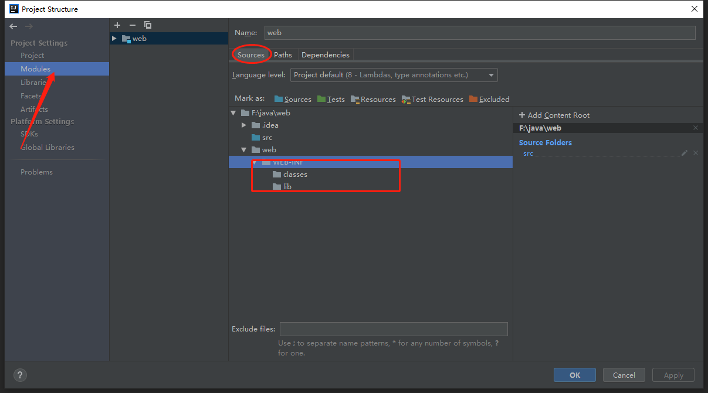

   classes 存放编译好的class文件，lib存放所需要的jar包。所以要进一步配置编译目录和lib目录。

   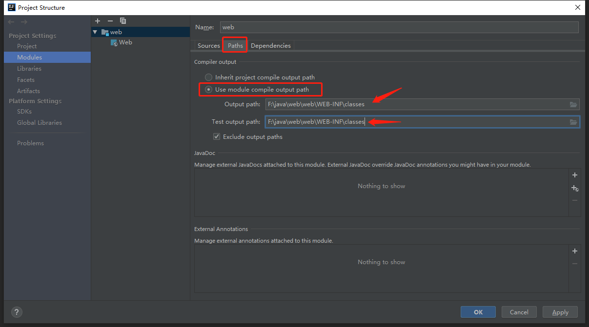

   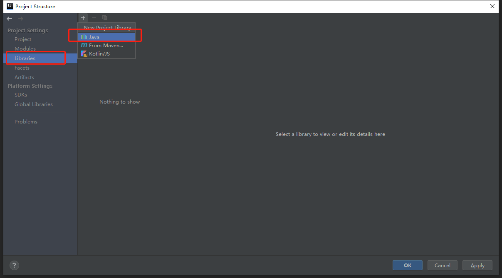

   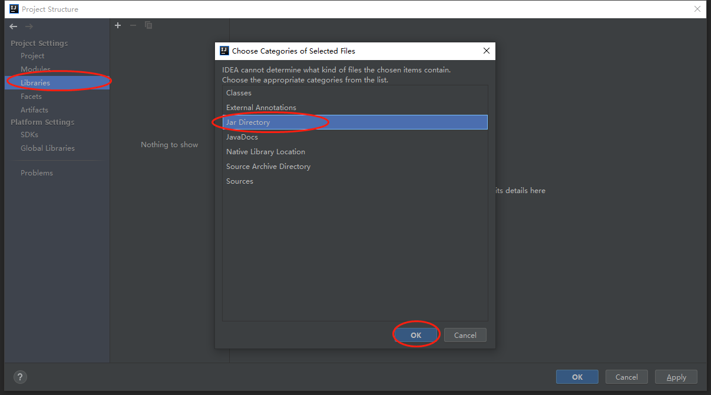

5. 配置tomcat服务器

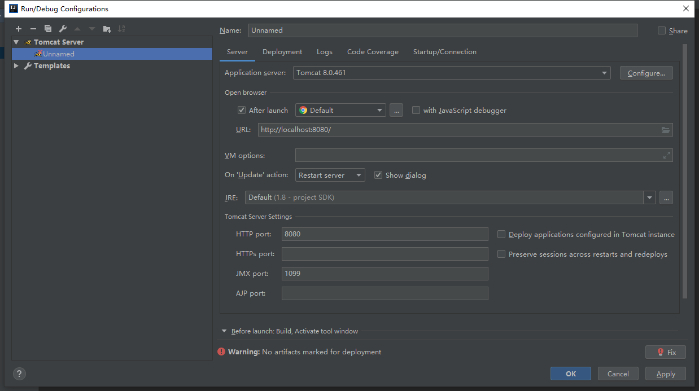

---------------------


# 创建一个Servlet

## 步骤

1. 编写java类，继承`HttpServlet`类

2.  重写`doGet`和`doPost`方法

3. `Servlet`程序交给tomcat服务器运行！！

   ​	3.1 `servlet`程序的class码拷贝到`WEB-INF/classes`目录

   ​	3.2 在`web.xml`文件中进行配置

   ```xml
   <!-- 配置一个servlet -->
     <!-- servlet的配置 -->
     <servlet>
     	<!-- servlet的内部名称，自定义。尽量有意义 -->
     	<servlet-name>FirstServlet</servlet-name>
     	<!-- servlet的类全名： 包名+简单类名 -->
     	<servlet-class>com.first.servlet.FirstServlet</servlet-class>
     </servlet>
     
     
     <!-- servlet的映射配置 -->
     <servlet-mapping>
     	<!-- servlet的内部名称，一定要和上面的内部名称保持一致！！ -->
     	<servlet-name>FirstServlet</servlet-name>
     	<!-- servlet的映射路径（访问servlet的名称） -->
     	<url-pattern>/first</url-pattern>
     </servlet-mapping>
   
   ```

## 运行一个servlet

首次访问 URL： http://localhost:8080/web/first

tomcat服务器启动时，首先加载`webapps`中的每个web应用的web.xml配置文件。

**http://** :  http协议

**localhost**:  到本地的`hosts`文件中查找是否存在该域名对应的IP地址127.0.0.1

**8080**：  找到tomcat服务器

**/web**：   在tomcat的webapps目录下找 web的目录

**/first**  :资源名称。

>  1）在web的`web.xml`中查找是否有匹配的`url-pattern`的内容（/first）
>
> 2）如果找到匹配的`url-pattern`,则使用当前`servlet-name`的名称到`web.xml`文件中查询是否相同名称的`servlet`配置
>
> 3）如果找到，则取出对应的`servlet`配置信息中的`servlet-class`内容：
>
> ​		字符串： **com.first.servlet.FirstServlet**

**通过反射：**

        1.   构造`FirstServlet`的对象
           2.   然后调用`FirstServlet`里面的方法

------------


## Servlet的映射路径

```xml
<servlet-mapping>
  	<!-- servlet的内部名称，一定要和上面的内部名称保持一致！！ -->
  	<servlet-name>FirstServlet</servlet-name>
  	<!-- servlet的映射路径（访问servlet的名称） -->
  	<url-pattern>/first</url-pattern>
  </servlet-mapping>

```

### 精确匹配 

| url-pattern  |              浏览器输入               |
| :----------: | :-----------------------------------: |
|    /first    |    http://localhost:8080/web/first    |
| /hello/first | http://localhost:8080/web/hello/first |

### 模糊匹配  

*代表通配符

| url-pattern |                        浏览器输入                         |
| :---------: | :-------------------------------------------------------: |
|     /*      |          http://localhost:8080/web/**任意路径**           |
|  /hello/*   |       http://localhost:8080/web/hello/**任意路径**        |
|    *.do     |         http://localhost:8080/web/**任意路径.do**         |
|  *.action   |       http://localhost:8080/web/**任意路径.action**       |
|   *.html    | http://localhost:8080/web/**任意路径.html**    【伪静态】 |

> 注意： 
>
> 1. url-pattern要么以 / 开头，要么以*开头。 例如， hello是非法路径。
> 2. 不能同时使用两种模糊匹配，例如 /hello/*.do是非法路径
> 3. 当有输入的URL有多个servlet同时被匹配的情况下：
>    1.  精确匹配优先。（长的最像优先被匹配）
>    2.  以后缀名结尾的模糊`url-pattern`优先级最低！！！


----------


## Servlet 的缺省路径

servlet的缺省路径（<url-pattern>/</url-pattern>）是在tomcat服务器内置的一个路径。该路径对应的是一个**DefaultServlet**（缺省Servlet）。这个缺省的Servlet的作用是用于解析web应用的静态资源文件。

比如： URL输入http://localhost:8080/web/index.html 如何读取文件？

​          1）到当前web应用下的`web.xml`文件查找是否有匹配的`url-pattern`。

​          2）如果没有匹配的`url-pattern`，则交给tomcat的内置的`DefaultServlet`处理

​          3）DefaultServlet程序到web应用的**根目录**下查找是存在一个名称为`index.html`的静态文件。

​          4）如果找到该文件，则读取该文件内容，返回给浏览器。

​          5）如果找不到该文件，则返回**404**错误页面。

所以，先找动态的资源，再找静态的资源。

-------------------


# Servlet的生命周期【重要！！！】

`servlet`类对象什么时候创建，什么时候调用什么方法，什么时候销毁。

`Servlet`程序的生命周期由tomcat服务器控制的！！！！   

> Servlet的生命周期：
>
> 1、从第一次调用到服务器关闭。 
>
> 2、如果Servlet在`web.xml`中配置了**load-on-startup**，生命周期为 从服务器启动到服务器			关闭  【Servlet 的自动加载】


## Servlet的生命周期方法

1. **构造方法**： 创建`servlet`对象的时候调用。默认情况下，第一次访问`servlet`的时候创建`servlet`对象 只调用1次。**证明servlet对象在tomcat是单实例的。**
2. `init`方法： 创建完`servlet`对象的时候调用。**只调用1次。**
3. `service`方法： 每次发出请求时调用。调用**n次**。
4. `destroy`方法： 销毁`servlet`对象的时候调用。停止服务器或者重新部署web应用时销毁servlet对象。**只调用1次。**

##          servlet的生命周期过程

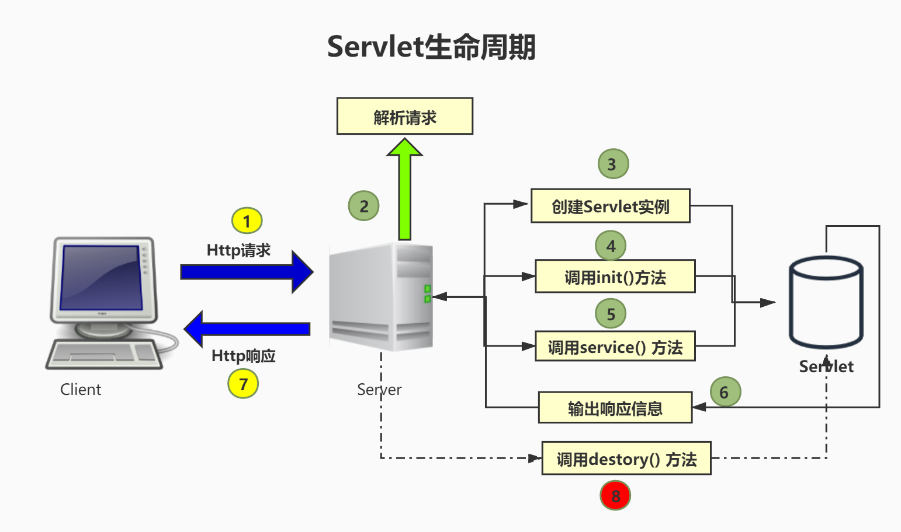

Servlet对象的生命周期是交给Tomcat服务器来管理的。在tomcat服务器内部代码执行过程：

1. 服务器启动的时候， 加载web.xml文件，通过xml文件的解析，在<servlet-mapping>下得到servlet-class的内容，**字符串**：`com.first.servlet.FirstServlet`。

2. 通过反射机制俩构造FirstServlet对象：

   > 1. 得到字节码对象
   >
   >    Class clazz = Class.forName("com.first.servlet.FirstServlet")；
   >
   > 2. 调用无参数的构造方法来构造对象
   >
   >    Object obj = clazz.clazz.getDeclaredConstructor().newInstance();    
   >
   >    **【servlet的构造方法被调用】**

3. 创建ServletConfig对象，再通过反射调用init方法

   > 1. 得到方法对象
   >
   >    Method init = clazz.getDeclaredMethod("init", ServletConfig.class);
   >
   > 2. 调用方法
   >
   >    init.invoke(obj, servletConfig);
   >
   >    **【servlet 的 init方法被调用】**

   

   4.创建request对象和response对象， 通过反射调用service方法

   > 1. 得到方法对象
   >
   >    Method service = clazz.getDeclaredMethod("service", HttpServletRequest.class, HttpServletResponse.class);
   >
   > 2. 调用方法
   >
   >    service.invoke(obj, request, response);
   >
   >    **【servlet 的 service方法被调用】**

   5.当tomcat服务器停止或者web应用重新部署，通过反射调用destroy方法

   > 1. 得到方法对象
   >
   >    ```java
   >    Method destroy = clazz.getDeclaredMethod("destroy");
   >    ```
   >
   > 2. 调用
   >
   >    destroy.invoke();
   >
   >    **【servlet 的 destroy方法被调用】**

   下面是一个时序图，完整地描述了`Servlet`的生命周期

   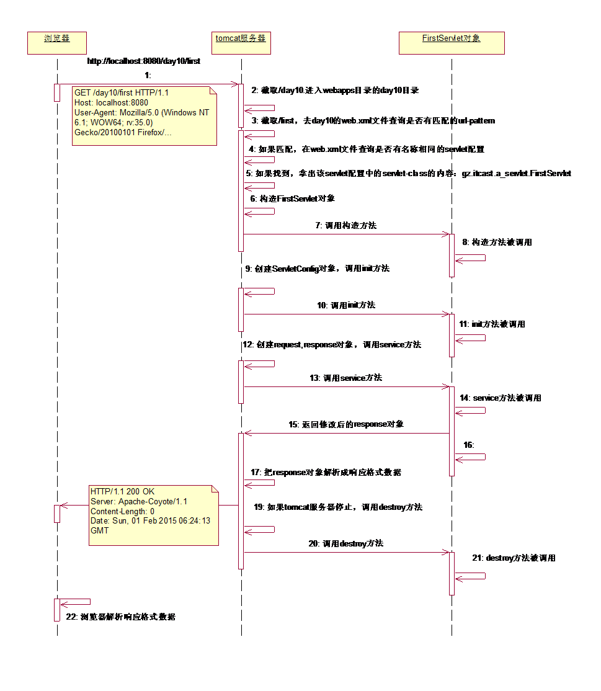

## Servlet的自动加载

​		默认情况下，第一次访问servlet的时候创建servlet对象。如果servlet的构造方法或init方法中执行了比较多的逻辑代码，那么导致用户第一次访问sevrlet的时候比较慢。

​		可以改变Servlet创建的时机：**提前到加载web应用的时候**

​		在Servlet的配置信息中，加上<load-on-startup>即可。

```xml
<servlet>
    <servlet-name>ServletLife</servlet-name>
    <servlet-class>com.first.servlet.ServletLife</servlet-class>
    <!-- 让servlet对象自动加载 -->
 <load-on-startup>1</load-on-startup>  注意： 整数值越大，创建优先级越低！！
  </servlet>

```

启动tomcat的时候，可以看到以下输出信息：

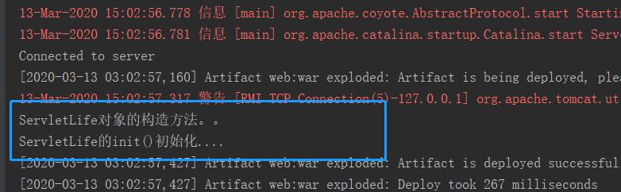


-------

#          有参的init方法和无参的init方法  

```java
import javax.servlet.ServletConfig;
import javax.servlet.ServletException;
import javax.servlet.http.HttpServlet;
/**
 * 有参数的init和无参的init方法
 *
 */
public class InitDemo extends HttpServlet {
		
	@Override
	public void init() throws ServletException {
		System.out.println("无参数的init方法");
	}
}
```

有参数的init方法：是servlet的生命周期方法，一定会被tomcat服务器调用

无参数的init方法：该方法是servlet的编写初始化代码的方法。是Sun公司设计出来专门给开发者进行覆盖，然后在里面编写servlet的初始逻辑代码的方法。

 **注意：如果要编写初始代码，不需要覆盖有参数的init方法**

可以看servlet的源码：

```java
    public void init(ServletConfig config) throws ServletException {
        this.config = config;
        this.init();
    }

    public void init() throws ServletException {
    }

```

-------


#          Servlet的多线程并发问题  

Servlet对象在tomcat服务器是单实例多线程的 。

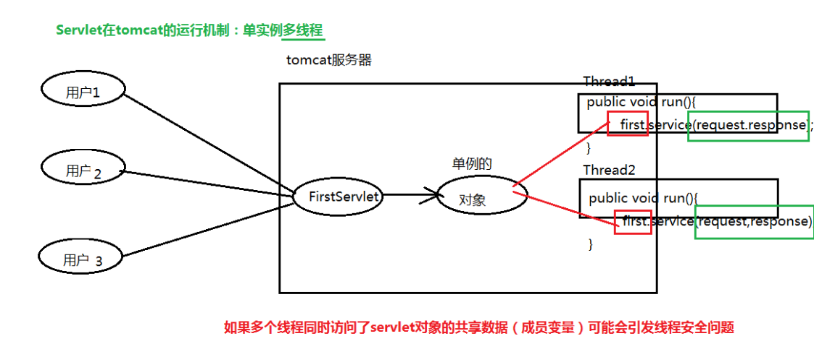

因为servlet是多线程的，所以当多个servlet的线程同时访问了servlet的共享数据，如成员变量，可能会引发线程安全问题。

解决办法：

> 1）把使用到共享数据的代码块进行同步（使用`synchronized`关键字进行同步）
>
>  2）建议在servlet类中尽量不要使用成员变量。如果确实要使用成员，必须同步。而且尽量缩小同步代码块的范围。（哪里使用到了成员变量，就同步哪里！！），以避免因为同步而导致并发效率降低。

----


# ServletConfig对象

Servlet的配置对象，是一个接口

```java
package javax.servlet;
import java.util.Enumeration;
public interface ServletConfig {
    public String getServletName();
    public ServletContext getServletContext();
    public String getInitParameter(String name);
    public Enumeration<String> getInitParameterNames();
}

```

```java
public abstract class GenericServlet implements Servlet, ServletConfig,
        java.io.Serializable {

    private static final long serialVersionUID = 1L;

    private transient ServletConfig config;
 }
```


## 作用

`ServletConfig`对象: 主要是用于加载servlet的初始化参数。在一个web应用可以存在多个`ServletConfig`对象（**一个Servlet对应一个ServletConfig对象**）。

## 对象的创建与获取

**创建时机**： 在创建完`servlet`对象之后，在调用`init`方法之前创建。

**获取对象**： 直接从有参数的`init`方法中得到。

## Servlet的初始化参数配置

在web.xml的<servlet></servlet>中配置：

```xml
    <servlet>
        <servlet-name>config</servlet-name>
        <servlet-class>com.first.servlet.config.ConfigDemo</servlet-class>
 <!-- 配置初始化参数 ,这些参数会封装ServletConfig对象中在init方法初始化 -->
        <init-param>
            <param-name>path</param-name>
            <param-value>f:/a.txt</param-value>
        </init-param>
    </servlet>
    <servlet-mapping>
        <servlet-name>config</servlet-name>
        <url-pattern>/cfg</url-pattern>
    </servlet-mapping>
```

注意： `servlet`的参数只能由当前的这个`sevlet`获取！！！！

ServletConfig的API：

> java.lang.String getInitParameter(java.lang.String name) 根据参数名获取参数值
>
> java.util.Enumeration getInitParameterNames()  获取所有参数
>
> ServletContext getServletContext()   得到servlet上下文对象
>
> java.lang.String getServletName()    得到servlet的名称

其实在HttpServlet所继承的GenericServlet类中，直接提供了上述的API，可以直接通过this关键字调用上面的方法，而不需要先获取ServletConfig对象。

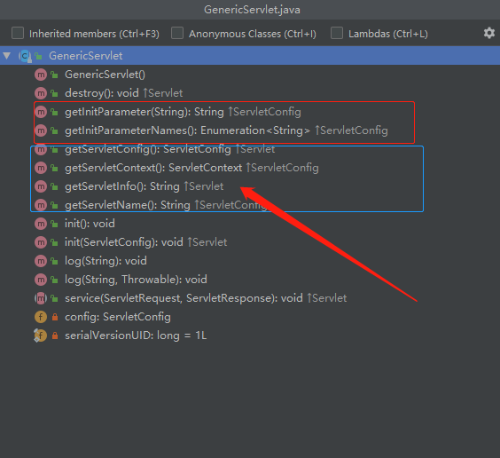

```java
/**
 * @author Hongliang Zhu
 * @create 2020-03-14 9:33
 */
public class ConfigDemo extends HttpServlet {

    @Override
    protected void doGet(HttpServletRequest req, HttpServletResponse resp) throws ServletException, IOException {

        // 读取Servlet的初始化的参数
//        String path = config.getInitParameter("path");
        String path1 = this.getServletConfig().getInitParameter("path");  // 也可以
        String path = this.getInitParameter("path"); //获取初始化参数
        File file = new File(path);
        BufferedReader br = new BufferedReader(new FileReader(file));
        String str= "";
        while ((str = br.readLine()) != null){
            String gbk = new String(str.getBytes("GBK"), "UTF-8");
            System.out.println(gbk);
        }

        String servletName = this.getServletName(); //当前servlet的名字，在web.xml 中的<servlet-name></servlet-name>中的名字
        System.out.println(servletName);

    }
}

```


-----------


# ServletContext对象

```java
public interface ServletContext {

    public static final String TEMPDIR = "javax.servlet.context.tempdir";

    /**
     * @since Servlet 3.0
     */
    public static final String ORDERED_LIBS = "javax.servlet.context.orderedLibs";

    /**
     * Return the main path associated with this context.
     *
     * @return The main context path
     *
     * @since Servlet 2.5
     */
    public String getContextPath();
}
```


## 作用

`ServletContext`对象 ,叫做Servlet的上下文对象。表示一个当前的web应用环境。**一个web应用中只有一个`ServletContext`对象。**

注意与ServletConfig对象区分，一个Servlet对应一个ServletConfig对象，一个web应用里面可以有多个Servlet，但是一个web应用程序只能有一个ServletContext对象。可以将web.xml文件的整个信息封装到ServletContext对象。


## 对象创建和得到

创建时机：加载`web`应用时创建`ServletContext`对象。

得到对象： 从`ServletConfig`对象的`getServletContext`方法得到

那么问题来了，为啥要从ServletConfig对象中得到ServletContext对象呢？因为ServletContext对象是在tomcat服务器启动的时候就已经创建好了，而ServletConfig对象实在Servlet构建之后，调用init方法之前创建的。所以ServletContext是优先于ServletConfig对象创建的。

如果我们自己设计获取ServletContext对象，可能会这样设计：

```java
// 创建ServletConfig对象
public void init( ServletConfig config, ServletContext context ){  //多了一个参数
	得到ServletConfig对象;
	得到ServletContext对象;
}

```

上面的设计会多了一个参数，因为`ServletContext`是整个web程序的全局的对象，而每个`Servlet`各自有自己的`ServletConfig`对象，如果每个`Servlet`都要这样这样传递`ServletContext`对象的话，未免过于麻烦，所以，我觉得`sun`公司设计的时候应该是如下设计的：

1. 首先创建`ServletContext`对象 : `ServletContext = context = new ServletContext();`   这是在服务器启动的时候就创建了。

2. 创建ServletConfig对象：

   ```java
   ServletConfig config = new ServletConfig();
   config.setServletContext(context); // 设置ServletContext
   
   interface ServletConfig{
       ServletContext context;
       
       public ServletContext getServletContxt(){
   		return contxt;
   	}
   
   }
   
   public void init( ServletConfig config ){
   	得到ServletConfig对象
   	从ServletConfig对象中得到ServletContext对象
   	SerlvetContext context = config.getServletContext();
   	}
   
   
   ```

## ServletContext对象的核心API(作用)

| 方法                                                | 作用                        |
| --------------------------------------------------- | --------------------------- |
| String getContextPath()                             | **得到当前web应用的路径**   |
|                                                     |                             |
| String getInitParameter(String name)                | **得到web应用的初始化参数** |
| Enumeration getInitParameterNames()                 |                             |
|                                                     |                             |
| void setAttribute(String name, Object object)       | **域对象有关的方法**        |
| Object getAttribute(String name)                    |                             |
| removeAttribute(String name)                        |                             |
|                                                     |                             |
| RequestDispatcher getRequestDispatcher(String path) | **转发（类似于重定向）**    |
|                                                     |                             |
| String getRealPath(String path)                     | **得到web应用的资源文件**   |
| InputStream getResourceAsStream(String path)        |                             |


### **得到当前web应用的路径**

String getContextPath()： 通常在请求重定向的时候用

```java
     // 得到ServletContext对象
        ServletContext servletContext = this.getServletContext();
        // 得到web路径
        String contextPath = servletContext.getContextPath();

        System.out.println(contextPath);

        resp.sendRedirect(contextPath+"/testMethod.html"); // 自动找到当前运行的web目录
```

### 得到web应用的初始化参数

在web.xml文件中配置web应用参数，是在所有<servlet></servlet>外面配置：

```xml
<?xml version="1.0" encoding="UTF-8"?>
<web-app xmlns="http://xmlns.jcp.org/xml/ns/javaee"
         xmlns:xsi="http://www.w3.org/2001/XMLSchema-instance"
         xsi:schemaLocation="http://xmlns.jcp.org/xml/ns/javaee http://xmlns.jcp.org/xml/ns/javaee/web-app_4_0.xsd"
         version="4.0">

<!--  配置web应用参数   -->
    <context-param>
        <param-name>name</param-name>
        <param-value>Tom</param-value>
    </context-param>
    <context-param>
        <param-name>school</param-name>
        <param-value>BJTU</param-value>
    </context-param>

    <servlet>
        <servlet-name>context</servlet-name>
        <servlet-class>com.first.servlet.context.contextDemo</servlet-class>

    </servlet>
    <servlet-mapping>
        <servlet-name>context</servlet-name>
        <url-pattern>/text</url-pattern>
    </servlet-mapping>


</web-app>
```

```java
 // 得到web应用参数
Enumeration<String> initParameterNames = servletContext.getInitParameterNames();

while (initParameterNames.hasMoreElements()){
    String s = initParameterNames.nextElement();
    String initParameter = servletContext.getInitParameter(s);
    System.out.println(s+":"+initParameter);
}
```

### 域对象有关的方法

**域对象**：作用是用于保存数据，获取数据。可以在不同的动态资源之间共享数据。  

两个Servlet之间共享数据可以通过传递参数的方式：

response.sendRedirect（“/servlet2?name=tom”）

然后在servlet2中调用request.getParameter("name")；获取数据

但是这种方式只能传递字符串，如果要传递一个对象呢？这就不行了，所以，域对象的作用就凸显了，**域对象可以共享任何类型的数据**。ServletContext就是一个域对象。

> 保存数据：void setAttribute(java.lang.String name, java.lang.Object object)                      
>
> 获取数据： java.lang.Object getAttribute(java.lang.String name)  
>
> 删除数据： void removeAttribute(java.lang.String name) 

**ServletContext域对象：作用范围在整个web应用中有效！**


### 转发

`RequestDispatcher getRequestDispatcher(java.lang.String path)`

```java
 // 转发
RequestDispatcher rd = this.getServletContext().getRequestDispatcher("/testMethod.html");
rd.forward(req,resp);
```

 1）**转发**

​                    a）地址栏不会改变

​                    b）转发只能转发到当前web应用内的资源

​                    c）可以在转发过程中，可以把数据保存到`request`域对象中

 

2）**重定向**             

​                   a）地址栏会改变，变成重定向到地址。

​                   b）重定向可以跳转到当前web应用，或其他web应用，甚至是外部域名网站。

​                   c）不能在重定向的过程中把数据保存到`request`中。

> 结论： 如果要使用`request`域对象进行数据共享，只能用转发技术！