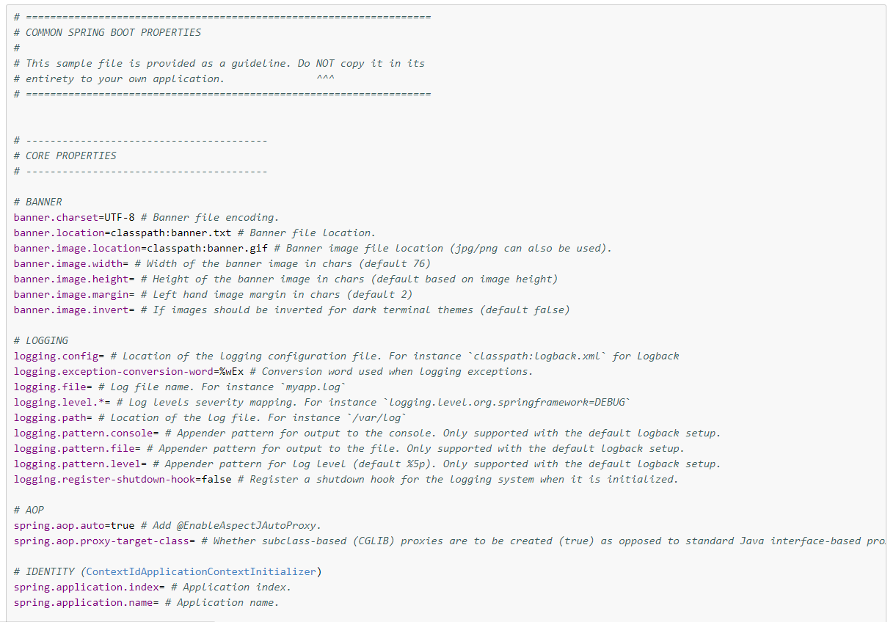
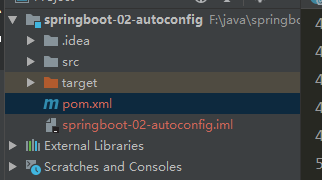
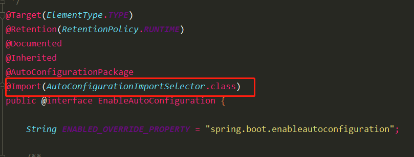
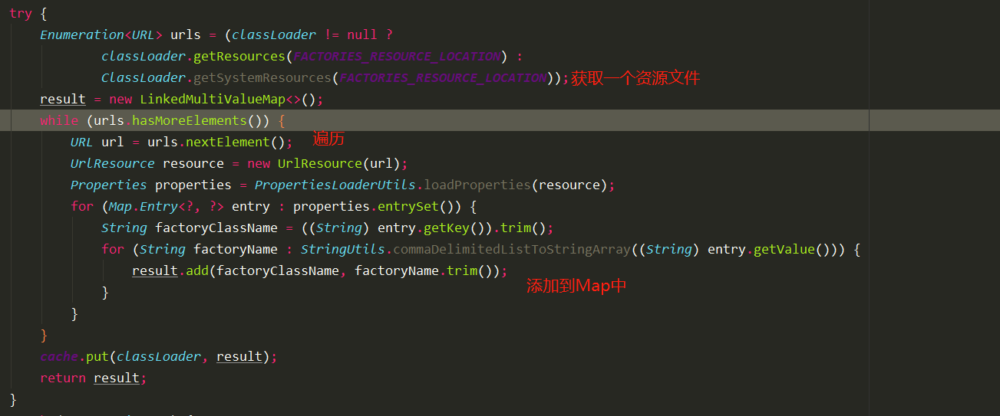
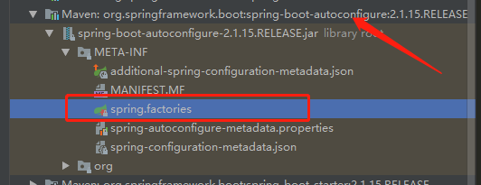
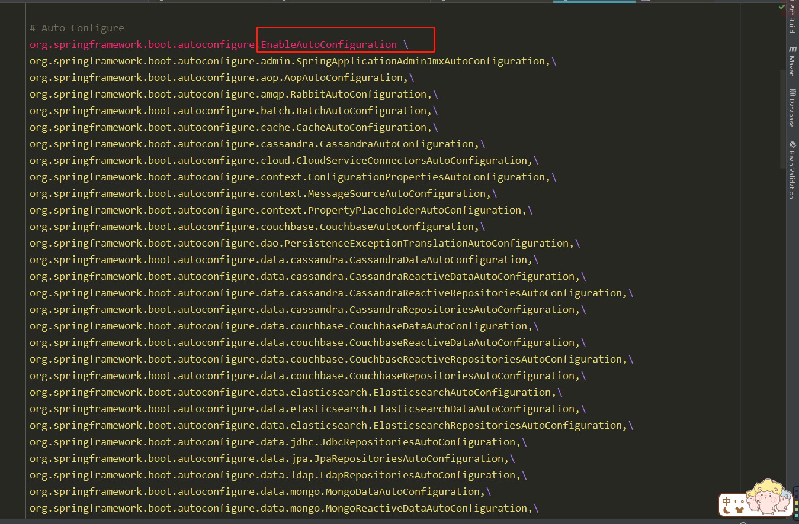
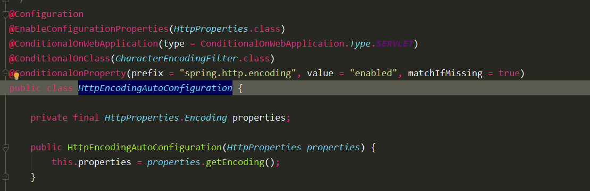
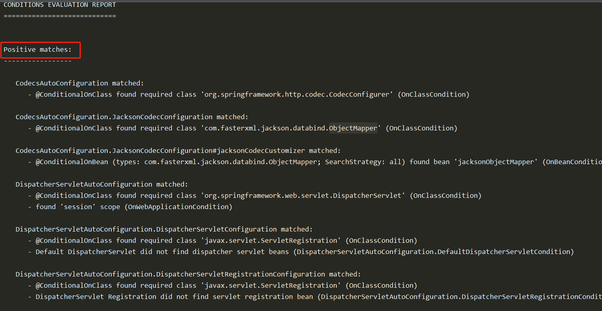

# SpringBoot配置

`SpringBoot`是`Spring`系列的延伸，Spring需要自己去配置各种属性。`SpringBoot` 的出现就是为了简化程序员的配置工作，所谓“约定大于配置”。 所以，**自动配置**是`SpringBoot`的核心。

SpringBoot能配置什么呢？

查看文档[common-application-properties]( https://docs.spring.io/spring-boot/docs/1.5.9.RELEASE/reference/htmlsingle/#common-application-properties ) .




# 创建SpringBoot项目

项目目录结构：



# 自动配置原理

首先我们知道SpringBoot有一个启动类，其实也是一个配置类，其有main方法，可以直接运行。使用@SpingBootApplication注解表示它是一个配置类。

> @**SpringBootApplication**:    Spring Boot应用标注在某个类上说明这个类是SpringBoot的主配置类，SpringBoot就应该运行这个类的main方法来启动SpringBoot应用；

```java
package com.hongliang.springboot;
import org.springframework.boot.SpringApplication;
import org.springframework.boot.autoconfigure.SpringBootApplication;
@SpringBootApplication
public class Springboot02AutoconfigApplication {
    public static void main(String[] args) {
        SpringApplication.run(Springboot02AutoconfigApplication.class, args);
    }

}

```

我们点击进去这个注解：

```java
@Retention(RetentionPolicy.RUNTIME)
@Documented
@Inherited
@SpringBootConfiguration
@EnableAutoConfiguration  //开启自动配置功能
@ComponentScan(excludeFilters = { @Filter(type = FilterType.CUSTOM, classes = TypeExcludeFilter.class),
		@Filter(type = FilterType.CUSTOM, classes = AutoConfigurationExcludeFilter.class) })
public @interface SpringBootApplication {
```

我们可以看到有一个@EnableAutoConfiguration的注解，这个注解的作用就是开启自动配置功能。



发现里面有一个`@Import(AutoConfigurationImportSelector.class)`， 作用是给容器中带入一些组件，那么具体导入那些组件呢？我们继续查看`AutoConfigurationImportSelector`这个类。

```java
public class AutoConfigurationImportSelector implements DeferredImportSelector, BeanClassLoaderAware,
		ResourceLoaderAware, BeanFactoryAware, EnvironmentAware, Ordered {
	private static final AutoConfigurationEntry EMPTY_ENTRY = new AutoConfigurationEntry();


	@Override
	public String[] selectImports(AnnotationMetadata annotationMetadata) {
		if (!isEnabled(annotationMetadata)) {
			return NO_IMPORTS;
		}
		AutoConfigurationMetadata autoConfigurationMetadata = AutoConfigurationMetadataLoader
				.loadMetadata(this.beanClassLoader);
		AutoConfigurationEntry autoConfigurationEntry = getAutoConfigurationEntry(autoConfigurationMetadata,
				annotationMetadata);
		return StringUtils.toStringArray(autoConfigurationEntry.getConfigurations());
	}


	protected AutoConfigurationEntry getAutoConfigurationEntry(AutoConfigurationMetadata autoConfigurationMetadata,
			AnnotationMetadata annotationMetadata) {
		if (!isEnabled(annotationMetadata)) {
			return EMPTY_ENTRY;
		}
		AnnotationAttributes attributes = getAttributes(annotationMetadata);
		List<String> configurations = getCandidateConfigurations(annotationMetadata, attributes);
		configurations = removeDuplicates(configurations);
		Set<String> exclusions = getExclusions(annotationMetadata, attributes);
		checkExcludedClasses(configurations, exclusions);
		configurations.removeAll(exclusions);
		configurations = filter(configurations, autoConfigurationMetadata);
		fireAutoConfigurationImportEvents(configurations, exclusions);
		return new AutoConfigurationEntry(configurations, exclusions);
	}
        }
```

selectImports方法选择组件进行导入，里面调用了getAutoConfigurationEntry方法来获取哪些配置，返回的是一个AutoConfigurationEntry类， 之后转成一个字符串数组

```java
	protected static class AutoConfigurationEntry {

		private final List<String> configurations; // 配置

		private final Set<String> exclusions; // 排除配置

		private AutoConfigurationEntry() { // 初始化空集合
			this.configurations = Collections.emptyList();
			this.exclusions = Collections.emptySet();
		}
		AutoConfigurationEntry(Collection<String> configurations, Collection<String> exclusions) {
			this.configurations = new ArrayList<>(configurations);
			this.exclusions = new HashSet<>(exclusions);
		}

		public List<String> getConfigurations() {
			return this.configurations;
		}

		public Set<String> getExclusions() {
			return this.exclusions;
		}

	}
```

我们再来看一下`getAutoConfigurationEntry`这个方法的具体操作：在`AutoConfigurationImportSelector`这个类里面

```java
	protected AutoConfigurationEntry getAutoConfigurationEntry(AutoConfigurationMetadata autoConfigurationMetadata,
			AnnotationMetadata annotationMetadata) {
		if (!isEnabled(annotationMetadata)) {
			return EMPTY_ENTRY;
		}
		AnnotationAttributes attributes = getAttributes(annotationMetadata);
		List<String> configurations = getCandidateConfigurations(annotationMetadata, attributes);
		configurations = removeDuplicates(configurations);
		Set<String> exclusions = getExclusions(annotationMetadata, attributes);
		checkExcludedClasses(configurations, exclusions);
		configurations.removeAll(exclusions);
		configurations = filter(configurations, autoConfigurationMetadata);
		fireAutoConfigurationImportEvents(configurations, exclusions);
		return new AutoConfigurationEntry(configurations, exclusions);
	}
```

这个方法首先调用了`getCandidateConfigurations`获取候选配置，返回的是一个List集合，然后封装成`AutoConfigurationEntry`返回。

所以我们还需要看一下`getCandidateConfigurations`干了啥：

```java
protected List<String> getCandidateConfigurations(AnnotationMetadata metadata, AnnotationAttributes attributes) {
		List<String> configurations = SpringFactoriesLoader.loadFactoryNames(getSpringFactoriesLoaderFactoryClass(),
				getBeanClassLoader());
		Assert.notEmpty(configurations, "No auto configuration classes found in META-INF/spring.factories. If you "
				+ "are using a custom packaging, make sure that file is correct.");
		return configurations;
	}

	protected Class<?> getSpringFactoriesLoaderFactoryClass() {
		return EnableAutoConfiguration.class;
	}
```

首先调用`SpringFactoriesLoader.loadFactoryNames（Class<?> factoryClass, @Nullable ClassLoader classLoader）`里面传入需要返回哪个自动配置类，这里调用了`getSpringFactoriesLoaderFactoryClass`， 返回的是`EnableAutoConfiguration.class`。

再看看SpringFactoriesLoader.loadFactoryName() 的具体细节：这个方法在`SpringFactoriesLoader`这个类里面，

```java
public static final String FACTORIES_RESOURCE_LOCATION = "META-INF/spring.factories";	
public static List<String> loadFactoryNames(Class<?> factoryClass, @Nullable ClassLoader classLoader) {
		String factoryClassName = factoryClass.getName();
		return loadSpringFactories(classLoader).getOrDefault(factoryClassName, Collections.emptyList());
	}

	private static Map<String, List<String>> loadSpringFactories(@Nullable ClassLoader classLoader) {
		MultiValueMap<String, String> result = cache.get(classLoader);
		if (result != null) {
			return result;
		}

		try {
			Enumeration<URL> urls = (classLoader != null ?
					classLoader.getResources(FACTORIES_RESOURCE_LOCATION) :
					ClassLoader.getSystemResources(FACTORIES_RESOURCE_LOCATION));
			result = new LinkedMultiValueMap<>();
			while (urls.hasMoreElements()) {
				URL url = urls.nextElement();
				UrlResource resource = new UrlResource(url);
				Properties properties = PropertiesLoaderUtils.loadProperties(resource);
				for (Map.Entry<?, ?> entry : properties.entrySet()) {
					String factoryClassName = ((String) entry.getKey()).trim();
					for (String factoryName : StringUtils.commaDelimitedListToStringArray((String) entry.getValue())) {
						result.add(factoryClassName, factoryName.trim());
					}
				}
			}
			cache.put(classLoader, result);
			return result;
		}
		catch (IOException ex) {
			throw new IllegalArgumentException("Unable to load factories from location [" +
					FACTORIES_RESOURCE_LOCATION + "]", ex);
		}
	}
```

主要看这一段



首先会去加载一个配置文件，这个配置文件在类的开头声明了一个静态的常量：

```java
public static final String FACTORIES_RESOURCE_LOCATION = "META-INF/spring.factories";
```

看一下这个配置文件是什么内容：





看到这里应该对大致的流程有一个清晰的了解了，`SpringFactoriesLoader.loadFactoryNames()`扫描所有`jar`包类路径下  `META-INF/spring.factories.` 把扫描到的这些文件的内容包装成`properties`对象
从`properties`中获取到`EnableAutoConfiguration.class`类（类名）对应的值，然后把他们添加在容器中，这些值就是上图中黄色字体部分的`XXXAutoConfiguration`。每一个自动配置类`XXXAutoConfiguration` 都是都是容器中的一个组件，都加入到容器中；用他们来做自动配置；

然后每一个自动配置类进行自动配置功能。

# HttpEncodingAutoConfiguration

以`HttpEncodingAutoConfiguration`为例解释自动配置原理



```java
@Configuration//表示这是一个配置类，以前编写的配置文件一样，也可以给容器中添加组件
@EnableConfigurationProperties(HttpProperties.class)// 启动指定类的ConfigurationProperties功能； 将配置文件中对应的值和HttpEncodingProperties绑定起来；并把HttpEncordingProperties加入到ioc容器里面。


// Spring底层@Conditional注解, 根据不同的条件。如果满足指定的条件，将整个配置类里面的配置生效； 判断当前应用是否是web应用，如果是，则配置类生效。
@ConditionalOnWebApplication(type = ConditionalOnWebApplication.Type.SERVLET)

// 判断当前项目有没有这个CharacterEncodingFilter类。（这是SpringMVC中进行乱码解决的类）
@ConditionalOnClass(CharacterEncodingFilter.class)

// 判断配置文件中是否存在摸个配置spring.http.encoding.enabled；如果不存在，判断也是成立的（matchIfMissing = true）
@ConditionalOnProperty(prefix = "spring.http.encoding", value = "enabled", matchIfMissing = true)
public class HttpEncodingAutoConfiguration {

    // 已经和SpringBoot的配置文件映射了
	private final HttpProperties.Encoding properties;
	// 只有一个有参构造函数的情况下， 参数的值就会从容器中拿。
	public HttpEncodingAutoConfiguration(HttpProperties properties) {
		this.properties = properties.getEncoding();
	}

	@Bean //  给容器中添加一个组件，这个组件的某些值需要从properties中去获取
	@ConditionalOnMissingBean  // //判断容器没有这个组件，没有这个才需要配置
	public CharacterEncodingFilter characterEncodingFilter() {
		CharacterEncodingFilter filter = new OrderedCharacterEncodingFilter();
		filter.setEncoding(this.properties.getCharset().name());
		filter.setForceRequestEncoding(this.properties.shouldForce(Type.REQUEST));
		filter.setForceResponseEncoding(this.properties.shouldForce(Type.RESPONSE));
		return filter;
	}	

}

```

可以看上面详细的注释理解每个注解的功能。

根据当前不同的条件判断，决定这个配置类是否生效？

一但这个配置类生效；这个配置类就会给容器中添加各种组件；这些组件的属性是从对应的properties类中获取的，这些类里面的每一个属性又是和配置文件绑定的；

我们看一下properties类中内容：

```java
@ConfigurationProperties(prefix = "spring.http")
public class HttpProperties {

	/**
	 * Whether logging of (potentially sensitive) request details at DEBUG and TRACE level
	 * is allowed.
	 */
	private boolean logRequestDetails;

	/**
	 * HTTP encoding properties.
	 */
	private final Encoding encoding = new Encoding();

	public boolean isLogRequestDetails() {
		return this.logRequestDetails;
	}

	public void setLogRequestDetails(boolean logRequestDetails) {
		this.logRequestDetails = logRequestDetails;
	}

	public Encoding getEncoding() {
		return this.encoding;
	}

	/**
	 * Configuration properties for http encoding.
	 */
	public static class Encoding {

		public static final Charset DEFAULT_CHARSET = StandardCharsets.UTF_8;

		/**
		 * Charset of HTTP requests and responses. Added to the "Content-Type" header if
		 * not set explicitly.
		 */
		private Charset charset = DEFAULT_CHARSET;

		/**
		 * Whether to force the encoding to the configured charset on HTTP requests and
		 * responses.
		 */
		private Boolean force;

		/**
		 * Whether to force the encoding to the configured charset on HTTP requests.
		 * Defaults to true when "force" has not been specified.
		 */
		private Boolean forceRequest;

		/**
		 * Whether to force the encoding to the configured charset on HTTP responses.
		 */
		private Boolean forceResponse;

		/**
		 * Locale in which to encode mapping.
		 */
		private Map<Locale, Charset> mapping;

		public Charset getCharset() {
			return this.charset;
		}

		public void setCharset(Charset charset) {
			this.charset = charset;
		}

		public boolean isForce() {
			return Boolean.TRUE.equals(this.force);
		}

		public void setForce(boolean force) {
			this.force = force;
		}

		public boolean isForceRequest() {
			return Boolean.TRUE.equals(this.forceRequest);
		}

		public void setForceRequest(boolean forceRequest) {
			this.forceRequest = forceRequest;
		}

		public boolean isForceResponse() {
			return Boolean.TRUE.equals(this.forceResponse);
		}

		public void setForceResponse(boolean forceResponse) {
			this.forceResponse = forceResponse;
		}

		public Map<Locale, Charset> getMapping() {
			return this.mapping;
		}

		public void setMapping(Map<Locale, Charset> mapping) {
			this.mapping = mapping;
		}

		public boolean shouldForce(Type type) {
			Boolean force = (type != Type.REQUEST) ? this.forceResponse : this.forceRequest;
			if (force == null) {
				force = this.force;
			}
			if (force == null) {
				force = (type == Type.REQUEST);
			}
			return force;
		}

		public enum Type {

			REQUEST, RESPONSE

		}

	}

}

```

里面包括了可以配置的所有属性。

所有在配置文件中能配置的属性都是封装在`xxxxProperties`类中，配置文件能配置什么就可以参照某个功能对应的这个属性类。


# @Conditional派生注解

作用：必须是@Conditional指定的条件成立，才给容器中添加组件，配置配里面的所有内容才生效；

| @Conditional扩展注解            | 作用（判断是否满足当前指定条件）                 |
| ------------------------------- | ------------------------------------------------ |
| @ConditionalOnJava              | 系统的java版本是否符合要求                       |
| @ConditionalOnBean              | 容器中存在指定Bean；                             |
| @ConditionalOnMissingBean       | 容器中不存在指定Bean；                           |
| @ConditionalOnExpression        | 满足SpEL表达式指定                               |
| @ConditionalOnClass             | 系统中有指定的类                                 |
| @ConditionalOnMissingClass      | 系统中没有指定的类                               |
| @ConditionalOnSingleCandidate   | 容器中只有一个指定的Bean，或者这个Bean是首选Bean |
| @ConditionalOnProperty          | 系统中指定的属性是否有指定的值                   |
| @ConditionalOnResource          | 类路径下是否存在指定资源文件                     |
| @ConditionalOnWebApplication    | 当前是web环境                                    |
| @ConditionalOnNotWebApplication | 当前不是web环境                                  |
| @ConditionalOnJndi              | JNDI存在指定项                                   |

**自动配置类必须在一定的条件下才能生效；**

我们怎么知道哪些自动配置类生效；

**==我们可以通过启用  debug=true属性；来让控制台打印自动配置报告==**，这样我们就可以很方便的知道哪些自动配置类生效；




# 总结

​	**1）、SpringBoot启动会加载大量的自动配置类**

​	**2）、我们看我们需要的功能有没有SpringBoot默认写好的自动配置类；**

​	**3）、我们再来看这个自动配置类中到底配置了哪些组件；（只要我们要用的组件有，我们就不需要再来配置了）**

​	**4）、给容器中自动配置类添加组件的时候，会从properties类中获取某些属性。我们就可以在配置文件中指定这些属性的值；**

`xxxxAutoConfigurartion`：自动配置类；

给容器中添加组件

`xxxxProperties`:封装配置文件中相关属性；

**spring Boot启动的时候会通过@EnableAutoConfiguration注解找到META-INF/spring.factories配置文件中的所有自动配置类，并对其进行加载，而这些自动配置类都是以AutoConfiguration结尾来命名的，它实际上就是一个JavaConfig形式的Spring容器配置类，它能通过以Properties结尾命名的类中取得在全局配置文件中配置的属性如：server.port，而XxxxProperties类是通过@ConfigurationProperties注解与全局配置文件中对应的属性进行绑定的。**