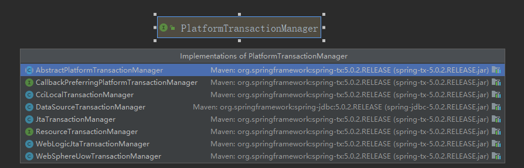
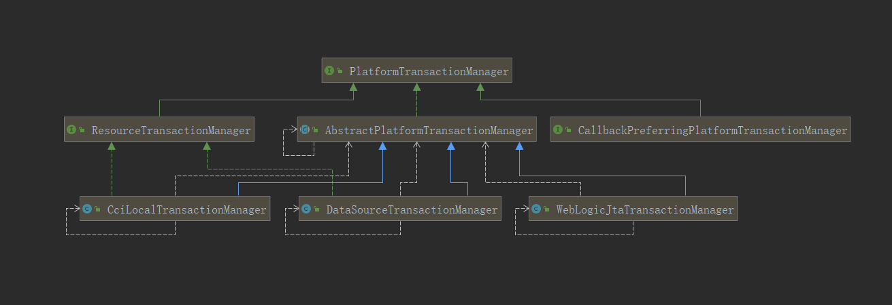
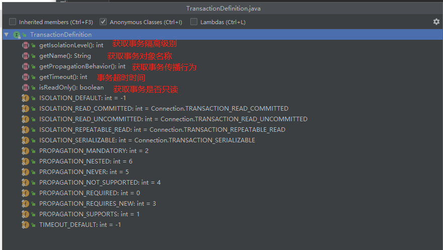
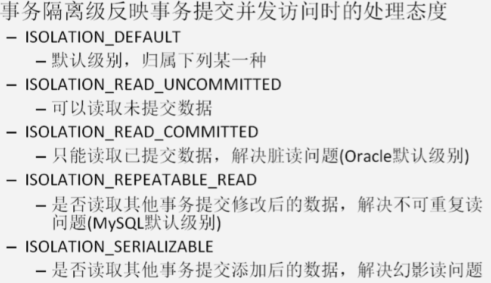
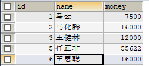
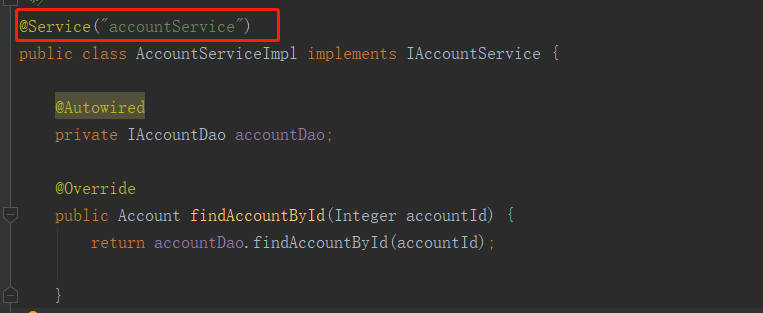
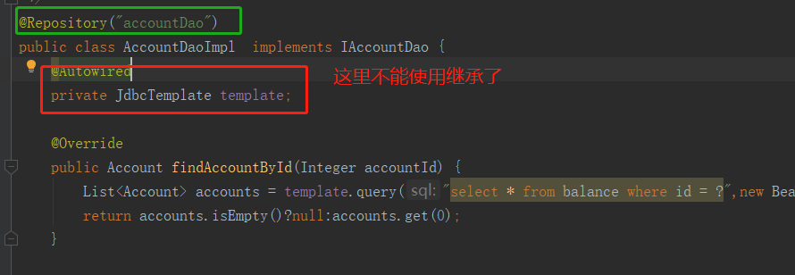
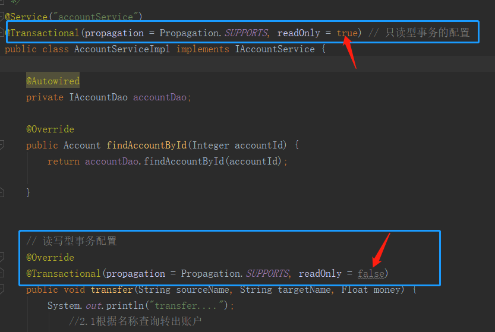

# 引言

`JavaEE` 体系进行分层开发，事务处理位于业务层，`Spring` 提供了分层设计业务层的事务处理解决方案。`spring` 框架为我们提供了一组事务控制的接口。这组接口是在 `spring-tx-5.0.2.RELEASE.jar` 中。`spring` 的事务控制都是基于 `AOP` 的，它既可以使用编程的方式实现，也可以使用配置的方式实现。重点掌握配置实现。

# Spring中事务控制的 API介绍 

## PlatformTransactionManager

此接口是 spring 的事务管理器，它里面提供了我们常用的操作事务的方法：

```java
public interface PlatformTransactionManager {
    /*  获取事务的状态信息 */
	TransactionStatus getTransaction(@Nullable TransactionDefinition definition) throws TransactionException;
	/*提交事务*/
	void commit(TransactionStatus status) throws TransactionException;
	/*回滚事务*/
	void rollback(TransactionStatus status) throws TransactionException;

}
```

我们在开发中都是使用它的实现类:





> 真正管理事务的对象 ：`org.springframework.jdbc.datasource.DataSourceTransactionManager` ：使用 Spring JDBC 或 iBatis 进行持久化数据时使用 。`org.springframework.orm.hibernate5.HibernateTransactionManager`  使用 Hibernate 版本进行持久化数据时使用。

## TransactionDefinition

它是事务的定义信息对象，里面有如下方法： 



> 读写型事务：增删改 开启事务
>
> 只读型事务：执行查询时，也会开启事务

###  事务的隔离级别 



### 事务的传播行为 

A 方法和B方法都有事务，当A调用B时，会将A中的事务传播给B方法，B方法对于实物的处理方式就是事务的传播行为。

当事务方法被另一个事务方法调用时，必须指定事务应该如何传播。例如：方法可能继续在现有事务中运行，也可能开启一个新事务，并在自己的事务中运行。

`REQUIRED`:**如果当前没有事务，就新建一个事务，如果已经存在一个事务中，加入到这个事务中。一般的选择（默认值）**

`SUPPORTS`:**支持当前事务，如果当前没有事务，就以非事务方式执行（没有事务）**

`MANDATORY`：使用当前的事务，如果当前没有事务，就抛出异常

`REQUERS_NEW`: 新建事务，如果当前在事务中，把当前事务挂起。 

`NOT_SUPPORTED`:  以非事务方式执行操作，如果当前存在事务，就把当前事务挂起 

`NEVER`: 以非事务方式运行，如果当前存在事务，抛出异常 

`NESTED`: 如果当前存在事务，则在嵌套事务内执行。如果当前没有事务，则执行 `REQUIRED` 类似的操作。 

是不是有点晕。。。我也是。

### 超时时间 

默认值是-1，没有超时限制。如果有，以秒为单位进行设置。 

### 是否是只读事务 

建议查询时设置为只读。 

## TransactionStatus 

此接口提供的是事务具体的运行状态，描述了某个时间点上事务对象的状态信息，包含6个具体的操作。

```java
public interface TransactionStatus extends SavepointManager, Flushable {

    /*  判断事务是否为新的事务 */
	boolean isNewTransaction();
	/* 获取事务是否存在存储点 */
	boolean hasSavepoint();
	/* 设置事务回滚 */
	void setRollbackOnly();
	/* 判断事务是否回滚 */
	boolean isRollbackOnly();

    /*  刷新事务 */
	@Override
	void flush();
	/* 判断事务是否完成 */
	boolean isCompleted();

}
```

----------


# 基于 XML 的声明式事务控制

## 数据库



## DAO

```java
package com.hongliang.dao;

import com.hongliang.domain.Account;

/**
 * 账户的持久层接口
 */
public interface IAccountDao {

    /**
     * 根据Id查询账户
     * @param accountId
     * @return
     */
    Account findAccountById(Integer accountId);

    /**
     * 根据名称查询账户
     * @param accountName
     * @return
     */
    Account findAccountByName(String accountName);

    /**
     * 更新账户
     * @param account
     */
    void updateAccount(Account account);
}

```

## Service

```java
package com.hongliang.service.impl;

import com.hongliang.dao.IAccountDao;
import com.hongliang.domain.Account;
import com.hongliang.service.IAccountService;
import org.springframework.beans.factory.annotation.Autowired;
import org.springframework.stereotype.Service;

import java.util.List;

/**
 * 账户的业务层实现类
 *
 * 事务控制应该都是在业务层
 */
public class AccountServiceImpl implements IAccountService {

    private IAccountDao accountDao;

    public void setAccountDao(IAccountDao accountDao) {
        this.accountDao = accountDao;
    }

    @Override
    public Account findAccountById(Integer accountId) {
        return accountDao.findAccountById(accountId);

    }

    @Override
    public void transfer(String sourceName, String targetName, Float money) {
        System.out.println("transfer....");
            //2.1根据名称查询转出账户
            Account source = accountDao.findAccountByName(sourceName);
            //2.2根据名称查询转入账户
            Account target = accountDao.findAccountByName(targetName);
            //2.3转出账户减钱
            source.setMoney(source.getMoney()-money);
            //2.4转入账户加钱
            target.setMoney(target.getMoney()+money);
            //2.5更新转出账户
            accountDao.updateAccount(source);

//            int i=1/0;

            //2.6更新转入账户
            accountDao.updateAccount(target);
    }
}

```

## pom文件依赖

```xml
 <dependencies>
        <dependency>
            <groupId>org.springframework</groupId>
            <artifactId>spring-context</artifactId>
            <version>5.0.2.RELEASE</version>
        </dependency>
        <dependency>
            <groupId>org.springframework</groupId>
            <artifactId>spring-tx</artifactId>
            <version>5.0.2.RELEASE</version>
        </dependency>
        <dependency>
            <groupId>org.springframework</groupId>
            <artifactId>spring-jdbc</artifactId>
            <version>5.0.2.RELEASE</version>
        </dependency>
        <dependency>
            <groupId>mysql</groupId>
            <artifactId>mysql-connector-java</artifactId>
            <version>8.0.19</version>
        </dependency>
        <dependency>
            <groupId>org.aspectj</groupId>
            <artifactId>aspectjweaver</artifactId>
            <version>1.8.7</version>
        </dependency>
        <dependency>
            <groupId>org.springframework</groupId>
            <artifactId>spring-test</artifactId>
            <version>5.0.2.RELEASE</version>

        </dependency>
        <dependency>
            <groupId>junit</groupId>
            <artifactId>junit</artifactId>
            <version>4.12</version>
        </dependency>
    </dependencies>

```

## 配置bean.xml

### 配置事务管理器

```xml
<bean id="transactionManager"  class="org.springframework.jdbc.datasource.DataSourceTransactionManager">
        <property name="dataSource" ref="ds"></property>
</bean>
```

### 配置事务的通知引用事务管理器 

```xml
!--    配置事务的通知-->
    <tx:advice id="txAdvice" transaction-manager="transactionManager">
    </tx:advice>
```

### 配置事务的属性 

```xml
<!--在 tx:advice 标签内部 配置事务的属性 --> 
    <tx:advice id="txAdvice" transaction-manager="transactionManager">
        
        <!-- 指定方法名称：是业务核心方法   
			read-only：是否是只读事务。默认 false，不只读。  
			isolation：指定事务的隔离级别。默认值是使用数据库的默认隔离级别。   				propagation：指定事务的传播行为。  
			timeout：指定超时时间。默认值为：-1。永不超时。  
			rollback-for：用于指定一个异常，当执行产生该异常时，事务回滚。产生其他异常，事务不回滚。 没有默认值，任何异常都回滚。  
			no-rollback-for：用于指定一个异常，当产生该异常时，事务不回滚，产生其他异常时，事务回滚。没有默认值，任何异常都回滚。  -->  
        
        <tx:attributes>
            <tx:method name="*" isolation="DEFAULT" propagation="REQUIRED" read-only="false"/>
            <tx:method name="find*" read-only="true" propagation="SUPPORTS">
        </tx:attributes>
    </tx:advice>
```

### 配置 AOP 切入点表达式 

```xml
<!--    配置AOP-->
<aop:config>
<!--       配置切入点表达式-->
<aop:pointcut id="pt1" expression="execution(* com.hongliang.service.impl.*.*(..))"/>

</aop:config>

```

### 配置切入点表达式和事务通知的对应关系

在 `aop:config`标签内部:

```xml
<!--     建立切入点表达式和事务通知的对应关系  -->
  <aop:advisor advice-ref="txAdvice" pointcut-ref="pt1"></aop:advisor>
```

配置完成后的`bean.xml`

```xml
<?xml version="1.0" encoding="UTF-8"?>
<beans xmlns="http://www.springframework.org/schema/beans"
       xmlns:xsi="http://www.w3.org/2001/XMLSchema-instance" xmlns:tx="http://www.springframework.org/schema/tx"
       xmlns:aop="http://www.springframework.org/schema/aop"
       xsi:schemaLocation="http://www.springframework.org/schema/beans http://www.springframework.org/schema/beans/spring-beans.xsd http://www.springframework.org/schema/tx http://www.springframework.org/schema/tx/spring-tx.xsd http://www.springframework.org/schema/aop http://www.springframework.org/schema/aop/spring-aop.xsd">

    <bean id="accountDao" class="com.hongliang.dao.impl.AccountDaoImpl">
        <property name="dataSource" ref="ds"></property>
    </bean>
<!--    配置业务层-->
    <bean id="accountService" class="com.hongliang.service.impl.AccountServiceImpl">
        <property name="accountDao" ref="accountDao"></property>
    </bean>

    <bean id="ds" class="org.springframework.jdbc.datasource.DriverManagerDataSource">
        <property name="driverClassName" value="com.mysql.cj.jdbc.Driver"></property>
        <property name="url" value="jdbc:mysql://localhost:3306/test?serverTimezone=UTC"></property>
        <property name="username" value="root"></property>
        <property name="password" value="123456"></property>
    </bean>

    <bean id="transactionManager" class="org.springframework.jdbc.datasource.DataSourceTransactionManager">
        <property name="dataSource" ref="ds"></property>
    </bean>
<!--    配置事务的通知-->
    <tx:advice id="txAdvice" transaction-manager="transactionManager">
        <tx:attributes>
            <tx:method name="*" isolation="DEFAULT" propagation="REQUIRED" read-only="false"/>
            <tx:method name="find*" read-only="true" propagation="SUPPORTS"></tx:method>
        </tx:attributes>
    </tx:advice>
<!--    配置AOP-->
    <aop:config>
<!--            配置切入点表达式-->
        <aop:pointcut id="pt1" expression="execution(* com.hongliang.service.impl.*.*(..))"/>
<!--            建立切入点表达式和事务通知的对应关系  -->
        <aop:advisor advice-ref="txAdvice" pointcut-ref="pt1"></aop:advisor>
    </aop:config>
</beans>
```

## 测试

```java
/**
 * 使用Junit单元测试：测试我们的配置
 */
@RunWith(SpringJUnit4ClassRunner.class)
@ContextConfiguration(locations = "classpath:bean.xml")
public class AccountServiceTest {

    @Autowired
    private IAccountService as;

    @Test
    public  void testTransfer(){
        as.transfer("马化腾","王思聪",1000f);
    }


}
```

经过测试，事务可以成功控制。

---------


# 基于注解的配置方式 

环境搭建同上

## 创建业务层接口和实现类并使用注解让 spring 管理 



## 创建 Dao 接口和实现类并使用注解让 spring 管理 



## 配置步骤

### 配置spring容器要扫描的包

```xml
<!--    配置spring容器要扫描的包-->
<context:component-scan base-package="com.hongliang"></context:component-scan>

```


### 配置事务管理器并注入数据源 

```xml
<!-- 配置数据源 -->
<bean id="ds" class="org.springframework.jdbc.datasource.DriverManagerDataSource">
        <property name="driverClassName" value="com.mysql.cj.jdbc.Driver"></property>
        <property name="url" value="jdbc:mysql://localhost:3306/test?serverTimezone=UTC"></property>
        <property name="username" value="root"></property>
        <property name="password" value="123456"></property>
    </bean>

<!-- 配置事务管理器 -->
    <bean id="transactionManager" class="org.springframework.jdbc.datasource.DataSourceTransactionManager">
        <property name="dataSource" ref="ds"></property>
    </bean>
```

### 开启spring对注解事务的支持

```xml
<!--    开启spring对注解事务的支持-->
<tx:annotation-driven transaction-manager="transactionManager" ></tx:annotation-driven>

```

### 在业务层使用@Transactional 注解 



该注解的属性和 xml 中的属性含义一致。该注解可以出现在接口上，类上和方法上。 出现接口上，表示该接口的所有实现类都有事务支持。 出现在类上，表示类中所有方法有事务支持 出现在方法上，表示方法有事务支持。 以上三个位置的优先级：方法>类>接口。

---


# 不使用 xml的配置方式 （纯注解 ）

## 配置类取代bean.xml

### Springconfiguration.java

```java
/**
 * spring的配置类： 相当于bean.xml
 * @author Hongliang Zhu
 * @create 2020-04-28 22:43
 */
@Configuration
@ComponentScan("com.hongliang")
@Import({jdbcConfig.class, TransactionConfig.class})
@PropertySource("jdbc.properties")
@EnableTransactionManagement //开启spring对注解事务的支持
public class Springconfiguration {
}

```

### jdbcConfig.java

```java

/**
 * 数据库相关的配置类
 * @author Hongliang Zhu
 * @create 2020-04-28 22:45
 */
public class jdbcConfig {

    @Value("${jdbc.driverClass}")
    private String driverClass;

    @Value("${jdbc.url}")
    private String url;

    @Value("${jdbc.username}")
    private String username;

    @Value("${jdbc.password}")
    private String password;


    /**
     * 创建JdbcTemplate
     * @param dataSource
     * @return
     */
    @Bean(name = "jdbctemplate")  // 放入spring容器中
    public JdbcTemplate createJdbcTemplate(DataSource dataSource){
        return new JdbcTemplate(dataSource);
    }

    /**
     * 创建数据源对象
     * @return
     */
    @Bean(name = "dataSource")
    public DataSource createDataSource(){
        DriverManagerDataSource ds = new DriverManagerDataSource();
        ds.setPassword(driverClass);
        ds.setUrl(url);
        ds.setUsername(username);
        ds.setPassword(password);

        return ds;
    }

}

```

### TransactionConfig.java

```java

/**
 * 和事务相关的配置类
 * @author Hongliang Zhu
 * @create 2020-04-28 22:58
 */
public class TransactionConfig {

    /**
     * 创建事务管理器对象
     * @param dataSource
     * @return
     */
    @Bean(name = "transactionManager")  // 放入spring容器中
    public PlatformTransactionManager createTransactionManager(DataSource dataSource){
        return new DataSourceTransactionManager(dataSource);
    }
}

```

## 测试

```java
/**
 * @author Hongliang Zhu
 * @create 2020-04-28 23:01
 */
@RunWith(SpringJUnit4ClassRunner.class)
@ContextConfiguration(classes = Springconfiguration.class) // 引入配置
public class serviceText {

    @Autowired
    private IAccountService service;
    @Test
    public void test(){
        service.transfer("马化腾", "王思聪", 2000f);
    }

}
```


