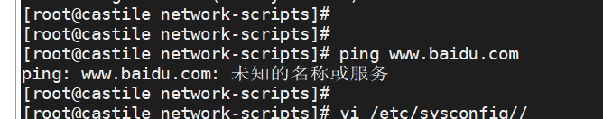
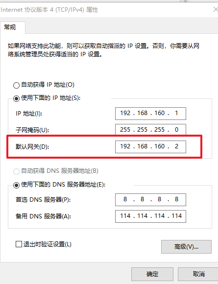
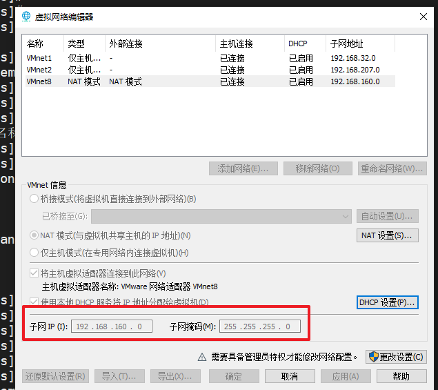
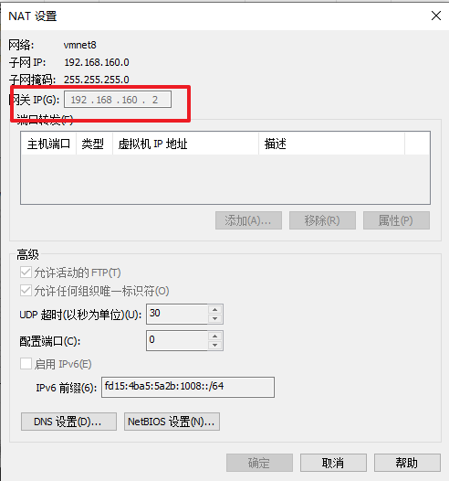
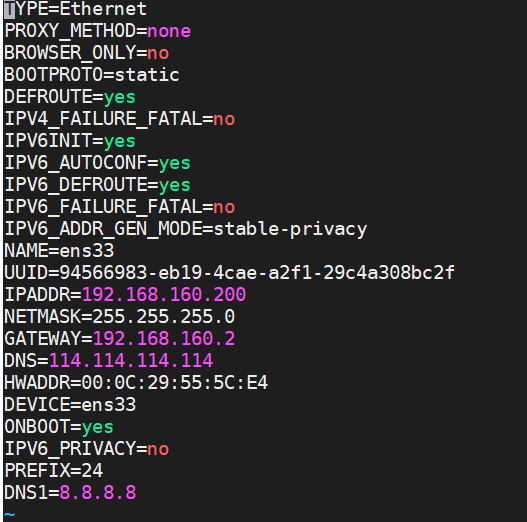

# VM虚拟机ping通外网check

每隔一段时间，家里的虚拟机就无法ping外网了，先做一个记录，方便后续设置：




出现此问题大概率是因为网关设置错误

保持vm8网卡中的网关、vmware网络编辑器中的NAT模式中网关、具体虚拟机中网络配置中的GATEWAY一致











附上一个配置：

```xml
TYPE=Ethernet
PROXY_METHOD=none
BROWSER_ONLY=no
BOOTPROTO=static
DEFROUTE=yes
IPV4_FAILURE_FATAL=no
IPV6INIT=yes
IPV6_AUTOCONF=yes
IPV6_DEFROUTE=yes
IPV6_FAILURE_FATAL=no
IPV6_ADDR_GEN_MODE=stable-privacy
NAME=ens33
UUID=94566983-eb19-4cae-a2f1-29c4a308bc2f
IPADDR=192.168.160.200
NETMASK=255.255.255.0
GATEWAY=192.168.160.2
DNS=114.114.114.114
HWADDR=00:0C:29:55:5C:E4
DEVICE=ens33
ONBOOT=yes
IPV6_PRIVACY=no
PREFIX=24
DNS1=8.8.8.8

```

