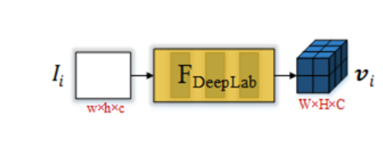

# Zero-Shot Video Object Segmentation via Attentive Graph Neural Networks（ICCV2019）

  Wenguan Wang1∗,  Xiankai Lu1∗,  Jianbing Shen1y,  David Crandall2,  Ling Shao1
       Inception Institute of Artificial Intelligence,   UAE  Indiana University, USA  

# 通过图注意力神经网络的Zero-Shot视频目标分割

## 代码：  https://github.com/Castile/AGNNForVOS 

# 一、 概述

​		提出了一种基于图注意力神经网络的用于Zero-Shot的视频目标分割算法。 AGNN将此任务重新定义为在图上进行迭代信息融合的过程 。 具体来说，AGNN构建一个全连通图，有效地将帧表示为节点，任意帧对之间的关系表示为边。 潜在的两两关系由一个可微分的注意机制来描述。通过参数化消息传递，AGNN能够有效地捕获和挖掘视频帧之间更丰富、更高阶的关系，从而更全面地理解视频内容，更准确地估计前景。大量的实验验证了AGNN能够学习视频帧或相关图像之间潜在的语义或者外观关系，并找出共同的目标。【基于全局的视角】  

---

# 二、 目前的方法

​		基于深度学习的方法需要大量的训练数据，利用**双流网络**来结合局部信息和外观信息，使用光流来对连续两帧进行运动的建模，使用RNN对时序建模。但是它们普遍存在两个**局限性**。首先，它们主要关注连续帧之间的局部成对或顺序关系，而忽略了帧之间普遍存在的高阶关系(因为来自同一视频的帧通常是相关的)。其次，由于他们没有充分利用丰富的关系，他们不能完全捕捉视频内容，因此对前景的估计效果很差。从另一个角度来看，由于视频对象通常存在底层对象遮挡、尺度变化大、外观变化大，仅考虑视频中连续关系或局部成对关系时，很难正确推断前景。

Zero-Shot参考：《  [Rvos: End to-end recurrent network for video object segmentation](https://arxiv.org/pdf/1903.05612)  》

 采用双流网络结合局部运动和外观信息，采用RNN逐帧建模 ：

1. Segflow: Joint learning for video object segmentation and optical flow. In ICCV, 2017  
2. Fusionseg: Learning to combine motion and appearance for fully automatic segmention of generic objects in videos. In CVPR,2017.
3.  Learning video object segmentation with visual memory. In ICCV, 2017.  
4.  Unsupervised video object segmentation with motion-based bilateral networks. In ECCV, 2018.  
5.   Pyramid dilated deeper convlstm for video salient object detection. In ECCV, 2018  

---

## 1. Zero-Shot solution

1. Learning to segment moving objects in videos. In CVPR, 2015 ： 设计了一种基于多层感知的运动目标检测系统

2. **Fusionseg**: Learning to combine motion and appearance for fully automatic segmention of generic objects in videos. In CVPR,2017. ： 

3. **Learning video object segmentation with visual memory. In *ICCV*, 2017.** 

4. Segflow: Joint learning for video object segmentation and optical flow. In *ICCV*, 2017

5. **Instance embedding transfer to unsupervised video object segmentation. In *CVPR*, 2018.** ： 整合深度学习的实例嵌入和运动显著性来提高性能。

6. **Unsupervised video object segmentation with motion-based bilateral networks. In *ECCV*, 2018.**

7. Flow guided recurrent neural encoder for video salient object detection. In *CVPR*, 2018.

8. **See more, know more: Unsupervised video object segmentation with co-attention Siamese networks. In *CVPR*, 2019.**

9. The graph neural network model. *IEEE TNNLS*, 20(1):61–80, 2009

10. Neural message passing for quantum chemistry. In *ICML*, 2017

---

## 2. 基于FCN的：

1. Triply supervised decoder networks for joint detection and segmentation. In *CVPR*, 2019

2. Fully convolutional networks for semantic segmentation. In *CVPR*, 2015.

3. Ranet: Ranking attention network for fast video object segmentation. In *ICCV*, 2019.

---

## 3. 双流网络来融合外观信息和运动信息

1. Flow guided recurrent neural encoder for video salient object detection. In *CVPR*, 2018.

2. **Fusionseg: Learning to combine motion and appearance for fully automatic segmention of generic objects in videos. In *CVPR*, 2017.**

3. Segflow: Joint learning for video object segmentation and optical flow. In *ICCV*, 2017

---

# 三、 提出的方法-ZVOS

​		提出了一种注意力图神经网络(`AGNN`)来解决`Zero-Shot`视频目标分割(ZVOS)问题，将`ZVOS`重新定义为一种端到端的、基于消息传递的图信息融合过程(如上图b所示)。具体地，构造了一个全连通图，其中视频帧被表示为节点，两帧之间的两两关系被描述为对应节点之间的边。两帧之间的关联被一个注意力机制有效地捕获，这避免了耗时的光流估计。

---

# 四、 图神经网络GNN

​		GNN最初是在《 A new model for learning in graph domains. In IJCNN, 2005.》中提出的，并在《         The graph neural network model. IEEE TNNLS, 20(1):61–80, 2009.  》中进一步发展，以处理结构化数据之间的底层关系。

​		在《The graph neural network model》中，使用RNN对每个节点的状态进行建模，通过传递相邻节点的参数化消息来挖掘节点之间的底层关联。近年来，GNNs已成功应用于分子生物学、计算机视觉、机器学习、自然语言处理等诸多领域。GNNs的另一个流行趋势是将卷积体系结构泛化到任意图形结构数据上，即图卷积神经网络(graph convolution neural network, GCNN)

​		提出的AGNN属于前一类;它是一个基于GNN的消息传递，其中所有的节点、边和消息传递函数都由神经网络参数化。它与图上的挖掘关系的一般思想相同，但是有显著的差异。

​		首先，我们的AGNN在空间信息的保留方面是独特的，这与传统的全连通是不同的，而且GNNs对于逐像素预测任务至关重要。其次，为了有效地捕获两个图像帧之间的关系，我们引入了一个可微注意力机制，该机制处理相关信息并产生进一步的鉴别边缘特征。

## 1. GNN 的 Survey papers

1. **Graph Neural Networks: A Review of Methods and Applications.** arxiv 2018. [paper](https://arxiv.org/pdf/1812.08434.pdf)

   *Jie Zhou, Ganqu Cui, Zhengyan Zhang, Cheng Yang, Zhiyuan Liu, Maosong Sun.*

2. **A Comprehensive Survey on Graph Neural Networks.** arxiv 2019. [paper](https://arxiv.org/pdf/1901.00596.pdf)

   *Zonghan Wu, Shirui Pan, Fengwen Chen, Guodong Long, Chengqi Zhang, Philip S. Yu.*

3. **Deep Learning on Graphs: A Survey.** arxiv 2018. [paper](https://arxiv.org/pdf/1812.04202.pdf)

   *Ziwei Zhang, Peng Cui, Wenwu Zhu.*

4. **Relational Inductive Biases, Deep Learning, and Graph Networks.** arxiv 2018. [paper](https://arxiv.org/pdf/1806.01261.pdf)

   *Battaglia, Peter W and Hamrick, Jessica B and Bapst, Victor and Sanchez-Gonzalez, Alvaro and Zambaldi, Vinicius and Malinowski, Mateusz and Tacchetti, Andrea and Raposo, David and Santoro, Adam and Faulkner, Ryan and others.*

5. **Geometric Deep Learning: Going beyond Euclidean data.** IEEE SPM 2017. [paper](https://arxiv.org/pdf/1611.08097.pdf)

   *Bronstein, Michael M and Bruna, Joan and LeCun, Yann and Szlam, Arthur and Vandergheynst, Pierre.*

6. **Computational Capabilities of Graph Neural Networks.** IEEE TNN 2009. [paper](https://ieeexplore.ieee.org/stamp/stamp.jsp?tp=&arnumber=4703190)

   *Scarselli, Franco and Gori, Marco and Tsoi, Ah Chung and Hagenbuchner, Markus and Monfardini, Gabriele.*

7. **Neural Message Passing for Quantum Chemistry.** ICML 2017. [paper](https://arxiv.org/pdf/1704.01212.pdf)

   *Gilmer, Justin and Schoenholz, Samuel S and Riley, Patrick F and Vinyals, Oriol and Dahl, George E.*

8. **Non-local Neural Networks.** CVPR 2018. [paper](http://openaccess.thecvf.com/content_cvpr_2018/papers/Wang_Non-Local_Neural_Networks_CVPR_2018_paper.pdf)

   *Wang, Xiaolong and Girshick, Ross and Gupta, Abhinav and He, Kaiming.*

9. **The Graph Neural Network Model.** IEEE TNN 2009. [paper](https://ieeexplore.ieee.org/stamp/stamp.jsp?tp=&arnumber=4700287)

   *Scarselli, Franco and Gori, Marco and Tsoi, Ah Chung and Hagenbuchner, Markus and Monfardini, Gabriele.*

## 2. GNN 的表示

参考：

1. [图神经网络模型 The Graph Neural Network Model]( https://blog.csdn.net/u011748542/article/details/86289511 )
2.  https://zhuanlan.zhihu.com/p/76290138 

# 五、 AGNN

## 1. AGNN

> AGNN ： 
>
> 1) 提供统一的、端到端可训练的、基于图模型的ZVOS解决方案;
>
> 2) 通过在图上迭代传播和融合消息，有效挖掘视频内部丰富多样的高阶关系;
>
> 3) 利用可微注意机制捕获帧对之间的相关信息。

## 2. 符号表示

训练和测视频序列： ${I = \{I_i ∈ R^{w*h*3} \}_{i = 1}^N}$     大小是 473 x 473

ZVOS的目的是：产生相关帧的二值分割掩码:	${S= \{ S_i ∈ \{0, 1\}^{W*H}\}_{i = 1}^N }$

AGNN将$I $ 表示成有向图 $G = (V, E)$:

- 节点`node`  $v_i ∈ V$， 代表第 $i$ 帧 $I_i$  .
-  边 `edge`  $e_{ij} = (v_i,  v_j) ∈ E$ ,  代表 $I_i 到 I_j 的关系$。

​		AGNN的核心思想是在G上执行K个消息传播迭代，以有效地挖掘  $ I $  各个节点（帧）间丰富的高阶关系。这有助于更好地从全局视图捕获视频内容，并获得更准确的前景估计。内注意通过关注同一节点嵌入内的所有位置来计算某个位置的响应。

​		然后从最后的节点状态 $ \{h_i^K\}_{i = 1}^N$  使用读出函数得到 分割的预测 $ \hat{S}$ 

## FCN-Based Node Embedding

我们利用DeepLabV3---一个经典的基于FCN的语义分割架构，提取有效的帧特征，作为节点表示。

对于一个节点$v_i$  , 初始的 embedding $h_i^0$ 计算：
$$
h_i^0 =  V_i =  F_{DeepLab}(I_i) ∈ R^{W * H * C}
$$
  $h_i^0$是一个三维的Tensor， 保存了一些空间信息和语义信息。

## Intra-Attention Based Loop-Edge Embedding

Loop Edge :  $e_{i,i} ∈ E $ ，  Loop Edge Embeddings :  $e_{i,i}^k$  用于捕捉帧内的节点表示（$ h_i^k$）之间的关系。

把 $e_{i,i}^k$  当做一种   `intra-attention mechanism`  ：比如（  Non-local neural networks  、Attention is all有need）。 有助于建模的长期，多层次的依赖图像区域 ，即可以捕获图像的长期依赖，属于self-attention（  Self-attention generative adversarial networks. In ICML, 2019. ）。 `Intra-Attention` 通过关注同一节点Embeddings内的所有位置来计算某个位置的响应 。

> *代表卷积操作
>
> W 代表可以训练的卷积核
>
>  α 是可学习的尺度参数 

上面公式使得 $h_i^k$ 中每个位置的输出元素在对上下文信息进行编码的同时，也对其原始信息进行编码，从而提高了表达能力。

##   Inter-Attention Based Line-Edge Embedding 

line edge :  $e_{ij} ∈ E$  连接两个不同的节点。 line-edge Embedding： $e_{i,j}^k$ 用于挖掘两个节点之间的关系。

> `inter-attention mechanism`  ：  [《Hierarchical question-image co-attention for visual question 	answering. In NIPS, 2016.  》]( https://arxiv.org/pdf/1606.00061.pdf )

使用inter-attention mechanism来捕获两个节点之间的双向关系：

$ e_{i,j}^k$ =  $e_{j,i}^k$   。 对于节点$v_i$来说，  $ e_{i,j}^k$  表示 输出边的特征，  $e_{j,i}^k$表示输入边的特征。 $W_c  ∈ ^{C * C}$是一个可学习的权重矩阵。

$h_i^k ∈ R^{(WH) * C}$和 $h_j^k ∈ R^{(WH) * C}$  被展平成矩阵的形式。 $ e_{i,j}^k$的每个元素 反映了 $h_i^k$的每一行与$h_j^k$的每一列之间的相似度。

所以，$ e_{i,j}^k$ 就可以看做节点$v_i$的Embedding 对节点 $v_j$的重要性， 反之亦然。

## Gated Message Aggregation

在AGNN中，对于在loop-edge中传递的message，将环边嵌入向量  $e_{i,j}^{k-1}$  本身视为一个message，因为它已经包含了上下文和原始节点信息 。

$m_{j,i}^k$   : 表示 $v_j$  传递到 $v_i$ 的message， 从而有：

  softmax(·)  normalizes each row of the input  .

因此： $m_{j,i}^k$  的每一行是 $h_i^{k-1}$ 的每一行(位置)的加权组合，其中权值来自 $e_{i, j}^{k-1}$  的对应列。  通过这种方式，消息函数M(·)分配其边缘加权特征(即，消息)到邻居节点 。(  [Graph attention networks](https://arxiv.org/abs/1710.10903). In ICLR, 2018. )

然后$m_{j,i}^k$ 被重新reshape成 一个三维张量 W * H * C。

此外，由于某些节点由于摄像机移位或视野外而产生噪声，因此它们的message可能是无用的甚至有害的。我们应用一个可学习的 门G(·) 来评估一个消息 $m_{j,i}^k$ 的置信度 。

$F_{GAP}(.)$  表示使用全局平均池化来对通道之间作出响应。 $\sigma$  表示 sigmoid函数。$W_g$ 和 $b_g$ 表示卷积核参数和偏置。

 这里，门机制用于过滤噪声帧中不相关的信息。 

##   ConvGRU based Node-State Update[更新节点状态]

在第k次迭代，在收集到所有相邻节点和它自身的信息（$m_i$）后 ，通过将先前的状态$h_i^{k-1}$和 它接收到的消息$m_i^k$   要一起考虑，$v_i$变成一个新的状态$h_i^k$,  为了保留$h_i^{k-1}$和$m_i^k$   的时间信息，使用ConVGRU来更新节点的状态：

##   Readout Function  [读出函数-预测]

在进行了K次迭代的消息传递之后，获得了每个节点$v_i$的最终状态  $ h_i^K $ ,  在读出的阶段通过 **读出函数R()**  获得了分割的预测图 $\hat{S} ∈ [0, 1]^{W * H}$ 。将最终状态节点$ h_i^K $  与 原始节点 $V_i$   concatenate 之后使用读出函数的到预测结果：

再次，为了保存空间信息，将读出函数实现为一个小型的FCN网络，该网络由三个卷积层和一个`sigmoid`函数将预测归一化为[0， 1]。

​		在intra-attention和update function 中，卷积运算是通过1×1个卷积层来实现的。读出函数由两个3×3个卷积层组成，每个卷积层有一个1×1个卷积层。作为基于GNN模型的消息传递，这些函数在所有节点之间共享权重。此外，以上所有函数都经过精心设计，避免了干扰空间信息，这对于ZVOS是必不可少的，因为它是一个像素级的预测任务 。

---

# 六、 网络的具体信息

整个模型是端到端的。

特征提取： DeepLadV3的前5个卷积块 对每个节点 得到初始的状态 $V_i$ =  $h_i^0$  ∈ $R^{60 * 60 * 256}$

然后经过K次迭之后得到分割预测图$\hat{S} ∈ [0 ,1] ^{60 × 60}$。

## 训练：损失函数

  binary cross entropy loss   : 

值得一提的是，由于AGNN在同一时间处理多个视频帧，因此在组合候选帧数量众多的情况下，它带来了一种非常有效的训练数据扩充策略。在我们的实验中，在训练过程中，由于计算的限制，我们从训练视频集中随机选择2个视频，每个视频采样3帧(N0 = 3)。另外，我们将迭代总数设为K = 3。

# 七、 结果

