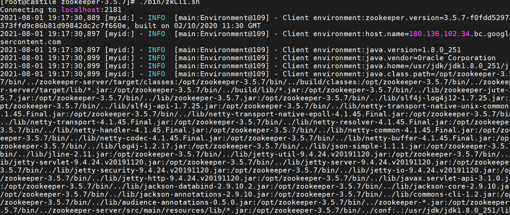

# ZooKeeper的安装及其配置参数

ZooKeeper下载:https://zookeeper.apache.org/releases.html

Zookeeper 是一个开源的分布式的，为分布式框架提供协调服务的 Apache 项目。 


# ZooKeeper安装

1. 首先将下载的tar包上传到服务器中

   apache-zookeeper-3.5.7-bin.tar.gz

2. 在/opt/下面解压出来, 并改名

   ```shell
   tar -zxvf apache-zookeeper-3.5.7-bin.tar.gz
   mv apache-zookeeper-3.5.7-bin zookeeper-3.5.7
   ```

3. 

3. 修改配置文件： 将/opt/zookeeper-3.5.7/conf 这个路径下的 zoo_sample.cfg 修改为 zoo.cfg； 

   ```shell
   cp zoo_sample.cfg zoo.cfg
   ```

4.  打开 zoo.cfg 文件，修改 dataDir 路径： 因为dataDir是存放节点数据，默认 放在/tmp目录下，但是tmp是临时目录，linux会定期删除，所以我们 需要另外指定目录。

   ```shell
   # The number of milliseconds of each tick
   tickTime=2000
   # The number of ticks that the initial 
   # synchronization phase can take
   initLimit=10
   # The number of ticks that can pass between 
   # sending a request and getting an acknowledgement
   syncLimit=5
   # the directory where the snapshot is stored.
   # do not use /tmp for storage, /tmp here is just 
   # example sakes.
   dataDir=/opt/zookeeper-3.5.7/zkData
   # the port at which the clients will connect
   clientPort=2181
   # the maximum number of client connections.
   # increase this if you need to handle more clients
   #maxClientCnxns=60
   #
   # Be sure to read the maintenance section of the 
   # administrator guide before turning on autopurge.
   #
   # http://zookeeper.apache.org/doc/current/zookeeperAdmin.html#sc_maintenance
   #
   # The number of snapshots to retain in dataDir
   #autopurge.snapRetainCount=3
   # Purge task interval in hours
   # Set to "0" to disable auto purge feature
   #autopurge.purgeInterval=1
   ```

5. 启动zookeeper, 使用jps命令查看zookeeper进程QuorumPeerMain

   ```shell
   ./bin/zkServer.sh start
   [root@castile zookeeper-3.5.7]# ./bin/zkServer.sh start
   ZooKeeper JMX enabled by default
   Using config: /opt/zookeeper-3.5.7/bin/../conf/zoo.cfg
   Starting zookeeper ... STARTED
   [root@castile zookeeper-3.5.7]# jps
   50058 QuorumPeerMain
   50077 Jps
   ```

6. 客户端连接

   ```shell
   ./bin/zkCli.sh
   ```

   

7. 停止ZooKeeper

   ```shell
    bin/zkServer.sh stop
   ```


# 配置参数解读

 Zookeeper中的配置文件zoo.cfg中参数含义解读如下 ：

1.  tickTime = 2000：通信心跳时间，Zookeeper服务器与客户端心跳时间，单位毫秒。 

2.  initLimit = 10：LF初始通信时限。 Leader和Follower**初始连接**时能容忍的最多心跳数。也就是初始化集群时集群节点同步超时时间为20s。

3.  syncLimit = 5：LF同步通信时限。 Leader和Follower之间通信时间如果超过syncLimit * tickTime，Leader认为Follwer死 掉，从服务器列表中删除Follwer。 即集群在运行过程中同步数据超时时间为10s。

4.  dataDir：保存Zookeeper中的数据。 注意：默认的tmp目录，容易被Linux系统定期删除，所以一般不用默认的tmp目录。

5.  clientPort = 2181：客户端连接端口，服务监听的端口号。通常不做修改。  

6. maxClientCnxns=60: 线程池数量为60个。

   

