# ZooKeeper的集群安装

# 集群规划


1. 需要三台服务器，至少三台吧。在三台节点上都部署zookeeper
2. zookeeper安装包
3. 三个节点的ip分别为：192.168.175.130、192.168.175.129、192.168.175.128

# 安装部署


## zookeeper安装

将zookeeper安装包都复制到对应节点的/opt/目录下: 使用scp命令用于给远程服务器传输数据。

```shell
scp apache-zookeeper-3.5.7-bin.tar.gz root@192.168.175.128:/opt/
scp apache-zookeeper-3.5.7-bin.tar.gz root@192.168.175.129:/opt/
```

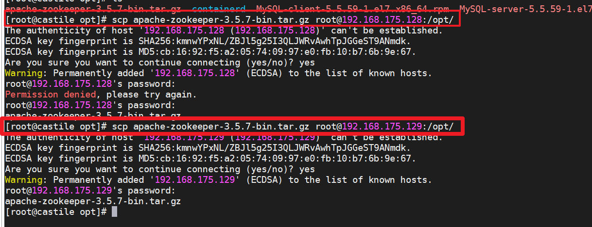

## 配置服务器编号

 在/opt/zookeeper-3.5.7/这个目录下创建 zkData

```shell
mkdir zkData
```

然后在zkData里面创建一个myid文件，文件名称必须是myid。 在文件中添加与 server 对应的编号（注意：上下不要有空行，左右不要有空格） 

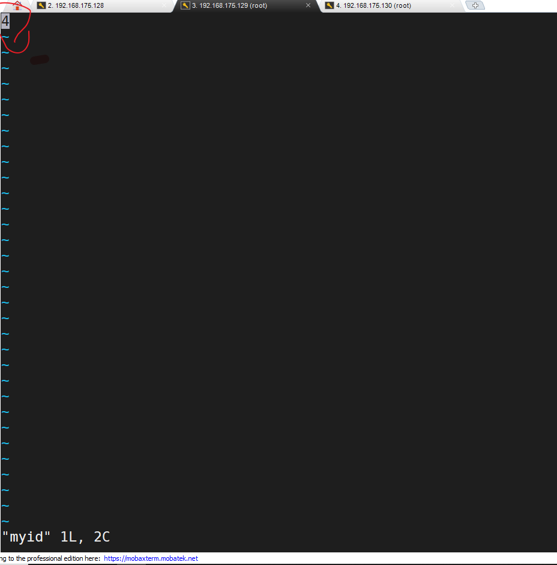

>  注意：添加 myid 文件，一定要在 Linux 里面创建，在 notepad++里面很可能乱码 

在其他的节点上也做这样的配置（可以复制过去）。

##  配置zoo.cfg文件 

1. 注意其他节点也需要修改对应的conf目录下的zoo.cfg配置中dataDir为zkData。

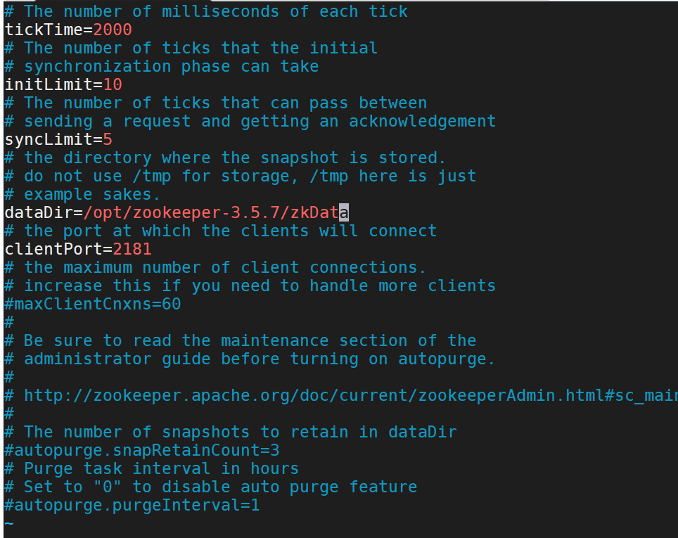

2.  增加如下配置 

   ```shell
   #######################cluster########################## 
   server.2=192.168.175.130:2888:3888 
   server.3=192.168.175.128:2888:3888 
   server.4=192.168.175.129:2888:3888  
   ```

   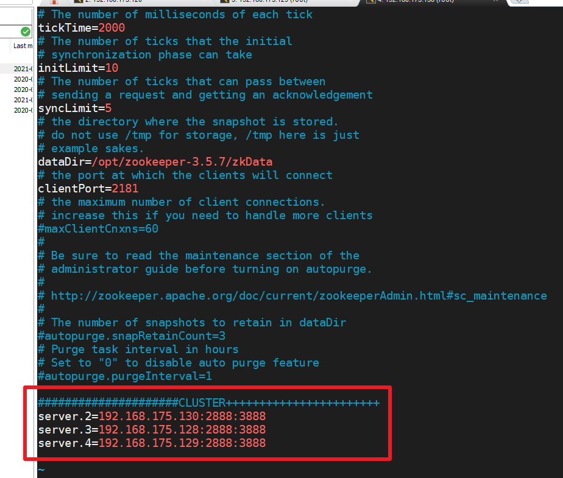

   配置参数解读 server.A=B:C:D:

   - A 是一个数字，表示这个是第几号服务器； 集群模式下配置一个文件 **myid**，这个文件在 dataDir 目录下，这个文件里面有一个数据 就是 A 的值，**Zookeeper 启动时读取此文件，拿到里面的数据与 zoo.cfg 里面的配置信息比较从而判断到底是哪个 server**。 

   - B 是这个服务器的地址； 

   -  C 是这个服务器 Follower 与集群中的 Leader 服务器交换信息的端口； 
   -  D 是万一集群中的 Leader 服务器挂了，需要一个端口来重新进行选举，选出一个新的 Leader，而这个端口就是用来执行选举时服务器相互通信的端口。 

   注意：这个zoo.cfg文件里面千万不能有空格！！！！！！！！！！！不然启动报错。。。

   

   查看日志说是配置文件的问题：

   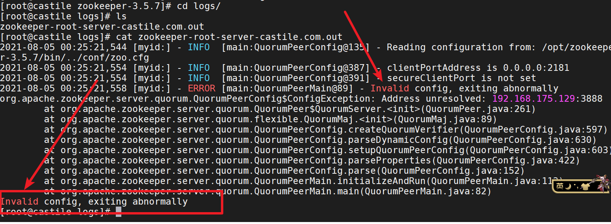

   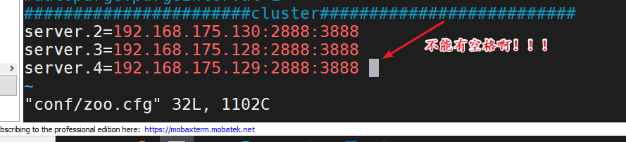

   修改后可以顺利启动。

   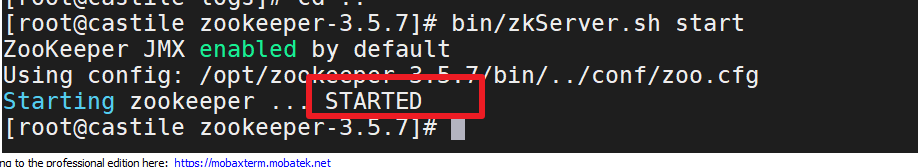

3. 同步zoo.cfg配置文件

   ​	`xsync zoo.cfg`

上述命令需要配置集群，修改hostname 已经hosts文件。暂未配置。

这一步骤将zoo.cfg同步到其他节点中。

## 集群操作

1. 分别在三个节点上启动 zookeeper

   ```shell
   bin/zkServer.sh start
   ```

   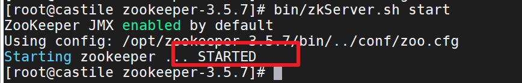

2. 查看各个节点的状态

   ```shell
    bin/zkServer.sh status
   ```

    192.168.175.128：follower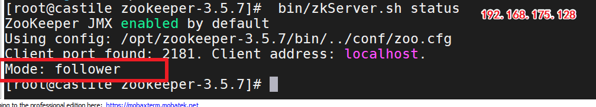

   192.168.175.129：leader
   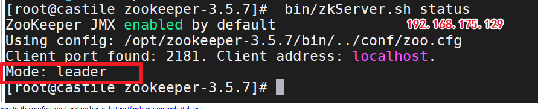

   192.168.175.130：follower

   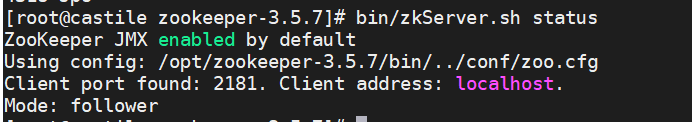

至此，三个节点搭建完毕。


# 修改主机名

ip地址可以更换，配置。

每次都需要输入ip地址来连接很麻烦，我们为三台虚拟机的主机重命名为castile、castile2、castile3

1.  修改/etc/sysconf/network

   ```shell
   vim /etc/sysconfig/network
   添加：
   
   NETWORKING=yes
   HOSTNAME=castile2
   ```

   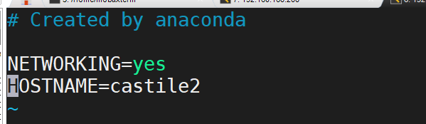

2. 修改hosts文件

   ```shell
   vim /etc/hosts
   ```

   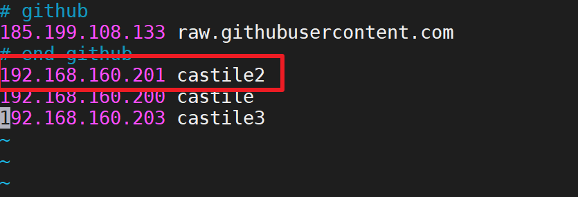

   也可以将其他两台机器的ip和hostname进行配置。

3. 重启网卡

   ```shell
   sevice network restart
   ```

4. 设置主机名

   ```shell
   hostnamectl set-hostname castile2
   ```

5. 重启即可


# 集群ssh免密登录

集群之间操作登录其他虚拟机的时候需要输入密码，非常麻烦，可以设置ssh免密登录。

1. 在主要操作的机器中使用ssh-keygen生成公钥和私钥

   ```shell
   ssh-keygen -t rsa
   ```

   一路回车即可，秘钥保存在~/.ssh/ 中，其中id_rsa为私钥，id_rsa.pub为公钥。

   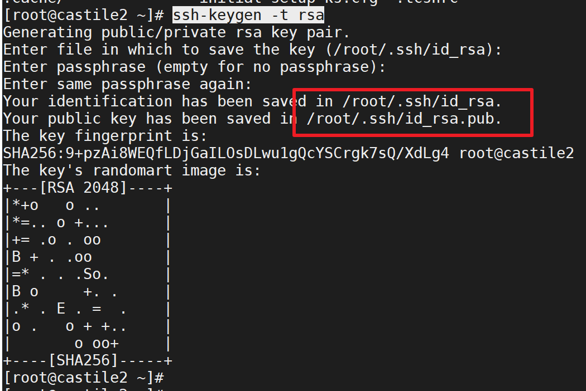

2. 将公钥的内容复制到authorized_keys里面

   ```shell
   cat ~/.ssh/id_rsa.pub >> ~/.ssh/authorized_keys
   cat authorized_keys
   ```

   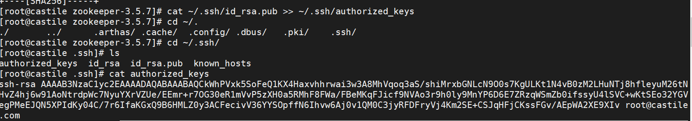

3. 在另外两台虚拟机进行同样的操作，并将他们的公钥内容复制到主机器的authorized_keys中，然后将这个authorized_keys复制到其他两台机器中~/.ssh/中。

   ```shell
   [root@castile .ssh]# cat ~/.ssh/id2.pub >> ~/.ssh/authorized_keys
   [root@castile .ssh]# cat ~/.ssh/id3.pub >> ~/.ssh/authorized_keys
   [root@castile .ssh]# cat authorized_keys
   ssh-rsa AAAAB3NzaC1yc2EAAAADAQABAAABAQCkWhPVxk5SoFeQ1KX4Haxvhhrwai3w3A8MhVqoq3aS/shiMrxbGNLcN9O0s7KgULKt1N4vB0zM2LHuNTj8hfleyuM26tNHvZ4hj6w91AoNtrdpWc7NyuYXrVZUe/EEmr+r7OG30eR1mVvP5zXH0a5RMhF8FWa/FBeMKqFJicf9NVAo3r9h0ly9MnYP6D6E7ZRzqWSmZb0ifssyU4lSVC+wKtSEo32YGVegPMeEJQN5XPIdKy04C/7r6IfaKGxQ9B6HMLZ0y3ACFecivV36YYSOpffN6Ihvw6Aj0v1QM0C3jyRFDFryVj4Km2SE+CSJqHFjCKssFGv/AEpWA2XE9XIv root@castile.com
   ssh-rsa AAAAB3NzaC1yc2EAAAADAQABAAABAQDk6hJBiXtUNi5RY+iDuzYrsg4fg5aLDnluecSXbGyzK+qb5p2xyKmh7dvVOFBer4EgzIm0uj84csvmnP03jtq+4iVDmqy01AE7VQKm11bTiK861FnPoeIeuITk+/YFvVA8zVMWdMpd1R7ZDAFUHKaIPHKKpk7z94SM9j62GDPg8E6Am0rozSAAeRZA09/uDHqCZ4nsK5CyL6Ycg/ZIyIEfHMesnsWUMTMUdRMIACLMYxDrbki30Zt6qZmTsqEFeRDD0URQ2jwUFynlWe8hhXQgT4R0GJQwZDvQ5TksqP6cON0KBcyQH+SVw4oJgJlDeYsEU0WgYTeQoMFdfn8JBCXT root@castile2
   ssh-rsa AAAAB3NzaC1yc2EAAAADAQABAAABAQDNgPj2aqwx2fXCWvEdf0lgf3AZPD7CDNiZiB5XlLiLzoUxDp/+graEr28ORY2/pDDTRGqge+UwJj+7/foCfyp662dceW9et5gnGE2HdmBGjo+ASdgSNu677cOx81E9iGjjLQTsp4GCGoFPEY8coYnR9S7MIb96BXLG7Ai0WzHocPETLUypFwnRDrc116+QO751fsmXL1R9s+ScbJj3AJVJ1Ef0aMG/VTpVHBj8bej67mKcV8A5rNCX1eVwh3XEqpGcvSymWXRAWat2fbiT3kKq4F4yg+4mm0qjKpXIYKyGmgvsHJ1LI2PIyes/fbLEVJPzaclh3I93SeXuE5jydRVx root@castile3
   
   
   [root@castile .ssh]# scp -r authorized_keys root@192.168.160.201:~/.ssh/
   root@192.168.160.201's password:
   authorized_keys                                                                                  100% 1188   529.8KB/s   00:00
   [root@castile .ssh]# scp -r authorized_keys root@192.168.160.203:~/.ssh/
   root@192.168.160.203's password:
   authorized_keys                                                                                  100% 1188   200.3KB/s   00:00
   [root@castile .ssh]# ssh castile2
   ssh: Could not resolve hostname castile2: Name or service not known
   [root@castile .ssh]# ssh 192.168.160.203
   Last login: Sun Aug  8 13:22:27 2021 from 192.168.160.1
   
   ```

   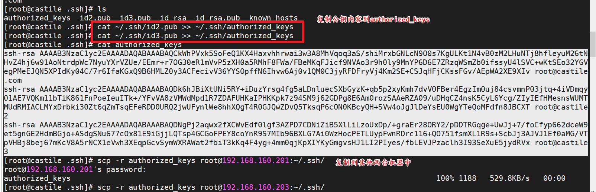


#  ZK 集群启动停止脚本 

```shell
vim zk.sh
```

```shell
#!/bin/bash

case $1 in
	"start" ){
		for i in castile castile2 castile3; do
			#statements
			echo --------------zookeeper $i start ---------------
			ssh $i "/opt/zookeeper-3.5.7/bin/zkServer.sh start"
		done
		
	};;
	"stop" ){
		for i in castile castile2 castile3; do
			#statements
			echo --------------zookeeper $i stop ---------------
			ssh $i "/opt/zookeeper-3.5.7/bin/zkServer.sh stop"
		done
		
	};;
	"status" ){
		for i in castile castile2 castile3; do
			#statements
			echo --------------zookeeper $i status ---------------
			ssh $i "/opt/zookeeper-3.5.7/bin/zkServer.sh status"
		done
		
	};;
esac
```

