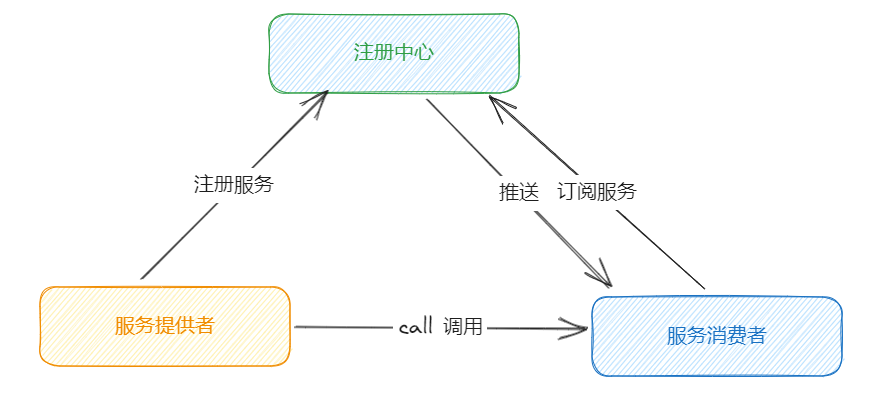

# RPC服务框架架构

RPC又称远程过程调用（Remote Procedure Call），用于解决分布式系统中服务之间的调用问题。他可以实现开发者能够像调用本地的方法一样去调用远程的服务。包含了三个重要的组成部分，分别是注册中心、服务提供者、服务消费者，其中，服务消费者也称之为客户端。

在一次RPC调用的时候，这三个组成部分的交互过程大致如下：

1、 服务提供者（微服务）启动的时候，会将自己的对外开发的服务列表（接口信息）注册到服务中心中，消费者想注册中心去订阅服务提供者的地址。

2、 消费者会通过一个本地的代理模块区调用服务提供者，这个代理Proxy模块会将调用的方法。参数等数据封装成网络字节流的形式去传输

3、在传输之前需要确定发给哪一个服务端，因此会先从服务列表中选取一个服务地址（可以做负载均衡），并将数据通过网络发送给服务端。

4、 服务提供者接受到消息后，进行解码，拿到要调用的方法和参数。

5、服务提供者根据解码后的请求去调用对应的服务，然后将返回结果封装成字节流发送给服务消费者。

# 服务的注册和发现

首先最重要的是服务提供者可以去注册到注册中心，消费者可以去注册中心订阅服务。

为什么要有注册中心呢？传统的分布式系统一般是通过http去调用远端服务，这往往需要知道具体的服务端地址、调用信息等，系统之间的耦合比较严重，为了更好的去洁癖客户端和服务端，引入了注册中心，可以优雅地处理服务的上线和下线。

注册中心实现服务的注册和发现功能。服务端自行注册服务列表，服务下线的时候需要将自己的服务列表元数据移除，并可通知对应的客户端。客户端发起调用的时候，自己去订阅获取注册中心的服务列表，并通过一些负载均衡算法选择其中的一个实例进行调用，

那么，如何处理服务下线的问题，服务下线是需要移除注册中心该服务的一些信息的，最能想到的办法就是，服务端主动发送清理消息给注册中心，但是如果服务节点异常退出，比如节点断点了，断网等，还来不及发送消息给注册中心，那么注册中心就一直存在异常服务节点的元数据了，从而可能会造成服务调用失败的问题。

为了避免上述问题，实现服务优雅下线比较好的方式是采用**主动通知 + 心跳检测**的方案。除了主动通知注册中心下线外，还需要增加节点与注册中心的心跳检测功能，这个过程也叫作探活。心跳检测可以由节点或者注册中心负责，例如注册中心可以向服务节点每 60s 发送一次心跳包，如果 3 次心跳包都没有收到请求结果，可以任务该服务节点已经下线 

# 通信协议和序列化

RPC 是远程调用，必然离不开网络通信协议。客户端在向服务端发起调用之前，需要考虑采用何种方式将调用信息进行编码，并传输到服务端。因为 RPC 框架对性能有非常高的要求，所以通信协议应该越简单越好，这样可以减少编解码的性能损耗。

RPC 框架可以基于不同的协议实现，大部分主流 RPC 框架会选择 TCP、HTTP 协议，出名的 gRPC 框架使用的则是 HTTP2。TCP、HTTP、HTTP2 都是稳定可靠的，但其实使用 UDP 协议也是可以的，具体看业务使用的场景 。

客户端和服务端在通信过程中要传输的数据主要有：

> 1. 调用的接口名称
> 2. 方法
> 3. 请求参数
> 4. 调用属性等信息

这些数据需要在客户端序列化成二进制，通过网络传输到服务端。服务端需要通过反序列化得到调用的信息，然后利用反射调用对应的方法，最后将结果、状态码、异常等信息返回。

# 调用方式

## 1、 同步调用

客户端线程发起RPC调用后会一直阻塞，知道拿到返回的结果。

## 2、 异步调用

客户端发起调用后不会再阻塞等待，而是拿到 RPC 框架返回的 Future 对象，调用结果会被服务端缓存，客户端自行决定后续何时获取返回结果 

## 3、 回调调用

客户端发起调用的时候，将callback对象传给rpc框架，无需等待结果。当得到服务端响应结果或者超时的时候，会执行用户注册的回调函数。callback一般包含onResponse 和 onException 两个方法，分别对应成功返回和异常返回两种情况。

## 4、 OneWay单向调用

 客户端发起请求之后直接返回 ，忽略他的返回结果。

# 线程模型

线程模型是RPC框架重要关注的部分，首先需要知道IO线程和业务线程的区别。

以Dubbo框架为例， Dubbo 使用 Netty 作为底层的网络通信框架，采用了我们熟悉的主从 Reactor 线程模型，其中 Boss 和 Worker 线程池就可以看作 I/O 线程。I/O 线程可以理解为主要负责处理网络数据，例如事件轮询、编解码、数据传输等。

业务逻辑如果能够立即完成，也可以使用 I/O 线程进行处理，这样可以省去线程上下文切换的开销。如果业务逻辑耗时较多，例如包含查询数据库、复杂规则计算等耗时逻辑，那么 I/O 必须将这些请求分发到业务线程池中进行处理，以免阻塞 I/O 线程 

 那么哪些请求需要在 I/O 线程中执行，哪些又需要在业务线程池中执行呢？Dubbo 框架的做法值得借鉴，它给用户提供了多种选择，它一共提供了 5 种分发策略，如下表格所示 

| 策略类型   | 描述                                                         |
| ---------- | ------------------------------------------------------------ |
| all        | 所有的请求、事件、心跳等都发送到业务线程池，也就是说Worker线程接收到事件后，会将事件提交到业务线程池中 |
| connection | 连接建立、断开事件放入队列排队执行，其他所有的消息都分发到业务线程池执行 |
| direct     | 所有事件都在IO线程池中执行                                   |
| execution  | 只有请求类的消息分发到业务线程池中执行，响应和其他事件消息直接在IO线程池中处理 |
| message    | 只有请求响应消息被分发到业务线程池中执行，其他事件消息都在IO线程池中执行 |

# 负载均衡

服务提供者和服务消费者多实例的，如何保证服务提供者的所有节点的负载均衡呢。主流的方法有以下几种：

 **Round-Robin 轮询**。 

 **Weighted Round-Robin 权重轮询** 

 **Least Connections 最少连接数** 

 **Consistent Hash 一致性 Hash**。 