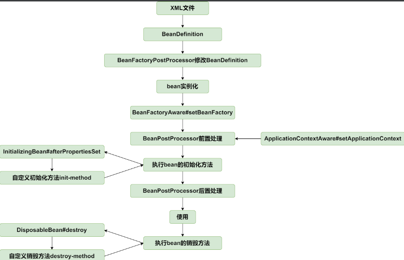

# 先考虑用户应该如何使用

## 1、 服务端

服务端定义一个服务接口

```java
/**
 * @author Hongliang Zhu
 * @create 2023-09-03 15:34
 */
public interface HelloService {

    /**
     * 打招呼
     *
     * @param name 姓名
     * @return
     */
    String hello(String name);
}

```

实现服务接口：

```java
/**
 * @author Hongliang Zhu
 * @create 2023-09-03 15:35
 */
@RpcService(serviceInterface = HelloService.class, serviceVersion = "1.0.0")
public class HelloServiceImpl implements HelloService{

    Override
    public String hello(String name) {
        return "hello" + name;
    }
}

```

在服务端启动的时候会向注册中心注册这个服务。


## 2、 消费端

```java
@RestController
public class HelloController {

    @RpcReference(serviceVersion = "1.0.0", timeout = 3000)
    private HelloFacade helloFacade;

    @RequestMapping(value = "/hello", method = RequestMethod.GET)
    public String sayHello() {
        return helloFacade.hello("mini rpc");
    }
}

```

# 服务提供者提供服务

## 1、RPC服务端

服务提供者采用的是主从 Reactor 线程模型，启动过程包括配置线程池、Channel 初始化、端口绑定三个步骤 

```java
package com.castile.rpc.provider;

import com.castile.rpc.provider.autoconfig.RpcProperties;
import io.netty.bootstrap.ServerBootstrap;
import io.netty.channel.ChannelFuture;
import io.netty.channel.ChannelInitializer;
import io.netty.channel.ChannelOption;
import io.netty.channel.nio.NioEventLoopGroup;
import io.netty.channel.socket.SocketChannel;
import io.netty.channel.socket.nio.NioServerSocketChannel;
import io.netty.handler.logging.LoggingHandler;
import lombok.extern.slf4j.Slf4j;
import org.springframework.boot.ApplicationArguments;
import org.springframework.boot.ApplicationRunner;
import org.springframework.stereotype.Component;

import javax.annotation.Resource;
import java.net.InetAddress;

/**
 * 启动RPC服务端，
 * <p>
 * 服务启动的时候进行服务发现与注册
 *
 * @author Hongliang Zhu
 * @create 2023-09-03 22:10
 */
@Component
@Slf4j
public class RpcServerRunner implements ApplicationRunner {

    @Resource
    private RpcProperties properties;

    public void run(ApplicationArguments args) throws Exception {
        String address = InetAddress.getLocalHost().getHostAddress();

        NioEventLoopGroup boss = new NioEventLoopGroup();
        NioEventLoopGroup worker = new NioEventLoopGroup();

        try {
            ServerBootstrap serverBootstrap = new ServerBootstrap().group(boss, worker)
                    .channel(NioServerSocketChannel.class)
                    .childHandler(new ChannelInitializer<SocketChannel>() {
                        @Override
                        protected void initChannel(SocketChannel socketChannel) throws Exception {

                            socketChannel.pipeline().addLast(new LoggingHandler());
                            // TODO 添加其他处理器， 如：编解码，消息请求处理

                        }
                    })
                    .option(ChannelOption.SO_KEEPALIVE, true);

            ChannelFuture channelFuture = serverBootstrap.bind(address, this.properties.getPort()).sync();
            log.info("连接信息：server addr {} started on port {}", address, this.properties.getPort());

            channelFuture.channel().closeFuture().sync();
        } catch (Exception e) {

            boss.shutdownGracefully();
            worker.shutdownGracefully();
        }

    }
}

```

## 2、发布服务

定义一个注解，用于标识一个服务

```jav
package com.castile.rpc.provider;

import org.springframework.stereotype.Component;

import java.lang.annotation.ElementType;
import java.lang.annotation.Retention;
import java.lang.annotation.RetentionPolicy;
import java.lang.annotation.Target;

/**
 * rpc服务注解
 *
 * @author Hongliang Zhu
 * @create 2023-09-03 15:51
 */
@Retention(RetentionPolicy.RUNTIME)
@Target(ElementType.TYPE)
@Component
public @interface RpcService {
    /**
     * 服务所在的接口
     *
     * @return 服务接口
     */
    Class<?> serviceInterface() default Object.class;

    /**
     * 服务版本
     *
     * @return 版本
     */
    String version() default "1.0.0";
}

```

有两个重要的属性，serviceInterface表示服务类型接口，version表示服务版本。 服务消费者必须指定完全一样的属性才能正确调用。有了 @RpcService 注解之后，我们就可以在服务实现类上使用它。

@RpcService 注解本质上就是 @Component，可以将服务实现类注册成 Spring 容器所管理的 Bean。这里需要了解Spring中Bean的生命周期了。



Spring的BeanPostProcessor接口提供了对Bean进行再加工的扩展点。 BeanPostProcessor 常用于处理自定义注解。自定义的 Bean 可以通过实现 BeanPostProcessor 接口，在 Bean 实例化的前后加入自定义的逻辑处理。如下所示，我们通过 RpcProvider 实现 BeanPostProcessor 接口，来实现对 声明 @RpcService 注解服务的自定义处理。

```java
package com.castile.rpc.provider;

import com.castile.rpc.provider.autoconfig.RpcProperties;
import lombok.extern.slf4j.Slf4j;
import org.springframework.beans.BeansException;
import org.springframework.beans.factory.config.BeanPostProcessor;
import org.springframework.stereotype.Component;

import javax.annotation.Resource;
import java.net.InetAddress;
import java.net.UnknownHostException;
import java.util.HashMap;
import java.util.Map;

/**
 * 扫描@RpcService注解，注册到注册中心中
 *
 * @author Hongliang Zhu
 * @create 2023-09-03 23:25
 */
@Slf4j
@Component
public class RpcProviderProcessor implements BeanPostProcessor {
    private final Map<String, Object> rpcServices = new HashMap<String, Object>();
    @Resource
    private RpcProperties properties;


    public Object postProcessAfterInitialization(Object bean, String beanName) throws BeansException {
        RpcService rpcService = bean.getClass().getAnnotation(RpcService.class);
        if (rpcService != null) {
            String serviceName = rpcService.serviceInterface().getName();
            String serviceVersion = rpcService.version();

            try {
                String address = InetAddress.getLocalHost().getHostAddress();


                ServiceMetaData serviceMetaData = new ServiceMetaData();
                serviceMetaData.setPort(properties.getPort());
                serviceMetaData.setServiceAddr(address);
                serviceMetaData.setServiceName(serviceName);
                serviceMetaData.setServiceVersion(serviceVersion);
                // TODO 封装注册信息，注册到注册中心

                rpcServices.put(serviceName + "#" + serviceVersion, bean);
            } catch (UnknownHostException e) {
                log.error("failed to register service {}#{}", serviceName, serviceVersion, e);
            }


        }
        return bean;
    }
}

```

# 服务消费者订阅服务

消费者不属于常驻服务， 每次发起 RPC 调用时它才会去选择向哪个远端服务发送数据。 对于声明 @RpcReference 注解的成员变量，我们需要构造出一个可以真正进行 RPC 调用的 Bean，然后将它注册到 Spring 的容器中。

 @RpcReference 注解的定义 ：

```java

@Retention(RetentionPolicy.RUNTIME)
@Target(ElementType.TYPE)
public @interface RpcReference {
    /**
     * 引用的服务版本
     *
     * @return 服务版本
     */
    String serviceVersion() default "1.0.0";

    /**
     * rpc调用的超时时间
     *
     * @return 超时时间
     */
    long timeout() default 3000;

}

```

需要为使用了@RpcReference注解的成员变量构造成一个自定义的bean对象，并且对该bean对象执行的所有方法进行拦截。

Spring 的 FactoryBean 接口可以帮助我们实现自定义的 Bean，FactoryBean 是一种特种的工厂 Bean，通过 getObject() 方法返回对象，而并不是 FactoryBean 本身。 

有了 @RpcReference 注解和 RpcReferenceBean 之后，我们可以使用 Spring 的扩展点 BeanFactoryPostProcessor 对 Bean 的定义进行修改。上文中服务提供者使用的是 BeanPostProcessor，BeanFactoryPostProcessor 和 BeanPostProcessor 都是 Spring 的核心扩展点，它们之间有什么区别呢？BeanFactoryPostProcessor 是 Spring 容器加载 Bean 的定义之后以及 Bean 实例化之前执行，所以 BeanFactoryPostProcessor 可以在 Bean 实例化之前获取 Bean 的配置元数据，并允许用户对其修改。而 BeanPostProcessor 是在 Bean 初始化前后执行，它并不能修改 Bean 的配置信息。 

```java
@Slf4j
@Component
public class RpcConsumerPostProcessor implements ApplicationContextAware, BeanClassLoaderAware, BeanFactoryPostProcessor {
    public static final String INIT_METHOD_NAME = "init";

    private final Map<String, BeanDefinition> rpcRefBeanDefinitions = new LinkedHashMap<>();


    private ApplicationContext context;

    private ClassLoader classLoader;

    @Override
    public void setBeanClassLoader(ClassLoader classLoader) {
        this.classLoader = classLoader;
    }

    @Override
    public void postProcessBeanFactory(ConfigurableListableBeanFactory configurableListableBeanFactory) throws BeansException {
        String[] beanDefinitionNames = configurableListableBeanFactory.getBeanDefinitionNames();
        for (String beanDefName : beanDefinitionNames) {
            BeanDefinition beanDefinition = configurableListableBeanFactory.getBeanDefinition(beanDefName);
            final String beanClassName = beanDefinition.getBeanClassName();
            if (beanClassName != null) {
                Class<?> clazz = ClassUtils.resolveClassName(beanClassName, this.classLoader);
                ReflectionUtils.doWithFields(clazz, this::parseRpcReference);
            }
        }
        // beanClassName = null
        BeanDefinitionRegistry registry = (BeanDefinitionRegistry) configurableListableBeanFactory;

        this.rpcRefBeanDefinitions.forEach((beanName, definition) -> {
            if (context.containsBean(beanName)) {
                throw new IllegalArgumentException("application  context already has a bean named " + beanName);
            } else {
                // 注册到spring中
                registry.registerBeanDefinition(beanName, rpcRefBeanDefinitions.get(beanName));
                log.info("registered RpcReferenceBean {} success.", beanName);
            }

        });

    }


    @Override
    public void setApplicationContext(ApplicationContext applicationContext) throws BeansException {
        this.context = applicationContext;

    }

    private void parseRpcReference(Field field) {
        RpcReference annotation = AnnotationUtils.getAnnotation(field, RpcReference.class);
        if (annotation != null) {
            BeanDefinitionBuilder builder = BeanDefinitionBuilder.genericBeanDefinition(RpcReferenceBean.class);
            builder.setInitMethodName(INIT_METHOD_NAME);
            builder.addPropertyValue("interfaceClass", field.getType());
            builder.addPropertyValue("serviceVersion", annotation.serviceVersion());
            builder.addPropertyValue("timeout", annotation.timeout());
            AbstractBeanDefinition definition = builder.getBeanDefinition();
            rpcRefBeanDefinitions.put(field.getName(), definition);
        }
    }
}

```

