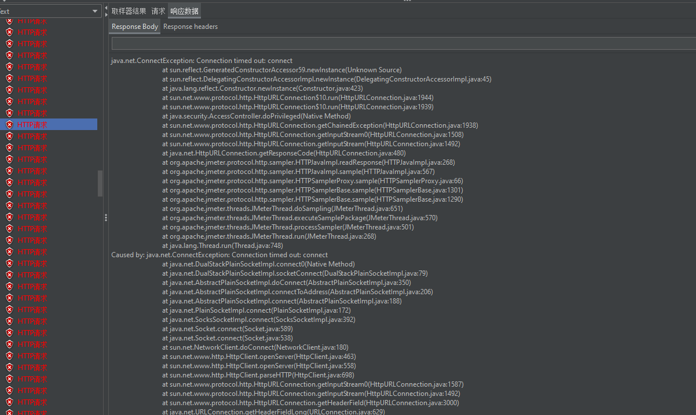

## Jmeter下载

https://jmeter.apache.org/download_jmeter.cgi#binaries


## jmeter使用简介


## 简单测试

我们先小测一把，模拟20个请求去访问商品详情页的接口


结果：

1、平均值接口响应为13ms

2、90线：表示有90%的请求的响应在26ms

3、95线：表示有95%的请求响应在33ms

4、吞吐量：2.1/s


## 发现容量问题

server端并发线程数上不去

我们使用的是springboot内嵌的tomcat

查看当前java进行开启的线程数量：pstree


```shell
[root@localhost config]# pstree -p 20919 | wc -l
29

```

目前有29个线程

### 100个线程、循环10次


### 500个线程、循环10次


### 5000个线程，循环100

服务已经出现拒绝连接了：



线程数量一直在219个：


### 原因分析

spring-configuration-metadata.json


项目使用的是springboot内嵌的tomcat容器，并且没有对参数进行特定设置；查看springboot的默认配置：

server.tomcat.accept-count： 等待队列的长度，默认100

server.tomcat.max-connections： 最大可被连接数，默认8192

server.tomcat.threads.min-spare：最小工作线程数，默认10

server.tomcat.threads.max： 最大工作线程数， 默认200

默认配置下，连接超过8192后出现拒绝连接情况

默认配置项啊，触发的请求超过200+100后拒绝处理。 

更改tomcat服务端参数：

```yaml
# 数据源
spring:
  datasource:
    type: com.alibaba.druid.pool.DruidDataSource
    driver-class-name: com.mysql.cj.jdbc.Driver
    username: root
    password: 123456
    url: jdbc:mysql://localhost:3306/castile-seckill?characterEncoding=utf8&zeroDateTimeBehavior=convertToNull&useSSL=false&useJDBCCompliantTimezoneShift=true&useLegacyDatetimeCode=false&serverTimezone=Asia/Shanghai

  # 404问题的处理, 非通用异常的返回设置
  mvc:
    throw-exception-if-no-handler-found: true
  web:
    resources:
      add-mappings: true


mybatis:
  mapper-locations: classpath:mapping/*.xml

server:
  port: 9090
  tomcat:
    accept-count: 1000
    threads:
      max: 800
      min-spare: 100

```

容器重新启动后，可以看到还没有开始压测的时候，启动后的线程数量为119：


### 优化后： 2000个线程，循环100


最大开启线程数819个


### 定制内嵌tomcat开发

```java
package com.castile.secondkill.config;

import org.apache.catalina.connector.Connector;
import org.apache.coyote.http11.Http11NioProtocol;
import org.springframework.boot.web.embedded.tomcat.TomcatConnectorCustomizer;
import org.springframework.boot.web.embedded.tomcat.TomcatServletWebServerFactory;
import org.springframework.boot.web.server.ConfigurableWebServerFactory;
import org.springframework.boot.web.server.WebServerFactoryCustomizer;
import org.springframework.context.annotation.Configuration;

/**
 * 当Spring容器内没有TomcatEmbeddedServletContainerFactory这个bean时，会把此bean加载到Spring容器中
 *
 * @author Hongliang Zhu
 * @create 2023-3-27 23:01:05
 */
@Configuration
public class WebServerConfiguration implements WebServerFactoryCustomizer<ConfigurableWebServerFactory> {

    @Override
    public void customize(ConfigurableWebServerFactory factory) {
        // 使用对应工厂类提供给我们的接口定制化我们的tomcat onnector
        ((TomcatServletWebServerFactory) factory).addConnectorCustomizers(new TomcatConnectorCustomizer() {
            @Override
            public void customize(Connector connector) {
                Http11NioProtocol protocol = (Http11NioProtocol) connector.getProtocolHandler();
                // 设置30秒内没有请求则断开keepalive连接
                protocol.setKeepAliveTimeout(30000);
                // 当客户端发送超过10000个请求则自动断开keepalive连接
                protocol.setMaxKeepAliveRequests(10000);
            }
        });
    }
}
```

KeepAliveTimeout: 多少毫秒后不响应就断开keepalive

MaxKeepAliveRequests： 多少次请求后keepalive断开

设置这两个参数是为了保证我们的系统不受客户端请求的拖累，在满足需求的同时提升性能


## 单web容量上限

线程数量：4U8G内存单进程调度线程数量800-1000以上后就花费巨大的时间在cpu的调度上

等待队列长度： 对列做缓冲池使用，但不能无限长，消耗内存，出队入队也耗cpu


## mysql数据库QPS容量问题

**经验**

- 主键查询：千万级别数据= 1-10ms

- 唯一索引查询：千万级别数据 = 10-100ms

- 非唯一索引查询： 千万级别数据=100-1000ms

- 无索引： 百万条数据=1000ms+

- 非插入更新删除操作： 同查询

  

