# 安装CentOs7

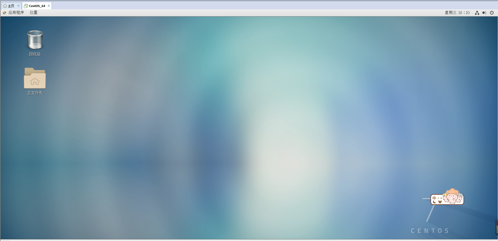

主要就是配置分区 /boot:200m 、 /:10240m(10G) 、 /swap:2048m

然后配置网络  ifconfig --> ssh远程连接。

# 安装mysql

在/opt目录下：

1. 检查是否安装过：  rpm -qa|grep -i mysql 

   yum -y remove maria*  删除 mariadb 

2. 下载服务器包：wget https://dev.mysql.com/get/Downloads/MySQL-5.5/MySQL-server-5.5.59-1.el7.x86_64.rpm

3. 下载客户端包：wget https://dev.mysql.com/get/Downloads/MySQL-5.5/MySQL-client-5.5.59-1.el7.x86_64.rpm

4. 安装客户端和服务端

   rpm -ivh --nodeps MySQL-server-5.5.59-1.el7.x86_64.rpm

   rpm -ivh --nodeps MySQL-client-5.5.59-1.el7.x86_64.rpm

   \# --nodeps就是安装时不检查依赖关系

5. 启动服务报错

   service mysql start 

   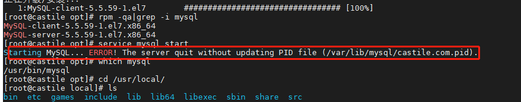

   **解决：**

   >  /usr/bin/mysql_install_db --user=mysql

   因为需要初始化，因为新安装的mysql服务后，一般需要执行数据库初始化操作 ，从而生成与权限相关的表，执行命令。

6. service mysql start 启动数据库

   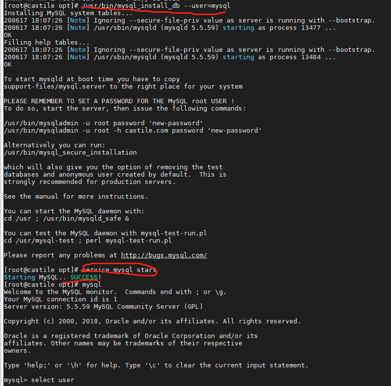

   

7. 设置mysql服务开机自启 ： systemctl enable mysql

   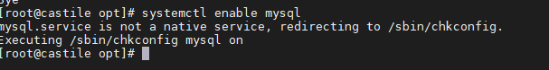

8. 验证自启动是否成功 : chkconfig mysql on

   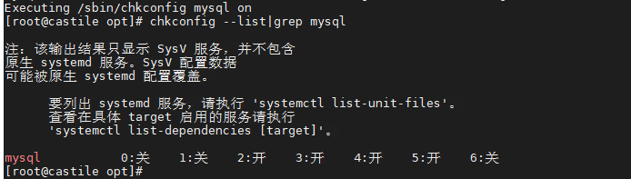

9. 查看mysql的安装位置： ps -ef|grep mysql

   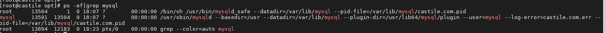
   
   

------


# 修改字符集

1. 尝试插入中文字符有乱码；

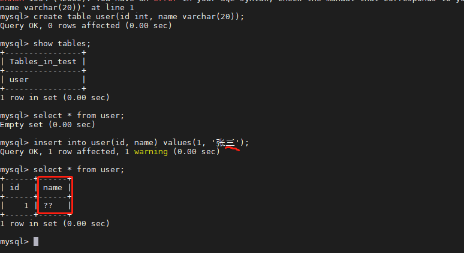

2. 查看字符集： mysql> show variables like 'character%';

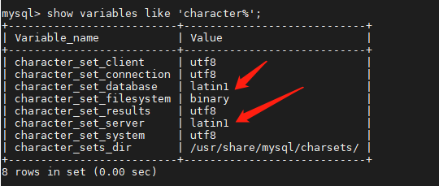

3. 修改字符集

   修改`my.cnf`
   在`/usr/share/mysql/` 中找到`my.cnf`的配置文件，
   拷贝其中的my-huge.cnf 到 /etc/  并命名为my.cnf 
   然后修改my.cnf:
   [client]
   default-character-set=utf8
   [mysqld]
   character_set_server=utf8
   character_set_client=utf8
   collation-server=utf8_general_ci
   [mysql]
   default-character-set=utf8

   但是我的并没有这个文件...

   

   只有上述几个，经查资料发现： 分别用于不同的硬件环境下的配置文件 

   > my-small.cnf                （内存 <= 64M）
   > my-medium.cnf               （内存 128M）
   > my-large.cnf                （内存 512M）
   > my-huge.cnf                 （内存 1G-2G）
   > my-innodb-heavy-4G.cnf      （内存 4GB）

 这里我的内存设置为2G，所以将my-huge.cnf复制到/etc/下并改名字为my.cnf 

然后打开修改字符集。 然后重新启动mysql。

但是原库的设定不会发生变化，参数修改只会对新建的数据库生效

4. 已生成的库表字符集如何变更
   	修改数据库的字符集：
      			`mysql> alter database mydb character set 'utf8';`
      	修改数据表的字符集：
      		`mysql> alter table mytbl convert to  character set 'utf8';`

 **但是原有的数据如果是用非'utf8'编码的话，数据本身不会发生改变。**

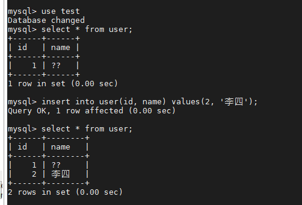


# 开启mysql的远程登录  

1 . 设置权限

> `grant all privileges on *.* to 'root'@'%' identified by 'root';` #权限放大到任何一台机器都可以远程登录
>
> `flush privileges;`

2. 关闭防火墙：systemctl stop firewall

3. 设置开机禁用防火墙：systemctl disable firewalld.service

4. 最重要一步： 

   打开文件查找到 [mysqld] ，在其下方添加上一行 **skip-grant-tables**，然后保存。 这样才可以成功连接。

   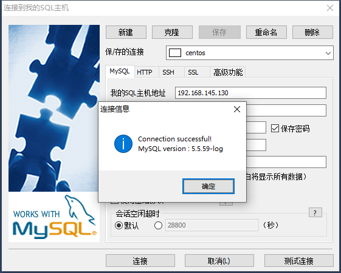

    

  systemctl和防火墙firewalld命令 见下：

```xml
 
一、防火墙的开启、关闭、禁用命令
 
（1）设置开机启用防火墙：systemctl enable firewalld.service
 
（2）设置开机禁用防火墙：systemctl disable firewalld.service
 
（3）启动防火墙：systemctl start firewalld
 
（4）关闭防火墙：systemctl stop firewalld
 
（5）检查防火墙状态：systemctl status firewalld 
 
二、使用firewall-cmd配置端口
 
（1）查看防火墙状态：firewall-cmd --state
 
（2）重新加载配置：firewall-cmd --reload
 
（3）查看开放的端口：firewall-cmd --list-ports
 
（4）开启防火墙端口：firewall-cmd --zone=public --add-port=9200/tcp --permanent
 
　　命令含义：
 
　　–zone #作用域
 
　　–add-port=9200/tcp #添加端口，格式为：端口/通讯协议
 
　　–permanent #永久生效，没有此参数重启后失效
 
　　注意：添加端口后，必须用命令firewall-cmd --reload重新加载一遍才会生效
 
（5）关闭防火墙端口：firewall-cmd --zone=public --remove-port=9200/tcp --permanent
```


# MySQL密码设置和开机启动

设置密码： /usr/bin/mysqladmin -u root password 123456

自启动 ：查看


以上是mysql的运行级别

我们运行： ntsysv

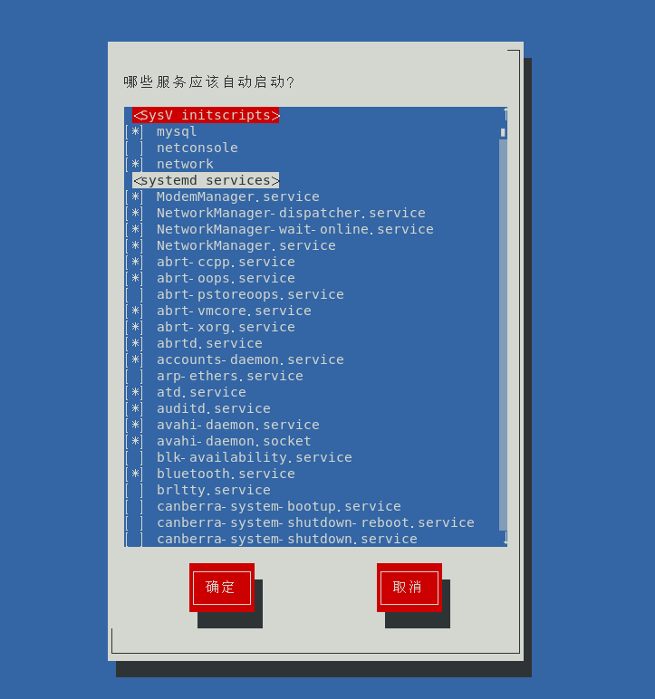

可以看到开机自启的服务，mysql服务前面有一个*号，表示开机自启


# 参考

1.  https://blog.csdn.net/u012402177/article/details/82870433 
2.  https://blog.csdn.net/IndexMan/article/details/84641233 
3.  https://blog.csdn.net/qq_22227087/article/details/80946894 
4.  https://www.cnblogs.com/weibanggang/p/11230528.html 
5.  https://www.cnblogs.com/nxmxl/p/11766671.html 