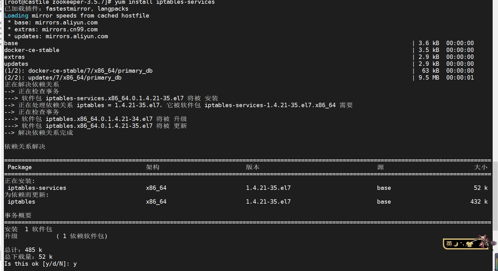
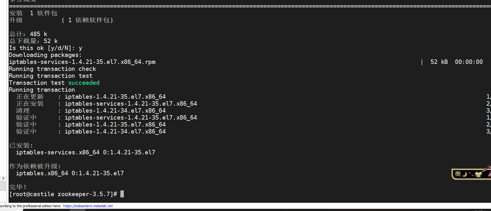
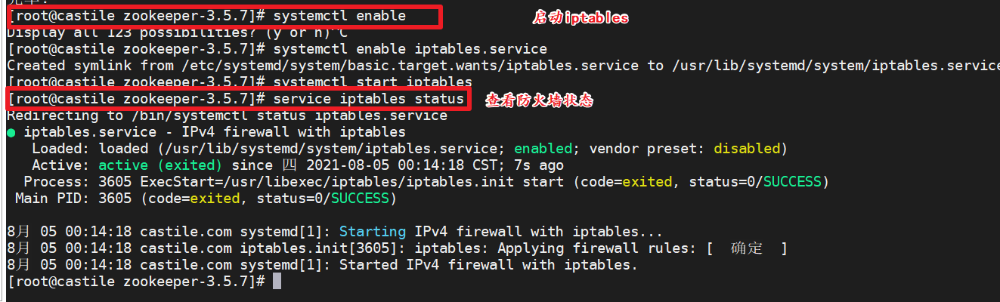

# Centos7防火墙问题:Unit iptables.service could not be found.


# 问题

在搭建zookeeper集群的时候出错，查看防火墙状态发现：

```shell
[root@castile zookeeper-3.5.7]# service iptables status
Redirecting to /bin/systemctl status iptables.service
Unit iptables.service could not be found.

```


# 解决

1. 安装iptables-services

   ```shell
    yum install iptables-services
   ```

   

   

2.  启动iptables 并查看状态

   


其他：

service iptables stop ： 关闭防火墙

chkconfig iptables off