# OO三要素

封装、继承、多态

为什么要有public、private、protected修饰符？

降低依赖。public公开，所有的成员都能使用，就增加了依赖，耦合

# 迪米特法则

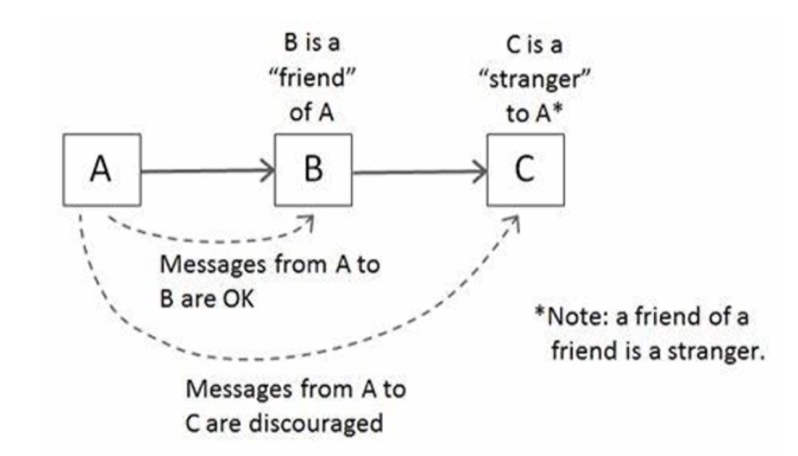

A是当前设计的类，B是A要调用的类，称之为A的好朋友。什么类才会成为A的好朋友？

字段、B作为A方法的一个参数、A负责创建了B

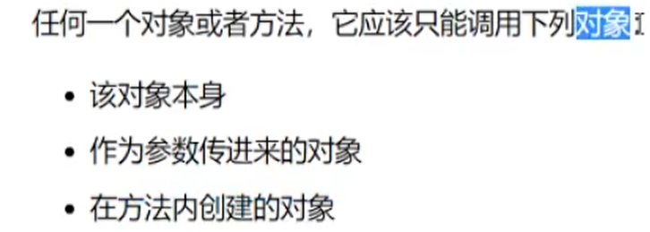

C是B的朋友，对于A来说，C是朋友的朋友，并不是自己的朋友，相当于陌生人，故，迪米特法则也叫“不要和陌生人说话”。

```java
package zhuhongliang.refactoring.demeter;

public class Paperboy {
    public void charge(Customer myCustomer, float payment) {
        Wallet theWallet = myCustomer.getWallet();
        if (theWallet.getTotalMoney() > payment) {
            theWallet.subtractMoney(payment);
        } else {
            //money not enough
        }
    }
}

```

PaperBoy :超时收银员，charge收钱方法，需要接受顾客Customer参数传进来。

```java
package zhuhongliang.refactoring.demeter;

public class Customer {
    private String firstName;
    private String lastName;
    private Wallet myWallet;
    public String getFirstName(){
        return firstName;
    }
    public String getLastName(){
        return lastName;
    }
    public Wallet getWallet(){
        return myWallet;
    }
}

```

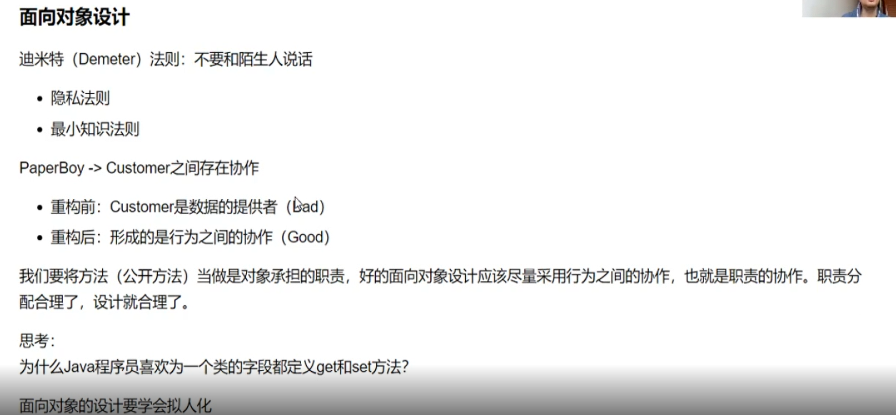


面向对象 拟人化，将每一个对象看做一个具有独立思考能力的人！

get、set


# 信息专家模式

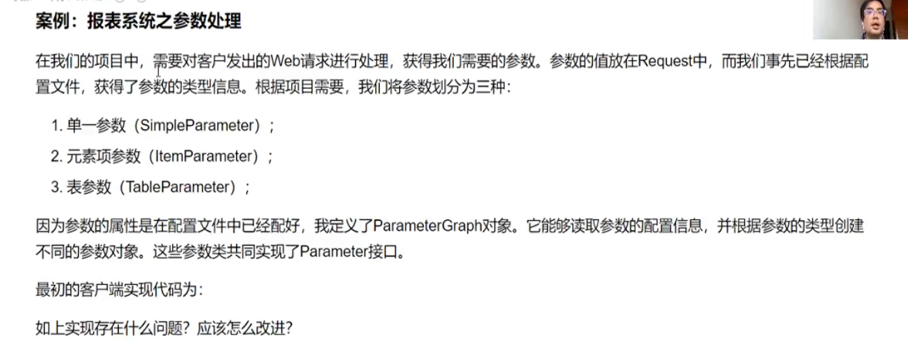


下面是原来的代码：

```java
public class ParameterController {
    public void fillParameters(HttpServletRequest request, ParameterGraph parameterGraph) {
        for (Parameter para : parameterGraph.getParameters()) {
            if (para instanceof SimpleParameter) {
                SimpleParameter simplePara = (SimpleParameter) para;
                String[] values = request.getParameterValues(simplePara.getName());
                simplePara.setValue(values);
            } else {
                if (para instanceof ItemParameter) {
                    ItemParameter itemPara = (ItemParameter) para;
                    for (Item item : itemPara.getItems()) {
                        String[] values = request.getParameterValues(item.getName());
                        item.setValues(values);
                    }
                } else {
                    TableParameter tablePara = (TableParameter) para;
                    String[] rows =
                            request.getParameterValues(tablePara.getRowName());
                    String[] columns =
                            request.getParameterValues(tablePara.getColumnName());
                    String[] dataCells =
                            request.getParameterValues(tablePara.getDataCellName());

                    int columnSize = columns.length;
                    for (int i = 0; i < rows.length; i++) {
                        for (int j = 0; j < columns.length; j++) {
                            TableParameterElement element = new TableParameterElement();
                            element.setRow(rows[i]);
                            element.setColumn(columns[j]);
                            element.setDataCell(dataCells[columnSize * i + j]);
                            tablePara.addElement(element);
                        }
                    }
                }
            }
        }
    }
}

```

## 问题

1. 大量的if else ，看到if else就要敏感起来。
2. 嵌套层次太多了，看看后面多少个大括号。
3. instanceof在静态语言中的使用可能会影响多态带来的好处。
4. 信息专家模式： 让操作这些数据的行为分配给拥有这些数据的对象。

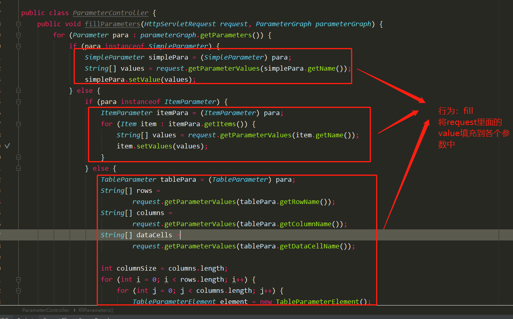

## 重构： 提取方法

所以进行重构：Ctrl+Alt+M

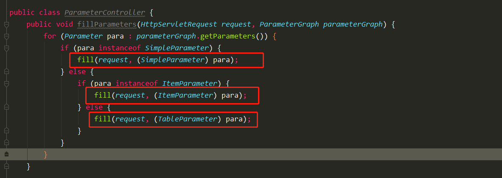

```java
    private void fill(HttpServletRequest request, TableParameter para) {
        TableParameter tablePara = para;
        String[] rows =
                request.getParameterValues(tablePara.getRowName());
        String[] columns =
                request.getParameterValues(tablePara.getColumnName());
        String[] dataCells =
                request.getParameterValues(tablePara.getDataCellName());

        int columnSize = columns.length;
        for (int i = 0; i < rows.length; i++) {
            for (int j = 0; j < columns.length; j++) {
                TableParameterElement element = new TableParameterElement();
                element.setRow(rows[i]);
                element.setColumn(columns[j]);
                element.setDataCell(dataCells[columnSize * i + j]);
                tablePara.addElement(element);
            }
        }
    }

    private void fill(HttpServletRequest request, ItemParameter para) {
        ItemParameter itemPara = para;
        for (Item item : itemPara.getItems()) {
            String[] values = request.getParameterValues(item.getName());
            item.setValues(values);
        }
    }

    private void fill(HttpServletRequest request, SimpleParameter para) {
        SimpleParameter simplePara = para;
        String[] values = request.getParameterValues(simplePara.getName());
        simplePara.setValue(values);
    }
```

## 重构： 方法移动

上面封装了是哪个函数，可以看到这些函数的参数是各自的Parameter（ItemParameter、SimpleParameter、TableParameter），所以需要移动这些方法到各自的类中，而不需要在当前ParameterController这个类里面。

移动方法的快捷键为： F6

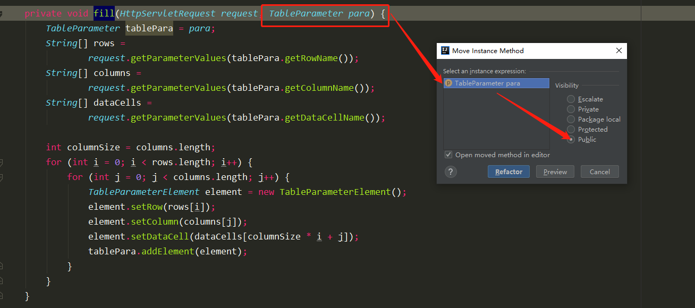

然后方法名也需要做一定的修改：这个函数的意思是将request里面的value填充到parameter中，所以 应该是 parameter fill with request这样的语序。

修改完的代码如下：

```java
public class ParameterController {
    public void fillParameters(HttpServletRequest request, ParameterGraph parameterGraph) {
        for (Parameter para : parameterGraph.getParameters()) {
            if (para instanceof SimpleParameter) {
                ((SimpleParameter) para).fillWith(request);
            } else {
                if (para instanceof ItemParameter) {
                    ((ItemParameter) para).fillWIth(request);
                } else {
                    ((TableParameter) para).fillWith(request);
                }
            }
        }
    }


```

## 重构： Pull Members Up 抽象接口

这个代码还有问题，可以看到这个三个Parameter类都有fillWith方法，他们都继承了Parameter接口，所以，可以将他们共有的方法抽象出来。放到接口这里。这里继续重构：Pull menbers Up

```java
package zhuhongliang.refactoring.report.engine;

import javax.servlet.http.HttpServletRequest;

public interface Parameter {
    String getName();

    void fillWith(HttpServletRequest request);
}
```

在接口这里定义了一个抽象方法。

然后可以看到这三个地方都变灰色了，这是无效的类型转换

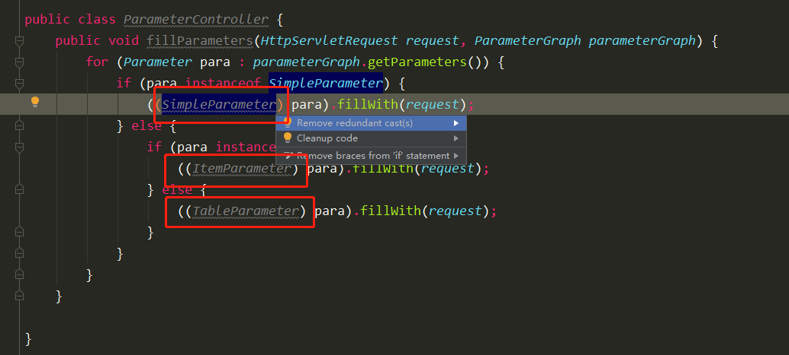

## 重构： 用多态替换分支Replace Switch by Polymorphism

**这是上述这写操作的目的**

可以发现代码一样，就不需要这么多if else了。。。

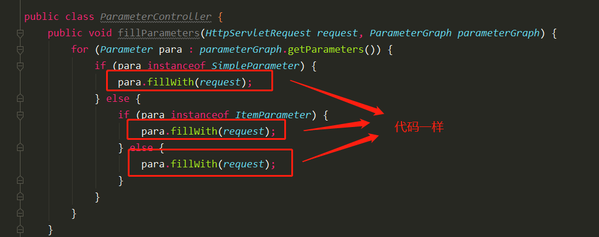

最终代码：

```java
public class ParameterController {
    public void fillParameters(HttpServletRequest request, ParameterGraph parameterGraph) {
        for (Parameter para : parameterGraph.getParameters()) {
            para.fillWith(request);
        }
    }
}
```

这样就很简洁了，而且多态的优势也体现出来了。

## 特性依恋

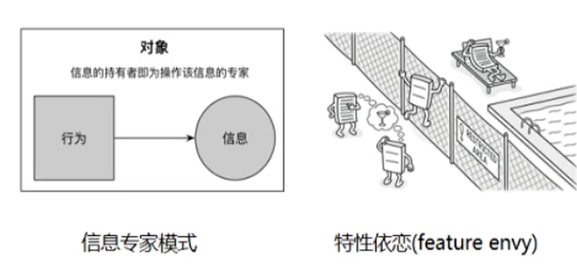

特性依恋（嫉妒）就是原本不属于它的东西抢过来了，这是坏味道，需要重构。


## 回顾迪米特法则

我们再看看现在的代码：

```java
public class ParameterController {
    public void fillParameters(HttpServletRequest request, ParameterGraph parameterGraph) {
        for (Parameter para : parameterGraph.getParameters()) {
            para.fillWith(request);
        }
    }
}
```

对于当前类：ParameterController， HttpServletRequest和ParameterGraph是他的朋友，但是Parameter属于ParameterGraph的朋友，那么，Parameter是当前类ParameterController朋友的朋友，破坏了迪米特法则，可以继续重构：for循环的代码不属于当前类的职责，应该是ParameterGraph的职责。

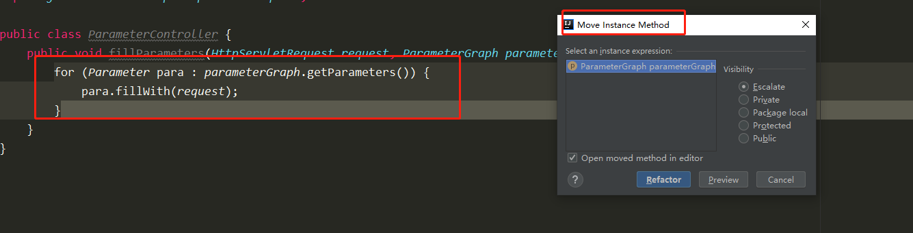

```java
public class ParameterGraph {
    public List<Parameter> getParameters() {
        return null;
    }

    public void fillWith(HttpServletRequest request) {
        for (Parameter para : getParameters()) {
            para.fillWith(request);
        }
    }
}
```

```java

public class ParameterController {
    public void fillParameters(HttpServletRequest request, ParameterGraph parameterGraph) {
        parameterGraph.fillWith(request);
    }

}
```


# 继承

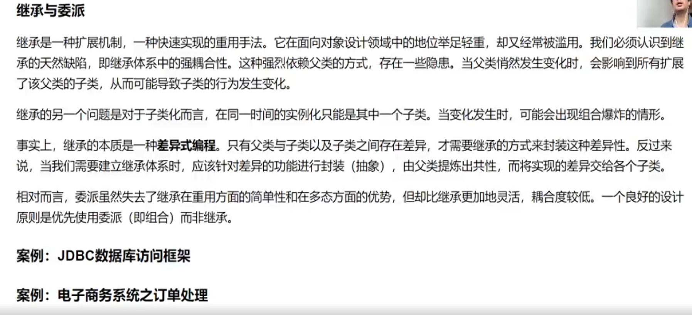

两个核心原则：

1. 面向接口设计
2. 组合/聚合有限复用原则

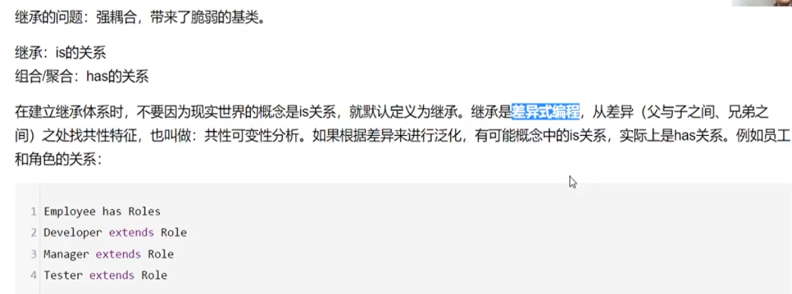

差异式编程，无差异，无继承。

## 重构案例： JDBC数据库访问框架

PartDB的案例体现了关注点分离原则。重构后的代码遵循单一抽象层次原则（SLAP），即方法中的所有操作应该处于同一个抽象层次。例如如下概念就不在同一个抽象的层次上：

苹果、香蕉、土豆、蔬菜、水果、大白菜。

很明显，苹果和香蕉都是属于水果，水果属于上一层的； 同理，土豆和大白菜都属于蔬菜。

```java
public class PartDB {
    private static final String DRIVER_CLASS = "";
    private static final String DB_URL = "";
    private static final String USER = "";
    private static final String PASSWORD = "";
    private static final String SQL_SELECT_PARTS = "select * from part";
    private List<Part> partList = new ArrayList<Part>();

    public void populate() throws Exception {
        Connection c = null;
        try {
            Class.forName(DRIVER_CLASS);
            c = DriverManager.getConnection(DB_URL, USER, PASSWORD);
            Statement stmt = c.createStatement();
            ResultSet rs = stmt.executeQuery(SQL_SELECT_PARTS);
            while (rs.next()) {
                Part p = new Part();
                p.setName(rs.getString("name"));
                p.setBrand(rs.getString("brand"));
                p.setRetailPrice(rs.getDouble("retail_price"));
                partList.add(p);
            }
        } finally {
            c.close();
        }
    }

```

违背了关注点分离原则，技术上的关注点和业务上的关注点。

上下分离，上就是泛化，下就是特定，可以使用继承。把通用的东西往上提，把特定的东西往下走。左右分离也是另一种关注点分离。

下面对上述代码进行重构：

### 重构：对代码进行按照职责分离，抽取方法

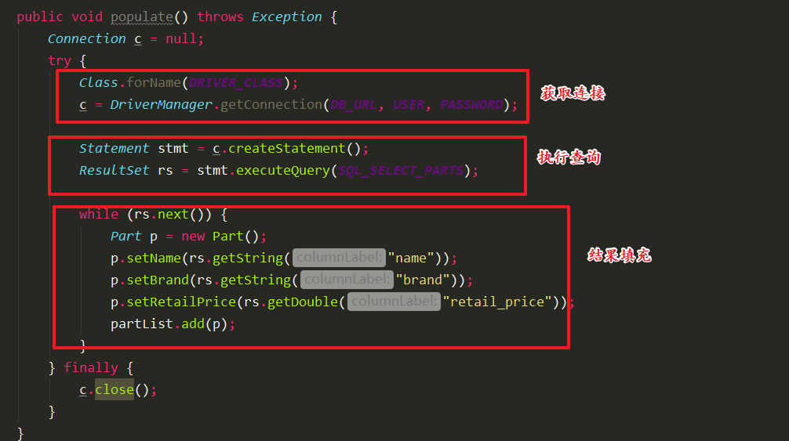

上述三个职责，可以单独提取方法出来。

```java
public class PartDB {
    private static final String DRIVER_CLASS = "";
    private static final String DB_URL = "";
    private static final String USER = "";
    private static final String PASSWORD = "";
    private List<Part> partList = new ArrayList<Part>();

    public void populate() throws Exception {
         try (Connection connection = getConnection()) {
            ResultSet rs = executeQuery(connection);
            PopulateEntities(rs);
        }
    }

    private void PopulateEntities(ResultSet rs) throws SQLException {
        while (rs.next()) {
            Part p = new Part();
            p.setName(rs.getString("name"));
            p.setBrand(rs.getString("brand"));
            p.setRetailPrice(rs.getDouble("retail_price"));
            partList.add(p);
        }
    }
    private ResultSet executeQuery(Connection connection) throws SQLException {
        Statement stmt = connection.createStatement();
        return stmt.executeQuery(getSql());
    }

    private String getSql() {
        return "select * from part";
    }

    private Connection executeQuery() throws Exception {
        Class.forName(DRIVER_CLASS);
        return DriverManager.getConnection(DB_URL, USER, PASSWORD);
    }
}
```

每一个方法都是在做一件相对内聚的事情。将具体的操作抽象出来，对于当前类，了解得越少越好。所谓抽象，就是关注what to do？ 比如getConnection()就主要是获取连接，但是怎么获取的我不需要知道，隐藏了细节。 populate()方法就比较简洁。

### 重构： 继承，通用的往上提

我们再看这三个方法（popu：late() 、executeQuery、executeQuery），这是哪个方法无论是抽象层次还是实现层次都跟业务无关，都是通用的代码。唯一跟业务有关的就是sql语句和PopulateEntities方法。

快捷键： Ctrl+Shift+Alt+T --> Extract super CLass

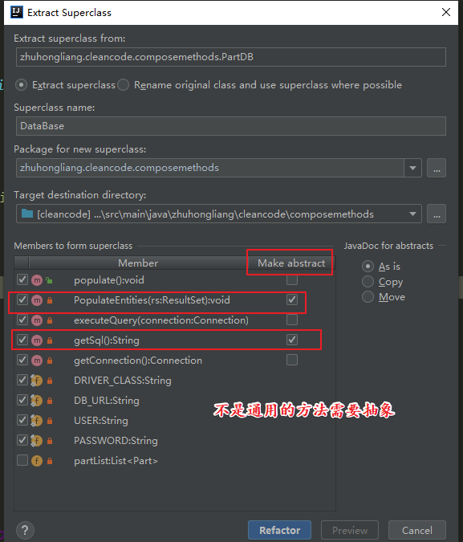

DataBase 单独抽取一个父类出来：

```java
package zhuhongliang.cleancode.composemethods;

import java.sql.*;

/**
 * @author Hongliang Zhu
 * @create 2021-07-30 23:11
 */
public abstract class DataBase {
    private static final String DRIVER_CLASS = "";
    private static final String DB_URL = "";
    private static final String USER = "";
    private static final String PASSWORD = "";

    public void populate() throws Exception {
        try (Connection connection = getConnection()) {
            ResultSet rs = executeQuery(connection);
            PopulateEntities(rs);
        }
    }

    protected abstract void PopulateEntities(ResultSet rs) throws SQLException;

    private ResultSet executeQuery(Connection connection) throws SQLException {
        Statement stmt = connection.createStatement();
        return stmt.executeQuery(getSql());
    }

    protected abstract String getSql();

    private Connection getConnection() throws Exception {
        Class.forName(DRIVER_CLASS);
        return DriverManager.getConnection(DB_URL, USER, PASSWORD);
    }
}

```

## 重构案例 电子商务订单处理案例

电子商务订单处理案例

```java
package zhuhongliang.cleancode.slap.service;

import zhuhongliang.cleancode.slap.entity.Customer;
import zhuhongliang.cleancode.slap.entity.Training;
import zhuhongliang.cleancode.slap.infrastructure.DatabasePool;

import java.sql.*;
import java.util.List;

public class TrainingService {
    private DatabasePool dbPool;

    public void subscribe(List<Training> trainings, Customer customer) throws SQLException {
        Connection c = null;
        PreparedStatement ps = null;
        Statement s = null;
        ResultSet rs = null;
        boolean transactionState = false;
        try {
            s = c.createStatement();
            transactionState = c.getAutoCommit();
            c.setAutoCommit(false);
            for (Training training : trainings) {
                addTrainingItem(customer, training);
            }
            addOrder(customer, trainings);
            c.commit();
        } catch (SQLException sqlx) {
            c.rollback();
            throw sqlx;
        } finally {
            try {
                c.setAutoCommit(transactionState);
                dbPool.release(c);
                if (s != null) s.close();
                if (ps != null) ps.close();
                if (rs != null) rs.close();
            } catch (SQLException ignored) {
            }
        }
    }

    private void addOrder(Customer customer, List<Training> trainings) {


    }

    private void addTrainingItem(Customer customer, Training training) {


    }
}

```


