## 本地打包

我们使用jar包与配置文件分离的方式进行打包：

```xml
<plugin>
                <groupId>org.apache.maven.plugins</groupId>
                <artifactId>maven-jar-plugin</artifactId>
                <configuration>
                    <!--不打入jar包的文件类型或者路径-->
                    <excludes>
                        <exclude>**/*</exclude>
                    </excludes>
                    <archive>
                        <manifest>
                            <!-- 执行的主程序路径 -->
                            <mainClass>com.castile.secondkill.CastileSeckillApplication</mainClass>
                            <!--是否要把第三方jar放到manifest的classpath中-->
                            <addClasspath>true</addClasspath>
                            <!--生成的manifest中classpath的前缀，因为要把第三方jar放到lib目录下，所以classpath的前缀是lib/-->
                            <classpathPrefix>lib/</classpathPrefix>
                            <!-- 打包时 MANIFEST.MF 文件不记录的时间戳版本 -->
                            <useUniqueVersions>false</useUniqueVersions>
                        </manifest>
                        <manifestEntries>
                            <!-- 在 Class-Path 下添加配置文件的路径 -->
                            <Class-Path>config/</Class-Path>
                        </manifestEntries>
                    </archive>
                </configuration>
            </plugin>

            <plugin>
                <groupId>org.apache.maven.plugins</groupId>
                <artifactId>maven-dependency-plugin</artifactId>
                <executions>
                    <execution>
                        <id>copy</id>
                        <phase>package</phase>
                        <goals>
                            <goal>copy-dependencies</goal>
                        </goals>
                        <configuration>
                            <outputDirectory>${project.build.directory}/lib/</outputDirectory>
                        </configuration>
                    </execution>
                </executions>
            </plugin>
            <plugin>
                <artifactId>maven-resources-plugin</artifactId>
                <executions>
                    <execution>
                        <id>copy-resources</id>
                        <phase>package</phase>
                        <goals>
                            <goal>copy-resources</goal>
                        </goals>
                        <configuration>
                            <resources>
                                <!--把配置文件打包到指定路径-->
                                <resource>
                                    <directory>src/main/resources/</directory>
                                    <includes>
                                        <include>**/*</include>
                                    </includes>
                                </resource>
                            </resources>
                            <outputDirectory>${project.build.directory}/config</outputDirectory>
                        </configuration>
                    </execution>
                </executions>
            </plugin>
```

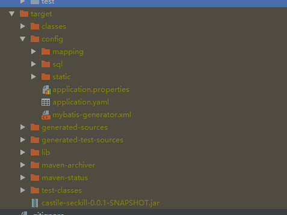

配置文件放在config目录下，项目依赖的jar包放在lib目录下。


## docker远程访问

 修改 /usr/lib/systemd/system/docker.service 文件，ExecStart中加入如下内容 

 -H tcp://0.0.0.0:2375  -H unix:///var/run/docker.sock 

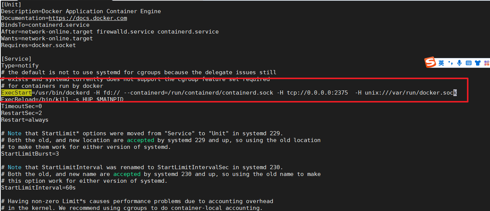

重启docker让它生效

```shell
systemctl daemon-reload    
systemctl restart docker 
```

## idea测试docker连接

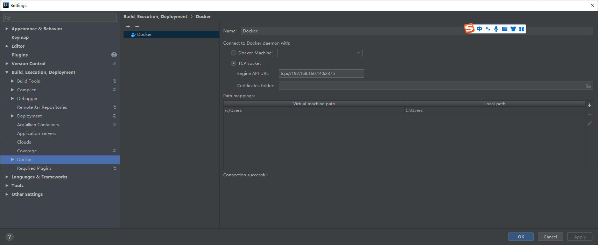

可以看到连接成功：


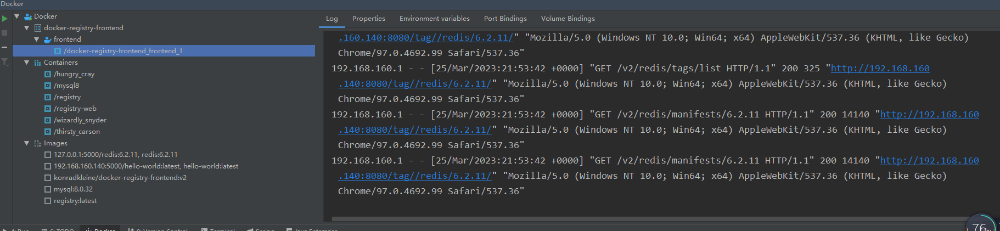


## 制作镜像

 项目中引入docker-maven-plugin插件，在pom.xml引入插件并做相应的配置： 

### 1、打包的时候忽略resource配置

```xml
 <resources>
            <resource>
                <directory>src/main/resources</directory>
                <excludes>
                    <exclude>**/**</exclude>
                </excludes>
            </resource>
        </resources>
```

### 2. lib、config目录的构建

```xml
<plugin>
                <groupId>org.apache.maven.plugins</groupId>
                <artifactId>maven-dependency-plugin</artifactId>
                <executions>
                    <execution>
                        <id>copy</id>
                        <phase>package</phase>
                        <goals>
                            <goal>copy-dependencies</goal>
                        </goals>
                        <configuration>
                            <outputDirectory>${project.build.directory}/lib/</outputDirectory>
                        </configuration>
                    </execution>
                </executions>
            </plugin>
            <plugin>
                <artifactId>maven-resources-plugin</artifactId>
                <executions>
                    <execution>
                        <id>copy-resources</id>
                        <phase>package</phase>
                        <goals>
                            <goal>copy-resources</goal>
                        </goals>
                        <configuration>
                            <resources>
                                <!--把配置文件打包到指定路径-->
                                <resource>
                                    <directory>src/main/resources/</directory>
                                    <includes>
                                        <include>**/*</include>
                                    </includes>
                                </resource>
                            </resources>
                            <outputDirectory>${project.build.directory}/config</outputDirectory>
                        </configuration>
                    </execution>
                </executions>
            </plugin>
```

### 3、启动类-boot-jar

```xml
            <plugin>
                <groupId>org.springframework.boot</groupId>
                <artifactId>spring-boot-maven-plugin</artifactId>
                <configuration>
                    <includes>
                        <include>
                            <groupId>none-group</groupId>
                        </include>
                    </includes>
                    <layout>ZIP</layout>
                    <attach>true</attach>
                    <classifier>boot</classifier>
                    <!-- 执行的主程序路径 -->
                    <mainClass>com.castile.secondkill.CastileSeckillApplication</mainClass>

                </configuration>
                <executions>
                    <execution>
                        <goals>
                            <goal>
                                repackage
                            </goal>
                        </goals>
                    </execution>
                </executions>
            </plugin>
```

### 4、镜像构建

```xml
<plugin>
                <!-- https://mvnrepository.com/artifact/com.spotify/docker-maven-plugin -->
                <groupId>com.spotify</groupId>
                <artifactId>docker-maven-plugin</artifactId>
                <version>1.2.2</version>
                <executions>
                    <!-- 当mvn执行install操作的时候，执行docker的build和push -->
                    <execution>
                        <id>buildAndPush</id>
                        <phase>install</phase>
                        <goals>
<!--                            <goal>build</goal>-->
<!--                            <goal>push</goal>-->
                        </goals>
                    </execution>
                    <execution>
                        <id>build-docker</id>
                        <phase>package</phase>
                        <goals>
                            <goal>build</goal>
                        </goals>
                    </execution>
                </executions>
                <configuration>
                    <!-- 连接到 带docker环境的linux服务器 编译image -->
                    <dockerHost>${docker.host}</dockerHost>
                    <!-- push到 docker hub 开始 -->
                    <!-- serverId 这个是配置在maven的setting.xml中私服的登录账户信息-->
                    <retryPushCount>1</retryPushCount>
                    <retryPushTimeout>2000</retryPushTimeout>
                    <registryUrl>${docker.registry}</registryUrl>
                    <!-- 格式：私有仓库/镜像名称:版本号, 如果要执行push操作， 那么镜像名称必须为私有仓库为前缀，不然无效。-->
                    <imageName>${docker.registry}/${project.artifactId}:${imageVersion}</imageName>
                    <!-- push到 docker hub 结束 -->
                    <!--指定dockerfile文件路径-->
                    <dockerDirectory>${project.basedir}/src/main/docker</dockerDirectory>
                    <!-- optionally overwrite tags every time image is built with docker:build -->
                    <forceTags>true</forceTags>
                    <buildArgs>
                        <SERVICE_PACKAGE>${project.basedir}/../../target/${finalName}.tar.gz</SERVICE_PACKAGE>
                    </buildArgs>
                    <resources>
                        <resource>
                            <targetPath>/opt/castile/app</targetPath>
                            <directory>${project.build.directory}</directory>
                            <includes>
                                <include>lib/*</include>
                                <include>config/**/*</include>
                                <include>*-boot.jar</include>
                            </includes>
                        </resource>
                       <!-- <resource>
                            <targetPath>/</targetPath>
                            <directory>${project.build.directory}</directory>
                            <includes>
                                <include>${finalName}.tar.gz</include>
                            </includes>
                        </resource>-->
                    </resources>

                </configuration>
            </plugin>

```

### 5、Dockerfile

```shell
FROM openjdk:8
ARG SERVICE_PACKAGE
MAINTAINER zhuhongliang 'castile.github.io'
ENV APP_HOME=/opt/castile/app

ADD opt/castile/app /opt/castile/app/
EXPOSE 9090
WORKDIR /opt/castile/app
#CMD  /bin/bash ${APP_HOME}/config/docker-start.sh
ENTRYPOINT ["java", "-Xbootclasspath/a:/opt/castile/app/config", "-Djava.ext.dirs=/opt/castile/app/lib:$JAVA_HOME/jre/lib/ext","-jar","/opt/castile/app/castile-seckill-0.0.1-SNAPSHOT-boot.jar"]
```

推送至docker私服：

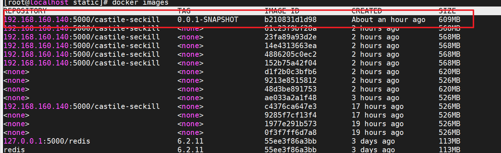

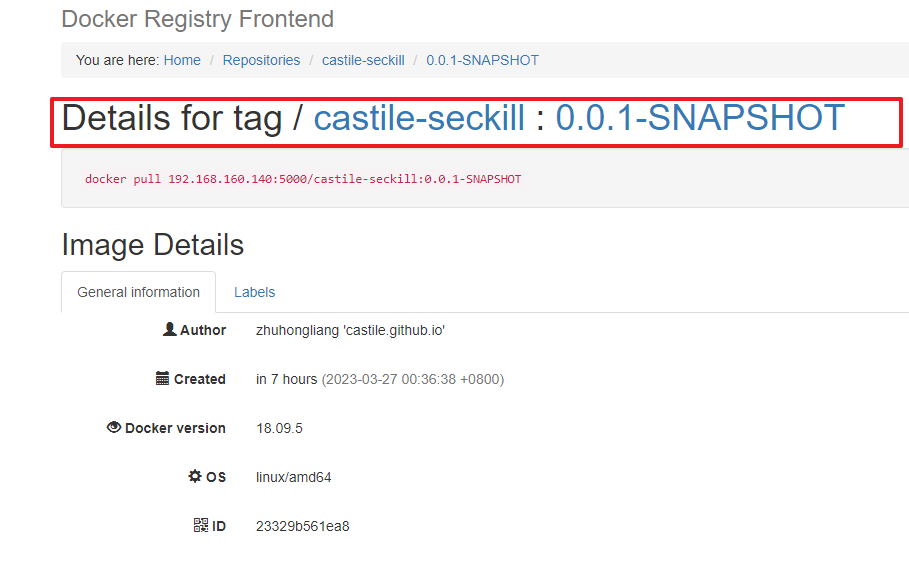

## 启动部署

```shell
docker run -d --name castile -p 9090:9090 -v /opt/applications/castile-seckill/config/:/opt/castile/app/config  192.168.160.140:5000/castile-seckill:0.0.1-SNAPSHOT

```

这里设置宿主机的opt/applications/castile-seckill/config/目录和容器内/opt/castile/app/config目录映射，为了修改配置方便些。

执行的java命令：

```shell
java -Xbootclasspath/a:/opt/castile/app/config -Djava.ext.dirs=/opt/castile/app/lib:$JAVA_HOME/jre/lib/ext -jar /opt/castile/app/castile-seckill-0.0.1-SNAPSHOT-boot.jar
```


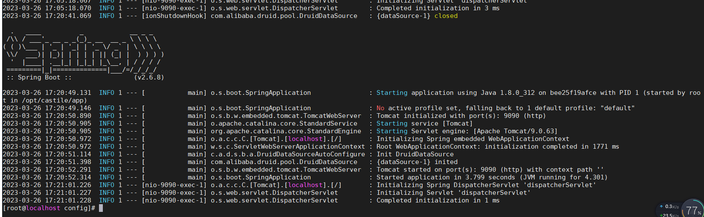

## 部署msql

因为项目依赖mysql，因此需要把mysql容器先启动，再启动项目

```shell
docker run --name mysql8 -v /var/mysql/data:/var/lib/mysql -v /var/mysql/conf.d -e MYSQL_ROOT_PASSWORD=123456 -p 3306:                                      3306 -d mysql:8.0.32
```

设置远程访问：

```mysql
select host, user, plugin,  authentication_string, password_expired from user;
```

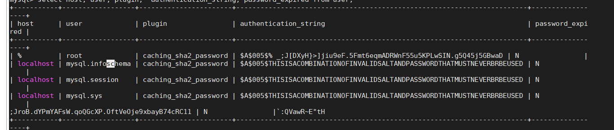

```sql
 ALTER USER root@'%' IDENTIFIED WITH mysql_native_password BY '123456';
 ALTER USER root@'localhost' IDENTIFIED WITH mysql_native_password BY '123456';
 
 刷新权限
  FLUSH PRIVILEGES;
```

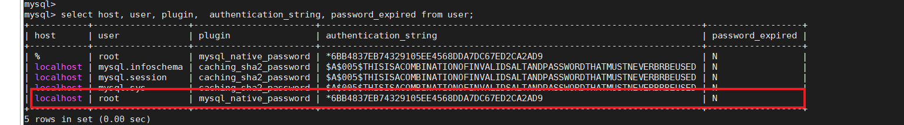

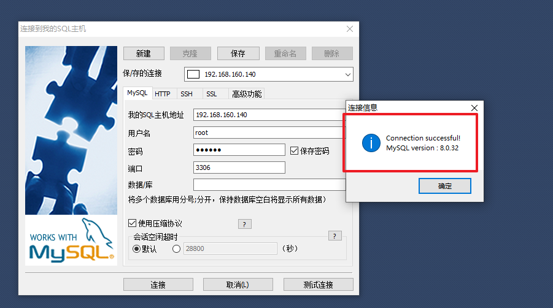

## 测试访问

浏览器输入：

```shell
http://192.168.160.140:9090/login.html
```

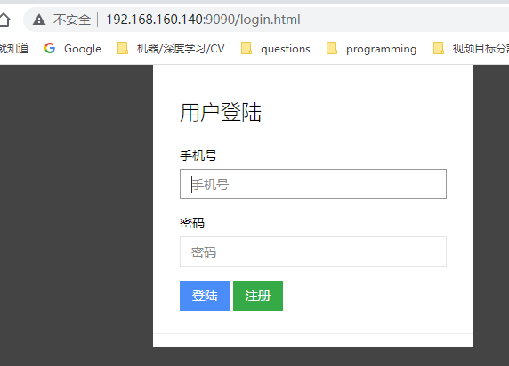

已经可以成功访问啦，可以验证基本功能都正常。

