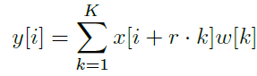
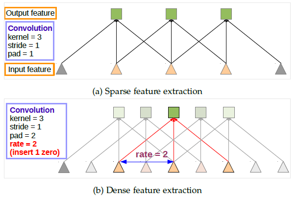
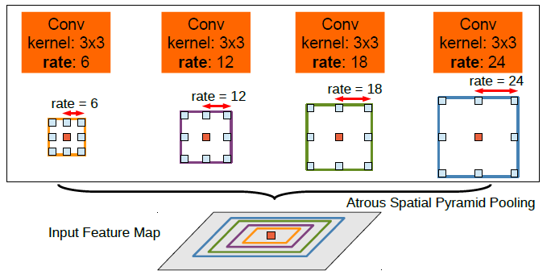
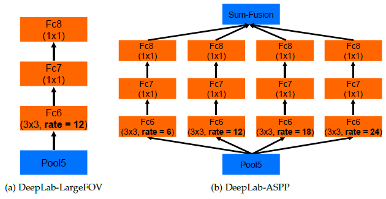
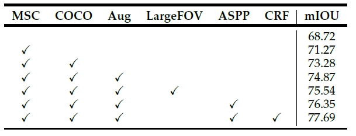
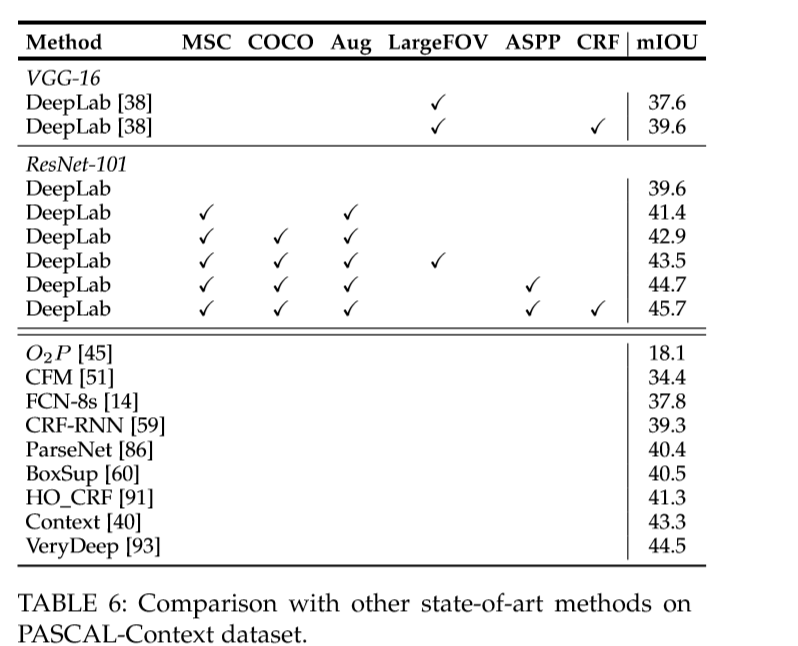
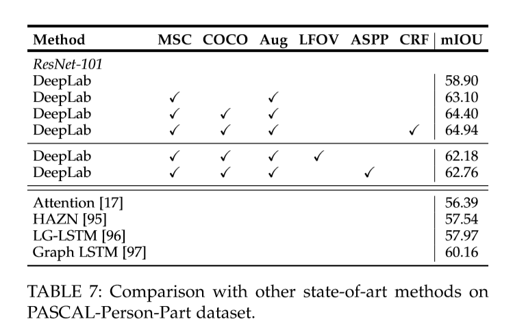

来自： [review-deeplabv1-deeplabv2-atrous-convolution-semantic-segmentation](https://towardsdatascience.com/review-deeplabv1-deeplabv2-atrous-convolution-semantic-segmentation-b51c5fbde92d )

 # Overview

在本文中，回顾了DeepLabv1和DeepLabv2网络，因为他们都使用带孔卷积 Atrous Convolution和全连接的条件随机场（Conditional Random Field，CRF），除了DeepLabv2有一个额外的技术叫做空间金字塔池化Atous Spatial Pyramid Pooling（ASPP），这是DeepLabv2与DeepLabv1的主要区别。 （当然，还有其他差别，例如：DeepLabv2使用ResNet和VGGNet进行实验，但DeepLabv1仅使用VGGNet。） 

 

上图是DeepLab模型架构。首先，输入图像通过网络中的atrous卷积和ASPP。然后，网络的输出图进行双线性插值bilinearly interpolated，并通过完全连接的CRF来微调结果并获得最终输出。

DeepLabv1和DeepLabv2已经在2015 ICLR和2018 TPAMI上发布。

本文涉及的内容：

1. 带孔卷积
2. 空间金字塔池化
3. 全连接的条件随机场
4. 实验结果

 # Atrous 卷积 

“Atrous”这个词确实来自法语“àtrous”意思：洞。因此Atrous conv.也被称为“空洞卷积”。一些论文也称之为"dilated convolution"。它通常用于小波变换，现在它被应用于卷积中以进行深度学习。

下面是atrous卷积的表达式：

  

 1维的带孔卷积（r > 1：atrous卷积，r = 1：标准卷积） 

- 当r = 1时，它是我们通常使用的标准卷积。
- 当r > 1时，它是一个带孔的卷积，r是在卷积过程中对输入样本进行采样的步幅。

下图说明这一点：

  

标准卷积（a）空洞卷积（b）

atrous卷积的想法很简单。在上图的顶部是标准卷积。

在图(b)，它是一个空洞卷积。我们可以看到，当rate = 2时，输入信号被交替采样。首先，pad = 2 意味着我们在左侧和右侧填充2个零。然后，在 rate = 2的情况下，我们有每2个输入就对输入信号进行采样以进行卷积。因此，在输出端，我们将有5个输出，这使得输出的特征图增大。如果我们还记得[FCN](https://towardsdatascience.com/review-fcn-semantic-segmentation-eb8c9b50d2d1)一文中，一系列的卷积和池化会使输出特征图非常小，因此最后需要32倍的上采样，这是有些放大过度的上采样。

此外，atrous卷积使我们扩大卷积核filter的视野以包含更大的感受域信息。同时，它提供了一种有效的机制来控制感受野的大小，并找到精确定位（小视野）和通过前后信息修复（大视场）细节之间的最佳平衡。

在DeepLab中，使用VGG-16或ResNet-101，最后一个池化（pool5）或卷积conv5_1的步幅分别设置为1，以避免信号被过度抽取。并且使用rate=2的空洞卷积替换所有后续卷积层。这使得输出变大很多。我们只需要进行8次上采样即可对输出要求的尺寸。并且双线性插值对于8×上采样具有相当好的性能。

# 带孔空间金字塔池化 (ASPP)

 

上图是ASPP模型 （ 带孔的空间金字塔池化 ： Atrous Spatial Pyramid Pooling ）

为了分类中间像素（橘色），利用多个不同rate并行的filter，使用了多尺度信息。

 ASPP实际上是空间金字塔池的一个版本，其中的概念已经在SPPNet中描述。在ASPP中，在输入特征映射中应用不同rate的并行空洞卷积，并融合在一起。由于同一类的物体在图像中可能有不同的比例，ASPP有助于考虑不同的物体比例，这可以提高准确性。 

# 完全连接的条件随机场(CRF)

完全连接的CRF在双线性插值后应用于网络输出上

 

 $x$是像素的标签分配。 $P(x_i)$是在像素$i$处的标签分配的概率。因此，第一项$\theta_i$是对数概率。
对于第二项，$\theta_{ij}$，它是一个滤波器。当$x_i != x_j$  时，μ= 1。当$x_i = x_j$时，μ= 0。在括号中，它是两个内核的加权和。第一个核取决于像素值差和像素位置差，这是一种双边的filter。双边滤波器具有保留边缘的特性。第二个内核仅取决于像素位置差异，这是一个高斯滤波器。那些σ和w，通过交叉验证找到。迭代次数为10。 

  

上：得分图（softmax函数前的输入），下图：置信图（softmax函数的输出）

通过10倍的CRF，飞机周围不同颜色的小区域变得平滑起来。

但是，CRF是一个后阶段的处理过程，它使DeepLabv1和DeepLabv2变为不是端到端的学习框架。并且它是不在DeepLabv3和DeepLabv3 +中使用。

# 结果

## 消融实验

  

DeepLab-LargeFOV（左：即仅单个atrous conv），DeepLab-ASPP（右，即ASPP）

  

 在PASCAL VOC 2012验证集中使用ResNet-101的每个模型组件的结果

- 简单使用ResNet-101: 68.72%
- MSC: 多尺度输入
- COCO: 由COCO数据集预训练的模型
- Aug: 通过随机缩放（从0.5到1.5）输入图像进行数据增强
- LargeFOV: 使用一次空洞卷积上采样的DeepLab模型
- ASPP: 使用并行的空洞卷积的DeepLab模型
- CRF: 全连接的条件随机场做最后处理

##  与最先进的方法对比 

​													 PASCAL VOC 2012测试集

​															PASCAL-Context 

如上所述测试四个数据集。结果表明，与最先进的方法相比，DeepLabv2具有竞争力。 

##  定性的结果 (Qualitative Results)

但DeepLab也有一些失败的例子，其中自行车和椅子由多个细小的部分组成，如自行车和椅腿的部分： 

--------------------

# 参考

1. https://www.leiphone.com/news/201903/4qqzNxc4PaQKMgij.html 
2.  http://liangchiehchen.com/projects/DeepLab.html 
3.  https://www.jianshu.com/p/9184455a4bd3 