# Overview

《Rethinking Atrous Convolution for Semantic Image Segmentation》

deeplab-ppt：[Rethinking-Atrous-Convolution-for-Semantic-Image-Segmentation](/source/Rethinking-Atrous-Convolution-for-Semantic-Image-Segmentation-1.pdf)

深层卷积神经网络(DCNNs)应用于语义分割的任务，我们考虑了面临的两个挑战：

第一个挑战：连续池化操作或卷积中的stride导致的特征分辨率降低。这使得DCNN能够学习更抽象的特征表示。然而，这种不变性可能会阻碍密集预测任务，因为不变性也导致了详细空间信息的不确定。为了克服这个问题，我们提倡使用空洞卷积。

第二个挑战：多尺度物体的存在。几种方法已经被提出来处理这个问题，在本文中我们主要考虑了这些工作中的四种类型，如图所示。

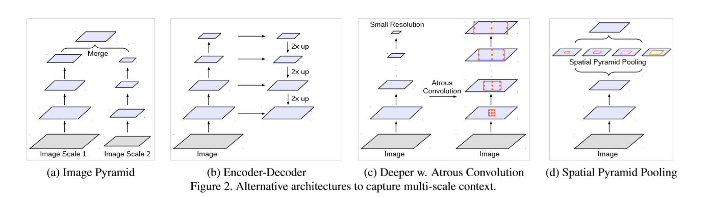

- 第一种：Image Pyramid，将输入图片放缩成不同比例，分别应用在DCNN上，将预测结果融合得到最终输出
- 第二种：Encoder-Decoder，将Encoder阶段的多尺度特征运用到Decoder阶段上来恢复空间分辨率
- 第三种：在原始模型的顶端叠加额外的模块，以捕捉像素间长距离信息。例如Dense CRF，或者叠加一些其他的卷积层
- 第四种：Spatial Pyramid Pooling空间金字塔池化，使用不同采样率和多种视野的卷积核，以捕捉多尺度对象

Deeplabv3的主要创新点就是改进了ASPP模块，一个1x1的卷积和3个3x3的空洞卷积，每个卷积核有256个且都有BN层，包含图像及特征（全局平均池化）。

- 提出了更通用的框架，适用于任何网络；
- 复制了resnet最后的block，并级联起来
- 在ASPP中使用BN层
- 没有随机向量场

在DeepLabv1和DeepLabv2发表之后，作者试图去重新构造DeepLab结构，并最终提出了一个更加强大的结构DeepLabv3。甚至去掉在DeepLabv1和DeepLabv2中使用的后处理过程(条件随机场)，DeepLabv3的表现依然超过了DeepLabv1和DeepLabv2。 

 因此，论文的名称叫做“针对图像语义分割的空洞卷积网络重构”。使用“重构”这个词，就是在致敬Inception-v3，Inception-v3的原文章名称就叫“ Rethinking the Inception Architecture for Computer Vision  ”，inception-v3是在Inception-v1和inception-v2的基础上重新构造而得的。现在，DeepLabv2被重构成DeepLabv3。它是一份2017年ARXIV的技术报告，超过200次引用。 

## 大纲

1. 空洞卷积
2. 使用多网格的深层空洞卷积
3. Atrous空间金字塔
4. 在 PASCAL VOC 2012 进行验证
5. 和PASCAL VOC 2012上最优的方法进行比较
6. 和Cityscape上最优秀的方法进行比较

--------

# 空洞卷积

不同扩张率r的空洞卷积：

 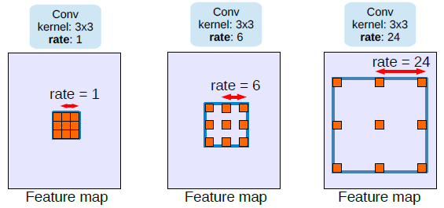 

 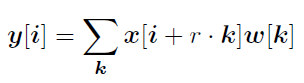 

- 对于输出y上的每个位置$i$以及滤波核，空洞卷积应用在输入特征$x$上，扩张率$r$和对输入信号的采样步长相关.
- 这相当于在输入$x$上进行上采样，在空间维度连续两个元素之间插入r-1个0
- 当r=1时这就是一个标准的卷积了
- 通过调整r，我们可以调整滤波器的视野
- 他也被称之为扩张卷积(扩张网络)或空洞算法

 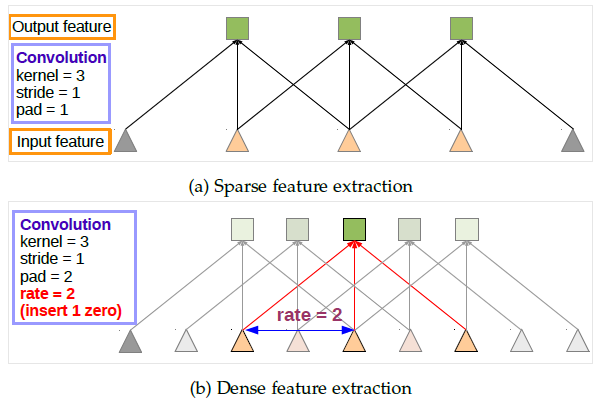 

上面：标准卷积

下面：Atrous卷积(空洞卷积)。我们可以看到不当rate=2时，信号时交替采样的。首先pad=2意味这在边界的两边会加上2个0。又因为rate=2，我们对输入的信号每2个进行抽样计算卷积。Atrous卷积允许我们去拓宽感受野，关联更多的上下文信息。因此它给我们提供了 一个高效的控制感受野的机制，能更好的在精确定位(小的感受野)和上下文语义相关性(达的感受野)之间找到平衡。

# 使用多网格(Multi Grid)的深层空洞卷积

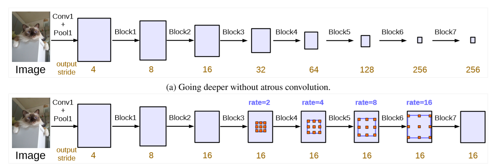

- (a)、非空洞卷积：标准卷积和池化使得输出维度的缩小倍数增加，如：当层次增加时输出特征维度变小。然而特征维度不断的缩小对语义分割是不利的，因为位置和空间信息在深层次中丢失的太多了。
- (b)、空洞卷积：使用空洞卷积，我们可以保持步幅不变，在不增加参数数量的情况下获得更大的感受野。最终，我们可以得到更大的输出特征，这个对与语义分割是非常好的。
- 举个例子，当输出的缩小倍数stride=16时，多个网格为(1,2,4)，三个卷积的空洞率为rates =2X(1,2,4)=(2,4,8)。

# Atrous空间金字塔池(ASPP)

 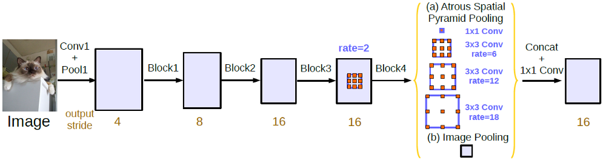 

- ASPP 已经被用在DeepLabv2了。这次，来自Inception-v2的批量归一化(BN)也会引入到ASPP中。
- 使用ASPP的原因是，发现随着扩张率增加，有效的滤波权重会变小（相同个数的权重被应用到较大的视野范围中）。
- 一个1X1的卷积和三个扩张率为(6,12,18)的3X3的卷积核，输出的缩小倍数为16。
- 都使用256个滤波器和批量归一化(BN)。
- 当输出的缩小倍数为8时，扩张率是加倍的。
- 所有分支连接起来先通过另一个1X1的卷积(256个滤波器和批量归一化)，最后使用1X1的卷积核卷积产生概率值。

## Upsampling Logits

- 在DeepLabv2中，训练过程中，真实目标被下采样了8倍。
- 在DeepLabv3中，发现，最重要的是保证真实背景的完整性，而不是对最终值的上采样。

----------------

#  **图像金字塔(Image pyramid)** 

同样的模型，通常使用共享权重，使用多尺度的输入。小尺寸的输入特征响对应长距离语义，大尺寸输入的相应修正细节。通过拉普拉斯金字塔对输入图像进行变换，将不同尺度的图片输入到DCNN，并将所有比例的特征图合并。有人将多尺度输入按顺序从粗到细依次应用，也有人直接将输入调整成不同的大小，并融合所有大小的特征。这类模型的主要缺点是由于GPU内存，较大/更深的DCNN不方便应用，因此通常在推理阶段应用。 

#  **编码器-解码器(Encoder-decoder)** 

 该模型由两部分组成：

(a)编码器中，特征映射的空间维度逐渐减小，从而更容易捕获较长范围内的信息；

(b)解码器中，目标细节和空间维度逐渐恢复。例如，有人反卷积来学习对低分辨率特征响应进行上采样。SegNet复用编码器中的池化索引，学习额外的卷积层来平滑特征响应；U-net将编码器中的特征层通过跳跃连接添加到相应的解码器激活层中；LRR使用了一个拉普拉斯金字塔重建网络。最近，RefineNet等证明了基于编码-解码结构的有效性。这类模型也在对象检测的领域得到了应用。 

# 在PASCAL VOC 2012上进行实验验证

### Output Stride

 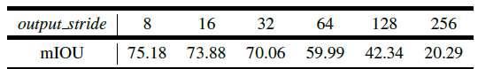 

使用带空洞卷积的ResNet-50模型，在不同的下采样倍数条件下的平均交并比(mIOU)的对比

- 当使用的ResNet-50，如上面表格所示，这种情况下输出下采样256倍时表现是最糟糕的。
- 当输出维度变大时使用空洞卷积，mIou从20.29%增加到了75.18%。这显示了，当使用更多的blocks级联时，空洞卷积是必不可少的。

### ResNet-101

 ResNet-50 vs ResNet-101 :

 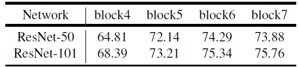 

- ResNet-101的平均交并比始终比ResNet-50高。
- 显然，7层网络之后ResNet-50下平均交并比轻微下降而ResNet-101效果仍在上升。

### Multi-Grid

受到了采用不同大小网格层次结构的多重网格方法的启发，我们提出的模型在block4和block7中采用了不同的空洞率。

特别的，我们定义*Multi_Grid* =(r1, r2, r3) 为block4到block7内三个卷积层的unit rates。卷积层的最终空洞率等于unit rate和corresponding rate的乘积。例如，当*output_stride* = 16 ，*Multi_Grid* = (1, 2, 4)，三个卷积就会在block4有 *rates* = 2 · (1, 2, 4) = (2, 4, 8) 。

 Employing multi-grid method for ResNet-101 with different number of cascaded blocks at output stride = 16. 当输出缩小倍数为16时，采用多层网格的ResNet-101在不同串联块数下的平均交并比。

 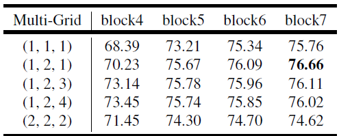 

- 一般情况下，采用多层网格方法效果要好于采用（r1,r2,r3）=(1,1,1)的单一网格方法。
- 仅加倍单位扩张率（例如（r1,r2,r3）=(2,2,2)）并不会增强分割效果。
  在多层网格下加深网络层数可以增强分割表现。
- 最佳模型的结构是采用7层网络，且（r1,r2,r3）=（1，2，1）。增加网络的深度配合multi-grid可以提升网络的性能。

### Inference Strategy

 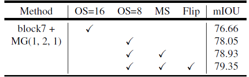 

- 在数据集上的测试方案：MG：multi grid。OS：output stride。MS：在测试过程中的多尺度输入。Flip：对输入图片添加左右翻转操作。
- 模型训练时的 output stride 是16。
- 测试时，可以得到更多特征细节的 output stride 8相较于 output stride 16，平均交并比提升了1.39%。
- 当同时使用多尺度输入如{0.5，0.75，1.0，1.25，1.5，1.75}和左右翻转输入图片操作时，效果提升到79.35%。

### ASPP

 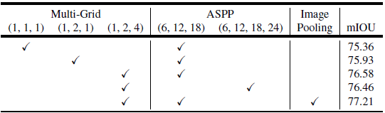 

当output stride为16时，不同空洞卷积池化操作及多层网格参数的平均交并比结果对比。

- ParseNet下的图像池化或者图像层级特征也是考虑到全局上下文信息。
- 当采用ASPP=(6,12,18)时，多层网格结构（1，2，4）效果要优于（1，1，1）和（1，2，1）。
- 采用ASPP（6，12，18）效果优于ASPP=（6，12，18，24）。
- 采用池化操作，平均交并比可以提升到77.21%。

### Crop Size, Upsampling Logits, Batch Norm, Batch Size, Train & Test Output Stride

裁切大小，上采样，批量归一化，批次大小，训练和测试的输出步长

 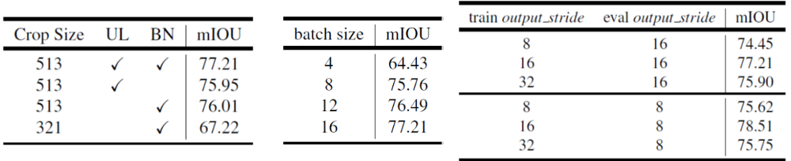 

- 使用更大的裁剪大小为513结果要好裁剪大小为321.
- 采用上采样和批量归一化，精度达到77.21%。
- 批次大小分别设置4,8,12,16，其中16结果最好。
- 训练和测试集的输出步长为（8,8）时精度为77.21%，而使用步长为（16,8）时，精度为78.51%。

### 采用所有技巧

 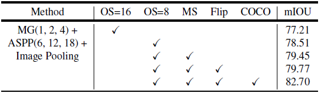 

- MG(1, 2, 4) + ASPP(6, 12, 18) + Image Pooling：精度为77.21%.
- 输出步长为8时，精度为78.51%。
- 多尺度测试，精度为79.45%。
- 水平翻转，精度为79.77%。
- 采用COCO数据集预训练，精度为82.7%。
- 经过对网络的重新构建，没有使用之前在[DeepLabv2](https://towardsdatascience.com/review-deeplabv1-deeplabv2-atrous-convolution-semantic-segmentation-b51c5fbde92d)中采用的条件随机场后处理，精度已经超过了采用COCO数据集预训练和条件随机场的精度, 其精度为77.69%。

# Comparison with State-of-the-art Approaches

## PASCAL VOC 2012 Test Set

  

 DeepLabv3：在PASCAL VOC 2012训练验证集上微调，输出步长8，在困难样本上采取bootstrapping方法。特别是包含困难类别的进行复制，到达精度85.7%。 

 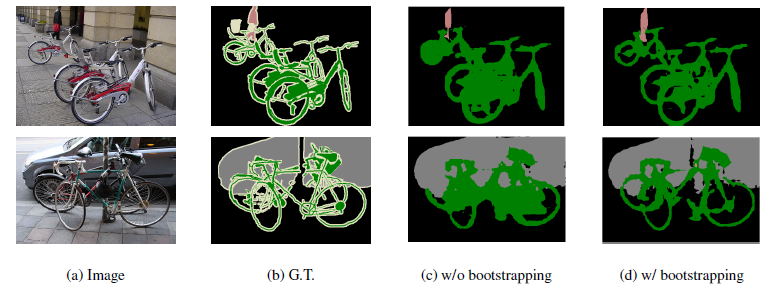 

- 上面示例图显示了bootstrapping方法在困难样本上的效果，提升了稀少样本如自行车等类别的精度和分割效果。
- DeepLabv3分割效果优于[PSPNet](https://towardsdatascience.com/review-pspnet-winner-in-ilsvrc-2016-semantic-segmentation-scene-parsing-e089e5df177d),而后者是ILSVRC 2016场景分割比赛中的冠军。
- deepLabv3-JFT采用了在ImageNet和JFT-300M数据集上训练的ResNet101权重模型，达到精度为86.9%。

 PASCAL VOC 2012量化结果（最后一行，失败的例子） 

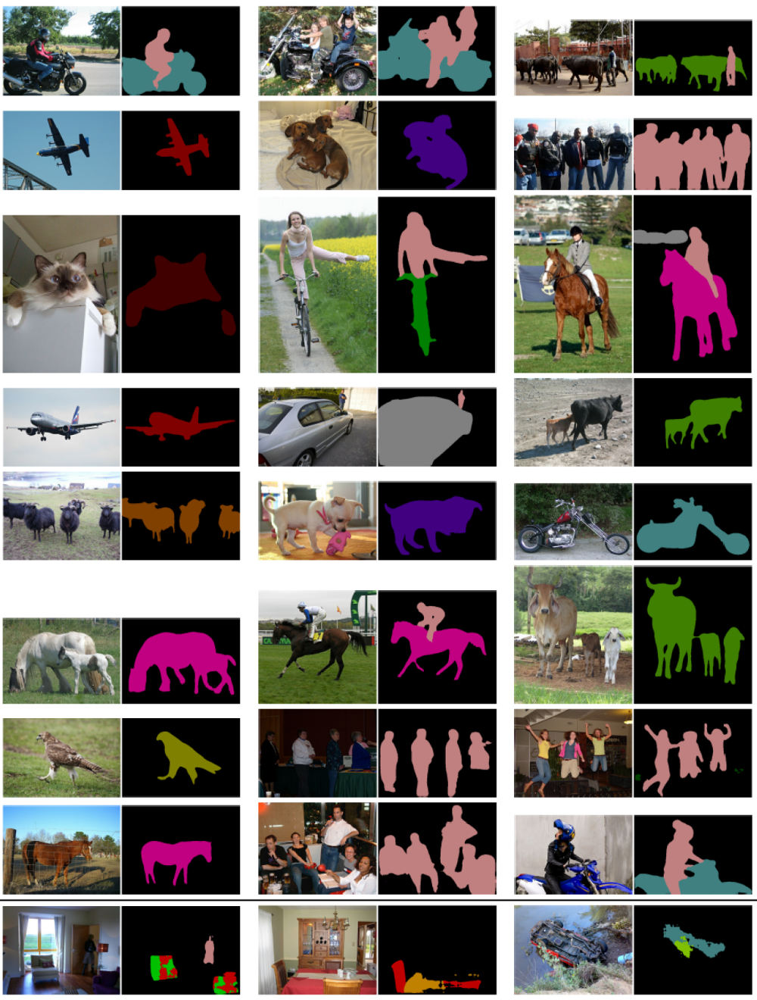

 

# 在Cityscape数据集上表现最佳的方法对比

## Different Settings

 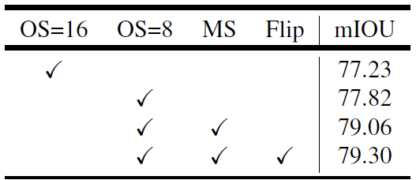 

类似于测试时采用output stride 8，多尺度输入和水平翻转操作的PASCAL VOC 2012数据集，平均交并比逐渐提升。 

## Cityscape 测试集

 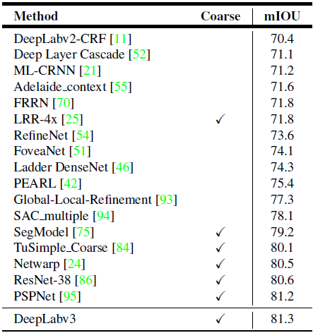 

- 测试集为了在对比中获得更佳的效果，DeepLabv3在粗糙训练集中进一步训练（例如，3475张精确标记的图片和额外的20000张粗略标记的图片）。
- 在测试过程中，要求多尺度输入和精确维度输出。其中，输入尺度范围为{0.75，1，1.25，1.5，1.75，2}，并且评估输出维度为4，这在验证集中分别贡献了0.8%和0.1%的提升。
- 最后，在测试集中达到了81.3%的平均交并比，这稍高于PSPNet。

在cityspace中的分割结果：

 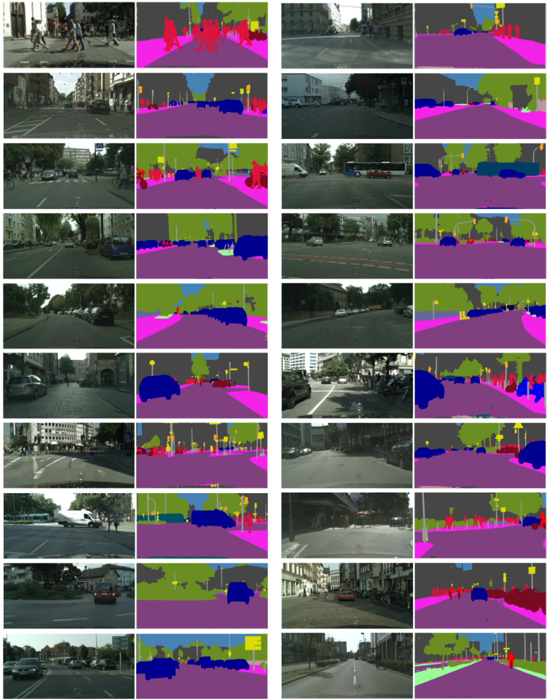 

DeepLabv3仅比PSPNet效果高一点，这可能也是为什么它在arXiv中仅作为技术报告。但是后来提出的DeepLabv3+远优于DeepLabv3。希望后续有机会可以学习DeepLabv3+。 

--------------

# 结论

提出的模型DeepLab V3采用atrous convolution的上采样滤波器提取稠密特征映射和去捕获大范围的上下文信息。具体来说，编码多尺度信息，提出了级联模块逐步翻倍的atrous rates，提出了ASPP模块增强图像级的特征，探讨了多采样率和有效视场下的滤波器特性。实验结果表明，该模型在Pascal voc 2012语义图像分割基准上比以前的DeppLab版本有了明显的改进，并取得了SOAT精度。 

# 参考

1.  https://zhuanlan.zhihu.com/p/40470298 
2.  https://towardsdatascience.com/review-deeplabv3-atrous-convolution-semantic-segmentation-6d818bfd1d74 
3.  https://www.yanxishe.com/TextTranslation/1536 
4.  https://www.yanxishe.com/columnDetail/15197 

