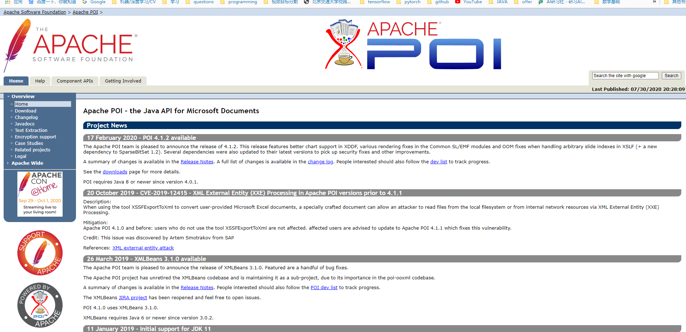
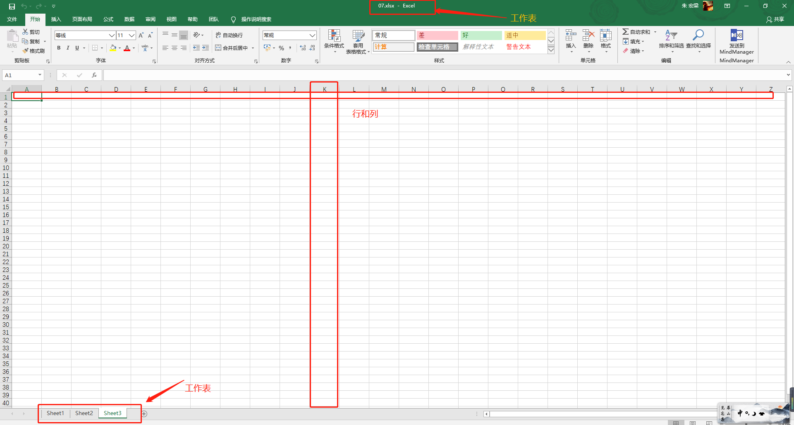
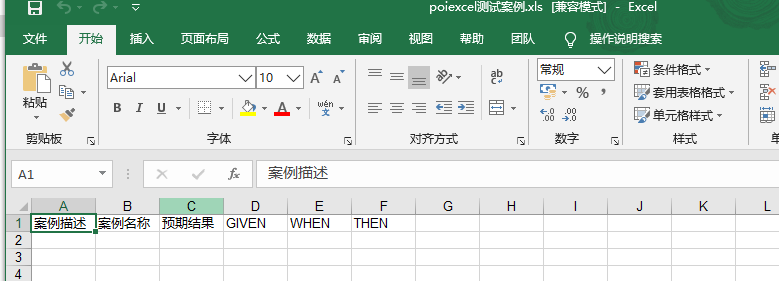
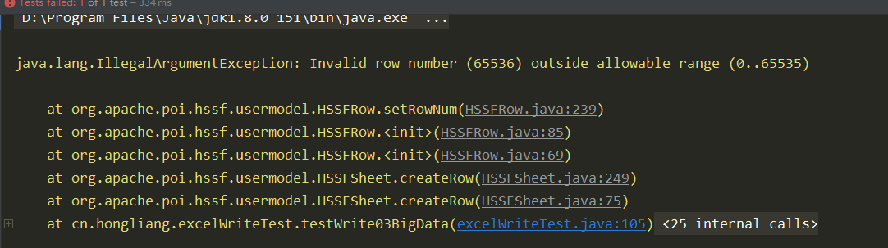
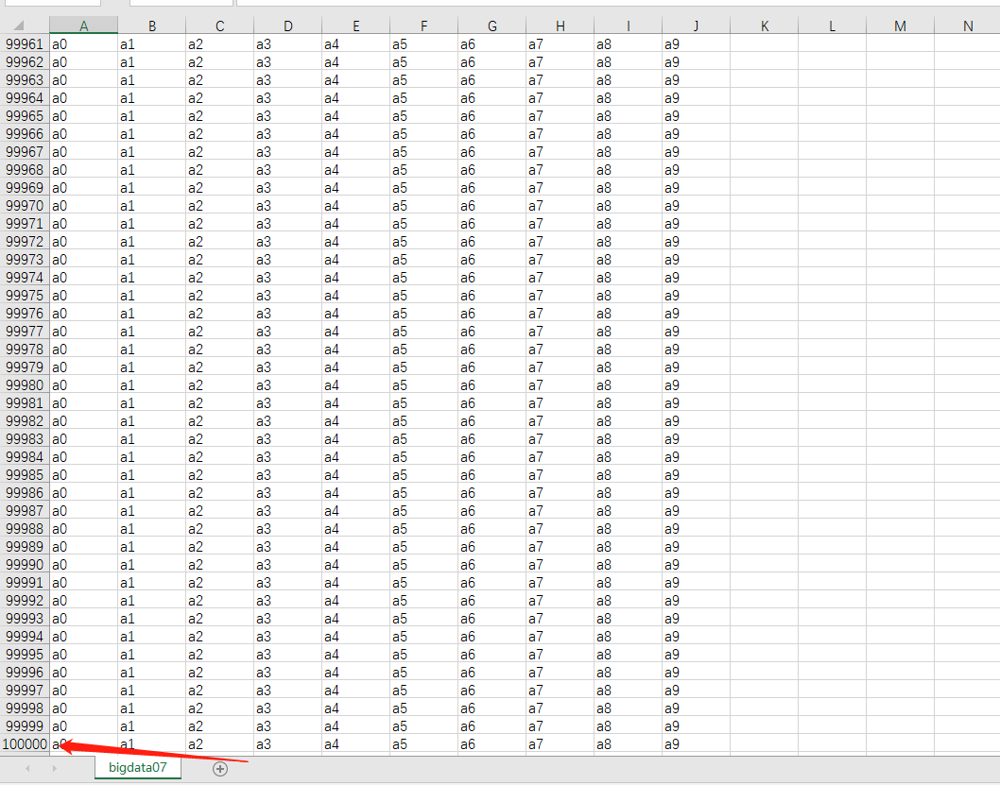
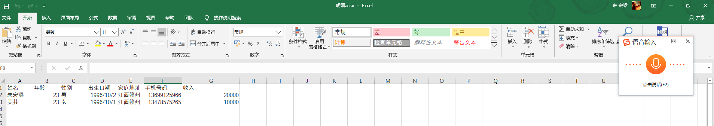
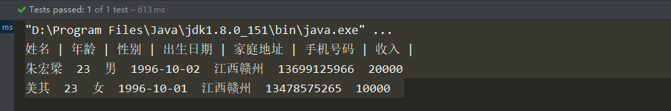
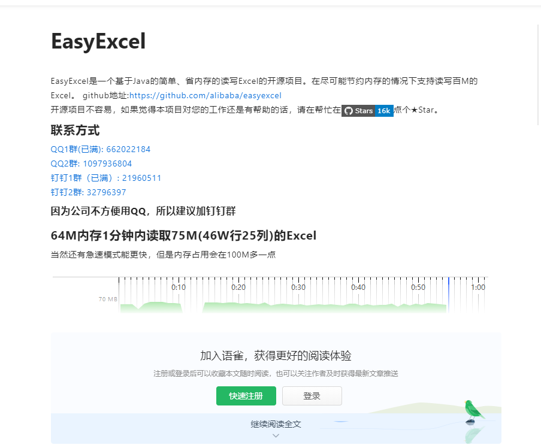
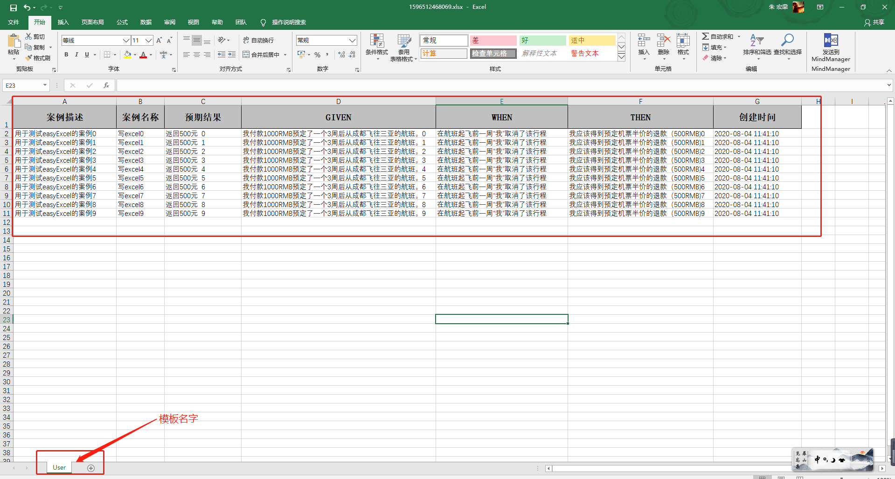
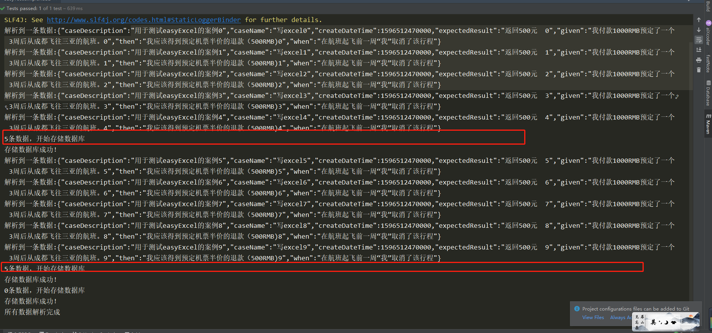

# 应用场景

​		最近的一个项目需要使用到excel导入功能。比如测试用例，根据里面的案例生成自动化测试脚本文件。那么，首先就要将excel读取程序当中。

​		目前操作excel比较流行的就是Apache POI和阿里巴巴的easyexcel。

# Apache POI

​		官网： http://poi.apache.org/ 

​		POI，全称Apache POI，使用**Java**编写的免费开源的跨平台的Java API。  是创建和维护操作各种符合 Office Open XML（OOXML）标准和微软的 OLE 2 复合文档格式（OLE2）的 Java API。用它可以使用 Java 读取和创建, 修改 MS Excel 文件。而且，还可以使用 Java 读取和创建 MS Word 和 MSPowerPoint 文件。Apache POI 提供 Java 操作 Excel 解决方案（适用于 Excel97-2008）。



## POI-Excel写

> 创建项目、导入依赖

```xml
<dependencies>
<!--        xls(03)-->
        <dependency>
            <groupId>org.apache.poi</groupId>
            <artifactId>poi</artifactId>
            <version>3.11</version>
        </dependency>

<!--        xls(07)-->
        <dependency>
            <groupId>org.apache.poi</groupId>
            <artifactId>poi-ooxml</artifactId>
            <version>3.11</version>
        </dependency>

<!--        日期自动化工具-->
        <dependency>
            <groupId>joda-time</groupId>
            <artifactId>joda-time</artifactId>
            <version>2.10.1</version>
        </dependency>

<!--        junit-->
        <dependency>
            <groupId>junit</groupId>
            <artifactId>junit</artifactId>
            <version>4.13</version>
        </dependency>
    </dependencies>
```

> 03版本与07版本的区别：03版是以xls结尾， 07版以xlsx结尾。而且03班最多支持65536行数据，而07版没有限制。

在一个excel文件里面，有工作表、工作簿、行、列。




所以我们只需要找到这几个对象就可以开始操作excel了！

> 03版

```java
String Path = "F:\\java\\excel\\poiexcel";

    @Test
    public void testWrite03() throws Exception {
        // 创建一个工作簿
        Workbook workbook = new HSSFWorkbook();
        // 创建一个工作表
        Sheet sheet = workbook.createSheet("测试案例");
        // 创建一行 第一个单元格
        Row row1 = sheet.createRow(0);
        Cell cell11 = row1.createCell(0);
        cell11.setCellValue("案例描述");

        Cell cell12 = row1.createCell(1);
        cell12.setCellValue("案例名称");

        Cell cell13 = row1.createCell(2);
        cell13.setCellValue("预期结果");

        Cell cell14 = row1.createCell(3);
        cell14.setCellValue("GIVEN");

        Cell cell15 = row1.createCell(4);
        cell15.setCellValue("WHEN");

        Cell cell16 = row1.createCell(5);
        cell16.setCellValue("THEN");
        // 生成表
        FileOutputStream fileOutputStream = new FileOutputStream(Path+"测试案例.xls");
        //输出
        workbook.write(fileOutputStream);
        fileOutputStream.close();
        System.out.println("生成成功！");


    }
```




对于07版本的，只要在上面的代码，将下面代码

```java
// 创建一个工作簿
Workbook workbook = new HSSFWorkbook();
```

改为

```java
 // 创建一个工作簿
 Workbook workbook = new XSSFWorkbook();
```

然后文件的后缀是xlsx。


## 大文件写入

> 03版： 大文件写HSSF

缺点：最多只能处理65536行数据。否则会抛出异常。

优点： 过程中写入缓存，不操作磁盘，最后一次性写入磁盘，速度比较快。

```java
@Test
    public void testWrite03BigData() throws Exception {
        // 创建工作簿
        Workbook workbook = new HSSFWorkbook();
        Sheet sheet = workbook.createSheet("bigdata03");

        long begin = System.currentTimeMillis();
        for (int i = 0; i < 65536; i++) {
            // 创建一行
            Row row = sheet.createRow(i);
            for(int j = 0; j < 10; j++){
                Cell cell = row.createCell(j);
                cell.setCellValue("a"+j);
            }

        }

        FileOutputStream fileOutputStream = new FileOutputStream(Path+"bigdata03.xls");
        workbook.write(fileOutputStream);
        fileOutputStream.close();

        long end = System.currentTimeMillis();
        System.out.println((double)(end-begin)/1000);

        System.out.println("成功！");

    }

```

> 1.577
> 成功！

将65536 改为65537， 报异常



> 07版： 大文件写XSSF

缺点：写数据时速度非常慢，非常耗内存，也会发生内存溢出。如一百万条。

优点：可以写较大的数据量。比如说20万条。

```java
@Test
    public void testWrite07BigData() throws Exception {
        // 创建工作簿
        Workbook workbook = new XSSFWorkbook();
        Sheet sheet = workbook.createSheet("bigdata07");

        long begin = System.currentTimeMillis();
        for (int i = 0; i < 65536; i++) {
            // 创建一行
            Row row = sheet.createRow(i);
            for(int j = 0; j < 10; j++){
                Cell cell = row.createCell(j);
                cell.setCellValue("a"+j);
            }

        }

        FileOutputStream fileOutputStream = new FileOutputStream(Path+"bigdata07.xlsx");
        workbook.write(fileOutputStream);
        fileOutputStream.close();

        long end = System.currentTimeMillis();
        System.out.println((double)(end-begin)/1000);

        System.out.println("成功！");

    }
```

> 12.815
> 成功！

他可以写大量的数据，没有65536 的限制，比如写100000行数据

>17.968
>成功！




可以看到XSSF的速度极慢！下面可以改进，通过SXSSF


> 大文件写SXSSF

优点： 可以写非常大的数据量，如一百万条，甚至更多条。写数据速度快，占用更少的内存。

但是在过程中会产生临时文件，需要清理临时文件。默认由100条记录被保存到内存中。如果超过这数量，则最前面的数据被写入临时文件。如果想自定义内存中数据的数量，可以使用new SXSSFWorkbook(数量)。

```java
 @Test
    public void testWrite07BigDataS() throws Exception {
        // 创建工作簿
        SXSSFWorkbook workbook = new SXSSFWorkbook();
        Sheet sheet = workbook.createSheet("bigdataSSS07");

        long begin = System.currentTimeMillis();
        for (int i = 0; i < 65536; i++) {
            // 创建一行
            Row row = sheet.createRow(i);
            for(int j = 0; j < 10; j++){
                Cell cell = row.createCell(j);
                cell.setCellValue("a"+j);
            }

        }

        FileOutputStream fileOutputStream = new FileOutputStream(Path+"bigdata07S.xlsx");
        workbook.write(fileOutputStream);
        fileOutputStream.close();
        // 清除临时文件
        workbook.dispose();

        long end = System.currentTimeMillis();
        System.out.println((double)(end-begin)/1000);

        System.out.println("成功！");

    }
```

> 1.17
> 成功！

即使写入100000条记录

> 1.719
> 成功！

​		官方解释。实现big green demo策略的流逝版本，这允许写入非常大的文件，而不会耗尽内存，因为任何时候只有可配置的行部分。被保存在内存中。请注意。仍然可能会消耗大量内存。这些内存基于您正在使用的功能，例如合并区域、注释.......仍然只存在内存中。因此，如果广泛使用，可能需要大量内存。


## POI 读取Excel

```java
public class excelReadTest {
    String Path = "F:\\java\\excel\\poiexcel";

    @Test
    public void testRead() throws Exception {

        FileInputStream in = new FileInputStream(Path+"测试案例.xls");

        // 创建工作簿
        Workbook workbook = new HSSFWorkbook(in);
        Sheet sheet = workbook.getSheetAt(0);
        // 获取行
        Row row = sheet.getRow(0);
        for(int i = 0; i < 6; i++){
            Cell cell = row.getCell(i);
            String stringCellValue = cell.getStringCellValue();
            System.out.println(stringCellValue);
        }
    }

}
```

>案例描述
>案例名称
>预期结果
>GIVEN
>WHEN
>THEN

## 读取不同的数据类型



里面包含了字符串、数字、日期等数据类型。

看几个API

| 方法                                           | 描述                                                         |
| ---------------------------------------------- | ------------------------------------------------------------ |
| Row.java  --> int getPhysicalNumberOfCells();  | 获取当前行的单元格数量                                       |
| Cell.java  --> int getCellType();              | 获取当前单元格的类型，是一个枚举类型。  CELL_TYPE_BLANK                            CELL_TYPE_NUMERIC                              CELL_TYPE_STRING                          CELL_TYPE_FORMULA                      CELL_TYPE_BOOLEAN                             CELL_TYPE_ERROR |
| Sheet.java -- > int getPhysicalNumberOfRows(); | 获取工作表中的行数                                           |

```java
 @Test
    public void testRead07() throws Exception {

        FileInputStream in = new FileInputStream(Path+"明细.xlsx");

        // 创建工作簿
        Workbook workbook = new XSSFWorkbook(in);
        Sheet sheet = workbook.getSheetAt(0);

        // // 获取标题内容
        Row rowTitle = sheet.getRow(0);
        if(rowTitle != null){
            int cells = rowTitle.getPhysicalNumberOfCells();
            for (int i = 0; i < cells; i++) {
                Cell cell = rowTitle.getCell(i);
                if(cell != null){
                    int cellType = cell.getCellType(); // 获取类型
                    String stringCellValue = cell.getStringCellValue();
                    System.out.print(stringCellValue + " | ");
                }
            }
            System.out.println();

        }

        // 获取表中的内容
        int rows = sheet.getPhysicalNumberOfRows();
        for (int i = 1; i < rows; i++) {
            Row rowData = sheet.getRow(i);
            if(rowData != null){
                //读取列
                int cells = rowData.getPhysicalNumberOfCells();
                for (int j = 0; j < cells; j++) {
                    Cell cell = rowData.getCell(j);
                    if(cell != null){
                        int cellType = cell.getCellType();
                        String cellValue = null;
                        // 匹配列的数据类型
                        switch (cellType){
                            case XSSFCell.CELL_TYPE_STRING: // 字符串
//                                System.out.println("【String】");
                                cellValue = cell.getStringCellValue();
                                break;
                            case XSSFCell.CELL_TYPE_BOOLEAN:
//                                System.out.println("【Boolean】");
                                cellValue = String.valueOf(cell.getBooleanCellValue());
                                break;

                            case XSSFCell.CELL_TYPE_NUMERIC:
//                                System.out.println("【Num】");
                                if(HSSFDateUtil.isCellDateFormatted(cell)){
                                    // 日期
                                    Date date = cell.getDateCellValue();
                                    cellValue = new DateTime(date).toString("yyyy-MM-dd");
                                }else{
                                    cell.setCellType(XSSFCell.CELL_TYPE_STRING);
                                    cellValue = cell.getStringCellValue() ;
                                }

                                break;
                            case XSSFCell.CELL_TYPE_BLANK:
//                                System.out.println("【BLANK】");
                                break;
                            case XSSFCell.CELL_TYPE_ERROR:
                                break;

                        }
                        System.out.print(cellValue+"  ");


                    }

                }
            }
            System.out.println();
        }

        in.close();


    }
```




PIO 这个框架比较原生，用起来比较麻烦，而且在文件很大的时候可能会出现OOM异常，因为它导入是将整个文档全部导入到内存中。

所以， easye小说xcel就出现了，它解决了POI的问题，而且使用起来也非常方便。

# easyExcel

官网：  https://www.yuque.com/easyexcel/doc/easyexcel 

github：  https://github.com/alibaba/easyexcel 

easyexcel是阿里巴巴开源的一个Excel处理框架。以**使用简单，节省内存著称**。

Easy Excel能大大减少占用内存的主要原因是在解析Excel时，没有将文件数据一次性全部加载到内存中。而是在磁盘上一行行读取逐个解析。



 easyexcel 是一个 JAVA 解析 Excel 工具。Java 解析、生成 Excel 比较有名的框架有 Apache poi、jxl 。**但他们都存在一个严重的问题就是非常的耗内存**，poi 有一套 SAX 模式的 API 可以一定程度的解决一些内存溢出的问题，但 POI 还是有一些缺陷，比如 07 版 Excel 解压缩以及解压后存储都是在内存中完成的，内存消耗依然很大。easyexcel 重写了 poi 对 07 版 Excel 的解析，能够原本一个 3M 的 excel 用 POI sax 依然需要 100M 左右内存降低到 KB 级别，并且再大的 excel 不会出现内存溢出，03 版依赖 POI 的 sax 模式。在上层做了模型转换的封装，让使用者更加简单方便。 


##  导入依赖

```xml

        <dependency>
            <groupId>com.alibaba</groupId>
            <artifactId>easyexcel</artifactId>
            <version>2.2.6</version>
        </dependency>

```


## 实体类

```java
package cn.hongliang;

import com.alibaba.excel.annotation.ExcelIgnore;
import com.alibaba.excel.annotation.ExcelProperty;
import lombok.Data;

import java.util.Date;

/**
 * @author Hongliang Zhu
 * @create 2020-08-04 11:11
 */
@Data
public class EquivalenceImportEntity {


    @ExcelProperty("案例描述")
    private String caseDescription;

    @ExcelProperty("案例名称")
    private String caseName;

    @ExcelProperty("预期结果")
    private String expectedResult;

    @ExcelProperty("GIVEN")
    private String given;
    @ExcelProperty("WHEN")
    private String when;
    @ExcelProperty("THEN")
    private String then;

    /**
     * 忽略字段
     */
    /**
     * 文件包名
     */
    @ExcelIgnore
    private String packageDir;

    /**
     * 文件名
     */
    @ExcelIgnore
    private String classFileName;
    /**
     * 创建时间
     */
   // @ExcelIgnore
     @ExcelProperty("创建时间")
    private Date createDateTime;


}

```


##  写Excel

### 通用数据生成

```java
private List<EquivalenceImportEntity> data() {
        List<EquivalenceImportEntity> list = new ArrayList<EquivalenceImportEntity>();
        for (int i = 0; i < 10; i++) {
            EquivalenceImportEntity data = new EquivalenceImportEntity();
            data.setCaseDescription("用于测试easyExcel的案例" + i);
            data.setCaseName("写excel" + i);
            data.setGiven("我付款1000RMB预定了一个3周后从成都飞往三亚的航班。" + i);
            data.setWhen("在航班起飞前一周“我”取消了该行程");
            data.setThen("我应该得到预定机票半价的退款（500RMB)"  + i);
            data.setExpectedResult("返回500元  "  + i);
            data.setCreateDateTime(new Date());
            list.add(data);
        }
        return list;
    }
```

### 写入

```java
 /**
     * 最简单的写
     * <p>1. 创建excel对应的实体对象 参照{@link EquivalenceImportEntity}
     * <p>2. 直接写即可
     */
    @Test
    public void simpleWrite() {
        // 写法1
        String fileName = Path + System.currentTimeMillis() + ".xlsx";
        // 这里 需要指定写用哪个class去写，然后写到第一个sheet，名字为模板 然后文件流会自动关闭
   
        EasyExcel.write(fileName, EquivalenceImportEntity.class).sheet("User").doWrite(data());

    }

```




也可以排除指定的列去写入，将排除的列存入一个set中，然后write的时候传入set就行了。具体可参照官网 https://www.yuque.com/easyexcel/doc/write 


## 读取Excel

还是上面那个对象


### 监听器

```java
package cn.hongliang;

import com.alibaba.excel.context.AnalysisContext;
import com.alibaba.excel.event.AnalysisEventListener;
import com.alibaba.fastjson.JSON;
import org.slf4j.Logger;
import org.slf4j.LoggerFactory;

import java.util.ArrayList;
import java.util.List;

/**
 * @author Hongliang Zhu
 * @create 2020-08-04 11:48
 *
 * // 有个很重要的点 CaseDataListener 不能被spring管理，要每次读取excel都要new,然后里面用到spring可以构造方法传进去
 */

public class CaseDataListener extends AnalysisEventListener<EquivalenceImportEntity> {


    private static final Logger LOGGER =  LoggerFactory.getLogger(CaseDataListener.class);
    /**
     * 每隔5条存储数据库，实际使用中可以3000条，然后清理list ，方便内存回收
     */
    private static final int BATCH_COUNT = 5;
    List<EquivalenceImportEntity> list = new ArrayList<EquivalenceImportEntity>();
    public CaseDataListener() {

    }

    /**
     * 这个每一条数据解析都会来调用
     *
     * @param data one row value. Is is same as {@link AnalysisContext#readRowHolder()}
     * @param context 分析上下文
     */
    @Override
    public void invoke(EquivalenceImportEntity data, AnalysisContext context) {
        LOGGER.info("解析到一条数据:{}", JSON.toJSONString(data));
        list.add(data);
        // 达到BATCH_COUNT了，需要去存储一次数据库，防止数据几万条数据在内存，容易OOM
        if (list.size() >= BATCH_COUNT) {
            saveData();  // 持久化
            // 存储完成清理 list
            list.clear();
        }
    }

    /**
     * 所有数据解析完成了 都会来调用
     *
     * @param context
     */
    @Override
    public void doAfterAllAnalysed(AnalysisContext context) {
        // 这里也要保存数据，确保最后遗留的数据也存储到数据库
        saveData();
        LOGGER.info("所有数据解析完成！");
    }
    /**
     * 加上存储数据库
     */
    private void saveData() {
        LOGGER.info("{}条数据，开始存储数据库！", list.size());
//        demoDAO.save(list);
        LOGGER.info("存储数据库成功！");
    }


}

```

### 读取

```java
 /**
     * 最简单的读
     * <p>1. 创建excel对应的实体对象 参照{@link EquivalenceImportEntity}
     * <p>2. 由于默认一行行的读取excel，所以需要创建excel一行一行的回调监听器，参照{@link CaseDataListener}
     * <p>3. 直接读即可
     */
    @Test
    public void simpleRead() {
        // 有个很重要的点 DemoDataListener 不能被spring管理，要每次读取excel都要new,然后里面用到spring可以构造方法传进去
        // 写法1：
        String fileName = Path+ "1596512468069.xlsx";
        // 这里 需要指定读用哪个class去读，然后读取第一个sheet 文件流会自动关闭
        EasyExcel.read(fileName, EquivalenceImportEntity.class, new CaseDataListener()).sheet().doRead();

    }
```




这样就把Excel文件的内容读取到了！！！


