## 非对称加密

图片来源于： https://www.bilibili.com/video/BV1KY411x7Jp/?spm_id_from=333.788&vd_source=4542f58f83b32442d5604ba46f2aa229

图解：

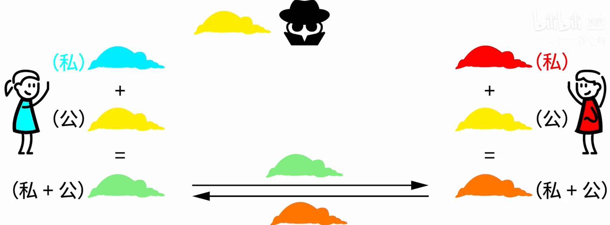

交换后：同样会被中间人知道交换了什么颜色

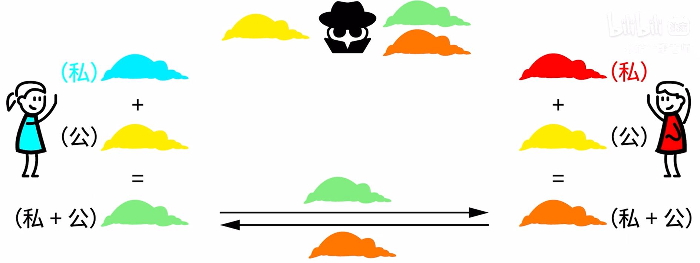

蓝色的私钥+对方的（私+公）= 咖啡色

红色的私钥+ 蓝色的（私+公） = 咖啡色

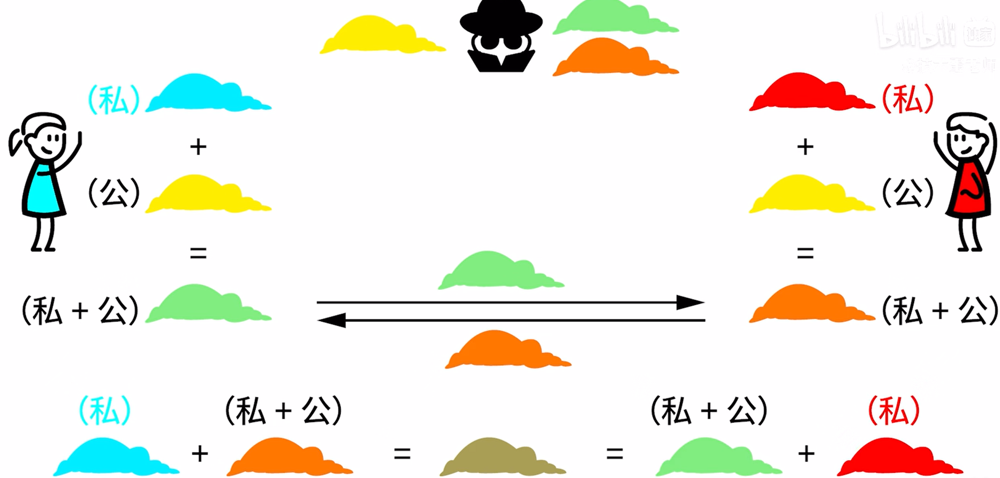

这个“咖啡色”就是他们之间的密钥了，重点是，这个“咖啡色”只能由他们自己私有的颜色才可以调制而成，其他人是无法得知的，包括这个中间人。

这便是非对称加密的核心所在，使用两个密钥来进行加密和解密。

公开密钥是所有人都拥有的，而私有密钥只有持有方才有的秘钥。

一般来说，私钥是放在服务器中，数据经过公钥加密就只能使用私钥解密，数据使用私钥加密就只能使用公钥解密。

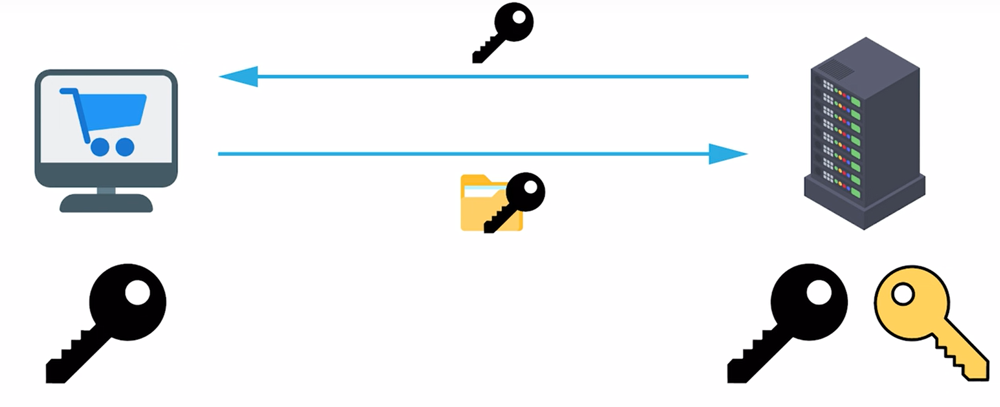

服务端具有成对的秘钥，把自己的公钥公开出去，客户端使用公钥加密，就只能使用服务端的私有进行解密。

## 证书

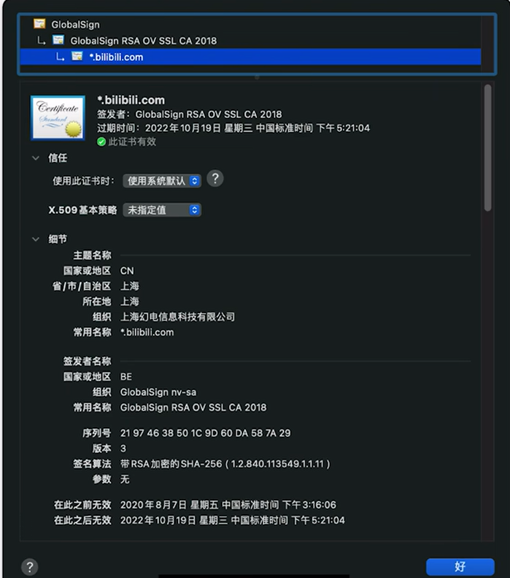

证书里面包含的内容：域名、所属公司、时间日期、特定的公钥和私钥等

服务器安装了SSL证书后，客户端才可以使用https来访问服务器了，并将默认的80端口改为443端口。

## TLS握手过程

1. 客户端访问服务端

   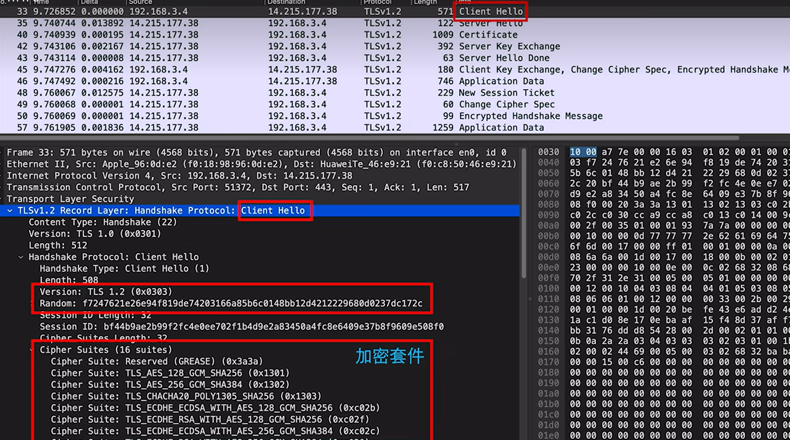

2. 服务端响应客户端

   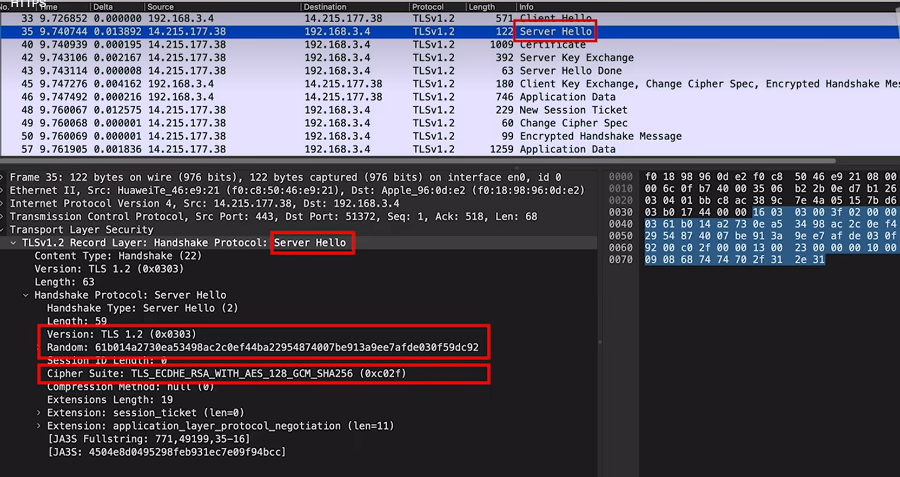

3. 服务器接着向客户端发送自己的证书，客户端可以根据自己的证书新人列表来确认这个服务器是否是可信的。

   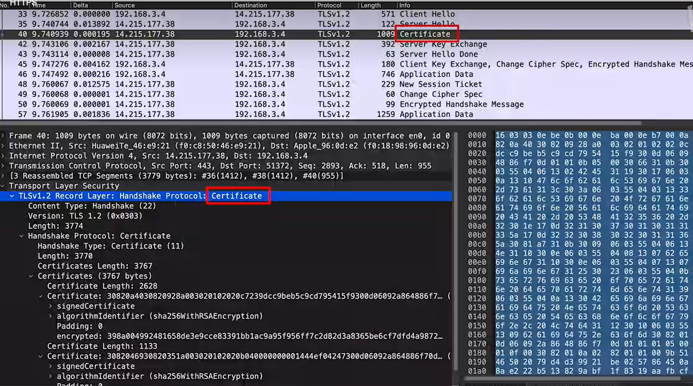

4. 服务器把自己的公钥发送给了客户端，这里不会傻傻地把自己的私钥发送出去

   如果是双向SSL通信的话，

   

   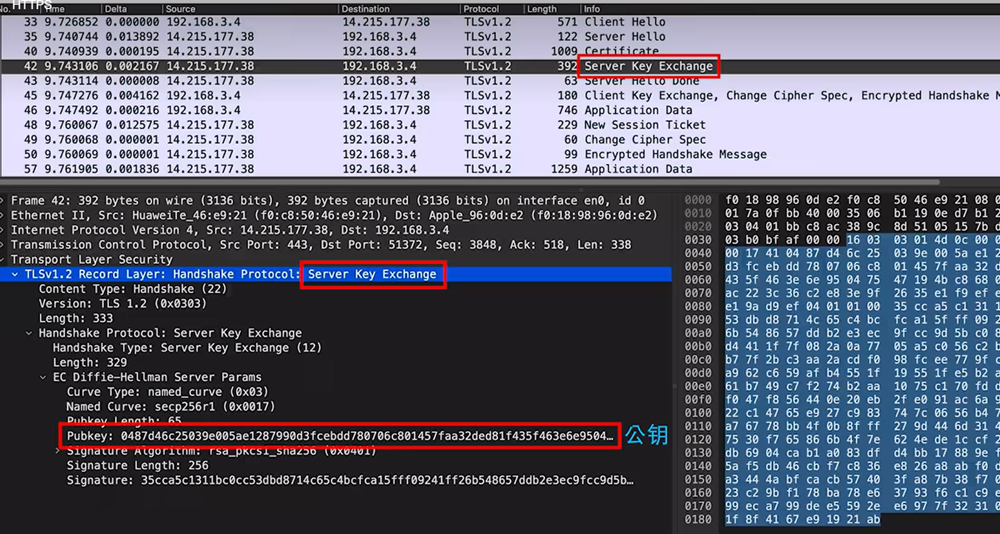

5. 告诉客户端自己发送完毕，Server Hello Done

   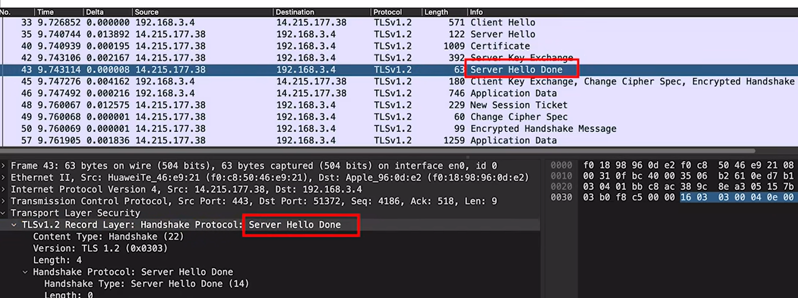

   以上步骤的通讯还没有加密，接下来客户端将进行响应了。

   

   6. Client Key Exchange，客户端生成第三个随机数，称之为“预主密钥”。

   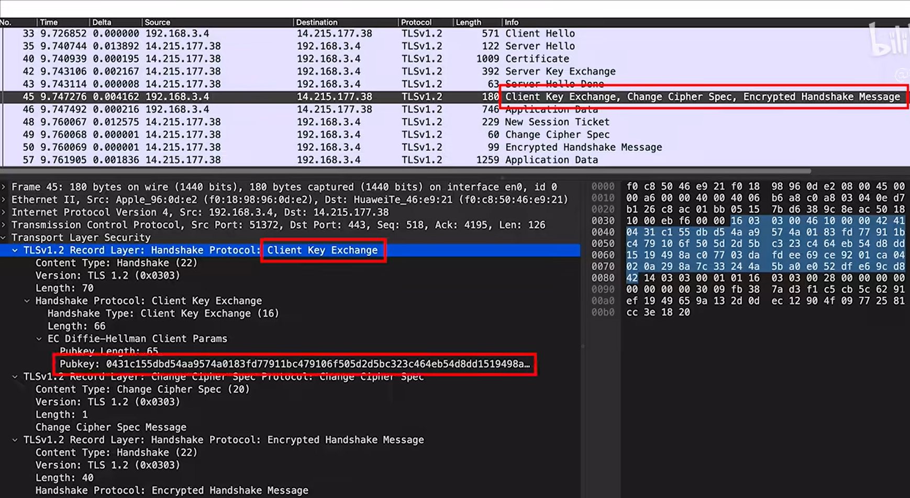

   第三个随机数会使用刚刚收到的**公钥进行加密**，并发送给服务器。

   

   告诉服务器往后的数据就用商议好的算法和密钥来加密了

   

   

   

   8 服务器这边的TLS握手已经成功

   

   

   

   

   握手总结：

   

   

   前面握手的部分使用的是非对称加密，后面得到会话密钥后就使用对称加密来通信了。

   

   ## 致谢

   1. https://www.bilibili.com/video/BV1KY411x7Jp/?spm_id_from=333.788&vd_source=4542f58f83b32442d5604ba46f2aa229

   
   
   
   
   