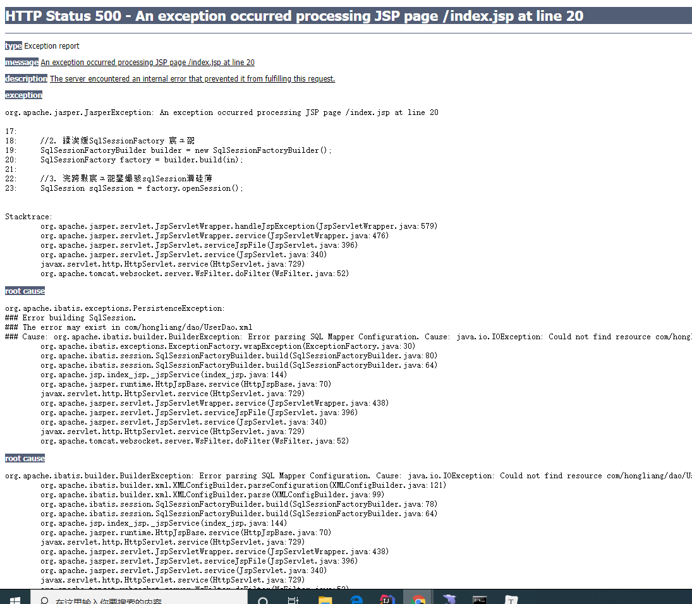
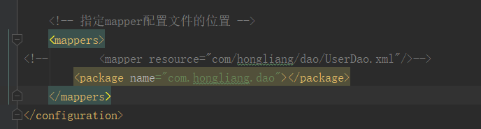
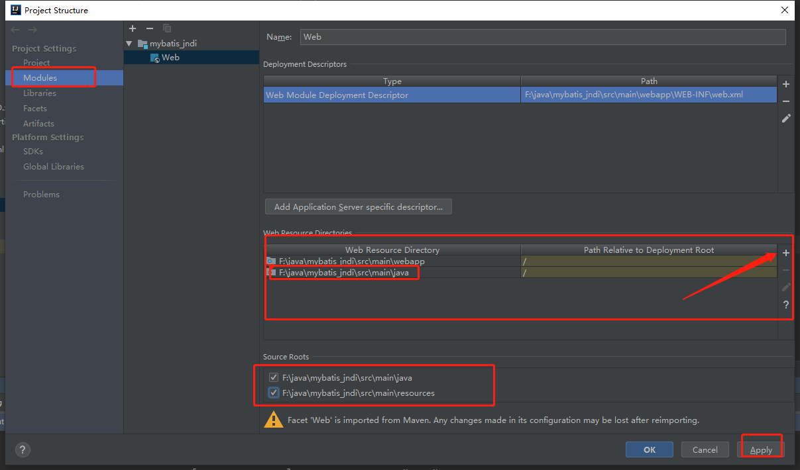

# 异常

在idea中创建的Maven的webapp工程，使用jndi连接数据库发生了如下错误：

# 解决方法

## 方法一

网上有人说： IDEA的锅：**IDEA的Maven是不会编译src的java目录的xml文件，所以在Mybatis的配置文件中找不到xml文件！** 

1. 把pom文件拿出来；
2. 把下面这段代码复制到前面去
    <build>
       <resources>
           <resource>
               <directory>src/main/java</directory>
               <includes>
                   <include>**/*.xml</include>
               </includes>
           </resource>
       </resources>
   </build>

## 方法二

 **mapper resource** 这种方式加载不到资源，其他的url class和package都可以，如果想解决问题的话，可以不使用resource这种方式！ 

我使用的package方式可以。

## 方法三

*推荐方法二*！！！！！！

# 参考

1.  https://blog.csdn.net/u010648555/article/details/70880425?depth_1-utm_source=distribute.pc_relevant.none-task 

2.  https://blog.csdn.net/qq_23184291/article/details/78089115 

   