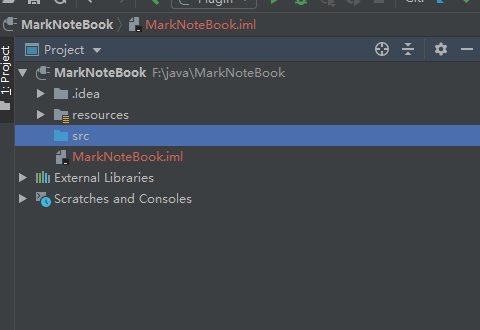
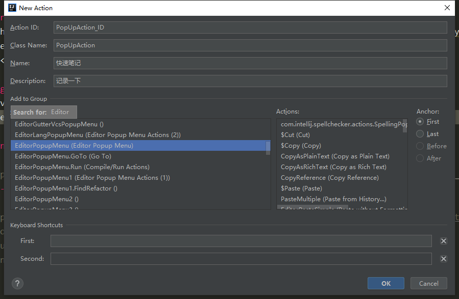
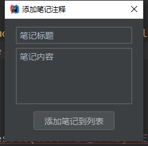
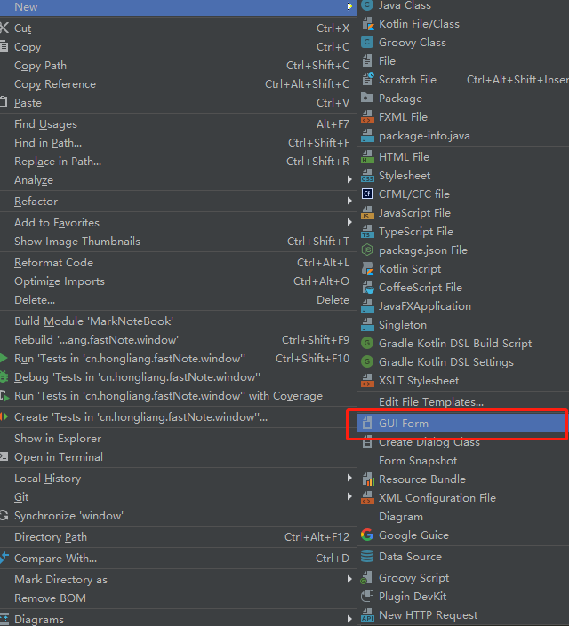
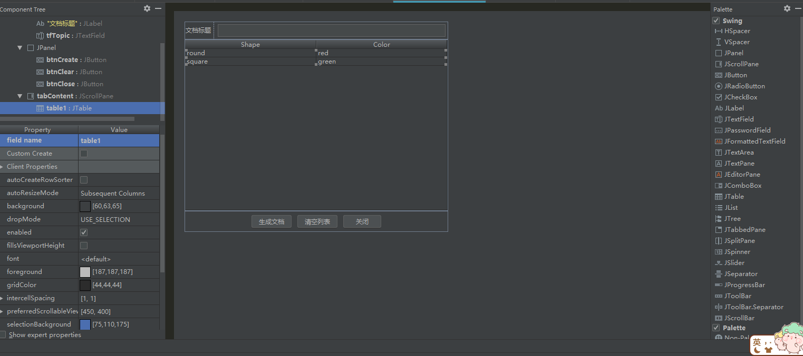
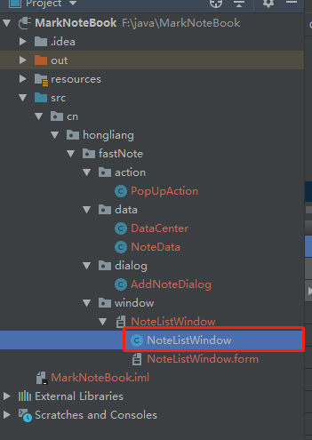
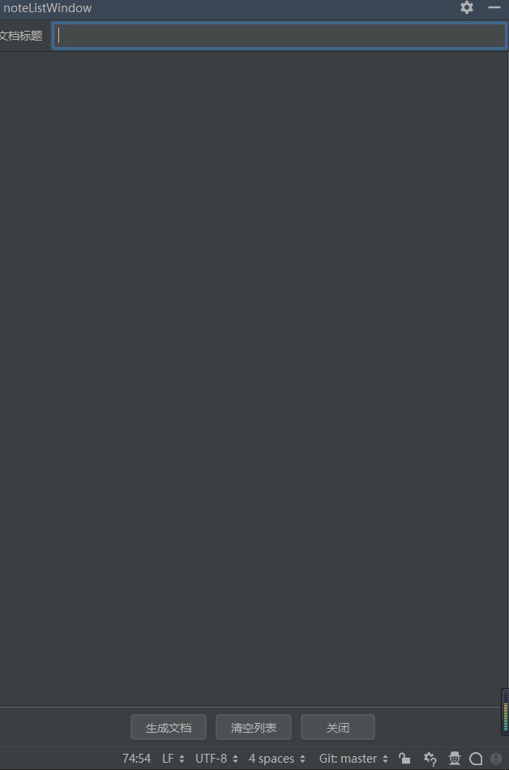
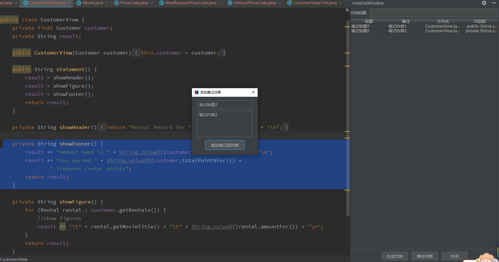
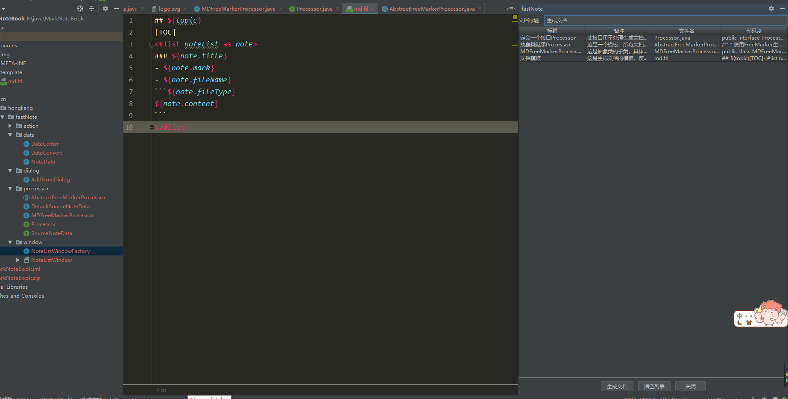

# 开发笔记插件需求分析

在阅读源码的时候，我们是不是看完后面的就忘记了前面的了。。。所以决定开发一个插件，用于记录我们阅读源码或者开发的过程，最后可以生成一个md格式的笔记，方便我们后面复习查阅。

功能：点击右键之后在菜单中有插件的工具，选中代码片段之后可以生成对应的笔记，而且具有导出md的功能。

1. 如何添加一个右键点击之后的子菜单
2. 如何获取编辑器中已经选择的文本
3. 如何弹出对话框，获取用户编辑的笔记内容
4. 如何使用ToolWindow展示笔记列表
5. 如何在ToolWindow中添加表格
6. 如何让用户选择文档生成的目录
7. 如何将笔记列表静态化生成文档

# 代码编写

## 创建工程

首先创建一个工程，完成plugin.xml




```xml
<idea-plugin>
  <id>cn.hongliang.fastNote.id</id>
  <name>FastNote</name>
  <version>1.0</version>
  <vendor email="zhl396740445@163.com" url="https://hongliangzhu.cn">Castile</vendor>

  <description><![CDATA[
      This is a notebook for development when you start a project or read source code to record ypur steps, and can generate a md document.<br>
      <em>MarkDown Doc</em>
    ]]></description>

  <change-notes><![CDATA[
       version 1.0: Add a note and main function .<br>
      <em>Only support md doc</em>
    ]]>
  </change-notes>

  <!-- please see http://www.jetbrains.org/intellij/sdk/docs/basics/getting_started/build_number_ranges.html for description -->
  <idea-version since-build="173.0"/>

  <!-- please see http://www.jetbrains.org/intellij/sdk/docs/basics/getting_started/plugin_compatibility.html
       on how to target different products -->
  <!-- uncomment to enable plugin in all products
  <depends>com.intellij.modules.lang</depends>
  -->

  <extensions defaultExtensionNs="com.intellij">
    <!-- Add your extensions here -->
  </extensions>

  <actions>
    <!-- Add your actions here -->
  </actions>

</idea-plugin>
```

## 创建一个Action

创建一个Action，用于右键弹出一个子菜单



```java
package cn.hongliang.fastNote.action;

import cn.hongliang.fastNote.data.DataCenter;
import cn.hongliang.fastNote.dialog.AddNoteDialog;
import com.intellij.openapi.actionSystem.AnAction;
import com.intellij.openapi.actionSystem.AnActionEvent;
import com.intellij.openapi.actionSystem.CommonDataKeys;
import com.intellij.openapi.editor.Editor;
import com.intellij.openapi.editor.SelectionModel;

/**
 * @author Hongliang Zhu
 * @create 2020-07-22 18:39
 */
public class PopUpAction extends AnAction {

    @Override
    public void actionPerformed(AnActionEvent e) {
        // 首先获取编辑器对象
        Editor editor = e.getRequiredData(CommonDataKeys.EDITOR);
        // 获取选择的文本
        SelectionModel selectionModel = editor.getSelectionModel();
        String selectedText = selectionModel.getSelectedText();
        DataCenter.SELECTED_TEXT = selectedText;

        // 獲取文件的名稱
        String fileName = e.getRequiredData(CommonDataKeys.PSI_FILE).getVirtualFile().getName();
        DataCenter.FILE_NAME = fileName;

        AddNoteDialog addNoteDialog = new AddNoteDialog();
        addNoteDialog.show();

//        System.out.println(selectedText);

    }
}

```

## 创建添加笔记的对话框

创建一个对话框，添加笔记的对话框

```java
package cn.hongliang.fastNote.dialog;

import cn.hongliang.fastNote.data.DataCenter;
import cn.hongliang.fastNote.data.NoteData;
import com.intellij.openapi.ui.DialogWrapper;
import com.intellij.ui.EditorTextField;
import org.jetbrains.annotations.Nullable;

import javax.swing.*;
import java.awt.*;

/**
 * @author Hongliang Zhu
 * @create 2020-07-22 18:51
 */
public class AddNoteDialog extends DialogWrapper {

    private EditorTextField noteTitle;
    private EditorTextField noteContent;

    public AddNoteDialog() {
        super(true);
        setTitle("添加笔记注释");
        init();
    }

    @Nullable
    @Override
    protected JComponent createCenterPanel() {
        JPanel panel = new JPanel(new BorderLayout());
        noteTitle = new EditorTextField("笔记标题");
        noteContent = new EditorTextField("笔记内容");
        // 设置文本框的大小
        noteContent.setPreferredSize(new Dimension(200, 100));
        panel.add(noteTitle, BorderLayout.NORTH);
        panel.add(noteContent, BorderLayout.CENTER);
        return panel;
    }

    @Override
    protected JComponent createSouthPanel() {
        JPanel panel = new JPanel();
        JButton button = new JButton("添加笔记到列表");
        // 按钮事件
        button.addActionListener(e -> {
            String noteTitleText = noteTitle.getText();
            String noteContentText = noteContent.getText();
            String fileType = DataCenter.FILE_NAME.substring(DataCenter.FILE_NAME.lastIndexOf(".") + 1);
            NoteData noteData = new NoteData(noteTitleText, noteContentText, DataCenter.SELECTED_TEXT, DataCenter.FILE_NAME, fileType);
            DataCenter.NOTE_LIST.add(noteData);
            System.out.println(DataCenter.NOTE_LIST);
        });
        panel.add(button);
        return panel;

    }
}

```

## NoteData类存储一条笔记的内容

上面用到了一个`NoteData`类，里面封装了一个笔记所包含的内容，包括标题、选中的代码，内容，文件名以及文件格式。

```java
package cn.hongliang.fastNote.data;

/**
 * @author Hongliang Zhu
 * @create 2020-07-22 19:47
 */
public class NoteData {

    private String title;
    private String mark;
    private String content;
    private String fileName;
    private String fileType;

    public NoteData(String title, String mark, String content, String fileName, String fileType) {
        this.title = title;
        this.mark = mark;
        this.content = content;
        this.fileName = fileName;
        this.fileType = fileType;
    }

    public String getTitle() {
        return title;
    }

    public void setTitle(String title) {
        this.title = title;
    }

    public String getMark() {
        return mark;
    }

    public void setMark(String mark) {
        this.mark = mark;
    }

    public String getContent() {
        return content;
    }

    public void setContent(String content) {
        this.content = content;
    }

    public String getFileName() {
        return fileName;
    }

    public void setFileName(String fileName) {
        this.fileName = fileName;
    }

    public String getFileType() {
        return fileType;
    }

    public void setFileType(String fileType) {
        this.fileType = fileType;
    }

    @Override
    public String toString() {
        return "NoteData{" +
                "title='" + title + '\'' +
                ", mark='" + mark + '\'' +
                ", content='" + content + '\'' +
                ", fileName='" + fileName + '\'' +
                ", fileType='" + fileType + '\'' +
                '}';
    }
}

```

还有一个数据中心DataCenter。用于存取笔记。

```java
package cn.hongliang.fastNote.data;
import java.util.LinkedList;
import java.util.List;

/**
 * @author Hongliang Zhu
 * @create 2020-07-22 20:13
 */
public class DataCenter {

    public static String SELECTED_TEXT; // 选中的代码块
    public static String FILE_NAME; // 文件名
    public static List<NoteData> NOTE_LIST = new LinkedList<>(); // 笔记内容
}
```

一切准备就绪，运行一下。



## 工具窗口

创建一个GUI Form



然后添加一些组件，拖动布局。用于我们展示笔记列表。



更改上述控件的filedName后，在目录下会生成一个java文件。这些空间就对象。



```java
package cn.hongliang.fastNote.window;

import javax.swing.*;
import java.awt.event.ActionEvent;
import java.awt.event.ActionListener;

/**
 * @author Hongliang Zhu
 * @create 2020-07-22 22:52
 */
public class NoteListWindow {
    /**
     * main panel
     */
    private JPanel contentPanel;
    /**
     * 文档标题
     */
    private JTextField tfTopic;

    /**
     * 三个按钮
     */
    private JButton btnCreate;
    private JButton btnClear;
    private JButton btnClose;
    /**
     * 笔记列表
     */
    private JScrollPane tabContent;


    public NoteListWindow() {
        btnCreate.addActionListener(new ActionListener() {
            @Override
            public void actionPerformed(ActionEvent e) {

            }
        });

        btnClear.addActionListener(new ActionListener() {
            @Override
            public void actionPerformed(ActionEvent e) {

            }
        });

        btnClose.addActionListener(new ActionListener() {
            @Override
            public void actionPerformed(ActionEvent e) {

            }
        });
    }

    public JPanel getContentPanel() {
        return contentPanel;
    }
}

```

先把这个工具视窗显示出来，创建一个`NoteListWindowFactory`实现`ToolWindowFactory`接口

```java
package cn.hongliang.fastNote.window;

import b.e.P;
import com.intellij.openapi.project.Project;
import com.intellij.openapi.wm.ToolWindow;
import com.intellij.openapi.wm.ToolWindowFactory;
import com.intellij.ui.content.Content;
import com.intellij.ui.content.ContentFactory;
import org.jetbrains.annotations.NotNull;

/**
 *
 *工厂类  工具视窗
 * @author Hongliang Zhu
 * @create 2020-07-22 23:09
 */
public class NoteListWindowFactory implements ToolWindowFactory {
    @Override
    public void createToolWindowContent(@NotNull Project project, @NotNull ToolWindow toolWindow) {
        // 创建NoteListWindow对象
        NoteListWindow noteListWindow = new NoteListWindow(project, toolWindow);
        // 获取内容工厂的实例
        ContentFactory contentFactory = ContentFactory.SERVICE.getInstance();
        // 获取用于ToolWindow显示的内容
        Content content = contentFactory.createContent(noteListWindow.getContentPanel(), "", false);
        //给toolWindow设置内容
        toolWindow.getContentManager().addContent(content);
    }
}

```

然后需要在plugin.xml中的扩展extension加上我们创建的toolWindow。

```xml
  <extensions defaultExtensionNs="com.intellij">
    <!-- Add your extensions here -->
    <toolWindow id="noteListWindow" factoryClass="cn.hongliang.fastNote.window.NoteListWindowFactory" anchor="right"></toolWindow>
  </extensions>
```



可以看到显示成功，但是缺少表格内容啊，下面完善这部分的功能

设置表头：在`DataCenter`里面添加

```java
public class DataCenter {

    public static String SELECTED_TEXT;
    public static String FILE_NAME;
    public static List<NoteData> NOTE_LIST = new LinkedList<>();

    public static String[] TABLE_HEADER = {"标题", "备注", "文件名", "代码段"};

    public static DefaultTableModel TABLEMODEL = new DefaultTableModel(null, TABLE_HEADER);
    
}
```

在初始化的工具视窗的时候将表格插入

```java
package cn.hongliang.fastNote.window;

import cn.hongliang.fastNote.data.DataCenter;
import com.intellij.openapi.project.Project;
import com.intellij.openapi.wm.ToolWindow;
import org.jetbrains.annotations.NotNull;

import javax.swing.*;
import java.awt.event.ActionEvent;
import java.awt.event.ActionListener;

/**
 * @author Hongliang Zhu
 * @create 2020-07-22 22:52
 */
public class NoteListWindow {
    /**
     * main panel
     */
    private JPanel contentPanel;
    /**
     * 文档标题
     */
    private JTextField tfTopic;

    /**
     * 三个按钮
     */
    private JButton btnCreate;
    private JButton btnClear;
    private JButton btnClose;
    private JTable tabContent;

    //*******************设置表头*************************
    private void init(){
        tabContent.setModel(DataCenter.TABLEMODEL);
        tabContent.setEnabled(true);
    }
    // ******************************************


    public NoteListWindow(Project project, ToolWindow toolWindow) {
        init(); //  初始化表格

        btnCreate.addActionListener(new ActionListener() {
            @Override
            public void actionPerformed(ActionEvent e) {

            }
        });

        btnClear.addActionListener(new ActionListener() {
            @Override
            public void actionPerformed(ActionEvent e) {

            }
        });

        btnClose.addActionListener(new ActionListener() {
            @Override
            public void actionPerformed(ActionEvent e) {
                toolWindow.hide(null);
            }
        });
    }

    public JPanel getContentPanel() {
        return contentPanel;
    }


}

```

然后解决创建笔记部分，添加到表格中, 在`AddNoteDialog.java`类中。

```java
 @Override
    protected JComponent createSouthPanel() {
        JPanel panel = new JPanel();
        JButton button = new JButton("添加笔记到列表");
        button.addActionListener(e -> {
            String noteTitleText = noteTitle.getText();
            String noteContentText = noteContent.getText();
            String fileType = DataCenter.FILE_NAME.substring(DataCenter.FILE_NAME.lastIndexOf(".") + 1);
            NoteData noteData = new NoteData(noteTitleText, noteContentText, DataCenter.SELECTED_TEXT, DataCenter.FILE_NAME, fileType);
            DataCenter.NOTE_LIST.add(noteData);
            DataCenter.TABLEMODEL.addRow(DataConvert.convert(noteData));
        });
        panel.add(button);
        return panel;

    }
```



## 生成文档

需求： 点击生成文档，如果用户没有输入文档的标题，将弹出一个对话框提示用户输入。然后选择保存的路径。生成md文档以特定的格式保存。

这里使用的是一个freeMarker的模板引擎。

下面是使用fastNote生成的MD笔记

[TOC]

### 定义一个接口Processor

- 此接口用于处理生成文档的功能，传入笔记的数据即可，可以通过其实现类具体生成各种文档
- Processor.java

```java
public interface Processor {
    void process(SourceNoteData sourceNoteData) throws IOException, TemplateException, Exception;
}
```

### 抽象类继承Processor

- 这是一个模板，所有文档的生成都需要经过里面的process方法。首先是获取数据，然后获取模板，最后指定写入的位置。
- AbstractFreeMarkerProcessor.java

```java
/**
 * 使用FreeMarker生成
 * @author Hongliang Zhu
 * @create 2020-07-23 8:54
 *
 * 模板设计模式
 */
public abstract class AbstractFreeMarkerProcessor implements Processor{

    /**
     * 处理流程
     * @return
     */
    protected abstract Object getModel(SourceNoteData sourceNoteData); // 获取数据

    protected abstract Template getTemplate() throws IOException, Exception;  // 获取模板

    protected abstract Writer getWriter(SourceNoteData sourceNoteData) throws FileNotFoundException, Exception; // 写到哪里


    /**
     * 子类实现上面三个方法，按照这个方法的流程进行（模板）
     * @param sourceNoteData
     * @throws Exception
     */
    @Override
    public final void process(SourceNoteData sourceNoteData) throws Exception {
        Template template = getTemplate();
        Object model = getModel(sourceNoteData);
        Writer writer = getWriter(sourceNoteData);
        template.process(model, writer);
    }
}
```

### MDFreeMarkerProcessor生成MD格式

- 这是抽象类的子类，具体生成md文档
- MDFreeMarkerProcessor.java

```java
public class MDFreeMarkerProcessor extends AbstractFreeMarkerProcessor {
    @Override
    protected Object getModel(SourceNoteData sourceNoteData) {
        Map model = new HashMap();
        model.put("topic", sourceNoteData.getTopic());
        model.put("noteList", sourceNoteData.getNoteList());
        return model;

    }

    @Override
    protected Template getTemplate() throws Exception {

        // 创建模板配置
        Configuration configuration = new Configuration(Configuration.VERSION_2_3_30);

        // 加载模板字符串
        String templateContent = UrlUtil.loadText(MDFreeMarkerProcessor.class.getResource("/template/md.ftl"));
        // 创建字符串模板导入器
        StringTemplateLoader stringTemplateLoader = new StringTemplateLoader();
        // 导入字符串模板
        stringTemplateLoader.putTemplate("MDtemplate", templateContent);
        configuration.setTemplateLoader(stringTemplateLoader);

        // 获取模板
        return configuration.getTemplate("MDtemplate");
    }

    @Override
    protected Writer getWriter(SourceNoteData sourceNoteData) throws Exception {
        String fileName = sourceNoteData.getFileName();
        BufferedWriter bufferedWriter = new BufferedWriter(new OutputStreamWriter(new FileOutputStream(new File(fileName)), "utf-8"));
        return bufferedWriter;
    }
}
```

### 文档模板

- 这是生成文档的模板，使用freemarker模板引擎填充数据
- md.ftl

```makefile
## ${topic}
[TOC]
<#list noteList as note>
### ${note.title}
- ${note.mark}
- ${note.fileName}
​```${note.fileType}
${note.content}
</#list>
```




至此，大功告成，希望这个插件可以大大提高我们的学习效率。


