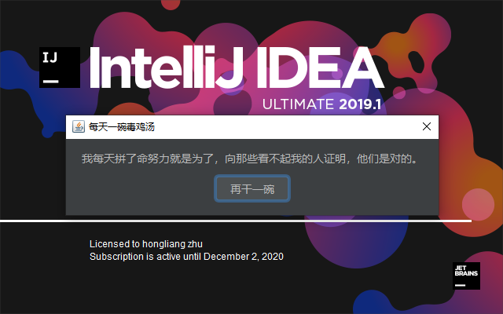

# 需求分析

在idea启动，也就是要开启我们这一天~~苦逼~~充满激情的编码工作时候，展示一碗鸡汤，给你打鸡血，当点击再干一碗的时候可以切换下一条内容。

问题：

1. 怎么抓住idea启动这个时间点

2. 如何显示一个对话框

3. 怎么添加按钮的点击事件

4. 鸡血从何处来？？

   

# 代码编写

Components组件

| 组件类型             | 描述                                                         | 接口                 | plugin.xml加载配置元素  |
| -------------------- | :----------------------------------------------------------- | -------------------- | ----------------------- |
| ApplicationComponent | 在IDEA启动的时候初始化。整个idea只有一个实例。               | ApplicationComponent | <application-component> |
| ProjectComponent     | Idea会为每个project实例创建对应级别的component。             | ProjectComponent     | <project-component>     |
| ModuleComponent      | Idea会为每一个已经加载的project中的每一个模块创建module级别的component。 | ModuleComponent      | <module-component>      |

先写一个类实现ApplicationComponent接口，整个idea只有一个实例。

```java
package com.hongliang.cheer;

import com.intellij.openapi.components.ApplicationComponent;

/**
 * @author Hongliang Zhu
 * @create 2020-07-22 11:09
 */
public class MyApplicatioComponent implements ApplicationComponent {
    @Override
    public void initComponent() {
        System.out.println("InitComponnet");
        CheerUpDialog cheerUpDialog = new CheerUpDialog();
        cheerUpDialog.show();
    }

    @Override
    public void disposeComponent() {

    }
}

```

然后写一个对话框出来，和JavaSwing编写的差不多

```java
package com.hongliang.cheer;
import com.intellij.openapi.ui.DialogWrapper;
import org.jetbrains.annotations.Nullable;
import javax.swing.*;
/**
 * @author Hongliang Zhu
 * @create 2020-07-22 11:13
 */
public class CheerUpDialog extends DialogWrapper {

    private JLabel label;

    protected CheerUpDialog() {
        super(true);
        setTitle("每天一碗毒鸡汤");
        init();
    }

    @Nullable
    @Override
    protected JComponent createCenterPanel() {
        JPanel panel = new JPanel();
        String contentAsString = ContentUtils.getContentAsString();
        label = new JLabel(contentAsString);
        panel.add(label);
        return panel;
    }

    @Override
    protected JComponent createSouthPanel() {
        JPanel panel = new JPanel();
        JButton btn = new JButton();
        btn.setText("再干一碗");
        btn.addActionListener(e -> {
            String contentAsString = ContentUtils.getContentAsString();
            label.setText(contentAsString);
        });
        panel.add(btn);
        return panel;
    }
}

```

其中用到了一个ContentUtils工具类，用来获取得到的鸡汤

```java
package com.hongliang.cheer;

import org.springframework.http.HttpStatus;
import org.springframework.http.ResponseEntity;
import org.springframework.web.client.RestClientException;
import org.springframework.web.client.RestTemplate;

import java.util.List;
import java.util.Map;

/**
 * @author Hongliang Zhu
 * @create 2020-07-22 13:06
 */
public class ContentUtils {

    public static String getContentAsString(){
        try {
            String content = null;
            RestTemplate restTemplate = new RestTemplate();
            ResponseEntity<Map> entity = restTemplate.getForEntity("https://api.nextrt.com/V1/Dutang", Map.class);
            HttpStatus statusCode = entity.getStatusCode();
            if(statusCode.is2xxSuccessful()){
                Map body = entity.getBody();
                List data = (List) body.get("data");
                Map map = (Map) data.get(0);
                content = (String) map.get("content");
                return content;

            }
        } catch (RestClientException e) {
            e.printStackTrace();
        }
        return null;
    }


}

```

当然还需要去xml中配置

```xml
<application-components>
    <component>
      <implementation-class>com.hongliang.cheer.MyApplicatioComponent</implementation-class>
    </component>
  </application-components>
```

# 安装运行



